This document describes how project resource items are collected and aggregated from multiple clusters and namespaces. The flow receives a project definition and cluster information as input, and outputs a unified list of resource items, errors, and loading status. This enables features such as project dashboards and resource listings by providing up-to-date information about all relevant resources across the infrastructure.

# Where is this flow used?

This flow is used multiple times in the codebase as represented in the following diagram:

```mermaid
graph TD;
      5997b13578fbacc135292ec3d4ee4b3bcc0c3fbfc8c31bdf78732c9601157658(frontend/…/project/ProjectDetails.tsx::ProjectDetailsContent) --> 685cb6efe89cbdecb96f92f48aed7ecf570b0623d5f4bb907d740929129900d7(frontend/…/project/useProjectResources.ts::useProjectItems):::mainFlowStyle

4a0abb8e677dee4d2d1ce7017930ed5991c3cbfe4dfd8cc2f4e7d0d94b023b05(frontend/…/project/ProjectList.tsx::Cell) --> 685cb6efe89cbdecb96f92f48aed7ecf570b0623d5f4bb907d740929129900d7(frontend/…/project/useProjectResources.ts::useProjectItems):::mainFlowStyle

4a0abb8e677dee4d2d1ce7017930ed5991c3cbfe4dfd8cc2f4e7d0d94b023b05(frontend/…/project/ProjectList.tsx::Cell) --> 685cb6efe89cbdecb96f92f48aed7ecf570b0623d5f4bb907d740929129900d7(frontend/…/project/useProjectResources.ts::useProjectItems):::mainFlowStyle

3877936ed66287b8b37cfbe1b3357abe8f8e727ae0d0e28b1a1f7f954954568d(frontend/…/project/ProjectList.tsx::ProjectList) --> 685cb6efe89cbdecb96f92f48aed7ecf570b0623d5f4bb907d740929129900d7(frontend/…/project/useProjectResources.ts::useProjectItems):::mainFlowStyle


classDef mainFlowStyle color:#000000,fill:#7CB9F4
classDef rootsStyle color:#000000,fill:#00FFF4
classDef Style1 color:#000000,fill:#00FFAA
classDef Style2 color:#000000,fill:#FFFF00
classDef Style3 color:#000000,fill:#AA7CB9

%% Swimm:
%% graph TD;
%%       5997b13578fbacc135292ec3d4ee4b3bcc0c3fbfc8c31bdf78732c9601157658(<SwmPath>[frontend/…/project/ProjectDetails.tsx](frontend/src/components/project/ProjectDetails.tsx)</SwmPath>::ProjectDetailsContent) --> 685cb6efe89cbdecb96f92f48aed7ecf570b0623d5f4bb907d740929129900d7(<SwmPath>[frontend/…/project/useProjectResources.ts](frontend/src/components/project/useProjectResources.ts)</SwmPath>::<SwmToken path="frontend/src/components/project/useProjectResources.ts" pos="28:4:4" line-data="export function useProjectItems(">`useProjectItems`</SwmToken>):::mainFlowStyle
%% 
%% 4a0abb8e677dee4d2d1ce7017930ed5991c3cbfe4dfd8cc2f4e7d0d94b023b05(<SwmPath>[frontend/…/project/ProjectList.tsx](frontend/src/components/project/ProjectList.tsx)</SwmPath>::Cell) --> 685cb6efe89cbdecb96f92f48aed7ecf570b0623d5f4bb907d740929129900d7(<SwmPath>[frontend/…/project/useProjectResources.ts](frontend/src/components/project/useProjectResources.ts)</SwmPath>::<SwmToken path="frontend/src/components/project/useProjectResources.ts" pos="28:4:4" line-data="export function useProjectItems(">`useProjectItems`</SwmToken>):::mainFlowStyle
%% 
%% 4a0abb8e677dee4d2d1ce7017930ed5991c3cbfe4dfd8cc2f4e7d0d94b023b05(<SwmPath>[frontend/…/project/ProjectList.tsx](frontend/src/components/project/ProjectList.tsx)</SwmPath>::Cell) --> 685cb6efe89cbdecb96f92f48aed7ecf570b0623d5f4bb907d740929129900d7(<SwmPath>[frontend/…/project/useProjectResources.ts](frontend/src/components/project/useProjectResources.ts)</SwmPath>::<SwmToken path="frontend/src/components/project/useProjectResources.ts" pos="28:4:4" line-data="export function useProjectItems(">`useProjectItems`</SwmToken>):::mainFlowStyle
%% 
%% 3877936ed66287b8b37cfbe1b3357abe8f8e727ae0d0e28b1a1f7f954954568d(<SwmPath>[frontend/…/project/ProjectList.tsx](frontend/src/components/project/ProjectList.tsx)</SwmPath>::ProjectList) --> 685cb6efe89cbdecb96f92f48aed7ecf570b0623d5f4bb907d740929129900d7(<SwmPath>[frontend/…/project/useProjectResources.ts](frontend/src/components/project/useProjectResources.ts)</SwmPath>::<SwmToken path="frontend/src/components/project/useProjectResources.ts" pos="28:4:4" line-data="export function useProjectItems(">`useProjectItems`</SwmToken>):::mainFlowStyle
%% 
%% 
%% classDef mainFlowStyle color:#000000,fill:#7CB9F4
%% classDef rootsStyle color:#000000,fill:#00FFF4
%% classDef Style1 color:#000000,fill:#00FFAA
%% classDef Style2 color:#000000,fill:#FFFF00
%% classDef Style3 color:#000000,fill:#AA7CB9
```

# Collecting Project Resource Items

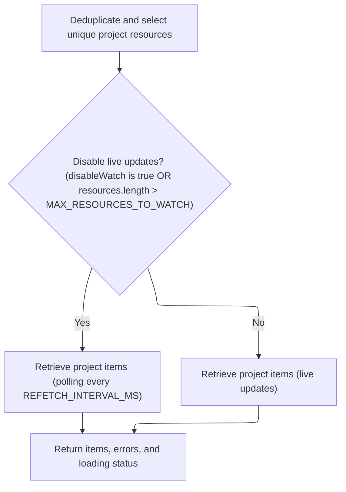

<SwmSnippet path="/frontend/src/components/project/useProjectResources.ts" line="28">

---

<SwmToken path="frontend/src/components/project/useProjectResources.ts" pos="28:4:4" line-data="export function useProjectItems(">`useProjectItems`</SwmToken> kicks off the flow by preparing a deduplicated list of API resources and then calls <SwmToken path="frontend/src/components/project/useProjectResources.ts" pos="38:17:17" line-data="  const { items, errors, isLoading } = useKubeLists(">`useKubeLists`</SwmToken> to actually fetch the resource items from the relevant clusters and namespaces. We call <SwmToken path="frontend/src/components/project/useProjectResources.ts" pos="38:17:17" line-data="  const { items, errors, isLoading } = useKubeLists(">`useKubeLists`</SwmToken> next because that's where the logic for querying and aggregating the actual Kubernetes objects lives, based on the resource definitions and project context.

```typescript
export function useProjectItems(
  project: ProjectDefinition,
  { disableWatch }: { disableWatch?: boolean } = { disableWatch: false }
) {
  const resources = useMemo(() => {
    const allResources = defaultApiResources;

    return uniqBy(allResources, r => apiResourceId(r));
  }, []);

  const { items, errors, isLoading } = useKubeLists(
    resources,
    project.clusters,
    MAX_ITEMS,
    disableWatch || resources.length > MAX_RESOURCES_TO_WATCH ? REFETCH_INTERVAL_MS : undefined,
    project.namespaces
  );

  return { items, errors, isLoading };
}
```

---

</SwmSnippet>

# Fetching and Aggregating Resource Lists

<SwmSnippet path="/frontend/src/components/advancedSearch/utils/useKubeLists.tsx" line="33">

---

In <SwmToken path="frontend/src/components/advancedSearch/utils/useKubeLists.tsx" pos="33:4:4" line-data="export const useKubeLists = (">`useKubeLists`</SwmToken>, we pull in default namespaces from Redux via <SwmToken path="frontend/src/components/advancedSearch/utils/useKubeLists.tsx" pos="40:7:7" line-data="  const defaultNamespaces = useNamespaces();">`useNamespaces`</SwmToken> if none are provided, so we always know which namespaces to query.

```tsx
export const useKubeLists = (
  resources: ApiResource[],
  clusters: string[],
  maxItems: number,
  refetchIntervalMs?: number,
  namespaces?: string[]
) => {
  const defaultNamespaces = useNamespaces();
```

---

</SwmSnippet>

<SwmSnippet path="/frontend/src/redux/filterSlice.ts" line="162">

---

<SwmToken path="frontend/src/redux/filterSlice.ts" pos="162:4:4" line-data="export const useNamespaces = () =&gt; {">`useNamespaces`</SwmToken> grabs the namespaces Set from Redux, turns it into an array, and memoizes it for use in the rest of the app.

```typescript
export const useNamespaces = () => {
  const namespacesSet = useSelector(({ filter }: { filter: FilterState }) => filter.namespaces);
  return useMemo(() => [...namespacesSet], [namespacesSet]);
};
```

---

</SwmSnippet>

<SwmSnippet path="/frontend/src/components/advancedSearch/utils/useKubeLists.tsx" line="41">

---

We just got the default namespaces from Redux. Now, back in <SwmToken path="frontend/src/components/project/useProjectResources.ts" pos="38:17:17" line-data="  const { items, errors, isLoading } = useKubeLists(">`useKubeLists`</SwmToken>, we map each resource to its corresponding <SwmToken path="frontend/src/components/advancedSearch/utils/useKubeLists.tsx" pos="47:5:5" line-data="            class extends KubeObject {">`KubeObject`</SwmToken> class (or create a fallback class if it's missing), then call <SwmToken path="frontend/src/components/advancedSearch/utils/useKubeLists.tsx" pos="59:3:3" line-data="    it.useList({">`useList`</SwmToken> on each class to fetch the actual resource lists. Next, we need to look at the implementation of <SwmToken path="frontend/src/components/advancedSearch/utils/useKubeLists.tsx" pos="59:3:3" line-data="    it.useList({">`useList`</SwmToken> in <SwmToken path="frontend/src/components/advancedSearch/utils/useKubeLists.tsx" pos="47:5:5" line-data="            class extends KubeObject {">`KubeObject`</SwmToken> to see how it handles the API calls per resource type.

```tsx
  const classes = useMemo(
    () =>
      resources
        .map(
          it =>
            (ResourceClasses as Record<string, KubeObjectClass>)[it.kind] ??
            class extends KubeObject {
              static kind = it.kind;
              static apiVersion = it.apiVersion;
              static apiName = it.pluralName;
              static isNamespaced = it.isNamespaced;
            }
        )
        .filter(Boolean) as KubeObjectClass[],
    [resources]
  );

  const data = classes.map(it =>
    it.useList({
      clusters,
      refetchInterval: refetchIntervalMs,
      namespace: namespaces ?? defaultNamespaces,
    })
  );

```

---

</SwmSnippet>

## Preparing Cluster and Namespace Requests

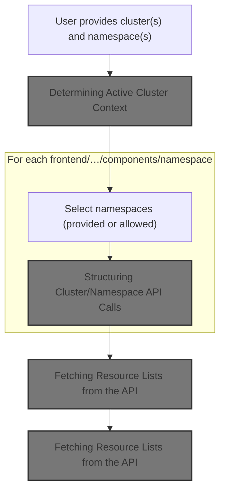

<SwmSnippet path="/frontend/src/lib/k8s/KubeObject.ts" line="330">

---

In <SwmToken path="frontend/src/lib/k8s/KubeObject.ts" pos="330:3:3" line-data="  static useList&lt;K extends KubeObject&gt;(">`useList`</SwmToken>, we figure out which clusters and namespaces to query by checking the input and falling back to selected clusters if needed. Next, we need to look at <SwmToken path="frontend/src/lib/k8s/KubeObject.ts" pos="346:7:7" line-data="    const fallbackClusters = useSelectedClusters();">`useSelectedClusters`</SwmToken> to see how it determines the current cluster context.

```typescript
  static useList<K extends KubeObject>(
    this: (new (...args: any) => K) & typeof KubeObject<any>,
    {
      cluster,
      clusters,
      namespace,
      refetchInterval,
      ...queryParams
    }: {
      cluster?: string;
      clusters?: string[];
      namespace?: string | string[];
      /** How often to refetch the list. Won't refetch by default. Disables watching if set. */
      refetchInterval?: number;
    } & QueryParameters = {}
  ) {
    const fallbackClusters = useSelectedClusters();

```

---

</SwmSnippet>

### Determining Active Cluster Context

See <SwmLink doc-title="Selecting Clusters Flow">[Selecting Clusters Flow](/.swm/selecting-clusters-flow.d7u1zdiw.sw.md)</SwmLink>

### Building List Requests for Each Cluster/Namespace

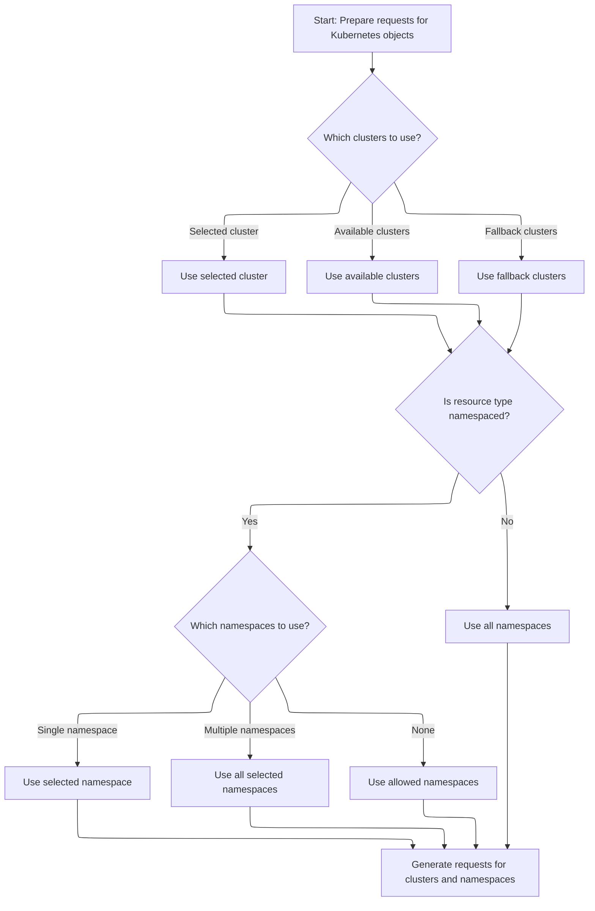

<SwmSnippet path="/frontend/src/lib/k8s/KubeObject.ts" line="348">

---

We just got the selected clusters. Back in <SwmToken path="frontend/src/components/advancedSearch/utils/useKubeLists.tsx" pos="59:3:3" line-data="    it.useList({">`useList`</SwmToken>, we build a list of requests for each cluster and namespace combo using <SwmToken path="frontend/src/lib/k8s/KubeObject.ts" pos="361:3:3" line-data="      return makeListRequests(">`makeListRequests`</SwmToken>. This sets up the exact API calls we need to make for each resource. Next, we need to see how <SwmToken path="frontend/src/lib/k8s/KubeObject.ts" pos="361:3:3" line-data="      return makeListRequests(">`makeListRequests`</SwmToken> structures these requests.

```typescript
    // Create requests for each cluster and namespace
    const requests = useMemo(() => {
      const clusterList = cluster
        ? [cluster]
        : clusters || (fallbackClusters.length === 0 ? [''] : fallbackClusters);

      const namespacesFromParams =
        typeof namespace === 'string'
          ? [namespace]
          : Array.isArray(namespace)
          ? namespace
          : undefined;

      return makeListRequests(
        clusterList,
        getAllowedNamespaces,
        this.isNamespaced,
        namespacesFromParams
      );
    }, [cluster, clusters, fallbackClusters, namespace, this.isNamespaced]);

```

---

</SwmSnippet>

### Structuring Cluster/Namespace API Calls

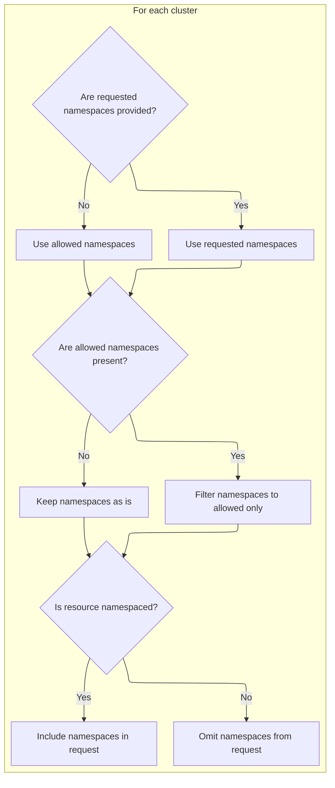

<SwmSnippet path="/frontend/src/lib/k8s/api/v2/useKubeObjectList.ts" line="374">

---

<SwmToken path="frontend/src/lib/k8s/api/v2/useKubeObjectList.ts" pos="374:4:4" line-data="export function makeListRequests(">`makeListRequests`</SwmToken> builds the list of <SwmPath>[frontend/…/components/namespace/](frontend/src/components/namespace/)</SwmPath> pairs to query, filtering namespaces based on what's allowed for each cluster. Next, we need to look at <SwmToken path="frontend/src/lib/k8s/api/v2/useKubeObjectList.ts" pos="376:1:1" line-data="  getAllowedNamespaces: (cluster: string | null) =&gt; string[],">`getAllowedNamespaces`</SwmToken> to see how those allowed namespaces are determined.

```typescript
export function makeListRequests(
  clusters: string[],
  getAllowedNamespaces: (cluster: string | null) => string[],
  isResourceNamespaced: boolean,
  requestedNamespaces: string[] = []
): Array<{ cluster: string; namespaces?: string[] }> {
  return clusters.map(cluster => {
    const allowedNamespaces = getAllowedNamespaces(cluster);

    let namespaces = requestedNamespaces.length > 0 ? requestedNamespaces : allowedNamespaces;

    if (allowedNamespaces.length) {
      namespaces = namespaces.filter(ns => allowedNamespaces.includes(ns));
    }

    return { cluster, namespaces: isResourceNamespaced ? namespaces : undefined };
  });
}
```

---

</SwmSnippet>

### Filtering Namespaces by Cluster Settings

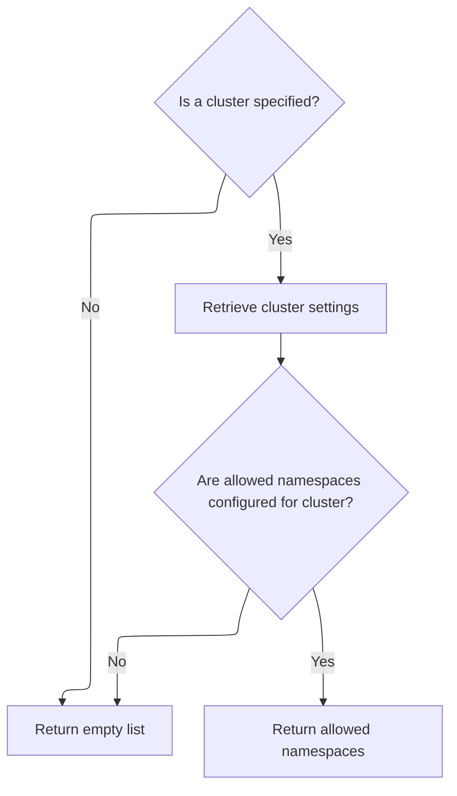

<SwmSnippet path="/frontend/src/lib/k8s/KubeObject.ts" line="37">

---

In <SwmToken path="frontend/src/lib/k8s/KubeObject.ts" pos="37:2:2" line-data="function getAllowedNamespaces(cluster: string | null = getCluster()): string[] {">`getAllowedNamespaces`</SwmToken>, we check if a cluster is provided—if not, we bail out with an empty list. Next, we need to load the cluster's settings from the cluster module to see which namespaces are allowed.

```typescript
function getAllowedNamespaces(cluster: string | null = getCluster()): string[] {
  if (!cluster) {
    return [];
  }

```

---

</SwmSnippet>

<SwmSnippet path="/frontend/src/lib/k8s/KubeObject.ts" line="42">

---

We just loaded the cluster settings. Back in <SwmToken path="frontend/src/lib/k8s/KubeObject.ts" pos="37:2:2" line-data="function getAllowedNamespaces(cluster: string | null = getCluster()): string[] {">`getAllowedNamespaces`</SwmToken>, we return the <SwmToken path="frontend/src/lib/k8s/KubeObject.ts" pos="43:5:5" line-data="  return clusterSettings.allowedNamespaces || [];">`allowedNamespaces`</SwmToken> array (or an empty array if it's missing), which controls which namespaces are included in the API requests.

```typescript
  const clusterSettings = loadClusterSettings(cluster);
  return clusterSettings.allowedNamespaces || [];
}
```

---

</SwmSnippet>

### Fetching Resource Lists from the API

<SwmSnippet path="/frontend/src/lib/k8s/KubeObject.ts" line="369">

---

We just built the requests list. Back in <SwmToken path="frontend/src/components/advancedSearch/utils/useKubeLists.tsx" pos="59:3:3" line-data="    it.useList({">`useList`</SwmToken>, we call <SwmToken path="frontend/src/lib/k8s/KubeObject.ts" pos="369:7:7" line-data="    const result = useKubeObjectList&lt;K&gt;({">`useKubeObjectList`</SwmToken> with those requests to actually fetch the resource lists from the API. Next, we need to see how <SwmToken path="frontend/src/lib/k8s/KubeObject.ts" pos="369:7:7" line-data="    const result = useKubeObjectList&lt;K&gt;({">`useKubeObjectList`</SwmToken> handles the fetching and aggregation.

```typescript
    const result = useKubeObjectList<K>({
      queryParams: queryParams,
      kubeObjectClass: this,
      requests,
      refetchInterval,
    });

    return result;
  }
```

---

</SwmSnippet>

## Aggregating Multi-Cluster Resource Queries

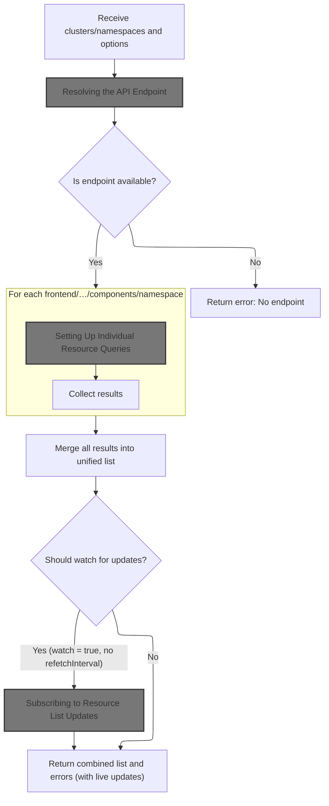

<SwmSnippet path="/frontend/src/lib/k8s/api/v2/useKubeObjectList.ts" line="399">

---

In <SwmToken path="frontend/src/lib/k8s/api/v2/useKubeObjectList.ts" pos="399:4:4" line-data="export function useKubeObjectList&lt;K extends KubeObject&gt;({">`useKubeObjectList`</SwmToken>, we set up the logic to fetch and aggregate resource lists from all requested clusters and namespaces. We call <SwmToken path="frontend/src/lib/k8s/api/v2/useKubeObjectList.ts" pos="420:17:17" line-data="  const { endpoint, error: endpointError } = useEndpoints(">`useEndpoints`</SwmToken> next to resolve the correct API endpoint for the resource, which is needed before we can actually make the queries.

```typescript
export function useKubeObjectList<K extends KubeObject>({
  requests,
  kubeObjectClass,
  queryParams,
  watch = true,
  refetchInterval,
}: {
  requests: Array<{ cluster: string; namespaces?: string[] }>;
  /** Class to instantiate the object with */
  kubeObjectClass: (new (...args: any) => K) & typeof KubeObject<any>;
  queryParams?: QueryParameters;
  /** Watch for updates @default true */
  watch?: boolean;
  /** How often to refetch the list. Won't refetch by default. Disables watching if set. */
  refetchInterval?: number;
}): [Array<K> | null, ApiError | null] &
  QueryListResponse<Array<ListResponse<K> | undefined | null>, K, ApiError> {
  const maybeNamespace = requests.find(it => it.namespaces)?.namespaces?.[0];

  // Get working endpoint from the first cluster
  // Now if clusters have different apiVersions for the same resource for example, this will not work
  const { endpoint, error: endpointError } = useEndpoints(
    kubeObjectClass.apiEndpoint.apiInfo,
    requests[0]?.cluster,
    maybeNamespace
  );

```

---

</SwmSnippet>

### Resolving the API Endpoint

<SwmSnippet path="/frontend/src/lib/k8s/api/v2/hooks.ts" line="215">

---

<SwmToken path="frontend/src/lib/k8s/api/v2/hooks.ts" pos="215:4:4" line-data="export const useEndpoints = (">`useEndpoints`</SwmToken> checks if there's more than one possible endpoint. If so, it calls <SwmToken path="frontend/src/lib/k8s/api/v2/hooks.ts" pos="223:9:9" line-data="    queryFn: () =&gt; getWorkingEndpoint(endpoints, cluster!, namespace),">`getWorkingEndpoint`</SwmToken> to find one that works for the <SwmPath>[frontend/…/components/namespace/](frontend/src/components/namespace/)</SwmPath>. Otherwise, it just returns the single endpoint. Next, we need to see how <SwmToken path="frontend/src/lib/k8s/api/v2/hooks.ts" pos="223:9:9" line-data="    queryFn: () =&gt; getWorkingEndpoint(endpoints, cluster!, namespace),">`getWorkingEndpoint`</SwmToken> actually tests the endpoints.

```typescript
export const useEndpoints = (
  endpoints: KubeObjectEndpoint[],
  cluster: string,
  namespace?: string
) => {
  const { data: endpoint, error } = useQuery<KubeObjectEndpoint, ApiError>({
    enabled: endpoints.length > 1,
    queryKey: ['endpoints', endpoints],
    queryFn: () => getWorkingEndpoint(endpoints, cluster!, namespace),
  });
  if (endpoints.length === 1) return { endpoint: endpoints[0], error: null };

  return { endpoint, error };
};
```

---

</SwmSnippet>

### Testing Endpoints for Cluster Compatibility

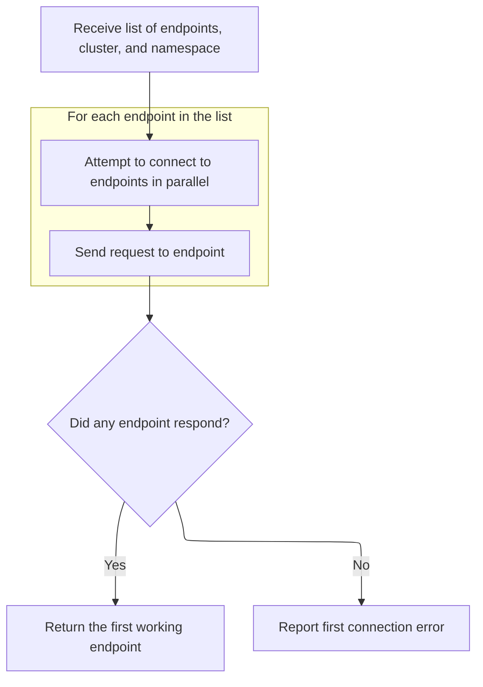

<SwmSnippet path="/frontend/src/lib/k8s/api/v2/hooks.ts" line="193">

---

In <SwmToken path="frontend/src/lib/k8s/api/v2/hooks.ts" pos="193:2:2" line-data="const getWorkingEndpoint = async (">`getWorkingEndpoint`</SwmToken>, we try each endpoint with a GET request using <SwmToken path="frontend/src/lib/k8s/api/v2/hooks.ts" pos="199:3:3" line-data="    return clusterFetch(KubeObjectEndpoint.toUrl(endpoint, namespace), {">`clusterFetch`</SwmToken>, falling back to the current cluster if needed. Next, we need to see how <SwmToken path="frontend/src/lib/k8s/api/v2/hooks.ts" pos="199:3:3" line-data="    return clusterFetch(KubeObjectEndpoint.toUrl(endpoint, namespace), {">`clusterFetch`</SwmToken> and <SwmToken path="frontend/src/lib/k8s/api/v2/hooks.ts" pos="201:8:8" line-data="      cluster: cluster ?? getCluster() ?? &#39;&#39;,">`getCluster`</SwmToken> work to actually make the request and determine the cluster context.

```typescript
const getWorkingEndpoint = async (
  endpoints: KubeObjectEndpoint[],
  cluster: string,
  namespace?: string
) => {
  const promises = endpoints.map(endpoint => {
    return clusterFetch(KubeObjectEndpoint.toUrl(endpoint, namespace), {
      method: 'GET',
      cluster: cluster ?? getCluster() ?? '',
```

---

</SwmSnippet>

<SwmSnippet path="/frontend/src/lib/k8s/api/v2/hooks.ts" line="198">

---

We just got the cluster context. Back in <SwmToken path="frontend/src/lib/k8s/api/v2/hooks.ts" pos="193:2:2" line-data="const getWorkingEndpoint = async (">`getWorkingEndpoint`</SwmToken>, we use <SwmToken path="frontend/src/lib/k8s/api/v2/hooks.ts" pos="204:3:5" line-data="  return Promise.any(promises).catch((aggregateError: AggregateError) =&gt; {">`Promise.any`</SwmToken> to resolve the first working endpoint, or throw if all fail. This means the next step is to see how <SwmToken path="frontend/src/lib/k8s/api/v2/hooks.ts" pos="199:3:3" line-data="    return clusterFetch(KubeObjectEndpoint.toUrl(endpoint, namespace), {">`clusterFetch`</SwmToken> actually performs the network request and error handling.

```typescript
  const promises = endpoints.map(endpoint => {
    return clusterFetch(KubeObjectEndpoint.toUrl(endpoint, namespace), {
      method: 'GET',
      cluster: cluster ?? getCluster() ?? '',
    }).then(() => endpoint);
  });
  return Promise.any(promises).catch((aggregateError: AggregateError) => {
    // when no endpoint is available, throw an error
    throw aggregateError.errors[0];
  });
};
```

---

</SwmSnippet>

### Performing Cluster API Requests

See <SwmLink doc-title="Preparing and Sending Cluster Requests">[Preparing and Sending Cluster Requests](/.swm/preparing-and-sending-cluster-requests.pl0iudvp.sw.md)</SwmLink>

### Running Resource List Queries

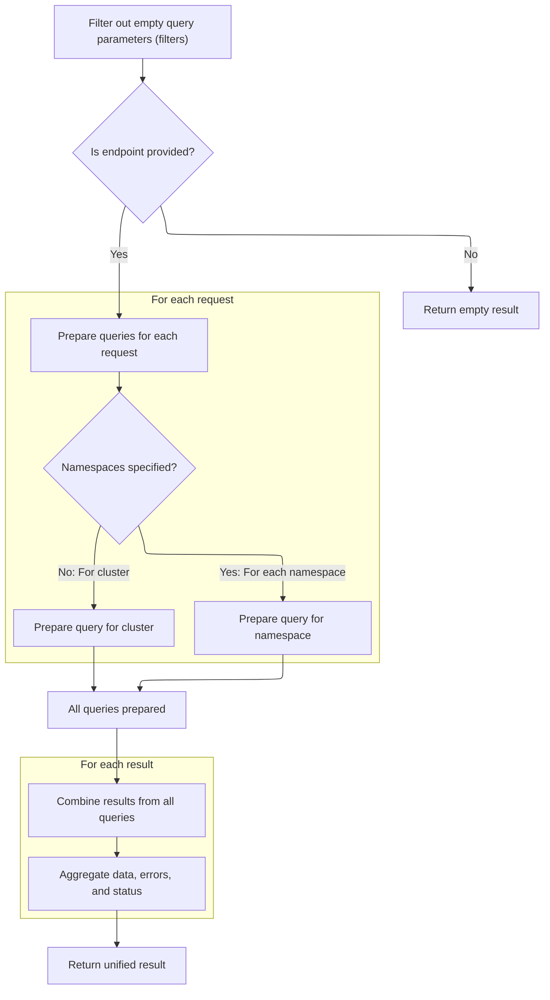

<SwmSnippet path="/frontend/src/lib/k8s/api/v2/useKubeObjectList.ts" line="426">

---

We just got the endpoint. Back in <SwmToken path="frontend/src/lib/k8s/KubeObject.ts" pos="369:7:7" line-data="    const result = useKubeObjectList&lt;K&gt;({">`useKubeObjectList`</SwmToken>, we clean up the query parameters, then use <SwmToken path="frontend/src/lib/k8s/api/v2/useKubeObjectList.ts" pos="458:7:7" line-data="  const query = useQueries({">`useQueries`</SwmToken> to run all the resource list queries and aggregate their results. Next, we need to look at how <SwmToken path="frontend/src/lib/k8s/api/v2/useKubeObjectList.ts" pos="436:1:1" line-data="                  kubeObjectListQuery&lt;K&gt;(">`kubeObjectListQuery`</SwmToken> sets up each individual query.

```typescript
  const cleanedUpQueryParams = Object.fromEntries(
    Object.entries(queryParams ?? {}).filter(([, value]) => value !== undefined && value !== '')
  );

  const queries = useMemo(
    () =>
      endpoint
        ? requests.flatMap(({ cluster, namespaces }) =>
            namespaces && namespaces.length > 0
              ? namespaces.map(namespace =>
                  kubeObjectListQuery<K>(
                    kubeObjectClass,
                    endpoint,
                    namespace,
                    cluster,
                    cleanedUpQueryParams,
                    refetchInterval
                  )
                )
              : kubeObjectListQuery<K>(
                  kubeObjectClass,
                  endpoint,
                  undefined,
                  cluster,
                  cleanedUpQueryParams,
                  refetchInterval
                )
          )
        : [],
    [requests, kubeObjectClass, endpoint, cleanedUpQueryParams]
  );

  const query = useQueries({
    queries,
    combine(results) {
      return {
        data: results.map(result => result.data),
        clusterResults: results.reduce((acc, result) => {
          if (result.data && result.data.cluster) {
            acc[result.data.cluster] = {
              data: result.data,
              error: result.error,
              errors: result.error ? [result.error] : null,
              isError: result.isError,
              isFetching: result.isFetching,
              isLoading: result.isLoading,
              isSuccess: result.isSuccess,
              items: result?.data?.list?.items ?? null,
              status: result.status,
            };
          }
          return acc;
        }, {} as Record<string, QueryListResponse<any, K, ApiError>>),
        items: results.every(result => result.data === null)
          ? null
          : results.flatMap(result => result?.data?.list?.items ?? []),
        errors: results.map(result => result.error).filter(Boolean),
        isError: results.some(result => result.isError),
        isLoading: results.some(result => result.isLoading),
        isFetching: results.some(result => result.isFetching),
        isSuccess: results.every(result => result.isSuccess),
      };
    },
  });

```

---

</SwmSnippet>

### Setting Up Individual Resource Queries

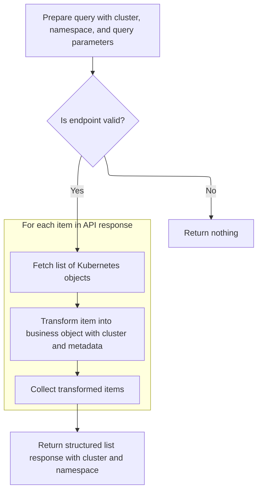

<SwmSnippet path="/frontend/src/lib/k8s/api/v2/useKubeObjectList.ts" line="63">

---

In <SwmToken path="frontend/src/lib/k8s/api/v2/useKubeObjectList.ts" pos="63:4:4" line-data="export function kubeObjectListQuery&lt;K extends KubeObject&gt;(">`kubeObjectListQuery`</SwmToken>, we set up the query for each <SwmPath>[frontend/…/components/namespace/](frontend/src/components/namespace/)</SwmPath>, using <SwmToken path="frontend/src/lib/k8s/api/v2/useKubeObjectList.ts" pos="88:15:15" line-data="        const list: KubeList&lt;any&gt; = await clusterFetch(">`clusterFetch`</SwmToken> to get the list and mapping each item to a <SwmToken path="frontend/src/lib/k8s/api/v2/useKubeObjectList.ts" pos="63:10:10" line-data="export function kubeObjectListQuery&lt;K extends KubeObject&gt;(">`KubeObject`</SwmToken> instance. Next, we need to see how <SwmToken path="frontend/src/lib/k8s/api/v2/useKubeObjectList.ts" pos="88:15:15" line-data="        const list: KubeList&lt;any&gt; = await clusterFetch(">`clusterFetch`</SwmToken> actually performs the fetch and returns the data.

```typescript
export function kubeObjectListQuery<K extends KubeObject>(
  kubeObjectClass: KubeObjectClass,
  endpoint: KubeObjectEndpoint,
  namespace: string | undefined,
  cluster: string,
  queryParams: QueryParameters,
  refetchInterval?: number
): QueryObserverOptions<ListResponse<K> | undefined | null, ApiError> {
  return {
    placeholderData: null,
    refetchInterval,
    queryKey: [
      'kubeObject',
      'list',
      kubeObjectClass.apiVersion,
      kubeObjectClass.apiName,
      cluster,
      namespace ?? '',
      queryParams,
    ],
    queryFn: async () => {
      // If no valid endpoint is passed, don't make the request
      if (!endpoint) return;

      try {
        const list: KubeList<any> = await clusterFetch(
          makeUrl([KubeObjectEndpoint.toUrl(endpoint!, namespace)], queryParams),
          {
            cluster,
          }
        ).then(it => it.json());
```

---

</SwmSnippet>

<SwmSnippet path="/frontend/src/lib/k8s/api/v2/useKubeObjectList.ts" line="94">

---

We just got the raw list from the API. Back in <SwmToken path="frontend/src/lib/k8s/api/v2/useKubeObjectList.ts" pos="63:4:4" line-data="export function kubeObjectListQuery&lt;K extends KubeObject&gt;(">`kubeObjectListQuery`</SwmToken>, we wrap each item as a <SwmToken path="frontend/src/components/advancedSearch/utils/useKubeLists.tsx" pos="47:5:5" line-data="            class extends KubeObject {">`KubeObject`</SwmToken>, attach cluster info, and return the structured response. If there's an error, we attach <SwmPath>[frontend/…/components/namespace/](frontend/src/components/namespace/)</SwmPath> info to the error before throwing.

```typescript
        list.items = list.items.map(item => {
          const itm = new kubeObjectClass({
            ...item,
            kind: list.kind.replace('List', ''),
            apiVersion: list.apiVersion,
          });
          itm.cluster = cluster;
          return itm;
        });

        const response: ListResponse<K> = {
          list: list as KubeList<K>,
          cluster,
          namespace,
        };

        return response;
      } catch (e) {
        // Rethrow error with cluster and namespace information
        if (e instanceof ApiError) {
          e.cluster = cluster;
          e.namespace = namespace;
        }
        throw e;
      }
    },
  };
}
```

---

</SwmSnippet>

### Managing Live Updates for Resource Lists

```mermaid
%%{init: {"flowchart": {"defaultRenderer": "elk"}} }%%
flowchart TD
  node1["Check if real-time watching is needed (shouldWatch)"] --> node2{"Are there new resource lists to watch?"}
  click node1 openCode "frontend/src/lib/k8s/api/v2/useKubeObjectList.ts:491:492"
  node2 -->|"Yes"| node3["Add new lists to watch (listsNotYetWatched)"]
  click node2 openCode "frontend/src/lib/k8s/api/v2/useKubeObjectList.ts:497:511"
  node2 -->|"No"| node4
  node3 --> node4
  
  subgraph loop1["For each watched list (listsToWatch)"]
    node4 --> node5{"Should this list stop being watched? (listsToStopWatching)"}
    click node5 openCode "frontend/src/lib/k8s/api/v2/useKubeObjectList.ts:516:523"
    node5 -->|"Yes"| node6["Remove from watch list"]
    click node6 openCode "frontend/src/lib/k8s/api/v2/useKubeObjectList.ts:525:527"
    node5 -->|"No"| node7["Keep watching"]
    node6 --> node7
  end
  node7 --> node8["Start or stop watching resource lists based on shouldWatch"]
  click node8 openCode "frontend/src/lib/k8s/api/v2/useKubeObjectList.ts:529:534"
classDef HeadingStyle fill:#777777,stroke:#333,stroke-width:2px;

%% Swimm:
%% %%{init: {"flowchart": {"defaultRenderer": "elk"}} }%%
%% flowchart TD
%%   node1["Check if real-time watching is needed (<SwmToken path="frontend/src/lib/k8s/api/v2/useKubeObjectList.ts" pos="491:3:3" line-data="  const shouldWatch = watch &amp;&amp; !refetchInterval &amp;&amp; !query.isLoading;">`shouldWatch`</SwmToken>)"] --> node2{"Are there new resource lists to watch?"}
%%   click node1 openCode "<SwmPath>[frontend/…/v2/useKubeObjectList.ts](frontend/src/lib/k8s/api/v2/useKubeObjectList.ts)</SwmPath>:491:492"
%%   node2 -->|"Yes"| node3["Add new lists to watch (<SwmToken path="frontend/src/lib/k8s/api/v2/useKubeObjectList.ts" pos="497:3:3" line-data="  const listsNotYetWatched = query.data">`listsNotYetWatched`</SwmToken>)"]
%%   click node2 openCode "<SwmPath>[frontend/…/v2/useKubeObjectList.ts](frontend/src/lib/k8s/api/v2/useKubeObjectList.ts)</SwmPath>:497:511"
%%   node2 -->|"No"| node4
%%   node3 --> node4
%%   
%%   subgraph loop1["For each watched list (<SwmToken path="frontend/src/lib/k8s/api/v2/useKubeObjectList.ts" pos="493:4:4" line-data="  const [listsToWatch, setListsToWatch] = useState&lt;">`listsToWatch`</SwmToken>)"]
%%     node4 --> node5{"Should this list stop being watched? (<SwmToken path="frontend/src/lib/k8s/api/v2/useKubeObjectList.ts" pos="516:3:3" line-data="  const listsToStopWatching = listsToWatch.filter(">`listsToStopWatching`</SwmToken>)"}
%%     click node5 openCode "<SwmPath>[frontend/…/v2/useKubeObjectList.ts](frontend/src/lib/k8s/api/v2/useKubeObjectList.ts)</SwmPath>:516:523"
%%     node5 -->|"Yes"| node6["Remove from watch list"]
%%     click node6 openCode "<SwmPath>[frontend/…/v2/useKubeObjectList.ts](frontend/src/lib/k8s/api/v2/useKubeObjectList.ts)</SwmPath>:525:527"
%%     node5 -->|"No"| node7["Keep watching"]
%%     node6 --> node7
%%   end
%%   node7 --> node8["Start or stop watching resource lists based on <SwmToken path="frontend/src/lib/k8s/api/v2/useKubeObjectList.ts" pos="491:3:3" line-data="  const shouldWatch = watch &amp;&amp; !refetchInterval &amp;&amp; !query.isLoading;">`shouldWatch`</SwmToken>"]
%%   click node8 openCode "<SwmPath>[frontend/…/v2/useKubeObjectList.ts](frontend/src/lib/k8s/api/v2/useKubeObjectList.ts)</SwmPath>:529:534"
%% classDef HeadingStyle fill:#777777,stroke:#333,stroke-width:2px;
```

<SwmSnippet path="/frontend/src/lib/k8s/api/v2/useKubeObjectList.ts" line="491">

---

We just got the query results. Back in <SwmToken path="frontend/src/lib/k8s/KubeObject.ts" pos="369:7:7" line-data="    const result = useKubeObjectList&lt;K&gt;({">`useKubeObjectList`</SwmToken>, we manage a watch list for live updates, only updating it when new clusters/namespaces or resourceVersions appear. This keeps websocket connections stable. Next, we call <SwmToken path="frontend/src/lib/k8s/api/v2/useKubeObjectList.ts" pos="529:1:1" line-data="  useWatchKubeObjectLists({">`useWatchKubeObjectLists`</SwmToken> to actually set up the live update listeners.

```typescript
  const shouldWatch = watch && !refetchInterval && !query.isLoading;

  const [listsToWatch, setListsToWatch] = useState<
    { cluster: string; namespace?: string; resourceVersion: string }[]
  >([]);

  const listsNotYetWatched = query.data
    .filter(Boolean)
    .filter(
      data =>
        listsToWatch.find(
          // resourceVersion is intentionally omitted to avoid recreating WS connection when list is updated
          watching => watching.cluster === data?.cluster && watching.namespace === data.namespace
        ) === undefined
    )
    .map(data => ({
      cluster: data!.cluster,
      namespace: data!.namespace,
      resourceVersion: data!.list.metadata.resourceVersion,
    }));

  if (listsNotYetWatched.length > 0) {
    setListsToWatch([...listsToWatch, ...listsNotYetWatched]);
  }

  const listsToStopWatching = listsToWatch.filter(
    watching =>
      requests.find(request =>
        watching.cluster === request?.cluster && request.namespaces && watching.namespace
          ? request.namespaces?.includes(watching.namespace)
          : true
      ) === undefined
  );

  if (listsToStopWatching.length > 0) {
    setListsToWatch(listsToWatch.filter(it => !listsToStopWatching.includes(it)));
  }

  useWatchKubeObjectLists({
    lists: shouldWatch ? listsToWatch : [],
    endpoint,
    kubeObjectClass,
    queryParams: cleanedUpQueryParams,
  });

```

---

</SwmSnippet>

### Subscribing to Resource List Updates

See <SwmLink doc-title="Keeping Kubernetes Resource Lists Up to Date">[Keeping Kubernetes Resource Lists Up to Date](/.swm/keeping-kubernetes-resource-lists-up-to-date.ml1atvg7.sw.md)</SwmLink>

### Returning Aggregated Results

```mermaid
%%{init: {"flowchart": {"defaultRenderer": "elk"}} }%%
flowchart TD
  node1{"Is there an endpoint error?"}
  click node1 openCode "frontend/src/lib/k8s/api/v2/useKubeObjectList.ts:540:542"
  node1 -->|"Yes"| node2[Return: items = [], errors = [endpoint error], error = endpoint error]
  click node2 openCode "frontend/src/lib/k8s/api/v2/useKubeObjectList.ts:540:542"
  node1 -->|"No"| node3{"Are there other errors?"}
  click node3 openCode "frontend/src/lib/k8s/api/v2/useKubeObjectList.ts:536:542"
  node3 -->|"Yes"| node4["Return: items = query items, errors = filtered errors, error = first error"]
  click node4 openCode "frontend/src/lib/k8s/api/v2/useKubeObjectList.ts:536:542"
  node3 -->|"No"| node5["Return: items = query items, errors = null, error = null"]
  click node5 openCode "frontend/src/lib/k8s/api/v2/useKubeObjectList.ts:540:542"
  node2 --> node6["Include query status and cluster results"]
  node4 --> node6
  node5 --> node6
  click node6 openCode "frontend/src/lib/k8s/api/v2/useKubeObjectList.ts:543:547"
  node6 --> loop1
  subgraph loop1["For each result to yield"]
    loop1a["Yield items"]
    click loop1a openCode "frontend/src/lib/k8s/api/v2/useKubeObjectList.ts:549:549"
    loop1b["Yield error"]
    click loop1b openCode "frontend/src/lib/k8s/api/v2/useKubeObjectList.ts:550:550"
  end
classDef HeadingStyle fill:#777777,stroke:#333,stroke-width:2px;

%% Swimm:
%% %%{init: {"flowchart": {"defaultRenderer": "elk"}} }%%
%% flowchart TD
%%   node1{"Is there an endpoint error?"}
%%   click node1 openCode "<SwmPath>[frontend/…/v2/useKubeObjectList.ts](frontend/src/lib/k8s/api/v2/useKubeObjectList.ts)</SwmPath>:540:542"
%%   node1 -->|"Yes"| node2[Return: items = [], errors = [endpoint error], error = endpoint error]
%%   click node2 openCode "<SwmPath>[frontend/…/v2/useKubeObjectList.ts](frontend/src/lib/k8s/api/v2/useKubeObjectList.ts)</SwmPath>:540:542"
%%   node1 -->|"No"| node3{"Are there other errors?"}
%%   click node3 openCode "<SwmPath>[frontend/…/v2/useKubeObjectList.ts](frontend/src/lib/k8s/api/v2/useKubeObjectList.ts)</SwmPath>:536:542"
%%   node3 -->|"Yes"| node4["Return: items = query items, errors = filtered errors, error = first error"]
%%   click node4 openCode "<SwmPath>[frontend/…/v2/useKubeObjectList.ts](frontend/src/lib/k8s/api/v2/useKubeObjectList.ts)</SwmPath>:536:542"
%%   node3 -->|"No"| node5["Return: items = query items, errors = null, error = null"]
%%   click node5 openCode "<SwmPath>[frontend/…/v2/useKubeObjectList.ts](frontend/src/lib/k8s/api/v2/useKubeObjectList.ts)</SwmPath>:540:542"
%%   node2 --> node6["Include query status and cluster results"]
%%   node4 --> node6
%%   node5 --> node6
%%   click node6 openCode "<SwmPath>[frontend/…/v2/useKubeObjectList.ts](frontend/src/lib/k8s/api/v2/useKubeObjectList.ts)</SwmPath>:543:547"
%%   node6 --> loop1
%%   subgraph loop1["For each result to yield"]
%%     loop1a["Yield items"]
%%     click loop1a openCode "<SwmPath>[frontend/…/v2/useKubeObjectList.ts](frontend/src/lib/k8s/api/v2/useKubeObjectList.ts)</SwmPath>:549:549"
%%     loop1b["Yield error"]
%%     click loop1b openCode "<SwmPath>[frontend/…/v2/useKubeObjectList.ts](frontend/src/lib/k8s/api/v2/useKubeObjectList.ts)</SwmPath>:550:550"
%%   end
%% classDef HeadingStyle fill:#777777,stroke:#333,stroke-width:2px;
```

<SwmSnippet path="/frontend/src/lib/k8s/api/v2/useKubeObjectList.ts" line="536">

---

We just finished the watch setup. Back in <SwmToken path="frontend/src/lib/k8s/KubeObject.ts" pos="369:7:7" line-data="    const result = useKubeObjectList&lt;K&gt;({">`useKubeObjectList`</SwmToken>, we return the aggregated items, errors, and status flags, so the caller gets a unified result for all clusters/namespaces.

```typescript
  const errors = query.errors.filter(it => it !== null);

  // @ts-ignore - TS compiler gets confused with iterators
  return {
    items: endpointError ? [] : query.items,
    errors: endpointError ? [endpointError] : errors.length > 0 ? errors : null,
    error: endpointError ?? query.errors.find(it => it !== null) ?? null,
    clusterResults: query.clusterResults,
    isError: query.isError,
    isLoading: query.isLoading,
    isFetching: query.isFetching,
    isSuccess: query.isSuccess,
    *[Symbol.iterator](): ArrayIterator<ApiError | K[] | null> {
      yield query.items;
      yield endpointError ?? query.errors.find(it => it !== null) ?? null;
    },
  };
}
```

---

</SwmSnippet>

## Final Aggregation and Error Handling

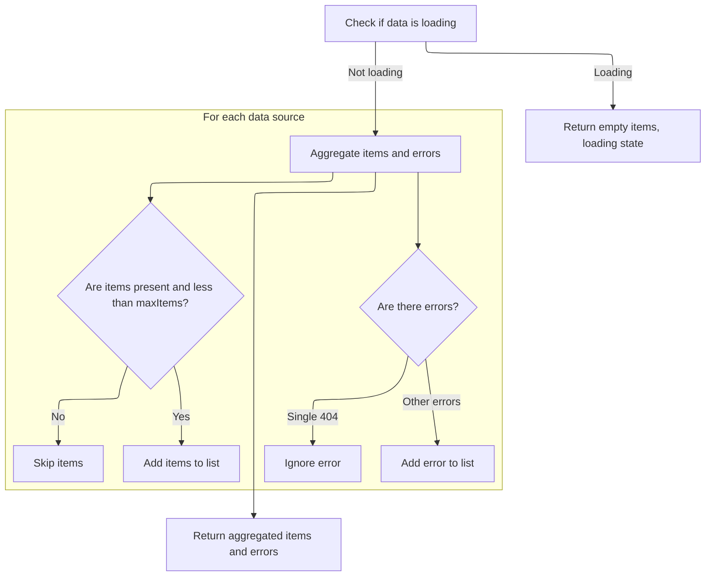

<SwmSnippet path="/frontend/src/components/advancedSearch/utils/useKubeLists.tsx" line="66">

---

We just got the resource lists from `KubeObject.useList`. Back in <SwmToken path="frontend/src/components/project/useProjectResources.ts" pos="38:17:17" line-data="  const { items, errors, isLoading } = useKubeLists(">`useKubeLists`</SwmToken>, we flatten and filter the items, only including lists under the <SwmToken path="frontend/src/components/advancedSearch/utils/useKubeLists.tsx" pos="73:18:18" line-data="      if (it.items &amp;&amp; it.items.length &lt; maxItems) {">`maxItems`</SwmToken> limit, and group errors by resource. The final result is returned for use in the UI.

```tsx
  const [items, setItems] = useState<any[]>([]);
  const isLoading = data.some(it => !it.items && !it.isError);

  useEffect(() => {
    if (isLoading) return;

    const newItems = data.flatMap(it => {
      if (it.items && it.items.length < maxItems) {
        return it.items;
      } else {
        // The amount of items exceeds the limit
        return [];
      }
    });

    setItems(oldItems => (equal(oldItems, newItems) ? oldItems : newItems));
  }, [data, classes, isLoading]);

  const errors = useMemo(() => {
    return data
      .map((it, index) => {
        const resource = resources[index];

        if (it.errors && it.errors.length === 1 && it.errors[0].status === 404) {
          return;
        }

        if (it.errors?.length) {
          return { resource, errors: it.errors };
        }
      })
      .filter(Boolean) as { resource: ApiResource; errors: ApiError[] }[];
  }, [data, resources]);

  return { items, errors, isLoading };
};
```

---

</SwmSnippet>

&nbsp;

*This is an auto-generated document by Swimm 🌊 and has not yet been verified by a human*

<SwmMeta version="3.0.0" repo-id="Z2l0aHViJTNBJTNBdHlwZXNjcmlwdC1oZWFkbGFtcCUzQSUzQXJpY2FyZG9sb3Blemc=" repo-name="typescript-headlamp"><sup>Powered by [Swimm](https://app.swimm.io/)</sup></SwmMeta>
