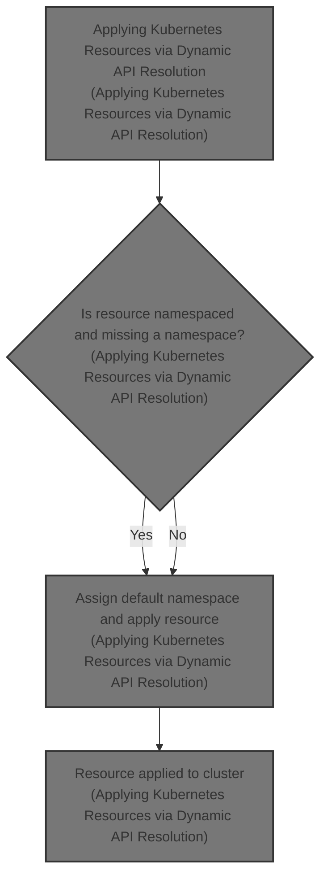

This document describes how a Kubernetes resource is applied to a cluster. The flow receives a resource definition and an optional cluster name, determines the correct API endpoint, assigns a default namespace if needed, and either creates or updates the resource in the cluster.



# Applying Kubernetes Resources via Dynamic API Resolution

```mermaid
%%{init: {"flowchart": {"defaultRenderer": "elk"}} }%%
flowchart TD
  node1["Deep clone resource for apply"] --> node2["Determine API endpoint for resource and cluster"]
  click node1 openCode "frontend/src/lib/k8s/api/v1/apply.ts:46:47"
  click node2 openCode "frontend/src/lib/k8s/api/v1/apply.ts:50:54"
  node2 --> node3{"Is resource namespaced and missing a namespace?"}
  click node3 openCode "frontend/src/lib/k8s/api/v1/apply.ts:60:62"
  node3 -->|"Yes"| node4["Assign default namespace from cluster"]
  click node4 openCode "frontend/src/lib/k8s/api/v1/apply.ts:63:69"
  node3 -->|"No"| node5["Attempt to create resource (POST)"]
  node4 --> node5
  node5 --> node6{"Did POST fail with 409/403 error?"}
  click node5 openCode "frontend/src/lib/k8s/api/v1/apply.ts:75:76"
  click node6 openCode "frontend/src/lib/k8s/api/v1/apply.ts:79:80"
  node6 -->|"Yes"| node7["Preserve resource version and update resource (PUT)"]
  click node7 openCode "frontend/src/lib/k8s/api/v1/apply.ts:83:85"
  node6 -->|"No"| node8["Return created resource"]
  click node8 openCode "frontend/src/lib/k8s/api/v1/apply.ts:76:77"
  node7 --> node9["Return updated resource"]
  click node9 openCode "frontend/src/lib/k8s/api/v1/apply.ts:85:86"
classDef HeadingStyle fill:#777777,stroke:#333,stroke-width:2px;

%% Swimm:
%% %%{init: {"flowchart": {"defaultRenderer": "elk"}} }%%
%% flowchart TD
%%   node1["Deep clone resource for apply"] --> node2["Determine API endpoint for resource and cluster"]
%%   click node1 openCode "<SwmPath>[frontend/…/v1/apply.ts](frontend/src/lib/k8s/api/v1/apply.ts)</SwmPath>:46:47"
%%   click node2 openCode "<SwmPath>[frontend/…/v1/apply.ts](frontend/src/lib/k8s/api/v1/apply.ts)</SwmPath>:50:54"
%%   node2 --> node3{"Is resource namespaced and missing a namespace?"}
%%   click node3 openCode "<SwmPath>[frontend/…/v1/apply.ts](frontend/src/lib/k8s/api/v1/apply.ts)</SwmPath>:60:62"
%%   node3 -->|"Yes"| node4["Assign default namespace from cluster"]
%%   click node4 openCode "<SwmPath>[frontend/…/v1/apply.ts](frontend/src/lib/k8s/api/v1/apply.ts)</SwmPath>:63:69"
%%   node3 -->|"No"| node5["Attempt to create resource (POST)"]
%%   node4 --> node5
%%   node5 --> node6{"Did POST fail with 409/403 error?"}
%%   click node5 openCode "<SwmPath>[frontend/…/v1/apply.ts](frontend/src/lib/k8s/api/v1/apply.ts)</SwmPath>:75:76"
%%   click node6 openCode "<SwmPath>[frontend/…/v1/apply.ts](frontend/src/lib/k8s/api/v1/apply.ts)</SwmPath>:79:80"
%%   node6 -->|"Yes"| node7["Preserve resource version and update resource (PUT)"]
%%   click node7 openCode "<SwmPath>[frontend/…/v1/apply.ts](frontend/src/lib/k8s/api/v1/apply.ts)</SwmPath>:83:85"
%%   node6 -->|"No"| node8["Return created resource"]
%%   click node8 openCode "<SwmPath>[frontend/…/v1/apply.ts](frontend/src/lib/k8s/api/v1/apply.ts)</SwmPath>:76:77"
%%   node7 --> node9["Return updated resource"]
%%   click node9 openCode "<SwmPath>[frontend/…/v1/apply.ts](frontend/src/lib/k8s/api/v1/apply.ts)</SwmPath>:85:86"
%% classDef HeadingStyle fill:#777777,stroke:#333,stroke-width:2px;
```



<SwmSnippet path="/frontend/src/lib/k8s/api/v1/apply.ts" line="42">

---

In <SwmToken path="frontend/src/lib/k8s/api/v1/apply.ts" pos="42:6:6" line-data="export async function apply&lt;T extends KubeObjectInterface&gt;(">`apply`</SwmToken>, we kick off by deep cloning the resource body to avoid mutating the input. Then, we resolve the correct API client for the resource using <SwmToken path="frontend/src/lib/k8s/api/v1/apply.ts" pos="50:7:7" line-data="    apiEndpoint = await resourceDefToApiFactory(bodyToApply, clusterName);">`resourceDefToApiFactory`</SwmToken>. This step is necessary because Kubernetes resources can belong to different API groups or be custom resources, so we can't hardcode the endpoint. If the endpoint resolution fails, we log and throw the error immediately.

```typescript
export async function apply<T extends KubeObjectInterface>(
  body: T,
  clusterName?: string
): Promise<T> {
  const bodyToApply = _.cloneDeep(body);

  let apiEndpoint;
  try {
    apiEndpoint = await resourceDefToApiFactory(bodyToApply, clusterName);
  } catch (err) {
    console.error(`Error getting api endpoint when applying the resource ${bodyToApply}: ${err}`);
    throw err;
  }

```

---

</SwmSnippet>

<SwmSnippet path="/frontend/src/lib/k8s/api/v1/factories.ts" line="481">

---

<SwmToken path="frontend/src/lib/k8s/api/v1/factories.ts" pos="481:6:6" line-data="export async function resourceDefToApiFactory&lt;ResourceType extends KubeObjectInterface&gt;(">`resourceDefToApiFactory`</SwmToken> figures out the API group and version, fetches resource info from the cluster to get the right name and namespacing, and returns the correct API client for the resource.

```typescript
export async function resourceDefToApiFactory<ResourceType extends KubeObjectInterface>(
  resourceDef: KubeObjectInterface,
  clusterName?: string
): Promise<ApiClient<ResourceType> | ApiWithNamespaceClient<ResourceType>> {
  interface APIResourceList {
    resources: {
      kind: string;
      namespaced: boolean;
      singularName: string;
      name: string;
    }[];
    [other: string]: any;
  }
  if (isDebugVerbose('k8s/apiProxy@resourceDefToApiFactory')) {
    console.debug('k8s/apiProxy@resourceDefToApiFactory', { resourceDef });
  }

  if (!resourceDef.kind) {
    throw new Error(`Cannot handle unknown resource kind: ${resourceDef.kind}`);
  }

  if (!resourceDef.apiVersion) {
    throw new Error(`Definition ${resourceDef.kind} has no apiVersion`);
  }

  let [apiGroup, apiVersion] = resourceDef.apiVersion.split('/');

  // There may not be an API group [1], which means that the apiGroup variable will
  // actually hold the apiVersion, so we switch them.
  // [1] https://kubernetes.io/docs/reference/using-api/#api-groups
  if (!!apiGroup && !apiVersion) {
    apiVersion = apiGroup;
    apiGroup = '';
  }

  if (!apiVersion) {
    throw new Error(`apiVersion has no version string: ${resourceDef.apiVersion}`);
  }

  const cluster = clusterName || getCluster() || '';

  // Get details about this resource. We could avoid this for known resources, but
  // this way we always get the right plural name and we also avoid eventually getting
  // the wrong "known" resource because e.g. there can be CustomResources with the same
  // kind as a known resource.
  const apiPrefix = !!apiGroup ? 'apis' : 'api';
  const apiResult: APIResourceList = await clusterRequest(
    `/${apiPrefix}/${resourceDef.apiVersion}`,
    {
      cluster,
      autoLogoutOnAuthError: false,
    }
  );
  if (!apiResult) {
    throw new Error(`Unkown apiVersion: ${resourceDef.apiVersion}`);
  }

  // Get resource
  const resource = apiResult.resources?.find(({ kind }) => kind === resourceDef.kind);

  if (!resource) {
    throw new Error(`Unkown resource kind: ${resourceDef.kind}`);
  }

  const hasNamespace = !!resource.namespaced;

  const factoryFunc = hasNamespace ? apiFactoryWithNamespace : apiFactory;

  return factoryFunc(apiGroup, apiVersion, resource.name);
}
```

---

</SwmSnippet>

<SwmSnippet path="/frontend/src/lib/k8s/api/v1/apply.ts" line="56">

---

Back in <SwmToken path="frontend/src/lib/k8s/api/v1/apply.ts" pos="42:6:6" line-data="export async function apply&lt;T extends KubeObjectInterface&gt;(">`apply`</SwmToken>, after getting the API client, we check if the resource is namespaced and assign a default namespace if needed. Then we try to create the resource with POST, removing <SwmToken path="frontend/src/lib/k8s/api/v1/apply.ts" pos="72:3:3" line-data="  const resourceVersion = bodyToApply.metadata.resourceVersion;">`resourceVersion`</SwmToken> to avoid creation conflicts. If the resource already exists (conflict or forbidden), we switch to PUT, restoring <SwmToken path="frontend/src/lib/k8s/api/v1/apply.ts" pos="72:3:3" line-data="  const resourceVersion = bodyToApply.metadata.resourceVersion;">`resourceVersion`</SwmToken> for a valid update.

```typescript
  const cluster = clusterName || getCluster();

  // Check if the default namespace is needed. And we need to do this before
  // getting the apiEndpoint because it will affect the endpoint itself.
  const isNamespaced = apiEndpoint.isNamespaced;
  const { namespace } = body.metadata;
  if (!namespace && isNamespaced) {
    let defaultNamespace = 'default';

    if (!!cluster) {
      defaultNamespace = getClusterDefaultNamespace(cluster) || 'default';
    }

    bodyToApply.metadata.namespace = defaultNamespace;
  }

  const resourceVersion = bodyToApply.metadata.resourceVersion;

  try {
    delete bodyToApply.metadata.resourceVersion;
    return await apiEndpoint.post(bodyToApply, {}, cluster!);
  } catch (err) {
    // We had a conflict or cannot create. Try a PUT in case the resource already exists.
    const errorCode = (err as ApiError).status;
    if (errorCode !== 409 && errorCode !== 403) throw err;

    // Preserve the resourceVersion if its an update request
    bodyToApply.metadata.resourceVersion = resourceVersion;
    // We had a conflict. Try a PUT
    return apiEndpoint.put(bodyToApply, {}, cluster!) as Promise<T>;
  }
}
```

---

</SwmSnippet>

&nbsp;

*This is an auto-generated document by Swimm 🌊 and has not yet been verified by a human*

<SwmMeta version="3.0.0" repo-id="Z2l0aHViJTNBJTNBdHlwZXNjcmlwdC1oZWFkbGFtcCUzQSUzQXJpY2FyZG9sb3Blemc=" repo-name="typescript-headlamp"><sup>Powered by [Swimm](https://app.swimm.io/)</sup></SwmMeta>
