This document describes how the application verifies user authentication and permissions for a Kubernetes cluster. The flow identifies the cluster and namespace from the user's context, sends an authentication request to the Kubernetes API, and updates authentication state and cache based on the response. If authentication fails, the flow manages logout and clears cached data.

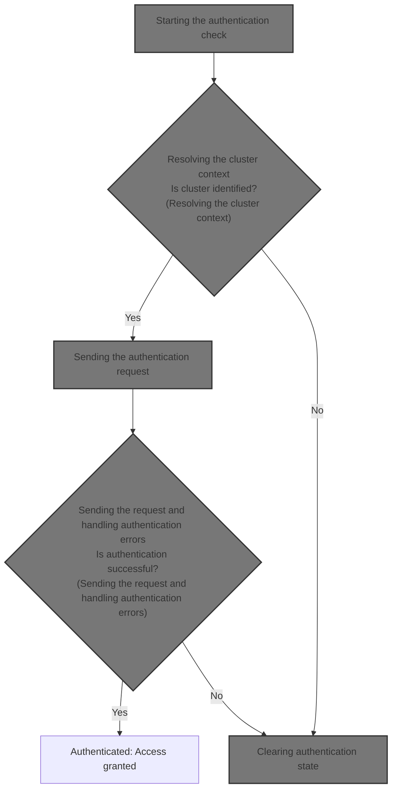

# Where is this flow used?

This flow is used multiple times in the codebase as represented in the following diagram:

```mermaid
graph TD;
      7e0b3a923b0e14db4542b86b993e779d28f36d582c613eb16baf0557fd73a497(frontend/…/App/RouteSwitcher.tsx::AuthRoute) --> 82dc9fe251f3f6786cdd4381a03f47074db8491844164f3e8ec819c5eee42d67(frontend/…/v1/clusterApi.ts::testAuth):::mainFlowStyle

a160d8aba69b24609d37debd38c56ba95fba172f31a97db76f6b6e0181f18dee(frontend/…/App/RouteSwitcher.tsx::queryFn) --> 82dc9fe251f3f6786cdd4381a03f47074db8491844164f3e8ec819c5eee42d67(frontend/…/v1/clusterApi.ts::testAuth):::mainFlowStyle

7c233e049e1faaf21b52f91b1abc7ea25a4700a287ada68bc537787f3d4d7bff(frontend/…/account/Auth.tsx::loginWithToken) --> 82dc9fe251f3f6786cdd4381a03f47074db8491844164f3e8ec819c5eee42d67(frontend/…/v1/clusterApi.ts::testAuth):::mainFlowStyle

7071df105802ada928e6f2dc24a0786c5eb20f9ea01b03eec196281089daa938(frontend/…/account/Auth.tsx::AuthToken) --> 7c233e049e1faaf21b52f91b1abc7ea25a4700a287ada68bc537787f3d4d7bff(frontend/…/account/Auth.tsx::loginWithToken)

2ed809f7c2bc7c95aea13195a74a179ce3364cdb9d3761f99faabd4d8b99ee92(frontend/…/account/Auth.tsx::onAuthClicked) --> 7c233e049e1faaf21b52f91b1abc7ea25a4700a287ada68bc537787f3d4d7bff(frontend/…/account/Auth.tsx::loginWithToken)

356a42cff5fdaeeb07fcd3d3fff3dacb4b394790b1bbac189b37f0bbb71e036d(frontend/…/404/index.tsx::AuthChooser) --> 82dc9fe251f3f6786cdd4381a03f47074db8491844164f3e8ec819c5eee42d67(frontend/…/v1/clusterApi.ts::testAuth):::mainFlowStyle


classDef mainFlowStyle color:#000000,fill:#7CB9F4
classDef rootsStyle color:#000000,fill:#00FFF4
classDef Style1 color:#000000,fill:#00FFAA
classDef Style2 color:#000000,fill:#FFFF00
classDef Style3 color:#000000,fill:#AA7CB9

%% Swimm:
%% graph TD;
%%       7e0b3a923b0e14db4542b86b993e779d28f36d582c613eb16baf0557fd73a497(<SwmPath>[frontend/…/App/RouteSwitcher.tsx](frontend/src/components/App/RouteSwitcher.tsx)</SwmPath>::AuthRoute) --> 82dc9fe251f3f6786cdd4381a03f47074db8491844164f3e8ec819c5eee42d67(<SwmPath>[frontend/…/v1/clusterApi.ts](frontend/src/lib/k8s/api/v1/clusterApi.ts)</SwmPath>::<SwmToken path="frontend/src/lib/k8s/api/v1/clusterApi.ts" pos="34:6:6" line-data="export async function testAuth(cluster = &#39;&#39;, namespace = &#39;default&#39;) {">`testAuth`</SwmToken>):::mainFlowStyle
%% 
%% a160d8aba69b24609d37debd38c56ba95fba172f31a97db76f6b6e0181f18dee(<SwmPath>[frontend/…/App/RouteSwitcher.tsx](frontend/src/components/App/RouteSwitcher.tsx)</SwmPath>::queryFn) --> 82dc9fe251f3f6786cdd4381a03f47074db8491844164f3e8ec819c5eee42d67(<SwmPath>[frontend/…/v1/clusterApi.ts](frontend/src/lib/k8s/api/v1/clusterApi.ts)</SwmPath>::<SwmToken path="frontend/src/lib/k8s/api/v1/clusterApi.ts" pos="34:6:6" line-data="export async function testAuth(cluster = &#39;&#39;, namespace = &#39;default&#39;) {">`testAuth`</SwmToken>):::mainFlowStyle
%% 
%% 7c233e049e1faaf21b52f91b1abc7ea25a4700a287ada68bc537787f3d4d7bff(<SwmPath>[frontend/…/account/Auth.tsx](frontend/src/components/account/Auth.tsx)</SwmPath>::loginWithToken) --> 82dc9fe251f3f6786cdd4381a03f47074db8491844164f3e8ec819c5eee42d67(<SwmPath>[frontend/…/v1/clusterApi.ts](frontend/src/lib/k8s/api/v1/clusterApi.ts)</SwmPath>::<SwmToken path="frontend/src/lib/k8s/api/v1/clusterApi.ts" pos="34:6:6" line-data="export async function testAuth(cluster = &#39;&#39;, namespace = &#39;default&#39;) {">`testAuth`</SwmToken>):::mainFlowStyle
%% 
%% 7071df105802ada928e6f2dc24a0786c5eb20f9ea01b03eec196281089daa938(<SwmPath>[frontend/…/account/Auth.tsx](frontend/src/components/account/Auth.tsx)</SwmPath>::AuthToken) --> 7c233e049e1faaf21b52f91b1abc7ea25a4700a287ada68bc537787f3d4d7bff(<SwmPath>[frontend/…/account/Auth.tsx](frontend/src/components/account/Auth.tsx)</SwmPath>::loginWithToken)
%% 
%% 2ed809f7c2bc7c95aea13195a74a179ce3364cdb9d3761f99faabd4d8b99ee92(<SwmPath>[frontend/…/account/Auth.tsx](frontend/src/components/account/Auth.tsx)</SwmPath>::onAuthClicked) --> 7c233e049e1faaf21b52f91b1abc7ea25a4700a287ada68bc537787f3d4d7bff(<SwmPath>[frontend/…/account/Auth.tsx](frontend/src/components/account/Auth.tsx)</SwmPath>::loginWithToken)
%% 
%% 356a42cff5fdaeeb07fcd3d3fff3dacb4b394790b1bbac189b37f0bbb71e036d(<SwmPath>[frontend/…/404/index.tsx](frontend/src/components/404/index.tsx)</SwmPath>::AuthChooser) --> 82dc9fe251f3f6786cdd4381a03f47074db8491844164f3e8ec819c5eee42d67(<SwmPath>[frontend/…/v1/clusterApi.ts](frontend/src/lib/k8s/api/v1/clusterApi.ts)</SwmPath>::<SwmToken path="frontend/src/lib/k8s/api/v1/clusterApi.ts" pos="34:6:6" line-data="export async function testAuth(cluster = &#39;&#39;, namespace = &#39;default&#39;) {">`testAuth`</SwmToken>):::mainFlowStyle
%% 
%% 
%% classDef mainFlowStyle color:#000000,fill:#7CB9F4
%% classDef rootsStyle color:#000000,fill:#00FFF4
%% classDef Style1 color:#000000,fill:#00FFAA
%% classDef Style2 color:#000000,fill:#FFFF00
%% classDef Style3 color:#000000,fill:#AA7CB9
```

# Starting the authentication check

<SwmSnippet path="/frontend/src/lib/k8s/api/v1/clusterApi.ts" line="34">

---

In <SwmToken path="frontend/src/lib/k8s/api/v1/clusterApi.ts" pos="34:6:6" line-data="export async function testAuth(cluster = &#39;&#39;, namespace = &#39;default&#39;) {">`testAuth`</SwmToken>, we kick off the flow by preparing the spec and figuring out which cluster we're working with. If no cluster is passed in, we grab it using <SwmToken path="frontend/src/lib/k8s/api/v1/clusterApi.ts" pos="36:11:11" line-data="  const clusterName = cluster || getCluster();">`getCluster`</SwmToken>, which pulls it from the current app context. We need to call <SwmPath>[frontend/…/lib/cluster.ts](frontend/src/lib/cluster.ts)</SwmPath> next to resolve the actual cluster name, since that's required for the API request.

```typescript
export async function testAuth(cluster = '', namespace = 'default') {
  const spec = { namespace };
  const clusterName = cluster || getCluster();

```

---

</SwmSnippet>

## Resolving the cluster context

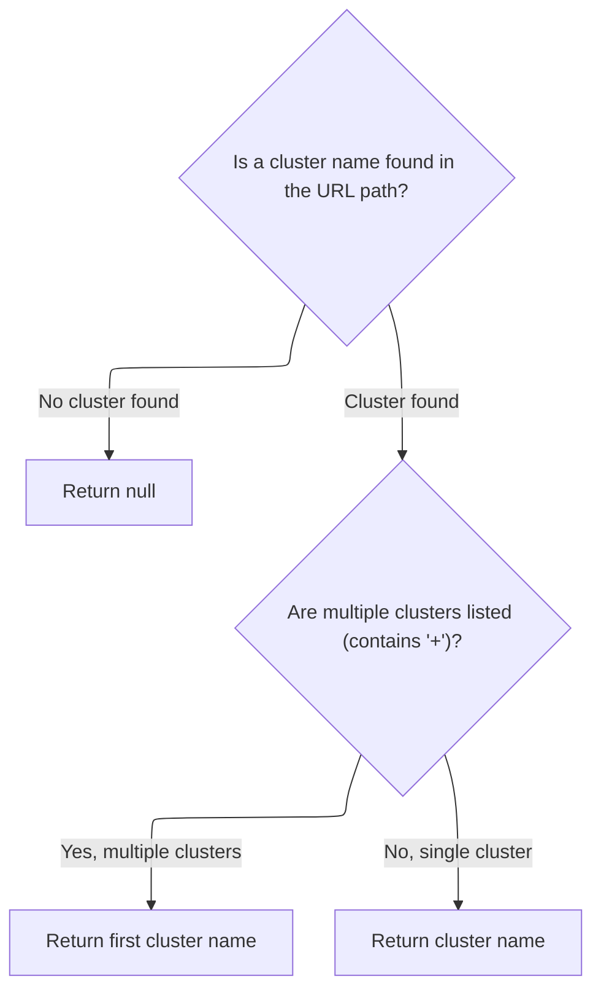

<SwmSnippet path="/frontend/src/lib/cluster.ts" line="46">

---

<SwmToken path="frontend/src/lib/cluster.ts" pos="46:4:4" line-data="export function getCluster(urlPath?: string): string | null {">`getCluster`</SwmToken> grabs the cluster string from the URL path using <SwmToken path="frontend/src/lib/cluster.ts" pos="47:7:7" line-data="  const clusterString = getClusterPathParam(urlPath);">`getClusterPathParam`</SwmToken>. If the string has a '+', we only care about the part before it, since that's the actual cluster name. This parsing is needed because the repo uses '+' to tack on extra info, but only the first part matters for cluster identification.

```typescript
export function getCluster(urlPath?: string): string | null {
  const clusterString = getClusterPathParam(urlPath);
  if (!clusterString) return null;

  if (clusterString.includes('+')) {
    return clusterString.split('+')[0];
  }
  return clusterString;
}
```

---

</SwmSnippet>

## Extracting cluster from the URL path

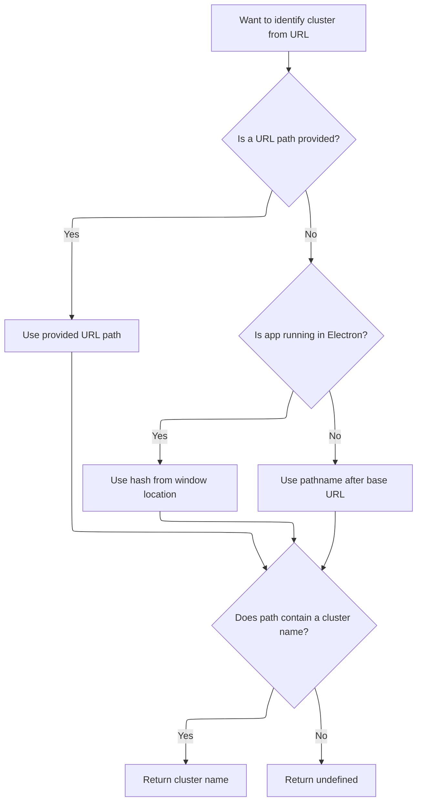

<SwmSnippet path="/frontend/src/lib/cluster.ts" line="57">

---

In <SwmToken path="frontend/src/lib/cluster.ts" pos="57:4:4" line-data="export function getClusterPathParam(maybeUrlPath?: string): string | undefined {">`getClusterPathParam`</SwmToken>, we start by grabbing the base URL using <SwmToken path="frontend/src/lib/cluster.ts" pos="58:7:7" line-data="  const prefix = getBaseUrl();">`getBaseUrl`</SwmToken>. This is needed to figure out where the cluster info sits in the URL, since deployments might use different base paths. Next, we use this base URL to slice the pathname and extract the cluster segment.

```typescript
export function getClusterPathParam(maybeUrlPath?: string): string | undefined {
  const prefix = getBaseUrl();
```

---

</SwmSnippet>

<SwmSnippet path="/frontend/src/helpers/getBaseUrl.ts" line="38">

---

<SwmToken path="frontend/src/helpers/getBaseUrl.ts" pos="38:4:4" line-data="export function getBaseUrl(): string {">`getBaseUrl`</SwmToken> figures out the base path for the app, handling Electron and web deployments differently, and normalizes the result for consistent URL parsing.

```typescript
export function getBaseUrl(): string {
  let baseUrl = '';
  if (isElectron()) {
    return '';
  }
  if (window?.headlampBaseUrl !== undefined) {
    baseUrl = window.headlampBaseUrl;
  } else {
    baseUrl = import.meta.env.PUBLIC_URL ? import.meta.env.PUBLIC_URL : '';
  }

  if (baseUrl === './' || baseUrl === '.' || baseUrl === '/') {
    baseUrl = '';
  }
  return baseUrl;
}
```

---

</SwmSnippet>

<SwmSnippet path="/frontend/src/lib/cluster.ts" line="59">

---

Back in <SwmToken path="frontend/src/lib/cluster.ts" pos="47:7:7" line-data="  const clusterString = getClusterPathParam(urlPath);">`getClusterPathParam`</SwmToken>, now that we've got the base URL, we slice the current URL path accordingly (handling Electron and browser cases), then use <SwmToken path="frontend/src/lib/cluster.ts" pos="65:7:7" line-data="  const clusterURLMatch = matchPath&lt;{ cluster?: string }&gt;(urlPath, {">`matchPath`</SwmToken> to pull out the cluster parameter. This lets us extract the cluster name from the right spot in the URL.

```typescript
  const urlPath =
    maybeUrlPath ??
    (isElectron()
      ? window.location.hash.substring(1)
      : window.location.pathname.slice(prefix.length));

  const clusterURLMatch = matchPath<{ cluster?: string }>(urlPath, {
    path: getClusterPrefixedPath(),
  });

  return clusterURLMatch?.params?.cluster;
}
```

---

</SwmSnippet>

## Sending the authentication request

<SwmSnippet path="/frontend/src/lib/k8s/api/v1/clusterApi.ts" line="38">

---

Back in <SwmToken path="frontend/src/lib/k8s/api/v1/clusterApi.ts" pos="34:6:6" line-data="export async function testAuth(cluster = &#39;&#39;, namespace = &#39;default&#39;) {">`testAuth`</SwmToken>, now that we've got the cluster name, we send the authentication request using post. This hands off the cluster context and request options to the next part of the flow, which handles the actual API call.

```typescript
  return post('/apis/authorization.k8s.io/v1/selfsubjectrulesreviews', { spec }, false, {
    timeout: 5 * 1000,
    cluster: clusterName,
  });
}
```

---

</SwmSnippet>

# Preparing the cluster API request

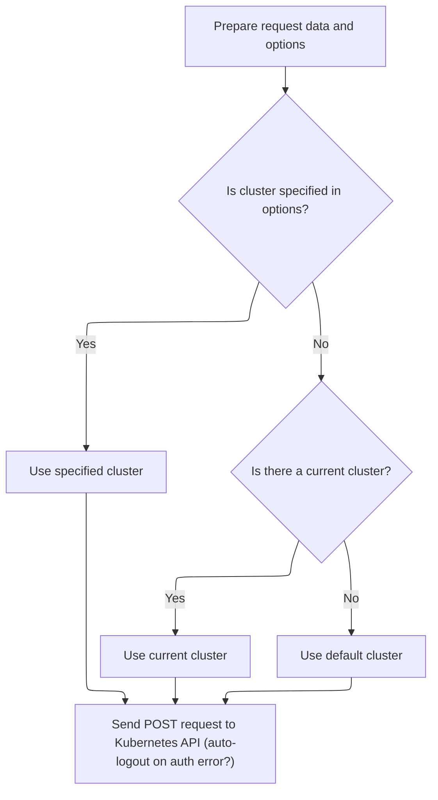

<SwmSnippet path="/frontend/src/lib/k8s/api/v1/clusterRequests.ts" line="225">

---

In <SwmToken path="frontend/src/lib/k8s/api/v1/clusterRequests.ts" pos="225:4:4" line-data="export function post(">`post`</SwmToken>, we prep the request by making sure we have the cluster name (using <SwmToken path="frontend/src/lib/k8s/api/v1/clusterRequests.ts" pos="233:11:11" line-data="  const cluster = clusterName || getCluster() || &#39;&#39;;">`getCluster`</SwmToken> if needed), stringify the body, and set up headers. Next, we call <SwmToken path="frontend/src/lib/k8s/api/v1/clusterRequests.ts" pos="122:6:6" line-data="export async function clusterRequest(">`clusterRequest`</SwmToken> to actually send the API call with all the right options.

```typescript
export function post(
  url: string,
  json: JSON | object | KubeObjectInterface,
  autoLogoutOnAuthError: boolean = true,
  options: ClusterRequestParams = {}
) {
  const { cluster: clusterName, ...requestOptions } = options;
  const body = JSON.stringify(json);
  const cluster = clusterName || getCluster() || '';
```

---

</SwmSnippet>

<SwmSnippet path="/frontend/src/lib/k8s/api/v1/clusterRequests.ts" line="234">

---

Back in <SwmToken path="frontend/src/lib/k8s/api/v1/clusterApi.ts" pos="38:3:3" line-data="  return post(&#39;/apis/authorization.k8s.io/v1/selfsubjectrulesreviews&#39;, { spec }, false, {">`post`</SwmToken>, we hand off the request to <SwmToken path="frontend/src/lib/k8s/api/v1/clusterRequests.ts" pos="234:3:3" line-data="  return clusterRequest(url, {">`clusterRequest`</SwmToken>, passing all the relevant data and options. This lets <SwmToken path="frontend/src/lib/k8s/api/v1/clusterRequests.ts" pos="234:3:3" line-data="  return clusterRequest(url, {">`clusterRequest`</SwmToken> handle the details of sending the request and managing cluster-specific logic.

```typescript
  return clusterRequest(url, {
    method: 'POST',
    body,
    headers: JSON_HEADERS,
    cluster,
    autoLogoutOnAuthError,
    ...requestOptions,
  });
}
```

---

</SwmSnippet>

# Handling cluster-specific request logic

```mermaid
%%{init: {"flowchart": {"defaultRenderer": "elk"}} }%%
flowchart TD
  node1["Start: Prepare request"]
  click node1 openCode "frontend/src/lib/k8s/api/v1/clusterRequests.ts:122:146"
  node1 --> node2{"Is a cluster specified?"}
  click node2 openCode "frontend/src/lib/k8s/api/v1/clusterRequests.ts:147:155"
  node2 -->|"Yes"| node3["Locating the kubeconfig for a cluster"]
  
  node2 -->|"No"| node4["Continue without cluster auth"]
  click node4 openCode "frontend/src/lib/k8s/api/v1/clusterRequests.ts:146:147"
  node3 --> node5["Send request to cluster API"]
  node4 --> node5
  click node5 openCode "frontend/src/lib/k8s/api/v1/clusterRequests.ts:157:172"
  node5 --> node6{"Does backend signal reload?"}
  click node6 openCode "frontend/src/lib/k8s/api/v1/clusterRequests.ts:185:188"
  node6 -->|"Yes"| node7["Reload application"]
  click node7 openCode "frontend/src/lib/k8s/api/v1/clusterRequests.ts:187:188"
  node6 -->|"No"| node8{"Is response successful?"}
  click node8 openCode "frontend/src/lib/k8s/api/v1/clusterRequests.ts:190:216"
  node8 -->|"No"| node9{"Should log out user?"}
  click node9 openCode "frontend/src/lib/k8s/api/v1/clusterRequests.ts:192:195"
  node9 -->|"Yes"| node10["Clearing authentication state"]
  
  node9 -->|"No"| node10
  node8 -->|"Yes"| node11{"Should parse as JSON?"}
  click node11 openCode "frontend/src/lib/k8s/api/v1/clusterRequests.ts:218:222"
  node11 -->|"Yes"| node12["Return parsed JSON"]
  click node12 openCode "frontend/src/lib/k8s/api/v1/clusterRequests.ts:222:223"
  node11 -->|"No"| node13["Return raw response"]
  click node13 openCode "frontend/src/lib/k8s/api/v1/clusterRequests.ts:219:220"
classDef HeadingStyle fill:#777777,stroke:#333,stroke-width:2px;
click node3 goToHeading "Locating the kubeconfig for a cluster"
node3:::HeadingStyle
click node10 goToHeading "Clearing authentication state"
node10:::HeadingStyle

%% Swimm:
%% %%{init: {"flowchart": {"defaultRenderer": "elk"}} }%%
%% flowchart TD
%%   node1["Start: Prepare request"]
%%   click node1 openCode "<SwmPath>[frontend/…/v1/clusterRequests.ts](frontend/src/lib/k8s/api/v1/clusterRequests.ts)</SwmPath>:122:146"
%%   node1 --> node2{"Is a cluster specified?"}
%%   click node2 openCode "<SwmPath>[frontend/…/v1/clusterRequests.ts](frontend/src/lib/k8s/api/v1/clusterRequests.ts)</SwmPath>:147:155"
%%   node2 -->|"Yes"| node3["Locating the kubeconfig for a cluster"]
%%   
%%   node2 -->|"No"| node4["Continue without cluster auth"]
%%   click node4 openCode "<SwmPath>[frontend/…/v1/clusterRequests.ts](frontend/src/lib/k8s/api/v1/clusterRequests.ts)</SwmPath>:146:147"
%%   node3 --> node5["Send request to cluster API"]
%%   node4 --> node5
%%   click node5 openCode "<SwmPath>[frontend/…/v1/clusterRequests.ts](frontend/src/lib/k8s/api/v1/clusterRequests.ts)</SwmPath>:157:172"
%%   node5 --> node6{"Does backend signal reload?"}
%%   click node6 openCode "<SwmPath>[frontend/…/v1/clusterRequests.ts](frontend/src/lib/k8s/api/v1/clusterRequests.ts)</SwmPath>:185:188"
%%   node6 -->|"Yes"| node7["Reload application"]
%%   click node7 openCode "<SwmPath>[frontend/…/v1/clusterRequests.ts](frontend/src/lib/k8s/api/v1/clusterRequests.ts)</SwmPath>:187:188"
%%   node6 -->|"No"| node8{"Is response successful?"}
%%   click node8 openCode "<SwmPath>[frontend/…/v1/clusterRequests.ts](frontend/src/lib/k8s/api/v1/clusterRequests.ts)</SwmPath>:190:216"
%%   node8 -->|"No"| node9{"Should log out user?"}
%%   click node9 openCode "<SwmPath>[frontend/…/v1/clusterRequests.ts](frontend/src/lib/k8s/api/v1/clusterRequests.ts)</SwmPath>:192:195"
%%   node9 -->|"Yes"| node10["Clearing authentication state"]
%%   
%%   node9 -->|"No"| node10
%%   node8 -->|"Yes"| node11{"Should parse as JSON?"}
%%   click node11 openCode "<SwmPath>[frontend/…/v1/clusterRequests.ts](frontend/src/lib/k8s/api/v1/clusterRequests.ts)</SwmPath>:218:222"
%%   node11 -->|"Yes"| node12["Return parsed JSON"]
%%   click node12 openCode "<SwmPath>[frontend/…/v1/clusterRequests.ts](frontend/src/lib/k8s/api/v1/clusterRequests.ts)</SwmPath>:222:223"
%%   node11 -->|"No"| node13["Return raw response"]
%%   click node13 openCode "<SwmPath>[frontend/…/v1/clusterRequests.ts](frontend/src/lib/k8s/api/v1/clusterRequests.ts)</SwmPath>:219:220"
%% classDef HeadingStyle fill:#777777,stroke:#333,stroke-width:2px;
%% click node3 goToHeading "Locating the kubeconfig for a cluster"
%% node3:::HeadingStyle
%% click node10 goToHeading "Clearing authentication state"
%% node10:::HeadingStyle
```

<SwmSnippet path="/frontend/src/lib/k8s/api/v1/clusterRequests.ts" line="122">

---

In <SwmToken path="frontend/src/lib/k8s/api/v1/clusterRequests.ts" pos="122:6:6" line-data="export async function clusterRequest(">`clusterRequest`</SwmToken>, if a cluster is specified, we fetch its kubeconfig using <SwmToken path="frontend/src/lib/k8s/api/v1/clusterRequests.ts" pos="148:9:9" line-data="    const kubeconfig = await findKubeconfigByClusterName(cluster);">`findKubeconfigByClusterName`</SwmToken>. If found, we add it and the user ID to the headers, and adjust the request path to target the right cluster. This sets up the request for cluster-specific authentication and routing.

```typescript
export async function clusterRequest(
  path: string,
  params: ClusterRequestParams = {},
  queryParams?: QueryParameters
): Promise<any> {
  interface RequestHeaders {
    Authorization?: string;
    cluster?: string;
    autoLogoutOnAuthError?: boolean;
    [otherHeader: string]: any;
  }

  const {
    timeout = DEFAULT_TIMEOUT,
    cluster: paramsCluster,
    autoLogoutOnAuthError = true,
    isJSON = true,
    ...otherParams
  } = params;

  const userID = getUserIdFromLocalStorage();
  const opts: { headers: RequestHeaders } = Object.assign({ headers: {} }, otherParams);
  const cluster = paramsCluster || '';

  let fullPath = path;
  if (cluster) {
    const kubeconfig = await findKubeconfigByClusterName(cluster);
    if (kubeconfig !== null) {
      opts.headers['KUBECONFIG'] = kubeconfig;
      opts.headers['X-HEADLAMP-USER-ID'] = userID;
    }

    fullPath = combinePath(`/${CLUSTERS_PREFIX}/${cluster}`, path);
  }

```

---

</SwmSnippet>

## Locating the kubeconfig for a cluster

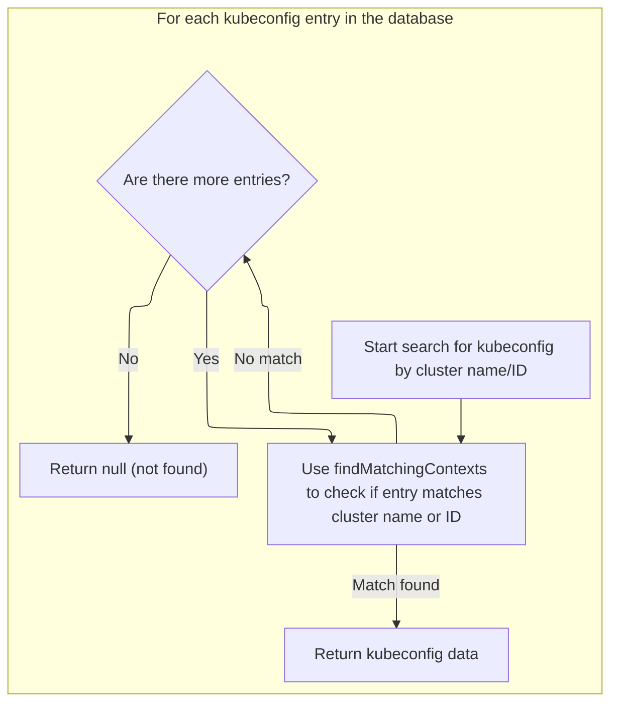

<SwmSnippet path="/frontend/src/stateless/findKubeconfigByClusterName.ts" line="36">

---

In <SwmToken path="frontend/src/stateless/findKubeconfigByClusterName.ts" pos="36:4:4" line-data="export function findKubeconfigByClusterName(">`findKubeconfigByClusterName`</SwmToken>, we open the <SwmToken path="frontend/src/stateless/findKubeconfigByClusterName.ts" pos="32:10:10" line-data=" * @throws Error if IndexedDB is not supported.">`IndexedDB`</SwmToken> 'kubeconfigs' store and iterate over all stored kubeconfigs. Each one is decoded from <SwmToken path="frontend/src/lib/k8s/api/v1/clusterRequests.ts" pos="57:6:6" line-data="  /** KubeConfig (base64 encoded)*/">`base64`</SwmToken> and parsed from YAML, then checked for a match using <SwmToken path="frontend/src/stateless/findKubeconfigByClusterName.ts" pos="70:14:14" line-data="            const { matchingKubeconfig, matchingContext } = findMatchingContexts(">`findMatchingContexts`</SwmToken>. This lets us find the right kubeconfig for the cluster locally.

```typescript
export function findKubeconfigByClusterName(
  /** The name of the cluster to find */
  clusterName: string,
  /** The ID for a cluster, composed of the kubeconfig path and cluster name */
  clusterID?: string
): Promise<string | null> {
  return new Promise<string | null>(async (resolve, reject) => {
    try {
      const request = indexedDB.open('kubeconfigs', 1) as any;

      // The onupgradeneeded event is fired when the database is created for the first time.
      request.onupgradeneeded = handleDatabaseUpgrade;

      // The onsuccess event is fired when the database is opened.
      // This event is where you specify the actions to take when the database is opened.
      request.onsuccess = function handleDatabaseSuccess(event: DatabaseEvent) {
        const db = event.target.result;
        const transaction = db.transaction(['kubeconfigStore'], 'readonly');
        const store = transaction.objectStore('kubeconfigStore');

        // The onsuccess event is fired when the request has succeeded.
        // This is where you handle the results of the request.
        // The result is the cursor. It is used to iterate through the object store.
        // The cursor is null when there are no more objects to iterate through.
        // The cursor is used to find the kubeconfig by cluster name.
        store.openCursor().onsuccess = function storeSuccess(event: Event) {
          const successEvent = event as CursorSuccessEvent;
          const cursor = successEvent.target.result;
          if (cursor) {
            const kubeconfigObject = cursor.value;
            const kubeconfig = kubeconfigObject.kubeconfig;

            const parsedKubeconfig = jsyaml.load(atob(kubeconfig)) as KubeconfigObject;
            // Check for "headlamp_info" in extensions
            const { matchingKubeconfig, matchingContext } = findMatchingContexts(
              clusterName,
              parsedKubeconfig,
              clusterID
            );

```

---

</SwmSnippet>

<SwmSnippet path="/frontend/src/stateless/index.ts" line="236">

---

<SwmToken path="frontend/src/stateless/index.ts" pos="236:4:4" line-data="export function findMatchingContexts(">`findMatchingContexts`</SwmToken> checks for a matching context by <SwmToken path="frontend/src/stateless/index.ts" pos="239:1:1" line-data="  clusterID?: string">`clusterID`</SwmToken> and source if provided, or by <SwmToken path="frontend/src/stateless/index.ts" pos="237:1:1" line-data="  clusterName: string,">`clusterName`</SwmToken> and <SwmToken path="frontend/src/stateless/index.ts" pos="263:2:2" line-data="          .customName === clusterName">`customName`</SwmToken> in the <SwmToken path="frontend/src/stateless/index.ts" pos="258:27:27" line-data="    // Find the context with the matching cluster name or custom name in headlamp_info">`headlamp_info`</SwmToken> extension otherwise. This lets us support both standard and custom cluster naming conventions when searching for the right kubeconfig.

```typescript
export function findMatchingContexts(
  clusterName: string,
  parsedKubeconfig: KubeconfigObject,
  clusterID?: string
) {
  let matchingContext;
  let matchingKubeconfig;

  // Note: currently clusterID is being used for non dynamic clusters only
  if (clusterID) {
    // Find source for the kubeconfig
    const source = parsedKubeconfig.contexts.find(
      context => context.context.clusterID === clusterID
    )?.context.source;

    // Find the context with the matching clusterID
    if (source === 'kubeconfig') {
      matchingKubeconfig = parsedKubeconfig.contexts.find(
        context => context.context.clusterID === clusterID
      );
    }
  } else {
    // Find the context with the matching cluster name or custom name in headlamp_info
    matchingContext = parsedKubeconfig.contexts.find(
      context =>
        context.name === clusterName ||
        context.context.extensions?.find(extension => extension.name === 'headlamp_info')?.extension
          .customName === clusterName
    );

    matchingKubeconfig = parsedKubeconfig.contexts.find(context => context.name === clusterName);
  }

  return { matchingKubeconfig, matchingContext };
}
```

---

</SwmSnippet>

<SwmSnippet path="/frontend/src/stateless/findKubeconfigByClusterName.ts" line="76">

---

Back in <SwmToken path="frontend/src/lib/k8s/api/v1/clusterRequests.ts" pos="148:9:9" line-data="    const kubeconfig = await findKubeconfigByClusterName(cluster);">`findKubeconfigByClusterName`</SwmToken>, after checking each kubeconfig with <SwmToken path="frontend/src/stateless/findKubeconfigByClusterName.ts" pos="70:14:14" line-data="            const { matchingKubeconfig, matchingContext } = findMatchingContexts(">`findMatchingContexts`</SwmToken>, we resolve with the kubeconfig string if a match is found, or continue searching. If nothing matches, we resolve with null. This wraps up the <SwmToken path="frontend/src/stateless/findKubeconfigByClusterName.ts" pos="32:10:10" line-data=" * @throws Error if IndexedDB is not supported.">`IndexedDB`</SwmToken> search for the cluster's kubeconfig.

```typescript
            if (matchingKubeconfig || matchingContext) {
              resolve(kubeconfig);
            } else {
              cursor.continue();
            }
          } else {
            resolve(null); // No matching kubeconfig found
          }
        };
      };

      // The onerror event is fired when the database is opened.
      // This is where you handle errors.
      request.onerror = handleDataBaseError;
    } catch (error) {
      reject(error);
    }
  });
}
```

---

</SwmSnippet>

## Building the request URL and handling timeouts

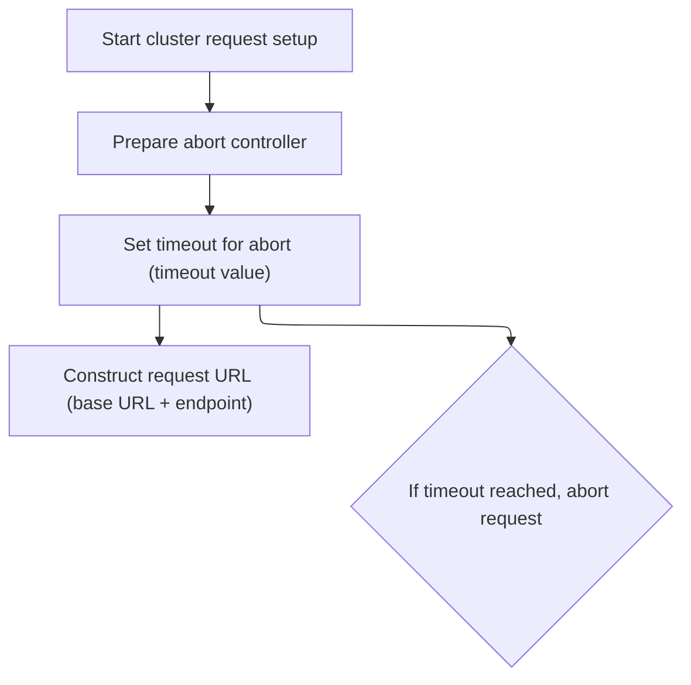

<SwmSnippet path="/frontend/src/lib/k8s/api/v1/clusterRequests.ts" line="157">

---

Back in <SwmToken path="frontend/src/lib/k8s/api/v1/clusterRequests.ts" pos="122:6:6" line-data="export async function clusterRequest(">`clusterRequest`</SwmToken>, we set up a timeout and build the request URL using <SwmToken path="frontend/src/lib/k8s/api/v1/clusterRequests.ts" pos="160:9:9" line-data="  let url = combinePath(getAppUrl(), fullPath);">`getAppUrl`</SwmToken> to make sure the request is sent to the right backend and doesn't hang.

```typescript
  const controller = new AbortController();
  const id = setTimeout(() => controller.abort(), timeout);

  let url = combinePath(getAppUrl(), fullPath);
```

---

</SwmSnippet>

## Determining the backend service URL

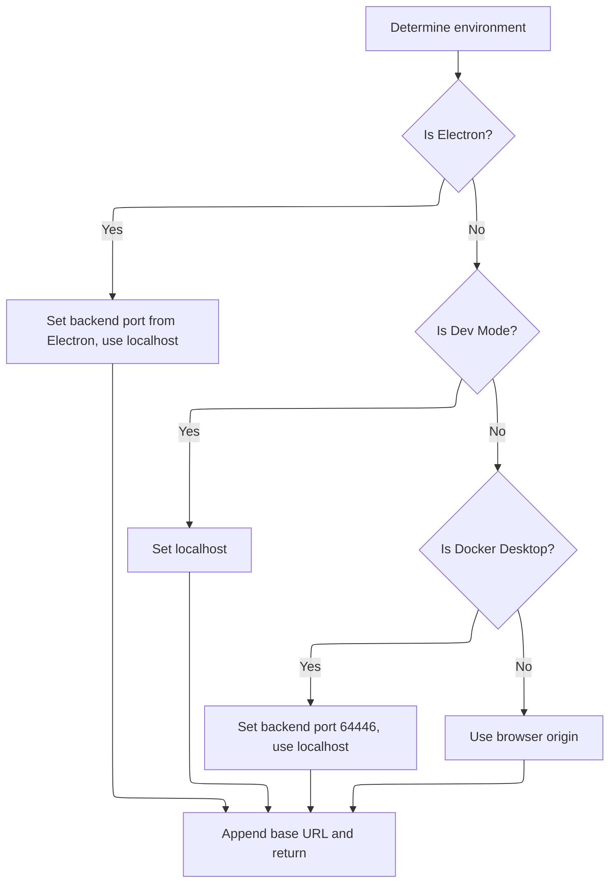

<SwmSnippet path="/frontend/src/helpers/getAppUrl.ts" line="43">

---

In <SwmToken path="frontend/src/helpers/getAppUrl.ts" pos="43:4:4" line-data="export function getAppUrl(): string {">`getAppUrl`</SwmToken>, we figure out the backend service URL based on the environment—Electron, dev mode, Docker Desktop, or browser. We pick the right port and decide if we use localhost or the current origin, then append the base URL for routing. Next, we call <SwmToken path="frontend/src/helpers/getAppUrl.ts" pos="70:7:7" line-data="  const baseUrl = getBaseUrl();">`getBaseUrl`</SwmToken> to get the path segment to add.

```typescript
export function getAppUrl(): string {
  let url = '';
  let backendPort = 4466;
  let useLocalhost = false;

  if (isElectron()) {
    if (window?.headlampBackendPort) {
      backendPort = window.headlampBackendPort;
    }
    useLocalhost = true;
  }

  if (isDevMode()) {
    useLocalhost = true;
  }

  if (isDockerDesktop()) {
    backendPort = 64446;
    useLocalhost = true;
  }

  if (useLocalhost) {
    url = `http://localhost:${backendPort}`;
  } else {
    url = window.location.origin;
  }

  const baseUrl = getBaseUrl();
```

---

</SwmSnippet>

<SwmSnippet path="/frontend/src/helpers/getAppUrl.ts" line="71">

---

Back in <SwmToken path="frontend/src/lib/k8s/api/v1/clusterRequests.ts" pos="160:9:9" line-data="  let url = combinePath(getAppUrl(), fullPath);">`getAppUrl`</SwmToken>, after getting the base URL, we append it (with a trailing slash) to the backend URL we've built. This finalizes the service endpoint, making sure requests are routed correctly regardless of deployment path or environment.

```typescript
  url += baseUrl ? baseUrl + '/' : '/';

  return url;
}
```

---

</SwmSnippet>

## Sending the request and handling authentication errors

```mermaid
%%{init: {"flowchart": {"defaultRenderer": "elk"}} }%%
flowchart TD
  node1["Prepare and send request to cluster API"] --> node2{"Is Backstage integration active?"}
  click node1 openCode "frontend/src/lib/k8s/api/v1/clusterRequests.ts:161:167"
  node2 -->|"Yes"| node3["Add Backstage authentication headers"]
  click node2 openCode "frontend/src/lib/k8s/api/v1/clusterRequests.ts:167:169"
  node2 -->|"No"| node4["Proceed without Backstage headers"]
  click node3 openCode "frontend/src/lib/k8s/api/v1/clusterRequests.ts:167:169"
  click node4 openCode "frontend/src/lib/k8s/api/v1/clusterRequests.ts:161:167"
  node3 --> node5["Send request and receive response"]
  node4 --> node5
  click node5 openCode "frontend/src/lib/k8s/api/v1/clusterRequests.ts:170:173"
  node5 --> node6{"Did backend signal reload? (X-Reload)"}
  click node6 openCode "frontend/src/lib/k8s/api/v1/clusterRequests.ts:185:188"
  node6 -->|"Yes"| node7["Reload page"]
  click node7 openCode "frontend/src/lib/k8s/api/v1/clusterRequests.ts:187:188"
  node6 -->|"No"| node8{"Is response OK?"}
  click node8 openCode "frontend/src/lib/k8s/api/v1/clusterRequests.ts:190:192"
  node8 -->|"No"| node9{"Is authentication error and auto-logout enabled?"}
  click node9 openCode "frontend/src/lib/k8s/api/v1/clusterRequests.ts:192:195"
  node9 -->|"Yes (status=401)"| node10["Logout user"]
  click node10 openCode "frontend/src/lib/k8s/api/v1/clusterRequests.ts:194:195"
  node9 -->|"No"| node11["Return error response"]
  click node11 openCode "frontend/src/lib/k8s/api/v1/clusterRequests.ts:190:195"
  node8 -->|"Yes"| node12["Return successful response"]
  click node12 openCode "frontend/src/lib/k8s/api/v1/clusterRequests.ts:190:195"

classDef HeadingStyle fill:#777777,stroke:#333,stroke-width:2px;

%% Swimm:
%% %%{init: {"flowchart": {"defaultRenderer": "elk"}} }%%
%% flowchart TD
%%   node1["Prepare and send request to cluster API"] --> node2{"Is Backstage integration active?"}
%%   click node1 openCode "<SwmPath>[frontend/…/v1/clusterRequests.ts](frontend/src/lib/k8s/api/v1/clusterRequests.ts)</SwmPath>:161:167"
%%   node2 -->|"Yes"| node3["Add Backstage authentication headers"]
%%   click node2 openCode "<SwmPath>[frontend/…/v1/clusterRequests.ts](frontend/src/lib/k8s/api/v1/clusterRequests.ts)</SwmPath>:167:169"
%%   node2 -->|"No"| node4["Proceed without Backstage headers"]
%%   click node3 openCode "<SwmPath>[frontend/…/v1/clusterRequests.ts](frontend/src/lib/k8s/api/v1/clusterRequests.ts)</SwmPath>:167:169"
%%   click node4 openCode "<SwmPath>[frontend/…/v1/clusterRequests.ts](frontend/src/lib/k8s/api/v1/clusterRequests.ts)</SwmPath>:161:167"
%%   node3 --> node5["Send request and receive response"]
%%   node4 --> node5
%%   click node5 openCode "<SwmPath>[frontend/…/v1/clusterRequests.ts](frontend/src/lib/k8s/api/v1/clusterRequests.ts)</SwmPath>:170:173"
%%   node5 --> node6{"Did backend signal reload? (<SwmToken path="frontend/src/lib/k8s/api/v1/clusterRequests.ts" pos="185:14:16" line-data="  const headerVal = response.headers.get(&#39;X-Reload&#39;);">`X-Reload`</SwmToken>)"}
%%   click node6 openCode "<SwmPath>[frontend/…/v1/clusterRequests.ts](frontend/src/lib/k8s/api/v1/clusterRequests.ts)</SwmPath>:185:188"
%%   node6 -->|"Yes"| node7["Reload page"]
%%   click node7 openCode "<SwmPath>[frontend/…/v1/clusterRequests.ts](frontend/src/lib/k8s/api/v1/clusterRequests.ts)</SwmPath>:187:188"
%%   node6 -->|"No"| node8{"Is response OK?"}
%%   click node8 openCode "<SwmPath>[frontend/…/v1/clusterRequests.ts](frontend/src/lib/k8s/api/v1/clusterRequests.ts)</SwmPath>:190:192"
%%   node8 -->|"No"| node9{"Is authentication error and auto-logout enabled?"}
%%   click node9 openCode "<SwmPath>[frontend/…/v1/clusterRequests.ts](frontend/src/lib/k8s/api/v1/clusterRequests.ts)</SwmPath>:192:195"
%%   node9 -->|"Yes (status=401)"| node10["Logout user"]
%%   click node10 openCode "<SwmPath>[frontend/…/v1/clusterRequests.ts](frontend/src/lib/k8s/api/v1/clusterRequests.ts)</SwmPath>:194:195"
%%   node9 -->|"No"| node11["Return error response"]
%%   click node11 openCode "<SwmPath>[frontend/…/v1/clusterRequests.ts](frontend/src/lib/k8s/api/v1/clusterRequests.ts)</SwmPath>:190:195"
%%   node8 -->|"Yes"| node12["Return successful response"]
%%   click node12 openCode "<SwmPath>[frontend/…/v1/clusterRequests.ts](frontend/src/lib/k8s/api/v1/clusterRequests.ts)</SwmPath>:190:195"
%% 
%% classDef HeadingStyle fill:#777777,stroke:#333,stroke-width:2px;
```

<SwmSnippet path="/frontend/src/lib/k8s/api/v1/clusterRequests.ts" line="161">

---

Back in <SwmToken path="frontend/src/lib/k8s/api/v1/clusterRequests.ts" pos="122:6:6" line-data="export async function clusterRequest(">`clusterRequest`</SwmToken>, after sending the request, we check for the <SwmToken path="frontend/src/lib/k8s/api/v1/clusterRequests.ts" pos="185:14:16" line-data="  const headerVal = response.headers.get(&#39;X-Reload&#39;);">`X-Reload`</SwmToken> header to see if the backend wants a page reload. If the response is 401 and we sent an Authorization header, we call logout to clear credentials and cached queries. This keeps the app state in sync with authentication status.

```typescript
  url += asQuery(queryParams);
  const requestData = {
    signal: controller.signal,
    credentials: 'include' as RequestCredentials,
    ...opts,
  };
  if (isBackstage()) {
    requestData.headers = addBackstageAuthHeaders(requestData.headers);
  }
  let response: Response = new Response(undefined, { status: 502, statusText: 'Unreachable' });
  try {
    response = await fetch(url, requestData);
  } catch (err) {
    if (err instanceof Error) {
      if (err.name === 'AbortError') {
        response = new Response(undefined, { status: 408, statusText: 'Request timed-out' });
      }
    }
  } finally {
    clearTimeout(id);
  }

  // The backend signals through this header that it wants a reload.
  // See plugins.go
  const headerVal = response.headers.get('X-Reload');
  if (headerVal && headerVal.indexOf('reload') !== -1) {
    window.location.reload();
  }

  if (!response.ok) {
    const { status, statusText } = response;
    if (autoLogoutOnAuthError && status === 401 && opts.headers.Authorization) {
      console.error('Logging out due to auth error', { status, statusText, path });
      logout(cluster);
    }

```

---

</SwmSnippet>

## Clearing authentication state

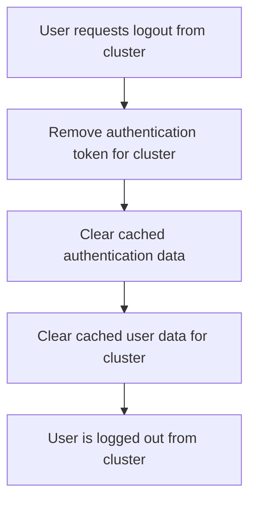

<SwmSnippet path="/frontend/src/lib/auth.ts" line="131">

---

<SwmToken path="frontend/src/lib/auth.ts" pos="131:6:6" line-data="export async function logout(cluster: string) {">`logout`</SwmToken> calls <SwmToken path="frontend/src/lib/auth.ts" pos="132:3:3" line-data="  return setToken(cluster, null).then(() =&gt; {">`setToken`</SwmToken> to clear the token for the cluster, then removes cached queries for auth and <SwmToken path="frontend/src/lib/auth.ts" pos="134:12:12" line-data="    queryClient.removeQueries({ queryKey: [&#39;clusterMe&#39;, cluster], exact: true });">`clusterMe`</SwmToken>. This wipes out any session data tied to the cluster, making sure the user is fully logged out.

```typescript
export async function logout(cluster: string) {
  return setToken(cluster, null).then(() => {
    queryClient.removeQueries({ queryKey: ['auth'], exact: false });
    queryClient.removeQueries({ queryKey: ['clusterMe', cluster], exact: true });
  });
}
```

---

</SwmSnippet>

## Updating the token and cache

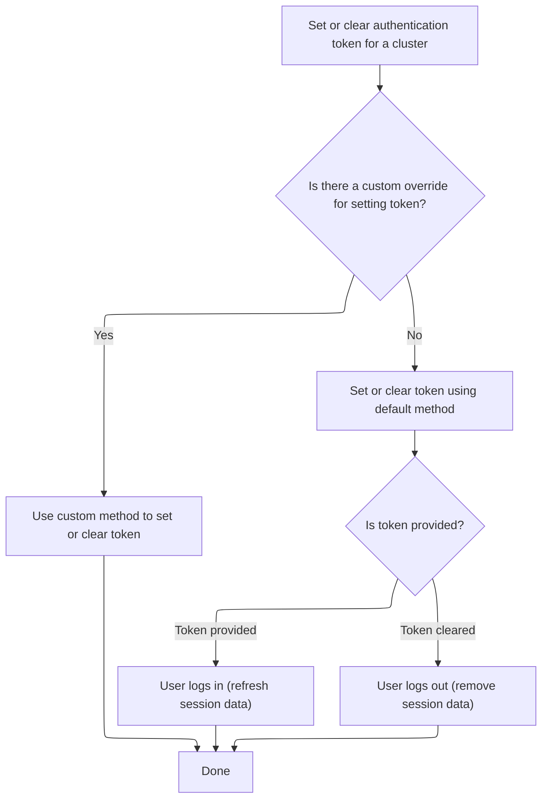

<SwmSnippet path="/frontend/src/lib/auth.ts" line="108">

---

<SwmToken path="frontend/src/lib/auth.ts" pos="108:4:4" line-data="export function setToken(cluster: string, token: string | null) {">`setToken`</SwmToken> checks if there's a custom override for setting the token. If not, it sets the token using <SwmToken path="frontend/src/lib/auth.ts" pos="114:3:3" line-data="  return setCookieToken(cluster, token).then(result =&gt; {">`setCookieToken`</SwmToken> and updates the query cache—invalidating if the token is present, removing if not. This keeps the cache in sync with the user's auth state.

```typescript
export function setToken(cluster: string, token: string | null) {
  const setTokenMethodToUse = store.getState().ui.functionsToOverride.setToken;
  if (setTokenMethodToUse) {
    return Promise.resolve(setTokenMethodToUse(cluster, token));
  }

  return setCookieToken(cluster, token).then(result => {
    if (token) {
      queryClient.invalidateQueries({ queryKey: ['clusterMe', cluster], exact: true });
    } else {
      queryClient.removeQueries({ queryKey: ['clusterMe', cluster], exact: true });
    }

    return result;
  });
}
```

---

</SwmSnippet>

## Persisting the token in cookies

<SwmSnippet path="/frontend/src/lib/auth.ts" line="79">

---

<SwmToken path="frontend/src/lib/auth.ts" pos="79:4:4" line-data="async function setCookieToken(cluster: string, token: string | null) {">`setCookieToken`</SwmToken> sends a POST request to the backend to set the token as a cookie for the cluster, using <SwmToken path="frontend/src/lib/auth.ts" pos="81:9:9" line-data="    const response = await backendFetch(`/clusters/${cluster}/set-token`, {">`backendFetch`</SwmToken> to make sure all the right headers and credentials are included. This lets the backend handle cookie storage securely.

```typescript
async function setCookieToken(cluster: string, token: string | null) {
  try {
    const response = await backendFetch(`/clusters/${cluster}/set-token`, {
      method: 'POST',
      headers: {
        'Content-Type': 'application/json',
        ...getHeadlampAPIHeaders(),
      },
      body: JSON.stringify({ token }),
    });

    if (!response.ok) {
      throw new Error(`Failed to set cookie token`);
    }
    return true;
  } catch (error) {
    console.error('Error setting cookie token:', error);
    throw error;
  }
}
```

---

</SwmSnippet>

## Making authenticated backend requests

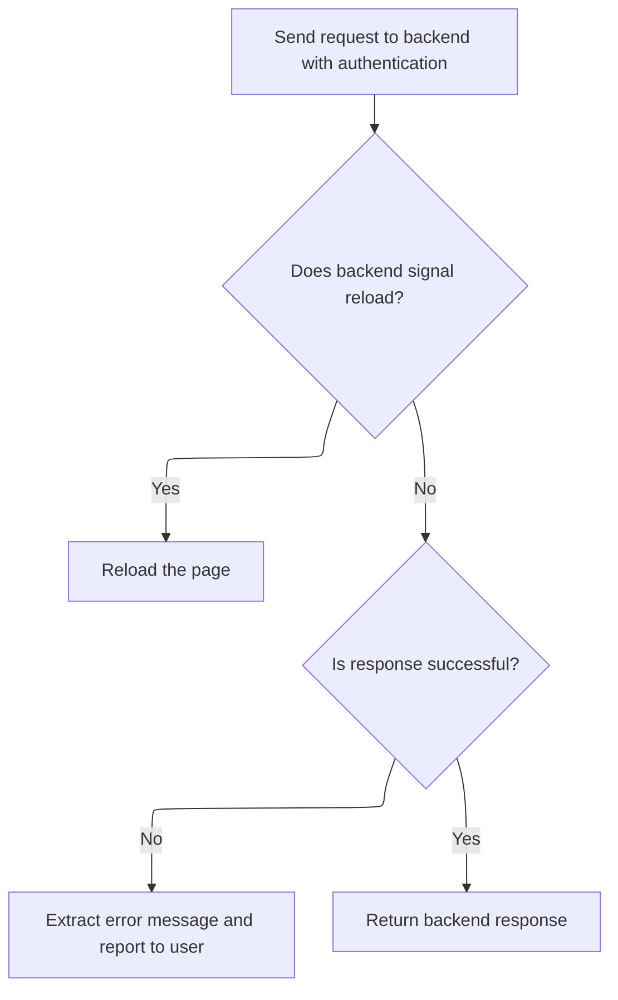

<SwmSnippet path="/frontend/src/lib/k8s/api/v2/fetch.ts" line="38">

---

In <SwmToken path="frontend/src/lib/k8s/api/v2/fetch.ts" pos="38:6:6" line-data="export async function backendFetch(url: string | URL, init: RequestInit = {}) {">`backendFetch`</SwmToken>, we always include credentials and add custom auth headers, then build the full backend URL using <SwmToken path="frontend/src/lib/k8s/api/v2/fetch.ts" pos="42:14:14" line-data="  const response = await fetch(makeUrl([getAppUrl(), url]), init);">`getAppUrl`</SwmToken> and <SwmToken path="frontend/src/lib/k8s/api/v2/fetch.ts" pos="42:11:11" line-data="  const response = await fetch(makeUrl([getAppUrl(), url]), init);">`makeUrl`</SwmToken>. This sets up the request for secure, authenticated communication with the backend.

```typescript
export async function backendFetch(url: string | URL, init: RequestInit = {}) {
  // Always include credentials
  init.credentials = 'include';
  init.headers = addBackstageAuthHeaders(init.headers);
  const response = await fetch(makeUrl([getAppUrl(), url]), init);

```

---

</SwmSnippet>

<SwmSnippet path="/frontend/src/lib/k8s/api/v2/fetch.ts" line="44">

---

Back in <SwmToken path="frontend/src/lib/auth.ts" pos="81:9:9" line-data="    const response = await backendFetch(`/clusters/${cluster}/set-token`, {">`backendFetch`</SwmToken>, after getting the response, we check for <SwmToken path="frontend/src/lib/k8s/api/v2/fetch.ts" pos="46:14:16" line-data="  const headerVal = response.headers.get(&#39;X-Reload&#39;);">`X-Reload`</SwmToken> to trigger a page reload if needed. If the response isn't ok, we try to parse the error message from the body and throw an <SwmToken path="frontend/src/lib/k8s/api/v2/fetch.ts" pos="59:5:5" line-data="    throw new ApiError(maybeErrorMessage ?? &#39;Unreachable&#39;, { status: response.status });">`ApiError`</SwmToken> with it. This keeps error handling and reload logic consistent.

```typescript
  // The backend signals through this header that it wants a reload.
  // See plugins.go
  const headerVal = response.headers.get('X-Reload');
  if (headerVal && headerVal.indexOf('reload') !== -1) {
    window.location.reload();
  }

  if (!response.ok) {
    // Try to parse error message from response
    let maybeErrorMessage: string | undefined;
    try {
      const body = await response.json();
      maybeErrorMessage = typeof body === 'string' ? body : body.message;
    } catch (e) {}

    throw new ApiError(maybeErrorMessage ?? 'Unreachable', { status: response.status });
  }

  return response;
}
```

---

</SwmSnippet>

## Finalizing the cluster request and error handling

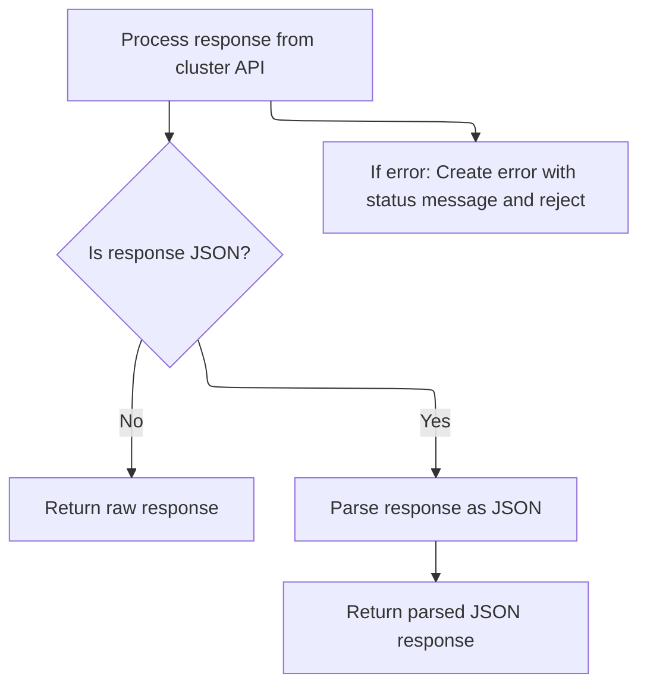

<SwmSnippet path="/frontend/src/lib/k8s/api/v1/clusterRequests.ts" line="197">

---

Back in <SwmToken path="frontend/src/lib/k8s/api/v1/clusterRequests.ts" pos="122:6:6" line-data="export async function clusterRequest(">`clusterRequest`</SwmToken>, after handling logout, we try to parse the error message from the response JSON and attach it to the error. If parsing fails, we log the issue and still return a rejected promise with the error. This wraps up error handling for the cluster request.

```typescript
    let message = statusText;
    try {
      if (isJSON) {
        const json = await response.json();
        message += ` - ${json.message}`;
      }
    } catch (err) {
      console.error(
        'Unable to parse error json at url:',
        url,
        { err },
        'with request data:',
        requestData
      );
    }

    const error = new Error(message) as ApiError;
    error.status = status;
    return Promise.reject(error);
  }

  if (!isJSON) {
    return Promise.resolve(response);
  }

  return response.json();
}
```

---

</SwmSnippet>

&nbsp;

*This is an auto-generated document by Swimm 🌊 and has not yet been verified by a human*

<SwmMeta version="3.0.0" repo-id="Z2l0aHViJTNBJTNBdHlwZXNjcmlwdC1oZWFkbGFtcCUzQSUzQXJpY2FyZG9sb3Blemc=" repo-name="typescript-headlamp"><sup>Powered by [Swimm](https://app.swimm.io/)</sup></SwmMeta>
