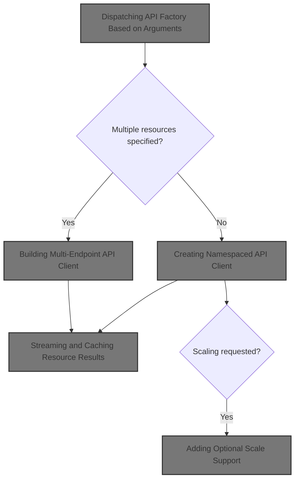

This document describes how the system builds an API client for interacting with Kubernetes resources within a namespace. The flow supports both single-resource and multi-resource operations, enabling users to perform actions such as listing, retrieving, creating, updating, deleting, and scaling resources. Aggregating multiple resource clients allows batch operations, and live updates are streamed from the cluster.



# Dispatching API Factory Based on Arguments

<SwmSnippet path="/frontend/src/lib/k8s/api/v1/factories.ts" line="389">

---

In <SwmToken path="frontend/src/lib/k8s/api/v1/factories.ts" pos="389:4:4" line-data="export function apiFactoryWithNamespace&lt;T extends KubeObjectInterface&gt;(">`apiFactoryWithNamespace`</SwmToken>, we start by checking if the first argument is an array. If it is, we hand off to <SwmToken path="frontend/src/lib/k8s/api/v1/factories.ts" pos="393:3:3" line-data="    return multipleApiFactoryWithNamespace&lt;T&gt;(">`multipleApiFactoryWithNamespace`</SwmToken>, which lets us build an API client that can talk to several endpoints at once. This is how we support multi-resource operations right from the entry point.

```typescript
export function apiFactoryWithNamespace<T extends KubeObjectInterface>(
  ...args: ApiFactoryWithNamespaceArguments
) {
  if (args[0] instanceof Array) {
    return multipleApiFactoryWithNamespace<T>(
      ...(args as MultipleApiFactoryWithNamespaceArguments)
    );
  }

```

---

</SwmSnippet>

## Building Multi-Endpoint API Client

```mermaid
%%{init: {"flowchart": {"defaultRenderer": "elk"}} }%%
flowchart TD
    node1["Receive resource type specifications"]
    click node1 openCode "frontend/src/lib/k8s/api/v1/factories.ts:401:403"
    
    subgraph loop1["For each resource type"]
      node1 --> node2["Create API client for resource type in namespace"]
      click node2 openCode "frontend/src/lib/k8s/api/v1/factories.ts:404:404"
    end
    node2 --> node3["Aggregate API clients"]
    click node3 openCode "frontend/src/lib/k8s/api/v1/factories.ts:404:404"
    node3 --> node4["Expose unified API client with namespaced operations: list, get, create, update, delete"]
    click node4 openCode "frontend/src/lib/k8s/api/v1/factories.ts:406:422"
    node3 --> node5["Provide API info for each resource type"]
    click node5 openCode "frontend/src/lib/k8s/api/v1/factories.ts:417:421"

classDef HeadingStyle fill:#777777,stroke:#333,stroke-width:2px;

%% Swimm:
%% %%{init: {"flowchart": {"defaultRenderer": "elk"}} }%%
%% flowchart TD
%%     node1["Receive resource type specifications"]
%%     click node1 openCode "<SwmPath>[frontend/…/v1/factories.ts](frontend/src/lib/k8s/api/v1/factories.ts)</SwmPath>:401:403"
%%     
%%     subgraph loop1["For each resource type"]
%%       node1 --> node2["Create API client for resource type in namespace"]
%%       click node2 openCode "<SwmPath>[frontend/…/v1/factories.ts](frontend/src/lib/k8s/api/v1/factories.ts)</SwmPath>:404:404"
%%     end
%%     node2 --> node3["Aggregate API clients"]
%%     click node3 openCode "<SwmPath>[frontend/…/v1/factories.ts](frontend/src/lib/k8s/api/v1/factories.ts)</SwmPath>:404:404"
%%     node3 --> node4["Expose unified API client with namespaced operations: list, get, create, update, delete"]
%%     click node4 openCode "<SwmPath>[frontend/…/v1/factories.ts](frontend/src/lib/k8s/api/v1/factories.ts)</SwmPath>:406:422"
%%     node3 --> node5["Provide API info for each resource type"]
%%     click node5 openCode "<SwmPath>[frontend/…/v1/factories.ts](frontend/src/lib/k8s/api/v1/factories.ts)</SwmPath>:417:421"
%% 
%% classDef HeadingStyle fill:#777777,stroke:#333,stroke-width:2px;
```



<SwmSnippet path="/frontend/src/lib/k8s/api/v1/factories.ts" line="401">

---

<SwmToken path="frontend/src/lib/k8s/api/v1/factories.ts" pos="401:2:2" line-data="function multipleApiFactoryWithNamespace&lt;T extends KubeObjectInterface&gt;(">`multipleApiFactoryWithNamespace`</SwmToken> loops through each API spec, calls <SwmToken path="frontend/src/lib/k8s/api/v1/factories.ts" pos="404:15:15" line-data="  const apiEndpoints = args.map(apiArgs =&gt; simpleApiFactoryWithNamespace(...apiArgs));">`simpleApiFactoryWithNamespace`</SwmToken> to get a client for each, and then wraps them up so you can run list/get/post/patch/put/delete across all endpoints at once. This lets you batch operations over several resources.

```typescript
function multipleApiFactoryWithNamespace<T extends KubeObjectInterface>(
  ...args: MultipleApiFactoryWithNamespaceArguments
): ApiWithNamespaceClient<T> {
  const apiEndpoints = args.map(apiArgs => simpleApiFactoryWithNamespace(...apiArgs));

  return {
    list: (namespace, cb, errCb, queryParams, cluster) => {
      return repeatStreamFunc(apiEndpoints, 'list', errCb, namespace, cb, queryParams, cluster);
    },
    get: (namespace, name, cb, errCb, queryParams, cluster) =>
      repeatStreamFunc(apiEndpoints, 'get', errCb, namespace, name, cb, queryParams, cluster),
    post: repeatFactoryMethod(apiEndpoints, 'post'),
    patch: repeatFactoryMethod(apiEndpoints, 'patch'),
    put: repeatFactoryMethod(apiEndpoints, 'put'),
    delete: repeatFactoryMethod(apiEndpoints, 'delete'),
    isNamespaced: true,
    apiInfo: args.map(apiArgs => ({
      group: apiArgs[0],
      version: apiArgs[1],
      resource: apiArgs[2],
    })),
  };
}
```

---

</SwmSnippet>

## Creating Namespaced API Client

<SwmSnippet path="/frontend/src/lib/k8s/api/v1/factories.ts" line="425">

---

In <SwmToken path="frontend/src/lib/k8s/api/v1/factories.ts" pos="425:2:2" line-data="function simpleApiFactoryWithNamespace&lt;T extends KubeObjectInterface&gt;(">`simpleApiFactoryWithNamespace`</SwmToken>, we set up the API client for a single namespaced resource. For listing, we call <SwmToken path="frontend/src/lib/k8s/api/v1/factories.ts" pos="444:3:3" line-data="      return streamResultsForCluster(url(namespace), { cb, errCb, cluster }, queryParams);">`streamResultsForCluster`</SwmToken> so we can get live updates and handle result limiting on the client side. All the CRUD methods are wired up to use the right URLs and parameters for the resource.

```typescript
function simpleApiFactoryWithNamespace<T extends KubeObjectInterface>(
  ...[group, version, resource, includeScale = false]: SimpleApiFactoryWithNamespaceArguments
): ApiWithNamespaceClient<T> {
  if (isDebugVerbose('k8s/apiProxy@simpleApiFactoryWithNamespace')) {
    console.debug('k8s/apiProxy@simpleApiFactoryWithNamespace', {
      group,
      version,
      resource,
      includeScale,
    });
  }

  const apiRoot = getApiRoot(group, version);
  const results: ApiWithNamespaceClient<T> = {
    list: (namespace, cb, errCb, queryParams, cluster) => {
      if (isDebugVerbose('k8s/apiProxy@simpleApiFactoryWithNamespace list')) {
        console.debug('k8s/apiProxy@simpleApiFactoryWithNamespace list', { cluster, queryParams });
      }

      return streamResultsForCluster(url(namespace), { cb, errCb, cluster }, queryParams);
    },
    get: (namespace, name, cb, errCb, queryParams, cluster) =>
      streamResult(url(namespace), name, cb, errCb, queryParams, cluster),
    post: (body, queryParams, cluster) =>
      post(url(body.metadata?.namespace!) + asQuery(queryParams), body, true, { cluster }),
    patch: (body, namespace, name, queryParams, cluster) =>
      patch(
        `${url(namespace)}/${name}` + asQuery({ ...queryParams, ...{ pretty: 'true' } }),
        body,
        true,
        { cluster }
      ),
    put: (body, queryParams, cluster) =>
      put(
        `${url(body.metadata.namespace!)}/${body.metadata.name}` + asQuery(queryParams),
        body,
        true,
        { cluster }
      ),
    delete: (namespace, name, deleteParams, cluster) =>
      remove(`${url(namespace)}/${name}` + asQuery(deleteParams), { cluster }),
    isNamespaced: true,
    apiInfo: [{ group, version, resource }],
  };

```

---

</SwmSnippet>

### Streaming and Caching Resource Results

```mermaid
%%{init: {"flowchart": {"defaultRenderer": "elk"}} }%%
flowchart TD
  node1["Select cluster and set up streaming parameters"] --> node2["Fetch initial resources from cluster"]
  click node1 openCode "frontend/src/lib/k8s/api/v1/streamingApi.ts:146:162"
  click node2 openCode "frontend/src/lib/k8s/api/v1/streamingApi.ts:167:181"
  node2 --> node3["Start live update stream"]
  click node3 openCode "frontend/src/lib/k8s/api/v1/streamingApi.ts:180:181"

  subgraph loop1["For each update event from cluster"]
    node3 --> node4{"What type of update event?"}
    click node4 openCode "frontend/src/lib/k8s/api/v1/streamingApi.ts:206:243"
    node4 -->|"ADDED"| node5["Add resource to list"]
    click node5 openCode "frontend/src/lib/k8s/api/v1/streamingApi.ts:210:212"
    node4 -->|"MODIFIED"| node6["Update resource in list"]
    click node6 openCode "frontend/src/lib/k8s/api/v1/streamingApi.ts:213:231"
    node4 -->|"DELETED"| node7["Remove resource from list"]
    click node7 openCode "frontend/src/lib/k8s/api/v1/streamingApi.ts:232:234"
    node4 -->|"ERROR"| node8["Log error"]
    click node8 openCode "frontend/src/lib/k8s/api/v1/streamingApi.ts:235:237"
    node5 --> node9{"Is resource count > maxResources?"}
    node6 --> node9
    node7 --> node9
    node8 --> node9
    click node9 openCode "frontend/src/lib/k8s/api/v1/streamingApi.ts:250:258"
    node9 -->|"Yes"| node10["Trim list to maxResources"]
    click node10 openCode "frontend/src/lib/k8s/api/v1/streamingApi.ts:257:258"
    node9 -->|"No"| node11["Keep resource list as is"]
    node10 --> node12["Send updated list to user"]
    node11 --> node12
    click node12 openCode "frontend/src/lib/k8s/api/v1/streamingApi.ts:263:263"
    node12 --> node13{"Is stream cancelled?"}
    click node13 openCode "frontend/src/lib/k8s/api/v1/streamingApi.ts:173:174"
    node13 -->|"No"| node3
    node13 -->|"Yes"| node14["Stop streaming"]
    click node14 openCode "frontend/src/lib/k8s/api/v1/streamingApi.ts:189:194"
  end

classDef HeadingStyle fill:#777777,stroke:#333,stroke-width:2px;

%% Swimm:
%% %%{init: {"flowchart": {"defaultRenderer": "elk"}} }%%
%% flowchart TD
%%   node1["Select cluster and set up streaming parameters"] --> node2["Fetch initial resources from cluster"]
%%   click node1 openCode "<SwmPath>[frontend/…/v1/streamingApi.ts](frontend/src/lib/k8s/api/v1/streamingApi.ts)</SwmPath>:146:162"
%%   click node2 openCode "<SwmPath>[frontend/…/v1/streamingApi.ts](frontend/src/lib/k8s/api/v1/streamingApi.ts)</SwmPath>:167:181"
%%   node2 --> node3["Start live update stream"]
%%   click node3 openCode "<SwmPath>[frontend/…/v1/streamingApi.ts](frontend/src/lib/k8s/api/v1/streamingApi.ts)</SwmPath>:180:181"
%% 
%%   subgraph loop1["For each update event from cluster"]
%%     node3 --> node4{"What type of update event?"}
%%     click node4 openCode "<SwmPath>[frontend/…/v1/streamingApi.ts](frontend/src/lib/k8s/api/v1/streamingApi.ts)</SwmPath>:206:243"
%%     node4 -->|"ADDED"| node5["Add resource to list"]
%%     click node5 openCode "<SwmPath>[frontend/…/v1/streamingApi.ts](frontend/src/lib/k8s/api/v1/streamingApi.ts)</SwmPath>:210:212"
%%     node4 -->|"MODIFIED"| node6["Update resource in list"]
%%     click node6 openCode "<SwmPath>[frontend/…/v1/streamingApi.ts](frontend/src/lib/k8s/api/v1/streamingApi.ts)</SwmPath>:213:231"
%%     node4 -->|"DELETED"| node7["Remove resource from list"]
%%     click node7 openCode "<SwmPath>[frontend/…/v1/streamingApi.ts](frontend/src/lib/k8s/api/v1/streamingApi.ts)</SwmPath>:232:234"
%%     node4 -->|"ERROR"| node8["Log error"]
%%     click node8 openCode "<SwmPath>[frontend/…/v1/streamingApi.ts](frontend/src/lib/k8s/api/v1/streamingApi.ts)</SwmPath>:235:237"
%%     node5 --> node9{"Is resource count > <SwmToken path="frontend/src/lib/k8s/api/v1/streamingApi.ts" pos="158:3:3" line-data="  const maxResources =">`maxResources`</SwmToken>?"}
%%     node6 --> node9
%%     node7 --> node9
%%     node8 --> node9
%%     click node9 openCode "<SwmPath>[frontend/…/v1/streamingApi.ts](frontend/src/lib/k8s/api/v1/streamingApi.ts)</SwmPath>:250:258"
%%     node9 -->|"Yes"| node10["Trim list to <SwmToken path="frontend/src/lib/k8s/api/v1/streamingApi.ts" pos="158:3:3" line-data="  const maxResources =">`maxResources`</SwmToken>"]
%%     click node10 openCode "<SwmPath>[frontend/…/v1/streamingApi.ts](frontend/src/lib/k8s/api/v1/streamingApi.ts)</SwmPath>:257:258"
%%     node9 -->|"No"| node11["Keep resource list as is"]
%%     node10 --> node12["Send updated list to user"]
%%     node11 --> node12
%%     click node12 openCode "<SwmPath>[frontend/…/v1/streamingApi.ts](frontend/src/lib/k8s/api/v1/streamingApi.ts)</SwmPath>:263:263"
%%     node12 --> node13{"Is stream cancelled?"}
%%     click node13 openCode "<SwmPath>[frontend/…/v1/streamingApi.ts](frontend/src/lib/k8s/api/v1/streamingApi.ts)</SwmPath>:173:174"
%%     node13 -->|"No"| node3
%%     node13 -->|"Yes"| node14["Stop streaming"]
%%     click node14 openCode "<SwmPath>[frontend/…/v1/streamingApi.ts](frontend/src/lib/k8s/api/v1/streamingApi.ts)</SwmPath>:189:194"
%%   end
%% 
%% classDef HeadingStyle fill:#777777,stroke:#333,stroke-width:2px;
```



<SwmSnippet path="/frontend/src/lib/k8s/api/v1/streamingApi.ts" line="141">

---

In <SwmToken path="frontend/src/lib/k8s/api/v1/streamingApi.ts" pos="141:4:4" line-data="export function streamResultsForCluster(">`streamResultsForCluster`</SwmToken>, we fetch all resources, trim 'List' from the kind string, and cache them by UID. We then open a watch stream for updates. <SwmToken path="frontend/src/lib/k8s/api/v1/streamingApi.ts" pos="158:3:3" line-data="  const maxResources =">`maxResources`</SwmToken> is used to limit the number of resources we send to the callback, since the server ignores the limit. Cluster context is picked from params or a global fallback.

```typescript
export function streamResultsForCluster(
  url: string,
  params: StreamResultsParams,
  queryParams?: QueryParameters
): Promise<() => void> {
  const { cb, errCb, cluster = '' } = params;
  const clusterName = cluster || getCluster() || '';

  const results: Record<string, any> = {};
  let isCancelled = false;
  let socket: ReturnType<typeof stream>;

  if (isDebugVerbose('k8s/apiProxy@streamResults')) {
    console.debug('k8s/apiProxy@streamResults', { url, queryParams });
  }

  // -1 means unlimited.
  const maxResources =
    typeof queryParams?.limit === 'number'
      ? queryParams.limit
      : parseInt(queryParams?.limit ?? '-1');

  run();

  return Promise.resolve(cancel);

  async function run() {
    try {
      const { kind, items, metadata } = await clusterRequest(url + asQuery(queryParams), {
        cluster: clusterName,
      });

      if (isCancelled) return;

      add(items, kind);

      const watchUrl =
        url +
        asQuery({ ...queryParams, ...{ watch: '1', resourceVersion: metadata.resourceVersion } });
      socket = stream(watchUrl, update, { isJson: true, cluster: clusterName });
    } catch (err) {
      console.error('Error in api request', { err, url });
      if (errCb && typeof errCb === 'function') {
        errCb(err as ApiError, cancel);
      }
    }
  }

  function cancel() {
    if (isCancelled) return;
    isCancelled = true;

    if (socket) socket.cancel();
  }

  function add(items: any[], kind: string) {
    const fixedKind = kind.slice(0, -4); // Trim off the word "List" from the end of the string
    for (const item of items) {
      item.kind = fixedKind;
      results[item.metadata.uid] = item;
    }
```

---

</SwmSnippet>

<SwmSnippet path="/frontend/src/lib/k8s/api/v1/streamingApi.ts" line="203">

---

After the initial fetch, we keep the cache updated by handling ADDED, MODIFIED, DELETED, and ERROR events from the stream. We trim 'List' from the kind, update or remove resources as needed, and always call the callback with the latest set, limited by <SwmToken path="frontend/src/lib/k8s/api/v1/streamingApi.ts" pos="247:15:15" line-data="    // Limit the number of resources to maxResources. We do this because when we&#39;re streaming, the">`maxResources`</SwmToken> if set.

```typescript
    push();
  }

  function update({ type, object }: StreamUpdate) {
    (object as KubeObjectInterface).actionType = type; // eslint-disable-line no-param-reassign

    switch (type) {
      case 'ADDED':
        results[object.metadata.uid] = object;
        break;
      case 'MODIFIED': {
        const existing = results[object.metadata.uid];

        if (existing) {
          if (!existing.metadata.resourceVersion || !object.metadata.resourceVersion) {
            console.error('Missing resourceVersion in object', object);
            break;
          }
          const currentVersion = parseInt(existing.metadata.resourceVersion, 10);
          const newVersion = parseInt(object.metadata.resourceVersion, 10);
          if (currentVersion < newVersion) {
            Object.assign(existing, object);
          }
        } else {
          results[object.metadata.uid] = object;
        }

        break;
      }
      case 'DELETED':
        delete results[object.metadata.uid];
        break;
      case 'ERROR':
        console.error('Error in update', { type, object });
        break;
      default:
        console.error('Unknown update type', type);
    }

    push();
  }

  function push() {
    const values = Object.values(results);
    // Limit the number of resources to maxResources. We do this because when we're streaming, the
    // API server will send us all the resources that match the query, without limitting, even if the
    // API params wanted to limit it. So we do the limitting here.
    if (maxResources > 0 && values.length > maxResources) {
      values.sort((a, b) => {
        const aTime = new Date(a.lastTimestamp || a.metadata.creationTimestamp!).getTime();
        const bTime = new Date(b.lastTimestamp || b.metadata.creationTimestamp!).getTime();
        // Reverse sort, so we have the most recent resources at the beginning of the array.
        return 0 - (aTime - bTime);
      });
      values.splice(0, values.length - maxResources);
    }

    if (isDebugVerbose('k8s/apiProxy@push cb(values)')) {
      console.debug('k8s/apiProxy@push cb(values)', { values });
    }
    cb(values);
  }
}
```

---

</SwmSnippet>

### Adding Optional Scale Support

```mermaid
%%{init: {"flowchart": {"defaultRenderer": "elk"}} }%%
flowchart TD
    node1["Create API object for namespace"] --> node2{"Scaling requested?"}
    click node1 openCode "frontend/src/lib/k8s/api/v1/factories.ts:470:474"
    node2 -->|"Yes"| node3["Add scaling operations using apiScaleFactory"]
    click node2 openCode "frontend/src/lib/k8s/api/v1/factories.ts:470:472"
    node2 -->|"No"| node4["Return API object (no scaling)"]
    click node3 openCode "frontend/src/lib/k8s/api/v1/scaleApi.ts:43:70"
    node3 --> node5["Return API object (with scaling)"]
    click node4 openCode "frontend/src/lib/k8s/api/v1/factories.ts:474:474"
    click node5 openCode "frontend/src/lib/k8s/api/v1/factories.ts:474:474"

classDef HeadingStyle fill:#777777,stroke:#333,stroke-width:2px;

%% Swimm:
%% %%{init: {"flowchart": {"defaultRenderer": "elk"}} }%%
%% flowchart TD
%%     node1["Create API object for namespace"] --> node2{"Scaling requested?"}
%%     click node1 openCode "<SwmPath>[frontend/…/v1/factories.ts](frontend/src/lib/k8s/api/v1/factories.ts)</SwmPath>:470:474"
%%     node2 -->|"Yes"| node3["Add scaling operations using <SwmToken path="frontend/src/lib/k8s/api/v1/factories.ts" pos="471:7:7" line-data="    results.scale = apiScaleFactory(apiRoot, resource);">`apiScaleFactory`</SwmToken>"]
%%     click node2 openCode "<SwmPath>[frontend/…/v1/factories.ts](frontend/src/lib/k8s/api/v1/factories.ts)</SwmPath>:470:472"
%%     node2 -->|"No"| node4["Return API object (no scaling)"]
%%     click node3 openCode "<SwmPath>[frontend/…/v1/scaleApi.ts](frontend/src/lib/k8s/api/v1/scaleApi.ts)</SwmPath>:43:70"
%%     node3 --> node5["Return API object (with scaling)"]
%%     click node4 openCode "<SwmPath>[frontend/…/v1/factories.ts](frontend/src/lib/k8s/api/v1/factories.ts)</SwmPath>:474:474"
%%     click node5 openCode "<SwmPath>[frontend/…/v1/factories.ts](frontend/src/lib/k8s/api/v1/factories.ts)</SwmPath>:474:474"
%% 
%% classDef HeadingStyle fill:#777777,stroke:#333,stroke-width:2px;
```



<SwmSnippet path="/frontend/src/lib/k8s/api/v1/factories.ts" line="470">

---

<SwmToken path="frontend/src/lib/k8s/api/v1/factories.ts" pos="471:7:7" line-data="    results.scale = apiScaleFactory(apiRoot, resource);">`apiScaleFactory`</SwmToken> builds a scale API client with get, put, and patch methods. URLs are constructed to hit the scale subresource for a resource in a namespace, and cluster context is picked from the argument or a global fallback. The factory can be reused for any resource that supports scaling.

```typescript
  if (includeScale) {
    results.scale = apiScaleFactory(apiRoot, resource);
  }

  return results;

```

---

</SwmSnippet>

<SwmSnippet path="/frontend/src/lib/k8s/api/v1/scaleApi.ts" line="43">

---

After returning from <SwmToken path="frontend/src/lib/k8s/api/v1/scaleApi.ts" pos="43:4:4" line-data="export function apiScaleFactory(apiRoot: string, resource: string): ScaleApi {">`apiScaleFactory`</SwmToken>, <SwmToken path="frontend/src/lib/k8s/api/v1/factories.ts" pos="398:3:3" line-data="  return simpleApiFactoryWithNamespace&lt;T&gt;(...(args as SimpleApiFactoryWithNamespaceArguments));">`simpleApiFactoryWithNamespace`</SwmToken> gives you a client object with all the CRUD methods scoped to a namespace, plus scale if requested. URLs are built to match the resource and namespace, and <SwmToken path="frontend/src/lib/k8s/api/v1/factories.ts" pos="417:1:1" line-data="    apiInfo: args.map(apiArgs =&gt; ({">`apiInfo`</SwmToken> tells you what API spec you're working with.

```typescript
export function apiScaleFactory(apiRoot: string, resource: string): ScaleApi {
  return {
    get: (namespace: string, name: string, clusterName?: string) => {
      const cluster = clusterName || getCluster() || '';
      return clusterRequest(url(namespace, name), { cluster });
    },
    put: (body: { metadata: KubeMetadata; spec: { replicas: number } }, clusterName?: string) => {
      const cluster = clusterName || getCluster() || '';
      return put(url(body.metadata.namespace!, body.metadata.name), body, undefined, { cluster });
    },
    patch: (
      body: {
        spec: {
          replicas: number;
        };
      },
      metadata: KubeMetadata,
      clusterName?: string
    ) => {
      const cluster = clusterName || getCluster() || '';
      return patch(url(metadata.namespace!, metadata.name), body, false, { cluster });
    },
  };

  function url(namespace: string, name: string) {
    return `${apiRoot}/namespaces/${namespace}/${resource}/${name}/scale`;
  }
}
```

---

</SwmSnippet>

<SwmSnippet path="/frontend/src/lib/k8s/api/v1/factories.ts" line="476">

---

After returning from <SwmToken path="frontend/src/lib/k8s/api/v1/factories.ts" pos="471:7:7" line-data="    results.scale = apiScaleFactory(apiRoot, resource);">`apiScaleFactory`</SwmToken>, <SwmToken path="frontend/src/lib/k8s/api/v1/factories.ts" pos="398:3:3" line-data="  return simpleApiFactoryWithNamespace&lt;T&gt;(...(args as SimpleApiFactoryWithNamespaceArguments));">`simpleApiFactoryWithNamespace`</SwmToken> finalizes the client object. You get all the CRUD methods scoped to a namespace, and scale if requested. URL construction is handled by a helper so every method hits the right endpoint.

```typescript
  function url(namespace: string) {
    return namespace ? `${apiRoot}/namespaces/${namespace}/${resource}` : `${apiRoot}/${resource}`;
  }
}
```

---

</SwmSnippet>

## Fallback to Single-Resource Client

<SwmSnippet path="/frontend/src/lib/k8s/api/v1/factories.ts" line="398">

---

After handling the multi-endpoint case, <SwmToken path="frontend/src/lib/k8s/api/v1/factories.ts" pos="389:4:4" line-data="export function apiFactoryWithNamespace&lt;T extends KubeObjectInterface&gt;(">`apiFactoryWithNamespace`</SwmToken> falls back to calling <SwmToken path="frontend/src/lib/k8s/api/v1/factories.ts" pos="398:3:3" line-data="  return simpleApiFactoryWithNamespace&lt;T&gt;(...(args as SimpleApiFactoryWithNamespaceArguments));">`simpleApiFactoryWithNamespace`</SwmToken> if the arguments are for a single resource. This sets up the client for just that one API spec.

```typescript
  return simpleApiFactoryWithNamespace<T>(...(args as SimpleApiFactoryWithNamespaceArguments));
}
```

---

</SwmSnippet>

&nbsp;

*This is an auto-generated document by Swimm 🌊 and has not yet been verified by a human*

<SwmMeta version="3.0.0" repo-id="Z2l0aHViJTNBJTNBdHlwZXNjcmlwdC1oZWFkbGFtcCUzQSUzQXJpY2FyZG9sb3Blemc=" repo-name="typescript-headlamp"><sup>Powered by [Swimm](https://app.swimm.io/)</sup></SwmMeta>
