This document outlines how API requests are sent with cluster context and how authentication is managed. Requests include cluster information, respond to backend signals, and handle authentication failures by logging out the user and clearing session data. The flow receives request details and cluster context as input, and returns the backend response or triggers logout as output.

# Where is this flow used?

This flow is used multiple times in the codebase as represented in the following diagram:

(Note - these are only some of the entry points of this flow)

```mermaid
graph TD;
      3e0eb8139d9a01980d464d1f7b56282926e9707ec06f0c55bdacf68730d17bc6(frontend/…/resourceMap/GraphView.tsx::GraphViewContent) --> 1a700f8dedf0d69d3be141ca7ce44d688aad107a774deb8655e974d7d1d949af(frontend/…/k8s/KubeObject.ts::KubeObject.useList)

3e0eb8139d9a01980d464d1f7b56282926e9707ec06f0c55bdacf68730d17bc6(frontend/…/resourceMap/GraphView.tsx::GraphViewContent) --> 59c1f49aac3d793dbcab833698719c95b6a6e82d69ed2536bccf9dedb573a66b(frontend/…/definitions/sources.tsx::useGetAllSources)

1a700f8dedf0d69d3be141ca7ce44d688aad107a774deb8655e974d7d1d949af(frontend/…/k8s/KubeObject.ts::KubeObject.useList) --> 02125f4ea4c1604df8935a6f33fb8d1437d8ac1c8b12f53cc45252204ea9f8c4(frontend/…/Charts/index.ts::useSelectedClusters)

02125f4ea4c1604df8935a6f33fb8d1437d8ac1c8b12f53cc45252204ea9f8c4(frontend/…/Charts/index.ts::useSelectedClusters) --> 099e97ecf5195ff301208cb7fb48125e24eb119e352d652cfda5ebba4860b231(frontend/…/Charts/index.ts::useCluster)

099e97ecf5195ff301208cb7fb48125e24eb119e352d652cfda5ebba4860b231(frontend/…/Charts/index.ts::useCluster) --> 52ca48fa3b320f4a3afcdf7e3b63e739f8145e3966bb3ab083fded7a4277a9cb(frontend/…/v1/clusterApi.ts::setCluster)

52ca48fa3b320f4a3afcdf7e3b63e739f8145e3966bb3ab083fded7a4277a9cb(frontend/…/v1/clusterApi.ts::setCluster) --> 28ea2067a14aab210239f42490708754d708d8185c3e0d5f61dbf7285327c4df(frontend/…/v1/clusterRequests.ts::request):::mainFlowStyle

59c1f49aac3d793dbcab833698719c95b6a6e82d69ed2536bccf9dedb573a66b(frontend/…/definitions/sources.tsx::useGetAllSources) --> 1a700f8dedf0d69d3be141ca7ce44d688aad107a774deb8655e974d7d1d949af(frontend/…/k8s/KubeObject.ts::KubeObject.useList)

3877936ed66287b8b37cfbe1b3357abe8f8e727ae0d0e28b1a1f7f954954568d(frontend/…/project/ProjectList.tsx::ProjectList) --> 685cb6efe89cbdecb96f92f48aed7ecf570b0623d5f4bb907d740929129900d7(frontend/…/project/useProjectResources.ts::useProjectItems)

3877936ed66287b8b37cfbe1b3357abe8f8e727ae0d0e28b1a1f7f954954568d(frontend/…/project/ProjectList.tsx::ProjectList) --> b1988d135c4a044e9af319d1d21e8cf78bbbb4c3d2c126c5f6030cef04508c9c(frontend/…/project/ProjectList.tsx::useProjects)

685cb6efe89cbdecb96f92f48aed7ecf570b0623d5f4bb907d740929129900d7(frontend/…/project/useProjectResources.ts::useProjectItems) --> 1443d34739bdacddccf826688f3618fd80fc1246cf434f58911c38e875bb06fc(frontend/…/utils/useKubeLists.tsx::useKubeLists)

1443d34739bdacddccf826688f3618fd80fc1246cf434f58911c38e875bb06fc(frontend/…/utils/useKubeLists.tsx::useKubeLists) --> 1a700f8dedf0d69d3be141ca7ce44d688aad107a774deb8655e974d7d1d949af(frontend/…/k8s/KubeObject.ts::KubeObject.useList)

b1988d135c4a044e9af319d1d21e8cf78bbbb4c3d2c126c5f6030cef04508c9c(frontend/…/project/ProjectList.tsx::useProjects) --> 1a700f8dedf0d69d3be141ca7ce44d688aad107a774deb8655e974d7d1d949af(frontend/…/k8s/KubeObject.ts::KubeObject.useList)

e3565f27ed50d7a4ca09e8ff5e67d66312ab9df76d0d24c305edec09ea955389(frontend/…/resourceMap/GraphView.tsx::GraphView) --> eb0529837b1caee2ddb903a1495d1f3e276faa63d8e1fb2a10a0450d6f39aa83(frontend/…/definitions/relations.tsx::useGetAllRelations)

e3565f27ed50d7a4ca09e8ff5e67d66312ab9df76d0d24c305edec09ea955389(frontend/…/resourceMap/GraphView.tsx::GraphView) --> 59c1f49aac3d793dbcab833698719c95b6a6e82d69ed2536bccf9dedb573a66b(frontend/…/definitions/sources.tsx::useGetAllSources)

eb0529837b1caee2ddb903a1495d1f3e276faa63d8e1fb2a10a0450d6f39aa83(frontend/…/definitions/relations.tsx::useGetAllRelations) --> a0d2ded8f46a8c82100b965740528d259f7adbe5c514ef9ecc22d96b6c34255a(frontend/…/definitions/relations.tsx::useGetCRToOwnerRelations)

a0d2ded8f46a8c82100b965740528d259f7adbe5c514ef9ecc22d96b6c34255a(frontend/…/definitions/relations.tsx::useGetCRToOwnerRelations) --> 1a700f8dedf0d69d3be141ca7ce44d688aad107a774deb8655e974d7d1d949af(frontend/…/k8s/KubeObject.ts::KubeObject.useList)

e2c50bfb86c2151ea4882e17040349ffebb9340e732797959a79591c0320a428(frontend/…/configmap/Details.tsx::CronJobDetails) --> 1a700f8dedf0d69d3be141ca7ce44d688aad107a774deb8655e974d7d1d949af(frontend/…/k8s/KubeObject.ts::KubeObject.useList)

e724060e9a0f7dfc56d2b47f86d8f826f19aed6ef6fe36c6e22eecb687600118(frontend/…/globalSearch/GlobalSearchContent.tsx::GlobalSearchContent) --> 8a8436df8295316f4e8290e78dd219207a354087b39abc025f760097f68cb549(frontend/…/globalSearch/GlobalSearchContent.tsx::useSearchResources)

e724060e9a0f7dfc56d2b47f86d8f826f19aed6ef6fe36c6e22eecb687600118(frontend/…/globalSearch/GlobalSearchContent.tsx::GlobalSearchContent) --> 02125f4ea4c1604df8935a6f33fb8d1437d8ac1c8b12f53cc45252204ea9f8c4(frontend/…/Charts/index.ts::useSelectedClusters)

8a8436df8295316f4e8290e78dd219207a354087b39abc025f760097f68cb549(frontend/…/globalSearch/GlobalSearchContent.tsx::useSearchResources) --> 02125f4ea4c1604df8935a6f33fb8d1437d8ac1c8b12f53cc45252204ea9f8c4(frontend/…/Charts/index.ts::useSelectedClusters)

8a8436df8295316f4e8290e78dd219207a354087b39abc025f760097f68cb549(frontend/…/globalSearch/GlobalSearchContent.tsx::useSearchResources) --> 1a700f8dedf0d69d3be141ca7ce44d688aad107a774deb8655e974d7d1d949af(frontend/…/k8s/KubeObject.ts::KubeObject.useList)


classDef mainFlowStyle color:#000000,fill:#7CB9F4
classDef rootsStyle color:#000000,fill:#00FFF4
classDef Style1 color:#000000,fill:#00FFAA
classDef Style2 color:#000000,fill:#FFFF00
classDef Style3 color:#000000,fill:#AA7CB9

%% Swimm:
%% graph TD;
%%       3e0eb8139d9a01980d464d1f7b56282926e9707ec06f0c55bdacf68730d17bc6(<SwmPath>[frontend/…/resourceMap/GraphView.tsx](frontend/src/components/resourceMap/GraphView.tsx)</SwmPath>::GraphViewContent) --> 1a700f8dedf0d69d3be141ca7ce44d688aad107a774deb8655e974d7d1d949af(<SwmPath>[frontend/…/k8s/KubeObject.ts](frontend/src/lib/k8s/KubeObject.ts)</SwmPath>::KubeObject.useList)
%% 
%% 3e0eb8139d9a01980d464d1f7b56282926e9707ec06f0c55bdacf68730d17bc6(<SwmPath>[frontend/…/resourceMap/GraphView.tsx](frontend/src/components/resourceMap/GraphView.tsx)</SwmPath>::GraphViewContent) --> 59c1f49aac3d793dbcab833698719c95b6a6e82d69ed2536bccf9dedb573a66b(<SwmPath>[frontend/…/definitions/sources.tsx](frontend/src/components/resourceMap/sources/definitions/sources.tsx)</SwmPath>::useGetAllSources)
%% 
%% 1a700f8dedf0d69d3be141ca7ce44d688aad107a774deb8655e974d7d1d949af(<SwmPath>[frontend/…/k8s/KubeObject.ts](frontend/src/lib/k8s/KubeObject.ts)</SwmPath>::KubeObject.useList) --> 02125f4ea4c1604df8935a6f33fb8d1437d8ac1c8b12f53cc45252204ea9f8c4(<SwmPath>[frontend/…/Charts/index.ts](frontend/src/components/cluster/Charts/index.ts)</SwmPath>::useSelectedClusters)
%% 
%% 02125f4ea4c1604df8935a6f33fb8d1437d8ac1c8b12f53cc45252204ea9f8c4(<SwmPath>[frontend/…/Charts/index.ts](frontend/src/components/cluster/Charts/index.ts)</SwmPath>::useSelectedClusters) --> 099e97ecf5195ff301208cb7fb48125e24eb119e352d652cfda5ebba4860b231(<SwmPath>[frontend/…/Charts/index.ts](frontend/src/components/cluster/Charts/index.ts)</SwmPath>::<SwmToken path="frontend/src/lib/k8s/api/v1/clusterRequests.ts" pos="98:1:1" line-data="  useCluster: boolean = true,">`useCluster`</SwmToken>)
%% 
%% 099e97ecf5195ff301208cb7fb48125e24eb119e352d652cfda5ebba4860b231(<SwmPath>[frontend/…/Charts/index.ts](frontend/src/components/cluster/Charts/index.ts)</SwmPath>::<SwmToken path="frontend/src/lib/k8s/api/v1/clusterRequests.ts" pos="98:1:1" line-data="  useCluster: boolean = true,">`useCluster`</SwmToken>) --> 52ca48fa3b320f4a3afcdf7e3b63e739f8145e3966bb3ab083fded7a4277a9cb(<SwmPath>[frontend/…/v1/clusterApi.ts](frontend/src/lib/k8s/api/v1/clusterApi.ts)</SwmPath>::setCluster)
%% 
%% 52ca48fa3b320f4a3afcdf7e3b63e739f8145e3966bb3ab083fded7a4277a9cb(<SwmPath>[frontend/…/v1/clusterApi.ts](frontend/src/lib/k8s/api/v1/clusterApi.ts)</SwmPath>::setCluster) --> 28ea2067a14aab210239f42490708754d708d8185c3e0d5f61dbf7285327c4df(<SwmPath>[frontend/…/v1/clusterRequests.ts](frontend/src/lib/k8s/api/v1/clusterRequests.ts)</SwmPath>::request):::mainFlowStyle
%% 
%% 59c1f49aac3d793dbcab833698719c95b6a6e82d69ed2536bccf9dedb573a66b(<SwmPath>[frontend/…/definitions/sources.tsx](frontend/src/components/resourceMap/sources/definitions/sources.tsx)</SwmPath>::useGetAllSources) --> 1a700f8dedf0d69d3be141ca7ce44d688aad107a774deb8655e974d7d1d949af(<SwmPath>[frontend/…/k8s/KubeObject.ts](frontend/src/lib/k8s/KubeObject.ts)</SwmPath>::KubeObject.useList)
%% 
%% 3877936ed66287b8b37cfbe1b3357abe8f8e727ae0d0e28b1a1f7f954954568d(<SwmPath>[frontend/…/project/ProjectList.tsx](frontend/src/components/project/ProjectList.tsx)</SwmPath>::ProjectList) --> 685cb6efe89cbdecb96f92f48aed7ecf570b0623d5f4bb907d740929129900d7(<SwmPath>[frontend/…/project/useProjectResources.ts](frontend/src/components/project/useProjectResources.ts)</SwmPath>::useProjectItems)
%% 
%% 3877936ed66287b8b37cfbe1b3357abe8f8e727ae0d0e28b1a1f7f954954568d(<SwmPath>[frontend/…/project/ProjectList.tsx](frontend/src/components/project/ProjectList.tsx)</SwmPath>::ProjectList) --> b1988d135c4a044e9af319d1d21e8cf78bbbb4c3d2c126c5f6030cef04508c9c(<SwmPath>[frontend/…/project/ProjectList.tsx](frontend/src/components/project/ProjectList.tsx)</SwmPath>::useProjects)
%% 
%% 685cb6efe89cbdecb96f92f48aed7ecf570b0623d5f4bb907d740929129900d7(<SwmPath>[frontend/…/project/useProjectResources.ts](frontend/src/components/project/useProjectResources.ts)</SwmPath>::useProjectItems) --> 1443d34739bdacddccf826688f3618fd80fc1246cf434f58911c38e875bb06fc(<SwmPath>[frontend/…/utils/useKubeLists.tsx](frontend/src/components/advancedSearch/utils/useKubeLists.tsx)</SwmPath>::useKubeLists)
%% 
%% 1443d34739bdacddccf826688f3618fd80fc1246cf434f58911c38e875bb06fc(<SwmPath>[frontend/…/utils/useKubeLists.tsx](frontend/src/components/advancedSearch/utils/useKubeLists.tsx)</SwmPath>::useKubeLists) --> 1a700f8dedf0d69d3be141ca7ce44d688aad107a774deb8655e974d7d1d949af(<SwmPath>[frontend/…/k8s/KubeObject.ts](frontend/src/lib/k8s/KubeObject.ts)</SwmPath>::KubeObject.useList)
%% 
%% b1988d135c4a044e9af319d1d21e8cf78bbbb4c3d2c126c5f6030cef04508c9c(<SwmPath>[frontend/…/project/ProjectList.tsx](frontend/src/components/project/ProjectList.tsx)</SwmPath>::useProjects) --> 1a700f8dedf0d69d3be141ca7ce44d688aad107a774deb8655e974d7d1d949af(<SwmPath>[frontend/…/k8s/KubeObject.ts](frontend/src/lib/k8s/KubeObject.ts)</SwmPath>::KubeObject.useList)
%% 
%% e3565f27ed50d7a4ca09e8ff5e67d66312ab9df76d0d24c305edec09ea955389(<SwmPath>[frontend/…/resourceMap/GraphView.tsx](frontend/src/components/resourceMap/GraphView.tsx)</SwmPath>::GraphView) --> eb0529837b1caee2ddb903a1495d1f3e276faa63d8e1fb2a10a0450d6f39aa83(<SwmPath>[frontend/…/definitions/relations.tsx](frontend/src/components/resourceMap/sources/definitions/relations.tsx)</SwmPath>::useGetAllRelations)
%% 
%% e3565f27ed50d7a4ca09e8ff5e67d66312ab9df76d0d24c305edec09ea955389(<SwmPath>[frontend/…/resourceMap/GraphView.tsx](frontend/src/components/resourceMap/GraphView.tsx)</SwmPath>::GraphView) --> 59c1f49aac3d793dbcab833698719c95b6a6e82d69ed2536bccf9dedb573a66b(<SwmPath>[frontend/…/definitions/sources.tsx](frontend/src/components/resourceMap/sources/definitions/sources.tsx)</SwmPath>::useGetAllSources)
%% 
%% eb0529837b1caee2ddb903a1495d1f3e276faa63d8e1fb2a10a0450d6f39aa83(<SwmPath>[frontend/…/definitions/relations.tsx](frontend/src/components/resourceMap/sources/definitions/relations.tsx)</SwmPath>::useGetAllRelations) --> a0d2ded8f46a8c82100b965740528d259f7adbe5c514ef9ecc22d96b6c34255a(<SwmPath>[frontend/…/definitions/relations.tsx](frontend/src/components/resourceMap/sources/definitions/relations.tsx)</SwmPath>::useGetCRToOwnerRelations)
%% 
%% a0d2ded8f46a8c82100b965740528d259f7adbe5c514ef9ecc22d96b6c34255a(<SwmPath>[frontend/…/definitions/relations.tsx](frontend/src/components/resourceMap/sources/definitions/relations.tsx)</SwmPath>::useGetCRToOwnerRelations) --> 1a700f8dedf0d69d3be141ca7ce44d688aad107a774deb8655e974d7d1d949af(<SwmPath>[frontend/…/k8s/KubeObject.ts](frontend/src/lib/k8s/KubeObject.ts)</SwmPath>::KubeObject.useList)
%% 
%% e2c50bfb86c2151ea4882e17040349ffebb9340e732797959a79591c0320a428(<SwmPath>[frontend/…/configmap/Details.tsx](frontend/src/components/configmap/Details.tsx)</SwmPath>::CronJobDetails) --> 1a700f8dedf0d69d3be141ca7ce44d688aad107a774deb8655e974d7d1d949af(<SwmPath>[frontend/…/k8s/KubeObject.ts](frontend/src/lib/k8s/KubeObject.ts)</SwmPath>::KubeObject.useList)
%% 
%% e724060e9a0f7dfc56d2b47f86d8f826f19aed6ef6fe36c6e22eecb687600118(<SwmPath>[frontend/…/globalSearch/GlobalSearchContent.tsx](frontend/src/components/globalSearch/GlobalSearchContent.tsx)</SwmPath>::GlobalSearchContent) --> 8a8436df8295316f4e8290e78dd219207a354087b39abc025f760097f68cb549(<SwmPath>[frontend/…/globalSearch/GlobalSearchContent.tsx](frontend/src/components/globalSearch/GlobalSearchContent.tsx)</SwmPath>::useSearchResources)
%% 
%% e724060e9a0f7dfc56d2b47f86d8f826f19aed6ef6fe36c6e22eecb687600118(<SwmPath>[frontend/…/globalSearch/GlobalSearchContent.tsx](frontend/src/components/globalSearch/GlobalSearchContent.tsx)</SwmPath>::GlobalSearchContent) --> 02125f4ea4c1604df8935a6f33fb8d1437d8ac1c8b12f53cc45252204ea9f8c4(<SwmPath>[frontend/…/Charts/index.ts](frontend/src/components/cluster/Charts/index.ts)</SwmPath>::useSelectedClusters)
%% 
%% 8a8436df8295316f4e8290e78dd219207a354087b39abc025f760097f68cb549(<SwmPath>[frontend/…/globalSearch/GlobalSearchContent.tsx](frontend/src/components/globalSearch/GlobalSearchContent.tsx)</SwmPath>::useSearchResources) --> 02125f4ea4c1604df8935a6f33fb8d1437d8ac1c8b12f53cc45252204ea9f8c4(<SwmPath>[frontend/…/Charts/index.ts](frontend/src/components/cluster/Charts/index.ts)</SwmPath>::useSelectedClusters)
%% 
%% 8a8436df8295316f4e8290e78dd219207a354087b39abc025f760097f68cb549(<SwmPath>[frontend/…/globalSearch/GlobalSearchContent.tsx](frontend/src/components/globalSearch/GlobalSearchContent.tsx)</SwmPath>::useSearchResources) --> 1a700f8dedf0d69d3be141ca7ce44d688aad107a774deb8655e974d7d1d949af(<SwmPath>[frontend/…/k8s/KubeObject.ts](frontend/src/lib/k8s/KubeObject.ts)</SwmPath>::KubeObject.useList)
%% 
%% 
%% classDef mainFlowStyle color:#000000,fill:#7CB9F4
%% classDef rootsStyle color:#000000,fill:#00FFF4
%% classDef Style1 color:#000000,fill:#00FFAA
%% classDef Style2 color:#000000,fill:#FFFF00
%% classDef Style3 color:#000000,fill:#AA7CB9
```



# Preparing and forwarding the API request


<SwmSnippet path="/frontend/src/lib/k8s/api/v1/clusterRequests.ts" line="94">

---

<SwmToken path="frontend/src/lib/k8s/api/v1/clusterRequests.ts" pos="94:6:6" line-data="export async function request(">`request`</SwmToken> kicks off the flow by grabbing the current cluster (if needed) and logging debug info if enabled. It then hands off all the relevant parameters to <SwmToken path="frontend/src/lib/k8s/api/v1/clusterRequests.ts" pos="108:3:3" line-data="  return clusterRequest(path, { cluster, autoLogoutOnAuthError, ...params }, queryParams);">`clusterRequest`</SwmToken>, which is where the actual request construction and cluster-specific logic happens. We call <SwmToken path="frontend/src/lib/k8s/api/v1/clusterRequests.ts" pos="108:3:3" line-data="  return clusterRequest(path, { cluster, autoLogoutOnAuthError, ...params }, queryParams);">`clusterRequest`</SwmToken> next because that's where headers, authentication, and error handling are managed.

```typescript
export async function request(
  path: string,
  params: RequestParams = {},
  autoLogoutOnAuthError: boolean = true,
  useCluster: boolean = true,
  queryParams?: QueryParameters
): Promise<any> {
  // @todo: This is a temporary way of getting the current cluster. We should improve it later.
  const cluster = (useCluster && getCluster()) || '';

  if (isDebugVerbose('k8s/apiProxy@request')) {
    console.debug('k8s/apiProxy@request', { path, params, useCluster, queryParams });
  }

  return clusterRequest(path, { cluster, autoLogoutOnAuthError, ...params }, queryParams);
}
```

---

</SwmSnippet>

# Building and sending the cluster-aware request


<SwmSnippet path="/frontend/src/lib/k8s/api/v1/clusterRequests.ts" line="122">

---

In <SwmToken path="frontend/src/lib/k8s/api/v1/clusterRequests.ts" pos="122:6:6" line-data="export async function clusterRequest(">`clusterRequest`</SwmToken>, we build the request URL, add cluster-specific kubeconfig and user ID headers if a cluster is set, and set up a timeout using <SwmToken path="frontend/src/lib/k8s/api/v1/clusterRequests.ts" pos="157:9:9" line-data="  const controller = new AbortController();">`AbortController`</SwmToken>. After sending the request, we check for a backend reload signal and handle 401 errors by calling logout if the request was authenticated. We need to call <SwmPath>[frontend/…/lib/auth.ts](frontend/src/lib/auth.ts)</SwmPath> next to actually perform the logout and clear credentials when needed.

```typescript
export async function clusterRequest(
  path: string,
  params: ClusterRequestParams = {},
  queryParams?: QueryParameters
): Promise<any> {
  interface RequestHeaders {
    Authorization?: string;
    cluster?: string;
    autoLogoutOnAuthError?: boolean;
    [otherHeader: string]: any;
  }

  const {
    timeout = DEFAULT_TIMEOUT,
    cluster: paramsCluster,
    autoLogoutOnAuthError = true,
    isJSON = true,
    ...otherParams
  } = params;

  const userID = getUserIdFromLocalStorage();
  const opts: { headers: RequestHeaders } = Object.assign({ headers: {} }, otherParams);
  const cluster = paramsCluster || '';

  let fullPath = path;
  if (cluster) {
    const kubeconfig = await findKubeconfigByClusterName(cluster);
    if (kubeconfig !== null) {
      opts.headers['KUBECONFIG'] = kubeconfig;
      opts.headers['X-HEADLAMP-USER-ID'] = userID;
    }

    fullPath = combinePath(`/${CLUSTERS_PREFIX}/${cluster}`, path);
  }

  const controller = new AbortController();
  const id = setTimeout(() => controller.abort(), timeout);

  let url = combinePath(getAppUrl(), fullPath);
  url += asQuery(queryParams);
  const requestData = {
    signal: controller.signal,
    credentials: 'include' as RequestCredentials,
    ...opts,
  };
  if (isBackstage()) {
    requestData.headers = addBackstageAuthHeaders(requestData.headers);
  }
  let response: Response = new Response(undefined, { status: 502, statusText: 'Unreachable' });
  try {
    response = await fetch(url, requestData);
  } catch (err) {
    if (err instanceof Error) {
      if (err.name === 'AbortError') {
        response = new Response(undefined, { status: 408, statusText: 'Request timed-out' });
      }
    }
  } finally {
    clearTimeout(id);
  }

  // The backend signals through this header that it wants a reload.
  // See plugins.go
  const headerVal = response.headers.get('X-Reload');
  if (headerVal && headerVal.indexOf('reload') !== -1) {
    window.location.reload();
  }

  if (!response.ok) {
    const { status, statusText } = response;
    if (autoLogoutOnAuthError && status === 401 && opts.headers.Authorization) {
      console.error('Logging out due to auth error', { status, statusText, path });
      logout(cluster);
    }

```

---

</SwmSnippet>

## Clearing cluster authentication and cache


<SwmSnippet path="/frontend/src/lib/auth.ts" line="131">

---

<SwmToken path="frontend/src/lib/auth.ts" pos="131:6:6" line-data="export async function logout(cluster: string) {">`logout`</SwmToken> clears the cluster token and wipes cached auth and user info queries.

```typescript
export async function logout(cluster: string) {
  return setToken(cluster, null).then(() => {
    queryClient.removeQueries({ queryKey: ['auth'], exact: false });
    queryClient.removeQueries({ queryKey: ['clusterMe', cluster], exact: true });
  });
}
```

---

</SwmSnippet>

## Setting or removing the cluster token


<SwmSnippet path="/frontend/src/lib/auth.ts" line="108">

---

<SwmToken path="frontend/src/lib/auth.ts" pos="108:4:4" line-data="export function setToken(cluster: string, token: string | null) {">`setToken`</SwmToken> checks for a custom override for token setting; if present, it uses that, otherwise it calls <SwmToken path="frontend/src/lib/auth.ts" pos="114:3:3" line-data="  return setCookieToken(cluster, token).then(result =&gt; {">`setCookieToken`</SwmToken>. After setting the token, it either invalidates or removes <SwmToken path="frontend/src/lib/auth.ts" pos="116:12:12" line-data="      queryClient.invalidateQueries({ queryKey: [&#39;clusterMe&#39;, cluster], exact: true });">`clusterMe`</SwmToken> queries to keep the cache in sync with the token state.

```typescript
export function setToken(cluster: string, token: string | null) {
  const setTokenMethodToUse = store.getState().ui.functionsToOverride.setToken;
  if (setTokenMethodToUse) {
    return Promise.resolve(setTokenMethodToUse(cluster, token));
  }

  return setCookieToken(cluster, token).then(result => {
    if (token) {
      queryClient.invalidateQueries({ queryKey: ['clusterMe', cluster], exact: true });
    } else {
      queryClient.removeQueries({ queryKey: ['clusterMe', cluster], exact: true });
    }

    return result;
  });
}
```

---

</SwmSnippet>

## Persisting the token via backend API

<SwmSnippet path="/frontend/src/lib/auth.ts" line="79">

---

<SwmToken path="frontend/src/lib/auth.ts" pos="79:4:4" line-data="async function setCookieToken(cluster: string, token: string | null) {">`setCookieToken`</SwmToken> sends the token to the backend using <SwmToken path="frontend/src/lib/auth.ts" pos="81:9:9" line-data="    const response = await backendFetch(`/clusters/${cluster}/set-token`, {">`backendFetch`</SwmToken>, which handles auth headers and reload signals. If the backend rejects the token, we throw an error. We call <SwmToken path="frontend/src/lib/auth.ts" pos="81:9:9" line-data="    const response = await backendFetch(`/clusters/${cluster}/set-token`, {">`backendFetch`</SwmToken> next because it wraps fetch with repo-specific logic.

```typescript
async function setCookieToken(cluster: string, token: string | null) {
  try {
    const response = await backendFetch(`/clusters/${cluster}/set-token`, {
      method: 'POST',
      headers: {
        'Content-Type': 'application/json',
        ...getHeadlampAPIHeaders(),
      },
      body: JSON.stringify({ token }),
    });

    if (!response.ok) {
      throw new Error(`Failed to set cookie token`);
    }
    return true;
  } catch (error) {
    console.error('Error setting cookie token:', error);
    throw error;
  }
}
```

---

</SwmSnippet>

<SwmSnippet path="/frontend/src/lib/k8s/api/v2/fetch.ts" line="38">

---

<SwmToken path="frontend/src/lib/k8s/api/v2/fetch.ts" pos="38:6:6" line-data="export async function backendFetch(url: string | URL, init: RequestInit = {}) {">`backendFetch`</SwmToken> builds the full backend URL, adds authentication headers, and sends the request. If the backend signals a reload via the <SwmToken path="frontend/src/lib/k8s/api/v2/fetch.ts" pos="46:14:16" line-data="  const headerVal = response.headers.get(&#39;X-Reload&#39;);">`X-Reload`</SwmToken> header, it reloads the page. Errors from the backend are parsed and thrown as <SwmToken path="frontend/src/lib/k8s/api/v2/fetch.ts" pos="59:5:5" line-data="    throw new ApiError(maybeErrorMessage ?? &#39;Unreachable&#39;, { status: response.status });">`ApiError`</SwmToken>.

```typescript
export async function backendFetch(url: string | URL, init: RequestInit = {}) {
  // Always include credentials
  init.credentials = 'include';
  init.headers = addBackstageAuthHeaders(init.headers);
  const response = await fetch(makeUrl([getAppUrl(), url]), init);

  // The backend signals through this header that it wants a reload.
  // See plugins.go
  const headerVal = response.headers.get('X-Reload');
  if (headerVal && headerVal.indexOf('reload') !== -1) {
    window.location.reload();
  }

  if (!response.ok) {
    // Try to parse error message from response
    let maybeErrorMessage: string | undefined;
    try {
      const body = await response.json();
      maybeErrorMessage = typeof body === 'string' ? body : body.message;
    } catch (e) {}

    throw new ApiError(maybeErrorMessage ?? 'Unreachable', { status: response.status });
  }

  return response;
}
```

---

</SwmSnippet>

## Handling errors after logout in cluster requests


<SwmSnippet path="/frontend/src/lib/k8s/api/v1/clusterRequests.ts" line="197">

---

Back in <SwmToken path="frontend/src/lib/k8s/api/v1/clusterRequests.ts" pos="108:3:3" line-data="  return clusterRequest(path, { cluster, autoLogoutOnAuthError, ...params }, queryParams);">`clusterRequest`</SwmToken>, after returning from logout, we parse the error response (if JSON), build a detailed error message, and reject the promise with this error. This gives the caller context about the failure even after the user is logged out.

```typescript
    let message = statusText;
    try {
      if (isJSON) {
        const json = await response.json();
        message += ` - ${json.message}`;
      }
    } catch (err) {
      console.error(
        'Unable to parse error json at url:',
        url,
        { err },
        'with request data:',
        requestData
      );
    }

    const error = new Error(message) as ApiError;
    error.status = status;
    return Promise.reject(error);
  }

  if (!isJSON) {
    return Promise.resolve(response);
  }

  return response.json();
}
```

---

</SwmSnippet>

&nbsp;

*This is an auto-generated document by Swimm 🌊 and has not yet been verified by a human*

<SwmMeta version="3.0.0" repo-id="Z2l0aHViJTNBJTNBdHlwZXNjcmlwdC1oZWFkbGFtcCUzQSUzQXJpY2FyZG9sb3Blemc=" repo-name="typescript-headlamp"><sup>Powered by [Swimm](https://app.swimm.io/)</sup></SwmMeta>
