This document explains how the application keeps the current Kubernetes cluster context in sync with user navigation and backend state. By monitoring route changes, the application extracts the cluster identifier from the URL and updates the cluster context as needed. This ensures that users can seamlessly interact with multiple clusters, with all API requests automatically scoped to the selected cluster.

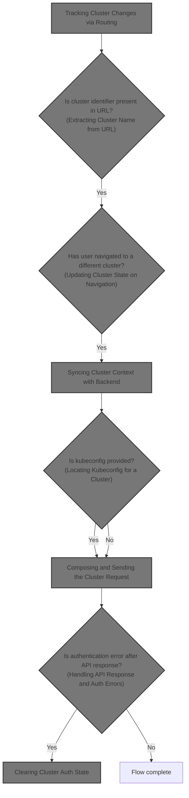

# Where is this flow used?

This flow is used multiple times in the codebase as represented in the following diagram:

(Note - these are only some of the entry points of this flow)

```mermaid
graph TD;
      3e0eb8139d9a01980d464d1f7b56282926e9707ec06f0c55bdacf68730d17bc6(frontend/…/resourceMap/GraphView.tsx::GraphViewContent) --> 1a700f8dedf0d69d3be141ca7ce44d688aad107a774deb8655e974d7d1d949af(frontend/…/k8s/KubeObject.ts::KubeObject.useList)

3e0eb8139d9a01980d464d1f7b56282926e9707ec06f0c55bdacf68730d17bc6(frontend/…/resourceMap/GraphView.tsx::GraphViewContent) --> 59c1f49aac3d793dbcab833698719c95b6a6e82d69ed2536bccf9dedb573a66b(frontend/…/definitions/sources.tsx::useGetAllSources)

1a700f8dedf0d69d3be141ca7ce44d688aad107a774deb8655e974d7d1d949af(frontend/…/k8s/KubeObject.ts::KubeObject.useList) --> 02125f4ea4c1604df8935a6f33fb8d1437d8ac1c8b12f53cc45252204ea9f8c4(frontend/…/k8s/index.ts::useSelectedClusters)

02125f4ea4c1604df8935a6f33fb8d1437d8ac1c8b12f53cc45252204ea9f8c4(frontend/…/k8s/index.ts::useSelectedClusters) --> 099e97ecf5195ff301208cb7fb48125e24eb119e352d652cfda5ebba4860b231(frontend/…/k8s/index.ts::useCluster):::mainFlowStyle

59c1f49aac3d793dbcab833698719c95b6a6e82d69ed2536bccf9dedb573a66b(frontend/…/definitions/sources.tsx::useGetAllSources) --> 1a700f8dedf0d69d3be141ca7ce44d688aad107a774deb8655e974d7d1d949af(frontend/…/k8s/KubeObject.ts::KubeObject.useList)

3877936ed66287b8b37cfbe1b3357abe8f8e727ae0d0e28b1a1f7f954954568d(frontend/…/project/ProjectList.tsx::ProjectList) --> 685cb6efe89cbdecb96f92f48aed7ecf570b0623d5f4bb907d740929129900d7(frontend/…/project/useProjectResources.ts::useProjectItems)

3877936ed66287b8b37cfbe1b3357abe8f8e727ae0d0e28b1a1f7f954954568d(frontend/…/project/ProjectList.tsx::ProjectList) --> b1988d135c4a044e9af319d1d21e8cf78bbbb4c3d2c126c5f6030cef04508c9c(frontend/…/project/ProjectList.tsx::useProjects)

685cb6efe89cbdecb96f92f48aed7ecf570b0623d5f4bb907d740929129900d7(frontend/…/project/useProjectResources.ts::useProjectItems) --> 1443d34739bdacddccf826688f3618fd80fc1246cf434f58911c38e875bb06fc(frontend/…/utils/useKubeLists.tsx::useKubeLists)

1443d34739bdacddccf826688f3618fd80fc1246cf434f58911c38e875bb06fc(frontend/…/utils/useKubeLists.tsx::useKubeLists) --> 1a700f8dedf0d69d3be141ca7ce44d688aad107a774deb8655e974d7d1d949af(frontend/…/k8s/KubeObject.ts::KubeObject.useList)

b1988d135c4a044e9af319d1d21e8cf78bbbb4c3d2c126c5f6030cef04508c9c(frontend/…/project/ProjectList.tsx::useProjects) --> 1a700f8dedf0d69d3be141ca7ce44d688aad107a774deb8655e974d7d1d949af(frontend/…/k8s/KubeObject.ts::KubeObject.useList)

e3565f27ed50d7a4ca09e8ff5e67d66312ab9df76d0d24c305edec09ea955389(frontend/…/resourceMap/GraphView.tsx::GraphView) --> eb0529837b1caee2ddb903a1495d1f3e276faa63d8e1fb2a10a0450d6f39aa83(frontend/…/definitions/relations.tsx::useGetAllRelations)

e3565f27ed50d7a4ca09e8ff5e67d66312ab9df76d0d24c305edec09ea955389(frontend/…/resourceMap/GraphView.tsx::GraphView) --> 59c1f49aac3d793dbcab833698719c95b6a6e82d69ed2536bccf9dedb573a66b(frontend/…/definitions/sources.tsx::useGetAllSources)

eb0529837b1caee2ddb903a1495d1f3e276faa63d8e1fb2a10a0450d6f39aa83(frontend/…/definitions/relations.tsx::useGetAllRelations) --> a0d2ded8f46a8c82100b965740528d259f7adbe5c514ef9ecc22d96b6c34255a(frontend/…/definitions/relations.tsx::useGetCRToOwnerRelations)

a0d2ded8f46a8c82100b965740528d259f7adbe5c514ef9ecc22d96b6c34255a(frontend/…/definitions/relations.tsx::useGetCRToOwnerRelations) --> 1a700f8dedf0d69d3be141ca7ce44d688aad107a774deb8655e974d7d1d949af(frontend/…/k8s/KubeObject.ts::KubeObject.useList)

e2c50bfb86c2151ea4882e17040349ffebb9340e732797959a79591c0320a428(frontend/…/configmap/Details.tsx::CronJobDetails) --> 1a700f8dedf0d69d3be141ca7ce44d688aad107a774deb8655e974d7d1d949af(frontend/…/k8s/KubeObject.ts::KubeObject.useList)

e724060e9a0f7dfc56d2b47f86d8f826f19aed6ef6fe36c6e22eecb687600118(frontend/…/globalSearch/GlobalSearchContent.tsx::GlobalSearchContent) --> 8a8436df8295316f4e8290e78dd219207a354087b39abc025f760097f68cb549(frontend/…/globalSearch/GlobalSearchContent.tsx::useSearchResources)

e724060e9a0f7dfc56d2b47f86d8f826f19aed6ef6fe36c6e22eecb687600118(frontend/…/globalSearch/GlobalSearchContent.tsx::GlobalSearchContent) --> 02125f4ea4c1604df8935a6f33fb8d1437d8ac1c8b12f53cc45252204ea9f8c4(frontend/…/k8s/index.ts::useSelectedClusters)

8a8436df8295316f4e8290e78dd219207a354087b39abc025f760097f68cb549(frontend/…/globalSearch/GlobalSearchContent.tsx::useSearchResources) --> 02125f4ea4c1604df8935a6f33fb8d1437d8ac1c8b12f53cc45252204ea9f8c4(frontend/…/k8s/index.ts::useSelectedClusters)

8a8436df8295316f4e8290e78dd219207a354087b39abc025f760097f68cb549(frontend/…/globalSearch/GlobalSearchContent.tsx::useSearchResources) --> 1a700f8dedf0d69d3be141ca7ce44d688aad107a774deb8655e974d7d1d949af(frontend/…/k8s/KubeObject.ts::KubeObject.useList)


classDef mainFlowStyle color:#000000,fill:#7CB9F4
classDef rootsStyle color:#000000,fill:#00FFF4
classDef Style1 color:#000000,fill:#00FFAA
classDef Style2 color:#000000,fill:#FFFF00
classDef Style3 color:#000000,fill:#AA7CB9

%% Swimm:
%% graph TD;
%%       3e0eb8139d9a01980d464d1f7b56282926e9707ec06f0c55bdacf68730d17bc6(<SwmPath>[frontend/…/resourceMap/GraphView.tsx](frontend/src/components/resourceMap/GraphView.tsx)</SwmPath>::GraphViewContent) --> 1a700f8dedf0d69d3be141ca7ce44d688aad107a774deb8655e974d7d1d949af(<SwmPath>[frontend/…/k8s/KubeObject.ts](frontend/src/lib/k8s/KubeObject.ts)</SwmPath>::KubeObject.useList)
%% 
%% 3e0eb8139d9a01980d464d1f7b56282926e9707ec06f0c55bdacf68730d17bc6(<SwmPath>[frontend/…/resourceMap/GraphView.tsx](frontend/src/components/resourceMap/GraphView.tsx)</SwmPath>::GraphViewContent) --> 59c1f49aac3d793dbcab833698719c95b6a6e82d69ed2536bccf9dedb573a66b(<SwmPath>[frontend/…/definitions/sources.tsx](frontend/src/components/resourceMap/sources/definitions/sources.tsx)</SwmPath>::useGetAllSources)
%% 
%% 1a700f8dedf0d69d3be141ca7ce44d688aad107a774deb8655e974d7d1d949af(<SwmPath>[frontend/…/k8s/KubeObject.ts](frontend/src/lib/k8s/KubeObject.ts)</SwmPath>::KubeObject.useList) --> 02125f4ea4c1604df8935a6f33fb8d1437d8ac1c8b12f53cc45252204ea9f8c4(<SwmPath>[frontend/…/k8s/index.ts](frontend/src/lib/k8s/index.ts)</SwmPath>::<SwmToken path="frontend/src/lib/k8s/index.ts" pos="138:23:23" line-data=" * To get all currently selected clusters please use {@link useSelectedClusters}">`useSelectedClusters`</SwmToken>)
%% 
%% 02125f4ea4c1604df8935a6f33fb8d1437d8ac1c8b12f53cc45252204ea9f8c4(<SwmPath>[frontend/…/k8s/index.ts](frontend/src/lib/k8s/index.ts)</SwmPath>::<SwmToken path="frontend/src/lib/k8s/index.ts" pos="138:23:23" line-data=" * To get all currently selected clusters please use {@link useSelectedClusters}">`useSelectedClusters`</SwmToken>) --> 099e97ecf5195ff301208cb7fb48125e24eb119e352d652cfda5ebba4860b231(<SwmPath>[frontend/…/k8s/index.ts](frontend/src/lib/k8s/index.ts)</SwmPath>::<SwmToken path="frontend/src/lib/k8s/index.ts" pos="142:4:4" line-data="export function useCluster() {">`useCluster`</SwmToken>):::mainFlowStyle
%% 
%% 59c1f49aac3d793dbcab833698719c95b6a6e82d69ed2536bccf9dedb573a66b(<SwmPath>[frontend/…/definitions/sources.tsx](frontend/src/components/resourceMap/sources/definitions/sources.tsx)</SwmPath>::useGetAllSources) --> 1a700f8dedf0d69d3be141ca7ce44d688aad107a774deb8655e974d7d1d949af(<SwmPath>[frontend/…/k8s/KubeObject.ts](frontend/src/lib/k8s/KubeObject.ts)</SwmPath>::KubeObject.useList)
%% 
%% 3877936ed66287b8b37cfbe1b3357abe8f8e727ae0d0e28b1a1f7f954954568d(<SwmPath>[frontend/…/project/ProjectList.tsx](frontend/src/components/project/ProjectList.tsx)</SwmPath>::ProjectList) --> 685cb6efe89cbdecb96f92f48aed7ecf570b0623d5f4bb907d740929129900d7(<SwmPath>[frontend/…/project/useProjectResources.ts](frontend/src/components/project/useProjectResources.ts)</SwmPath>::useProjectItems)
%% 
%% 3877936ed66287b8b37cfbe1b3357abe8f8e727ae0d0e28b1a1f7f954954568d(<SwmPath>[frontend/…/project/ProjectList.tsx](frontend/src/components/project/ProjectList.tsx)</SwmPath>::ProjectList) --> b1988d135c4a044e9af319d1d21e8cf78bbbb4c3d2c126c5f6030cef04508c9c(<SwmPath>[frontend/…/project/ProjectList.tsx](frontend/src/components/project/ProjectList.tsx)</SwmPath>::useProjects)
%% 
%% 685cb6efe89cbdecb96f92f48aed7ecf570b0623d5f4bb907d740929129900d7(<SwmPath>[frontend/…/project/useProjectResources.ts](frontend/src/components/project/useProjectResources.ts)</SwmPath>::useProjectItems) --> 1443d34739bdacddccf826688f3618fd80fc1246cf434f58911c38e875bb06fc(<SwmPath>[frontend/…/utils/useKubeLists.tsx](frontend/src/components/advancedSearch/utils/useKubeLists.tsx)</SwmPath>::useKubeLists)
%% 
%% 1443d34739bdacddccf826688f3618fd80fc1246cf434f58911c38e875bb06fc(<SwmPath>[frontend/…/utils/useKubeLists.tsx](frontend/src/components/advancedSearch/utils/useKubeLists.tsx)</SwmPath>::useKubeLists) --> 1a700f8dedf0d69d3be141ca7ce44d688aad107a774deb8655e974d7d1d949af(<SwmPath>[frontend/…/k8s/KubeObject.ts](frontend/src/lib/k8s/KubeObject.ts)</SwmPath>::KubeObject.useList)
%% 
%% b1988d135c4a044e9af319d1d21e8cf78bbbb4c3d2c126c5f6030cef04508c9c(<SwmPath>[frontend/…/project/ProjectList.tsx](frontend/src/components/project/ProjectList.tsx)</SwmPath>::useProjects) --> 1a700f8dedf0d69d3be141ca7ce44d688aad107a774deb8655e974d7d1d949af(<SwmPath>[frontend/…/k8s/KubeObject.ts](frontend/src/lib/k8s/KubeObject.ts)</SwmPath>::KubeObject.useList)
%% 
%% e3565f27ed50d7a4ca09e8ff5e67d66312ab9df76d0d24c305edec09ea955389(<SwmPath>[frontend/…/resourceMap/GraphView.tsx](frontend/src/components/resourceMap/GraphView.tsx)</SwmPath>::GraphView) --> eb0529837b1caee2ddb903a1495d1f3e276faa63d8e1fb2a10a0450d6f39aa83(<SwmPath>[frontend/…/definitions/relations.tsx](frontend/src/components/resourceMap/sources/definitions/relations.tsx)</SwmPath>::useGetAllRelations)
%% 
%% e3565f27ed50d7a4ca09e8ff5e67d66312ab9df76d0d24c305edec09ea955389(<SwmPath>[frontend/…/resourceMap/GraphView.tsx](frontend/src/components/resourceMap/GraphView.tsx)</SwmPath>::GraphView) --> 59c1f49aac3d793dbcab833698719c95b6a6e82d69ed2536bccf9dedb573a66b(<SwmPath>[frontend/…/definitions/sources.tsx](frontend/src/components/resourceMap/sources/definitions/sources.tsx)</SwmPath>::useGetAllSources)
%% 
%% eb0529837b1caee2ddb903a1495d1f3e276faa63d8e1fb2a10a0450d6f39aa83(<SwmPath>[frontend/…/definitions/relations.tsx](frontend/src/components/resourceMap/sources/definitions/relations.tsx)</SwmPath>::useGetAllRelations) --> a0d2ded8f46a8c82100b965740528d259f7adbe5c514ef9ecc22d96b6c34255a(<SwmPath>[frontend/…/definitions/relations.tsx](frontend/src/components/resourceMap/sources/definitions/relations.tsx)</SwmPath>::useGetCRToOwnerRelations)
%% 
%% a0d2ded8f46a8c82100b965740528d259f7adbe5c514ef9ecc22d96b6c34255a(<SwmPath>[frontend/…/definitions/relations.tsx](frontend/src/components/resourceMap/sources/definitions/relations.tsx)</SwmPath>::useGetCRToOwnerRelations) --> 1a700f8dedf0d69d3be141ca7ce44d688aad107a774deb8655e974d7d1d949af(<SwmPath>[frontend/…/k8s/KubeObject.ts](frontend/src/lib/k8s/KubeObject.ts)</SwmPath>::KubeObject.useList)
%% 
%% e2c50bfb86c2151ea4882e17040349ffebb9340e732797959a79591c0320a428(<SwmPath>[frontend/…/configmap/Details.tsx](frontend/src/components/configmap/Details.tsx)</SwmPath>::CronJobDetails) --> 1a700f8dedf0d69d3be141ca7ce44d688aad107a774deb8655e974d7d1d949af(<SwmPath>[frontend/…/k8s/KubeObject.ts](frontend/src/lib/k8s/KubeObject.ts)</SwmPath>::KubeObject.useList)
%% 
%% e724060e9a0f7dfc56d2b47f86d8f826f19aed6ef6fe36c6e22eecb687600118(<SwmPath>[frontend/…/globalSearch/GlobalSearchContent.tsx](frontend/src/components/globalSearch/GlobalSearchContent.tsx)</SwmPath>::GlobalSearchContent) --> 8a8436df8295316f4e8290e78dd219207a354087b39abc025f760097f68cb549(<SwmPath>[frontend/…/globalSearch/GlobalSearchContent.tsx](frontend/src/components/globalSearch/GlobalSearchContent.tsx)</SwmPath>::useSearchResources)
%% 
%% e724060e9a0f7dfc56d2b47f86d8f826f19aed6ef6fe36c6e22eecb687600118(<SwmPath>[frontend/…/globalSearch/GlobalSearchContent.tsx](frontend/src/components/globalSearch/GlobalSearchContent.tsx)</SwmPath>::GlobalSearchContent) --> 02125f4ea4c1604df8935a6f33fb8d1437d8ac1c8b12f53cc45252204ea9f8c4(<SwmPath>[frontend/…/k8s/index.ts](frontend/src/lib/k8s/index.ts)</SwmPath>::<SwmToken path="frontend/src/lib/k8s/index.ts" pos="138:23:23" line-data=" * To get all currently selected clusters please use {@link useSelectedClusters}">`useSelectedClusters`</SwmToken>)
%% 
%% 8a8436df8295316f4e8290e78dd219207a354087b39abc025f760097f68cb549(<SwmPath>[frontend/…/globalSearch/GlobalSearchContent.tsx](frontend/src/components/globalSearch/GlobalSearchContent.tsx)</SwmPath>::useSearchResources) --> 02125f4ea4c1604df8935a6f33fb8d1437d8ac1c8b12f53cc45252204ea9f8c4(<SwmPath>[frontend/…/k8s/index.ts](frontend/src/lib/k8s/index.ts)</SwmPath>::<SwmToken path="frontend/src/lib/k8s/index.ts" pos="138:23:23" line-data=" * To get all currently selected clusters please use {@link useSelectedClusters}">`useSelectedClusters`</SwmToken>)
%% 
%% 8a8436df8295316f4e8290e78dd219207a354087b39abc025f760097f68cb549(<SwmPath>[frontend/…/globalSearch/GlobalSearchContent.tsx](frontend/src/components/globalSearch/GlobalSearchContent.tsx)</SwmPath>::useSearchResources) --> 1a700f8dedf0d69d3be141ca7ce44d688aad107a774deb8655e974d7d1d949af(<SwmPath>[frontend/…/k8s/KubeObject.ts](frontend/src/lib/k8s/KubeObject.ts)</SwmPath>::KubeObject.useList)
%% 
%% 
%% classDef mainFlowStyle color:#000000,fill:#7CB9F4
%% classDef rootsStyle color:#000000,fill:#00FFF4
%% classDef Style1 color:#000000,fill:#00FFAA
%% classDef Style2 color:#000000,fill:#FFFF00
%% classDef Style3 color:#000000,fill:#AA7CB9
```

# Tracking Cluster Changes via Routing

<SwmSnippet path="/frontend/src/lib/k8s/index.ts" line="142">

---

In <SwmToken path="frontend/src/lib/k8s/index.ts" pos="142:4:4" line-data="export function useCluster() {">`useCluster`</SwmToken>, we start by setting up a state for the current cluster and attach a listener to the router. Every time the route changes, we call <SwmToken path="frontend/src/lib/k8s/index.ts" pos="145:16:16" line-data="  const [cluster, setCluster] = React.useState(getCluster());">`getCluster`</SwmToken> to extract the cluster from the new URL. This keeps the cluster state in sync with navigation, so the UI always reflects the cluster the user is actually viewing. We need to call <SwmPath>[frontend/…/lib/cluster.ts](frontend/src/lib/cluster.ts)</SwmPath> next to parse the cluster info from the URL.

```typescript
export function useCluster() {
  const history = useHistory();

  const [cluster, setCluster] = React.useState(getCluster());

  React.useEffect(() => {
    // Listen to route changes
    return history.listen(() => {
      const newCluster = getCluster(history.location.pathname);
```

---

</SwmSnippet>

## Extracting Cluster Name from URL

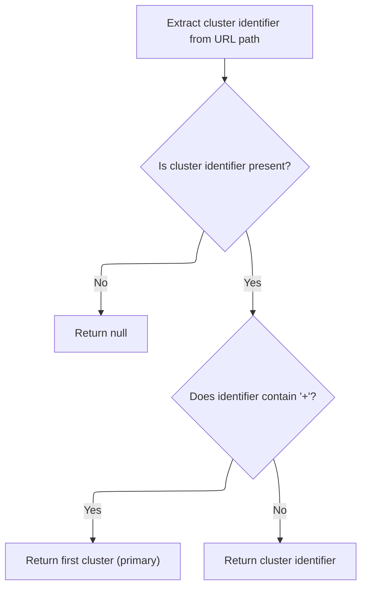

<SwmSnippet path="/frontend/src/lib/cluster.ts" line="46">

---

<SwmToken path="frontend/src/lib/cluster.ts" pos="46:4:4" line-data="export function getCluster(urlPath?: string): string | null {">`getCluster`</SwmToken> pulls the cluster identifier out of the URL, handling cases where extra info is appended with '+'. It calls <SwmToken path="frontend/src/lib/cluster.ts" pos="47:7:7" line-data="  const clusterString = getClusterPathParam(urlPath);">`getClusterPathParam`</SwmToken> to extract the raw cluster string, then normalizes it. We need to call <SwmToken path="frontend/src/lib/cluster.ts" pos="47:7:7" line-data="  const clusterString = getClusterPathParam(urlPath);">`getClusterPathParam`</SwmToken> next to actually parse the cluster segment from the URL.

```typescript
export function getCluster(urlPath?: string): string | null {
  const clusterString = getClusterPathParam(urlPath);
  if (!clusterString) return null;

  if (clusterString.includes('+')) {
    return clusterString.split('+')[0];
  }
  return clusterString;
}
```

---

</SwmSnippet>

## Parsing Cluster Segment from Path

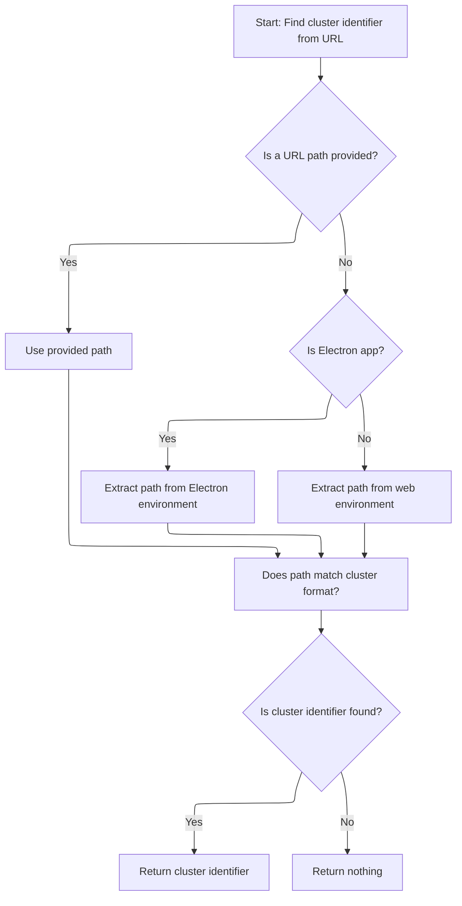

<SwmSnippet path="/frontend/src/lib/cluster.ts" line="57">

---

In <SwmToken path="frontend/src/lib/cluster.ts" pos="57:4:4" line-data="export function getClusterPathParam(maybeUrlPath?: string): string | undefined {">`getClusterPathParam`</SwmToken>, we figure out the base URL first so we can strip it from the path and isolate the cluster part. We call <SwmToken path="frontend/src/lib/cluster.ts" pos="58:7:7" line-data="  const prefix = getBaseUrl();">`getBaseUrl`</SwmToken> next to handle different deployment setups (like Electron, custom base URLs, etc.), so we always parse the cluster correctly.

```typescript
export function getClusterPathParam(maybeUrlPath?: string): string | undefined {
  const prefix = getBaseUrl();
```

---

</SwmSnippet>

<SwmSnippet path="/frontend/src/helpers/getBaseUrl.ts" line="38">

---

<SwmToken path="frontend/src/helpers/getBaseUrl.ts" pos="38:4:4" line-data="export function getBaseUrl(): string {">`getBaseUrl`</SwmToken> figures out the right base URL for the app, handling Electron (returns ''), browser overrides (<SwmToken path="frontend/src/helpers/getBaseUrl.ts" pos="44:5:7" line-data="    baseUrl = window.headlampBaseUrl;">`window.headlampBaseUrl`</SwmToken>), and build-time config (<SwmToken path="frontend/src/helpers/getBaseUrl.ts" pos="46:11:11" line-data="    baseUrl = import.meta.env.PUBLIC_URL ? import.meta.env.PUBLIC_URL : &#39;&#39;;">`PUBLIC_URL`</SwmToken>). It also normalizes values like './' to empty string so path handling is consistent.

```typescript
export function getBaseUrl(): string {
  let baseUrl = '';
  if (isElectron()) {
    return '';
  }
  if (window?.headlampBaseUrl !== undefined) {
    baseUrl = window.headlampBaseUrl;
  } else {
    baseUrl = import.meta.env.PUBLIC_URL ? import.meta.env.PUBLIC_URL : '';
  }

  if (baseUrl === './' || baseUrl === '.' || baseUrl === '/') {
    baseUrl = '';
  }
  return baseUrl;
}
```

---

</SwmSnippet>

<SwmSnippet path="/frontend/src/lib/cluster.ts" line="59">

---

Back in <SwmToken path="frontend/src/lib/cluster.ts" pos="47:7:7" line-data="  const clusterString = getClusterPathParam(urlPath);">`getClusterPathParam`</SwmToken>, after getting the base URL, we strip it from the path and use <SwmToken path="frontend/src/lib/cluster.ts" pos="65:7:7" line-data="  const clusterURLMatch = matchPath&lt;{ cluster?: string }&gt;(urlPath, {">`matchPath`</SwmToken> to extract the cluster segment. This makes sure we get the right cluster even if the app is hosted under a subpath or in Electron.

```typescript
  const urlPath =
    maybeUrlPath ??
    (isElectron()
      ? window.location.hash.substring(1)
      : window.location.pathname.slice(prefix.length));

  const clusterURLMatch = matchPath<{ cluster?: string }>(urlPath, {
    path: getClusterPrefixedPath(),
  });

  return clusterURLMatch?.params?.cluster;
}
```

---

</SwmSnippet>

## Updating Cluster State on Navigation

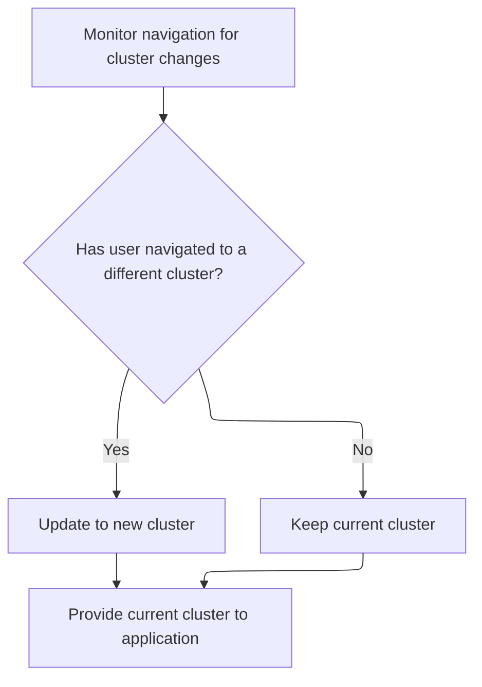

<SwmSnippet path="/frontend/src/lib/k8s/index.ts" line="151">

---

Back in <SwmToken path="frontend/src/lib/k8s/index.ts" pos="142:4:4" line-data="export function useCluster() {">`useCluster`</SwmToken>, after getting the cluster from the URL, we only update the state if the cluster actually changed. This prevents unnecessary updates. Next, we call <SwmToken path="frontend/src/lib/k8s/index.ts" pos="152:1:1" line-data="      setCluster(currentCluster =&gt; (newCluster !== currentCluster ? newCluster : currentCluster));">`setCluster`</SwmToken> to update the backend with the new cluster context.

```typescript
      // Update the state only when the cluster changes
      setCluster(currentCluster => (newCluster !== currentCluster ? newCluster : currentCluster));
    });
  }, [history]);

  return cluster;
}
```

---

</SwmSnippet>

# Syncing Cluster Context with Backend

```mermaid
%%{init: {"flowchart": {"defaultRenderer": "elk"}} }%%
flowchart TD
  node1["Receive cluster registration request"] --> node2{"Is kubeconfig provided?"}
  click node1 openCode "frontend/src/lib/k8s/api/v1/clusterApi.ts:60:64"
  node2 -->|"Yes"| node3["Store kubeconfig"]
  click node2 openCode "frontend/src/lib/k8s/api/v1/clusterApi.ts:64:79"
  node3 --> node4["Send kubeconfig to /parseKubeConfig endpoint"]
  click node3 openCode "frontend/src/lib/k8s/api/v1/clusterApi.ts:65:65"
  click node4 openCode "frontend/src/lib/k8s/api/v1/clusterApi.ts:67:78"
  node2 -->|"No"| node5["Send cluster data to frontend/…/components/cluster endpoint"]
  click node5 openCode "frontend/src/lib/k8s/api/v1/clusterApi.ts:81:93"

classDef HeadingStyle fill:#777777,stroke:#333,stroke-width:2px;

%% Swimm:
%% %%{init: {"flowchart": {"defaultRenderer": "elk"}} }%%
%% flowchart TD
%%   node1["Receive cluster registration request"] --> node2{"Is kubeconfig provided?"}
%%   click node1 openCode "<SwmPath>[frontend/…/v1/clusterApi.ts](frontend/src/lib/k8s/api/v1/clusterApi.ts)</SwmPath>:60:64"
%%   node2 -->|"Yes"| node3["Store kubeconfig"]
%%   click node2 openCode "<SwmPath>[frontend/…/v1/clusterApi.ts](frontend/src/lib/k8s/api/v1/clusterApi.ts)</SwmPath>:64:79"
%%   node3 --> node4["Send kubeconfig to <SwmToken path="frontend/src/lib/k8s/api/v1/clusterApi.ts" pos="68:2:3" line-data="      &#39;/parseKubeConfig&#39;,">`/parseKubeConfig`</SwmToken> endpoint"]
%%   click node3 openCode "<SwmPath>[frontend/…/v1/clusterApi.ts](frontend/src/lib/k8s/api/v1/clusterApi.ts)</SwmPath>:65:65"
%%   click node4 openCode "<SwmPath>[frontend/…/v1/clusterApi.ts](frontend/src/lib/k8s/api/v1/clusterApi.ts)</SwmPath>:67:78"
%%   node2 -->|"No"| node5["Send cluster data to <SwmPath>[frontend/…/components/cluster/](frontend/src/components/cluster/)</SwmPath> endpoint"]
%%   click node5 openCode "<SwmPath>[frontend/…/v1/clusterApi.ts](frontend/src/lib/k8s/api/v1/clusterApi.ts)</SwmPath>:81:93"
%% 
%% classDef HeadingStyle fill:#777777,stroke:#333,stroke-width:2px;
```

<SwmSnippet path="/frontend/src/lib/k8s/api/v1/clusterApi.ts" line="60">

---

<SwmToken path="frontend/src/lib/k8s/api/v1/clusterApi.ts" pos="60:6:6" line-data="export async function setCluster(clusterReq: ClusterRequest) {">`setCluster`</SwmToken> checks if kubeconfig is present in the request. If so, it stores it and sends it to <SwmToken path="frontend/src/lib/k8s/api/v1/clusterApi.ts" pos="68:2:3" line-data="      &#39;/parseKubeConfig&#39;,">`/parseKubeConfig`</SwmToken>; otherwise, it sends the request to <SwmPath>[frontend/…/components/cluster/](frontend/src/components/cluster/)</SwmPath> with extra headers. Next, we call the request function to actually make the API call.

```typescript
export async function setCluster(clusterReq: ClusterRequest) {
  const kubeconfig = clusterReq.kubeconfig;
  const headers = addBackstageAuthHeaders(JSON_HEADERS);

  if (kubeconfig) {
    await storeStatelessClusterKubeconfig(kubeconfig);
    // We just send parsed kubeconfig from the backend to the frontend.
    return request(
      '/parseKubeConfig',
      {
        method: 'POST',
        body: JSON.stringify(clusterReq),
        headers: {
          ...headers,
        },
      },
      false,
      false
    );
  }

  return request(
    '/cluster',
    {
      method: 'POST',
      body: JSON.stringify(clusterReq),
      headers: {
        ...headers,
        ...getHeadlampAPIHeaders(),
      },
    },
    false,
    false
  );
}
```

---

</SwmSnippet>

# Preparing and Logging Cluster API Requests

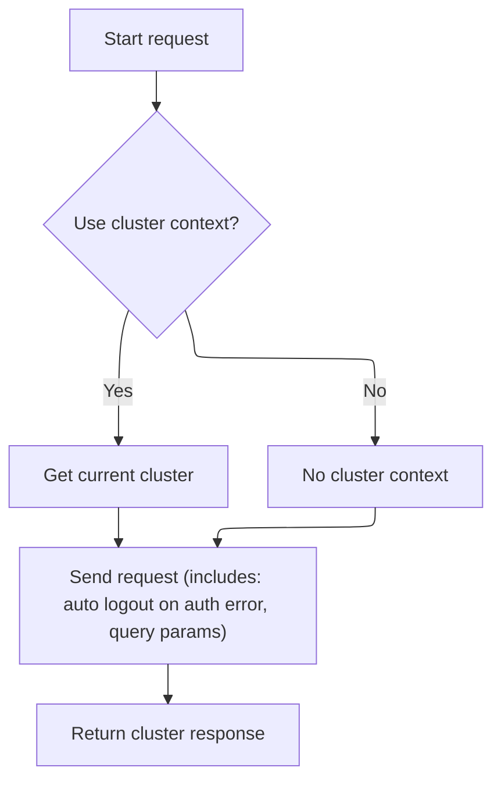

<SwmSnippet path="/frontend/src/lib/k8s/api/v1/clusterRequests.ts" line="94">

---

In <SwmToken path="frontend/src/lib/k8s/api/v1/clusterRequests.ts" pos="94:6:6" line-data="export async function request(">`request`</SwmToken>, we grab the current cluster (if <SwmToken path="frontend/src/lib/k8s/api/v1/clusterRequests.ts" pos="98:1:1" line-data="  useCluster: boolean = true,">`useCluster`</SwmToken> is true) to include it in the API request. We call <SwmToken path="frontend/src/lib/k8s/api/v1/clusterRequests.ts" pos="102:12:12" line-data="  const cluster = (useCluster &amp;&amp; getCluster()) || &#39;&#39;;">`getCluster`</SwmToken> again to make sure we're using the latest cluster context.

```typescript
export async function request(
  path: string,
  params: RequestParams = {},
  autoLogoutOnAuthError: boolean = true,
  useCluster: boolean = true,
  queryParams?: QueryParameters
): Promise<any> {
  // @todo: This is a temporary way of getting the current cluster. We should improve it later.
  const cluster = (useCluster && getCluster()) || '';

```

---

</SwmSnippet>

<SwmSnippet path="/frontend/src/lib/k8s/api/v1/clusterRequests.ts" line="104">

---

Back in <SwmToken path="frontend/src/lib/k8s/api/v1/clusterRequests.ts" pos="104:11:11" line-data="  if (isDebugVerbose(&#39;k8s/apiProxy@request&#39;)) {">`request`</SwmToken>, after getting the cluster, we check if debug logging is enabled for this module. If so, we log the request details for easier debugging. We call <SwmToken path="frontend/src/lib/k8s/api/v1/clusterRequests.ts" pos="104:4:4" line-data="  if (isDebugVerbose(&#39;k8s/apiProxy@request&#39;)) {">`isDebugVerbose`</SwmToken> to decide whether to log.

```typescript
  if (isDebugVerbose('k8s/apiProxy@request')) {
    console.debug('k8s/apiProxy@request', { path, params, useCluster, queryParams });
  }

```

---

</SwmSnippet>

<SwmSnippet path="/frontend/src/helpers/debugVerbose.ts" line="76">

---

<SwmToken path="frontend/src/helpers/debugVerbose.ts" pos="76:4:4" line-data="export function isDebugVerbose(modName: string): boolean {">`isDebugVerbose`</SwmToken> checks if verbose logging is enabled for a module, either via a substring match in an array (excluding index 0) or via an environment variable. This lets us control debug output per module or globally.

```typescript
export function isDebugVerbose(modName: string): boolean {
  if (verboseModDebug.filter(mod => modName.indexOf(mod) > 0).length > 0) {
    return true;
  }

  return (
    import.meta.env.REACT_APP_DEBUG_VERBOSE === 'all' ||
    !!(
      import.meta.env.REACT_APP_DEBUG_VERBOSE &&
      import.meta.env.REACT_APP_DEBUG_VERBOSE?.indexOf(modName) !== -1
    )
  );
}
```

---

</SwmSnippet>

<SwmSnippet path="/frontend/src/lib/k8s/api/v1/clusterRequests.ts" line="108">

---

Back in <SwmToken path="frontend/src/lib/k8s/api/v1/clusterApi.ts" pos="67:3:3" line-data="    return request(">`request`</SwmToken>, after logging, we delegate to <SwmToken path="frontend/src/lib/k8s/api/v1/clusterRequests.ts" pos="108:3:3" line-data="  return clusterRequest(path, { cluster, autoLogoutOnAuthError, ...params }, queryParams);">`clusterRequest`</SwmToken> to handle the actual API call. This function adds cluster-specific headers and path logic.

```typescript
  return clusterRequest(path, { cluster, autoLogoutOnAuthError, ...params }, queryParams);
}
```

---

</SwmSnippet>

# Building Cluster-Aware API Requests

```mermaid
%%{init: {"flowchart": {"defaultRenderer": "elk"}} }%%
flowchart TD
  node1["Start cluster request"] --> node2{"Is cluster specified?"}
  click node1 openCode "frontend/src/lib/k8s/api/v1/clusterRequests.ts:122:146"
  node2 -->|"Yes"| node3["Locating Kubeconfig for a Cluster"]
  click node2 openCode "frontend/src/lib/k8s/api/v1/clusterRequests.ts:147:155"
  node2 -->|"No"| node4["Proceed without cluster context"]
  
  node3 --> node5{"Is kubeconfig found?"}
  node5 -->|"Yes"| node6["Add authentication headers"]
  click node5 openCode "frontend/src/lib/k8s/api/v1/clusterRequests.ts:149:152"
  node5 -->|"No"| node4
  node6 --> node7["Make request to cluster"]
  click node6 openCode "frontend/src/lib/k8s/api/v1/clusterRequests.ts:157:173"
  node4 --> node7
  node7 --> node8{"Did backend signal reload?"}
  click node7 openCode "frontend/src/lib/k8s/api/v1/clusterRequests.ts:185:188"
  node8 -->|"Yes"| node9["Reload application"]
  click node8 openCode "frontend/src/lib/k8s/api/v1/clusterRequests.ts:187:188"
  node8 -->|"No"| node10{"Was request successful?"}
  node9 --> node10
  node10 -->|"Yes"| node11{"Should response be JSON?"}
  click node10 openCode "frontend/src/lib/k8s/api/v1/clusterRequests.ts:190:222"
  node10 -->|"No, 401 Unauthorized"| node12["Clearing Cluster Auth State"]
  
  node11 -->|"Yes"| node13["Return parsed JSON"]
  click node13 openCode "frontend/src/lib/k8s/api/v1/clusterRequests.ts:222:223"
  node11 -->|"No"| node14["Return raw response"]
  click node14 openCode "frontend/src/lib/k8s/api/v1/clusterRequests.ts:219:220"

classDef HeadingStyle fill:#777777,stroke:#333,stroke-width:2px;
click node3 goToHeading "Locating Kubeconfig for a Cluster"
node3:::HeadingStyle
click node12 goToHeading "Clearing Cluster Auth State"
node12:::HeadingStyle

%% Swimm:
%% %%{init: {"flowchart": {"defaultRenderer": "elk"}} }%%
%% flowchart TD
%%   node1["Start cluster request"] --> node2{"Is cluster specified?"}
%%   click node1 openCode "<SwmPath>[frontend/…/v1/clusterRequests.ts](frontend/src/lib/k8s/api/v1/clusterRequests.ts)</SwmPath>:122:146"
%%   node2 -->|"Yes"| node3["Locating Kubeconfig for a Cluster"]
%%   click node2 openCode "<SwmPath>[frontend/…/v1/clusterRequests.ts](frontend/src/lib/k8s/api/v1/clusterRequests.ts)</SwmPath>:147:155"
%%   node2 -->|"No"| node4["Proceed without cluster context"]
%%   
%%   node3 --> node5{"Is kubeconfig found?"}
%%   node5 -->|"Yes"| node6["Add authentication headers"]
%%   click node5 openCode "<SwmPath>[frontend/…/v1/clusterRequests.ts](frontend/src/lib/k8s/api/v1/clusterRequests.ts)</SwmPath>:149:152"
%%   node5 -->|"No"| node4
%%   node6 --> node7["Make request to cluster"]
%%   click node6 openCode "<SwmPath>[frontend/…/v1/clusterRequests.ts](frontend/src/lib/k8s/api/v1/clusterRequests.ts)</SwmPath>:157:173"
%%   node4 --> node7
%%   node7 --> node8{"Did backend signal reload?"}
%%   click node7 openCode "<SwmPath>[frontend/…/v1/clusterRequests.ts](frontend/src/lib/k8s/api/v1/clusterRequests.ts)</SwmPath>:185:188"
%%   node8 -->|"Yes"| node9["Reload application"]
%%   click node8 openCode "<SwmPath>[frontend/…/v1/clusterRequests.ts](frontend/src/lib/k8s/api/v1/clusterRequests.ts)</SwmPath>:187:188"
%%   node8 -->|"No"| node10{"Was request successful?"}
%%   node9 --> node10
%%   node10 -->|"Yes"| node11{"Should response be JSON?"}
%%   click node10 openCode "<SwmPath>[frontend/…/v1/clusterRequests.ts](frontend/src/lib/k8s/api/v1/clusterRequests.ts)</SwmPath>:190:222"
%%   node10 -->|"No, 401 Unauthorized"| node12["Clearing Cluster Auth State"]
%%   
%%   node11 -->|"Yes"| node13["Return parsed JSON"]
%%   click node13 openCode "<SwmPath>[frontend/…/v1/clusterRequests.ts](frontend/src/lib/k8s/api/v1/clusterRequests.ts)</SwmPath>:222:223"
%%   node11 -->|"No"| node14["Return raw response"]
%%   click node14 openCode "<SwmPath>[frontend/…/v1/clusterRequests.ts](frontend/src/lib/k8s/api/v1/clusterRequests.ts)</SwmPath>:219:220"
%% 
%% classDef HeadingStyle fill:#777777,stroke:#333,stroke-width:2px;
%% click node3 goToHeading "Locating Kubeconfig for a Cluster"
%% node3:::HeadingStyle
%% click node12 goToHeading "Clearing Cluster Auth State"
%% node12:::HeadingStyle
```

<SwmSnippet path="/frontend/src/lib/k8s/api/v1/clusterRequests.ts" line="122">

---

In <SwmToken path="frontend/src/lib/k8s/api/v1/clusterRequests.ts" pos="122:6:6" line-data="export async function clusterRequest(">`clusterRequest`</SwmToken>, if a cluster is specified, we fetch its kubeconfig from <SwmToken path="frontend/src/stateless/findKubeconfigByClusterName.ts" pos="32:10:10" line-data=" * @throws Error if IndexedDB is not supported.">`IndexedDB`</SwmToken> and add it (and the user ID) to the request headers. We also prefix the path with the cluster name. We call <SwmToken path="frontend/src/lib/k8s/api/v1/clusterRequests.ts" pos="148:9:9" line-data="    const kubeconfig = await findKubeconfigByClusterName(cluster);">`findKubeconfigByClusterName`</SwmToken> next to get the kubeconfig.

```typescript
export async function clusterRequest(
  path: string,
  params: ClusterRequestParams = {},
  queryParams?: QueryParameters
): Promise<any> {
  interface RequestHeaders {
    Authorization?: string;
    cluster?: string;
    autoLogoutOnAuthError?: boolean;
    [otherHeader: string]: any;
  }

  const {
    timeout = DEFAULT_TIMEOUT,
    cluster: paramsCluster,
    autoLogoutOnAuthError = true,
    isJSON = true,
    ...otherParams
  } = params;

  const userID = getUserIdFromLocalStorage();
  const opts: { headers: RequestHeaders } = Object.assign({ headers: {} }, otherParams);
  const cluster = paramsCluster || '';

  let fullPath = path;
  if (cluster) {
    const kubeconfig = await findKubeconfigByClusterName(cluster);
    if (kubeconfig !== null) {
      opts.headers['KUBECONFIG'] = kubeconfig;
      opts.headers['X-HEADLAMP-USER-ID'] = userID;
    }

    fullPath = combinePath(`/${CLUSTERS_PREFIX}/${cluster}`, path);
  }

```

---

</SwmSnippet>

## Locating Kubeconfig for a Cluster

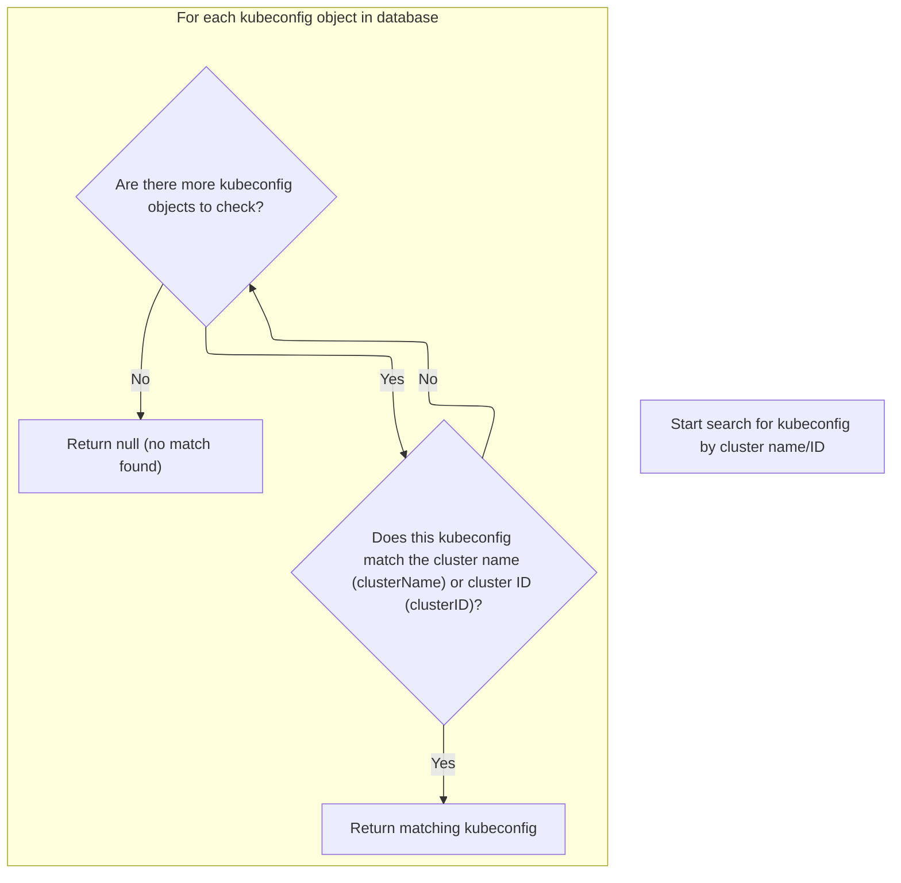

<SwmSnippet path="/frontend/src/stateless/findKubeconfigByClusterName.ts" line="36">

---

In <SwmToken path="frontend/src/stateless/findKubeconfigByClusterName.ts" pos="36:4:4" line-data="export function findKubeconfigByClusterName(">`findKubeconfigByClusterName`</SwmToken>, we open <SwmToken path="frontend/src/stateless/findKubeconfigByClusterName.ts" pos="32:10:10" line-data=" * @throws Error if IndexedDB is not supported.">`IndexedDB`</SwmToken>, iterate over stored kubeconfigs, decode and parse them, and use <SwmToken path="frontend/src/stateless/findKubeconfigByClusterName.ts" pos="70:14:14" line-data="            const { matchingKubeconfig, matchingContext } = findMatchingContexts(">`findMatchingContexts`</SwmToken> to see if any match the requested cluster. If found, we return the kubeconfig; otherwise, we keep looking. We call <SwmToken path="frontend/src/stateless/findKubeconfigByClusterName.ts" pos="70:14:14" line-data="            const { matchingKubeconfig, matchingContext } = findMatchingContexts(">`findMatchingContexts`</SwmToken> next to do the actual matching logic.

```typescript
export function findKubeconfigByClusterName(
  /** The name of the cluster to find */
  clusterName: string,
  /** The ID for a cluster, composed of the kubeconfig path and cluster name */
  clusterID?: string
): Promise<string | null> {
  return new Promise<string | null>(async (resolve, reject) => {
    try {
      const request = indexedDB.open('kubeconfigs', 1) as any;

      // The onupgradeneeded event is fired when the database is created for the first time.
      request.onupgradeneeded = handleDatabaseUpgrade;

      // The onsuccess event is fired when the database is opened.
      // This event is where you specify the actions to take when the database is opened.
      request.onsuccess = function handleDatabaseSuccess(event: DatabaseEvent) {
        const db = event.target.result;
        const transaction = db.transaction(['kubeconfigStore'], 'readonly');
        const store = transaction.objectStore('kubeconfigStore');

        // The onsuccess event is fired when the request has succeeded.
        // This is where you handle the results of the request.
        // The result is the cursor. It is used to iterate through the object store.
        // The cursor is null when there are no more objects to iterate through.
        // The cursor is used to find the kubeconfig by cluster name.
        store.openCursor().onsuccess = function storeSuccess(event: Event) {
          const successEvent = event as CursorSuccessEvent;
          const cursor = successEvent.target.result;
          if (cursor) {
            const kubeconfigObject = cursor.value;
            const kubeconfig = kubeconfigObject.kubeconfig;

            const parsedKubeconfig = jsyaml.load(atob(kubeconfig)) as KubeconfigObject;
            // Check for "headlamp_info" in extensions
            const { matchingKubeconfig, matchingContext } = findMatchingContexts(
              clusterName,
              parsedKubeconfig,
              clusterID
            );

```

---

</SwmSnippet>

<SwmSnippet path="/frontend/src/stateless/index.ts" line="236">

---

<SwmToken path="frontend/src/stateless/index.ts" pos="236:4:4" line-data="export function findMatchingContexts(">`findMatchingContexts`</SwmToken> looks for a context in the kubeconfig that matches either the <SwmToken path="frontend/src/stateless/index.ts" pos="239:1:1" line-data="  clusterID?: string">`clusterID`</SwmToken> (for <SwmToken path="frontend/src/lib/k8s/api/v1/clusterApi.ts" pos="99:33:35" line-data=" * Note: Currently, the use for the optional clusterID is only for the clusterID for non-dynamic clusters.">`non-dynamic`</SwmToken> clusters) or the <SwmToken path="frontend/src/stateless/index.ts" pos="237:1:1" line-data="  clusterName: string,">`clusterName`</SwmToken> (including custom names in <SwmToken path="frontend/src/stateless/index.ts" pos="258:27:27" line-data="    // Find the context with the matching cluster name or custom name in headlamp_info">`headlamp_info`</SwmToken>). This lets us support both standard and custom cluster setups.

```typescript
export function findMatchingContexts(
  clusterName: string,
  parsedKubeconfig: KubeconfigObject,
  clusterID?: string
) {
  let matchingContext;
  let matchingKubeconfig;

  // Note: currently clusterID is being used for non dynamic clusters only
  if (clusterID) {
    // Find source for the kubeconfig
    const source = parsedKubeconfig.contexts.find(
      context => context.context.clusterID === clusterID
    )?.context.source;

    // Find the context with the matching clusterID
    if (source === 'kubeconfig') {
      matchingKubeconfig = parsedKubeconfig.contexts.find(
        context => context.context.clusterID === clusterID
      );
    }
  } else {
    // Find the context with the matching cluster name or custom name in headlamp_info
    matchingContext = parsedKubeconfig.contexts.find(
      context =>
        context.name === clusterName ||
        context.context.extensions?.find(extension => extension.name === 'headlamp_info')?.extension
          .customName === clusterName
    );

    matchingKubeconfig = parsedKubeconfig.contexts.find(context => context.name === clusterName);
  }

  return { matchingKubeconfig, matchingContext };
}
```

---

</SwmSnippet>

<SwmSnippet path="/frontend/src/stateless/findKubeconfigByClusterName.ts" line="76">

---

Back in <SwmToken path="frontend/src/lib/k8s/api/v1/clusterRequests.ts" pos="148:9:9" line-data="    const kubeconfig = await findKubeconfigByClusterName(cluster);">`findKubeconfigByClusterName`</SwmToken>, after checking each kubeconfig with <SwmToken path="frontend/src/stateless/findKubeconfigByClusterName.ts" pos="70:14:14" line-data="            const { matchingKubeconfig, matchingContext } = findMatchingContexts(">`findMatchingContexts`</SwmToken>, we resolve with the kubeconfig if a match is found, or continue scanning. If nothing matches, we resolve with null at the end.

```typescript
            if (matchingKubeconfig || matchingContext) {
              resolve(kubeconfig);
            } else {
              cursor.continue();
            }
          } else {
            resolve(null); // No matching kubeconfig found
          }
        };
      };

      // The onerror event is fired when the database is opened.
      // This is where you handle errors.
      request.onerror = handleDataBaseError;
    } catch (error) {
      reject(error);
    }
  });
}
```

---

</SwmSnippet>

## Composing and Sending the Cluster Request

<SwmSnippet path="/frontend/src/lib/k8s/api/v1/clusterRequests.ts" line="157">

---

Back in <SwmToken path="frontend/src/lib/k8s/api/v1/clusterRequests.ts" pos="108:3:3" line-data="  return clusterRequest(path, { cluster, autoLogoutOnAuthError, ...params }, queryParams);">`clusterRequest`</SwmToken>, we set up request timeout handling and build the full URL with <SwmToken path="frontend/src/lib/k8s/api/v1/clusterRequests.ts" pos="160:9:9" line-data="  let url = combinePath(getAppUrl(), fullPath);">`getAppUrl`</SwmToken>.

```typescript
  const controller = new AbortController();
  const id = setTimeout(() => controller.abort(), timeout);

  let url = combinePath(getAppUrl(), fullPath);
```

---

</SwmSnippet>

## Constructing the Backend API URL

```mermaid
%%{init: {"flowchart": {"defaultRenderer": "elk"}} }%%
flowchart TD
  node1["Start: Check environment"]
  click node1 openCode "frontend/src/helpers/getAppUrl.ts:43:44"
  node1 --> node2["Set default backend port (4466) and useLocalhost (false)"]
  click node2 openCode "frontend/src/helpers/getAppUrl.ts:44:47"
  node2 --> node3{"Is Electron?"}
  click node3 openCode "frontend/src/helpers/getAppUrl.ts:48:53"
  node3 -->|"Yes"| node4["Override backend port if provided, set useLocalhost true"]
  click node4 openCode "frontend/src/helpers/getAppUrl.ts:49:53"
  node3 -->|"No"| node5{"Is Dev Mode?"}
  click node5 openCode "frontend/src/helpers/getAppUrl.ts:55:57"
  node4 --> node5
  node5 -->|"Yes"| node6["Set useLocalhost true"]
  click node6 openCode "frontend/src/helpers/getAppUrl.ts:56:57"
  node5 -->|"No"| node7{"Is Docker Desktop?"}
  click node7 openCode "frontend/src/helpers/getAppUrl.ts:59:62"
  node6 --> node7
  node7 -->|"Yes"| node8["Set backend port to 64446, set useLocalhost true"]
  click node8 openCode "frontend/src/helpers/getAppUrl.ts:60:62"
  node7 -->|"No"| node9["No changes"]
  click node9 openCode "frontend/src/helpers/getAppUrl.ts:63:63"
  node8 --> node10{"Should use localhost?"}
  click node10 openCode "frontend/src/helpers/getAppUrl.ts:64:68"
  node9 --> node10
  node10 -->|"Yes"| node11["Build URL with localhost and backend port"]
  click node11 openCode "frontend/src/helpers/getAppUrl.ts:65:66"
  node10 -->|"No"| node12["Build URL with window origin"]
  click node12 openCode "frontend/src/helpers/getAppUrl.ts:67:68"
  node11 --> node13["Append baseUrl"]
  click node13 openCode "frontend/src/helpers/getAppUrl.ts:70:71"
  node12 --> node13
  node13 --> node14["Return final URL"]
  click node14 openCode "frontend/src/helpers/getAppUrl.ts:73:74"

classDef HeadingStyle fill:#777777,stroke:#333,stroke-width:2px;

%% Swimm:
%% %%{init: {"flowchart": {"defaultRenderer": "elk"}} }%%
%% flowchart TD
%%   node1["Start: Check environment"]
%%   click node1 openCode "<SwmPath>[frontend/…/helpers/getAppUrl.ts](frontend/src/helpers/getAppUrl.ts)</SwmPath>:43:44"
%%   node1 --> node2["Set default backend port (4466) and <SwmToken path="frontend/src/helpers/getAppUrl.ts" pos="46:3:3" line-data="  let useLocalhost = false;">`useLocalhost`</SwmToken> (false)"]
%%   click node2 openCode "<SwmPath>[frontend/…/helpers/getAppUrl.ts](frontend/src/helpers/getAppUrl.ts)</SwmPath>:44:47"
%%   node2 --> node3{"Is Electron?"}
%%   click node3 openCode "<SwmPath>[frontend/…/helpers/getAppUrl.ts](frontend/src/helpers/getAppUrl.ts)</SwmPath>:48:53"
%%   node3 -->|"Yes"| node4["Override backend port if provided, set <SwmToken path="frontend/src/helpers/getAppUrl.ts" pos="46:3:3" line-data="  let useLocalhost = false;">`useLocalhost`</SwmToken> true"]
%%   click node4 openCode "<SwmPath>[frontend/…/helpers/getAppUrl.ts](frontend/src/helpers/getAppUrl.ts)</SwmPath>:49:53"
%%   node3 -->|"No"| node5{"Is Dev Mode?"}
%%   click node5 openCode "<SwmPath>[frontend/…/helpers/getAppUrl.ts](frontend/src/helpers/getAppUrl.ts)</SwmPath>:55:57"
%%   node4 --> node5
%%   node5 -->|"Yes"| node6["Set <SwmToken path="frontend/src/helpers/getAppUrl.ts" pos="46:3:3" line-data="  let useLocalhost = false;">`useLocalhost`</SwmToken> true"]
%%   click node6 openCode "<SwmPath>[frontend/…/helpers/getAppUrl.ts](frontend/src/helpers/getAppUrl.ts)</SwmPath>:56:57"
%%   node5 -->|"No"| node7{"Is Docker Desktop?"}
%%   click node7 openCode "<SwmPath>[frontend/…/helpers/getAppUrl.ts](frontend/src/helpers/getAppUrl.ts)</SwmPath>:59:62"
%%   node6 --> node7
%%   node7 -->|"Yes"| node8["Set backend port to 64446, set <SwmToken path="frontend/src/helpers/getAppUrl.ts" pos="46:3:3" line-data="  let useLocalhost = false;">`useLocalhost`</SwmToken> true"]
%%   click node8 openCode "<SwmPath>[frontend/…/helpers/getAppUrl.ts](frontend/src/helpers/getAppUrl.ts)</SwmPath>:60:62"
%%   node7 -->|"No"| node9["No changes"]
%%   click node9 openCode "<SwmPath>[frontend/…/helpers/getAppUrl.ts](frontend/src/helpers/getAppUrl.ts)</SwmPath>:63:63"
%%   node8 --> node10{"Should use localhost?"}
%%   click node10 openCode "<SwmPath>[frontend/…/helpers/getAppUrl.ts](frontend/src/helpers/getAppUrl.ts)</SwmPath>:64:68"
%%   node9 --> node10
%%   node10 -->|"Yes"| node11["Build URL with localhost and backend port"]
%%   click node11 openCode "<SwmPath>[frontend/…/helpers/getAppUrl.ts](frontend/src/helpers/getAppUrl.ts)</SwmPath>:65:66"
%%   node10 -->|"No"| node12["Build URL with window origin"]
%%   click node12 openCode "<SwmPath>[frontend/…/helpers/getAppUrl.ts](frontend/src/helpers/getAppUrl.ts)</SwmPath>:67:68"
%%   node11 --> node13["Append <SwmToken path="frontend/src/helpers/getBaseUrl.ts" pos="39:3:3" line-data="  let baseUrl = &#39;&#39;;">`baseUrl`</SwmToken>"]
%%   click node13 openCode "<SwmPath>[frontend/…/helpers/getAppUrl.ts](frontend/src/helpers/getAppUrl.ts)</SwmPath>:70:71"
%%   node12 --> node13
%%   node13 --> node14["Return final URL"]
%%   click node14 openCode "<SwmPath>[frontend/…/helpers/getAppUrl.ts](frontend/src/helpers/getAppUrl.ts)</SwmPath>:73:74"
%% 
%% classDef HeadingStyle fill:#777777,stroke:#333,stroke-width:2px;
```

<SwmSnippet path="/frontend/src/helpers/getAppUrl.ts" line="43">

---

In <SwmToken path="frontend/src/helpers/getAppUrl.ts" pos="43:4:4" line-data="export function getAppUrl(): string {">`getAppUrl`</SwmToken>, we figure out the right backend URL based on the environment (Electron, dev, Docker Desktop), picking the right port and localhost/origin. We call <SwmToken path="frontend/src/helpers/getAppUrl.ts" pos="70:7:7" line-data="  const baseUrl = getBaseUrl();">`getBaseUrl`</SwmToken> next to append any app-specific base path to the URL.

```typescript
export function getAppUrl(): string {
  let url = '';
  let backendPort = 4466;
  let useLocalhost = false;

  if (isElectron()) {
    if (window?.headlampBackendPort) {
      backendPort = window.headlampBackendPort;
    }
    useLocalhost = true;
  }

  if (isDevMode()) {
    useLocalhost = true;
  }

  if (isDockerDesktop()) {
    backendPort = 64446;
    useLocalhost = true;
  }

  if (useLocalhost) {
    url = `http://localhost:${backendPort}`;
  } else {
    url = window.location.origin;
  }

  const baseUrl = getBaseUrl();
```

---

</SwmSnippet>

<SwmSnippet path="/frontend/src/helpers/getAppUrl.ts" line="71">

---

Back in <SwmToken path="frontend/src/lib/k8s/api/v1/clusterRequests.ts" pos="160:9:9" line-data="  let url = combinePath(getAppUrl(), fullPath);">`getAppUrl`</SwmToken>, we append the base URL (with slash) to the backend URL, so requests always hit the right endpoint.

```typescript
  url += baseUrl ? baseUrl + '/' : '/';

  return url;
}
```

---

</SwmSnippet>

## Handling API Response and Auth Errors

```mermaid
%%{init: {"flowchart": {"defaultRenderer": "elk"}} }%%
flowchart TD
  node1["Prepare request and options"] --> node2{"Is Backstage integration active?"}
  click node1 openCode "frontend/src/lib/k8s/api/v1/clusterRequests.ts:161:166"
  node2 -->|"Yes"| node3["Add Backstage authentication headers"]
  click node2 openCode "frontend/src/lib/k8s/api/v1/clusterRequests.ts:167:169"
  node2 -->|"No"| node4["Send request to cluster"]
  click node3 openCode "frontend/src/lib/k8s/api/v1/clusterRequests.ts:167:169"
  node3 --> node4
  click node4 openCode "frontend/src/lib/k8s/api/v1/clusterRequests.ts:171:173"
  node4 --> node5{"Did request fail or time out?"}
  click node5 openCode "frontend/src/lib/k8s/api/v1/clusterRequests.ts:174:177"
  node5 -->|"Yes (408)"| node6["Set response as timeout"]
  click node6 openCode "frontend/src/lib/k8s/api/v1/clusterRequests.ts:174:177"
  node5 -->|"No"| node7["Process response"]
  click node7 openCode "frontend/src/lib/k8s/api/v1/clusterRequests.ts:185:188"
  node6 --> node7
  node7 --> node8{"Does backend signal reload (X-Reload contains reload)?"}
  click node8 openCode "frontend/src/lib/k8s/api/v1/clusterRequests.ts:185:188"
  node8 -->|"Yes"| node9["Reload page"]
  click node9 openCode "frontend/src/lib/k8s/api/v1/clusterRequests.ts:187:188"
  node8 -->|"No"| node10{"Is response an authentication error (401) and autoLogoutOnAuthError and Authorization header present?"}
  node9 --> node10
  click node10 openCode "frontend/src/lib/k8s/api/v1/clusterRequests.ts:192:195"
  node10 -->|"Yes"| node11["Log out user"]
  click node11 openCode "frontend/src/lib/k8s/api/v1/clusterRequests.ts:194:195"
  node10 -->|"No"| node12["Finish"]
  click node12 openCode "frontend/src/lib/k8s/api/v1/clusterRequests.ts:195:195"
classDef HeadingStyle fill:#777777,stroke:#333,stroke-width:2px;

%% Swimm:
%% %%{init: {"flowchart": {"defaultRenderer": "elk"}} }%%
%% flowchart TD
%%   node1["Prepare request and options"] --> node2{"Is Backstage integration active?"}
%%   click node1 openCode "<SwmPath>[frontend/…/v1/clusterRequests.ts](frontend/src/lib/k8s/api/v1/clusterRequests.ts)</SwmPath>:161:166"
%%   node2 -->|"Yes"| node3["Add Backstage authentication headers"]
%%   click node2 openCode "<SwmPath>[frontend/…/v1/clusterRequests.ts](frontend/src/lib/k8s/api/v1/clusterRequests.ts)</SwmPath>:167:169"
%%   node2 -->|"No"| node4["Send request to cluster"]
%%   click node3 openCode "<SwmPath>[frontend/…/v1/clusterRequests.ts](frontend/src/lib/k8s/api/v1/clusterRequests.ts)</SwmPath>:167:169"
%%   node3 --> node4
%%   click node4 openCode "<SwmPath>[frontend/…/v1/clusterRequests.ts](frontend/src/lib/k8s/api/v1/clusterRequests.ts)</SwmPath>:171:173"
%%   node4 --> node5{"Did request fail or time out?"}
%%   click node5 openCode "<SwmPath>[frontend/…/v1/clusterRequests.ts](frontend/src/lib/k8s/api/v1/clusterRequests.ts)</SwmPath>:174:177"
%%   node5 -->|"Yes (408)"| node6["Set response as timeout"]
%%   click node6 openCode "<SwmPath>[frontend/…/v1/clusterRequests.ts](frontend/src/lib/k8s/api/v1/clusterRequests.ts)</SwmPath>:174:177"
%%   node5 -->|"No"| node7["Process response"]
%%   click node7 openCode "<SwmPath>[frontend/…/v1/clusterRequests.ts](frontend/src/lib/k8s/api/v1/clusterRequests.ts)</SwmPath>:185:188"
%%   node6 --> node7
%%   node7 --> node8{"Does backend signal reload (<SwmToken path="frontend/src/lib/k8s/api/v1/clusterRequests.ts" pos="185:14:16" line-data="  const headerVal = response.headers.get(&#39;X-Reload&#39;);">`X-Reload`</SwmToken> contains reload)?"}
%%   click node8 openCode "<SwmPath>[frontend/…/v1/clusterRequests.ts](frontend/src/lib/k8s/api/v1/clusterRequests.ts)</SwmPath>:185:188"
%%   node8 -->|"Yes"| node9["Reload page"]
%%   click node9 openCode "<SwmPath>[frontend/…/v1/clusterRequests.ts](frontend/src/lib/k8s/api/v1/clusterRequests.ts)</SwmPath>:187:188"
%%   node8 -->|"No"| node10{"Is response an authentication error (401) and <SwmToken path="frontend/src/lib/k8s/api/v1/clusterRequests.ts" pos="97:1:1" line-data="  autoLogoutOnAuthError: boolean = true,">`autoLogoutOnAuthError`</SwmToken> and Authorization header present?"}
%%   node9 --> node10
%%   click node10 openCode "<SwmPath>[frontend/…/v1/clusterRequests.ts](frontend/src/lib/k8s/api/v1/clusterRequests.ts)</SwmPath>:192:195"
%%   node10 -->|"Yes"| node11["Log out user"]
%%   click node11 openCode "<SwmPath>[frontend/…/v1/clusterRequests.ts](frontend/src/lib/k8s/api/v1/clusterRequests.ts)</SwmPath>:194:195"
%%   node10 -->|"No"| node12["Finish"]
%%   click node12 openCode "<SwmPath>[frontend/…/v1/clusterRequests.ts](frontend/src/lib/k8s/api/v1/clusterRequests.ts)</SwmPath>:195:195"
%% classDef HeadingStyle fill:#777777,stroke:#333,stroke-width:2px;
```

<SwmSnippet path="/frontend/src/lib/k8s/api/v1/clusterRequests.ts" line="161">

---

Back in <SwmToken path="frontend/src/lib/k8s/api/v1/clusterRequests.ts" pos="108:3:3" line-data="  return clusterRequest(path, { cluster, autoLogoutOnAuthError, ...params }, queryParams);">`clusterRequest`</SwmToken>, after sending the request, we check for a custom <SwmToken path="frontend/src/lib/k8s/api/v1/clusterRequests.ts" pos="185:14:16" line-data="  const headerVal = response.headers.get(&#39;X-Reload&#39;);">`X-Reload`</SwmToken> header to reload the page if needed. If the response is a 401 and had an Authorization header, we call logout to clear credentials for the cluster.

```typescript
  url += asQuery(queryParams);
  const requestData = {
    signal: controller.signal,
    credentials: 'include' as RequestCredentials,
    ...opts,
  };
  if (isBackstage()) {
    requestData.headers = addBackstageAuthHeaders(requestData.headers);
  }
  let response: Response = new Response(undefined, { status: 502, statusText: 'Unreachable' });
  try {
    response = await fetch(url, requestData);
  } catch (err) {
    if (err instanceof Error) {
      if (err.name === 'AbortError') {
        response = new Response(undefined, { status: 408, statusText: 'Request timed-out' });
      }
    }
  } finally {
    clearTimeout(id);
  }

  // The backend signals through this header that it wants a reload.
  // See plugins.go
  const headerVal = response.headers.get('X-Reload');
  if (headerVal && headerVal.indexOf('reload') !== -1) {
    window.location.reload();
  }

  if (!response.ok) {
    const { status, statusText } = response;
    if (autoLogoutOnAuthError && status === 401 && opts.headers.Authorization) {
      console.error('Logging out due to auth error', { status, statusText, path });
      logout(cluster);
    }

```

---

</SwmSnippet>

## Clearing Cluster Auth State

<SwmSnippet path="/frontend/src/lib/auth.ts" line="131">

---

<SwmToken path="frontend/src/lib/auth.ts" pos="131:6:6" line-data="export async function logout(cluster: string) {">`logout`</SwmToken> clears the token for the cluster and removes related queries from the cache, making sure no stale auth or cluster data sticks around. We call <SwmToken path="frontend/src/lib/auth.ts" pos="132:3:3" line-data="  return setToken(cluster, null).then(() =&gt; {">`setToken`</SwmToken> next to actually clear the token.

```typescript
export async function logout(cluster: string) {
  return setToken(cluster, null).then(() => {
    queryClient.removeQueries({ queryKey: ['auth'], exact: false });
    queryClient.removeQueries({ queryKey: ['clusterMe', cluster], exact: true });
  });
}
```

---

</SwmSnippet>

## Managing Cluster Auth Tokens

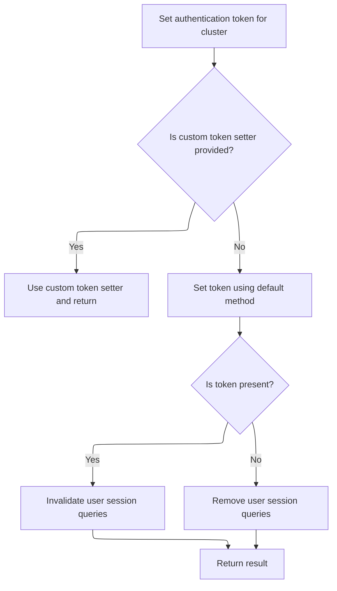

<SwmSnippet path="/frontend/src/lib/auth.ts" line="108">

---

<SwmToken path="frontend/src/lib/auth.ts" pos="108:4:4" line-data="export function setToken(cluster: string, token: string | null) {">`setToken`</SwmToken> checks if there's a custom override for setting the token. If not, it uses <SwmToken path="frontend/src/lib/auth.ts" pos="114:3:3" line-data="  return setCookieToken(cluster, token).then(result =&gt; {">`setCookieToken`</SwmToken> to store or clear the token in cookies, and updates the query cache to keep auth state in sync. We call <SwmToken path="frontend/src/lib/auth.ts" pos="114:3:3" line-data="  return setCookieToken(cluster, token).then(result =&gt; {">`setCookieToken`</SwmToken> next if no override is present.

```typescript
export function setToken(cluster: string, token: string | null) {
  const setTokenMethodToUse = store.getState().ui.functionsToOverride.setToken;
  if (setTokenMethodToUse) {
    return Promise.resolve(setTokenMethodToUse(cluster, token));
  }

  return setCookieToken(cluster, token).then(result => {
    if (token) {
      queryClient.invalidateQueries({ queryKey: ['clusterMe', cluster], exact: true });
    } else {
      queryClient.removeQueries({ queryKey: ['clusterMe', cluster], exact: true });
    }

    return result;
  });
}
```

---

</SwmSnippet>

## Storing Cluster Token in Cookies

<SwmSnippet path="/frontend/src/lib/auth.ts" line="79">

---

<SwmToken path="frontend/src/lib/auth.ts" pos="79:4:4" line-data="async function setCookieToken(cluster: string, token: string | null) {">`setCookieToken`</SwmToken> sends a POST to /clusters/{cluster}/set-token with the token in the body, using <SwmToken path="frontend/src/lib/auth.ts" pos="81:9:9" line-data="    const response = await backendFetch(`/clusters/${cluster}/set-token`, {">`backendFetch`</SwmToken> to handle credentials and headers. We call <SwmToken path="frontend/src/lib/auth.ts" pos="81:9:9" line-data="    const response = await backendFetch(`/clusters/${cluster}/set-token`, {">`backendFetch`</SwmToken> next to actually make the request.

```typescript
async function setCookieToken(cluster: string, token: string | null) {
  try {
    const response = await backendFetch(`/clusters/${cluster}/set-token`, {
      method: 'POST',
      headers: {
        'Content-Type': 'application/json',
        ...getHeadlampAPIHeaders(),
      },
      body: JSON.stringify({ token }),
    });

    if (!response.ok) {
      throw new Error(`Failed to set cookie token`);
    }
    return true;
  } catch (error) {
    console.error('Error setting cookie token:', error);
    throw error;
  }
}
```

---

</SwmSnippet>

## Making Authenticated Backend Requests

```mermaid
%%{init: {"flowchart": {"defaultRenderer": "elk"}} }%%
flowchart TD
  node1["Send backend request with credentials and authentication"] --> node2{"Did backend request reload? (X-Reload header contains 'reload')"}
  click node1 openCode "frontend/src/lib/k8s/api/v2/fetch.ts:38:42"
  node2 -->|"Yes"| node3["Reload the page"]
  click node2 openCode "frontend/src/lib/k8s/api/v2/fetch.ts:46:49"
  click node3 openCode "frontend/src/lib/k8s/api/v2/fetch.ts:48:48"
  node2 -->|"No"| node4{"Was the backend response successful?"}
  click node4 openCode "frontend/src/lib/k8s/api/v2/fetch.ts:51:59"
  node4 -->|"No"| node5["Throw error with backend message"]
  click node5 openCode "frontend/src/lib/k8s/api/v2/fetch.ts:51:59"
  node4 -->|"Yes"| node6["Return backend response"]
  click node6 openCode "frontend/src/lib/k8s/api/v2/fetch.ts:62:62"
classDef HeadingStyle fill:#777777,stroke:#333,stroke-width:2px;

%% Swimm:
%% %%{init: {"flowchart": {"defaultRenderer": "elk"}} }%%
%% flowchart TD
%%   node1["Send backend request with credentials and authentication"] --> node2{"Did backend request reload? (<SwmToken path="frontend/src/lib/k8s/api/v1/clusterRequests.ts" pos="185:14:16" line-data="  const headerVal = response.headers.get(&#39;X-Reload&#39;);">`X-Reload`</SwmToken> header contains 'reload')"}
%%   click node1 openCode "<SwmPath>[frontend/…/v2/fetch.ts](frontend/src/lib/k8s/api/v2/fetch.ts)</SwmPath>:38:42"
%%   node2 -->|"Yes"| node3["Reload the page"]
%%   click node2 openCode "<SwmPath>[frontend/…/v2/fetch.ts](frontend/src/lib/k8s/api/v2/fetch.ts)</SwmPath>:46:49"
%%   click node3 openCode "<SwmPath>[frontend/…/v2/fetch.ts](frontend/src/lib/k8s/api/v2/fetch.ts)</SwmPath>:48:48"
%%   node2 -->|"No"| node4{"Was the backend response successful?"}
%%   click node4 openCode "<SwmPath>[frontend/…/v2/fetch.ts](frontend/src/lib/k8s/api/v2/fetch.ts)</SwmPath>:51:59"
%%   node4 -->|"No"| node5["Throw error with backend message"]
%%   click node5 openCode "<SwmPath>[frontend/…/v2/fetch.ts](frontend/src/lib/k8s/api/v2/fetch.ts)</SwmPath>:51:59"
%%   node4 -->|"Yes"| node6["Return backend response"]
%%   click node6 openCode "<SwmPath>[frontend/…/v2/fetch.ts](frontend/src/lib/k8s/api/v2/fetch.ts)</SwmPath>:62:62"
%% classDef HeadingStyle fill:#777777,stroke:#333,stroke-width:2px;
```

<SwmSnippet path="/frontend/src/lib/k8s/api/v2/fetch.ts" line="38">

---

In <SwmToken path="frontend/src/lib/k8s/api/v2/fetch.ts" pos="38:6:6" line-data="export async function backendFetch(url: string | URL, init: RequestInit = {}) {">`backendFetch`</SwmToken>, we always include credentials and add custom auth headers, then build the full request URL using <SwmToken path="frontend/src/lib/k8s/api/v2/fetch.ts" pos="42:14:14" line-data="  const response = await fetch(makeUrl([getAppUrl(), url]), init);">`getAppUrl`</SwmToken> and <SwmToken path="frontend/src/lib/k8s/api/v2/fetch.ts" pos="42:11:11" line-data="  const response = await fetch(makeUrl([getAppUrl(), url]), init);">`makeUrl`</SwmToken>. We call <SwmToken path="frontend/src/lib/k8s/api/v2/fetch.ts" pos="42:14:14" line-data="  const response = await fetch(makeUrl([getAppUrl(), url]), init);">`getAppUrl`</SwmToken> next to get the base URL for the request.

```typescript
export async function backendFetch(url: string | URL, init: RequestInit = {}) {
  // Always include credentials
  init.credentials = 'include';
  init.headers = addBackstageAuthHeaders(init.headers);
  const response = await fetch(makeUrl([getAppUrl(), url]), init);

```

---

</SwmSnippet>

<SwmSnippet path="/frontend/src/lib/k8s/api/v2/fetch.ts" line="44">

---

Back in <SwmToken path="frontend/src/lib/auth.ts" pos="81:9:9" line-data="    const response = await backendFetch(`/clusters/${cluster}/set-token`, {">`backendFetch`</SwmToken>, after getting the response, we reload the page if the backend says so via <SwmToken path="frontend/src/lib/k8s/api/v2/fetch.ts" pos="46:14:16" line-data="  const headerVal = response.headers.get(&#39;X-Reload&#39;);">`X-Reload`</SwmToken>. If the response isn't ok, we parse the error message and throw an <SwmToken path="frontend/src/lib/k8s/api/v2/fetch.ts" pos="59:5:5" line-data="    throw new ApiError(maybeErrorMessage ?? &#39;Unreachable&#39;, { status: response.status });">`ApiError`</SwmToken> for better error handling.

```typescript
  // The backend signals through this header that it wants a reload.
  // See plugins.go
  const headerVal = response.headers.get('X-Reload');
  if (headerVal && headerVal.indexOf('reload') !== -1) {
    window.location.reload();
  }

  if (!response.ok) {
    // Try to parse error message from response
    let maybeErrorMessage: string | undefined;
    try {
      const body = await response.json();
      maybeErrorMessage = typeof body === 'string' ? body : body.message;
    } catch (e) {}

    throw new ApiError(maybeErrorMessage ?? 'Unreachable', { status: response.status });
  }

  return response;
}
```

---

</SwmSnippet>

## Handling Cluster API Errors

```mermaid
%%{init: {"flowchart": {"defaultRenderer": "elk"}} }%%
flowchart TD
    node1["Is response JSON?"] 
    click node1 openCode "frontend/src/lib/k8s/api/v1/clusterRequests.ts:218:222"
    node1 -->|"Yes"| node2["Return parsed JSON response"]
    click node2 openCode "frontend/src/lib/k8s/api/v1/clusterRequests.ts:222:223"
    node1 -->|"No"| node3["Return raw response"]
    click node3 openCode "frontend/src/lib/k8s/api/v1/clusterRequests.ts:219:220"
    
    subgraph error_handling["If error occurred earlier"]
      node4["Build error message (statusText, JSON message if available)"]
      click node4 openCode "frontend/src/lib/k8s/api/v1/clusterRequests.ts:197:212"
      node5["Reject with error object (status, message)"]
      click node5 openCode "frontend/src/lib/k8s/api/v1/clusterRequests.ts:213:215"
    end
classDef HeadingStyle fill:#777777,stroke:#333,stroke-width:2px;

%% Swimm:
%% %%{init: {"flowchart": {"defaultRenderer": "elk"}} }%%
%% flowchart TD
%%     node1["Is response JSON?"] 
%%     click node1 openCode "<SwmPath>[frontend/…/v1/clusterRequests.ts](frontend/src/lib/k8s/api/v1/clusterRequests.ts)</SwmPath>:218:222"
%%     node1 -->|"Yes"| node2["Return parsed JSON response"]
%%     click node2 openCode "<SwmPath>[frontend/…/v1/clusterRequests.ts](frontend/src/lib/k8s/api/v1/clusterRequests.ts)</SwmPath>:222:223"
%%     node1 -->|"No"| node3["Return raw response"]
%%     click node3 openCode "<SwmPath>[frontend/…/v1/clusterRequests.ts](frontend/src/lib/k8s/api/v1/clusterRequests.ts)</SwmPath>:219:220"
%%     
%%     subgraph error_handling["If error occurred earlier"]
%%       node4["Build error message (<SwmToken path="frontend/src/lib/k8s/api/v1/clusterRequests.ts" pos="170:25:25" line-data="  let response: Response = new Response(undefined, { status: 502, statusText: &#39;Unreachable&#39; });">`statusText`</SwmToken>, JSON message if available)"]
%%       click node4 openCode "<SwmPath>[frontend/…/v1/clusterRequests.ts](frontend/src/lib/k8s/api/v1/clusterRequests.ts)</SwmPath>:197:212"
%%       node5["Reject with error object (status, message)"]
%%       click node5 openCode "<SwmPath>[frontend/…/v1/clusterRequests.ts](frontend/src/lib/k8s/api/v1/clusterRequests.ts)</SwmPath>:213:215"
%%     end
%% classDef HeadingStyle fill:#777777,stroke:#333,stroke-width:2px;
```

<SwmSnippet path="/frontend/src/lib/k8s/api/v1/clusterRequests.ts" line="197">

---

After returning from logout in <SwmToken path="frontend/src/lib/k8s/api/v1/clusterRequests.ts" pos="108:3:3" line-data="  return clusterRequest(path, { cluster, autoLogoutOnAuthError, ...params }, queryParams);">`clusterRequest`</SwmToken>, we handle API errors by building an error message from the response status and any backend-provided JSON message. If the response isn't JSON or parsing fails, we just use the status text. The error is then thrown as an <SwmToken path="frontend/src/lib/k8s/api/v1/clusterRequests.ts" pos="213:16:16" line-data="    const error = new Error(message) as ApiError;">`ApiError`</SwmToken>, so the UI can show a relevant message. This keeps error handling consistent after clearing cluster auth state.

```typescript
    let message = statusText;
    try {
      if (isJSON) {
        const json = await response.json();
        message += ` - ${json.message}`;
      }
    } catch (err) {
      console.error(
        'Unable to parse error json at url:',
        url,
        { err },
        'with request data:',
        requestData
      );
    }

    const error = new Error(message) as ApiError;
    error.status = status;
    return Promise.reject(error);
  }

  if (!isJSON) {
    return Promise.resolve(response);
  }

  return response.json();
}
```

---

</SwmSnippet>

&nbsp;

*This is an auto-generated document by Swimm 🌊 and has not yet been verified by a human*

<SwmMeta version="3.0.0" repo-id="Z2l0aHViJTNBJTNBdHlwZXNjcmlwdC1oZWFkbGFtcCUzQSUzQXJpY2FyZG9sb3Blemc=" repo-name="typescript-headlamp"><sup>Powered by [Swimm](https://app.swimm.io/)</sup></SwmMeta>
