This document describes how users can onboard and configure Kubernetes clusters by uploading a kubeconfig file. Users select clusters to set up, validate their choices, and complete the setup with feedback provided throughout the process.

# Managing kubeconfig selection and cluster setup steps

<SwmSnippet path="/frontend/src/components/cluster/KubeConfigLoader.tsx" line="116">

---

In <SwmToken path="frontend/src/components/cluster/KubeConfigLoader.tsx" pos="116:2:2" line-data="function KubeConfigLoader() {">`KubeConfigLoader`</SwmToken>, we kick off the multi-step UI flow for loading and configuring clusters from a kubeconfig file. The component uses React state and effects to move through steps: file loading, cluster selection, validation, and configuration. After validating the selected clusters, it prepares a minimal kubeconfig, encodes it, and calls <SwmToken path="frontend/src/components/cluster/KubeConfigLoader.tsx" pos="160:1:1" line-data="        setCluster({ kubeconfig: btoa(yaml.dump(selectedClusterConfig)) })">`setCluster`</SwmToken> (from <SwmPath>[frontend/…/v1/clusterApi.ts](frontend/src/lib/k8s/api/v1/clusterApi.ts)</SwmPath>) to push the config to the backend. This call is needed to actually persist the cluster setup and trigger the next state update.

```tsx
function KubeConfigLoader() {
  const history = useHistory();
  const [state, setState] = useState(Step.LoadKubeConfig);
  const [error, setError] = React.useState('');
  const [fileContent, setFileContent] = useState<kubeconfig>({
    clusters: [],
    users: [],
    contexts: [],
    currentContext: '',
  });
  const [selectedClusters, setSelectedClusters] = useState<string[]>([]);
  const configuredClusters = useClustersConf(); // Get already configured clusters

  useEffect(() => {
    if (fileContent.contexts.length > 0) {
      setSelectedClusters(fileContent.contexts.map(context => context.name));
      setState(Step.SelectClusters);
    }
    return () => {};
  }, [fileContent]);

  useEffect(() => {
    if (state === Step.ValidateKubeConfig) {
      const alreadyConfiguredClusters = selectedClusters.filter(
        clusterName => configuredClusters && configuredClusters[clusterName]
      );

      if (alreadyConfiguredClusters.length > 0) {
        setError(
          t(
            'translation|Duplicate cluster: {{ clusterNames }} in the list. Please edit the context name.',
            {
              clusterNames: alreadyConfiguredClusters.join(', '),
            }
          )
        );
        setState(Step.SelectClusters);
      } else {
        setState(Step.ConfigureClusters);
      }
    }
    if (state === Step.ConfigureClusters) {
      function loadClusters() {
        const selectedClusterConfig = configWithSelectedClusters(fileContent, selectedClusters);
        setCluster({ kubeconfig: btoa(yaml.dump(selectedClusterConfig)) })
          .then(res => {
```

---

</SwmSnippet>

<SwmSnippet path="/frontend/src/lib/k8s/api/v1/clusterApi.ts" line="60">

---

<SwmToken path="frontend/src/lib/k8s/api/v1/clusterApi.ts" pos="60:6:6" line-data="export async function setCluster(clusterReq: ClusterRequest) {">`setCluster`</SwmToken> handles sending cluster setup requests to the backend. It checks if a kubeconfig is present: if so, it stores it statelessly and POSTs to <SwmToken path="frontend/src/lib/k8s/api/v1/clusterApi.ts" pos="68:2:3" line-data="      &#39;/parseKubeConfig&#39;,">`/parseKubeConfig`</SwmToken>; otherwise, it POSTs to <SwmPath>[frontend/…/components/cluster/](frontend/src/components/cluster/)</SwmPath> with extra headers. This lets us handle both new kubeconfig setups and updates to existing clusters, using the right backend endpoint and authentication.

```typescript
export async function setCluster(clusterReq: ClusterRequest) {
  const kubeconfig = clusterReq.kubeconfig;
  const headers = addBackstageAuthHeaders(JSON_HEADERS);

  if (kubeconfig) {
    await storeStatelessClusterKubeconfig(kubeconfig);
    // We just send parsed kubeconfig from the backend to the frontend.
    return request(
      '/parseKubeConfig',
      {
        method: 'POST',
        body: JSON.stringify(clusterReq),
        headers: {
          ...headers,
        },
      },
      false,
      false
    );
  }

  return request(
    '/cluster',
    {
      method: 'POST',
      body: JSON.stringify(clusterReq),
      headers: {
        ...headers,
        ...getHeadlampAPIHeaders(),
      },
    },
    false,
    false
  );
}
```

---

</SwmSnippet>

<SwmSnippet path="/frontend/src/components/cluster/KubeConfigLoader.tsx" line="162">

---

Back in <SwmToken path="frontend/src/components/cluster/KubeConfigLoader.tsx" pos="116:2:2" line-data="function KubeConfigLoader() {">`KubeConfigLoader`</SwmToken>, after <SwmToken path="frontend/src/components/cluster/KubeConfigLoader.tsx" pos="160:1:1" line-data="        setCluster({ kubeconfig: btoa(yaml.dump(selectedClusterConfig)) })">`setCluster`</SwmToken> returns, we handle the backend response. If clusters are set up, we update the global config and move to the Success step. If there's an error, we show an error and let the user reselect clusters. Calling <SwmToken path="frontend/src/components/cluster/KubeConfigLoader.tsx" pos="175:1:1" line-data="      loadClusters();">`loadClusters`</SwmToken> here is what actually triggers the backend setup and state update.

```tsx
            if (res?.clusters?.length > 0) {
              dispatch(setStatelessConfig(res));
            }
            setState(Step.Success);
          })
          .catch(e => {
            console.debug('Error setting up clusters from kubeconfig:', e);
            setError(
              t('translation|Error setting up clusters, please load a valid kubeconfig file')
            );
            setState(Step.SelectClusters);
          });
      }
      loadClusters();
    }
    return () => {};
  }, [state]);

```

---

</SwmSnippet>

## Preparing and sending cluster configuration

```mermaid
%%{init: {"flowchart": {"defaultRenderer": "elk"}} }%%
flowchart TD
  node1["User loads selected clusters from kubeconfig file"]
  click node1 openCode "frontend/src/components/cluster/KubeConfigLoader.tsx:158:159"
  node1 --> node2["Update application with selected clusters"]
  click node2 openCode "frontend/src/components/cluster/KubeConfigLoader.tsx:160:161"
  node2 --> node3{"Are clusters present in loaded config?"}
  click node3 openCode "frontend/src/components/cluster/KubeConfigLoader.tsx:162:164"
  node3 -->|"Yes"| node4["Update application state with loaded clusters"]
  click node4 openCode "frontend/src/components/cluster/KubeConfigLoader.tsx:163:163"
  node3 -->|"No"| node5["Skip state update"]
  click node5 openCode "frontend/src/components/cluster/KubeConfigLoader.tsx:164:164"
  node4 --> node6["Show success to user"]
  click node6 openCode "frontend/src/components/cluster/KubeConfigLoader.tsx:165:165"
  node5 --> node6
  node2 -.->|"If loading fails"| node7["Show error message to user"]
  click node7 openCode "frontend/src/components/cluster/KubeConfigLoader.tsx:168:171"
  node7 --> node8["Return to cluster selection"]
  click node8 openCode "frontend/src/components/cluster/KubeConfigLoader.tsx:172:172"

classDef HeadingStyle fill:#777777,stroke:#333,stroke-width:2px;

%% Swimm:
%% %%{init: {"flowchart": {"defaultRenderer": "elk"}} }%%
%% flowchart TD
%%   node1["User loads selected clusters from kubeconfig file"]
%%   click node1 openCode "<SwmPath>[frontend/…/cluster/KubeConfigLoader.tsx](frontend/src/components/cluster/KubeConfigLoader.tsx)</SwmPath>:158:159"
%%   node1 --> node2["Update application with selected clusters"]
%%   click node2 openCode "<SwmPath>[frontend/…/cluster/KubeConfigLoader.tsx](frontend/src/components/cluster/KubeConfigLoader.tsx)</SwmPath>:160:161"
%%   node2 --> node3{"Are clusters present in loaded config?"}
%%   click node3 openCode "<SwmPath>[frontend/…/cluster/KubeConfigLoader.tsx](frontend/src/components/cluster/KubeConfigLoader.tsx)</SwmPath>:162:164"
%%   node3 -->|"Yes"| node4["Update application state with loaded clusters"]
%%   click node4 openCode "<SwmPath>[frontend/…/cluster/KubeConfigLoader.tsx](frontend/src/components/cluster/KubeConfigLoader.tsx)</SwmPath>:163:163"
%%   node3 -->|"No"| node5["Skip state update"]
%%   click node5 openCode "<SwmPath>[frontend/…/cluster/KubeConfigLoader.tsx](frontend/src/components/cluster/KubeConfigLoader.tsx)</SwmPath>:164:164"
%%   node4 --> node6["Show success to user"]
%%   click node6 openCode "<SwmPath>[frontend/…/cluster/KubeConfigLoader.tsx](frontend/src/components/cluster/KubeConfigLoader.tsx)</SwmPath>:165:165"
%%   node5 --> node6
%%   node2 -.->|"If loading fails"| node7["Show error message to user"]
%%   click node7 openCode "<SwmPath>[frontend/…/cluster/KubeConfigLoader.tsx](frontend/src/components/cluster/KubeConfigLoader.tsx)</SwmPath>:168:171"
%%   node7 --> node8["Return to cluster selection"]
%%   click node8 openCode "<SwmPath>[frontend/…/cluster/KubeConfigLoader.tsx](frontend/src/components/cluster/KubeConfigLoader.tsx)</SwmPath>:172:172"
%% 
%% classDef HeadingStyle fill:#777777,stroke:#333,stroke-width:2px;
```



<SwmSnippet path="/frontend/src/components/cluster/KubeConfigLoader.tsx" line="158">

---

In <SwmToken path="frontend/src/components/cluster/KubeConfigLoader.tsx" pos="158:3:3" line-data="      function loadClusters() {">`loadClusters`</SwmToken>, we build a minimal kubeconfig from the user's selections, encode it, and call <SwmToken path="frontend/src/components/cluster/KubeConfigLoader.tsx" pos="160:1:1" line-data="        setCluster({ kubeconfig: btoa(yaml.dump(selectedClusterConfig)) })">`setCluster`</SwmToken> to send it to the backend. This is where the actual cluster setup request happens, using the current state from the component.

```tsx
      function loadClusters() {
        const selectedClusterConfig = configWithSelectedClusters(fileContent, selectedClusters);
        setCluster({ kubeconfig: btoa(yaml.dump(selectedClusterConfig)) })
          .then(res => {
```

---

</SwmSnippet>

<SwmSnippet path="/frontend/src/components/cluster/KubeConfigLoader.tsx" line="162">

---

After returning from <SwmToken path="frontend/src/components/cluster/KubeConfigLoader.tsx" pos="160:1:1" line-data="        setCluster({ kubeconfig: btoa(yaml.dump(selectedClusterConfig)) })">`setCluster`</SwmToken> in <SwmToken path="frontend/src/components/cluster/KubeConfigLoader.tsx" pos="158:3:3" line-data="      function loadClusters() {">`loadClusters`</SwmToken>, we check the response for clusters. If present, we update the global config and set the state to Success. If not, or if there's an error, we show an error and let the user try again. This wraps up the async setup and state transition.

```tsx
            if (res?.clusters?.length > 0) {
              dispatch(setStatelessConfig(res));
            }
            setState(Step.Success);
          })
          .catch(e => {
            console.debug('Error setting up clusters from kubeconfig:', e);
            setError(
              t('translation|Error setting up clusters, please load a valid kubeconfig file')
            );
            setState(Step.SelectClusters);
          });
      }
```

---

</SwmSnippet>

## File parsing, validation, and UI rendering

```mermaid
%%{init: {"flowchart": {"defaultRenderer": "elk"}} }%%
flowchart TD
  node1["User uploads kubeconfig file"]
  click node1 openCode "frontend/src/components/cluster/KubeConfigLoader.tsx:183:210"
  node1 --> node2{"Does file contain clusters and contexts?"}
  click node2 openCode "frontend/src/components/cluster/KubeConfigLoader.tsx:192:198"
  node2 -->|"Yes"| node3["User selects clusters"]
  click node3 openCode "frontend/src/components/cluster/KubeConfigLoader.tsx:217:227"
  node2 -->|"No"| node4["Show error: Invalid kubeconfig file"]
  click node4 openCode "frontend/src/components/cluster/KubeConfigLoader.tsx:201:206"
  
  subgraph loop1["For each cluster in kubeconfig"]
    node3 --> node5["User checks/unchecks cluster"]
    click node5 openCode "frontend/src/components/cluster/KubeConfigLoader.tsx:217:227"
    node5 --> node3
  end
  node3 --> node6{"Any clusters selected?"}
  click node6 openCode "frontend/src/components/cluster/KubeConfigLoader.tsx:323:324"
  node6 -->|"Yes"| node7["Validate selected clusters"]
  click node7 openCode "frontend/src/components/cluster/KubeConfigLoader.tsx:344:350"
  node6 -->|"No"| node3
  node7 --> node8{"Validation successful?"}
  click node8 openCode "frontend/src/components/cluster/KubeConfigLoader.tsx:351:357"
  node8 -->|"Yes"| node9["Show success message: Clusters set up"]
  click node9 openCode "frontend/src/components/cluster/KubeConfigLoader.tsx:359:374"
  node8 -->|"No"| node10["Show error: Validation failed"]
  click node10 openCode "frontend/src/components/cluster/KubeConfigLoader.tsx:389:390"
  node10 --> node3
classDef HeadingStyle fill:#777777,stroke:#333,stroke-width:2px;

%% Swimm:
%% %%{init: {"flowchart": {"defaultRenderer": "elk"}} }%%
%% flowchart TD
%%   node1["User uploads kubeconfig file"]
%%   click node1 openCode "<SwmPath>[frontend/…/cluster/KubeConfigLoader.tsx](frontend/src/components/cluster/KubeConfigLoader.tsx)</SwmPath>:183:210"
%%   node1 --> node2{"Does file contain clusters and contexts?"}
%%   click node2 openCode "<SwmPath>[frontend/…/cluster/KubeConfigLoader.tsx](frontend/src/components/cluster/KubeConfigLoader.tsx)</SwmPath>:192:198"
%%   node2 -->|"Yes"| node3["User selects clusters"]
%%   click node3 openCode "<SwmPath>[frontend/…/cluster/KubeConfigLoader.tsx](frontend/src/components/cluster/KubeConfigLoader.tsx)</SwmPath>:217:227"
%%   node2 -->|"No"| node4["Show error: Invalid kubeconfig file"]
%%   click node4 openCode "<SwmPath>[frontend/…/cluster/KubeConfigLoader.tsx](frontend/src/components/cluster/KubeConfigLoader.tsx)</SwmPath>:201:206"
%%   
%%   subgraph loop1["For each cluster in kubeconfig"]
%%     node3 --> node5["User checks/unchecks cluster"]
%%     click node5 openCode "<SwmPath>[frontend/…/cluster/KubeConfigLoader.tsx](frontend/src/components/cluster/KubeConfigLoader.tsx)</SwmPath>:217:227"
%%     node5 --> node3
%%   end
%%   node3 --> node6{"Any clusters selected?"}
%%   click node6 openCode "<SwmPath>[frontend/…/cluster/KubeConfigLoader.tsx](frontend/src/components/cluster/KubeConfigLoader.tsx)</SwmPath>:323:324"
%%   node6 -->|"Yes"| node7["Validate selected clusters"]
%%   click node7 openCode "<SwmPath>[frontend/…/cluster/KubeConfigLoader.tsx](frontend/src/components/cluster/KubeConfigLoader.tsx)</SwmPath>:344:350"
%%   node6 -->|"No"| node3
%%   node7 --> node8{"Validation successful?"}
%%   click node8 openCode "<SwmPath>[frontend/…/cluster/KubeConfigLoader.tsx](frontend/src/components/cluster/KubeConfigLoader.tsx)</SwmPath>:351:357"
%%   node8 -->|"Yes"| node9["Show success message: Clusters set up"]
%%   click node9 openCode "<SwmPath>[frontend/…/cluster/KubeConfigLoader.tsx](frontend/src/components/cluster/KubeConfigLoader.tsx)</SwmPath>:359:374"
%%   node8 -->|"No"| node10["Show error: Validation failed"]
%%   click node10 openCode "<SwmPath>[frontend/…/cluster/KubeConfigLoader.tsx](frontend/src/components/cluster/KubeConfigLoader.tsx)</SwmPath>:389:390"
%%   node10 --> node3
%% classDef HeadingStyle fill:#777777,stroke:#333,stroke-width:2px;
```



<SwmSnippet path="/frontend/src/components/cluster/KubeConfigLoader.tsx" line="180">

---

After returning from <SwmToken path="frontend/src/components/cluster/KubeConfigLoader.tsx" pos="158:3:3" line-data="      function loadClusters() {">`loadClusters`</SwmToken>, <SwmToken path="frontend/src/components/cluster/KubeConfigLoader.tsx" pos="116:2:2" line-data="function KubeConfigLoader() {">`KubeConfigLoader`</SwmToken> handles file input, parses and validates the kubeconfig, and renders the UI for each step. The UI updates dynamically based on the current state, showing file upload, cluster selection, progress, or success as needed.

```tsx
  const dispatch = useDispatch();
  const { t } = useTranslation(['translation']);

  const onDrop = (acceptedFiles: Blob[]) => {
    setError('');
    const reader = new FileReader();
    reader.onerror = () => setError(t("translation|Couldn't read kubeconfig file"));
    reader.onload = () => {
      try {
        const data = String.fromCharCode.apply(null, [
          ...new Uint8Array(reader.result as ArrayBuffer),
        ]);
        const doc = yaml.load(data) as kubeconfig;
        if (!doc.clusters) {
          throw new Error(t('translation|No clusters found!'));
        }
        if (!doc.contexts) {
          throw new Error(t('translation|No contexts found!'));
        }
        setFileContent(doc);
      } catch (err) {
        setError(
          t(`translation|Invalid kubeconfig file: {{ errorMessage }}`, {
            errorMessage: (err as Error).message,
          })
        );
        return;
      }
    };
    reader.readAsArrayBuffer(acceptedFiles[0]);
  };

  const { getRootProps, getInputProps, open } = useDropzone({
    onDrop: onDrop,
    multiple: false,
  });

  function handleCheckboxChange(event: React.ChangeEvent<HTMLInputElement>) {
    if (!event.target.checked) {
      // remove from selected clusters
      setSelectedClusters(selectedClusters =>
        selectedClusters.filter(cluster => cluster !== event.target.name)
      );
    } else {
      // add to selected clusters
      setSelectedClusters(selectedClusters => [...selectedClusters, event.target.name]);
    }
  }

  function renderSwitch() {
    switch (state) {
      case Step.LoadKubeConfig:
        return (
          <Box>
            <DropZoneBox border={1} borderColor="secondary.main" {...getRootProps()}>
              <FormControl>
                <input {...getInputProps()} />
                <Tooltip
                  title={t('translation|Drag & drop or choose kubeconfig file here')}
                  placement="top"
                >
                  <Button
                    variant="contained"
                    onClick={() => open}
                    startIcon={<InlineIcon icon="mdi:upload" width={32} />}
                  >
                    {t('translation|Choose file')}
                  </Button>
                </Tooltip>
              </FormControl>
            </DropZoneBox>
            <Box style={{ display: 'flex', justifyContent: 'center' }}>
              <WideButton onClick={() => history.goBack()}>{t('translation|Back')}</WideButton>
            </Box>
          </Box>
        );
      case Step.SelectClusters:
        return (
          <Box
            style={{
              display: 'flex',
              flexDirection: 'column',
              justifyContent: 'center',
              textAlign: 'center',
              alignItems: 'center',
            }}
          >
            <Typography>{t('translation|Select clusters')}</Typography>
            {fileContent.clusters ? (
              <>
                <Box
                  sx={{
                    display: 'flex',
                    flexDirection: 'column',
                    alignItems: 'center',
                    textAlign: 'center',
                    justifyContent: 'center',
                    padding: '15px',
                    width: '100%',
                    maxWidth: '300px',
                  }}
                >
                  <FormControl
                    sx={{
                      overflowY: 'auto',
                      height: '150px',
                      paddingLeft: '10px',
                      paddingRight: '10px',
                      width: '100%',
                    }}
                  >
                    {fileContent.contexts.map(context => {
                      return (
                        <FormControlLabel
                          key={context.name}
                          control={
                            <Checkbox
                              value={context.name}
                              name={context.name}
                              onChange={handleCheckboxChange}
                              color="primary"
                              checked={selectedClusters.includes(context.name)}
                            />
                          }
                          label={context.name}
                        />
                      );
                    })}
                  </FormControl>
                  <Grid
                    container
                    direction="column"
                    spacing={2}
                    justifyContent="center"
                    alignItems="stretch"
                  >
                    <Grid item>
                      <WideButton
                        variant="contained"
                        color="primary"
                        onClick={() => {
                          setState(Step.ValidateKubeConfig);
                        }}
                        disabled={selectedClusters.length === 0}
                      >
                        {t('translation|Next')}
                      </WideButton>
                    </Grid>
                    <Grid item>
                      <WideButton
                        onClick={() => {
                          setError('');
                          setState(Step.LoadKubeConfig);
                        }}
                      >
                        {t('translation|Back')}
                      </WideButton>
                    </Grid>
                  </Grid>
                </Box>
              </>
            ) : null}
          </Box>
        );
      case Step.ValidateKubeConfig:
        return (
          <Box style={{ textAlign: 'center' }}>
            <Typography>{t('translation|Validating selected clusters')}</Typography>
            <Loader title={t('translation|Validating selected clusters')} />
          </Box>
        );
      case Step.ConfigureClusters:
        return (
          <Box style={{ textAlign: 'center' }}>
            <Typography>{t('translation|Setting up clusters')}</Typography>
            <Loader title={t('translation|Setting up clusters')} />
          </Box>
        );
      case Step.Success:
        return (
          <Box
            sx={{
              display: 'flex',
              flexDirection: 'column',
              justifyContent: 'center',
              textAlign: 'center',
              alignItems: 'center',
            }}
          >
            <Box style={{ padding: '32px' }}>
              <Typography>{t('translation|Clusters successfully set up!')}</Typography>
            </Box>
            <WideButton variant="contained" onClick={() => history.replace('/')}>
              {t('translation|Finish')}
            </WideButton>
          </Box>
        );
    }
  }

  return (
    <ClusterDialog
      showInfoButton={false}
      // Disable backdrop clicking.
      onClose={() => {}}
      useCover
    >
      <DialogTitle>{t('translation|Load from KubeConfig')}</DialogTitle>
      {error && error !== '' ? (
        <Box style={{ backgroundColor: 'red', textAlign: 'center', padding: '4px' }}>{error}</Box>
      ) : null}
      <Box>{renderSwitch()}</Box>
    </ClusterDialog>
  );
}
```

---

</SwmSnippet>

&nbsp;

*This is an auto-generated document by Swimm 🌊 and has not yet been verified by a human*

<SwmMeta version="3.0.0" repo-id="Z2l0aHViJTNBJTNBdHlwZXNjcmlwdC1oZWFkbGFtcCUzQSUzQXJpY2FyZG9sb3Blemc=" repo-name="typescript-headlamp"><sup>Powered by [Swimm](https://app.swimm.io/)</sup></SwmMeta>
