This document describes how the application registers and sets up a Kubernetes cluster for user operations. When a cluster setup request is received, the system stores credentials, identifies the cluster, and prepares future requests to target the correct cluster context. This enables users to manage and interact with their clusters securely and efficiently.

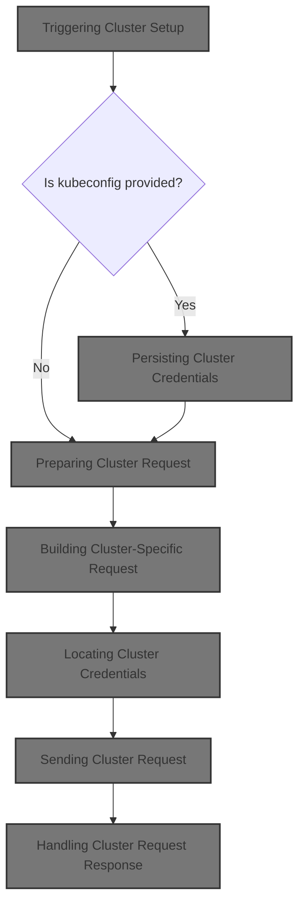

# Where is this flow used?

This flow is used multiple times in the codebase as represented in the following diagram:

```mermaid
graph TD;
      5e67bc77a20e08b4e009c0ae7679512b3a6c0d2b9a8f20c33d376171e891c10c(frontend/…/Settings/SettingsCluster.tsx::SettingsCluster) --> 5020118a10ede7f8340acc06c59313bc5edc1ed5b63aafc2409ce3846a9ddd79(frontend/…/plugin/lib.ts::setCluster):::mainFlowStyle

1a3c5921495b40b2fb57788e915682bdd6d9fb540314ecb88243cce0b3b1331a(frontend/…/404/index.tsx::ClusterCreationButton) --> 5020118a10ede7f8340acc06c59313bc5edc1ed5b63aafc2409ce3846a9ddd79(frontend/…/plugin/lib.ts::setCluster):::mainFlowStyle

c2b54f7ed57290330618f76972616d17340a8540e5fef728a248c7c189edb92a(frontend/…/404/index.tsx::handleSubmit) --> 5020118a10ede7f8340acc06c59313bc5edc1ed5b63aafc2409ce3846a9ddd79(frontend/…/plugin/lib.ts::setCluster):::mainFlowStyle


classDef mainFlowStyle color:#000000,fill:#7CB9F4
classDef rootsStyle color:#000000,fill:#00FFF4
classDef Style1 color:#000000,fill:#00FFAA
classDef Style2 color:#000000,fill:#FFFF00
classDef Style3 color:#000000,fill:#AA7CB9

%% Swimm:
%% graph TD;
%%       5e67bc77a20e08b4e009c0ae7679512b3a6c0d2b9a8f20c33d376171e891c10c(<SwmPath>[frontend/…/Settings/SettingsCluster.tsx](frontend/src/components/App/Settings/SettingsCluster.tsx)</SwmPath>::SettingsCluster) --> 5020118a10ede7f8340acc06c59313bc5edc1ed5b63aafc2409ce3846a9ddd79(<SwmPath>[frontend/…/plugin/lib.ts](frontend/src/plugin/lib.ts)</SwmPath>::<SwmToken path="frontend/src/plugin/lib.ts" pos="141:3:3" line-data="  static setCluster(clusterReq: ClusterRequest) {">`setCluster`</SwmToken>):::mainFlowStyle
%% 
%% 1a3c5921495b40b2fb57788e915682bdd6d9fb540314ecb88243cce0b3b1331a(<SwmPath>[frontend/…/404/index.tsx](frontend/src/components/404/index.tsx)</SwmPath>::ClusterCreationButton) --> 5020118a10ede7f8340acc06c59313bc5edc1ed5b63aafc2409ce3846a9ddd79(<SwmPath>[frontend/…/plugin/lib.ts](frontend/src/plugin/lib.ts)</SwmPath>::<SwmToken path="frontend/src/plugin/lib.ts" pos="141:3:3" line-data="  static setCluster(clusterReq: ClusterRequest) {">`setCluster`</SwmToken>):::mainFlowStyle
%% 
%% c2b54f7ed57290330618f76972616d17340a8540e5fef728a248c7c189edb92a(<SwmPath>[frontend/…/404/index.tsx](frontend/src/components/404/index.tsx)</SwmPath>::handleSubmit) --> 5020118a10ede7f8340acc06c59313bc5edc1ed5b63aafc2409ce3846a9ddd79(<SwmPath>[frontend/…/plugin/lib.ts](frontend/src/plugin/lib.ts)</SwmPath>::<SwmToken path="frontend/src/plugin/lib.ts" pos="141:3:3" line-data="  static setCluster(clusterReq: ClusterRequest) {">`setCluster`</SwmToken>):::mainFlowStyle
%% 
%% 
%% classDef mainFlowStyle color:#000000,fill:#7CB9F4
%% classDef rootsStyle color:#000000,fill:#00FFF4
%% classDef Style1 color:#000000,fill:#00FFAA
%% classDef Style2 color:#000000,fill:#FFFF00
%% classDef Style3 color:#000000,fill:#AA7CB9
```

# Triggering Cluster Setup

<SwmSnippet path="/frontend/src/plugin/lib.ts" line="141">

---

SetCluster kicks off the cluster setup flow by passing the <SwmToken path="frontend/src/plugin/lib.ts" pos="141:8:8" line-data="  static setCluster(clusterReq: ClusterRequest) {">`ClusterRequest`</SwmToken> to the next <SwmToken path="frontend/src/plugin/lib.ts" pos="141:3:3" line-data="  static setCluster(clusterReq: ClusterRequest) {">`setCluster`</SwmToken> function in <SwmPath>[frontend/…/v1/clusterApi.ts](frontend/src/lib/k8s/api/v1/clusterApi.ts)</SwmPath>. This is where the actual logic for handling the kubeconfig and cluster context begins. We catch errors here to log them, but otherwise just forward the request.

```typescript
  static setCluster(clusterReq: ClusterRequest) {
    return setCluster(clusterReq).catch(e => {
      console.error(e);
    });
  }
```

---

</SwmSnippet>

# Persisting Cluster Credentials

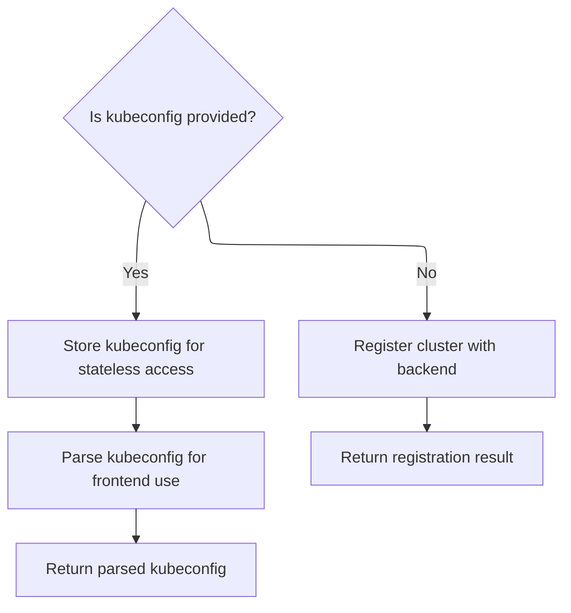

<SwmSnippet path="/frontend/src/lib/k8s/api/v1/clusterApi.ts" line="60">

---

SetCluster saves the kubeconfig in <SwmToken path="frontend/src/stateless/index.ts" pos="152:12:12" line-data="          console.log(&#39;Kubeconfig added to IndexedDB&#39;);">`IndexedDB`</SwmToken> using <SwmToken path="frontend/src/lib/k8s/api/v1/clusterApi.ts" pos="65:3:3" line-data="    await storeStatelessClusterKubeconfig(kubeconfig);">`storeStatelessClusterKubeconfig`</SwmToken>, then moves on to parsing and sending it to the frontend.

```typescript
export async function setCluster(clusterReq: ClusterRequest) {
  const kubeconfig = clusterReq.kubeconfig;
  const headers = addBackstageAuthHeaders(JSON_HEADERS);

  if (kubeconfig) {
    await storeStatelessClusterKubeconfig(kubeconfig);
    // We just send parsed kubeconfig from the backend to the frontend.
    return request(
      '/parseKubeConfig',
      {
        method: 'POST',
        body: JSON.stringify(clusterReq),
        headers: {
          ...headers,
        },
      },
      false,
      false
    );
  }

```

---

</SwmSnippet>

<SwmSnippet path="/frontend/src/stateless/index.ts" line="126">

---

StoreStatelessClusterKubeconfig saves the kubeconfig string in <SwmToken path="frontend/src/stateless/index.ts" pos="152:12:12" line-data="          console.log(&#39;Kubeconfig added to IndexedDB&#39;);">`IndexedDB`</SwmToken> under the 'kubeconfigs' database and <SwmToken path="frontend/src/stateless/index.ts" pos="143:13:13" line-data="        const transaction = db.transaction([&#39;kubeconfigStore&#39;], &#39;readwrite&#39;);">`kubeconfigStore`</SwmToken> object store. It handles database upgrades and errors, making sure the credentials are persisted for later use.

```typescript
export function storeStatelessClusterKubeconfig(kubeconfig: string): Promise<void> {
  return new Promise<void>(async (resolve, reject) => {
    const request = indexedDB.open('kubeconfigs', 1) as any;

    // The onupgradeneeded event is fired when the database is created for the first time.
    request.onupgradeneeded = handleDatabaseUpgrade;

    /** The onsuccess event is fired when the database is opened.
     * This event is where you specify the actions to take when the database is opened.
     * Once the database is opened, it creates a transaction and an object store.
     * The transaction is used to add the kubeconfig to the object store.
     * The object store is used to store the kubeconfig.
     * */
    request.onsuccess = function handleDatabaseSuccess(event: DatabaseEvent) {
      const db = event.target ? event.target.result : null;

      if (db) {
        const transaction = db.transaction(['kubeconfigStore'], 'readwrite');
        const store = transaction.objectStore('kubeconfigStore');

        const newItem = { kubeconfig: kubeconfig };
        const addRequest = store.add(newItem);

        // The onsuccess event is fired when the request has succeeded.
        // This is where you handle the results of the request.
        addRequest.onsuccess = function requestSuccess() {
          console.log('Kubeconfig added to IndexedDB');
          resolve(); // Resolve the promise when the kubeconfig is successfully added
        };

        // The onerror event is fired when the request has failed.
        // This is where you handle the error.
        addRequest.onerror = function requestError(event: Event) {
          const errorEvent = event as DatabaseErrorEvent;
          console.error(errorEvent.target ? errorEvent.target.error : 'An error occurred');
          reject(errorEvent.target ? errorEvent.target.error : 'An error occurred'); // Reject the promise on error
        };
      } else {
        console.error('Failed to open IndexedDB');
        reject('Failed to open IndexedDB');
      }
    };

    // The onerror event is fired when the database is opened.
    // This is where you handle errors.
    request.onerror = handleDataBaseError;
  });
}
```

---

</SwmSnippet>

<SwmSnippet path="/frontend/src/lib/k8s/api/v1/clusterApi.ts" line="81">

---

Back in <SwmToken path="frontend/src/plugin/lib.ts" pos="141:3:3" line-data="  static setCluster(clusterReq: ClusterRequest) {">`setCluster`</SwmToken> (<SwmPath>[frontend/…/v1/clusterApi.ts](frontend/src/lib/k8s/api/v1/clusterApi.ts)</SwmPath>), after saving the kubeconfig, we send a POST request to <SwmPath>[frontend/…/components/cluster/](frontend/src/components/cluster/)</SwmPath> with the cluster info. This step hands off to <SwmPath>[frontend/…/v1/clusterRequests.ts](frontend/src/lib/k8s/api/v1/clusterRequests.ts)</SwmPath> to actually make the network request and handle cluster-specific headers.

```typescript
  return request(
    '/cluster',
    {
      method: 'POST',
      body: JSON.stringify(clusterReq),
      headers: {
        ...headers,
        ...getHeadlampAPIHeaders(),
      },
    },
    false,
    false
  );
}
```

---

</SwmSnippet>

# Preparing Cluster Request

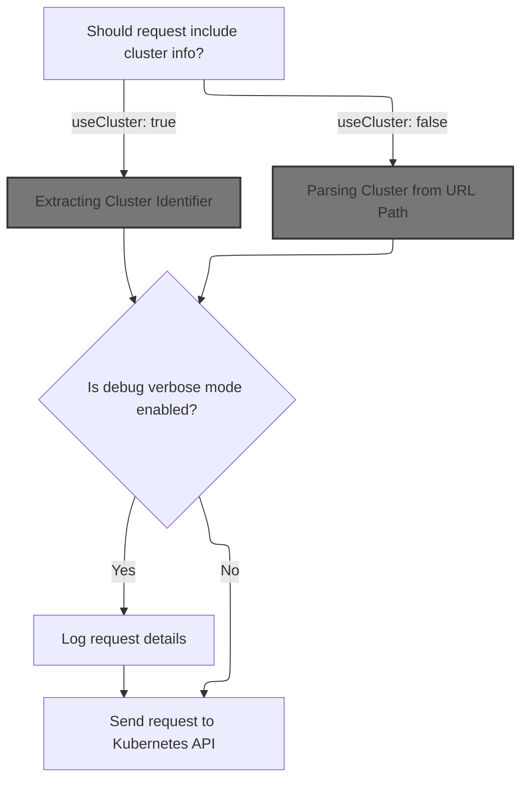

<SwmSnippet path="/frontend/src/lib/k8s/api/v1/clusterRequests.ts" line="94">

---

In request, we figure out which cluster to target by calling <SwmToken path="frontend/src/lib/k8s/api/v1/clusterRequests.ts" pos="102:12:12" line-data="  const cluster = (useCluster &amp;&amp; getCluster()) || &#39;&#39;;">`getCluster`</SwmToken>. This sets up the cluster context for the request, so we need to call <SwmPath>[frontend/…/lib/cluster.ts](frontend/src/lib/cluster.ts)</SwmPath> next to extract the cluster name from the URL.

```typescript
export async function request(
  path: string,
  params: RequestParams = {},
  autoLogoutOnAuthError: boolean = true,
  useCluster: boolean = true,
  queryParams?: QueryParameters
): Promise<any> {
  // @todo: This is a temporary way of getting the current cluster. We should improve it later.
  const cluster = (useCluster && getCluster()) || '';

```

---

</SwmSnippet>

## Extracting Cluster Identifier

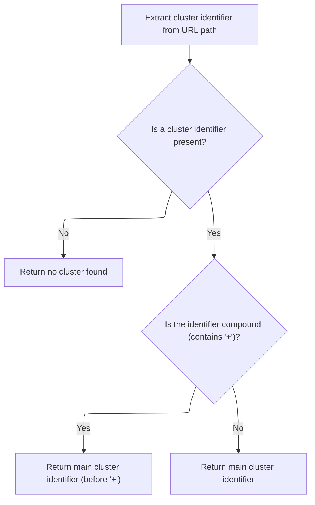

<SwmSnippet path="/frontend/src/lib/cluster.ts" line="46">

---

GetCluster extracts the cluster name from the URL, handling cases where extra info is appended with '+'. If there's no cluster string, it returns null. Next, we call <SwmToken path="frontend/src/lib/cluster.ts" pos="47:7:7" line-data="  const clusterString = getClusterPathParam(urlPath);">`getClusterPathParam`</SwmToken> to actually parse the cluster string from the URL path.

```typescript
export function getCluster(urlPath?: string): string | null {
  const clusterString = getClusterPathParam(urlPath);
  if (!clusterString) return null;

  if (clusterString.includes('+')) {
    return clusterString.split('+')[0];
  }
  return clusterString;
}
```

---

</SwmSnippet>

## Parsing Cluster from URL Path

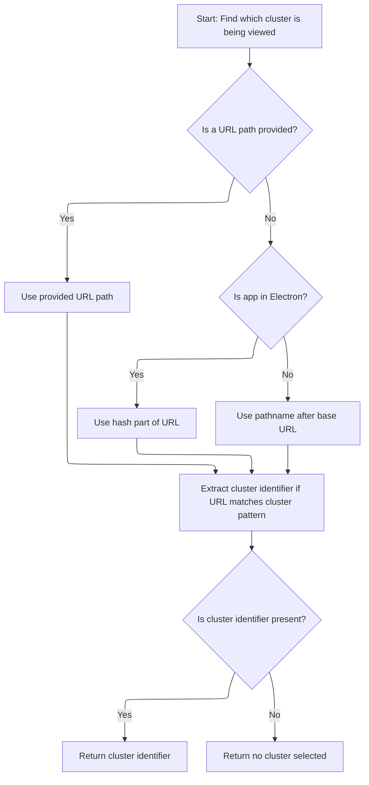

<SwmSnippet path="/frontend/src/lib/cluster.ts" line="57">

---

In <SwmToken path="frontend/src/lib/cluster.ts" pos="57:4:4" line-data="export function getClusterPathParam(maybeUrlPath?: string): string | undefined {">`getClusterPathParam`</SwmToken>, we grab the base URL to help strip out the app prefix from the current path. This lets us isolate the cluster part of the URL. We call <SwmToken path="frontend/src/lib/cluster.ts" pos="58:7:7" line-data="  const prefix = getBaseUrl();">`getBaseUrl`</SwmToken> next to get the right prefix for parsing.

```typescript
export function getClusterPathParam(maybeUrlPath?: string): string | undefined {
  const prefix = getBaseUrl();
```

---

</SwmSnippet>

<SwmSnippet path="/frontend/src/helpers/getBaseUrl.ts" line="38">

---

GetBaseUrl figures out the base URL for the app, handling Electron, global window properties, and environment variables. It normalizes certain values to empty string so routing works consistently across environments.

```typescript
export function getBaseUrl(): string {
  let baseUrl = '';
  if (isElectron()) {
    return '';
  }
  if (window?.headlampBaseUrl !== undefined) {
    baseUrl = window.headlampBaseUrl;
  } else {
    baseUrl = import.meta.env.PUBLIC_URL ? import.meta.env.PUBLIC_URL : '';
  }

  if (baseUrl === './' || baseUrl === '.' || baseUrl === '/') {
    baseUrl = '';
  }
  return baseUrl;
}
```

---

</SwmSnippet>

<SwmSnippet path="/frontend/src/lib/cluster.ts" line="59">

---

Back in <SwmToken path="frontend/src/lib/cluster.ts" pos="47:7:7" line-data="  const clusterString = getClusterPathParam(urlPath);">`getClusterPathParam`</SwmToken> (<SwmPath>[frontend/…/lib/cluster.ts](frontend/src/lib/cluster.ts)</SwmPath>), we use the base URL from <SwmToken path="frontend/src/lib/cluster.ts" pos="58:7:7" line-data="  const prefix = getBaseUrl();">`getBaseUrl`</SwmToken> to slice the pathname and then match the cluster param using <SwmToken path="frontend/src/lib/cluster.ts" pos="65:7:7" line-data="  const clusterURLMatch = matchPath&lt;{ cluster?: string }&gt;(urlPath, {">`matchPath`</SwmToken>. This lets us pull out the cluster identifier regardless of environment.

```typescript
  const urlPath =
    maybeUrlPath ??
    (isElectron()
      ? window.location.hash.substring(1)
      : window.location.pathname.slice(prefix.length));

  const clusterURLMatch = matchPath<{ cluster?: string }>(urlPath, {
    path: getClusterPrefixedPath(),
  });

  return clusterURLMatch?.params?.cluster;
}
```

---

</SwmSnippet>

## Debugging Cluster Request

<SwmSnippet path="/frontend/src/lib/k8s/api/v1/clusterRequests.ts" line="104">

---

Back in request (<SwmPath>[frontend/…/v1/clusterRequests.ts](frontend/src/lib/k8s/api/v1/clusterRequests.ts)</SwmPath>), we check if verbose debugging is enabled for this module using <SwmToken path="frontend/src/lib/k8s/api/v1/clusterRequests.ts" pos="104:4:4" line-data="  if (isDebugVerbose(&#39;k8s/apiProxy@request&#39;)) {">`isDebugVerbose`</SwmToken>. If so, we log the request details for easier troubleshooting. We call <SwmPath>[frontend/…/helpers/debugVerbose.ts](frontend/src/helpers/debugVerbose.ts)</SwmPath> next to decide if logging should happen.

```typescript
  if (isDebugVerbose('k8s/apiProxy@request')) {
    console.debug('k8s/apiProxy@request', { path, params, useCluster, queryParams });
  }

```

---

</SwmSnippet>

<SwmSnippet path="/frontend/src/helpers/debugVerbose.ts" line="76">

---

IsDebugVerbose checks if verbose debugging should be enabled for a module, using substring matching and environment variables. Setting <SwmToken path="frontend/src/helpers/debugVerbose.ts" pos="82:7:7" line-data="    import.meta.env.REACT_APP_DEBUG_VERBOSE === &#39;all&#39; ||">`REACT_APP_DEBUG_VERBOSE`</SwmToken> to 'all' enables logging everywhere.

```typescript
export function isDebugVerbose(modName: string): boolean {
  if (verboseModDebug.filter(mod => modName.indexOf(mod) > 0).length > 0) {
    return true;
  }

  return (
    import.meta.env.REACT_APP_DEBUG_VERBOSE === 'all' ||
    !!(
      import.meta.env.REACT_APP_DEBUG_VERBOSE &&
      import.meta.env.REACT_APP_DEBUG_VERBOSE?.indexOf(modName) !== -1
    )
  );
}
```

---

</SwmSnippet>

<SwmSnippet path="/frontend/src/lib/k8s/api/v1/clusterRequests.ts" line="108">

---

Back in request (<SwmPath>[frontend/…/v1/clusterRequests.ts](frontend/src/lib/k8s/api/v1/clusterRequests.ts)</SwmPath>), after handling debug logging, we call <SwmToken path="frontend/src/lib/k8s/api/v1/clusterRequests.ts" pos="108:3:3" line-data="  return clusterRequest(path, { cluster, autoLogoutOnAuthError, ...params }, queryParams);">`clusterRequest`</SwmToken> to build and send the actual request with cluster context and parameters.

```typescript
  return clusterRequest(path, { cluster, autoLogoutOnAuthError, ...params }, queryParams);
}
```

---

</SwmSnippet>

# Building Cluster-Specific Request

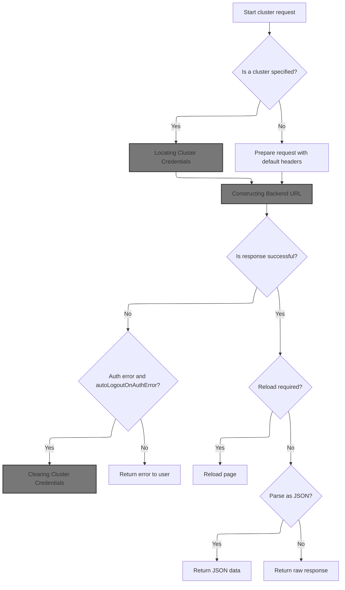

<SwmSnippet path="/frontend/src/lib/k8s/api/v1/clusterRequests.ts" line="122">

---

In <SwmToken path="frontend/src/lib/k8s/api/v1/clusterRequests.ts" pos="122:6:6" line-data="export async function clusterRequest(">`clusterRequest`</SwmToken>, if a cluster is specified, we fetch its kubeconfig from <SwmToken path="frontend/src/stateless/index.ts" pos="152:12:12" line-data="          console.log(&#39;Kubeconfig added to IndexedDB&#39;);">`IndexedDB`</SwmToken> and add it to the headers, along with the user ID. We also build the full request URL with cluster prefix and query params. We call <SwmToken path="frontend/src/lib/k8s/api/v1/clusterRequests.ts" pos="148:9:9" line-data="    const kubeconfig = await findKubeconfigByClusterName(cluster);">`findKubeconfigByClusterName`</SwmToken> next to get the right kubeconfig.

```typescript
export async function clusterRequest(
  path: string,
  params: ClusterRequestParams = {},
  queryParams?: QueryParameters
): Promise<any> {
  interface RequestHeaders {
    Authorization?: string;
    cluster?: string;
    autoLogoutOnAuthError?: boolean;
    [otherHeader: string]: any;
  }

  const {
    timeout = DEFAULT_TIMEOUT,
    cluster: paramsCluster,
    autoLogoutOnAuthError = true,
    isJSON = true,
    ...otherParams
  } = params;

  const userID = getUserIdFromLocalStorage();
  const opts: { headers: RequestHeaders } = Object.assign({ headers: {} }, otherParams);
  const cluster = paramsCluster || '';

  let fullPath = path;
  if (cluster) {
    const kubeconfig = await findKubeconfigByClusterName(cluster);
    if (kubeconfig !== null) {
      opts.headers['KUBECONFIG'] = kubeconfig;
      opts.headers['X-HEADLAMP-USER-ID'] = userID;
    }

    fullPath = combinePath(`/${CLUSTERS_PREFIX}/${cluster}`, path);
  }

```

---

</SwmSnippet>

## Locating Cluster Credentials

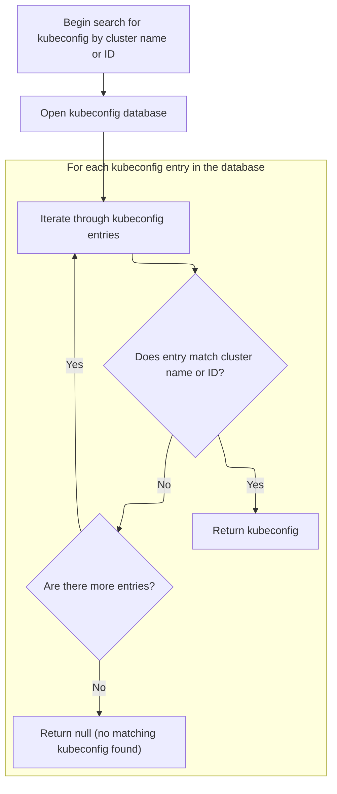

<SwmSnippet path="/frontend/src/stateless/findKubeconfigByClusterName.ts" line="36">

---

FindKubeconfigByClusterName opens <SwmToken path="frontend/src/stateless/index.ts" pos="152:12:12" line-data="          console.log(&#39;Kubeconfig added to IndexedDB&#39;);">`IndexedDB`</SwmToken>, decodes and parses each kubeconfig, and uses <SwmToken path="frontend/src/stateless/findKubeconfigByClusterName.ts" pos="70:14:14" line-data="            const { matchingKubeconfig, matchingContext } = findMatchingContexts(">`findMatchingContexts`</SwmToken> to check for a match. If found, it resolves with the kubeconfig string; otherwise, it keeps searching.

```typescript
export function findKubeconfigByClusterName(
  /** The name of the cluster to find */
  clusterName: string,
  /** The ID for a cluster, composed of the kubeconfig path and cluster name */
  clusterID?: string
): Promise<string | null> {
  return new Promise<string | null>(async (resolve, reject) => {
    try {
      const request = indexedDB.open('kubeconfigs', 1) as any;

      // The onupgradeneeded event is fired when the database is created for the first time.
      request.onupgradeneeded = handleDatabaseUpgrade;

      // The onsuccess event is fired when the database is opened.
      // This event is where you specify the actions to take when the database is opened.
      request.onsuccess = function handleDatabaseSuccess(event: DatabaseEvent) {
        const db = event.target.result;
        const transaction = db.transaction(['kubeconfigStore'], 'readonly');
        const store = transaction.objectStore('kubeconfigStore');

        // The onsuccess event is fired when the request has succeeded.
        // This is where you handle the results of the request.
        // The result is the cursor. It is used to iterate through the object store.
        // The cursor is null when there are no more objects to iterate through.
        // The cursor is used to find the kubeconfig by cluster name.
        store.openCursor().onsuccess = function storeSuccess(event: Event) {
          const successEvent = event as CursorSuccessEvent;
          const cursor = successEvent.target.result;
          if (cursor) {
            const kubeconfigObject = cursor.value;
            const kubeconfig = kubeconfigObject.kubeconfig;

            const parsedKubeconfig = jsyaml.load(atob(kubeconfig)) as KubeconfigObject;
            // Check for "headlamp_info" in extensions
            const { matchingKubeconfig, matchingContext } = findMatchingContexts(
              clusterName,
              parsedKubeconfig,
              clusterID
            );

```

---

</SwmSnippet>

<SwmSnippet path="/frontend/src/stateless/index.ts" line="236">

---

FindMatchingContexts checks for matching cluster contexts by <SwmToken path="frontend/src/stateless/index.ts" pos="239:1:1" line-data="  clusterID?: string">`clusterID`</SwmToken> (for <SwmToken path="frontend/src/lib/k8s/api/v1/clusterApi.ts" pos="99:33:35" line-data=" * Note: Currently, the use for the optional clusterID is only for the clusterID for non-dynamic clusters.">`non-dynamic`</SwmToken> clusters) or by clusterName/customName in extensions. It returns both the matching context and kubeconfig if found.

```typescript
export function findMatchingContexts(
  clusterName: string,
  parsedKubeconfig: KubeconfigObject,
  clusterID?: string
) {
  let matchingContext;
  let matchingKubeconfig;

  // Note: currently clusterID is being used for non dynamic clusters only
  if (clusterID) {
    // Find source for the kubeconfig
    const source = parsedKubeconfig.contexts.find(
      context => context.context.clusterID === clusterID
    )?.context.source;

    // Find the context with the matching clusterID
    if (source === 'kubeconfig') {
      matchingKubeconfig = parsedKubeconfig.contexts.find(
        context => context.context.clusterID === clusterID
      );
    }
  } else {
    // Find the context with the matching cluster name or custom name in headlamp_info
    matchingContext = parsedKubeconfig.contexts.find(
      context =>
        context.name === clusterName ||
        context.context.extensions?.find(extension => extension.name === 'headlamp_info')?.extension
          .customName === clusterName
    );

    matchingKubeconfig = parsedKubeconfig.contexts.find(context => context.name === clusterName);
  }

  return { matchingKubeconfig, matchingContext };
}
```

---

</SwmSnippet>

<SwmSnippet path="/frontend/src/stateless/findKubeconfigByClusterName.ts" line="76">

---

Back in <SwmToken path="frontend/src/lib/k8s/api/v1/clusterRequests.ts" pos="148:9:9" line-data="    const kubeconfig = await findKubeconfigByClusterName(cluster);">`findKubeconfigByClusterName`</SwmToken>, after calling <SwmToken path="frontend/src/stateless/index.ts" pos="236:4:4" line-data="export function findMatchingContexts(">`findMatchingContexts`</SwmToken>, we resolve with the kubeconfig if a match is found, otherwise keep searching. If nothing matches, we resolve with null.

```typescript
            if (matchingKubeconfig || matchingContext) {
              resolve(kubeconfig);
            } else {
              cursor.continue();
            }
          } else {
            resolve(null); // No matching kubeconfig found
          }
        };
      };

      // The onerror event is fired when the database is opened.
      // This is where you handle errors.
      request.onerror = handleDataBaseError;
    } catch (error) {
      reject(error);
    }
  });
}
```

---

</SwmSnippet>

## Sending Cluster Request

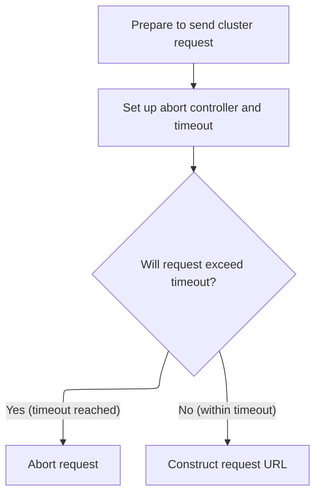

<SwmSnippet path="/frontend/src/lib/k8s/api/v1/clusterRequests.ts" line="157">

---

Back in <SwmToken path="frontend/src/lib/k8s/api/v1/clusterRequests.ts" pos="108:3:3" line-data="  return clusterRequest(path, { cluster, autoLogoutOnAuthError, ...params }, queryParams);">`clusterRequest`</SwmToken>, after getting the kubeconfig, we set up an <SwmToken path="frontend/src/lib/k8s/api/v1/clusterRequests.ts" pos="157:9:9" line-data="  const controller = new AbortController();">`AbortController`</SwmToken> to handle timeouts and build the request URL using <SwmToken path="frontend/src/lib/k8s/api/v1/clusterRequests.ts" pos="160:9:9" line-data="  let url = combinePath(getAppUrl(), fullPath);">`getAppUrl`</SwmToken>. This keeps requests from hanging too long.

```typescript
  const controller = new AbortController();
  const id = setTimeout(() => controller.abort(), timeout);

  let url = combinePath(getAppUrl(), fullPath);
```

---

</SwmSnippet>

## Constructing Backend URL

```mermaid
%%{init: {"flowchart": {"defaultRenderer": "elk"}} }%%
flowchart TD
  node1["Start: Decide backend connection"] --> node2{"Is Electron?"}
  click node1 openCode "frontend/src/helpers/getAppUrl.ts:43:48"
  node2 -->|"Yes"| node3["Use custom backend port if provided, connect to localhost"]
  click node2 openCode "frontend/src/helpers/getAppUrl.ts:48:53"
  node2 -->|"No"| node4{"Is Dev Mode?"}
  node3 --> node4
  node4 -->|"Yes"| node5["Connect to localhost"]
  click node4 openCode "frontend/src/helpers/getAppUrl.ts:55:57"
  node4 -->|"No"| node6{"Is Docker Desktop?"}
  node5 --> node6
  node6 -->|"Yes"| node7["Use Docker backend port, connect to localhost"]
  click node6 openCode "frontend/src/helpers/getAppUrl.ts:59:62"
  node6 -->|"No"| node8{"Should use localhost?"}
  node7 --> node8
  node8 -->|"Yes"| node9["Set url to http://localhost:{backendPort}"]
  click node8 openCode "frontend/src/helpers/getAppUrl.ts:64:66"
  node8 -->|"No"| node10["Set url to browser origin"]
  click node10 openCode "frontend/src/helpers/getAppUrl.ts:67:68"
  node9 --> node11["Append baseUrl and return url"]
  click node11 openCode "frontend/src/helpers/getAppUrl.ts:70:74"
  node10 --> node11
classDef HeadingStyle fill:#777777,stroke:#333,stroke-width:2px;

%% Swimm:
%% %%{init: {"flowchart": {"defaultRenderer": "elk"}} }%%
%% flowchart TD
%%   node1["Start: Decide backend connection"] --> node2{"Is Electron?"}
%%   click node1 openCode "<SwmPath>[frontend/…/helpers/getAppUrl.ts](frontend/src/helpers/getAppUrl.ts)</SwmPath>:43:48"
%%   node2 -->|"Yes"| node3["Use custom backend port if provided, connect to localhost"]
%%   click node2 openCode "<SwmPath>[frontend/…/helpers/getAppUrl.ts](frontend/src/helpers/getAppUrl.ts)</SwmPath>:48:53"
%%   node2 -->|"No"| node4{"Is Dev Mode?"}
%%   node3 --> node4
%%   node4 -->|"Yes"| node5["Connect to localhost"]
%%   click node4 openCode "<SwmPath>[frontend/…/helpers/getAppUrl.ts](frontend/src/helpers/getAppUrl.ts)</SwmPath>:55:57"
%%   node4 -->|"No"| node6{"Is Docker Desktop?"}
%%   node5 --> node6
%%   node6 -->|"Yes"| node7["Use Docker backend port, connect to localhost"]
%%   click node6 openCode "<SwmPath>[frontend/…/helpers/getAppUrl.ts](frontend/src/helpers/getAppUrl.ts)</SwmPath>:59:62"
%%   node6 -->|"No"| node8{"Should use localhost?"}
%%   node7 --> node8
%%   node8 -->|"Yes"| node9["Set url to http://localhost:<SwmToken path="frontend/src/helpers/getAppUrl.ts" pos="65:10:11" line-data="    url = `http://localhost:${backendPort}`;">`{backendPort`</SwmToken>}"]
%%   click node8 openCode "<SwmPath>[frontend/…/helpers/getAppUrl.ts](frontend/src/helpers/getAppUrl.ts)</SwmPath>:64:66"
%%   node8 -->|"No"| node10["Set url to browser origin"]
%%   click node10 openCode "<SwmPath>[frontend/…/helpers/getAppUrl.ts](frontend/src/helpers/getAppUrl.ts)</SwmPath>:67:68"
%%   node9 --> node11["Append <SwmToken path="frontend/src/helpers/getBaseUrl.ts" pos="39:3:3" line-data="  let baseUrl = &#39;&#39;;">`baseUrl`</SwmToken> and return url"]
%%   click node11 openCode "<SwmPath>[frontend/…/helpers/getAppUrl.ts](frontend/src/helpers/getAppUrl.ts)</SwmPath>:70:74"
%%   node10 --> node11
%% classDef HeadingStyle fill:#777777,stroke:#333,stroke-width:2px;
```

<SwmSnippet path="/frontend/src/helpers/getAppUrl.ts" line="43">

---

GetAppUrl builds the backend URL based on environment checks, picking the right port and localhost usage for Electron, Docker Desktop, or dev mode. We call <SwmToken path="frontend/src/helpers/getAppUrl.ts" pos="70:7:7" line-data="  const baseUrl = getBaseUrl();">`getBaseUrl`</SwmToken> next to append the app prefix.

```typescript
export function getAppUrl(): string {
  let url = '';
  let backendPort = 4466;
  let useLocalhost = false;

  if (isElectron()) {
    if (window?.headlampBackendPort) {
      backendPort = window.headlampBackendPort;
    }
    useLocalhost = true;
  }

  if (isDevMode()) {
    useLocalhost = true;
  }

  if (isDockerDesktop()) {
    backendPort = 64446;
    useLocalhost = true;
  }

  if (useLocalhost) {
    url = `http://localhost:${backendPort}`;
  } else {
    url = window.location.origin;
  }

  const baseUrl = getBaseUrl();
```

---

</SwmSnippet>

<SwmSnippet path="/frontend/src/helpers/getAppUrl.ts" line="71">

---

Back in <SwmToken path="frontend/src/lib/k8s/api/v1/clusterRequests.ts" pos="160:9:9" line-data="  let url = combinePath(getAppUrl(), fullPath);">`getAppUrl`</SwmToken>, we append the base URL from <SwmToken path="frontend/src/lib/cluster.ts" pos="58:7:7" line-data="  const prefix = getBaseUrl();">`getBaseUrl`</SwmToken> to the backend URL, making sure it ends with a slash for consistent routing.

```typescript
  url += baseUrl ? baseUrl + '/' : '/';

  return url;
}
```

---

</SwmSnippet>

## Handling Cluster Request Response

```mermaid
%%{init: {"flowchart": {"defaultRenderer": "elk"}} }%%
flowchart TD
  node1["Prepare request (add Backstage auth headers if needed) and send to cluster API"]
  click node1 openCode "frontend/src/lib/k8s/api/v1/clusterRequests.ts:161:172"
  node1 --> node2{"Did backend signal reload? (X-Reload)"}
  click node2 openCode "frontend/src/lib/k8s/api/v1/clusterRequests.ts:185:188"
  node2 -->|"Yes"| node3["Reload page"]
  click node3 openCode "frontend/src/lib/k8s/api/v1/clusterRequests.ts:187:188"
  node3 --> node6["End"]
  node2 -->|"No"| node4{"Was response successful?"}
  click node4 openCode "frontend/src/lib/k8s/api/v1/clusterRequests.ts:190:195"
  node4 -->|"No"| node5{"Logout on auth error? (status 401, autoLogoutOnAuthError)"}
  click node5 openCode "frontend/src/lib/k8s/api/v1/clusterRequests.ts:192:195"
  node5 -->|"Yes"| node7["Logout user"]
  click node7 openCode "frontend/src/lib/k8s/api/v1/clusterRequests.ts:194:195"
  node7 --> node6["End"]
  node5 -->|"No"| node6["End"]
  node4 -->|"Yes"| node6["End"]
classDef HeadingStyle fill:#777777,stroke:#333,stroke-width:2px;

%% Swimm:
%% %%{init: {"flowchart": {"defaultRenderer": "elk"}} }%%
%% flowchart TD
%%   node1["Prepare request (add Backstage auth headers if needed) and send to cluster API"]
%%   click node1 openCode "<SwmPath>[frontend/…/v1/clusterRequests.ts](frontend/src/lib/k8s/api/v1/clusterRequests.ts)</SwmPath>:161:172"
%%   node1 --> node2{"Did backend signal reload? (<SwmToken path="frontend/src/lib/k8s/api/v1/clusterRequests.ts" pos="185:14:16" line-data="  const headerVal = response.headers.get(&#39;X-Reload&#39;);">`X-Reload`</SwmToken>)"}
%%   click node2 openCode "<SwmPath>[frontend/…/v1/clusterRequests.ts](frontend/src/lib/k8s/api/v1/clusterRequests.ts)</SwmPath>:185:188"
%%   node2 -->|"Yes"| node3["Reload page"]
%%   click node3 openCode "<SwmPath>[frontend/…/v1/clusterRequests.ts](frontend/src/lib/k8s/api/v1/clusterRequests.ts)</SwmPath>:187:188"
%%   node3 --> node6["End"]
%%   node2 -->|"No"| node4{"Was response successful?"}
%%   click node4 openCode "<SwmPath>[frontend/…/v1/clusterRequests.ts](frontend/src/lib/k8s/api/v1/clusterRequests.ts)</SwmPath>:190:195"
%%   node4 -->|"No"| node5{"Logout on auth error? (status 401, <SwmToken path="frontend/src/lib/k8s/api/v1/clusterRequests.ts" pos="97:1:1" line-data="  autoLogoutOnAuthError: boolean = true,">`autoLogoutOnAuthError`</SwmToken>)"}
%%   click node5 openCode "<SwmPath>[frontend/…/v1/clusterRequests.ts](frontend/src/lib/k8s/api/v1/clusterRequests.ts)</SwmPath>:192:195"
%%   node5 -->|"Yes"| node7["Logout user"]
%%   click node7 openCode "<SwmPath>[frontend/…/v1/clusterRequests.ts](frontend/src/lib/k8s/api/v1/clusterRequests.ts)</SwmPath>:194:195"
%%   node7 --> node6["End"]
%%   node5 -->|"No"| node6["End"]
%%   node4 -->|"Yes"| node6["End"]
%% classDef HeadingStyle fill:#777777,stroke:#333,stroke-width:2px;
```

<SwmSnippet path="/frontend/src/lib/k8s/api/v1/clusterRequests.ts" line="161">

---

Back in <SwmToken path="frontend/src/lib/k8s/api/v1/clusterRequests.ts" pos="108:3:3" line-data="  return clusterRequest(path, { cluster, autoLogoutOnAuthError, ...params }, queryParams);">`clusterRequest`</SwmToken>, after sending the request, we check for <SwmToken path="frontend/src/lib/k8s/api/v1/clusterRequests.ts" pos="185:14:16" line-data="  const headerVal = response.headers.get(&#39;X-Reload&#39;);">`X-Reload`</SwmToken> in the response to trigger a page reload if needed. If we get a 401 and had an Authorization header, we call logout to clear cluster credentials.

```typescript
  url += asQuery(queryParams);
  const requestData = {
    signal: controller.signal,
    credentials: 'include' as RequestCredentials,
    ...opts,
  };
  if (isBackstage()) {
    requestData.headers = addBackstageAuthHeaders(requestData.headers);
  }
  let response: Response = new Response(undefined, { status: 502, statusText: 'Unreachable' });
  try {
    response = await fetch(url, requestData);
  } catch (err) {
    if (err instanceof Error) {
      if (err.name === 'AbortError') {
        response = new Response(undefined, { status: 408, statusText: 'Request timed-out' });
      }
    }
  } finally {
    clearTimeout(id);
  }

  // The backend signals through this header that it wants a reload.
  // See plugins.go
  const headerVal = response.headers.get('X-Reload');
  if (headerVal && headerVal.indexOf('reload') !== -1) {
    window.location.reload();
  }

  if (!response.ok) {
    const { status, statusText } = response;
    if (autoLogoutOnAuthError && status === 401 && opts.headers.Authorization) {
      console.error('Logging out due to auth error', { status, statusText, path });
      logout(cluster);
    }

```

---

</SwmSnippet>

## Clearing Cluster Credentials

<SwmSnippet path="/frontend/src/lib/auth.ts" line="131">

---

Logout clears the cluster's token by calling <SwmToken path="frontend/src/lib/auth.ts" pos="132:3:3" line-data="  return setToken(cluster, null).then(() =&gt; {">`setToken`</SwmToken> with null, then removes related queries from the cache to clean up any stale auth data.

```typescript
export async function logout(cluster: string) {
  return setToken(cluster, null).then(() => {
    queryClient.removeQueries({ queryKey: ['auth'], exact: false });
    queryClient.removeQueries({ queryKey: ['clusterMe', cluster], exact: true });
  });
}
```

---

</SwmSnippet>

## Updating Cluster Token

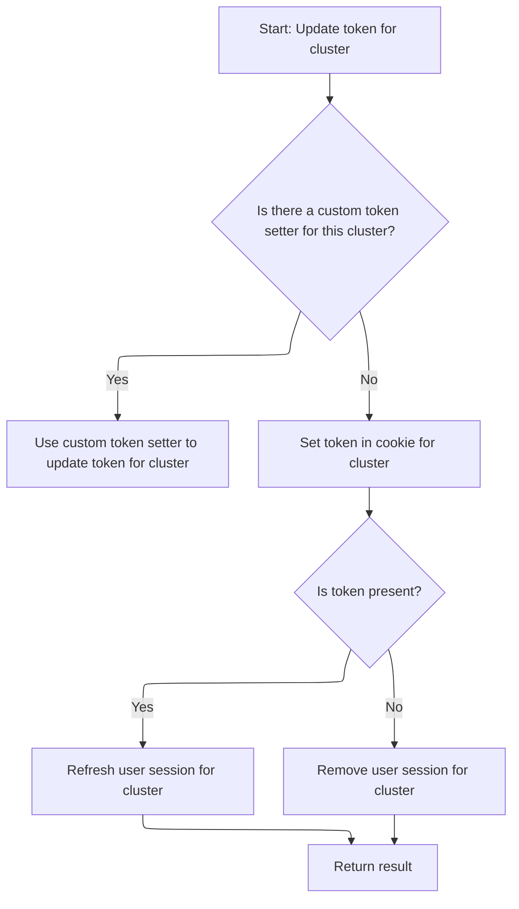

<SwmSnippet path="/frontend/src/lib/auth.ts" line="108">

---

SetToken checks for an override function to set the token; if none, it uses <SwmToken path="frontend/src/lib/auth.ts" pos="114:3:3" line-data="  return setCookieToken(cluster, token).then(result =&gt; {">`setCookieToken`</SwmToken>. It also updates or removes cluster queries in the cache based on whether the token is present.

```typescript
export function setToken(cluster: string, token: string | null) {
  const setTokenMethodToUse = store.getState().ui.functionsToOverride.setToken;
  if (setTokenMethodToUse) {
    return Promise.resolve(setTokenMethodToUse(cluster, token));
  }

  return setCookieToken(cluster, token).then(result => {
    if (token) {
      queryClient.invalidateQueries({ queryKey: ['clusterMe', cluster], exact: true });
    } else {
      queryClient.removeQueries({ queryKey: ['clusterMe', cluster], exact: true });
    }

    return result;
  });
}
```

---

</SwmSnippet>

## Setting Token Cookie

<SwmSnippet path="/frontend/src/lib/auth.ts" line="79">

---

SetCookieToken sends a POST request to the backend to set the token for the cluster, using <SwmToken path="frontend/src/lib/auth.ts" pos="81:9:9" line-data="    const response = await backendFetch(`/clusters/${cluster}/set-token`, {">`backendFetch`</SwmToken> to handle the network call and error handling.

```typescript
async function setCookieToken(cluster: string, token: string | null) {
  try {
    const response = await backendFetch(`/clusters/${cluster}/set-token`, {
      method: 'POST',
      headers: {
        'Content-Type': 'application/json',
        ...getHeadlampAPIHeaders(),
      },
      body: JSON.stringify({ token }),
    });

    if (!response.ok) {
      throw new Error(`Failed to set cookie token`);
    }
    return true;
  } catch (error) {
    console.error('Error setting cookie token:', error);
    throw error;
  }
}
```

---

</SwmSnippet>

## Sending Authenticated Backend Request

```mermaid
%%{init: {"flowchart": {"defaultRenderer": "elk"}} }%%
flowchart TD
    node1["Prepare and send backend request with authentication"] --> node2{"Does backend response include 'X-Reload: reload'?"}
    click node1 openCode "frontend/src/lib/k8s/api/v2/fetch.ts:38:42"
    node2 -->|"Yes"| node3["Reload the page"]
    click node2 openCode "frontend/src/lib/k8s/api/v2/fetch.ts:46:49"
    node2 -->|"No"| node4{"Is backend response successful?"}
    click node3 openCode "frontend/src/lib/k8s/api/v2/fetch.ts:48:49"
    node4 -->|"Yes"| node5["Return backend response"]
    click node4 openCode "frontend/src/lib/k8s/api/v2/fetch.ts:62:63"
    node4 -->|"No"| node6["Try to extract error message from backend"]
    click node6 openCode "frontend/src/lib/k8s/api/v2/fetch.ts:53:57"
    node6 --> node7{"Was error message found?"}
    click node7 openCode "frontend/src/lib/k8s/api/v2/fetch.ts:56:57"
    node7 -->|"Yes"| node8["Return business error with backend message"]
    click node8 openCode "frontend/src/lib/k8s/api/v2/fetch.ts:59:60"
    node7 -->|"No"| node9["Return business error with default message"]
    click node9 openCode "frontend/src/lib/k8s/api/v2/fetch.ts:59:60"

classDef HeadingStyle fill:#777777,stroke:#333,stroke-width:2px;

%% Swimm:
%% %%{init: {"flowchart": {"defaultRenderer": "elk"}} }%%
%% flowchart TD
%%     node1["Prepare and send backend request with authentication"] --> node2{"Does backend response include '<SwmToken path="frontend/src/lib/k8s/api/v1/clusterRequests.ts" pos="185:14:16" line-data="  const headerVal = response.headers.get(&#39;X-Reload&#39;);">`X-Reload`</SwmToken>: reload'?"}
%%     click node1 openCode "<SwmPath>[frontend/…/v2/fetch.ts](frontend/src/lib/k8s/api/v2/fetch.ts)</SwmPath>:38:42"
%%     node2 -->|"Yes"| node3["Reload the page"]
%%     click node2 openCode "<SwmPath>[frontend/…/v2/fetch.ts](frontend/src/lib/k8s/api/v2/fetch.ts)</SwmPath>:46:49"
%%     node2 -->|"No"| node4{"Is backend response successful?"}
%%     click node3 openCode "<SwmPath>[frontend/…/v2/fetch.ts](frontend/src/lib/k8s/api/v2/fetch.ts)</SwmPath>:48:49"
%%     node4 -->|"Yes"| node5["Return backend response"]
%%     click node4 openCode "<SwmPath>[frontend/…/v2/fetch.ts](frontend/src/lib/k8s/api/v2/fetch.ts)</SwmPath>:62:63"
%%     node4 -->|"No"| node6["Try to extract error message from backend"]
%%     click node6 openCode "<SwmPath>[frontend/…/v2/fetch.ts](frontend/src/lib/k8s/api/v2/fetch.ts)</SwmPath>:53:57"
%%     node6 --> node7{"Was error message found?"}
%%     click node7 openCode "<SwmPath>[frontend/…/v2/fetch.ts](frontend/src/lib/k8s/api/v2/fetch.ts)</SwmPath>:56:57"
%%     node7 -->|"Yes"| node8["Return business error with backend message"]
%%     click node8 openCode "<SwmPath>[frontend/…/v2/fetch.ts](frontend/src/lib/k8s/api/v2/fetch.ts)</SwmPath>:59:60"
%%     node7 -->|"No"| node9["Return business error with default message"]
%%     click node9 openCode "<SwmPath>[frontend/…/v2/fetch.ts](frontend/src/lib/k8s/api/v2/fetch.ts)</SwmPath>:59:60"
%% 
%% classDef HeadingStyle fill:#777777,stroke:#333,stroke-width:2px;
```

<SwmSnippet path="/frontend/src/lib/k8s/api/v2/fetch.ts" line="38">

---

BackendFetch sets up the fetch request to always include credentials and adds auth headers. It builds the full backend URL using <SwmToken path="frontend/src/lib/k8s/api/v2/fetch.ts" pos="42:14:14" line-data="  const response = await fetch(makeUrl([getAppUrl(), url]), init);">`getAppUrl`</SwmToken> and <SwmToken path="frontend/src/lib/k8s/api/v2/fetch.ts" pos="42:11:11" line-data="  const response = await fetch(makeUrl([getAppUrl(), url]), init);">`makeUrl`</SwmToken> before sending the request.

```typescript
export async function backendFetch(url: string | URL, init: RequestInit = {}) {
  // Always include credentials
  init.credentials = 'include';
  init.headers = addBackstageAuthHeaders(init.headers);
  const response = await fetch(makeUrl([getAppUrl(), url]), init);

```

---

</SwmSnippet>

<SwmSnippet path="/frontend/src/lib/k8s/api/v2/fetch.ts" line="44">

---

Back in <SwmToken path="frontend/src/lib/auth.ts" pos="81:9:9" line-data="    const response = await backendFetch(`/clusters/${cluster}/set-token`, {">`backendFetch`</SwmToken>, after getting the response, we reload the page if <SwmToken path="frontend/src/lib/k8s/api/v2/fetch.ts" pos="46:14:16" line-data="  const headerVal = response.headers.get(&#39;X-Reload&#39;);">`X-Reload`</SwmToken> is set. If the response isn't ok, we parse the error and throw an <SwmToken path="frontend/src/lib/k8s/api/v2/fetch.ts" pos="59:5:5" line-data="    throw new ApiError(maybeErrorMessage ?? &#39;Unreachable&#39;, { status: response.status });">`ApiError`</SwmToken> for better error handling.

```typescript
  // The backend signals through this header that it wants a reload.
  // See plugins.go
  const headerVal = response.headers.get('X-Reload');
  if (headerVal && headerVal.indexOf('reload') !== -1) {
    window.location.reload();
  }

  if (!response.ok) {
    // Try to parse error message from response
    let maybeErrorMessage: string | undefined;
    try {
      const body = await response.json();
      maybeErrorMessage = typeof body === 'string' ? body : body.message;
    } catch (e) {}

    throw new ApiError(maybeErrorMessage ?? 'Unreachable', { status: response.status });
  }

  return response;
}
```

---

</SwmSnippet>

## Handling Cluster Request Errors

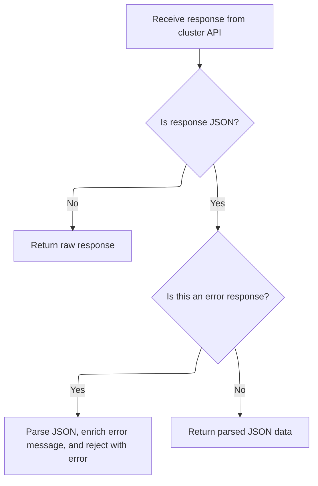

<SwmSnippet path="/frontend/src/lib/k8s/api/v1/clusterRequests.ts" line="197">

---

After coming back from logout in <SwmToken path="frontend/src/lib/k8s/api/v1/clusterRequests.ts" pos="108:3:3" line-data="  return clusterRequest(path, { cluster, autoLogoutOnAuthError, ...params }, queryParams);">`clusterRequest`</SwmToken> (<SwmPath>[frontend/…/v1/clusterRequests.ts](frontend/src/lib/k8s/api/v1/clusterRequests.ts)</SwmPath>), here we handle error responses. If the response is JSON, we try to parse and append the error message. If parsing fails, we log the error and continue. We then reject with an <SwmToken path="frontend/src/lib/k8s/api/v1/clusterRequests.ts" pos="213:16:16" line-data="    const error = new Error(message) as ApiError;">`ApiError`</SwmToken> containing the status and message, so the calling code can handle it (like showing an error to the user or triggering a re-auth flow). Non-JSON errors are just returned as-is, and successful JSON responses are parsed and returned.

```typescript
    let message = statusText;
    try {
      if (isJSON) {
        const json = await response.json();
        message += ` - ${json.message}`;
      }
    } catch (err) {
      console.error(
        'Unable to parse error json at url:',
        url,
        { err },
        'with request data:',
        requestData
      );
    }

    const error = new Error(message) as ApiError;
    error.status = status;
    return Promise.reject(error);
  }

  if (!isJSON) {
    return Promise.resolve(response);
  }

  return response.json();
}
```

---

</SwmSnippet>

&nbsp;

*This is an auto-generated document by Swimm 🌊 and has not yet been verified by a human*

<SwmMeta version="3.0.0" repo-id="Z2l0aHViJTNBJTNBdHlwZXNjcmlwdC1oZWFkbGFtcCUzQSUzQXJpY2FyZG9sb3Blemc=" repo-name="typescript-headlamp"><sup>Powered by [Swimm](https://app.swimm.io/)</sup></SwmMeta>
