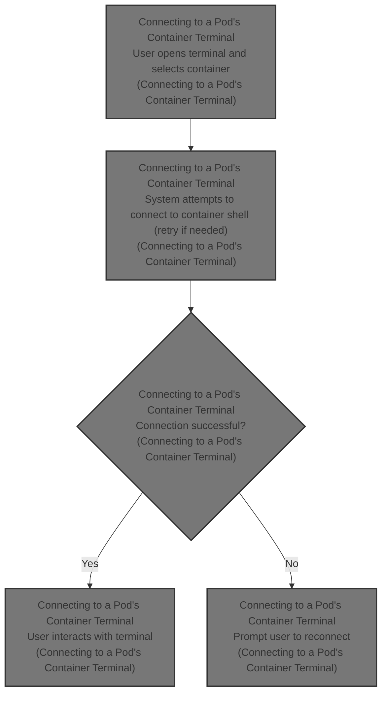

This document describes the flow for connecting to a pod's container terminal. Users open the terminal interface, select a container, and interact with its shell. The system determines available shells and manages connection attempts, enabling users to perform container management tasks.



# Connecting to a Pod's Container Terminal

```mermaid
%%{init: {"flowchart": {"defaultRenderer": "elk"}} }%%
flowchart TD
  node1["User opens terminal interface"] --> node2["Select target container"]
  click node1 openCode "frontend/src/components/common/Terminal.tsx:60:61"
  click node2 openCode "frontend/src/components/common/Terminal.tsx:425:465"
  node2 --> node15["Determine available shells based on container OS"]
  click node15 openCode "frontend/src/components/common/Terminal.tsx:357:366"
  node15 --> node3{"Attach mode?"}
  node3 -->|"Yes"| node4["Attach to container process"]
  node3 -->|"No"| node5["Execute shell command in container"]
  click node3 openCode "frontend/src/components/common/Terminal.tsx:297:318"
  click node4 openCode "frontend/src/components/common/Terminal.tsx:303:307"
  click node5 openCode "frontend/src/components/common/Terminal.tsx:313:317"
  node4 --> node6["Initialize terminal"]
  node5 --> node6
  click node6 openCode "frontend/src/components/common/Terminal.tsx:78:143"
  node6 --> node7{"Shell connection failed?"}
  click node7 openCode "frontend/src/components/common/Terminal.tsx:236:255"
  node7 -->|"Yes"| node8{"More shells available?"}
  node8 -->|"Yes"| node9["Try next shell"]
  node8 -->|"No"| node10["Show error and reconnect option"]
  click node9 openCode "frontend/src/components/common/Terminal.tsx:219:226"
  click node10 openCode "frontend/src/components/common/Terminal.tsx:239:250"
  node7 -->|"No"| node11["User interacts with terminal"]
  click node11 openCode "frontend/src/components/common/Terminal.tsx:86:143"
  node11 --> node12{"Show dialog?"}
  node12 -->|"Yes"| node13["Display terminal in dialog"]
  node12 -->|"No"| node14["Display terminal embedded"]
  click node13 openCode "frontend/src/components/common/Terminal.tsx:493:510"
  click node14 openCode "frontend/src/components/common/Terminal.tsx:405:490"

classDef HeadingStyle fill:#777777,stroke:#333,stroke-width:2px;

%% Swimm:
%% %%{init: {"flowchart": {"defaultRenderer": "elk"}} }%%
%% flowchart TD
%%   node1["User opens terminal interface"] --> node2["Select target container"]
%%   click node1 openCode "<SwmPath>[frontend/…/common/Terminal.tsx](frontend/src/components/common/Terminal.tsx)</SwmPath>:60:61"
%%   click node2 openCode "<SwmPath>[frontend/…/common/Terminal.tsx](frontend/src/components/common/Terminal.tsx)</SwmPath>:425:465"
%%   node2 --> node15["Determine available shells based on container OS"]
%%   click node15 openCode "<SwmPath>[frontend/…/common/Terminal.tsx](frontend/src/components/common/Terminal.tsx)</SwmPath>:357:366"
%%   node15 --> node3{"Attach mode?"}
%%   node3 -->|"Yes"| node4["Attach to container process"]
%%   node3 -->|"No"| node5["Execute shell command in container"]
%%   click node3 openCode "<SwmPath>[frontend/…/common/Terminal.tsx](frontend/src/components/common/Terminal.tsx)</SwmPath>:297:318"
%%   click node4 openCode "<SwmPath>[frontend/…/common/Terminal.tsx](frontend/src/components/common/Terminal.tsx)</SwmPath>:303:307"
%%   click node5 openCode "<SwmPath>[frontend/…/common/Terminal.tsx](frontend/src/components/common/Terminal.tsx)</SwmPath>:313:317"
%%   node4 --> node6["Initialize terminal"]
%%   node5 --> node6
%%   click node6 openCode "<SwmPath>[frontend/…/common/Terminal.tsx](frontend/src/components/common/Terminal.tsx)</SwmPath>:78:143"
%%   node6 --> node7{"Shell connection failed?"}
%%   click node7 openCode "<SwmPath>[frontend/…/common/Terminal.tsx](frontend/src/components/common/Terminal.tsx)</SwmPath>:236:255"
%%   node7 -->|"Yes"| node8{"More shells available?"}
%%   node8 -->|"Yes"| node9["Try next shell"]
%%   node8 -->|"No"| node10["Show error and reconnect option"]
%%   click node9 openCode "<SwmPath>[frontend/…/common/Terminal.tsx](frontend/src/components/common/Terminal.tsx)</SwmPath>:219:226"
%%   click node10 openCode "<SwmPath>[frontend/…/common/Terminal.tsx](frontend/src/components/common/Terminal.tsx)</SwmPath>:239:250"
%%   node7 -->|"No"| node11["User interacts with terminal"]
%%   click node11 openCode "<SwmPath>[frontend/…/common/Terminal.tsx](frontend/src/components/common/Terminal.tsx)</SwmPath>:86:143"
%%   node11 --> node12{"Show dialog?"}
%%   node12 -->|"Yes"| node13["Display terminal in dialog"]
%%   node12 -->|"No"| node14["Display terminal embedded"]
%%   click node13 openCode "<SwmPath>[frontend/…/common/Terminal.tsx](frontend/src/components/common/Terminal.tsx)</SwmPath>:493:510"
%%   click node14 openCode "<SwmPath>[frontend/…/common/Terminal.tsx](frontend/src/components/common/Terminal.tsx)</SwmPath>:405:490"
%% 
%% classDef HeadingStyle fill:#777777,stroke:#333,stroke-width:2px;
```



<SwmSnippet path="/frontend/src/components/common/Terminal.tsx" line="60">

---

<SwmToken path="frontend/src/components/common/Terminal.tsx" pos="60:6:6" line-data="export default function Terminal(props: TerminalProps) {">`Terminal`</SwmToken> kicks off the flow by setting up the UI and logic for connecting to a pod's container terminal. It lets the user pick a container (main, init, ephemeral) and figures out which shells to try based on the pod's OS. If a shell command fails, it cycles through the list until it runs out, then prompts the user to reconnect by pressing Enter. The component manages the terminal's lifecycle (open, close, resize, cleanup), handles custom key events for platform quirks and <SwmToken path="frontend/src/components/common/Terminal.tsx" pos="108:5:7" line-data="    // Allow copy/paste in terminal">`copy/paste`</SwmToken>, and wires up the WebSocket protocol for sending/receiving terminal data. All the retry, shell selection, and connection logic is handled here.

```tsx
export default function Terminal(props: TerminalProps) {
  const { item, onClose, isAttach, noDialog, ...other } = props;
  const [terminalContainerRef, setTerminalContainerRef] = React.useState<HTMLElement | null>(null);
  const [container, setContainer] = useState<string | null>(getDefaultContainer());
  const execOrAttachRef = React.useRef<execReturn | null>(null);
  const fitAddonRef = React.useRef<FitAddon | null>(null);
  const xtermRef = React.useRef<XTerminalConnected | null>(null);
  const [shells, setShells] = React.useState({
    available: getAvailableShells(),
    currentIdx: 0,
  });
  const { t } = useTranslation(['translation', 'glossary']);

  function getDefaultContainer() {
    return item.spec.containers.length > 0 ? item.spec.containers[0].name : '';
  }

  // @todo: Give the real exec type when we have it.
  function setupTerminal(containerRef: HTMLElement, xterm: XTerminal, fitAddon: FitAddon) {
    if (!containerRef) {
      return;
    }

    xterm.open(containerRef);

    let lastKeyPressEvent: KeyboardEvent | null = null;
    xterm.onData(data => {
      let dataToSend = data;

      // On MacOS with a German layout, the Alt+7 should yield a | character, but
      // the onData event doesn't get it. So we need to add a custom key handler.
      // No need to check for the actual platform because the key patterns should
      // be good enough.
      if (
        data === '\u001b7' &&
        lastKeyPressEvent?.key === '|' &&
        lastKeyPressEvent.code === 'Digit7'
      ) {
        dataToSend = '|';
      }

      send(0, dataToSend);
    });

    xterm.onResize(size => {
      send(4, `{"Width":${size.cols},"Height":${size.rows}}`);
    });

    // Allow copy/paste in terminal
    xterm.attachCustomKeyEventHandler(arg => {
      if (arg.type === 'keydown') {
        lastKeyPressEvent = arg;
      } else {
        lastKeyPressEvent = null;
      }

      if (arg.ctrlKey && arg.type === 'keydown') {
        if (arg.code === 'KeyC') {
          const selection = xterm.getSelection();
          if (selection) {
            return false;
          }
        }
        if (arg.code === 'KeyV') {
          return false;
        }
      }

      if (!isAttach && arg.type === 'keydown' && arg.code === 'Enter') {
        if (xtermRef.current?.reconnectOnEnter) {
          setShells(shells => ({
            ...shells,
            currentIdx: 0,
          }));
          xtermRef.current!.reconnectOnEnter = false;
          return false;
        }
      }

      return true;
    });

    fitAddon.fit();
  }

  function send(channel: number, data: string) {
    const socket = execOrAttachRef.current!.getSocket();

    // We should only send data if the socket is ready.
    if (!socket || socket.readyState !== 1) {
      console.debug('Could not send data to exec: Socket not ready...', socket);
      return;
    }

    const encoded = encoder.encode(data);
    const buffer = new Uint8Array([channel, ...encoded]);

    socket.send(buffer);
  }

  function onData(xtermc: XTerminalConnected, bytes: ArrayBuffer) {
    const xterm = xtermc.xterm;
    // Only show data from stdout, stderr and server error channel.
    const channel: Channel = new Int8Array(bytes.slice(0, 1))[0];
    if (channel < Channel.StdOut || channel > Channel.ServerError) {
      return;
    }

    // The first byte is discarded because it just identifies whether
    // this data is from stderr, stdout, or stdin.
    const data = bytes.slice(1);
    let text = decoder.decode(data);

    // to check if we are connecting to the socket for the first time
    let firstConnect = false;
    // Send resize command to server once connection is establised.
    if (!xtermc.connected) {
      xterm.clear();
      (async function () {
        send(4, `{"Width":${xterm.cols},"Height":${xterm.rows}}`);
      })();
      // On server error, don't set it as connected
      if (channel !== Channel.ServerError) {
        xtermc.connected = true;
        firstConnect = true;
        console.debug('Terminal is now connected');
      }
    }

    if (isSuccessfulExitError(channel, text)) {
      if (!!onClose) {
        onClose();
      }

      if (execOrAttachRef.current) {
        execOrAttachRef.current?.cancel();
      }

      return;
    }

    if (isShellNotFoundError(channel, text)) {
      shellConnectFailed(xtermc);
      return;
    }
    if (isAttach) {
      // in case of attach if we didn't recieve any data from the process we should notify the user that if any data comes
      // we will be showing it in the terminal
      if (firstConnect && !text) {
        text =
          t(
            "Any new output for this container's process should be shown below. In case it doesn't show up, press enter…"
          ) + '\r\n';
      }
      text = text.replace(/\r\n/g, '\n').replace(/\n/g, '\r\n');
    }
    xterm.write(text);
  }

  function tryNextShell() {
    if (!isAttach && shells.available.length > 0) {
      setShells(currentShell => ({
        ...currentShell,
        currentIdx: (currentShell.currentIdx + 1) % currentShell.available.length,
      }));
    }
  }

  function isLastShell() {
    return shells.currentIdx === shells.available.length - 1;
  }

  function getCurrentShellCommand() {
    return shells.available[shells.currentIdx];
  }

  function shellConnectFailed(xtermc: XTerminalConnected) {
    const xterm = xtermc.xterm;
    const command = getCurrentShellCommand();
    if (isLastShell()) {
      if (xtermc.connected) {
        xterm.write(t('Failed to run "{{command}}"…', { command }) + '\r\n');
      } else {
        xterm.clear();
        xterm.write(t('Failed to connect…') + '\r\n');
      }

      xterm.write('\r\n' + t('Press the enter key to reconnect.') + '\r\n');
      if (xtermRef.current) {
        xtermRef.current.reconnectOnEnter = true;
      }
    } else {
      xterm.write(t('Failed to run "{{ command }}"', { command }) + '\r\n');
      tryNextShell();
    }
  }

  React.useEffect(
    () => {
      // We need a valid container ref for the terminal to add itself to it.
      if (terminalContainerRef === null) {
        return;
      }

      // Don't do anything until the pod's container is assigned. We used the pod's late
      // assignment to prevent calling exec before the dialog is opened.
      if (container === null) {
        return;
      }

      // Don't do anything if the dialog is not open.
      if (!props.open) {
        return;
      }

      if (xtermRef.current) {
        xtermRef.current.xterm.dispose();
        execOrAttachRef.current?.cancel();
      }

      const isWindows = ['Windows', 'Win16', 'Win32', 'WinCE'].indexOf(navigator?.platform) >= 0;
      xtermRef.current = {
        xterm: new XTerminal({
          cursorBlink: true,
          cursorStyle: 'underline',
          scrollback: 10000,
          rows: 30, // initial rows before fit
          windowsMode: isWindows,
          allowProposedApi: true,
        }),
        connected: false,
        reconnectOnEnter: false,
      };

      fitAddonRef.current = new FitAddon();
      xtermRef.current.xterm.loadAddon(fitAddonRef.current);

      (async function () {
        if (isAttach) {
          xtermRef?.current?.xterm.writeln(
            t('Trying to attach to the container {{ container }}…', { container }) + '\n'
          );

          execOrAttachRef.current = await item.attach(
            container,
            items => onData(xtermRef.current!, items),
            { failCb: () => shellConnectFailed(xtermRef.current!) }
          );
        } else {
          const command = getCurrentShellCommand();

          xtermRef?.current?.xterm.writeln(t('Trying to run "{{command}}"…', { command }) + '\n');

          execOrAttachRef.current = await item.exec(
            container,
            items => onData(xtermRef.current!, items),
            { command: [command], failCb: () => shellConnectFailed(xtermRef.current!) }
          );
        }
        setupTerminal(terminalContainerRef, xtermRef.current!.xterm, fitAddonRef.current!);
      })();

      const handler = () => {
        fitAddonRef.current!.fit();
      };

      window.addEventListener('resize', handler);

      return function cleanup() {
        xtermRef.current?.xterm.dispose();
        execOrAttachRef.current?.cancel();
        window.removeEventListener('resize', handler);
      };
    },
    // eslint-disable-next-line react-hooks/exhaustive-deps
    [container, terminalContainerRef, shells, props.open]
  );

  React.useEffect(
    () => {
      if (props.open && container === null) {
        setContainer(getDefaultContainer());
      }
    },
    // eslint-disable-next-line react-hooks/exhaustive-deps
    [props.open]
  );

  React.useEffect(() => {
    if (!isAttach && shells.available.length === 0) {
      setShells({
        available: getAvailableShells(),
        currentIdx: 0,
      });
    }
  }, [item]);

  function getAvailableShells() {
    const selector = item.spec?.nodeSelector || {};
    const os = selector['kubernetes.io/os'] || selector['beta.kubernetes.io/os'];
    if (os === 'linux') {
      return ['bash', '/bin/bash', 'sh', '/bin/sh'];
    } else if (os === 'windows') {
      return ['powershell.exe', 'cmd.exe'];
    }
    return ['bash', '/bin/bash', 'sh', '/bin/sh', 'powershell.exe', 'cmd.exe'];
  }

  function handleContainerChange(event: any) {
    setContainer(event.target.value);
  }

  function isSuccessfulExitError(channel: number, text: string): boolean {
    // Linux container Error
    if (channel === 3) {
      try {
        const error = JSON.parse(text);
        if (_.isEmpty(error.metadata) && error.status === 'Success') {
          return true;
        }
      } catch {}
    }
    return false;
  }

  function isShellNotFoundError(channel: number, text: string): boolean {
    // Linux container Error
    if (channel === 3) {
      try {
        const error = JSON.parse(text);
        if (error.code === 500 && error.status === 'Failure' && error.reason === 'InternalError') {
          return true;
        }
      } catch {}
    }
    // Windows container Error
    if (channel === 1) {
      if (text.includes('The system cannot find the file specified')) {
        return true;
      }
    }
    return false;
  }

  const content = (
    <DialogContent
      sx={theme => ({
        height: '100%',
        display: 'flex',
        flexDirection: 'column',
        '& .xterm ': {
          height: '100vh', // So the terminal doesn't stay shrunk when shrinking vertically and maximizing again.
          '& .xterm-viewport': {
            width: 'initial !important', // BugFix: https://github.com/xtermjs/xterm.js/issues/3564#issuecomment-1004417440
          },
        },
        '& #xterm-container': {
          overflow: 'hidden',
          width: '100%',
          '& .terminal.xterm': {
            padding: theme.spacing(1),
          },
        },
      })}
    >
      <Box>
        <FormControl sx={{ minWidth: '11rem' }}>
          <InputLabel shrink id="container-name-chooser-label">
            {t('glossary|Container')}
          </InputLabel>
          <Select
            labelId="container-name-chooser-label"
            id="container-name-chooser"
            value={container !== null ? container : getDefaultContainer()}
            onChange={handleContainerChange}
          >
            {item?.spec?.containers && (
              <MenuItem disabled value="">
                {t('glossary|Containers')}
              </MenuItem>
            )}
            {item?.spec?.containers.map(({ name }) => (
              <MenuItem value={name} key={name}>
                {name}
              </MenuItem>
            ))}
            {item?.spec?.initContainers && (
              <MenuItem disabled value="">
                {t('translation|Init Containers')}
              </MenuItem>
            )}
            {item.spec.initContainers?.map(({ name }) => (
              <MenuItem value={name} key={`init_container_${name}`}>
                {name}
              </MenuItem>
            ))}
            {item?.spec?.ephemeralContainers && (
              <MenuItem disabled value="">
                {t('glossary|Ephemeral Containers')}
              </MenuItem>
            )}
            {item.spec.ephemeralContainers?.map(({ name }) => (
              <MenuItem value={name} key={`eph_container_${name}`}>
                {name}
              </MenuItem>
            ))}
          </Select>
        </FormControl>
      </Box>
      <Box
        sx={theme => ({
          paddingTop: theme.spacing(1),
          flex: 1,
          width: '100%',
          overflow: 'hidden',
          display: 'flex',
          flexDirection: 'column-reverse',
        })}
      >
        <div
          id="xterm-container"
          ref={x => setTerminalContainerRef(x)}
          style={{ flex: 1, display: 'flex', flexDirection: 'column-reverse' }}
        />
      </Box>
    </DialogContent>
  );

  if (noDialog) {
    return content;
  }

  return (
    <Dialog
      onClose={onClose}
      onFullScreenToggled={() => {
        setTimeout(() => {
          fitAddonRef.current!.fit();
        }, 1);
      }}
      withFullScreen
      title={
        isAttach
          ? t('Attach: {{ itemName }}', { itemName: item.metadata.name })
          : t('Terminal: {{ itemName }}', { itemName: item.metadata.name })
      }
      {...other}
    >
      {content}
    </Dialog>
  );
}
```

---

</SwmSnippet>

&nbsp;

*This is an auto-generated document by Swimm 🌊 and has not yet been verified by a human*

<SwmMeta version="3.0.0" repo-id="Z2l0aHViJTNBJTNBdHlwZXNjcmlwdC1oZWFkbGFtcCUzQSUzQXJpY2FyZG9sb3Blemc=" repo-name="typescript-headlamp"><sup>Powered by [Swimm](https://app.swimm.io/)</sup></SwmMeta>
