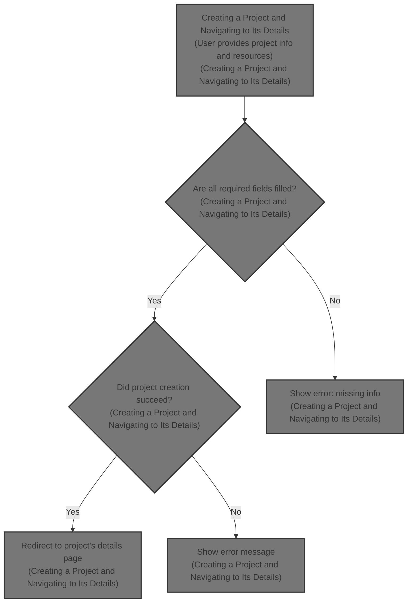

This document describes how users can create a new project by providing a name, selecting a cluster, and uploading or loading resource files. After creation, users are redirected to the project's details page to review and manage their new project.



# Creating a Project and Navigating to Its Details

```mermaid
%%{init: {"flowchart": {"defaultRenderer": "elk"}} }%%
flowchart TD
    node1["User starts new project creation"]
    click node1 openCode "frontend/src/components/project/ProjectCreateFromYaml.tsx:111:120"
    node1 --> node2["Enter project name and select cluster"]
    click node2 openCode "frontend/src/components/project/ProjectCreateFromYaml.tsx:272:314"
    node2 --> node3{"Choose resource input method"}
    click node3 openCode "frontend/src/components/project/ProjectCreateFromYaml.tsx:325:330"
    node3 -->|"Upload files"| node4["Load resources from files"]
    click node4 openCode "frontend/src/components/project/ProjectCreateFromYaml.tsx:164:204"
    node3 -->|"Load from URL"| node5["Load resources from URL"]
    click node5 openCode "frontend/src/components/project/ProjectCreateFromYaml.tsx:132:161"
    node4 --> node6["Resources loaded"]
    node5 --> node6
    click node6 openCode "frontend/src/components/project/ProjectCreateFromYaml.tsx:399:461"
    subgraph loop1["For each loaded resource"]
      node6 --> node7["Display resource in table"]
      click node7 openCode "frontend/src/components/project/ProjectCreateFromYaml.tsx:422:459"
    end
    node7 --> node8{"Are all required fields filled?"}
    click node8 openCode "frontend/src/components/project/ProjectCreateFromYaml.tsx:219:228"
    node8 -->|"Yes"| node9["Submit project creation"]
    click node9 openCode "frontend/src/components/project/ProjectCreateFromYaml.tsx:237:244"
    node8 -->|"No"| node10["Show error: missing info"]
    click node10 openCode "frontend/src/components/project/ProjectCreateFromYaml.tsx:229:232"
    node9 --> node11{"Did creation succeed?"}
    click node11 openCode "frontend/src/components/project/ProjectCreateFromYaml.tsx:245:251"
    node11 -->|"Yes"| node12["Show success and redirect"]
    click node12 openCode "frontend/src/components/project/ProjectCreateFromYaml.tsx:520:522"
    node11 -->|"No"| node13["Show error message"]
    click node13 openCode "frontend/src/components/project/ProjectCreateFromYaml.tsx:246:249"

classDef HeadingStyle fill:#777777,stroke:#333,stroke-width:2px;

%% Swimm:
%% %%{init: {"flowchart": {"defaultRenderer": "elk"}} }%%
%% flowchart TD
%%     node1["User starts new project creation"]
%%     click node1 openCode "<SwmPath>[frontend/…/project/ProjectCreateFromYaml.tsx](frontend/src/components/project/ProjectCreateFromYaml.tsx)</SwmPath>:111:120"
%%     node1 --> node2["Enter project name and select cluster"]
%%     click node2 openCode "<SwmPath>[frontend/…/project/ProjectCreateFromYaml.tsx](frontend/src/components/project/ProjectCreateFromYaml.tsx)</SwmPath>:272:314"
%%     node2 --> node3{"Choose resource input method"}
%%     click node3 openCode "<SwmPath>[frontend/…/project/ProjectCreateFromYaml.tsx](frontend/src/components/project/ProjectCreateFromYaml.tsx)</SwmPath>:325:330"
%%     node3 -->|"Upload files"| node4["Load resources from files"]
%%     click node4 openCode "<SwmPath>[frontend/…/project/ProjectCreateFromYaml.tsx](frontend/src/components/project/ProjectCreateFromYaml.tsx)</SwmPath>:164:204"
%%     node3 -->|"Load from URL"| node5["Load resources from URL"]
%%     click node5 openCode "<SwmPath>[frontend/…/project/ProjectCreateFromYaml.tsx](frontend/src/components/project/ProjectCreateFromYaml.tsx)</SwmPath>:132:161"
%%     node4 --> node6["Resources loaded"]
%%     node5 --> node6
%%     click node6 openCode "<SwmPath>[frontend/…/project/ProjectCreateFromYaml.tsx](frontend/src/components/project/ProjectCreateFromYaml.tsx)</SwmPath>:399:461"
%%     subgraph loop1["For each loaded resource"]
%%       node6 --> node7["Display resource in table"]
%%       click node7 openCode "<SwmPath>[frontend/…/project/ProjectCreateFromYaml.tsx](frontend/src/components/project/ProjectCreateFromYaml.tsx)</SwmPath>:422:459"
%%     end
%%     node7 --> node8{"Are all required fields filled?"}
%%     click node8 openCode "<SwmPath>[frontend/…/project/ProjectCreateFromYaml.tsx](frontend/src/components/project/ProjectCreateFromYaml.tsx)</SwmPath>:219:228"
%%     node8 -->|"Yes"| node9["Submit project creation"]
%%     click node9 openCode "<SwmPath>[frontend/…/project/ProjectCreateFromYaml.tsx](frontend/src/components/project/ProjectCreateFromYaml.tsx)</SwmPath>:237:244"
%%     node8 -->|"No"| node10["Show error: missing info"]
%%     click node10 openCode "<SwmPath>[frontend/…/project/ProjectCreateFromYaml.tsx](frontend/src/components/project/ProjectCreateFromYaml.tsx)</SwmPath>:229:232"
%%     node9 --> node11{"Did creation succeed?"}
%%     click node11 openCode "<SwmPath>[frontend/…/project/ProjectCreateFromYaml.tsx](frontend/src/components/project/ProjectCreateFromYaml.tsx)</SwmPath>:245:251"
%%     node11 -->|"Yes"| node12["Show success and redirect"]
%%     click node12 openCode "<SwmPath>[frontend/…/project/ProjectCreateFromYaml.tsx](frontend/src/components/project/ProjectCreateFromYaml.tsx)</SwmPath>:520:522"
%%     node11 -->|"No"| node13["Show error message"]
%%     click node13 openCode "<SwmPath>[frontend/…/project/ProjectCreateFromYaml.tsx](frontend/src/components/project/ProjectCreateFromYaml.tsx)</SwmPath>:246:249"
%% 
%% classDef HeadingStyle fill:#777777,stroke:#333,stroke-width:2px;
```



<SwmSnippet path="/frontend/src/components/project/ProjectCreateFromYaml.tsx" line="111">

---

<SwmToken path="frontend/src/components/project/ProjectCreateFromYaml.tsx" pos="111:4:4" line-data="export function CreateNew() {">`CreateNew`</SwmToken> kicks off the project creation flow. It handles user input, file uploads, and YAML loading, then validates everything before calling the backend to create the project. Once that's done, it navigates to the project's details page using a URL generated by <SwmToken path="frontend/src/components/project/ProjectCreateFromYaml.tsx" pos="244:5:5" line-data="      history.push(createRouteURL(&#39;projectDetails&#39;, { name: k8sName }));">`createRouteURL`</SwmToken>. We call that function next to build the correct path, including cluster context if needed, so the user lands on the right page for the newly created project.

```tsx
export function CreateNew() {
  const { t } = useTranslation();
  const [items, setItems] = useState<KubeObjectInterface[]>([]);
  const [name, setName] = useState('');
  const allClusters = useClustersConf();
  const [selectedClusters, setSelectedClusters] = useState<string | null>(null);
  const k8sName = toKubernetesName(name);
  const history = useHistory();

  const [creationState, setCreationState] = useState<CreationState>({
    stage: 'form',
  });

  const [errors, setErrors] = useState<Record<string, string>>({});

  // New state for URL and tab management
  const [currentTab, setCurrentTab] = useState(0);
  const [yamlUrl, setYamlUrl] = useState('');
  const [isLoadingFromUrl, setIsLoadingFromUrl] = useState(false);

  // Function to load YAML from URL
  const loadFromUrl = async () => {
    if (!yamlUrl.trim()) {
      setErrors(prev => ({ ...prev, url: t('URL is required') }));
      return;
    }

    setIsLoadingFromUrl(true);
    setErrors(prev => ({ ...prev, url: '' }));

    try {
      const response = await fetch(yamlUrl);
      if (!response.ok) {
        throw new Error(`HTTP ${response.status}: ${response.statusText}`);
      }
      const content = await response.text();
      const docs = loadAll(content) as KubeObjectInterface[];
      const validDocs = docs.filter(doc => !!doc);
      setItems(validDocs);
      setErrors(prev => ({ ...prev, items: '' }));
    } catch (error) {
      setErrors(prev => ({
        ...prev,
        url: t('Failed to load from URL: {{error}}', {
          error: (error as Error).message,
        }),
      }));
    } finally {
      setIsLoadingFromUrl(false);
    }
  };

  // File drop functionality
  const onDrop = (acceptedFiles: File[]) => {
    setErrors(prev => ({ ...prev, items: '' }));

    const promises = acceptedFiles.map(file => {
      return new Promise<{ docs: KubeObjectInterface[] }>((resolve, reject) => {
        const reader = new FileReader();
        reader.onload = () => {
          const content = reader.result as string;
          try {
            const docs = loadAll(content) as KubeObjectInterface[];
            const validDocs = docs.filter(doc => !!doc);
            resolve({ docs: validDocs });
          } catch (err) {
            console.error('Error parsing YAML file:', file.name, err);
            // Resolve with empty array for failed files
            resolve({ docs: [] });
          }
        };
        reader.onerror = err => {
          console.error('Error reading file:', file.name, err);
          reject(err);
        };
        reader.readAsText(file);
      });
    });

    Promise.all(promises)
      .then(results => {
        const newDocs = results.flatMap(result => result.docs);
        setItems(prevItems => [...prevItems, ...newDocs]);
      })
      .catch(err => {
        console.error('An error occurred while processing files.', err);
        setErrors(prev => ({
          ...prev,
          items: t('Error processing files: {{error}}', {
            error: (err as Error).message,
          }),
        }));
      });
  };

  const { getRootProps, getInputProps, open } = useDropzone({
    onDrop,
    accept: {
      'application/x-yaml': ['.yaml', '.yml'],
      'text/yaml': ['.yaml', '.yml'],
      'text/plain': ['.yaml', '.yml'],
    },
    multiple: true,
  });

  const handleCreate = async (e: FormEvent) => {
    e.preventDefault();

    const errors: any = {};
    if (!name.trim()) {
      errors.name = t('Name is required');
    }
    if (!selectedClusters) {
      errors.clusters = t('Cluster is required');
    }
    if (items.length === 0) {
      errors.items = t('No resources have been uploaded');
    }

    if (Object.keys(errors).length > 0) {
      setErrors(errors);
      return;
    } else {
      setErrors({});
    }

    try {
      await createProjectFromYaml({
        items,
        k8sName,
        cluster: selectedClusters!,
        setCreationState,
      });
      history.push(createRouteURL('projectDetails', { name: k8sName }));
    } catch (e) {
      setCreationState({
        stage: 'error',
        error: e as ApiError,
      });
    }
  };

  return (
    <>
      <DialogContent>
        {creationState.stage === 'form' && (
          <>
            <form onSubmit={handleCreate}>
              <Typography variant="h1" sx={{ mb: 3 }}>
                {t('Create new Project from YAML')}
              </Typography>
              <Grid container spacing={4}>
                <Grid item xs={3}>
                  <Typography>
                    <Trans>Project name</Trans>
                  </Typography>
                  <Typography variant="body2" color="text.secondary" sx={{ mb: 1 }}>
                    <Trans>Give your project a descriptive name</Trans>
                  </Typography>
                </Grid>
                <Grid item xs={9}>
                  <TextField
                    required
                    label={t('Project Name')}
                    placeholder={t('Enter a name')}
                    variant="outlined"
                    size="small"
                    sx={{ minWidth: 400 }}
                    value={name}
                    onChange={e => setName(e.target.value)}
                    error={!!errors.name}
                    helperText={errors.name}
                  />
                </Grid>

                <Grid item xs={3}>
                  <Typography>
                    <Trans>Cluster</Trans>
                  </Typography>
                  <Typography variant="body2" color="text.secondary" sx={{ mb: 1 }}>
                    <Trans>Select cluster for this project</Trans>
                  </Typography>
                </Grid>
                <Grid item xs={9}>
                  <Autocomplete
                    options={allClusters ? Object.keys(allClusters) : []}
                    value={selectedClusters}
                    onChange={(e, newValue) => {
                      setSelectedClusters(newValue);
                    }}
                    renderInput={params => (
                      <TextField
                        {...params}
                        label={t('Clusters')}
                        variant="outlined"
                        size="small"
                        sx={{ maxWidth: 400 }}
                        required
                      />
                    )}
                    noOptionsText={t('No available clusters')}
                    disabled={!allClusters || Object.keys(allClusters).length === 0}
                  />
                </Grid>

                <Grid item xs={3}>
                  <Typography>{t('Load resources')}</Typography>
                  <Typography variant="body2" color="text.secondary" sx={{ mb: 1 }}>
                    {t('Upload files or load from URL')}
                  </Typography>
                </Grid>
                <Grid item xs={9}>
                  {errors.items && <Typography color="error">{errors.items}</Typography>}

                  <Box sx={{ width: '100%' }}>
                    <Box sx={{ borderBottom: 1, borderColor: 'divider' }}>
                      <Tabs value={currentTab} onChange={(_, newValue) => setCurrentTab(newValue)}>
                        <Tab label={t('Upload Files')} />
                        <Tab label={t('Load from URL')} />
                      </Tabs>
                    </Box>

                    {/* File Upload Tab */}
                    {currentTab === 0 && (
                      <Box sx={{ pt: 2 }}>
                        <DropZoneBox border={1} borderColor="secondary.main" {...getRootProps()}>
                          <FormControl>
                            <input {...getInputProps()} />
                            <Tooltip
                              title={t('Drag & drop YAML files here or click to choose files')}
                              placement="top"
                            >
                              <Button
                                variant="contained"
                                onClick={open}
                                startIcon={<InlineIcon icon="mdi:upload" width={24} />}
                              >
                                {t('Choose Files')}
                              </Button>
                            </Tooltip>
                          </FormControl>
                          <Typography variant="body2" color="text.secondary" sx={{ mt: 1 }}>
                            {t('Supports .yaml and .yml files')}
                          </Typography>
                        </DropZoneBox>
                      </Box>
                    )}

                    {/* URL Loading Tab */}
                    {currentTab === 1 && (
                      <Box sx={{ pt: 2 }}>
                        <Box sx={{ display: 'flex', gap: 2, alignItems: 'flex-start' }}>
                          <TextField
                            fullWidth
                            label={t('YAML URL')}
                            placeholder={t('Enter URL to YAML file')}
                            variant="outlined"
                            size="small"
                            value={yamlUrl}
                            onChange={e => setYamlUrl(e.target.value)}
                            error={!!errors.url}
                            helperText={errors.url}
                            disabled={isLoadingFromUrl}
                          />
                          <Button
                            variant="contained"
                            onClick={loadFromUrl}
                            disabled={isLoadingFromUrl || !yamlUrl.trim()}
                            startIcon={
                              isLoadingFromUrl ? (
                                <CircularProgress size={16} />
                              ) : (
                                <InlineIcon icon="mdi:download" width={24} />
                              )
                            }
                          >
                            {isLoadingFromUrl ? t('Loading...') : t('Load')}
                          </Button>
                        </Box>
                        <Typography variant="body2" color="text.secondary" sx={{ mt: 1 }}>
                          {t('Load YAML resources from a remote URL')}
                        </Typography>
                      </Box>
                    )}
                  </Box>
                </Grid>
              </Grid>

              {items.length > 0 && (
                <Box sx={{ display: 'flex', flexDirection: 'column', gap: 3, mt: 3 }}>
                  <Box
                    sx={{ display: 'flex', justifyContent: 'space-between', alignItems: 'center' }}
                  >
                    <Typography>
                      {t('Loaded Resources ({{count}})', { count: items.length })}
                    </Typography>
                    <Button
                      variant="outlined"
                      size="small"
                      onClick={() => setItems([])}
                      startIcon={<InlineIcon icon="mdi:delete" width={16} />}
                    >
                      {t('Clear All')}
                    </Button>
                  </Box>
                  <Box
                    sx={{
                      display: 'flex',
                      flexDirection: 'column',
                    }}
                  >
                    <Table
                      data={items}
                      columns={[
                        {
                          id: 'kind',
                          header: t('Kind'),
                          accessorFn: item => item.kind,
                          Cell: ({ row: { original: item } }) => (
                            <Box sx={{ display: 'flex', alignItems: 'center', gap: 1 }}>
                              <KubeIcon kind={item.kind as any} width="24px" height="24px" />
                              <Typography variant="body2" color="text.secondary">
                                {item.kind}
                              </Typography>
                            </Box>
                          ),
                          gridTemplate: 'min-content',
                        },
                        {
                          id: 'name',
                          header: t('Name'),
                          accessorFn: item => item.metadata.name,
                        },
                        {
                          id: 'apiVersion',
                          header: t('API Version'),
                          accessorFn: item => item.apiVersion,
                        },
                        {
                          id: 'actions',
                          header: t('Actions'),
                          gridTemplate: 'min-content',
                          accessorFn: item => item.metadata.uid,
                          Cell: ({ row: { original: item } }) => (
                            <ViewYaml item={{ ...item, jsonData: item } as any} />
                          ),
                        },
                      ]}
                    />
                  </Box>
                </Box>
              )}
              <DialogActions>
                <Button
                  variant="contained"
                  color="secondary"
                  onClick={() => {
                    history.push(createRouteURL('chooser'));
                  }}
                >
                  <Trans>Cancel</Trans>
                </Button>
                <Button variant="contained" type="submit">
                  <Trans>Create</Trans>
                </Button>
              </DialogActions>
            </form>
          </>
        )}

        {creationState.stage === 'creating' && (
          <Box>
            <Typography variant="h1">{t('Creating project')}</Typography>
            <Typography variant="body2" color="text.secondary" sx={{ mt: 2 }}>
              {t('Creating following resources in this project:')}
            </Typography>
            <Box sx={{ display: 'flex', flexDirection: 'column', gap: 1, mt: 1 }}>
              {creationState.createdResources.map((resource, index) => (
                <Box
                  key={`created-${resource.kind}-${resource.metadata.name}-${index}`}
                  sx={{ display: 'flex', alignItems: 'center', gap: 1 }}
                >
                  <KubeIcon kind={resource.kind as any} width="24px" height="24px" />
                  <Box>{resource.metadata.name}</Box>
                  <Box sx={theme => ({ color: theme.palette.success.main })}>
                    <Icon icon="mdi:check" />
                  </Box>
                </Box>
              ))}
              <Box sx={{ display: 'flex', alignItems: 'center', gap: 1 }}>
                <KubeIcon
                  kind={creationState.creatingResource.kind as any}
                  width="24px"
                  height="24px"
                />
                <Box>{creationState.creatingResource.metadata.name}</Box>
                <CircularProgress size="1rem" />
              </Box>
            </Box>
          </Box>
        )}

        {creationState.stage === 'error' && (
          <Box>
            <Box>{t('Something went wrong')}</Box>
            <Box>{creationState.error.message}</Box>
          </Box>
        )}

        {creationState.stage === 'success' && (
          <Redirect to={createRouteURL('projectDetails', { name: creationState.name })} />
        )}
      </DialogContent>
    </>
  );
}
```

---

</SwmSnippet>

<SwmSnippet path="/frontend/src/lib/router/createRouteURL.tsx" line="48">

---

<SwmToken path="frontend/src/lib/router/createRouteURL.tsx" pos="48:4:4" line-data="export function createRouteURL(routeName?: string, params: RouteURLProps = {}) {">`createRouteURL`</SwmToken> builds the navigation URL for a given route. It first tries to find the route by name, then by path (logging a deprecation warning if it falls back to path). If the route needs cluster info and it's missing, it tries to fill it in; if it can't, it returns '/'. There's a hardcoded exception for <SwmToken path="frontend/src/lib/router/createRouteURL.tsx" pos="97:9:9" line-data="  if (routeName === &#39;settingsCluster&#39;) {">`settingsCluster`</SwmToken>. Otherwise, it generates the final URL using the route's path and parameters.

```tsx
export function createRouteURL(routeName?: string, params: RouteURLProps = {}) {
  if (!routeName) return '';

  const store = getStore();
  const storeRoutes = !store ? {} : store.getState().routes.routes;

  // First try to find by name
  const matchingStoredRouteByName =
    storeRoutes &&
    Object.entries(storeRoutes).find(
      ([, route]) => route.name?.toLowerCase() === routeName.toLowerCase()
    )?.[1];

  // Then try to find by path
  const matchingStoredRouteByPath =
    storeRoutes &&
    Object.entries(storeRoutes).find(([key]) => key.toLowerCase() === routeName.toLowerCase())?.[1];

  if (matchingStoredRouteByPath && !matchingStoredRouteByName) {
    console.warn(
      `[Deprecation] Route "${routeName}" was found by path instead of name. ` +
        'Please use route names instead of paths when calling createRouteURL.'
    );
  }

  const route = matchingStoredRouteByName || matchingStoredRouteByPath || getRoute(routeName);

  if (!route) {
    return '';
  }

  let cluster = params.cluster;
  if (!cluster && getRouteUseClusterURL(route)) {
    cluster = getClusterPathParam();
    if (!cluster) {
      return '/';
    }
  }
  const fullParams = {
    selected: undefined,
    ...params,
  };

  // Add cluster to the params if it is not already there
  if (!fullParams.cluster && !!cluster) {
    fullParams.cluster = cluster;
  }

  // @todo: Remove this hack once we support redirection in routes
  if (routeName === 'settingsCluster') {
    return `/settings/cluster?c=${fullParams.cluster}`;
  }

  const url = getRoutePath(route);
  return generatePath(url, fullParams);
}
```

---

</SwmSnippet>

&nbsp;

*This is an auto-generated document by Swimm 🌊 and has not yet been verified by a human*

<SwmMeta version="3.0.0" repo-id="Z2l0aHViJTNBJTNBdHlwZXNjcmlwdC1oZWFkbGFtcCUzQSUzQXJpY2FyZG9sb3Blemc=" repo-name="typescript-headlamp"><sup>Powered by [Swimm](https://app.swimm.io/)</sup></SwmMeta>
