This document describes the flow for creating a new project by selecting clusters and associating it with an existing or new namespace. Users choose clusters, select or type a namespace, and enter a project name. The system fetches and aggregates namespace data, updating existing namespaces or creating new ones as needed. After completion, the user is navigated to the project details.

# Initializing Project Creation State

<SwmSnippet path="/frontend/src/components/project/NewProjectPopup.tsx" line="105">

---

In <SwmToken path="frontend/src/components/project/NewProjectPopup.tsx" pos="105:2:2" line-data="function ProjectFromExistingNamespace({ onBack }: { onBack: () =&gt; void }) {">`ProjectFromExistingNamespace`</SwmToken>, we set up all the state needed for project creation: project name, selected clusters, namespace selection, and typed namespace. We also grab cluster configs and fetch the list of namespaces for the selected clusters using repository hooks. This is needed so we know which clusters already have the namespace and which don't. Next, we call into <SwmPath>[frontend/…/k8s/KubeObject.ts](frontend/src/lib/k8s/KubeObject.ts)</SwmPath> to get the actual namespace data for each cluster, which lets us decide whether to patch or create namespaces.

```tsx
function ProjectFromExistingNamespace({ onBack }: { onBack: () => void }) {
  const { t } = useTranslation();
  const history = useHistory();

  const [projectName, setProjectName] = useState('');
  const [selectedClusters, setSelectedClusters] = useState<string[]>([]);
  const [selectedNamespace, setSelectedNamespace] = useState<string>();
  const [typedNamespace, setTypedNamespace] = useState('');

  const [isCreating, setIsCreating] = useState(false);
  const [error, setError] = useState<ApiError>();

  const clusters = Object.values(useClustersConf() ?? {});
  const { items: namespaces } = Namespace.useList({
    clusters: selectedClusters,
  });

```

---

</SwmSnippet>

## Fetching Namespaces per Cluster

```mermaid
%%{init: {"flowchart": {"defaultRenderer": "elk"}} }%%
flowchart TD
    node1["User requests list of Kubernetes objects"] --> node2{"Which clusters to query?"}
    click node1 openCode "frontend/src/lib/k8s/KubeObject.ts:330:377"
    node2 -->|"Single cluster"| node3["Use specified cluster"]
    node2 -->|"Multiple clusters"| node4["Use provided clusters"]
    node2 -->|"No clusters"| node5["Use fallback clusters"]
    click node2 openCode "frontend/src/lib/k8s/KubeObject.ts:350:352"
    click node3 openCode "frontend/src/lib/k8s/KubeObject.ts:350:351"
    click node4 openCode "frontend/src/lib/k8s/KubeObject.ts:352:352"
    click node5 openCode "frontend/src/lib/k8s/KubeObject.ts:352:352"
    node3 --> node6{"Which namespaces to query?"}
    node4 --> node6
    node5 --> node6
    click node6 openCode "frontend/src/lib/k8s/KubeObject.ts:354:359"
    node6 -->|"Single namespace"| node7["Use specified namespace"]
    node6 -->|"Multiple namespaces"| node8["Use provided namespaces"]
    node6 -->|"No namespace"| node9["Use allowed namespaces"]
    click node7 openCode "frontend/src/lib/k8s/KubeObject.ts:355:356"
    click node8 openCode "frontend/src/lib/k8s/KubeObject.ts:357:358"
    click node9 openCode "frontend/src/lib/k8s/KubeObject.ts:359:359"
    node7 --> loop1
    node8 --> loop1
    node9 --> loop1
    subgraph loop1["For each cluster and namespace"]
      node10["Create request to fetch objects"]
      click node10 openCode "frontend/src/lib/k8s/KubeObject.ts:361:366"
    end
    loop1 --> node11["Fetch objects and manage refresh for UI"]
    click node11 openCode "frontend/src/lib/k8s/KubeObject.ts:369:374"
    node11 --> node12["Return result for UI"]
    click node12 openCode "frontend/src/lib/k8s/KubeObject.ts:376:377"

classDef HeadingStyle fill:#777777,stroke:#333,stroke-width:2px;

%% Swimm:
%% %%{init: {"flowchart": {"defaultRenderer": "elk"}} }%%
%% flowchart TD
%%     node1["User requests list of Kubernetes objects"] --> node2{"Which clusters to query?"}
%%     click node1 openCode "<SwmPath>[frontend/…/k8s/KubeObject.ts](frontend/src/lib/k8s/KubeObject.ts)</SwmPath>:330:377"
%%     node2 -->|"Single cluster"| node3["Use specified cluster"]
%%     node2 -->|"Multiple clusters"| node4["Use provided clusters"]
%%     node2 -->|"No clusters"| node5["Use fallback clusters"]
%%     click node2 openCode "<SwmPath>[frontend/…/k8s/KubeObject.ts](frontend/src/lib/k8s/KubeObject.ts)</SwmPath>:350:352"
%%     click node3 openCode "<SwmPath>[frontend/…/k8s/KubeObject.ts](frontend/src/lib/k8s/KubeObject.ts)</SwmPath>:350:351"
%%     click node4 openCode "<SwmPath>[frontend/…/k8s/KubeObject.ts](frontend/src/lib/k8s/KubeObject.ts)</SwmPath>:352:352"
%%     click node5 openCode "<SwmPath>[frontend/…/k8s/KubeObject.ts](frontend/src/lib/k8s/KubeObject.ts)</SwmPath>:352:352"
%%     node3 --> node6{"Which namespaces to query?"}
%%     node4 --> node6
%%     node5 --> node6
%%     click node6 openCode "<SwmPath>[frontend/…/k8s/KubeObject.ts](frontend/src/lib/k8s/KubeObject.ts)</SwmPath>:354:359"
%%     node6 -->|"Single namespace"| node7["Use specified namespace"]
%%     node6 -->|"Multiple namespaces"| node8["Use provided namespaces"]
%%     node6 -->|"No namespace"| node9["Use allowed namespaces"]
%%     click node7 openCode "<SwmPath>[frontend/…/k8s/KubeObject.ts](frontend/src/lib/k8s/KubeObject.ts)</SwmPath>:355:356"
%%     click node8 openCode "<SwmPath>[frontend/…/k8s/KubeObject.ts](frontend/src/lib/k8s/KubeObject.ts)</SwmPath>:357:358"
%%     click node9 openCode "<SwmPath>[frontend/…/k8s/KubeObject.ts](frontend/src/lib/k8s/KubeObject.ts)</SwmPath>:359:359"
%%     node7 --> loop1
%%     node8 --> loop1
%%     node9 --> loop1
%%     subgraph loop1["For each cluster and namespace"]
%%       node10["Create request to fetch objects"]
%%       click node10 openCode "<SwmPath>[frontend/…/k8s/KubeObject.ts](frontend/src/lib/k8s/KubeObject.ts)</SwmPath>:361:366"
%%     end
%%     loop1 --> node11["Fetch objects and manage refresh for UI"]
%%     click node11 openCode "<SwmPath>[frontend/…/k8s/KubeObject.ts](frontend/src/lib/k8s/KubeObject.ts)</SwmPath>:369:374"
%%     node11 --> node12["Return result for UI"]
%%     click node12 openCode "<SwmPath>[frontend/…/k8s/KubeObject.ts](frontend/src/lib/k8s/KubeObject.ts)</SwmPath>:376:377"
%% 
%% classDef HeadingStyle fill:#777777,stroke:#333,stroke-width:2px;
```



<SwmSnippet path="/frontend/src/lib/k8s/KubeObject.ts" line="330">

---

`KubeObject.useList` builds up the requests for each cluster and namespace we care about, using the selected clusters and namespaces from the previous step. It then calls <SwmToken path="frontend/src/lib/k8s/KubeObject.ts" pos="369:7:7" line-data="    const result = useKubeObjectList&lt;K&gt;({">`useKubeObjectList`</SwmToken> to actually run those queries and get the data. This lets us fetch all the namespace lists we need in one go.

```typescript
  static useList<K extends KubeObject>(
    this: (new (...args: any) => K) & typeof KubeObject<any>,
    {
      cluster,
      clusters,
      namespace,
      refetchInterval,
      ...queryParams
    }: {
      cluster?: string;
      clusters?: string[];
      namespace?: string | string[];
      /** How often to refetch the list. Won't refetch by default. Disables watching if set. */
      refetchInterval?: number;
    } & QueryParameters = {}
  ) {
    const fallbackClusters = useSelectedClusters();

    // Create requests for each cluster and namespace
    const requests = useMemo(() => {
      const clusterList = cluster
        ? [cluster]
        : clusters || (fallbackClusters.length === 0 ? [''] : fallbackClusters);

      const namespacesFromParams =
        typeof namespace === 'string'
          ? [namespace]
          : Array.isArray(namespace)
          ? namespace
          : undefined;

      return makeListRequests(
        clusterList,
        getAllowedNamespaces,
        this.isNamespaced,
        namespacesFromParams
      );
    }, [cluster, clusters, fallbackClusters, namespace, this.isNamespaced]);

    const result = useKubeObjectList<K>({
      queryParams: queryParams,
      kubeObjectClass: this,
      requests,
      refetchInterval,
    });

    return result;
  }
```

---

</SwmSnippet>

## Aggregating Namespace Data and Managing Watches

<SwmSnippet path="/frontend/src/lib/k8s/api/v2/useKubeObjectList.ts" line="399">

---

In <SwmToken path="frontend/src/lib/k8s/api/v2/useKubeObjectList.ts" pos="399:4:4" line-data="export function useKubeObjectList&lt;K extends KubeObject&gt;({">`useKubeObjectList`</SwmToken>, we kick off queries for each <SwmPath>[frontend/…/components/namespace/](frontend/src/components/namespace/)</SwmPath> combo, clean up the query params, and combine all the results into a single response. We also manage websocket watches for live updates, tracking resourceVersions to avoid unnecessary reconnects. This keeps the namespace data fresh and aggregated for the UI.

```typescript
export function useKubeObjectList<K extends KubeObject>({
  requests,
  kubeObjectClass,
  queryParams,
  watch = true,
  refetchInterval,
}: {
  requests: Array<{ cluster: string; namespaces?: string[] }>;
  /** Class to instantiate the object with */
  kubeObjectClass: (new (...args: any) => K) & typeof KubeObject<any>;
  queryParams?: QueryParameters;
  /** Watch for updates @default true */
  watch?: boolean;
  /** How often to refetch the list. Won't refetch by default. Disables watching if set. */
  refetchInterval?: number;
}): [Array<K> | null, ApiError | null] &
  QueryListResponse<Array<ListResponse<K> | undefined | null>, K, ApiError> {
  const maybeNamespace = requests.find(it => it.namespaces)?.namespaces?.[0];

  // Get working endpoint from the first cluster
  // Now if clusters have different apiVersions for the same resource for example, this will not work
  const { endpoint, error: endpointError } = useEndpoints(
    kubeObjectClass.apiEndpoint.apiInfo,
    requests[0]?.cluster,
    maybeNamespace
  );

  const cleanedUpQueryParams = Object.fromEntries(
    Object.entries(queryParams ?? {}).filter(([, value]) => value !== undefined && value !== '')
  );

  const queries = useMemo(
    () =>
      endpoint
        ? requests.flatMap(({ cluster, namespaces }) =>
            namespaces && namespaces.length > 0
              ? namespaces.map(namespace =>
                  kubeObjectListQuery<K>(
                    kubeObjectClass,
                    endpoint,
                    namespace,
                    cluster,
                    cleanedUpQueryParams,
                    refetchInterval
                  )
                )
              : kubeObjectListQuery<K>(
                  kubeObjectClass,
                  endpoint,
                  undefined,
                  cluster,
                  cleanedUpQueryParams,
                  refetchInterval
                )
          )
        : [],
    [requests, kubeObjectClass, endpoint, cleanedUpQueryParams]
  );

  const query = useQueries({
    queries,
    combine(results) {
      return {
        data: results.map(result => result.data),
        clusterResults: results.reduce((acc, result) => {
          if (result.data && result.data.cluster) {
            acc[result.data.cluster] = {
              data: result.data,
              error: result.error,
              errors: result.error ? [result.error] : null,
              isError: result.isError,
              isFetching: result.isFetching,
              isLoading: result.isLoading,
              isSuccess: result.isSuccess,
              items: result?.data?.list?.items ?? null,
              status: result.status,
            };
          }
          return acc;
        }, {} as Record<string, QueryListResponse<any, K, ApiError>>),
        items: results.every(result => result.data === null)
          ? null
          : results.flatMap(result => result?.data?.list?.items ?? []),
        errors: results.map(result => result.error).filter(Boolean),
        isError: results.some(result => result.isError),
        isLoading: results.some(result => result.isLoading),
        isFetching: results.some(result => result.isFetching),
        isSuccess: results.every(result => result.isSuccess),
      };
    },
  });

  const shouldWatch = watch && !refetchInterval && !query.isLoading;

  const [listsToWatch, setListsToWatch] = useState<
    { cluster: string; namespace?: string; resourceVersion: string }[]
  >([]);

  const listsNotYetWatched = query.data
    .filter(Boolean)
    .filter(
      data =>
        listsToWatch.find(
          // resourceVersion is intentionally omitted to avoid recreating WS connection when list is updated
          watching => watching.cluster === data?.cluster && watching.namespace === data.namespace
        ) === undefined
    )
    .map(data => ({
      cluster: data!.cluster,
      namespace: data!.namespace,
      resourceVersion: data!.list.metadata.resourceVersion,
    }));

  if (listsNotYetWatched.length > 0) {
    setListsToWatch([...listsToWatch, ...listsNotYetWatched]);
  }

  const listsToStopWatching = listsToWatch.filter(
    watching =>
      requests.find(request =>
        watching.cluster === request?.cluster && request.namespaces && watching.namespace
          ? request.namespaces?.includes(watching.namespace)
          : true
      ) === undefined
  );

  if (listsToStopWatching.length > 0) {
    setListsToWatch(listsToWatch.filter(it => !listsToStopWatching.includes(it)));
  }

  useWatchKubeObjectLists({
    lists: shouldWatch ? listsToWatch : [],
    endpoint,
    kubeObjectClass,
    queryParams: cleanedUpQueryParams,
  });

```

---

</SwmSnippet>

### Subscribing to Namespace Updates

See <SwmLink doc-title="Delivering Live Updates for Kubernetes Resource Lists">[Delivering Live Updates for Kubernetes Resource Lists](/.swm/delivering-live-updates-for-kubernetes-resource-lists.uy0nv90p.sw.md)</SwmLink>

### Returning Aggregated Namespace Results

```mermaid
%%{init: {"flowchart": {"defaultRenderer": "elk"}} }%%
flowchart TD
    node1["Receive query results"] --> node2{"Is there an endpoint error?"}
    click node1 openCode "frontend/src/lib/k8s/api/v2/useKubeObjectList.ts:536:537"
    node2 -->|"Yes"| node3["Return empty items and endpoint error, plus status and cluster results"]
    click node2 openCode "frontend/src/lib/k8s/api/v2/useKubeObjectList.ts:540:541"
    node2 -->|"No"| node4{"Are there any non-null errors?"}
    click node4 openCode "frontend/src/lib/k8s/api/v2/useKubeObjectList.ts:541:542"
    node4 -->|"Yes"| node5["Return items and errors, plus status and cluster results"]
    click node5 openCode "frontend/src/lib/k8s/api/v2/useKubeObjectList.ts:539:547"
    node4 -->|"No"| node6["Return items and no errors, plus status and cluster results"]
    click node6 openCode "frontend/src/lib/k8s/api/v2/useKubeObjectList.ts:539:547"
    node3 --> node7["Prepare result object"]
    node5 --> node7
    node6 --> node7
    click node7 openCode "frontend/src/lib/k8s/api/v2/useKubeObjectList.ts:539:547"
    subgraph loop1["When iterating over results"]
      node7 --> node8["Yield items"]
      click node8 openCode "frontend/src/lib/k8s/api/v2/useKubeObjectList.ts:549:549"
      node8 --> node9["Yield error"]
      click node9 openCode "frontend/src/lib/k8s/api/v2/useKubeObjectList.ts:550:550"
    end

classDef HeadingStyle fill:#777777,stroke:#333,stroke-width:2px;

%% Swimm:
%% %%{init: {"flowchart": {"defaultRenderer": "elk"}} }%%
%% flowchart TD
%%     node1["Receive query results"] --> node2{"Is there an endpoint error?"}
%%     click node1 openCode "<SwmPath>[frontend/…/v2/useKubeObjectList.ts](frontend/src/lib/k8s/api/v2/useKubeObjectList.ts)</SwmPath>:536:537"
%%     node2 -->|"Yes"| node3["Return empty items and endpoint error, plus status and cluster results"]
%%     click node2 openCode "<SwmPath>[frontend/…/v2/useKubeObjectList.ts](frontend/src/lib/k8s/api/v2/useKubeObjectList.ts)</SwmPath>:540:541"
%%     node2 -->|"No"| node4{"Are there any non-null errors?"}
%%     click node4 openCode "<SwmPath>[frontend/…/v2/useKubeObjectList.ts](frontend/src/lib/k8s/api/v2/useKubeObjectList.ts)</SwmPath>:541:542"
%%     node4 -->|"Yes"| node5["Return items and errors, plus status and cluster results"]
%%     click node5 openCode "<SwmPath>[frontend/…/v2/useKubeObjectList.ts](frontend/src/lib/k8s/api/v2/useKubeObjectList.ts)</SwmPath>:539:547"
%%     node4 -->|"No"| node6["Return items and no errors, plus status and cluster results"]
%%     click node6 openCode "<SwmPath>[frontend/…/v2/useKubeObjectList.ts](frontend/src/lib/k8s/api/v2/useKubeObjectList.ts)</SwmPath>:539:547"
%%     node3 --> node7["Prepare result object"]
%%     node5 --> node7
%%     node6 --> node7
%%     click node7 openCode "<SwmPath>[frontend/…/v2/useKubeObjectList.ts](frontend/src/lib/k8s/api/v2/useKubeObjectList.ts)</SwmPath>:539:547"
%%     subgraph loop1["When iterating over results"]
%%       node7 --> node8["Yield items"]
%%       click node8 openCode "<SwmPath>[frontend/…/v2/useKubeObjectList.ts](frontend/src/lib/k8s/api/v2/useKubeObjectList.ts)</SwmPath>:549:549"
%%       node8 --> node9["Yield error"]
%%       click node9 openCode "<SwmPath>[frontend/…/v2/useKubeObjectList.ts](frontend/src/lib/k8s/api/v2/useKubeObjectList.ts)</SwmPath>:550:550"
%%     end
%% 
%% classDef HeadingStyle fill:#777777,stroke:#333,stroke-width:2px;
```



<SwmSnippet path="/frontend/src/lib/k8s/api/v2/useKubeObjectList.ts" line="536">

---

We just got back from <SwmToken path="frontend/src/lib/k8s/KubeObject.ts" pos="369:7:7" line-data="    const result = useKubeObjectList&lt;K&gt;({">`useKubeObjectList`</SwmToken>, and here we return a single object with all the namespace items, errors, cluster results, and status flags. This lets the caller handle everything in one place, including iterating over items and errors if needed.

```typescript
  const errors = query.errors.filter(it => it !== null);

  // @ts-ignore - TS compiler gets confused with iterators
  return {
    items: endpointError ? [] : query.items,
    errors: endpointError ? [endpointError] : errors.length > 0 ? errors : null,
    error: endpointError ?? query.errors.find(it => it !== null) ?? null,
    clusterResults: query.clusterResults,
    isError: query.isError,
    isLoading: query.isLoading,
    isFetching: query.isFetching,
    isSuccess: query.isSuccess,
    *[Symbol.iterator](): ArrayIterator<ApiError | K[] | null> {
      yield query.items;
      yield endpointError ?? query.errors.find(it => it !== null) ?? null;
    },
  };
}
```

---

</SwmSnippet>

## Creating or Updating Namespaces Across Clusters

```mermaid
%%{init: {"flowchart": {"defaultRenderer": "elk"}} }%%
flowchart TD
  node1{"Is project creation ready? (clusters, namespace, name)"}
  click node1 openCode "frontend/src/components/project/NewProjectPopup.tsx:122:129"
  node1 -->|"Yes"| node2{"Does namespace exist in any selected cluster?"}
  node1 -->|"No"| node8["Wait for user input"]
  click node8 openCode "frontend/src/components/project/NewProjectPopup.tsx:122:129"
  node2 -->|"Yes"| node3["Update existing namespaces with project label"]
  click node3 openCode "frontend/src/components/project/NewProjectPopup.tsx:133:147"
  node2 -->|"No"| node5["Identify clusters without namespace"]
  click node5 openCode "frontend/src/components/project/NewProjectPopup.tsx:150:153"
  node3 --> node5
  subgraph loop1["For each cluster without namespace"]
    node5 --> node6["Create new namespace for project"]
    click node6 openCode "frontend/src/components/project/NewProjectPopup.tsx:154:166"
  end
  node6 --> node7["Navigate to project details"]
  click node7 openCode "frontend/src/components/project/NewProjectPopup.tsx:168:168"

classDef HeadingStyle fill:#777777,stroke:#333,stroke-width:2px;

%% Swimm:
%% %%{init: {"flowchart": {"defaultRenderer": "elk"}} }%%
%% flowchart TD
%%   node1{"Is project creation ready? (clusters, namespace, name)"}
%%   click node1 openCode "<SwmPath>[frontend/…/project/NewProjectPopup.tsx](frontend/src/components/project/NewProjectPopup.tsx)</SwmPath>:122:129"
%%   node1 -->|"Yes"| node2{"Does namespace exist in any selected cluster?"}
%%   node1 -->|"No"| node8["Wait for user input"]
%%   click node8 openCode "<SwmPath>[frontend/…/project/NewProjectPopup.tsx](frontend/src/components/project/NewProjectPopup.tsx)</SwmPath>:122:129"
%%   node2 -->|"Yes"| node3["Update existing namespaces with project label"]
%%   click node3 openCode "<SwmPath>[frontend/…/project/NewProjectPopup.tsx](frontend/src/components/project/NewProjectPopup.tsx)</SwmPath>:133:147"
%%   node2 -->|"No"| node5["Identify clusters without namespace"]
%%   click node5 openCode "<SwmPath>[frontend/…/project/NewProjectPopup.tsx](frontend/src/components/project/NewProjectPopup.tsx)</SwmPath>:150:153"
%%   node3 --> node5
%%   subgraph loop1["For each cluster without namespace"]
%%     node5 --> node6["Create new namespace for project"]
%%     click node6 openCode "<SwmPath>[frontend/…/project/NewProjectPopup.tsx](frontend/src/components/project/NewProjectPopup.tsx)</SwmPath>:154:166"
%%   end
%%   node6 --> node7["Navigate to project details"]
%%   click node7 openCode "<SwmPath>[frontend/…/project/NewProjectPopup.tsx](frontend/src/components/project/NewProjectPopup.tsx)</SwmPath>:168:168"
%% 
%% classDef HeadingStyle fill:#777777,stroke:#333,stroke-width:2px;
```



<SwmSnippet path="/frontend/src/components/project/NewProjectPopup.tsx" line="122">

---

Finally, <SwmToken path="frontend/src/components/project/NewProjectPopup.tsx" pos="105:2:2" line-data="function ProjectFromExistingNamespace({ onBack }: { onBack: () =&gt; void }) {">`ProjectFromExistingNamespace`</SwmToken> returns the UI for project creation: cluster selection, namespace selection/creation, project name input, and buttons to trigger creation or cancel. It reflects the current state, disables actions when busy, and shows errors if any.

```tsx
  const isReadyToCreate =
    selectedClusters.length && (selectedNamespace || typedNamespace) && projectName;

  /**
   * Creates or updates namespaces for the proejct
   */
  const handleCreate = async () => {
    if (!isReadyToCreate || isCreating) return;

    setIsCreating(true);
    try {
      const existingNamespaces = namespaces?.filter(it => it.metadata.name === selectedNamespace);
      const clustersWithExistingNamespace = existingNamespaces?.map(it => it.cluster) ?? [];
      if (existingNamespaces && existingNamespaces.length > 0) {
        // Update all existing namespaces with the same name across selected clusters
        await Promise.all(
          existingNamespaces.map(namespace =>
            namespace.patch({
              metadata: {
                labels: {
                  [PROJECT_ID_LABEL]: projectName,
                },
              },
            })
          )
        );
      }

      // Create new namespace in all selected clusters that don't already have it
      const clustersWithoutNamespace = selectedClusters.filter(
        it => !clustersWithExistingNamespace.includes(it)
      );
      for (const cluster of clustersWithoutNamespace) {
        const namespace = {
          kind: 'Namespace',
          apiVersion: 'v1',
          metadata: {
            name: toKubernetesName(typedNamespace),
            labels: {
              [PROJECT_ID_LABEL]: projectName,
            },
          } as any,
        } as KubeObjectInterface;
        await apply(namespace, cluster);
      }
```

---

</SwmSnippet>

<SwmSnippet path="/frontend/src/components/project/NewProjectPopup.tsx" line="168">

---

Finally, <SwmToken path="frontend/src/components/project/NewProjectPopup.tsx" pos="105:2:2" line-data="function ProjectFromExistingNamespace({ onBack }: { onBack: () =&gt; void }) {">`ProjectFromExistingNamespace`</SwmToken> returns the UI for project creation: cluster selection, namespace selection/creation, project name input, and buttons to trigger creation or cancel. It reflects the current state, disables actions when busy, and shows errors if any.

```tsx
      history.push(createRouteURL('projectDetails', { name: projectName }));
    } catch (e: any) {
      setError(e);
    } finally {
      setIsCreating(false);
    }
  };

  return (
    <>
      <DialogTitle sx={{ display: 'flex', gap: 1, alignItems: 'center' }}>
        <Icon icon="mdi:folder-add" />
        {t('Create new project')}
      </DialogTitle>
      <DialogContent
        sx={{
          p: 3,
          minWidth: '25rem',
          display: 'flex',
          flexDirection: 'column',
          gap: 3,
          minHeight: '20rem',
        }}
      >
        <Typography variant="body2" color="text.secondary" sx={{ maxWidth: '25rem' }}>
          <Trans>
            To create a new project pick which clusters you want to include and then select existing
            or create a new namespace
          </Trans>
        </Typography>
        <TextField
          label={t('translation|Project Name')}
          value={projectName}
          onChange={event => {
            const inputValue = event.target.value.toLowerCase();
            setProjectName(inputValue);
          }}
          onBlur={event => {
            // Convert to Kubernetes name when user finishes typing (loses focus)
            const converted = toKubernetesName(event.target.value);
            setProjectName(converted);
          }}
          onKeyDown={event => {
            // Convert spaces to dashes immediately when space is pressed
            if (event.key === ' ') {
              event.preventDefault();
              const target = event.target as HTMLInputElement;
              const start = target.selectionStart || 0;
              const end = target.selectionEnd || 0;
              const currentValue = projectName;
              const newValue = currentValue.substring(0, start) + '-' + currentValue.substring(end);
              setProjectName(newValue);
              // Set cursor position after the inserted dash
              setTimeout(() => {
                target.setSelectionRange(start + 1, start + 1);
              }, 0);
            }
          }}
          helperText={t('translation|Enter a name for your new project.')}
          autoComplete="off"
          fullWidth
        />
        <Autocomplete
          fullWidth
          multiple
          options={clusters.map(it => it.name)}
          value={selectedClusters}
          onChange={(e, newValue) => {
            setSelectedClusters(newValue);
          }}
          renderInput={params => (
            <TextField
              {...params}
              label={t('Clusters')}
              variant="outlined"
              size="small"
              helperText={t('Select one or more clusters for this project')}
            />
          )}
          noOptionsText={t('No available clusters')}
          disabled={clusters.length === 0}
        />
        <Autocomplete
          fullWidth
          freeSolo
          options={uniq(namespaces?.map(it => it.metadata.name)) ?? []}
          value={selectedNamespace}
          onChange={(event, newValue) => {
            console.log({ newValue });
            setSelectedNamespace(newValue ?? undefined);
          }}
          onInputChange={(e, v) => {
            setTypedNamespace(v);
          }}
          renderInput={params => (
            <TextField
              {...params}
              label={t('Namespace')}
              placeholder={t('Type or select a namespace')}
              helperText={t('Select existing or type to create a new namespace')}
              variant="outlined"
              size="small"
            />
          )}
          noOptionsText={t('No available namespaces - you can type a custom name')}
        />
        {error && (
          <Alert severity="error" sx={{ maxWidth: '25rem' }}>
            {error?.message}
          </Alert>
        )}
      </DialogContent>
      <DialogActions>
        <Button variant="contained" color="secondary" onClick={onBack}>
          <Trans>Cancel</Trans>
        </Button>
        <Button
          variant="contained"
          onClick={handleCreate}
          disabled={isCreating || !isReadyToCreate}
        >
          {isCreating ? <Trans>Creating</Trans> : <Trans>Create</Trans>}
        </Button>
      </DialogActions>
    </>
  );
}
```

---

</SwmSnippet>

&nbsp;

*This is an auto-generated document by Swimm 🌊 and has not yet been verified by a human*

<SwmMeta version="3.0.0" repo-id="Z2l0aHViJTNBJTNBdHlwZXNjcmlwdC1oZWFkbGFtcCUzQSUzQXJpY2FyZG9sb3Blemc=" repo-name="typescript-headlamp"><sup>Powered by [Swimm](https://app.swimm.io/)</sup></SwmMeta>
