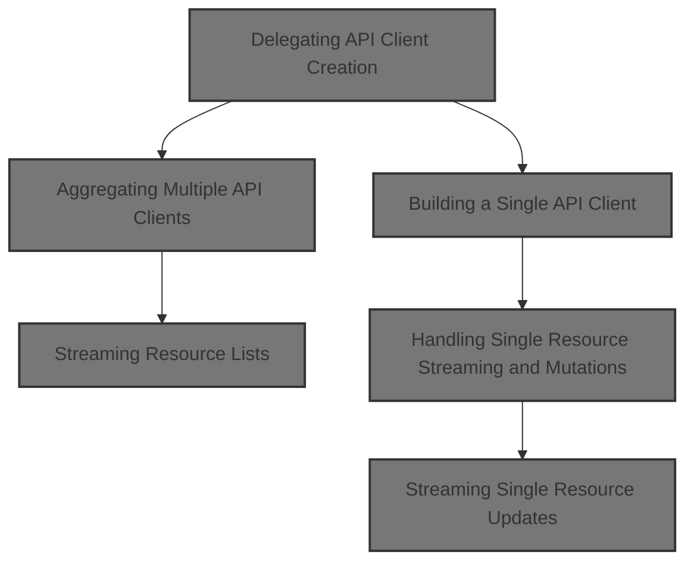

This document describes how API clients are created to interact with Kubernetes resources. The flow supports both single and multiple resource endpoints, providing a unified interface for operations like listing, getting, creating, updating, patching, and deleting. The client streams updates for both resource lists and individual resources, keeping the frontend synchronized with the cluster.



# Delegating API Client Creation

```mermaid
%%{init: {"flowchart": {"defaultRenderer": "elk"}} }%%
flowchart TD
  node1["Start API client creation for Kubernetes resources"]
  click node1 openCode "frontend/src/lib/k8s/api/v1/factories.ts:281:287"
  node1 --> node2{"Are arguments an array?"}
  click node2 openCode "frontend/src/lib/k8s/api/v1/factories.ts:288:290"
  node2 -->|"Array"| node3["Aggregating Multiple API Clients"]
  
  node2 -->|"Not Array"| node4["Building a Single API Client"]
  
  node3 --> node5["Return API client(s) for Kubernetes resources"]
  click node5 openCode "frontend/src/lib/k8s/api/v1/factories.ts:292:293"
  node4 --> node5
classDef HeadingStyle fill:#777777,stroke:#333,stroke-width:2px;
click node3 goToHeading "Aggregating Multiple API Clients"
node3:::HeadingStyle
click node4 goToHeading "Building a Single API Client"
node4:::HeadingStyle

%% Swimm:
%% %%{init: {"flowchart": {"defaultRenderer": "elk"}} }%%
%% flowchart TD
%%   node1["Start API client creation for Kubernetes resources"]
%%   click node1 openCode "<SwmPath>[frontend/…/v1/factories.ts](frontend/src/lib/k8s/api/v1/factories.ts)</SwmPath>:281:287"
%%   node1 --> node2{"Are arguments an array?"}
%%   click node2 openCode "<SwmPath>[frontend/…/v1/factories.ts](frontend/src/lib/k8s/api/v1/factories.ts)</SwmPath>:288:290"
%%   node2 -->|"Array"| node3["Aggregating Multiple API Clients"]
%%   
%%   node2 -->|"Not Array"| node4["Building a Single API Client"]
%%   
%%   node3 --> node5["Return API client(s) for Kubernetes resources"]
%%   click node5 openCode "<SwmPath>[frontend/…/v1/factories.ts](frontend/src/lib/k8s/api/v1/factories.ts)</SwmPath>:292:293"
%%   node4 --> node5
%% classDef HeadingStyle fill:#777777,stroke:#333,stroke-width:2px;
%% click node3 goToHeading "Aggregating Multiple API Clients"
%% node3:::HeadingStyle
%% click node4 goToHeading "Building a Single API Client"
%% node4:::HeadingStyle
```



<SwmSnippet path="/frontend/src/lib/k8s/api/v1/factories.ts" line="281">

---

In <SwmToken path="frontend/src/lib/k8s/api/v1/factories.ts" pos="281:4:4" line-data="export function apiFactory&lt;ResourceType extends KubeObjectInterface = KubeObjectInterface&gt;(">`apiFactory`</SwmToken>, we kick off the flow by inspecting the first argument. If it's an array, we assume we're dealing with multiple API endpoints and call <SwmToken path="frontend/src/lib/k8s/api/v1/factories.ts" pos="289:3:3" line-data="    return multipleApiFactory(...(args as MultipleApiFactoryArguments));">`multipleApiFactory`</SwmToken> with those arguments. This lets us aggregate clients for several endpoints. If it's not an array, we pass the arguments to <SwmToken path="frontend/src/lib/k8s/api/v1/factories.ts" pos="292:3:3" line-data="  return singleApiFactory(...(args as SingleApiFactoryArguments));">`singleApiFactory`</SwmToken> for a single endpoint client. This branching is what determines which type of <SwmToken path="frontend/src/lib/k8s/api/v1/factories.ts" pos="283:3:3" line-data="): ApiClient&lt;ResourceType&gt; {">`ApiClient`</SwmToken> gets returned.

```typescript
export function apiFactory<ResourceType extends KubeObjectInterface = KubeObjectInterface>(
  ...args: ApiFactoryArguments
): ApiClient<ResourceType> {
  if (isDebugVerbose('k8s/apiProxy@apiFactory')) {
    console.debug('k8s/apiProxy@apiFactory', { args });
  }

  if (args[0] instanceof Array) {
    return multipleApiFactory(...(args as MultipleApiFactoryArguments));
  }

```

---

</SwmSnippet>

## Aggregating Multiple API Clients

```mermaid
%%{init: {"flowchart": {"defaultRenderer": "elk"}} }%%
flowchart TD
    node1["Receive multiple API endpoint arguments"]
    click node1 openCode "frontend/src/lib/k8s/api/v1/factories.ts:304:306"
    
    subgraph loop1["For each API endpoint argument"]
      node1 --> node2["Create API client for endpoint"]
      click node2 openCode "frontend/src/lib/k8s/api/v1/factories.ts:311:311"
      node2 --> node3["Collect endpoint metadata"]
      click node3 openCode "frontend/src/lib/k8s/api/v1/factories.ts:324:328"
    end
    loop1 --> node4["Combine clients and metadata into unified API client"]
    click node4 openCode "frontend/src/lib/k8s/api/v1/factories.ts:313:329"
    node4 --> node5["Expose multi-endpoint operations: list, get, post, patch, put, delete"]
    click node5 openCode "frontend/src/lib/k8s/api/v1/factories.ts:314:322"
    node5 --> node6["Return unified API client"]
    click node6 openCode "frontend/src/lib/k8s/api/v1/factories.ts:329:330"
classDef HeadingStyle fill:#777777,stroke:#333,stroke-width:2px;

%% Swimm:
%% %%{init: {"flowchart": {"defaultRenderer": "elk"}} }%%
%% flowchart TD
%%     node1["Receive multiple API endpoint arguments"]
%%     click node1 openCode "<SwmPath>[frontend/…/v1/factories.ts](frontend/src/lib/k8s/api/v1/factories.ts)</SwmPath>:304:306"
%%     
%%     subgraph loop1["For each API endpoint argument"]
%%       node1 --> node2["Create API client for endpoint"]
%%       click node2 openCode "<SwmPath>[frontend/…/v1/factories.ts](frontend/src/lib/k8s/api/v1/factories.ts)</SwmPath>:311:311"
%%       node2 --> node3["Collect endpoint metadata"]
%%       click node3 openCode "<SwmPath>[frontend/…/v1/factories.ts](frontend/src/lib/k8s/api/v1/factories.ts)</SwmPath>:324:328"
%%     end
%%     loop1 --> node4["Combine clients and metadata into unified API client"]
%%     click node4 openCode "<SwmPath>[frontend/…/v1/factories.ts](frontend/src/lib/k8s/api/v1/factories.ts)</SwmPath>:313:329"
%%     node4 --> node5["Expose multi-endpoint operations: list, get, post, patch, put, delete"]
%%     click node5 openCode "<SwmPath>[frontend/…/v1/factories.ts](frontend/src/lib/k8s/api/v1/factories.ts)</SwmPath>:314:322"
%%     node5 --> node6["Return unified API client"]
%%     click node6 openCode "<SwmPath>[frontend/…/v1/factories.ts](frontend/src/lib/k8s/api/v1/factories.ts)</SwmPath>:329:330"
%% classDef HeadingStyle fill:#777777,stroke:#333,stroke-width:2px;
```



<SwmSnippet path="/frontend/src/lib/k8s/api/v1/factories.ts" line="304">

---

<SwmToken path="frontend/src/lib/k8s/api/v1/factories.ts" pos="304:4:4" line-data="export function multipleApiFactory&lt;T extends KubeObjectInterface&gt;(">`multipleApiFactory`</SwmToken> takes several sets of API arguments, spins up a client for each using <SwmToken path="frontend/src/lib/k8s/api/v1/factories.ts" pos="311:15:15" line-data="  const apiEndpoints = args.map(apiArgs =&gt; singleApiFactory(...apiArgs));">`singleApiFactory`</SwmToken>, and then exposes methods that run across all those clients. The returned object lets you call list, get, post, etc. on all endpoints at once. It assumes each argument set is an array with group, version, and resource, and uses that to build the <SwmToken path="frontend/src/lib/k8s/api/v1/factories.ts" pos="324:1:1" line-data="    apiInfo: args.map(apiArgs =&gt; ({">`apiInfo`</SwmToken> metadata.

```typescript
export function multipleApiFactory<T extends KubeObjectInterface>(
  ...args: MultipleApiFactoryArguments
): ApiClient<T> {
  if (isDebugVerbose('k8s/apiProxy@multipleApiFactory')) {
    console.debug('k8s/apiProxy@multipleApiFactory', { args });
  }

  const apiEndpoints = args.map(apiArgs => singleApiFactory(...apiArgs));

  return {
    list: (cb, errCb, queryParams, cluster) => {
      return repeatStreamFunc(apiEndpoints, 'list', errCb, cb, queryParams, cluster);
    },
    get: (name, cb, errCb, queryParams, cluster) =>
      repeatStreamFunc(apiEndpoints, 'get', errCb, name, cb, queryParams, cluster),
    post: repeatFactoryMethod(apiEndpoints, 'post'),
    patch: repeatFactoryMethod(apiEndpoints, 'patch'),
    put: repeatFactoryMethod(apiEndpoints, 'put'),
    delete: repeatFactoryMethod(apiEndpoints, 'delete'),
    isNamespaced: false,
    apiInfo: args.map(apiArgs => ({
      group: apiArgs[0],
      version: apiArgs[1],
      resource: apiArgs[2],
    })),
  };
}
```

---

</SwmSnippet>

## Building a Single API Client

<SwmSnippet path="/frontend/src/lib/k8s/api/v1/factories.ts" line="353">

---

In <SwmToken path="frontend/src/lib/k8s/api/v1/factories.ts" pos="353:4:4" line-data="export function singleApiFactory&lt;T extends KubeObjectInterface&gt;(">`singleApiFactory`</SwmToken>, we set up the API root and resource URL, then return an object with methods for list, get, post, etc. For listing resources, we call <SwmToken path="frontend/src/lib/k8s/api/v1/factories.ts" pos="368:3:3" line-data="      return streamResultsForCluster(url, { cb, errCb, cluster }, queryParams);">`streamResultsForCluster`</SwmToken> to get the initial data and stream updates, keeping the client in sync with the cluster.

```typescript
export function singleApiFactory<T extends KubeObjectInterface>(
  ...[group, version, resource]: SingleApiFactoryArguments
): ApiClient<T> {
  if (isDebugVerbose('k8s/apiProxy@singleApiFactory')) {
    console.debug('k8s/apiProxy@singleApiFactory', { group, version, resource });
  }

  const apiRoot = getApiRoot(group, version);
  const url = `${apiRoot}/${resource}`;
  return {
    list: (cb, errCb, queryParams, cluster) => {
      if (isDebugVerbose('k8s/apiProxy@singleApiFactory list')) {
        console.debug('k8s/apiProxy@singleApiFactory list', { cluster, queryParams });
      }

      return streamResultsForCluster(url, { cb, errCb, cluster }, queryParams);
    },
    get: (name, cb, errCb, queryParams, cluster) =>
```

---

</SwmSnippet>

### Streaming Resource Lists

```mermaid
%%{init: {"flowchart": {"defaultRenderer": "elk"}} }%%
flowchart TD
    node1["Start streaming for cluster (clusterName)"] --> node2["Fetch initial resources"]
    click node1 openCode "frontend/src/lib/k8s/api/v1/streamingApi.ts:141:146"
    subgraph loop1["For each item in initial response"]
      node2 --> node3["Add item to results"]
      click node3 openCode "frontend/src/lib/k8s/api/v1/streamingApi.ts:196:203"
    end
    node3 --> node4["Start resource stream"]
    click node4 openCode "frontend/src/lib/k8s/api/v1/streamingApi.ts:177:180"
    subgraph loop2["For each resource update received"]
      node4 --> node5{"Update type?"}
      click node5 openCode "frontend/src/lib/k8s/api/v1/streamingApi.ts:209:240"
      node5 -->|"ADDED"| node6["Add resource to results"]
      click node6 openCode "frontend/src/lib/k8s/api/v1/streamingApi.ts:211:212"
      node5 -->|"MODIFIED"| node7["Update resource in results"]
      click node7 openCode "frontend/src/lib/k8s/api/v1/streamingApi.ts:213:231"
      node5 -->|"DELETED"| node8["Remove resource from results"]
      click node8 openCode "frontend/src/lib/k8s/api/v1/streamingApi.ts:232:234"
      node5 -->|"ERROR"| node9["Log error"]
      click node9 openCode "frontend/src/lib/k8s/api/v1/streamingApi.ts:235:237"
      node6 --> node10{"Limit resources to maxResources?"}
      node7 --> node10
      node8 --> node10
      node9 --> node10
      click node10 openCode "frontend/src/lib/k8s/api/v1/streamingApi.ts:250:258"
      node10 --> node11["Deliver results to user"]
      click node11 openCode "frontend/src/lib/k8s/api/v1/streamingApi.ts:263:264"
    end
    node11 --> node12{"Is stream cancelled?"}
    click node12 openCode "frontend/src/lib/k8s/api/v1/streamingApi.ts:189:194"
    node12 -->|"Yes"| node13["Stop stream"]
    click node13 openCode "frontend/src/lib/k8s/api/v1/streamingApi.ts:189:194"
    node12 -->|"No"| node4
classDef HeadingStyle fill:#777777,stroke:#333,stroke-width:2px;

%% Swimm:
%% %%{init: {"flowchart": {"defaultRenderer": "elk"}} }%%
%% flowchart TD
%%     node1["Start streaming for cluster (<SwmToken path="frontend/src/lib/k8s/api/v1/streamingApi.ts" pos="66:3:3" line-data="  const clusterName = cluster || getCluster() || &#39;&#39;;">`clusterName`</SwmToken>)"] --> node2["Fetch initial resources"]
%%     click node1 openCode "<SwmPath>[frontend/…/v1/streamingApi.ts](frontend/src/lib/k8s/api/v1/streamingApi.ts)</SwmPath>:141:146"
%%     subgraph loop1["For each item in initial response"]
%%       node2 --> node3["Add item to results"]
%%       click node3 openCode "<SwmPath>[frontend/…/v1/streamingApi.ts](frontend/src/lib/k8s/api/v1/streamingApi.ts)</SwmPath>:196:203"
%%     end
%%     node3 --> node4["Start resource stream"]
%%     click node4 openCode "<SwmPath>[frontend/…/v1/streamingApi.ts](frontend/src/lib/k8s/api/v1/streamingApi.ts)</SwmPath>:177:180"
%%     subgraph loop2["For each resource update received"]
%%       node4 --> node5{"Update type?"}
%%       click node5 openCode "<SwmPath>[frontend/…/v1/streamingApi.ts](frontend/src/lib/k8s/api/v1/streamingApi.ts)</SwmPath>:209:240"
%%       node5 -->|"ADDED"| node6["Add resource to results"]
%%       click node6 openCode "<SwmPath>[frontend/…/v1/streamingApi.ts](frontend/src/lib/k8s/api/v1/streamingApi.ts)</SwmPath>:211:212"
%%       node5 -->|"MODIFIED"| node7["Update resource in results"]
%%       click node7 openCode "<SwmPath>[frontend/…/v1/streamingApi.ts](frontend/src/lib/k8s/api/v1/streamingApi.ts)</SwmPath>:213:231"
%%       node5 -->|"DELETED"| node8["Remove resource from results"]
%%       click node8 openCode "<SwmPath>[frontend/…/v1/streamingApi.ts](frontend/src/lib/k8s/api/v1/streamingApi.ts)</SwmPath>:232:234"
%%       node5 -->|"ERROR"| node9["Log error"]
%%       click node9 openCode "<SwmPath>[frontend/…/v1/streamingApi.ts](frontend/src/lib/k8s/api/v1/streamingApi.ts)</SwmPath>:235:237"
%%       node6 --> node10{"Limit resources to <SwmToken path="frontend/src/lib/k8s/api/v1/streamingApi.ts" pos="158:3:3" line-data="  const maxResources =">`maxResources`</SwmToken>?"}
%%       node7 --> node10
%%       node8 --> node10
%%       node9 --> node10
%%       click node10 openCode "<SwmPath>[frontend/…/v1/streamingApi.ts](frontend/src/lib/k8s/api/v1/streamingApi.ts)</SwmPath>:250:258"
%%       node10 --> node11["Deliver results to user"]
%%       click node11 openCode "<SwmPath>[frontend/…/v1/streamingApi.ts](frontend/src/lib/k8s/api/v1/streamingApi.ts)</SwmPath>:263:264"
%%     end
%%     node11 --> node12{"Is stream cancelled?"}
%%     click node12 openCode "<SwmPath>[frontend/…/v1/streamingApi.ts](frontend/src/lib/k8s/api/v1/streamingApi.ts)</SwmPath>:189:194"
%%     node12 -->|"Yes"| node13["Stop stream"]
%%     click node13 openCode "<SwmPath>[frontend/…/v1/streamingApi.ts](frontend/src/lib/k8s/api/v1/streamingApi.ts)</SwmPath>:189:194"
%%     node12 -->|"No"| node4
%% classDef HeadingStyle fill:#777777,stroke:#333,stroke-width:2px;
```



<SwmSnippet path="/frontend/src/lib/k8s/api/v1/streamingApi.ts" line="141">

---

In <SwmToken path="frontend/src/lib/k8s/api/v1/streamingApi.ts" pos="141:4:4" line-data="export function streamResultsForCluster(">`streamResultsForCluster`</SwmToken>, we fetch the initial resource list, grab the <SwmToken path="frontend/src/lib/k8s/api/v1/streamingApi.ts" pos="179:20:20" line-data="        asQuery({ ...queryParams, ...{ watch: &#39;1&#39;, resourceVersion: metadata.resourceVersion } });">`resourceVersion`</SwmToken> from the metadata, and use it to build a watch URL for streaming updates. If cancelled, we bail early. The add function loads the initial items before streaming starts.

```typescript
export function streamResultsForCluster(
  url: string,
  params: StreamResultsParams,
  queryParams?: QueryParameters
): Promise<() => void> {
  const { cb, errCb, cluster = '' } = params;
  const clusterName = cluster || getCluster() || '';

  const results: Record<string, any> = {};
  let isCancelled = false;
  let socket: ReturnType<typeof stream>;

  if (isDebugVerbose('k8s/apiProxy@streamResults')) {
    console.debug('k8s/apiProxy@streamResults', { url, queryParams });
  }

  // -1 means unlimited.
  const maxResources =
    typeof queryParams?.limit === 'number'
      ? queryParams.limit
      : parseInt(queryParams?.limit ?? '-1');

  run();

  return Promise.resolve(cancel);

```

---

</SwmSnippet>

<SwmSnippet path="/frontend/src/lib/k8s/api/v1/streamingApi.ts" line="167">

---

After returning from <SwmToken path="frontend/src/lib/k8s/api/v1/factories.ts" pos="368:3:3" line-data="      return streamResultsForCluster(url, { cb, errCb, cluster }, queryParams);">`streamResultsForCluster`</SwmToken>, the run logic expects the API response to have kind, items, and metadata. It trims 'List' from kind for each item, sets up a streaming socket using <SwmToken path="frontend/src/lib/k8s/api/v1/streamingApi.ts" pos="179:20:20" line-data="        asQuery({ ...queryParams, ...{ watch: &#39;1&#39;, resourceVersion: metadata.resourceVersion } });">`resourceVersion`</SwmToken>, and updates the results collection. Cancellation is checked before adding items or streaming.

```typescript
  async function run() {
    try {
      const { kind, items, metadata } = await clusterRequest(url + asQuery(queryParams), {
        cluster: clusterName,
      });

      if (isCancelled) return;

      add(items, kind);

      const watchUrl =
        url +
        asQuery({ ...queryParams, ...{ watch: '1', resourceVersion: metadata.resourceVersion } });
      socket = stream(watchUrl, update, { isJson: true, cluster: clusterName });
    } catch (err) {
      console.error('Error in api request', { err, url });
      if (errCb && typeof errCb === 'function') {
        errCb(err as ApiError, cancel);
      }
    }
  }
```

---

</SwmSnippet>

<SwmSnippet path="/frontend/src/lib/k8s/api/v1/streamingApi.ts" line="167">

---

After returning from <SwmToken path="frontend/src/lib/k8s/api/v1/factories.ts" pos="368:3:3" line-data="      return streamResultsForCluster(url, { cb, errCb, cluster }, queryParams);">`streamResultsForCluster`</SwmToken>, the add function trims 'List' from kind, assigns it to each item, and updates the results. The update function handles ADDED, MODIFIED, DELETED, and ERROR events, updating the results and calling push. The push function sorts and limits the resources before sending them to the callback, so the client only gets the latest items.

```typescript
  async function run() {
    try {
      const { kind, items, metadata } = await clusterRequest(url + asQuery(queryParams), {
        cluster: clusterName,
      });

      if (isCancelled) return;

      add(items, kind);

      const watchUrl =
        url +
        asQuery({ ...queryParams, ...{ watch: '1', resourceVersion: metadata.resourceVersion } });
      socket = stream(watchUrl, update, { isJson: true, cluster: clusterName });
    } catch (err) {
      console.error('Error in api request', { err, url });
      if (errCb && typeof errCb === 'function') {
        errCb(err as ApiError, cancel);
      }
    }
  }

  function cancel() {
    if (isCancelled) return;
    isCancelled = true;

    if (socket) socket.cancel();
  }

  function add(items: any[], kind: string) {
    const fixedKind = kind.slice(0, -4); // Trim off the word "List" from the end of the string
    for (const item of items) {
      item.kind = fixedKind;
      results[item.metadata.uid] = item;
    }
```

---

</SwmSnippet>

<SwmSnippet path="/frontend/src/lib/k8s/api/v1/streamingApi.ts" line="203">

---

The function returns a streaming client that keeps the resource list up-to-date by handling ADDED, MODIFIED, DELETED, and ERROR events. It sorts resources by timestamp and trims the list to the <SwmToken path="frontend/src/lib/k8s/api/v1/streamingApi.ts" pos="247:15:15" line-data="    // Limit the number of resources to maxResources. We do this because when we&#39;re streaming, the">`maxResources`</SwmToken> limit before calling the callback, so the client only gets the most recent items. It relies on <SwmToken path="frontend/src/lib/k8s/api/v1/streamingApi.ts" pos="211:5:7" line-data="        results[object.metadata.uid] = object;">`metadata.uid`</SwmToken> and <SwmToken path="frontend/src/lib/k8s/api/v1/streamingApi.ts" pos="217:9:9" line-data="          if (!existing.metadata.resourceVersion || !object.metadata.resourceVersion) {">`resourceVersion`</SwmToken> to track and update resources.

```typescript
    push();
  }

  function update({ type, object }: StreamUpdate) {
    (object as KubeObjectInterface).actionType = type; // eslint-disable-line no-param-reassign

    switch (type) {
      case 'ADDED':
        results[object.metadata.uid] = object;
        break;
      case 'MODIFIED': {
        const existing = results[object.metadata.uid];

        if (existing) {
          if (!existing.metadata.resourceVersion || !object.metadata.resourceVersion) {
            console.error('Missing resourceVersion in object', object);
            break;
          }
          const currentVersion = parseInt(existing.metadata.resourceVersion, 10);
          const newVersion = parseInt(object.metadata.resourceVersion, 10);
          if (currentVersion < newVersion) {
            Object.assign(existing, object);
          }
        } else {
          results[object.metadata.uid] = object;
        }

        break;
      }
      case 'DELETED':
        delete results[object.metadata.uid];
        break;
      case 'ERROR':
        console.error('Error in update', { type, object });
        break;
      default:
        console.error('Unknown update type', type);
    }

    push();
  }

  function push() {
    const values = Object.values(results);
    // Limit the number of resources to maxResources. We do this because when we're streaming, the
    // API server will send us all the resources that match the query, without limitting, even if the
    // API params wanted to limit it. So we do the limitting here.
    if (maxResources > 0 && values.length > maxResources) {
      values.sort((a, b) => {
        const aTime = new Date(a.lastTimestamp || a.metadata.creationTimestamp!).getTime();
        const bTime = new Date(b.lastTimestamp || b.metadata.creationTimestamp!).getTime();
        // Reverse sort, so we have the most recent resources at the beginning of the array.
        return 0 - (aTime - bTime);
      });
      values.splice(0, values.length - maxResources);
    }

    if (isDebugVerbose('k8s/apiProxy@push cb(values)')) {
      console.debug('k8s/apiProxy@push cb(values)', { values });
    }
    cb(values);
  }
}
```

---

</SwmSnippet>

### Handling Single Resource Streaming and Mutations

```mermaid
%%{init: {"flowchart": {"defaultRenderer": "elk"}} }%%
flowchart TD
  node1["Create unified API object for resource"] --> node2["Stream resource data (name, queryParams, cluster)"]
  click node1 openCode "frontend/src/lib/k8s/api/v1/factories.ts:371:384"
  click node2 openCode "frontend/src/lib/k8s/api/v1/factories.ts:371:371"
  node1 --> node3["Create new resource (body, queryParams, cluster)"]
  click node3 openCode "frontend/src/lib/k8s/api/v1/factories.ts:372:372"
  node1 --> node4["Update resource (body, queryParams, cluster)"]
  click node4 openCode "frontend/src/lib/k8s/api/v1/factories.ts:373:374"
  node1 --> node5["Patch resource (body, name, queryParams, cluster)"]
  click node5 openCode "frontend/src/lib/k8s/api/v1/factories.ts:375:378"
  node1 --> node6["Delete resource (name, deleteParams, cluster)"]
  click node6 openCode "frontend/src/lib/k8s/api/v1/factories.ts:379:380"
  node1 --> node7["Include API info (group, version, resource)"]
  click node7 openCode "frontend/src/lib/k8s/api/v1/factories.ts:382:382"
  node1 --> node8["Set isNamespaced to false"]
  click node8 openCode "frontend/src/lib/k8s/api/v1/factories.ts:381:381"

classDef HeadingStyle fill:#777777,stroke:#333,stroke-width:2px;

%% Swimm:
%% %%{init: {"flowchart": {"defaultRenderer": "elk"}} }%%
%% flowchart TD
%%   node1["Create unified API object for resource"] --> node2["Stream resource data (name, <SwmToken path="frontend/src/lib/k8s/api/v1/factories.ts" pos="314:11:11" line-data="    list: (cb, errCb, queryParams, cluster) =&gt; {">`queryParams`</SwmToken>, cluster)"]
%%   click node1 openCode "<SwmPath>[frontend/…/v1/factories.ts](frontend/src/lib/k8s/api/v1/factories.ts)</SwmPath>:371:384"
%%   click node2 openCode "<SwmPath>[frontend/…/v1/factories.ts](frontend/src/lib/k8s/api/v1/factories.ts)</SwmPath>:371:371"
%%   node1 --> node3["Create new resource (body, <SwmToken path="frontend/src/lib/k8s/api/v1/factories.ts" pos="314:11:11" line-data="    list: (cb, errCb, queryParams, cluster) =&gt; {">`queryParams`</SwmToken>, cluster)"]
%%   click node3 openCode "<SwmPath>[frontend/…/v1/factories.ts](frontend/src/lib/k8s/api/v1/factories.ts)</SwmPath>:372:372"
%%   node1 --> node4["Update resource (body, <SwmToken path="frontend/src/lib/k8s/api/v1/factories.ts" pos="314:11:11" line-data="    list: (cb, errCb, queryParams, cluster) =&gt; {">`queryParams`</SwmToken>, cluster)"]
%%   click node4 openCode "<SwmPath>[frontend/…/v1/factories.ts](frontend/src/lib/k8s/api/v1/factories.ts)</SwmPath>:373:374"
%%   node1 --> node5["Patch resource (body, name, <SwmToken path="frontend/src/lib/k8s/api/v1/factories.ts" pos="314:11:11" line-data="    list: (cb, errCb, queryParams, cluster) =&gt; {">`queryParams`</SwmToken>, cluster)"]
%%   click node5 openCode "<SwmPath>[frontend/…/v1/factories.ts](frontend/src/lib/k8s/api/v1/factories.ts)</SwmPath>:375:378"
%%   node1 --> node6["Delete resource (name, <SwmToken path="frontend/src/lib/k8s/api/v1/factories.ts" pos="379:8:8" line-data="    delete: (name, deleteParams, cluster) =&gt;">`deleteParams`</SwmToken>, cluster)"]
%%   click node6 openCode "<SwmPath>[frontend/…/v1/factories.ts](frontend/src/lib/k8s/api/v1/factories.ts)</SwmPath>:379:380"
%%   node1 --> node7["Include API info (group, version, resource)"]
%%   click node7 openCode "<SwmPath>[frontend/…/v1/factories.ts](frontend/src/lib/k8s/api/v1/factories.ts)</SwmPath>:382:382"
%%   node1 --> node8["Set <SwmToken path="frontend/src/lib/k8s/api/v1/factories.ts" pos="323:1:1" line-data="    isNamespaced: false,">`isNamespaced`</SwmToken> to false"]
%%   click node8 openCode "<SwmPath>[frontend/…/v1/factories.ts](frontend/src/lib/k8s/api/v1/factories.ts)</SwmPath>:381:381"
%% 
%% classDef HeadingStyle fill:#777777,stroke:#333,stroke-width:2px;
```



<SwmSnippet path="/frontend/src/lib/k8s/api/v1/factories.ts" line="371">

---

After returning from <SwmToken path="frontend/src/lib/k8s/api/v1/factories.ts" pos="368:3:3" line-data="      return streamResultsForCluster(url, { cb, errCb, cluster }, queryParams);">`streamResultsForCluster`</SwmToken>, <SwmToken path="frontend/src/lib/k8s/api/v1/factories.ts" pos="292:3:3" line-data="  return singleApiFactory(...(args as SingleApiFactoryArguments));">`singleApiFactory`</SwmToken> sets up the rest of the client methods. For single resource streaming, it calls <SwmToken path="frontend/src/lib/k8s/api/v1/factories.ts" pos="371:1:1" line-data="      streamResult(url, name, cb, errCb, queryParams, cluster),">`streamResult`</SwmToken>, which watches updates for a specific item. The other methods (post, put, patch, delete) handle mutations. The <SwmToken path="frontend/src/lib/k8s/api/v1/factories.ts" pos="382:1:1" line-data="    apiInfo: [{ group, version, resource }],">`apiInfo`</SwmToken> array just records the endpoint details.

```typescript
      streamResult(url, name, cb, errCb, queryParams, cluster),
    post: (body, queryParams, cluster) => post(url + asQuery(queryParams), body, true, { cluster }),
    put: (body, queryParams, cluster) =>
      put(`${url}/${body.metadata.name}` + asQuery(queryParams), body, true, { cluster }),
    patch: (body, name, queryParams, cluster) =>
      patch(`${url}/${name}` + asQuery({ ...queryParams, ...{ pretty: 'true' } }), body, true, {
        cluster,
      }),
    delete: (name, deleteParams, cluster) =>
      remove(`${url}/${name}` + asQuery(deleteParams), { cluster }),
    isNamespaced: false,
    apiInfo: [{ group, version, resource }],
  };
}
```

---

</SwmSnippet>

## Streaming Single Resource Updates

```mermaid
%%{init: {"flowchart": {"defaultRenderer": "elk"}} }%%
flowchart TD
    node1["Request resource from cluster (resource name, cluster name)"] --> node2{"Error in request?"}
    click node1 openCode "frontend/src/lib/k8s/api/v1/streamingApi.ts:78:81"
    node2 -->|"No"| node3{"Is stream cancelled before delivery?"}
    click node2 openCode "frontend/src/lib/k8s/api/v1/streamingApi.ts:95:100"
    node2 -->|"Yes"| node4["Report error to user"]
    click node4 openCode "frontend/src/lib/k8s/api/v1/streamingApi.ts:95:100"
    node3 -->|"No"| node5["Deliver initial result to user"]
    click node3 openCode "frontend/src/lib/k8s/api/v1/streamingApi.ts:82:88"
    node5 --> node6["Begin streaming live updates"]
    click node5 openCode "frontend/src/lib/k8s/api/v1/streamingApi.ts:90:94"
    node6 --> node7{"Does user cancel stream?"}
    click node6 openCode "frontend/src/lib/k8s/api/v1/streamingApi.ts:103:108"
    node7 -->|"Yes"| node8["Stop streaming updates"]
    click node8 openCode "frontend/src/lib/k8s/api/v1/streamingApi.ts:103:108"
    node7 -->|"No"| node6
classDef HeadingStyle fill:#777777,stroke:#333,stroke-width:2px;

%% Swimm:
%% %%{init: {"flowchart": {"defaultRenderer": "elk"}} }%%
%% flowchart TD
%%     node1["Request resource from cluster (resource name, cluster name)"] --> node2{"Error in request?"}
%%     click node1 openCode "<SwmPath>[frontend/…/v1/streamingApi.ts](frontend/src/lib/k8s/api/v1/streamingApi.ts)</SwmPath>:78:81"
%%     node2 -->|"No"| node3{"Is stream cancelled before delivery?"}
%%     click node2 openCode "<SwmPath>[frontend/…/v1/streamingApi.ts](frontend/src/lib/k8s/api/v1/streamingApi.ts)</SwmPath>:95:100"
%%     node2 -->|"Yes"| node4["Report error to user"]
%%     click node4 openCode "<SwmPath>[frontend/…/v1/streamingApi.ts](frontend/src/lib/k8s/api/v1/streamingApi.ts)</SwmPath>:95:100"
%%     node3 -->|"No"| node5["Deliver initial result to user"]
%%     click node3 openCode "<SwmPath>[frontend/…/v1/streamingApi.ts](frontend/src/lib/k8s/api/v1/streamingApi.ts)</SwmPath>:82:88"
%%     node5 --> node6["Begin streaming live updates"]
%%     click node5 openCode "<SwmPath>[frontend/…/v1/streamingApi.ts](frontend/src/lib/k8s/api/v1/streamingApi.ts)</SwmPath>:90:94"
%%     node6 --> node7{"Does user cancel stream?"}
%%     click node6 openCode "<SwmPath>[frontend/…/v1/streamingApi.ts](frontend/src/lib/k8s/api/v1/streamingApi.ts)</SwmPath>:103:108"
%%     node7 -->|"Yes"| node8["Stop streaming updates"]
%%     click node8 openCode "<SwmPath>[frontend/…/v1/streamingApi.ts](frontend/src/lib/k8s/api/v1/streamingApi.ts)</SwmPath>:103:108"
%%     node7 -->|"No"| node6
%% classDef HeadingStyle fill:#777777,stroke:#333,stroke-width:2px;
```



<SwmSnippet path="/frontend/src/lib/k8s/api/v1/streamingApi.ts" line="56">

---

In <SwmToken path="frontend/src/lib/k8s/api/v1/streamingApi.ts" pos="56:4:4" line-data="export function streamResult&lt;T extends KubeObjectInterface&gt;(">`streamResult`</SwmToken>, the run function fetches the current state of a single resource, then builds a watch URL with a <SwmToken path="frontend/src/lib/k8s/api/v1/streamingApi.ts" pos="92:20:20" line-data="        asQuery({ ...queryParams, ...{ watch: &#39;1&#39;, fieldSelector: `metadata.name=${name}` } });">`fieldSelector`</SwmToken> for the resource name. It opens a stream for updates, so the callback gets the initial item and all future changes.

```typescript
export function streamResult<T extends KubeObjectInterface>(
  url: string,
  name: string,
  cb: StreamResultsCb<T>,
  errCb: StreamErrCb,
  queryParams?: QueryParameters,
  cluster?: string
) {
  let isCancelled = false;
  let socket: ReturnType<typeof stream>;
  const clusterName = cluster || getCluster() || '';

  if (isDebugVerbose('k8s/apiProxy@streamResult')) {
    console.debug('k8s/apiProxy@streamResult', { url, name, queryParams });
  }

  run();

  return Promise.resolve(cancel);

```

---

</SwmSnippet>

<SwmSnippet path="/frontend/src/lib/k8s/api/v1/streamingApi.ts" line="76">

---

<SwmToken path="frontend/src/lib/k8s/api/v1/streamingApi.ts" pos="76:5:5" line-data="  async function run() {">`run`</SwmToken> in <SwmToken path="frontend/src/lib/k8s/api/v1/streamingApi.ts" pos="84:11:11" line-data="      if (isDebugVerbose(&#39;k8s/apiProxy@streamResult run cb(item)&#39;)) {">`streamResult`</SwmToken> fetches the resource, calls the callback with it, then opens a stream for updates using <SwmToken path="frontend/src/lib/k8s/api/v1/streamingApi.ts" pos="92:20:20" line-data="        asQuery({ ...queryParams, ...{ watch: &#39;1&#39;, fieldSelector: `metadata.name=${name}` } });">`fieldSelector`</SwmToken>. The callback gets both the initial item and every update, so the client stays in sync.

```typescript
  async function run() {
    try {
      const item = await clusterRequest(`${url}/${name}` + asQuery(queryParams), {
        cluster: clusterName,
      });

      if (isCancelled) return;

      if (isDebugVerbose('k8s/apiProxy@streamResult run cb(item)')) {
        console.debug('k8s/apiProxy@streamResult run cb(item)', { item });
      }

      cb(item);

      const watchUrl =
        url +
        asQuery({ ...queryParams, ...{ watch: '1', fieldSelector: `metadata.name=${name}` } });

      socket = stream(watchUrl, (x: any) => cb(x.object), { isJson: true, cluster: clusterName });
    } catch (err) {
      console.error('Error in api request', { err, url });
      // @todo: sometimes errCb is {}, the typing for apiProxy needs improving.
      //        See https://github.com/kinvolk/headlamp/pull/833
      if (errCb && typeof errCb === 'function') errCb(err as ApiError, cancel);
    }
  }
```

---

</SwmSnippet>

<SwmSnippet path="/frontend/src/lib/k8s/api/v1/streamingApi.ts" line="76">

---

After returning from <SwmToken path="frontend/src/lib/k8s/api/v1/streamingApi.ts" pos="84:11:11" line-data="      if (isDebugVerbose(&#39;k8s/apiProxy@streamResult run cb(item)&#39;)) {">`streamResult`</SwmToken>, the cancel function can stop the stream, and the watch URL uses <SwmToken path="frontend/src/lib/k8s/api/v1/streamingApi.ts" pos="92:20:20" line-data="        asQuery({ ...queryParams, ...{ watch: &#39;1&#39;, fieldSelector: `metadata.name=${name}` } });">`fieldSelector`</SwmToken> so only updates for the named resource are streamed. This keeps the client focused on just the relevant resource.

```typescript
  async function run() {
    try {
      const item = await clusterRequest(`${url}/${name}` + asQuery(queryParams), {
        cluster: clusterName,
      });

      if (isCancelled) return;

      if (isDebugVerbose('k8s/apiProxy@streamResult run cb(item)')) {
        console.debug('k8s/apiProxy@streamResult run cb(item)', { item });
      }

      cb(item);

      const watchUrl =
        url +
        asQuery({ ...queryParams, ...{ watch: '1', fieldSelector: `metadata.name=${name}` } });

      socket = stream(watchUrl, (x: any) => cb(x.object), { isJson: true, cluster: clusterName });
    } catch (err) {
      console.error('Error in api request', { err, url });
      // @todo: sometimes errCb is {}, the typing for apiProxy needs improving.
      //        See https://github.com/kinvolk/headlamp/pull/833
      if (errCb && typeof errCb === 'function') errCb(err as ApiError, cancel);
    }
  }

  function cancel() {
    if (isCancelled) return;
    isCancelled = true;

    if (socket) socket.cancel();
  }
}
```

---

</SwmSnippet>

## Delegating to Single API Client

<SwmSnippet path="/frontend/src/lib/k8s/api/v1/factories.ts" line="292">

---

After returning from <SwmToken path="frontend/src/lib/k8s/api/v1/factories.ts" pos="289:3:3" line-data="    return multipleApiFactory(...(args as MultipleApiFactoryArguments));">`multipleApiFactory`</SwmToken>, if the first argument isn't an array, <SwmToken path="frontend/src/lib/k8s/api/v1/factories.ts" pos="281:4:4" line-data="export function apiFactory&lt;ResourceType extends KubeObjectInterface = KubeObjectInterface&gt;(">`apiFactory`</SwmToken> calls <SwmToken path="frontend/src/lib/k8s/api/v1/factories.ts" pos="292:3:3" line-data="  return singleApiFactory(...(args as SingleApiFactoryArguments));">`singleApiFactory`</SwmToken> to build a client for a single endpoint. This branching is what determines which type of client you get.

```typescript
  return singleApiFactory(...(args as SingleApiFactoryArguments));
}
```

---

</SwmSnippet>

&nbsp;

*This is an auto-generated document by Swimm 🌊 and has not yet been verified by a human*

<SwmMeta version="3.0.0" repo-id="Z2l0aHViJTNBJTNBdHlwZXNjcmlwdC1oZWFkbGFtcCUzQSUzQXJpY2FyZG9sb3Blemc=" repo-name="typescript-headlamp"><sup>Powered by [Swimm](https://app.swimm.io/)</sup></SwmMeta>
