This document describes how users can delete Kubernetes resources, either immediately or using standard deletion. The system checks if the resource is namespaced and processes the deletion request, resulting in the removal of the resource from the cluster.

# Where is this flow used?

This flow is used multiple times in the codebase as represented in the following diagram:

(Note - these are only some of the entry points of this flow)

```mermaid
graph TD;
      3e0eb8139d9a01980d464d1f7b56282926e9707ec06f0c55bdacf68730d17bc6(frontend/…/resourceMap/GraphView.tsx::GraphViewContent) --> aea418ebf887730e25075a63bfc85385c2d4d2b0ce74593778d152385fca1452(frontend/…/resourceMap/useQueryParamsState.tsx::useQueryParamsState)

3e0eb8139d9a01980d464d1f7b56282926e9707ec06f0c55bdacf68730d17bc6(frontend/…/resourceMap/GraphView.tsx::GraphViewContent) --> 1a700f8dedf0d69d3be141ca7ce44d688aad107a774deb8655e974d7d1d949af(frontend/…/k8s/KubeObject.ts::KubeObject.useList)

3e0eb8139d9a01980d464d1f7b56282926e9707ec06f0c55bdacf68730d17bc6(frontend/…/resourceMap/GraphView.tsx::GraphViewContent) --> 59c1f49aac3d793dbcab833698719c95b6a6e82d69ed2536bccf9dedb573a66b(frontend/…/definitions/sources.tsx::useGetAllSources)

aea418ebf887730e25075a63bfc85385c2d4d2b0ce74593778d152385fca1452(frontend/…/resourceMap/useQueryParamsState.tsx::useQueryParamsState) --> dff2cd7b91bf65d00a972016368d9730cf0690499c44242539a9cf87fdee45f3(frontend/…/k8s/KubeObject.ts::KubeObject.delete)

1a700f8dedf0d69d3be141ca7ce44d688aad107a774deb8655e974d7d1d949af(frontend/…/k8s/KubeObject.ts::KubeObject.useList) --> e5352f2ba81d4af4a93432f58471de6119d866f79097c6f53207912dcddb2c3a(frontend/…/v2/useKubeObjectList.ts::useKubeObjectList)

e5352f2ba81d4af4a93432f58471de6119d866f79097c6f53207912dcddb2c3a(frontend/…/v2/useKubeObjectList.ts::useKubeObjectList) --> 8ccd2eca55c37dd17a0ab2cfbc06dfb1cd6cdbc8b89ec9bd04db2ac1adf8510f(frontend/…/v2/useKubeObjectList.ts::useWatchKubeObjectLists)

8ccd2eca55c37dd17a0ab2cfbc06dfb1cd6cdbc8b89ec9bd04db2ac1adf8510f(frontend/…/v2/useKubeObjectList.ts::useWatchKubeObjectLists) --> cf109d78e65f95385144b9cdb6cd3e977cb79c6edeba8ec199c50368e75422fb(frontend/…/v2/useKubeObjectList.ts::useWatchKubeObjectListsMultiplexed)

8ccd2eca55c37dd17a0ab2cfbc06dfb1cd6cdbc8b89ec9bd04db2ac1adf8510f(frontend/…/v2/useKubeObjectList.ts::useWatchKubeObjectLists) --> 0de4bc56ca5b0998ee387c920c38c716657c470e38e3e9b41913cf975abd4df7(frontend/…/v2/useKubeObjectList.ts::useWatchKubeObjectListsLegacy)

cf109d78e65f95385144b9cdb6cd3e977cb79c6edeba8ec199c50368e75422fb(frontend/…/v2/useKubeObjectList.ts::useWatchKubeObjectListsMultiplexed) --> e2523a66a498cd5d917b26a5f04b90ddc9621dabb3dc656fddb4d735d7981741(frontend/…/v2/webSocket.ts::subscribe)

e2523a66a498cd5d917b26a5f04b90ddc9621dabb3dc656fddb4d735d7981741(frontend/…/v2/webSocket.ts::subscribe) --> 97d73f6151edfbf99a2f1b8c5c177d9d7c7a486b34ef68b91c74988f8e632621(frontend/…/v2/webSocket.ts::unsubscribe)

97d73f6151edfbf99a2f1b8c5c177d9d7c7a486b34ef68b91c74988f8e632621(frontend/…/v2/webSocket.ts::unsubscribe) --> dff2cd7b91bf65d00a972016368d9730cf0690499c44242539a9cf87fdee45f3(frontend/…/k8s/KubeObject.ts::KubeObject.delete)

0de4bc56ca5b0998ee387c920c38c716657c470e38e3e9b41913cf975abd4df7(frontend/…/v2/useKubeObjectList.ts::useWatchKubeObjectListsLegacy) --> 93345869ac2546fba259d16857628002d72ea7fa5064ac15f0b8f4803c9e88e8(frontend/…/v2/webSocket.ts::useWebSockets)

93345869ac2546fba259d16857628002d72ea7fa5064ac15f0b8f4803c9e88e8(frontend/…/v2/webSocket.ts::useWebSockets) --> 79bb169f744eca14545913c67ddbb8cf75bc112d241b0fb9678d800cace3e174(frontend/…/v2/webSocket.ts::openWebSocket)

93345869ac2546fba259d16857628002d72ea7fa5064ac15f0b8f4803c9e88e8(frontend/…/v2/webSocket.ts::useWebSockets) --> a30ad5bc8c09ff10a7aa20ada236bde4f3cc37a106d91ee70a07be9473f1503d(frontend/…/v2/webSocket.ts::connect)

93345869ac2546fba259d16857628002d72ea7fa5064ac15f0b8f4803c9e88e8(frontend/…/v2/webSocket.ts::useWebSockets) --> dff2cd7b91bf65d00a972016368d9730cf0690499c44242539a9cf87fdee45f3(frontend/…/k8s/KubeObject.ts::KubeObject.delete)

79bb169f744eca14545913c67ddbb8cf75bc112d241b0fb9678d800cace3e174(frontend/…/v2/webSocket.ts::openWebSocket) --> 4606a0d7af3bad76efed5ed463c15cc1571ae0a49b2f12a5302fcc14b66c405a(frontend/…/v2/hooks.ts::onMessage)

4606a0d7af3bad76efed5ed463c15cc1571ae0a49b2f12a5302fcc14b66c405a(frontend/…/v2/hooks.ts::onMessage) --> b6745d3bbbc290c3d8d0057162cfeb71e648ec72dccb61e788be4652addc1eed(frontend/…/v2/webSocket.ts::useWebSocket)

b6745d3bbbc290c3d8d0057162cfeb71e648ec72dccb61e788be4652addc1eed(frontend/…/v2/webSocket.ts::useWebSocket) --> e2523a66a498cd5d917b26a5f04b90ddc9621dabb3dc656fddb4d735d7981741(frontend/…/v2/webSocket.ts::subscribe)

b6745d3bbbc290c3d8d0057162cfeb71e648ec72dccb61e788be4652addc1eed(frontend/…/v2/webSocket.ts::useWebSocket) --> 4606a0d7af3bad76efed5ed463c15cc1571ae0a49b2f12a5302fcc14b66c405a(frontend/…/v2/hooks.ts::onMessage)

b6745d3bbbc290c3d8d0057162cfeb71e648ec72dccb61e788be4652addc1eed(frontend/…/v2/webSocket.ts::useWebSocket) --> 4eb905efa54e3e1a12f13ab6ff9779b4ae7a45db42dbd3d8e4df46f0d7e341f6(frontend/…/v2/webSocket.ts::connectWebSocket)

4eb905efa54e3e1a12f13ab6ff9779b4ae7a45db42dbd3d8e4df46f0d7e341f6(frontend/…/v2/webSocket.ts::connectWebSocket) --> e2523a66a498cd5d917b26a5f04b90ddc9621dabb3dc656fddb4d735d7981741(frontend/…/v2/webSocket.ts::subscribe)

a30ad5bc8c09ff10a7aa20ada236bde4f3cc37a106d91ee70a07be9473f1503d(frontend/…/v2/webSocket.ts::connect) --> 79bb169f744eca14545913c67ddbb8cf75bc112d241b0fb9678d800cace3e174(frontend/…/v2/webSocket.ts::openWebSocket)

a30ad5bc8c09ff10a7aa20ada236bde4f3cc37a106d91ee70a07be9473f1503d(frontend/…/v2/webSocket.ts::connect) --> dff2cd7b91bf65d00a972016368d9730cf0690499c44242539a9cf87fdee45f3(frontend/…/k8s/KubeObject.ts::KubeObject.delete)

59c1f49aac3d793dbcab833698719c95b6a6e82d69ed2536bccf9dedb573a66b(frontend/…/definitions/sources.tsx::useGetAllSources) --> 1a700f8dedf0d69d3be141ca7ce44d688aad107a774deb8655e974d7d1d949af(frontend/…/k8s/KubeObject.ts::KubeObject.useList)

3877936ed66287b8b37cfbe1b3357abe8f8e727ae0d0e28b1a1f7f954954568d(frontend/…/project/ProjectList.tsx::ProjectList) --> 685cb6efe89cbdecb96f92f48aed7ecf570b0623d5f4bb907d740929129900d7(frontend/…/project/useProjectResources.ts::useProjectItems)

3877936ed66287b8b37cfbe1b3357abe8f8e727ae0d0e28b1a1f7f954954568d(frontend/…/project/ProjectList.tsx::ProjectList) --> b1988d135c4a044e9af319d1d21e8cf78bbbb4c3d2c126c5f6030cef04508c9c(frontend/…/project/ProjectList.tsx::useProjects)

685cb6efe89cbdecb96f92f48aed7ecf570b0623d5f4bb907d740929129900d7(frontend/…/project/useProjectResources.ts::useProjectItems) --> 1443d34739bdacddccf826688f3618fd80fc1246cf434f58911c38e875bb06fc(frontend/…/utils/useKubeLists.tsx::useKubeLists)

1443d34739bdacddccf826688f3618fd80fc1246cf434f58911c38e875bb06fc(frontend/…/utils/useKubeLists.tsx::useKubeLists) --> 1a700f8dedf0d69d3be141ca7ce44d688aad107a774deb8655e974d7d1d949af(frontend/…/k8s/KubeObject.ts::KubeObject.useList)

b1988d135c4a044e9af319d1d21e8cf78bbbb4c3d2c126c5f6030cef04508c9c(frontend/…/project/ProjectList.tsx::useProjects) --> 1a700f8dedf0d69d3be141ca7ce44d688aad107a774deb8655e974d7d1d949af(frontend/…/k8s/KubeObject.ts::KubeObject.useList)

e3565f27ed50d7a4ca09e8ff5e67d66312ab9df76d0d24c305edec09ea955389(frontend/…/resourceMap/GraphView.tsx::GraphView) --> eb0529837b1caee2ddb903a1495d1f3e276faa63d8e1fb2a10a0450d6f39aa83(frontend/…/definitions/relations.tsx::useGetAllRelations)

e3565f27ed50d7a4ca09e8ff5e67d66312ab9df76d0d24c305edec09ea955389(frontend/…/resourceMap/GraphView.tsx::GraphView) --> 59c1f49aac3d793dbcab833698719c95b6a6e82d69ed2536bccf9dedb573a66b(frontend/…/definitions/sources.tsx::useGetAllSources)

eb0529837b1caee2ddb903a1495d1f3e276faa63d8e1fb2a10a0450d6f39aa83(frontend/…/definitions/relations.tsx::useGetAllRelations) --> a0d2ded8f46a8c82100b965740528d259f7adbe5c514ef9ecc22d96b6c34255a(frontend/…/definitions/relations.tsx::useGetCRToOwnerRelations)

a0d2ded8f46a8c82100b965740528d259f7adbe5c514ef9ecc22d96b6c34255a(frontend/…/definitions/relations.tsx::useGetCRToOwnerRelations) --> 1a700f8dedf0d69d3be141ca7ce44d688aad107a774deb8655e974d7d1d949af(frontend/…/k8s/KubeObject.ts::KubeObject.useList)

e2c50bfb86c2151ea4882e17040349ffebb9340e732797959a79591c0320a428(frontend/…/configmap/Details.tsx::CronJobDetails) --> 1a700f8dedf0d69d3be141ca7ce44d688aad107a774deb8655e974d7d1d949af(frontend/…/k8s/KubeObject.ts::KubeObject.useList)

e2c50bfb86c2151ea4882e17040349ffebb9340e732797959a79591c0320a428(frontend/…/configmap/Details.tsx::CronJobDetails) --> 33f80234d151eb658063ba5f6ed6294c8b9885b79cf0e16e32e7247c731cc9dd(frontend/…/k8s/KubeObject.ts::KubeObject.useGet)

33f80234d151eb658063ba5f6ed6294c8b9885b79cf0e16e32e7247c731cc9dd(frontend/…/k8s/KubeObject.ts::KubeObject.useGet) --> 0bd024b22bc6fd46321ac841f9bbe03372d686fa71b4988e0d51472917c1baa9(frontend/…/v2/hooks.ts::useKubeObject)

0bd024b22bc6fd46321ac841f9bbe03372d686fa71b4988e0d51472917c1baa9(frontend/…/v2/hooks.ts::useKubeObject) --> b6745d3bbbc290c3d8d0057162cfeb71e648ec72dccb61e788be4652addc1eed(frontend/…/v2/webSocket.ts::useWebSocket)

e724060e9a0f7dfc56d2b47f86d8f826f19aed6ef6fe36c6e22eecb687600118(frontend/…/globalSearch/GlobalSearchContent.tsx::GlobalSearchContent) --> 8a8436df8295316f4e8290e78dd219207a354087b39abc025f760097f68cb549(frontend/…/globalSearch/GlobalSearchContent.tsx::useSearchResources)

8a8436df8295316f4e8290e78dd219207a354087b39abc025f760097f68cb549(frontend/…/globalSearch/GlobalSearchContent.tsx::useSearchResources) --> 1a700f8dedf0d69d3be141ca7ce44d688aad107a774deb8655e974d7d1d949af(frontend/…/k8s/KubeObject.ts::KubeObject.useList)


classDef mainFlowStyle color:#000000,fill:#7CB9F4
classDef rootsStyle color:#000000,fill:#00FFF4
classDef Style1 color:#000000,fill:#00FFAA
classDef Style2 color:#000000,fill:#FFFF00
classDef Style3 color:#000000,fill:#AA7CB9

%% Swimm:
%% graph TD;
%%       3e0eb8139d9a01980d464d1f7b56282926e9707ec06f0c55bdacf68730d17bc6(<SwmPath>[frontend/…/resourceMap/GraphView.tsx](frontend/src/components/resourceMap/GraphView.tsx)</SwmPath>::GraphViewContent) --> aea418ebf887730e25075a63bfc85385c2d4d2b0ce74593778d152385fca1452(<SwmPath>[frontend/…/resourceMap/useQueryParamsState.tsx](frontend/src/components/resourceMap/useQueryParamsState.tsx)</SwmPath>::useQueryParamsState)
%% 
%% 3e0eb8139d9a01980d464d1f7b56282926e9707ec06f0c55bdacf68730d17bc6(<SwmPath>[frontend/…/resourceMap/GraphView.tsx](frontend/src/components/resourceMap/GraphView.tsx)</SwmPath>::GraphViewContent) --> 1a700f8dedf0d69d3be141ca7ce44d688aad107a774deb8655e974d7d1d949af(<SwmPath>[frontend/…/k8s/KubeObject.ts](frontend/src/lib/k8s/KubeObject.ts)</SwmPath>::KubeObject.useList)
%% 
%% 3e0eb8139d9a01980d464d1f7b56282926e9707ec06f0c55bdacf68730d17bc6(<SwmPath>[frontend/…/resourceMap/GraphView.tsx](frontend/src/components/resourceMap/GraphView.tsx)</SwmPath>::GraphViewContent) --> 59c1f49aac3d793dbcab833698719c95b6a6e82d69ed2536bccf9dedb573a66b(<SwmPath>[frontend/…/definitions/sources.tsx](frontend/src/components/resourceMap/sources/definitions/sources.tsx)</SwmPath>::useGetAllSources)
%% 
%% aea418ebf887730e25075a63bfc85385c2d4d2b0ce74593778d152385fca1452(<SwmPath>[frontend/…/resourceMap/useQueryParamsState.tsx](frontend/src/components/resourceMap/useQueryParamsState.tsx)</SwmPath>::useQueryParamsState) --> dff2cd7b91bf65d00a972016368d9730cf0690499c44242539a9cf87fdee45f3(<SwmPath>[frontend/…/k8s/KubeObject.ts](frontend/src/lib/k8s/KubeObject.ts)</SwmPath>::KubeObject.delete)
%% 
%% 1a700f8dedf0d69d3be141ca7ce44d688aad107a774deb8655e974d7d1d949af(<SwmPath>[frontend/…/k8s/KubeObject.ts](frontend/src/lib/k8s/KubeObject.ts)</SwmPath>::KubeObject.useList) --> e5352f2ba81d4af4a93432f58471de6119d866f79097c6f53207912dcddb2c3a(<SwmPath>[frontend/…/v2/useKubeObjectList.ts](frontend/src/lib/k8s/api/v2/useKubeObjectList.ts)</SwmPath>::<SwmToken path="frontend/src/lib/k8s/KubeObject.ts" pos="33:7:7" line-data="import { makeListRequests, useKubeObjectList } from &#39;./api/v2/useKubeObjectList&#39;;">`useKubeObjectList`</SwmToken>)
%% 
%% e5352f2ba81d4af4a93432f58471de6119d866f79097c6f53207912dcddb2c3a(<SwmPath>[frontend/…/v2/useKubeObjectList.ts](frontend/src/lib/k8s/api/v2/useKubeObjectList.ts)</SwmPath>::<SwmToken path="frontend/src/lib/k8s/KubeObject.ts" pos="33:7:7" line-data="import { makeListRequests, useKubeObjectList } from &#39;./api/v2/useKubeObjectList&#39;;">`useKubeObjectList`</SwmToken>) --> 8ccd2eca55c37dd17a0ab2cfbc06dfb1cd6cdbc8b89ec9bd04db2ac1adf8510f(<SwmPath>[frontend/…/v2/useKubeObjectList.ts](frontend/src/lib/k8s/api/v2/useKubeObjectList.ts)</SwmPath>::useWatchKubeObjectLists)
%% 
%% 8ccd2eca55c37dd17a0ab2cfbc06dfb1cd6cdbc8b89ec9bd04db2ac1adf8510f(<SwmPath>[frontend/…/v2/useKubeObjectList.ts](frontend/src/lib/k8s/api/v2/useKubeObjectList.ts)</SwmPath>::useWatchKubeObjectLists) --> cf109d78e65f95385144b9cdb6cd3e977cb79c6edeba8ec199c50368e75422fb(<SwmPath>[frontend/…/v2/useKubeObjectList.ts](frontend/src/lib/k8s/api/v2/useKubeObjectList.ts)</SwmPath>::useWatchKubeObjectListsMultiplexed)
%% 
%% 8ccd2eca55c37dd17a0ab2cfbc06dfb1cd6cdbc8b89ec9bd04db2ac1adf8510f(<SwmPath>[frontend/…/v2/useKubeObjectList.ts](frontend/src/lib/k8s/api/v2/useKubeObjectList.ts)</SwmPath>::useWatchKubeObjectLists) --> 0de4bc56ca5b0998ee387c920c38c716657c470e38e3e9b41913cf975abd4df7(<SwmPath>[frontend/…/v2/useKubeObjectList.ts](frontend/src/lib/k8s/api/v2/useKubeObjectList.ts)</SwmPath>::useWatchKubeObjectListsLegacy)
%% 
%% cf109d78e65f95385144b9cdb6cd3e977cb79c6edeba8ec199c50368e75422fb(<SwmPath>[frontend/…/v2/useKubeObjectList.ts](frontend/src/lib/k8s/api/v2/useKubeObjectList.ts)</SwmPath>::useWatchKubeObjectListsMultiplexed) --> e2523a66a498cd5d917b26a5f04b90ddc9621dabb3dc656fddb4d735d7981741(<SwmPath>[frontend/…/v2/webSocket.ts](frontend/src/lib/k8s/api/v2/webSocket.ts)</SwmPath>::subscribe)
%% 
%% e2523a66a498cd5d917b26a5f04b90ddc9621dabb3dc656fddb4d735d7981741(<SwmPath>[frontend/…/v2/webSocket.ts](frontend/src/lib/k8s/api/v2/webSocket.ts)</SwmPath>::subscribe) --> 97d73f6151edfbf99a2f1b8c5c177d9d7c7a486b34ef68b91c74988f8e632621(<SwmPath>[frontend/…/v2/webSocket.ts](frontend/src/lib/k8s/api/v2/webSocket.ts)</SwmPath>::unsubscribe)
%% 
%% 97d73f6151edfbf99a2f1b8c5c177d9d7c7a486b34ef68b91c74988f8e632621(<SwmPath>[frontend/…/v2/webSocket.ts](frontend/src/lib/k8s/api/v2/webSocket.ts)</SwmPath>::unsubscribe) --> dff2cd7b91bf65d00a972016368d9730cf0690499c44242539a9cf87fdee45f3(<SwmPath>[frontend/…/k8s/KubeObject.ts](frontend/src/lib/k8s/KubeObject.ts)</SwmPath>::KubeObject.delete)
%% 
%% 0de4bc56ca5b0998ee387c920c38c716657c470e38e3e9b41913cf975abd4df7(<SwmPath>[frontend/…/v2/useKubeObjectList.ts](frontend/src/lib/k8s/api/v2/useKubeObjectList.ts)</SwmPath>::useWatchKubeObjectListsLegacy) --> 93345869ac2546fba259d16857628002d72ea7fa5064ac15f0b8f4803c9e88e8(<SwmPath>[frontend/…/v2/webSocket.ts](frontend/src/lib/k8s/api/v2/webSocket.ts)</SwmPath>::useWebSockets)
%% 
%% 93345869ac2546fba259d16857628002d72ea7fa5064ac15f0b8f4803c9e88e8(<SwmPath>[frontend/…/v2/webSocket.ts](frontend/src/lib/k8s/api/v2/webSocket.ts)</SwmPath>::useWebSockets) --> 79bb169f744eca14545913c67ddbb8cf75bc112d241b0fb9678d800cace3e174(<SwmPath>[frontend/…/v2/webSocket.ts](frontend/src/lib/k8s/api/v2/webSocket.ts)</SwmPath>::openWebSocket)
%% 
%% 93345869ac2546fba259d16857628002d72ea7fa5064ac15f0b8f4803c9e88e8(<SwmPath>[frontend/…/v2/webSocket.ts](frontend/src/lib/k8s/api/v2/webSocket.ts)</SwmPath>::useWebSockets) --> a30ad5bc8c09ff10a7aa20ada236bde4f3cc37a106d91ee70a07be9473f1503d(<SwmPath>[frontend/…/v2/webSocket.ts](frontend/src/lib/k8s/api/v2/webSocket.ts)</SwmPath>::connect)
%% 
%% 93345869ac2546fba259d16857628002d72ea7fa5064ac15f0b8f4803c9e88e8(<SwmPath>[frontend/…/v2/webSocket.ts](frontend/src/lib/k8s/api/v2/webSocket.ts)</SwmPath>::useWebSockets) --> dff2cd7b91bf65d00a972016368d9730cf0690499c44242539a9cf87fdee45f3(<SwmPath>[frontend/…/k8s/KubeObject.ts](frontend/src/lib/k8s/KubeObject.ts)</SwmPath>::KubeObject.delete)
%% 
%% 79bb169f744eca14545913c67ddbb8cf75bc112d241b0fb9678d800cace3e174(<SwmPath>[frontend/…/v2/webSocket.ts](frontend/src/lib/k8s/api/v2/webSocket.ts)</SwmPath>::openWebSocket) --> 4606a0d7af3bad76efed5ed463c15cc1571ae0a49b2f12a5302fcc14b66c405a(<SwmPath>[frontend/…/v2/hooks.ts](frontend/src/lib/k8s/api/v2/hooks.ts)</SwmPath>::onMessage)
%% 
%% 4606a0d7af3bad76efed5ed463c15cc1571ae0a49b2f12a5302fcc14b66c405a(<SwmPath>[frontend/…/v2/hooks.ts](frontend/src/lib/k8s/api/v2/hooks.ts)</SwmPath>::onMessage) --> b6745d3bbbc290c3d8d0057162cfeb71e648ec72dccb61e788be4652addc1eed(<SwmPath>[frontend/…/v2/webSocket.ts](frontend/src/lib/k8s/api/v2/webSocket.ts)</SwmPath>::useWebSocket)
%% 
%% b6745d3bbbc290c3d8d0057162cfeb71e648ec72dccb61e788be4652addc1eed(<SwmPath>[frontend/…/v2/webSocket.ts](frontend/src/lib/k8s/api/v2/webSocket.ts)</SwmPath>::useWebSocket) --> e2523a66a498cd5d917b26a5f04b90ddc9621dabb3dc656fddb4d735d7981741(<SwmPath>[frontend/…/v2/webSocket.ts](frontend/src/lib/k8s/api/v2/webSocket.ts)</SwmPath>::subscribe)
%% 
%% b6745d3bbbc290c3d8d0057162cfeb71e648ec72dccb61e788be4652addc1eed(<SwmPath>[frontend/…/v2/webSocket.ts](frontend/src/lib/k8s/api/v2/webSocket.ts)</SwmPath>::useWebSocket) --> 4606a0d7af3bad76efed5ed463c15cc1571ae0a49b2f12a5302fcc14b66c405a(<SwmPath>[frontend/…/v2/hooks.ts](frontend/src/lib/k8s/api/v2/hooks.ts)</SwmPath>::onMessage)
%% 
%% b6745d3bbbc290c3d8d0057162cfeb71e648ec72dccb61e788be4652addc1eed(<SwmPath>[frontend/…/v2/webSocket.ts](frontend/src/lib/k8s/api/v2/webSocket.ts)</SwmPath>::useWebSocket) --> 4eb905efa54e3e1a12f13ab6ff9779b4ae7a45db42dbd3d8e4df46f0d7e341f6(<SwmPath>[frontend/…/v2/webSocket.ts](frontend/src/lib/k8s/api/v2/webSocket.ts)</SwmPath>::connectWebSocket)
%% 
%% 4eb905efa54e3e1a12f13ab6ff9779b4ae7a45db42dbd3d8e4df46f0d7e341f6(<SwmPath>[frontend/…/v2/webSocket.ts](frontend/src/lib/k8s/api/v2/webSocket.ts)</SwmPath>::connectWebSocket) --> e2523a66a498cd5d917b26a5f04b90ddc9621dabb3dc656fddb4d735d7981741(<SwmPath>[frontend/…/v2/webSocket.ts](frontend/src/lib/k8s/api/v2/webSocket.ts)</SwmPath>::subscribe)
%% 
%% a30ad5bc8c09ff10a7aa20ada236bde4f3cc37a106d91ee70a07be9473f1503d(<SwmPath>[frontend/…/v2/webSocket.ts](frontend/src/lib/k8s/api/v2/webSocket.ts)</SwmPath>::connect) --> 79bb169f744eca14545913c67ddbb8cf75bc112d241b0fb9678d800cace3e174(<SwmPath>[frontend/…/v2/webSocket.ts](frontend/src/lib/k8s/api/v2/webSocket.ts)</SwmPath>::openWebSocket)
%% 
%% a30ad5bc8c09ff10a7aa20ada236bde4f3cc37a106d91ee70a07be9473f1503d(<SwmPath>[frontend/…/v2/webSocket.ts](frontend/src/lib/k8s/api/v2/webSocket.ts)</SwmPath>::connect) --> dff2cd7b91bf65d00a972016368d9730cf0690499c44242539a9cf87fdee45f3(<SwmPath>[frontend/…/k8s/KubeObject.ts](frontend/src/lib/k8s/KubeObject.ts)</SwmPath>::KubeObject.delete)
%% 
%% 59c1f49aac3d793dbcab833698719c95b6a6e82d69ed2536bccf9dedb573a66b(<SwmPath>[frontend/…/definitions/sources.tsx](frontend/src/components/resourceMap/sources/definitions/sources.tsx)</SwmPath>::useGetAllSources) --> 1a700f8dedf0d69d3be141ca7ce44d688aad107a774deb8655e974d7d1d949af(<SwmPath>[frontend/…/k8s/KubeObject.ts](frontend/src/lib/k8s/KubeObject.ts)</SwmPath>::KubeObject.useList)
%% 
%% 3877936ed66287b8b37cfbe1b3357abe8f8e727ae0d0e28b1a1f7f954954568d(<SwmPath>[frontend/…/project/ProjectList.tsx](frontend/src/components/project/ProjectList.tsx)</SwmPath>::ProjectList) --> 685cb6efe89cbdecb96f92f48aed7ecf570b0623d5f4bb907d740929129900d7(<SwmPath>[frontend/…/project/useProjectResources.ts](frontend/src/components/project/useProjectResources.ts)</SwmPath>::useProjectItems)
%% 
%% 3877936ed66287b8b37cfbe1b3357abe8f8e727ae0d0e28b1a1f7f954954568d(<SwmPath>[frontend/…/project/ProjectList.tsx](frontend/src/components/project/ProjectList.tsx)</SwmPath>::ProjectList) --> b1988d135c4a044e9af319d1d21e8cf78bbbb4c3d2c126c5f6030cef04508c9c(<SwmPath>[frontend/…/project/ProjectList.tsx](frontend/src/components/project/ProjectList.tsx)</SwmPath>::useProjects)
%% 
%% 685cb6efe89cbdecb96f92f48aed7ecf570b0623d5f4bb907d740929129900d7(<SwmPath>[frontend/…/project/useProjectResources.ts](frontend/src/components/project/useProjectResources.ts)</SwmPath>::useProjectItems) --> 1443d34739bdacddccf826688f3618fd80fc1246cf434f58911c38e875bb06fc(<SwmPath>[frontend/…/utils/useKubeLists.tsx](frontend/src/components/advancedSearch/utils/useKubeLists.tsx)</SwmPath>::useKubeLists)
%% 
%% 1443d34739bdacddccf826688f3618fd80fc1246cf434f58911c38e875bb06fc(<SwmPath>[frontend/…/utils/useKubeLists.tsx](frontend/src/components/advancedSearch/utils/useKubeLists.tsx)</SwmPath>::useKubeLists) --> 1a700f8dedf0d69d3be141ca7ce44d688aad107a774deb8655e974d7d1d949af(<SwmPath>[frontend/…/k8s/KubeObject.ts](frontend/src/lib/k8s/KubeObject.ts)</SwmPath>::KubeObject.useList)
%% 
%% b1988d135c4a044e9af319d1d21e8cf78bbbb4c3d2c126c5f6030cef04508c9c(<SwmPath>[frontend/…/project/ProjectList.tsx](frontend/src/components/project/ProjectList.tsx)</SwmPath>::useProjects) --> 1a700f8dedf0d69d3be141ca7ce44d688aad107a774deb8655e974d7d1d949af(<SwmPath>[frontend/…/k8s/KubeObject.ts](frontend/src/lib/k8s/KubeObject.ts)</SwmPath>::KubeObject.useList)
%% 
%% e3565f27ed50d7a4ca09e8ff5e67d66312ab9df76d0d24c305edec09ea955389(<SwmPath>[frontend/…/resourceMap/GraphView.tsx](frontend/src/components/resourceMap/GraphView.tsx)</SwmPath>::GraphView) --> eb0529837b1caee2ddb903a1495d1f3e276faa63d8e1fb2a10a0450d6f39aa83(<SwmPath>[frontend/…/definitions/relations.tsx](frontend/src/components/resourceMap/sources/definitions/relations.tsx)</SwmPath>::useGetAllRelations)
%% 
%% e3565f27ed50d7a4ca09e8ff5e67d66312ab9df76d0d24c305edec09ea955389(<SwmPath>[frontend/…/resourceMap/GraphView.tsx](frontend/src/components/resourceMap/GraphView.tsx)</SwmPath>::GraphView) --> 59c1f49aac3d793dbcab833698719c95b6a6e82d69ed2536bccf9dedb573a66b(<SwmPath>[frontend/…/definitions/sources.tsx](frontend/src/components/resourceMap/sources/definitions/sources.tsx)</SwmPath>::useGetAllSources)
%% 
%% eb0529837b1caee2ddb903a1495d1f3e276faa63d8e1fb2a10a0450d6f39aa83(<SwmPath>[frontend/…/definitions/relations.tsx](frontend/src/components/resourceMap/sources/definitions/relations.tsx)</SwmPath>::useGetAllRelations) --> a0d2ded8f46a8c82100b965740528d259f7adbe5c514ef9ecc22d96b6c34255a(<SwmPath>[frontend/…/definitions/relations.tsx](frontend/src/components/resourceMap/sources/definitions/relations.tsx)</SwmPath>::useGetCRToOwnerRelations)
%% 
%% a0d2ded8f46a8c82100b965740528d259f7adbe5c514ef9ecc22d96b6c34255a(<SwmPath>[frontend/…/definitions/relations.tsx](frontend/src/components/resourceMap/sources/definitions/relations.tsx)</SwmPath>::useGetCRToOwnerRelations) --> 1a700f8dedf0d69d3be141ca7ce44d688aad107a774deb8655e974d7d1d949af(<SwmPath>[frontend/…/k8s/KubeObject.ts](frontend/src/lib/k8s/KubeObject.ts)</SwmPath>::KubeObject.useList)
%% 
%% e2c50bfb86c2151ea4882e17040349ffebb9340e732797959a79591c0320a428(<SwmPath>[frontend/…/configmap/Details.tsx](frontend/src/components/configmap/Details.tsx)</SwmPath>::CronJobDetails) --> 1a700f8dedf0d69d3be141ca7ce44d688aad107a774deb8655e974d7d1d949af(<SwmPath>[frontend/…/k8s/KubeObject.ts](frontend/src/lib/k8s/KubeObject.ts)</SwmPath>::KubeObject.useList)
%% 
%% e2c50bfb86c2151ea4882e17040349ffebb9340e732797959a79591c0320a428(<SwmPath>[frontend/…/configmap/Details.tsx](frontend/src/components/configmap/Details.tsx)</SwmPath>::CronJobDetails) --> 33f80234d151eb658063ba5f6ed6294c8b9885b79cf0e16e32e7247c731cc9dd(<SwmPath>[frontend/…/k8s/KubeObject.ts](frontend/src/lib/k8s/KubeObject.ts)</SwmPath>::KubeObject.useGet)
%% 
%% 33f80234d151eb658063ba5f6ed6294c8b9885b79cf0e16e32e7247c731cc9dd(<SwmPath>[frontend/…/k8s/KubeObject.ts](frontend/src/lib/k8s/KubeObject.ts)</SwmPath>::KubeObject.useGet) --> 0bd024b22bc6fd46321ac841f9bbe03372d686fa71b4988e0d51472917c1baa9(<SwmPath>[frontend/…/v2/hooks.ts](frontend/src/lib/k8s/api/v2/hooks.ts)</SwmPath>::<SwmToken path="frontend/src/lib/k8s/KubeObject.ts" pos="32:4:4" line-data="import { useKubeObject } from &#39;./api/v2/hooks&#39;;">`useKubeObject`</SwmToken>)
%% 
%% 0bd024b22bc6fd46321ac841f9bbe03372d686fa71b4988e0d51472917c1baa9(<SwmPath>[frontend/…/v2/hooks.ts](frontend/src/lib/k8s/api/v2/hooks.ts)</SwmPath>::<SwmToken path="frontend/src/lib/k8s/KubeObject.ts" pos="32:4:4" line-data="import { useKubeObject } from &#39;./api/v2/hooks&#39;;">`useKubeObject`</SwmToken>) --> b6745d3bbbc290c3d8d0057162cfeb71e648ec72dccb61e788be4652addc1eed(<SwmPath>[frontend/…/v2/webSocket.ts](frontend/src/lib/k8s/api/v2/webSocket.ts)</SwmPath>::useWebSocket)
%% 
%% e724060e9a0f7dfc56d2b47f86d8f826f19aed6ef6fe36c6e22eecb687600118(<SwmPath>[frontend/…/globalSearch/GlobalSearchContent.tsx](frontend/src/components/globalSearch/GlobalSearchContent.tsx)</SwmPath>::GlobalSearchContent) --> 8a8436df8295316f4e8290e78dd219207a354087b39abc025f760097f68cb549(<SwmPath>[frontend/…/globalSearch/GlobalSearchContent.tsx](frontend/src/components/globalSearch/GlobalSearchContent.tsx)</SwmPath>::useSearchResources)
%% 
%% 8a8436df8295316f4e8290e78dd219207a354087b39abc025f760097f68cb549(<SwmPath>[frontend/…/globalSearch/GlobalSearchContent.tsx](frontend/src/components/globalSearch/GlobalSearchContent.tsx)</SwmPath>::useSearchResources) --> 1a700f8dedf0d69d3be141ca7ce44d688aad107a774deb8655e974d7d1d949af(<SwmPath>[frontend/…/k8s/KubeObject.ts](frontend/src/lib/k8s/KubeObject.ts)</SwmPath>::KubeObject.useList)
%% 
%% 
%% classDef mainFlowStyle color:#000000,fill:#7CB9F4
%% classDef rootsStyle color:#000000,fill:#00FFF4
%% classDef Style1 color:#000000,fill:#00FFAA
%% classDef Style2 color:#000000,fill:#FFFF00
%% classDef Style3 color:#000000,fill:#AA7CB9
```

# Deleting a Kubernetes Resource

```mermaid
%%{init: {"flowchart": {"defaultRenderer": "elk"}} }%%
flowchart TD
    node1["Start deletion process"] --> node2{"Is object namespaced?"}
    click node1 openCode "frontend/src/lib/k8s/KubeObject.ts:450:451"
    node2 -->|"Yes"| node3["Add namespace to arguments"]
    click node2 openCode "frontend/src/lib/k8s/KubeObject.ts:452:454"
    node2 -->|"No"| node4["Skip namespace"]
    click node4 openCode "frontend/src/lib/k8s/KubeObject.ts:452:454"
    node3 --> node5{"Is force deletion requested?"}
    node4 --> node5
    click node3 openCode "frontend/src/lib/k8s/KubeObject.ts:452:454"
    node5 -->|"Yes"| node6["Set immediate deletion"]
    click node5 openCode "frontend/src/lib/k8s/KubeObject.ts:458:461"
    node5 -->|"No"| node7["Use standard deletion"]
    click node7 openCode "frontend/src/lib/k8s/KubeObject.ts:455:457"
    node6 --> node8["Call API to delete object"]
    node7 --> node8
    click node6 openCode "frontend/src/lib/k8s/KubeObject.ts:464:465"
    click node8 openCode "frontend/src/lib/k8s/KubeObject.ts:464:465"

classDef HeadingStyle fill:#777777,stroke:#333,stroke-width:2px;

%% Swimm:
%% %%{init: {"flowchart": {"defaultRenderer": "elk"}} }%%
%% flowchart TD
%%     node1["Start deletion process"] --> node2{"Is object namespaced?"}
%%     click node1 openCode "<SwmPath>[frontend/…/k8s/KubeObject.ts](frontend/src/lib/k8s/KubeObject.ts)</SwmPath>:450:451"
%%     node2 -->|"Yes"| node3["Add namespace to arguments"]
%%     click node2 openCode "<SwmPath>[frontend/…/k8s/KubeObject.ts](frontend/src/lib/k8s/KubeObject.ts)</SwmPath>:452:454"
%%     node2 -->|"No"| node4["Skip namespace"]
%%     click node4 openCode "<SwmPath>[frontend/…/k8s/KubeObject.ts](frontend/src/lib/k8s/KubeObject.ts)</SwmPath>:452:454"
%%     node3 --> node5{"Is force deletion requested?"}
%%     node4 --> node5
%%     click node3 openCode "<SwmPath>[frontend/…/k8s/KubeObject.ts](frontend/src/lib/k8s/KubeObject.ts)</SwmPath>:452:454"
%%     node5 -->|"Yes"| node6["Set immediate deletion"]
%%     click node5 openCode "<SwmPath>[frontend/…/k8s/KubeObject.ts](frontend/src/lib/k8s/KubeObject.ts)</SwmPath>:458:461"
%%     node5 -->|"No"| node7["Use standard deletion"]
%%     click node7 openCode "<SwmPath>[frontend/…/k8s/KubeObject.ts](frontend/src/lib/k8s/KubeObject.ts)</SwmPath>:455:457"
%%     node6 --> node8["Call API to delete object"]
%%     node7 --> node8
%%     click node6 openCode "<SwmPath>[frontend/…/k8s/KubeObject.ts](frontend/src/lib/k8s/KubeObject.ts)</SwmPath>:464:465"
%%     click node8 openCode "<SwmPath>[frontend/…/k8s/KubeObject.ts](frontend/src/lib/k8s/KubeObject.ts)</SwmPath>:464:465"
%% 
%% classDef HeadingStyle fill:#777777,stroke:#333,stroke-width:2px;
```



<SwmSnippet path="/frontend/src/lib/k8s/KubeObject.ts" line="450">

---

<SwmToken path="frontend/src/lib/k8s/KubeObject.ts" pos="450:1:1" line-data="  delete(force?: boolean) {">`delete`</SwmToken> kicks off the resource deletion by building the API call arguments. If the resource is namespaced, it prepends the namespace to the argument list. If 'force' is true, it sets <SwmToken path="frontend/src/lib/k8s/KubeObject.ts" pos="459:3:3" line-data="      params.gracePeriodSeconds = 0;">`gracePeriodSeconds`</SwmToken> to 0 for immediate deletion. The function assumes <SwmToken path="frontend/src/lib/k8s/KubeObject.ts" pos="453:7:9" line-data="      args.unshift(this.getNamespace()!);">`getNamespace()`</SwmToken> always returns a valid string for namespaced resources, which isn't enforced, so a bad state could break the call.

```typescript
  delete(force?: boolean) {
    const args: string[] = [this.getName()];
    if (this.isNamespaced) {
      args.unshift(this.getNamespace()!);
    }
    const params: DeleteParameters = {};

    console.log(force);
    if (force) {
      params.gracePeriodSeconds = 0;
      console.log(params);
    }

    // @ts-ignore
    return this._class().apiEndpoint.delete(...args, params, this._clusterName);
  }
```

---

</SwmSnippet>

&nbsp;

*This is an auto-generated document by Swimm 🌊 and has not yet been verified by a human*

<SwmMeta version="3.0.0" repo-id="Z2l0aHViJTNBJTNBdHlwZXNjcmlwdC1oZWFkbGFtcCUzQSUzQXJpY2FyZG9sb3Blemc=" repo-name="typescript-headlamp"><sup>Powered by [Swimm](https://app.swimm.io/)</sup></SwmMeta>
