This document describes how live data updates are delivered to the client by establishing and managing <SwmToken path="frontend/src/lib/k8s/api/v2/webSocket.ts" pos="290:9:9" line-data="        // This prevents unnecessary WebSocket churn when a component quickly unmounts and remounts">`WebSocket`</SwmToken> subscriptions. The flow sets up a connection, registers for updates, processes incoming messages to update the client state, and ensures proper cleanup when the connection is no longer needed.

# Setting up and handling incoming <SwmToken path="frontend/src/lib/k8s/api/v2/webSocket.ts" pos="290:9:9" line-data="        // This prevents unnecessary WebSocket churn when a component quickly unmounts and remounts">`WebSocket`</SwmToken> messages

<SwmSnippet path="/frontend/src/lib/k8s/api/v2/webSocket.ts" line="416">

---

In <SwmToken path="frontend/src/lib/k8s/api/v2/webSocket.ts" pos="416:4:4" line-data="export function useWebSocket&lt;T&gt;({">`useWebSocket`</SwmToken>, we set up the URL and the message handler. The message handler parses incoming <SwmToken path="frontend/src/lib/k8s/api/v2/webSocket.ts" pos="423:11:11" line-data="  /** Function that returns the WebSocket URL to connect to */">`WebSocket`</SwmToken> data and passes it to the provided <SwmToken path="frontend/src/lib/k8s/api/v2/webSocket.ts" pos="420:1:1" line-data="  onMessage,">`onMessage`</SwmToken> callback. Next, we need to call the logic in <SwmPath>[frontend/…/v2/hooks.ts](frontend/src/lib/k8s/api/v2/hooks.ts)</SwmPath> because that's where the actual handling of parsed messages (like updating client state) happens.

```typescript
export function useWebSocket<T>({
  url: createUrl,
  enabled = true,
  cluster = '',
  onMessage,
  onError,
}: {
  /** Function that returns the WebSocket URL to connect to */
  url: () => string;
  /** Whether the WebSocket connection should be active */
  enabled?: boolean;
  /** The Kubernetes cluster ID to watch */
  cluster?: string;
  /** Callback function to handle incoming messages */
  onMessage: (data: T) => void;
  /** Callback function to handle connection errors */
  onError?: (error: Error) => void;
}) {
  const url = useMemo(() => (enabled ? createUrl() : ''), [enabled, createUrl]);

  const stableOnMessage = useCallback(
    (rawData: any) => {
      try {
        let parsedData: T;
        try {
          parsedData = typeof rawData === 'string' ? JSON.parse(rawData) : rawData;
        } catch (parseError) {
          console.error('Failed to parse WebSocket message:', parseError);
          onError?.(parseError as Error);
          return;
        }

        onMessage(parsedData);
      } catch (err) {
        console.error('Failed to process WebSocket message:', err);
        onError?.(err as Error);
      }
    },
    [onMessage, onError]
  );

```

---

</SwmSnippet>

<SwmSnippet path="/frontend/src/lib/k8s/api/v2/hooks.ts" line="152">

---

<SwmToken path="frontend/src/lib/k8s/api/v2/webSocket.ts" pos="219:1:1" line-data="    onMessage: (data: any) =&gt; void">`onMessage`</SwmToken> in <SwmPath>[frontend/…/v2/hooks.ts](frontend/src/lib/k8s/api/v2/hooks.ts)</SwmPath> processes updates from the <SwmToken path="frontend/src/lib/k8s/api/v2/webSocket.ts" pos="290:9:9" line-data="        // This prevents unnecessary WebSocket churn when a component quickly unmounts and remounts">`WebSocket`</SwmToken>. It updates the client cache for events that aren't 'ADDED', using <SwmToken path="frontend/src/lib/k8s/api/v2/hooks.ts" pos="100:1:1" line-data="  kubeObjectClass,">`kubeObjectClass`</SwmToken> to wrap the object. We need to call <SwmToken path="frontend/src/lib/k8s/api/v2/hooks.ts" pos="152:1:1" line-data="  useWebSocket&lt;KubeListUpdateEvent&lt;K&gt;&gt;({">`useWebSocket`</SwmToken> next to actually receive these updates from the server.

```typescript
    onMessage(update: KubeListUpdateEvent<K>) {
      if (update.type !== 'ADDED' && update.object) {
        client.setQueryData(queryKey, new kubeObjectClass(update.object));
      }
    },
```

---

</SwmSnippet>

<SwmSnippet path="/frontend/src/lib/k8s/api/v2/webSocket.ts" line="457">

---

Back in <SwmToken path="frontend/src/lib/k8s/api/v2/webSocket.ts" pos="416:4:4" line-data="export function useWebSocket&lt;T&gt;({">`useWebSocket`</SwmToken>, after handling messages in <SwmPath>[frontend/…/v2/hooks.ts](frontend/src/lib/k8s/api/v2/hooks.ts)</SwmPath>, we set up the effect that manages the <SwmToken path="frontend/src/lib/k8s/api/v2/webSocket.ts" pos="474:6:6" line-data="        console.error(&#39;WebSocket connection failed:&#39;, err);">`WebSocket`</SwmToken> connection lifecycle. We call subscribe next to register the subscription and set up message routing and cleanup.

```typescript
  useEffect(() => {
    if (!enabled || !url) {
      return;
    }

    let cleanup: (() => void) | undefined;

    const connectWebSocket = async () => {
      try {
        const parsedUrl = new URL(url, getBaseWsUrl());
        cleanup = await WebSocketManager.subscribe(
          cluster,
          parsedUrl.pathname,
          parsedUrl.search.slice(1),
          stableOnMessage
        );
      } catch (err) {
        console.error('WebSocket connection failed:', err);
        onError?.(err as Error);
      }
    };

```

---

</SwmSnippet>

## Managing subscriptions and cleanup

<SwmSnippet path="/frontend/src/lib/k8s/api/v2/webSocket.ts" line="215">

---

<SwmToken path="frontend/src/lib/k8s/api/v2/webSocket.ts" pos="215:3:3" line-data="  async subscribe(">`subscribe`</SwmToken> registers the subscription, adds the message listener, and sends a REQUEST to the server. It returns a cleanup function that calls unsubscribe to remove the listener and clean up if needed.

```typescript
  async subscribe(
    clusterId: string,
    path: string,
    query: string,
    onMessage: (data: any) => void
  ): Promise<() => void> {
    const key = this.createKey(clusterId, path, query);

    // Add to active subscriptions
    this.activeSubscriptions.set(key, { clusterId, path, query });

    // Add message listener
    const listeners = this.listeners.get(key) || new Set();
    listeners.add(onMessage);
    this.listeners.set(key, listeners);

    // Establish connection and send REQUEST
    const socket = await this.connect();
    const userId = getUserIdFromLocalStorage();
    const requestMsg: WebSocketMessage = {
      clusterId,
      path,
      query,
      userId: userId || '',
      type: 'REQUEST',
    };
    socket.send(JSON.stringify(requestMsg));

    // Return cleanup function
    return () => this.unsubscribe(key, clusterId, path, query, onMessage);
  },
```

---

</SwmSnippet>

<SwmSnippet path="/frontend/src/lib/k8s/api/v2/webSocket.ts" line="268">

---

<SwmToken path="frontend/src/lib/k8s/api/v2/webSocket.ts" pos="268:1:1" line-data="  unsubscribe(">`unsubscribe`</SwmToken> removes the listener and, if none remain, sets a <SwmToken path="frontend/src/lib/k8s/api/v2/webSocket.ts" pos="311:10:10" line-data="        }, 100); // 100ms debounce">`100ms`</SwmToken> debounce before cleaning up the subscription and sending a CLOSE message. If a new subscription comes in during the debounce, it cancels the cleanup. This avoids unnecessary <SwmToken path="frontend/src/lib/k8s/api/v2/webSocket.ts" pos="290:9:9" line-data="        // This prevents unnecessary WebSocket churn when a component quickly unmounts and remounts">`WebSocket`</SwmToken> churn and only closes the connection when it's safe.

```typescript
  unsubscribe(
    key: string,
    clusterId: string,
    path: string,
    query: string,
    onMessage: (data: any) => void
  ): void {
    // Clear any pending unsubscribe for this key
    const pendingTimeout = this.pendingUnsubscribes.get(key);
    if (pendingTimeout) {
      clearTimeout(pendingTimeout);
      this.pendingUnsubscribes.delete(key);
    }

    // Remove the listener
    const listeners = this.listeners.get(key);
    if (listeners) {
      listeners.delete(onMessage);
      if (listeners.size === 0) {
        this.listeners.delete(key);

        // Delay unsubscription to handle rapid re-subscriptions
        // This prevents unnecessary WebSocket churn when a component quickly unmounts and remounts
        // For example: during route changes or component updates in React's strict mode
        const timeout = setTimeout(() => {
          // Only unsubscribe if there are still no listeners
          if (!this.listeners.has(key)) {
            this.activeSubscriptions.delete(key);
            this.completedPaths.delete(key);

            if (this.socketMultiplexer?.readyState === WebSocket.OPEN) {
              const userId = getUserIdFromLocalStorage();
              const closeMsg: WebSocketMessage = {
                clusterId,
                path,
                query,
                userId: userId || '',
                type: 'CLOSE',
              };
              this.socketMultiplexer.send(JSON.stringify(closeMsg));
            }
          }
          this.pendingUnsubscribes.delete(key);
        }, 100); // 100ms debounce

        this.pendingUnsubscribes.set(key, timeout);
      }
    }
  },
```

---

</SwmSnippet>

## Finalizing connection and cleanup in the hook

```mermaid
%%{init: {"flowchart": {"defaultRenderer": "elk"}} }%%
flowchart TD
  node1["Establish WebSocket connection (using url, enabled, cluster)"]
  click node1 openCode "frontend/src/lib/k8s/api/v2/webSocket.ts:464:473"
  node1 --> node2["On component unmount or dependency change"]
  click node2 openCode "frontend/src/lib/k8s/api/v2/webSocket.ts:481:485"
  node2 --> node3{"Is cleanup needed?"}
  click node3 openCode "frontend/src/lib/k8s/api/v2/webSocket.ts:482:484"
  node3 -->|"Yes"| node4["Clean up WebSocket connection"]
  click node4 openCode "frontend/src/lib/k8s/api/v2/webSocket.ts:483:484"
  node3 -->|"No"| node5["Do nothing"]
  click node5 openCode "frontend/src/lib/k8s/api/v2/webSocket.ts:485:485"

classDef HeadingStyle fill:#777777,stroke:#333,stroke-width:2px;

%% Swimm:
%% %%{init: {"flowchart": {"defaultRenderer": "elk"}} }%%
%% flowchart TD
%%   node1["Establish <SwmToken path="frontend/src/lib/k8s/api/v2/webSocket.ts" pos="290:9:9" line-data="        // This prevents unnecessary WebSocket churn when a component quickly unmounts and remounts">`WebSocket`</SwmToken> connection (using url, enabled, cluster)"]
%%   click node1 openCode "<SwmPath>[frontend/…/v2/webSocket.ts](frontend/src/lib/k8s/api/v2/webSocket.ts)</SwmPath>:464:473"
%%   node1 --> node2["On component unmount or dependency change"]
%%   click node2 openCode "<SwmPath>[frontend/…/v2/webSocket.ts](frontend/src/lib/k8s/api/v2/webSocket.ts)</SwmPath>:481:485"
%%   node2 --> node3{"Is cleanup needed?"}
%%   click node3 openCode "<SwmPath>[frontend/…/v2/webSocket.ts](frontend/src/lib/k8s/api/v2/webSocket.ts)</SwmPath>:482:484"
%%   node3 -->|"Yes"| node4["Clean up <SwmToken path="frontend/src/lib/k8s/api/v2/webSocket.ts" pos="290:9:9" line-data="        // This prevents unnecessary WebSocket churn when a component quickly unmounts and remounts">`WebSocket`</SwmToken> connection"]
%%   click node4 openCode "<SwmPath>[frontend/…/v2/webSocket.ts](frontend/src/lib/k8s/api/v2/webSocket.ts)</SwmPath>:483:484"
%%   node3 -->|"No"| node5["Do nothing"]
%%   click node5 openCode "<SwmPath>[frontend/…/v2/webSocket.ts](frontend/src/lib/k8s/api/v2/webSocket.ts)</SwmPath>:485:485"
%% 
%% classDef HeadingStyle fill:#777777,stroke:#333,stroke-width:2px;
```



<SwmSnippet path="/frontend/src/lib/k8s/api/v2/webSocket.ts" line="479">

---

After returning from subscribe, <SwmToken path="frontend/src/lib/k8s/api/v2/webSocket.ts" pos="416:4:4" line-data="export function useWebSocket&lt;T&gt;({">`useWebSocket`</SwmToken> calls <SwmToken path="frontend/src/lib/k8s/api/v2/webSocket.ts" pos="479:1:1" line-data="    connectWebSocket();">`connectWebSocket`</SwmToken> to actually start the connection. The effect returns a cleanup function that calls the unsubscribe logic when the component unmounts or disables the connection.

```typescript
    connectWebSocket();

    return () => {
      if (cleanup) {
        cleanup();
      }
    };
  }, [url, enabled, cluster, stableOnMessage, onError]);
}
```

---

</SwmSnippet>

<SwmSnippet path="/frontend/src/lib/k8s/api/v2/webSocket.ts" line="464">

---

<SwmToken path="frontend/src/lib/k8s/api/v2/webSocket.ts" pos="464:3:3" line-data="    const connectWebSocket = async () =&gt; {">`connectWebSocket`</SwmToken> parses the URL and calls subscribe to set up the subscription and message routing. If the connection fails, it logs the error and triggers the error callback.

```typescript
    const connectWebSocket = async () => {
      try {
        const parsedUrl = new URL(url, getBaseWsUrl());
        cleanup = await WebSocketManager.subscribe(
          cluster,
          parsedUrl.pathname,
          parsedUrl.search.slice(1),
          stableOnMessage
        );
      } catch (err) {
        console.error('WebSocket connection failed:', err);
        onError?.(err as Error);
      }
    };
```

---

</SwmSnippet>

&nbsp;

*This is an auto-generated document by Swimm 🌊 and has not yet been verified by a human*

<SwmMeta version="3.0.0" repo-id="Z2l0aHViJTNBJTNBdHlwZXNjcmlwdC1oZWFkbGFtcCUzQSUzQXJpY2FyZG9sb3Blemc=" repo-name="typescript-headlamp"><sup>Powered by [Swimm](https://app.swimm.io/)</sup></SwmMeta>
