```mermaid
%%{init: {"flowchart": {"defaultRenderer": "elk"}} }%%
flowchart TD
    node1["Connect to WebSocket for real-time updates (using url, cluster, enabled, stableOnMessage, onError)"]
    click node1 openCode "frontend/src/lib/k8s/api/v2/webSocket.ts:464:477"
    node1 --> node2["Return cleanup function to close connection when needed"]
    click node2 openCode "frontend/src/lib/k8s/api/v2/webSocket.ts:481:485"
    node2 --> node3{"Is cleanup defined?"}
    click node3 openCode "frontend/src/lib/k8s/api/v2/webSocket.ts:482:484"
    node3 -->|"Yes"| node4["Call cleanup to close WebSocket connection"]
    click node4 openCode "frontend/src/lib/k8s/api/v2/webSocket.ts:483:484"
    node3 -->|"No"| node5["No cleanup performed"]
    click node5 openCode "frontend/src/lib/k8s/api/v2/webSocket.ts:485:485"

classDef HeadingStyle fill:#777777,stroke:#333,stroke-width:2px;

%% Swimm:
%% %%{init: {"flowchart": {"defaultRenderer": "elk"}} }%%
%% flowchart TD
%%     node1["Connect to <SwmToken path="frontend/src/lib/k8s/api/v2/webSocket.ts" pos="290:9:9" line-data="        // This prevents unnecessary WebSocket churn when a component quickly unmounts and remounts">`WebSocket`</SwmToken> for real-time updates (using url, cluster, enabled, <SwmToken path="frontend/src/lib/k8s/api/v2/webSocket.ts" pos="436:3:3" line-data="  const stableOnMessage = useCallback(">`stableOnMessage`</SwmToken>, <SwmToken path="frontend/src/lib/k8s/api/v2/webSocket.ts" pos="421:1:1" line-data="  onError,">`onError`</SwmToken>)"]
%%     click node1 openCode "<SwmPath>[frontend/…/v2/webSocket.ts](frontend/src/lib/k8s/api/v2/webSocket.ts)</SwmPath>:464:477"
%%     node1 --> node2["Return cleanup function to close connection when needed"]
%%     click node2 openCode "<SwmPath>[frontend/…/v2/webSocket.ts](frontend/src/lib/k8s/api/v2/webSocket.ts)</SwmPath>:481:485"
%%     node2 --> node3{"Is cleanup defined?"}
%%     click node3 openCode "<SwmPath>[frontend/…/v2/webSocket.ts](frontend/src/lib/k8s/api/v2/webSocket.ts)</SwmPath>:482:484"
%%     node3 -->|"Yes"| node4["Call cleanup to close <SwmToken path="frontend/src/lib/k8s/api/v2/webSocket.ts" pos="290:9:9" line-data="        // This prevents unnecessary WebSocket churn when a component quickly unmounts and remounts">`WebSocket`</SwmToken> connection"]
%%     click node4 openCode "<SwmPath>[frontend/…/v2/webSocket.ts](frontend/src/lib/k8s/api/v2/webSocket.ts)</SwmPath>:483:484"
%%     node3 -->|"No"| node5["No cleanup performed"]
%%     click node5 openCode "<SwmPath>[frontend/…/v2/webSocket.ts](frontend/src/lib/k8s/api/v2/webSocket.ts)</SwmPath>:485:485"
%% 
%% classDef HeadingStyle fill:#777777,stroke:#333,stroke-width:2px;
```

This document describes how real-time updates are delivered to the client by managing <SwmToken path="frontend/src/lib/k8s/api/v2/webSocket.ts" pos="290:9:9" line-data="        // This prevents unnecessary WebSocket churn when a component quickly unmounts and remounts">`WebSocket`</SwmToken> connections and subscriptions. The flow receives a <SwmToken path="frontend/src/lib/k8s/api/v2/webSocket.ts" pos="290:9:9" line-data="        // This prevents unnecessary WebSocket churn when a component quickly unmounts and remounts">`WebSocket`</SwmToken> URL, cluster identifier, and message handler as input, and delivers live updates to the client while ensuring connections are cleaned up when no longer needed.

# Where is this flow used?

This flow is used multiple times in the codebase as represented in the following diagram:

(Note - these are only some of the entry points of this flow)

```mermaid
graph TD;
      3e0eb8139d9a01980d464d1f7b56282926e9707ec06f0c55bdacf68730d17bc6(frontend/…/resourceMap/GraphView.tsx::GraphViewContent) --> 1a700f8dedf0d69d3be141ca7ce44d688aad107a774deb8655e974d7d1d949af(frontend/…/k8s/KubeObject.ts::KubeObject.useList)

3e0eb8139d9a01980d464d1f7b56282926e9707ec06f0c55bdacf68730d17bc6(frontend/…/resourceMap/GraphView.tsx::GraphViewContent) --> 59c1f49aac3d793dbcab833698719c95b6a6e82d69ed2536bccf9dedb573a66b(frontend/…/definitions/sources.tsx::useGetAllSources)

1a700f8dedf0d69d3be141ca7ce44d688aad107a774deb8655e974d7d1d949af(frontend/…/k8s/KubeObject.ts::KubeObject.useList) --> e5352f2ba81d4af4a93432f58471de6119d866f79097c6f53207912dcddb2c3a(frontend/…/v2/useKubeObjectList.ts::useKubeObjectList)

e5352f2ba81d4af4a93432f58471de6119d866f79097c6f53207912dcddb2c3a(frontend/…/v2/useKubeObjectList.ts::useKubeObjectList) --> 8ccd2eca55c37dd17a0ab2cfbc06dfb1cd6cdbc8b89ec9bd04db2ac1adf8510f(frontend/…/v2/useKubeObjectList.ts::useWatchKubeObjectLists)

8ccd2eca55c37dd17a0ab2cfbc06dfb1cd6cdbc8b89ec9bd04db2ac1adf8510f(frontend/…/v2/useKubeObjectList.ts::useWatchKubeObjectLists) --> 0de4bc56ca5b0998ee387c920c38c716657c470e38e3e9b41913cf975abd4df7(frontend/…/v2/useKubeObjectList.ts::useWatchKubeObjectListsLegacy)

0de4bc56ca5b0998ee387c920c38c716657c470e38e3e9b41913cf975abd4df7(frontend/…/v2/useKubeObjectList.ts::useWatchKubeObjectListsLegacy) --> 93345869ac2546fba259d16857628002d72ea7fa5064ac15f0b8f4803c9e88e8(frontend/…/v2/webSocket.ts::useWebSockets)

93345869ac2546fba259d16857628002d72ea7fa5064ac15f0b8f4803c9e88e8(frontend/…/v2/webSocket.ts::useWebSockets) --> 79bb169f744eca14545913c67ddbb8cf75bc112d241b0fb9678d800cace3e174(frontend/…/v2/webSocket.ts::openWebSocket)

93345869ac2546fba259d16857628002d72ea7fa5064ac15f0b8f4803c9e88e8(frontend/…/v2/webSocket.ts::useWebSockets) --> a30ad5bc8c09ff10a7aa20ada236bde4f3cc37a106d91ee70a07be9473f1503d(frontend/…/v2/webSocket.ts::connect)

79bb169f744eca14545913c67ddbb8cf75bc112d241b0fb9678d800cace3e174(frontend/…/v2/webSocket.ts::openWebSocket) --> 4606a0d7af3bad76efed5ed463c15cc1571ae0a49b2f12a5302fcc14b66c405a(frontend/…/v2/hooks.ts::onMessage):::mainFlowStyle

4606a0d7af3bad76efed5ed463c15cc1571ae0a49b2f12a5302fcc14b66c405a(frontend/…/v2/hooks.ts::onMessage):::mainFlowStyle --> b6745d3bbbc290c3d8d0057162cfeb71e648ec72dccb61e788be4652addc1eed(frontend/…/v2/webSocket.ts::useWebSocket):::mainFlowStyle

a30ad5bc8c09ff10a7aa20ada236bde4f3cc37a106d91ee70a07be9473f1503d(frontend/…/v2/webSocket.ts::connect) --> 79bb169f744eca14545913c67ddbb8cf75bc112d241b0fb9678d800cace3e174(frontend/…/v2/webSocket.ts::openWebSocket)

59c1f49aac3d793dbcab833698719c95b6a6e82d69ed2536bccf9dedb573a66b(frontend/…/definitions/sources.tsx::useGetAllSources) --> 1a700f8dedf0d69d3be141ca7ce44d688aad107a774deb8655e974d7d1d949af(frontend/…/k8s/KubeObject.ts::KubeObject.useList)

3877936ed66287b8b37cfbe1b3357abe8f8e727ae0d0e28b1a1f7f954954568d(frontend/…/project/ProjectList.tsx::ProjectList) --> 685cb6efe89cbdecb96f92f48aed7ecf570b0623d5f4bb907d740929129900d7(frontend/…/project/useProjectResources.ts::useProjectItems)

3877936ed66287b8b37cfbe1b3357abe8f8e727ae0d0e28b1a1f7f954954568d(frontend/…/project/ProjectList.tsx::ProjectList) --> b1988d135c4a044e9af319d1d21e8cf78bbbb4c3d2c126c5f6030cef04508c9c(frontend/…/project/ProjectList.tsx::useProjects)

685cb6efe89cbdecb96f92f48aed7ecf570b0623d5f4bb907d740929129900d7(frontend/…/project/useProjectResources.ts::useProjectItems) --> 1443d34739bdacddccf826688f3618fd80fc1246cf434f58911c38e875bb06fc(frontend/…/utils/useKubeLists.tsx::useKubeLists)

1443d34739bdacddccf826688f3618fd80fc1246cf434f58911c38e875bb06fc(frontend/…/utils/useKubeLists.tsx::useKubeLists) --> 1a700f8dedf0d69d3be141ca7ce44d688aad107a774deb8655e974d7d1d949af(frontend/…/k8s/KubeObject.ts::KubeObject.useList)

b1988d135c4a044e9af319d1d21e8cf78bbbb4c3d2c126c5f6030cef04508c9c(frontend/…/project/ProjectList.tsx::useProjects) --> 1a700f8dedf0d69d3be141ca7ce44d688aad107a774deb8655e974d7d1d949af(frontend/…/k8s/KubeObject.ts::KubeObject.useList)

e3565f27ed50d7a4ca09e8ff5e67d66312ab9df76d0d24c305edec09ea955389(frontend/…/resourceMap/GraphView.tsx::GraphView) --> eb0529837b1caee2ddb903a1495d1f3e276faa63d8e1fb2a10a0450d6f39aa83(frontend/…/definitions/relations.tsx::useGetAllRelations)

e3565f27ed50d7a4ca09e8ff5e67d66312ab9df76d0d24c305edec09ea955389(frontend/…/resourceMap/GraphView.tsx::GraphView) --> 59c1f49aac3d793dbcab833698719c95b6a6e82d69ed2536bccf9dedb573a66b(frontend/…/definitions/sources.tsx::useGetAllSources)

eb0529837b1caee2ddb903a1495d1f3e276faa63d8e1fb2a10a0450d6f39aa83(frontend/…/definitions/relations.tsx::useGetAllRelations) --> a0d2ded8f46a8c82100b965740528d259f7adbe5c514ef9ecc22d96b6c34255a(frontend/…/definitions/relations.tsx::useGetCRToOwnerRelations)

a0d2ded8f46a8c82100b965740528d259f7adbe5c514ef9ecc22d96b6c34255a(frontend/…/definitions/relations.tsx::useGetCRToOwnerRelations) --> 1a700f8dedf0d69d3be141ca7ce44d688aad107a774deb8655e974d7d1d949af(frontend/…/k8s/KubeObject.ts::KubeObject.useList)

e2c50bfb86c2151ea4882e17040349ffebb9340e732797959a79591c0320a428(frontend/…/configmap/Details.tsx::CronJobDetails) --> 1a700f8dedf0d69d3be141ca7ce44d688aad107a774deb8655e974d7d1d949af(frontend/…/k8s/KubeObject.ts::KubeObject.useList)

e2c50bfb86c2151ea4882e17040349ffebb9340e732797959a79591c0320a428(frontend/…/configmap/Details.tsx::CronJobDetails) --> 33f80234d151eb658063ba5f6ed6294c8b9885b79cf0e16e32e7247c731cc9dd(frontend/…/k8s/KubeObject.ts::KubeObject.useGet)

33f80234d151eb658063ba5f6ed6294c8b9885b79cf0e16e32e7247c731cc9dd(frontend/…/k8s/KubeObject.ts::KubeObject.useGet) --> 0bd024b22bc6fd46321ac841f9bbe03372d686fa71b4988e0d51472917c1baa9(frontend/…/v2/hooks.ts::useKubeObject)

0bd024b22bc6fd46321ac841f9bbe03372d686fa71b4988e0d51472917c1baa9(frontend/…/v2/hooks.ts::useKubeObject) --> b6745d3bbbc290c3d8d0057162cfeb71e648ec72dccb61e788be4652addc1eed(frontend/…/v2/webSocket.ts::useWebSocket):::mainFlowStyle

e724060e9a0f7dfc56d2b47f86d8f826f19aed6ef6fe36c6e22eecb687600118(frontend/…/globalSearch/GlobalSearchContent.tsx::GlobalSearchContent) --> 8a8436df8295316f4e8290e78dd219207a354087b39abc025f760097f68cb549(frontend/…/globalSearch/GlobalSearchContent.tsx::useSearchResources)

8a8436df8295316f4e8290e78dd219207a354087b39abc025f760097f68cb549(frontend/…/globalSearch/GlobalSearchContent.tsx::useSearchResources) --> 1a700f8dedf0d69d3be141ca7ce44d688aad107a774deb8655e974d7d1d949af(frontend/…/k8s/KubeObject.ts::KubeObject.useList)


classDef mainFlowStyle color:#000000,fill:#7CB9F4
classDef rootsStyle color:#000000,fill:#00FFF4
classDef Style1 color:#000000,fill:#00FFAA
classDef Style2 color:#000000,fill:#FFFF00
classDef Style3 color:#000000,fill:#AA7CB9

%% Swimm:
%% graph TD;
%%       3e0eb8139d9a01980d464d1f7b56282926e9707ec06f0c55bdacf68730d17bc6(<SwmPath>[frontend/…/resourceMap/GraphView.tsx](frontend/src/components/resourceMap/GraphView.tsx)</SwmPath>::GraphViewContent) --> 1a700f8dedf0d69d3be141ca7ce44d688aad107a774deb8655e974d7d1d949af(<SwmPath>[frontend/…/k8s/KubeObject.ts](frontend/src/lib/k8s/KubeObject.ts)</SwmPath>::KubeObject.useList)
%% 
%% 3e0eb8139d9a01980d464d1f7b56282926e9707ec06f0c55bdacf68730d17bc6(<SwmPath>[frontend/…/resourceMap/GraphView.tsx](frontend/src/components/resourceMap/GraphView.tsx)</SwmPath>::GraphViewContent) --> 59c1f49aac3d793dbcab833698719c95b6a6e82d69ed2536bccf9dedb573a66b(<SwmPath>[frontend/…/definitions/sources.tsx](frontend/src/components/resourceMap/sources/definitions/sources.tsx)</SwmPath>::useGetAllSources)
%% 
%% 1a700f8dedf0d69d3be141ca7ce44d688aad107a774deb8655e974d7d1d949af(<SwmPath>[frontend/…/k8s/KubeObject.ts](frontend/src/lib/k8s/KubeObject.ts)</SwmPath>::KubeObject.useList) --> e5352f2ba81d4af4a93432f58471de6119d866f79097c6f53207912dcddb2c3a(<SwmPath>[frontend/…/v2/useKubeObjectList.ts](frontend/src/lib/k8s/api/v2/useKubeObjectList.ts)</SwmPath>::useKubeObjectList)
%% 
%% e5352f2ba81d4af4a93432f58471de6119d866f79097c6f53207912dcddb2c3a(<SwmPath>[frontend/…/v2/useKubeObjectList.ts](frontend/src/lib/k8s/api/v2/useKubeObjectList.ts)</SwmPath>::useKubeObjectList) --> 8ccd2eca55c37dd17a0ab2cfbc06dfb1cd6cdbc8b89ec9bd04db2ac1adf8510f(<SwmPath>[frontend/…/v2/useKubeObjectList.ts](frontend/src/lib/k8s/api/v2/useKubeObjectList.ts)</SwmPath>::useWatchKubeObjectLists)
%% 
%% 8ccd2eca55c37dd17a0ab2cfbc06dfb1cd6cdbc8b89ec9bd04db2ac1adf8510f(<SwmPath>[frontend/…/v2/useKubeObjectList.ts](frontend/src/lib/k8s/api/v2/useKubeObjectList.ts)</SwmPath>::useWatchKubeObjectLists) --> 0de4bc56ca5b0998ee387c920c38c716657c470e38e3e9b41913cf975abd4df7(<SwmPath>[frontend/…/v2/useKubeObjectList.ts](frontend/src/lib/k8s/api/v2/useKubeObjectList.ts)</SwmPath>::useWatchKubeObjectListsLegacy)
%% 
%% 0de4bc56ca5b0998ee387c920c38c716657c470e38e3e9b41913cf975abd4df7(<SwmPath>[frontend/…/v2/useKubeObjectList.ts](frontend/src/lib/k8s/api/v2/useKubeObjectList.ts)</SwmPath>::useWatchKubeObjectListsLegacy) --> 93345869ac2546fba259d16857628002d72ea7fa5064ac15f0b8f4803c9e88e8(<SwmPath>[frontend/…/v2/webSocket.ts](frontend/src/lib/k8s/api/v2/webSocket.ts)</SwmPath>::<SwmToken path="frontend/src/lib/k8s/api/v2/webSocket.ts" pos="566:4:4" line-data="export function useWebSockets&lt;T&gt;({">`useWebSockets`</SwmToken>)
%% 
%% 93345869ac2546fba259d16857628002d72ea7fa5064ac15f0b8f4803c9e88e8(<SwmPath>[frontend/…/v2/webSocket.ts](frontend/src/lib/k8s/api/v2/webSocket.ts)</SwmPath>::<SwmToken path="frontend/src/lib/k8s/api/v2/webSocket.ts" pos="566:4:4" line-data="export function useWebSockets&lt;T&gt;({">`useWebSockets`</SwmToken>) --> 79bb169f744eca14545913c67ddbb8cf75bc112d241b0fb9678d800cace3e174(<SwmPath>[frontend/…/v2/webSocket.ts](frontend/src/lib/k8s/api/v2/webSocket.ts)</SwmPath>::<SwmToken path="frontend/src/lib/k8s/api/v2/webSocket.ts" pos="503:6:6" line-data="export async function openWebSocket&lt;T&gt;(">`openWebSocket`</SwmToken>)
%% 
%% 93345869ac2546fba259d16857628002d72ea7fa5064ac15f0b8f4803c9e88e8(<SwmPath>[frontend/…/v2/webSocket.ts](frontend/src/lib/k8s/api/v2/webSocket.ts)</SwmPath>::<SwmToken path="frontend/src/lib/k8s/api/v2/webSocket.ts" pos="566:4:4" line-data="export function useWebSockets&lt;T&gt;({">`useWebSockets`</SwmToken>) --> a30ad5bc8c09ff10a7aa20ada236bde4f3cc37a106d91ee70a07be9473f1503d(<SwmPath>[frontend/…/v2/webSocket.ts](frontend/src/lib/k8s/api/v2/webSocket.ts)</SwmPath>::connect)
%% 
%% 79bb169f744eca14545913c67ddbb8cf75bc112d241b0fb9678d800cace3e174(<SwmPath>[frontend/…/v2/webSocket.ts](frontend/src/lib/k8s/api/v2/webSocket.ts)</SwmPath>::<SwmToken path="frontend/src/lib/k8s/api/v2/webSocket.ts" pos="503:6:6" line-data="export async function openWebSocket&lt;T&gt;(">`openWebSocket`</SwmToken>) --> 4606a0d7af3bad76efed5ed463c15cc1571ae0a49b2f12a5302fcc14b66c405a(<SwmPath>[frontend/…/v2/hooks.ts](frontend/src/lib/k8s/api/v2/hooks.ts)</SwmPath>::<SwmToken path="frontend/src/lib/k8s/api/v2/webSocket.ts" pos="219:1:1" line-data="    onMessage: (data: any) =&gt; void">`onMessage`</SwmToken>):::mainFlowStyle
%% 
%% 4606a0d7af3bad76efed5ed463c15cc1571ae0a49b2f12a5302fcc14b66c405a(<SwmPath>[frontend/…/v2/hooks.ts](frontend/src/lib/k8s/api/v2/hooks.ts)</SwmPath>::<SwmToken path="frontend/src/lib/k8s/api/v2/webSocket.ts" pos="219:1:1" line-data="    onMessage: (data: any) =&gt; void">`onMessage`</SwmToken>):::mainFlowStyle --> b6745d3bbbc290c3d8d0057162cfeb71e648ec72dccb61e788be4652addc1eed(<SwmPath>[frontend/…/v2/webSocket.ts](frontend/src/lib/k8s/api/v2/webSocket.ts)</SwmPath>::<SwmToken path="frontend/src/lib/k8s/api/v2/webSocket.ts" pos="416:4:4" line-data="export function useWebSocket&lt;T&gt;({">`useWebSocket`</SwmToken>):::mainFlowStyle
%% 
%% a30ad5bc8c09ff10a7aa20ada236bde4f3cc37a106d91ee70a07be9473f1503d(<SwmPath>[frontend/…/v2/webSocket.ts](frontend/src/lib/k8s/api/v2/webSocket.ts)</SwmPath>::connect) --> 79bb169f744eca14545913c67ddbb8cf75bc112d241b0fb9678d800cace3e174(<SwmPath>[frontend/…/v2/webSocket.ts](frontend/src/lib/k8s/api/v2/webSocket.ts)</SwmPath>::<SwmToken path="frontend/src/lib/k8s/api/v2/webSocket.ts" pos="503:6:6" line-data="export async function openWebSocket&lt;T&gt;(">`openWebSocket`</SwmToken>)
%% 
%% 59c1f49aac3d793dbcab833698719c95b6a6e82d69ed2536bccf9dedb573a66b(<SwmPath>[frontend/…/definitions/sources.tsx](frontend/src/components/resourceMap/sources/definitions/sources.tsx)</SwmPath>::useGetAllSources) --> 1a700f8dedf0d69d3be141ca7ce44d688aad107a774deb8655e974d7d1d949af(<SwmPath>[frontend/…/k8s/KubeObject.ts](frontend/src/lib/k8s/KubeObject.ts)</SwmPath>::KubeObject.useList)
%% 
%% 3877936ed66287b8b37cfbe1b3357abe8f8e727ae0d0e28b1a1f7f954954568d(<SwmPath>[frontend/…/project/ProjectList.tsx](frontend/src/components/project/ProjectList.tsx)</SwmPath>::ProjectList) --> 685cb6efe89cbdecb96f92f48aed7ecf570b0623d5f4bb907d740929129900d7(<SwmPath>[frontend/…/project/useProjectResources.ts](frontend/src/components/project/useProjectResources.ts)</SwmPath>::useProjectItems)
%% 
%% 3877936ed66287b8b37cfbe1b3357abe8f8e727ae0d0e28b1a1f7f954954568d(<SwmPath>[frontend/…/project/ProjectList.tsx](frontend/src/components/project/ProjectList.tsx)</SwmPath>::ProjectList) --> b1988d135c4a044e9af319d1d21e8cf78bbbb4c3d2c126c5f6030cef04508c9c(<SwmPath>[frontend/…/project/ProjectList.tsx](frontend/src/components/project/ProjectList.tsx)</SwmPath>::useProjects)
%% 
%% 685cb6efe89cbdecb96f92f48aed7ecf570b0623d5f4bb907d740929129900d7(<SwmPath>[frontend/…/project/useProjectResources.ts](frontend/src/components/project/useProjectResources.ts)</SwmPath>::useProjectItems) --> 1443d34739bdacddccf826688f3618fd80fc1246cf434f58911c38e875bb06fc(<SwmPath>[frontend/…/utils/useKubeLists.tsx](frontend/src/components/advancedSearch/utils/useKubeLists.tsx)</SwmPath>::useKubeLists)
%% 
%% 1443d34739bdacddccf826688f3618fd80fc1246cf434f58911c38e875bb06fc(<SwmPath>[frontend/…/utils/useKubeLists.tsx](frontend/src/components/advancedSearch/utils/useKubeLists.tsx)</SwmPath>::useKubeLists) --> 1a700f8dedf0d69d3be141ca7ce44d688aad107a774deb8655e974d7d1d949af(<SwmPath>[frontend/…/k8s/KubeObject.ts](frontend/src/lib/k8s/KubeObject.ts)</SwmPath>::KubeObject.useList)
%% 
%% b1988d135c4a044e9af319d1d21e8cf78bbbb4c3d2c126c5f6030cef04508c9c(<SwmPath>[frontend/…/project/ProjectList.tsx](frontend/src/components/project/ProjectList.tsx)</SwmPath>::useProjects) --> 1a700f8dedf0d69d3be141ca7ce44d688aad107a774deb8655e974d7d1d949af(<SwmPath>[frontend/…/k8s/KubeObject.ts](frontend/src/lib/k8s/KubeObject.ts)</SwmPath>::KubeObject.useList)
%% 
%% e3565f27ed50d7a4ca09e8ff5e67d66312ab9df76d0d24c305edec09ea955389(<SwmPath>[frontend/…/resourceMap/GraphView.tsx](frontend/src/components/resourceMap/GraphView.tsx)</SwmPath>::GraphView) --> eb0529837b1caee2ddb903a1495d1f3e276faa63d8e1fb2a10a0450d6f39aa83(<SwmPath>[frontend/…/definitions/relations.tsx](frontend/src/components/resourceMap/sources/definitions/relations.tsx)</SwmPath>::useGetAllRelations)
%% 
%% e3565f27ed50d7a4ca09e8ff5e67d66312ab9df76d0d24c305edec09ea955389(<SwmPath>[frontend/…/resourceMap/GraphView.tsx](frontend/src/components/resourceMap/GraphView.tsx)</SwmPath>::GraphView) --> 59c1f49aac3d793dbcab833698719c95b6a6e82d69ed2536bccf9dedb573a66b(<SwmPath>[frontend/…/definitions/sources.tsx](frontend/src/components/resourceMap/sources/definitions/sources.tsx)</SwmPath>::useGetAllSources)
%% 
%% eb0529837b1caee2ddb903a1495d1f3e276faa63d8e1fb2a10a0450d6f39aa83(<SwmPath>[frontend/…/definitions/relations.tsx](frontend/src/components/resourceMap/sources/definitions/relations.tsx)</SwmPath>::useGetAllRelations) --> a0d2ded8f46a8c82100b965740528d259f7adbe5c514ef9ecc22d96b6c34255a(<SwmPath>[frontend/…/definitions/relations.tsx](frontend/src/components/resourceMap/sources/definitions/relations.tsx)</SwmPath>::useGetCRToOwnerRelations)
%% 
%% a0d2ded8f46a8c82100b965740528d259f7adbe5c514ef9ecc22d96b6c34255a(<SwmPath>[frontend/…/definitions/relations.tsx](frontend/src/components/resourceMap/sources/definitions/relations.tsx)</SwmPath>::useGetCRToOwnerRelations) --> 1a700f8dedf0d69d3be141ca7ce44d688aad107a774deb8655e974d7d1d949af(<SwmPath>[frontend/…/k8s/KubeObject.ts](frontend/src/lib/k8s/KubeObject.ts)</SwmPath>::KubeObject.useList)
%% 
%% e2c50bfb86c2151ea4882e17040349ffebb9340e732797959a79591c0320a428(<SwmPath>[frontend/…/configmap/Details.tsx](frontend/src/components/configmap/Details.tsx)</SwmPath>::CronJobDetails) --> 1a700f8dedf0d69d3be141ca7ce44d688aad107a774deb8655e974d7d1d949af(<SwmPath>[frontend/…/k8s/KubeObject.ts](frontend/src/lib/k8s/KubeObject.ts)</SwmPath>::KubeObject.useList)
%% 
%% e2c50bfb86c2151ea4882e17040349ffebb9340e732797959a79591c0320a428(<SwmPath>[frontend/…/configmap/Details.tsx](frontend/src/components/configmap/Details.tsx)</SwmPath>::CronJobDetails) --> 33f80234d151eb658063ba5f6ed6294c8b9885b79cf0e16e32e7247c731cc9dd(<SwmPath>[frontend/…/k8s/KubeObject.ts](frontend/src/lib/k8s/KubeObject.ts)</SwmPath>::KubeObject.useGet)
%% 
%% 33f80234d151eb658063ba5f6ed6294c8b9885b79cf0e16e32e7247c731cc9dd(<SwmPath>[frontend/…/k8s/KubeObject.ts](frontend/src/lib/k8s/KubeObject.ts)</SwmPath>::KubeObject.useGet) --> 0bd024b22bc6fd46321ac841f9bbe03372d686fa71b4988e0d51472917c1baa9(<SwmPath>[frontend/…/v2/hooks.ts](frontend/src/lib/k8s/api/v2/hooks.ts)</SwmPath>::<SwmToken path="frontend/src/lib/k8s/api/v2/hooks.ts" pos="99:4:4" line-data="export function useKubeObject&lt;K extends KubeObject&gt;({">`useKubeObject`</SwmToken>)
%% 
%% 0bd024b22bc6fd46321ac841f9bbe03372d686fa71b4988e0d51472917c1baa9(<SwmPath>[frontend/…/v2/hooks.ts](frontend/src/lib/k8s/api/v2/hooks.ts)</SwmPath>::<SwmToken path="frontend/src/lib/k8s/api/v2/hooks.ts" pos="99:4:4" line-data="export function useKubeObject&lt;K extends KubeObject&gt;({">`useKubeObject`</SwmToken>) --> b6745d3bbbc290c3d8d0057162cfeb71e648ec72dccb61e788be4652addc1eed(<SwmPath>[frontend/…/v2/webSocket.ts](frontend/src/lib/k8s/api/v2/webSocket.ts)</SwmPath>::<SwmToken path="frontend/src/lib/k8s/api/v2/webSocket.ts" pos="416:4:4" line-data="export function useWebSocket&lt;T&gt;({">`useWebSocket`</SwmToken>):::mainFlowStyle
%% 
%% e724060e9a0f7dfc56d2b47f86d8f826f19aed6ef6fe36c6e22eecb687600118(<SwmPath>[frontend/…/globalSearch/GlobalSearchContent.tsx](frontend/src/components/globalSearch/GlobalSearchContent.tsx)</SwmPath>::GlobalSearchContent) --> 8a8436df8295316f4e8290e78dd219207a354087b39abc025f760097f68cb549(<SwmPath>[frontend/…/globalSearch/GlobalSearchContent.tsx](frontend/src/components/globalSearch/GlobalSearchContent.tsx)</SwmPath>::useSearchResources)
%% 
%% 8a8436df8295316f4e8290e78dd219207a354087b39abc025f760097f68cb549(<SwmPath>[frontend/…/globalSearch/GlobalSearchContent.tsx](frontend/src/components/globalSearch/GlobalSearchContent.tsx)</SwmPath>::useSearchResources) --> 1a700f8dedf0d69d3be141ca7ce44d688aad107a774deb8655e974d7d1d949af(<SwmPath>[frontend/…/k8s/KubeObject.ts](frontend/src/lib/k8s/KubeObject.ts)</SwmPath>::KubeObject.useList)
%% 
%% 
%% classDef mainFlowStyle color:#000000,fill:#7CB9F4
%% classDef rootsStyle color:#000000,fill:#00FFF4
%% classDef Style1 color:#000000,fill:#00FFAA
%% classDef Style2 color:#000000,fill:#FFFF00
%% classDef Style3 color:#000000,fill:#AA7CB9
```

# Setting up and handling incoming <SwmToken path="frontend/src/lib/k8s/api/v2/webSocket.ts" pos="290:9:9" line-data="        // This prevents unnecessary WebSocket churn when a component quickly unmounts and remounts">`WebSocket`</SwmToken> messages

<SwmSnippet path="/frontend/src/lib/k8s/api/v2/webSocket.ts" line="416">

---

In <SwmToken path="frontend/src/lib/k8s/api/v2/webSocket.ts" pos="416:4:4" line-data="export function useWebSocket&lt;T&gt;({">`useWebSocket`</SwmToken>, we start by setting up the URL and the message handler. The message handler parses incoming <SwmToken path="frontend/src/lib/k8s/api/v2/webSocket.ts" pos="423:11:11" line-data="  /** Function that returns the WebSocket URL to connect to */">`WebSocket`</SwmToken> data and passes it to the provided <SwmToken path="frontend/src/lib/k8s/api/v2/webSocket.ts" pos="420:1:1" line-data="  onMessage,">`onMessage`</SwmToken> callback. Next, we need to call the logic in <SwmPath>[frontend/…/v2/hooks.ts](frontend/src/lib/k8s/api/v2/hooks.ts)</SwmPath> because that's where the actual handling of the parsed message happens, like updating client state based on the event.

```typescript
export function useWebSocket<T>({
  url: createUrl,
  enabled = true,
  cluster = '',
  onMessage,
  onError,
}: {
  /** Function that returns the WebSocket URL to connect to */
  url: () => string;
  /** Whether the WebSocket connection should be active */
  enabled?: boolean;
  /** The Kubernetes cluster ID to watch */
  cluster?: string;
  /** Callback function to handle incoming messages */
  onMessage: (data: T) => void;
  /** Callback function to handle connection errors */
  onError?: (error: Error) => void;
}) {
  const url = useMemo(() => (enabled ? createUrl() : ''), [enabled, createUrl]);

  const stableOnMessage = useCallback(
    (rawData: any) => {
      try {
        let parsedData: T;
        try {
          parsedData = typeof rawData === 'string' ? JSON.parse(rawData) : rawData;
        } catch (parseError) {
          console.error('Failed to parse WebSocket message:', parseError);
          onError?.(parseError as Error);
          return;
        }

        onMessage(parsedData);
      } catch (err) {
        console.error('Failed to process WebSocket message:', err);
        onError?.(err as Error);
      }
    },
    [onMessage, onError]
  );

```

---

</SwmSnippet>

<SwmSnippet path="/frontend/src/lib/k8s/api/v2/hooks.ts" line="152">

---

<SwmToken path="frontend/src/lib/k8s/api/v2/webSocket.ts" pos="219:1:1" line-data="    onMessage: (data: any) =&gt; void">`onMessage`</SwmToken> updates client state for incoming events, and <SwmToken path="frontend/src/lib/k8s/api/v2/hooks.ts" pos="152:1:1" line-data="  useWebSocket&lt;KubeListUpdateEvent&lt;K&gt;&gt;({">`useWebSocket`</SwmToken> keeps the subscription alive so these updates are received.

```typescript
    onMessage(update: KubeListUpdateEvent<K>) {
      if (update.type !== 'ADDED' && update.object) {
        client.setQueryData(queryKey, new kubeObjectClass(update.object));
      }
    },
```

---

</SwmSnippet>

<SwmSnippet path="/frontend/src/lib/k8s/api/v2/webSocket.ts" line="457">

---

Back in <SwmToken path="frontend/src/lib/k8s/api/v2/webSocket.ts" pos="416:4:4" line-data="export function useWebSocket&lt;T&gt;({">`useWebSocket`</SwmToken>, after handling messages in <SwmPath>[frontend/…/v2/hooks.ts](frontend/src/lib/k8s/api/v2/hooks.ts)</SwmPath>, we use <SwmToken path="frontend/src/lib/k8s/api/v2/webSocket.ts" pos="457:1:1" line-data="  useEffect(() =&gt; {">`useEffect`</SwmToken> to manage the <SwmToken path="frontend/src/lib/k8s/api/v2/webSocket.ts" pos="474:6:6" line-data="        console.error(&#39;WebSocket connection failed:&#39;, err);">`WebSocket`</SwmToken> lifecycle. We call subscribe next to actually register the connection and message listener, so updates keep flowing and cleanup is handled when needed.

```typescript
  useEffect(() => {
    if (!enabled || !url) {
      return;
    }

    let cleanup: (() => void) | undefined;

    const connectWebSocket = async () => {
      try {
        const parsedUrl = new URL(url, getBaseWsUrl());
        cleanup = await WebSocketManager.subscribe(
          cluster,
          parsedUrl.pathname,
          parsedUrl.search.slice(1),
          stableOnMessage
        );
      } catch (err) {
        console.error('WebSocket connection failed:', err);
        onError?.(err as Error);
      }
    };

```

---

</SwmSnippet>

## Managing subscriptions and listener cleanup

```mermaid
%%{init: {"flowchart": {"defaultRenderer": "elk"}} }%%
flowchart TD
  node1["Create subscription key for clusterId, path, query"]
  click node1 openCode "frontend/src/lib/k8s/api/v2/webSocket.ts:221:222"
  node1 --> node2["Register subscription as active for resource"]
  click node2 openCode "frontend/src/lib/k8s/api/v2/webSocket.ts:224:225"
  node2 --> node3["Attach onMessage listener for real-time updates"]
  click node3 openCode "frontend/src/lib/k8s/api/v2/webSocket.ts:227:229"
  node3 --> node4["Connect to WebSocket and send subscription request"]
  click node4 openCode "frontend/src/lib/k8s/api/v2/webSocket.ts:232:241"
  node4 --> node5["Return cleanup function to unsubscribe from updates"]
  click node5 openCode "frontend/src/lib/k8s/api/v2/webSocket.ts:244:245"

classDef HeadingStyle fill:#777777,stroke:#333,stroke-width:2px;

%% Swimm:
%% %%{init: {"flowchart": {"defaultRenderer": "elk"}} }%%
%% flowchart TD
%%   node1["Create subscription key for <SwmToken path="frontend/src/lib/k8s/api/v2/webSocket.ts" pos="216:1:1" line-data="    clusterId: string,">`clusterId`</SwmToken>, path, query"]
%%   click node1 openCode "<SwmPath>[frontend/…/v2/webSocket.ts](frontend/src/lib/k8s/api/v2/webSocket.ts)</SwmPath>:221:222"
%%   node1 --> node2["Register subscription as active for resource"]
%%   click node2 openCode "<SwmPath>[frontend/…/v2/webSocket.ts](frontend/src/lib/k8s/api/v2/webSocket.ts)</SwmPath>:224:225"
%%   node2 --> node3["Attach <SwmToken path="frontend/src/lib/k8s/api/v2/webSocket.ts" pos="219:1:1" line-data="    onMessage: (data: any) =&gt; void">`onMessage`</SwmToken> listener for real-time updates"]
%%   click node3 openCode "<SwmPath>[frontend/…/v2/webSocket.ts](frontend/src/lib/k8s/api/v2/webSocket.ts)</SwmPath>:227:229"
%%   node3 --> node4["Connect to <SwmToken path="frontend/src/lib/k8s/api/v2/webSocket.ts" pos="290:9:9" line-data="        // This prevents unnecessary WebSocket churn when a component quickly unmounts and remounts">`WebSocket`</SwmToken> and send subscription request"]
%%   click node4 openCode "<SwmPath>[frontend/…/v2/webSocket.ts](frontend/src/lib/k8s/api/v2/webSocket.ts)</SwmPath>:232:241"
%%   node4 --> node5["Return cleanup function to unsubscribe from updates"]
%%   click node5 openCode "<SwmPath>[frontend/…/v2/webSocket.ts](frontend/src/lib/k8s/api/v2/webSocket.ts)</SwmPath>:244:245"
%% 
%% classDef HeadingStyle fill:#777777,stroke:#333,stroke-width:2px;
```



<SwmSnippet path="/frontend/src/lib/k8s/api/v2/webSocket.ts" line="215">

---

<SwmToken path="frontend/src/lib/k8s/api/v2/webSocket.ts" pos="215:3:3" line-data="  async subscribe(">`subscribe`</SwmToken> sets up a new subscription using a composite key for <SwmToken path="frontend/src/lib/k8s/api/v2/webSocket.ts" pos="216:1:1" line-data="    clusterId: string,">`clusterId`</SwmToken>, path, and query, adds the listener, sends a REQUEST message with <SwmToken path="frontend/src/lib/k8s/api/v2/webSocket.ts" pos="233:3:3" line-data="    const userId = getUserIdFromLocalStorage();">`userId`</SwmToken>, and returns a cleanup function. We need to call unsubscribe next to remove the listener and clean up the subscription when it's no longer needed.

```typescript
  async subscribe(
    clusterId: string,
    path: string,
    query: string,
    onMessage: (data: any) => void
  ): Promise<() => void> {
    const key = this.createKey(clusterId, path, query);

    // Add to active subscriptions
    this.activeSubscriptions.set(key, { clusterId, path, query });

    // Add message listener
    const listeners = this.listeners.get(key) || new Set();
    listeners.add(onMessage);
    this.listeners.set(key, listeners);

    // Establish connection and send REQUEST
    const socket = await this.connect();
    const userId = getUserIdFromLocalStorage();
    const requestMsg: WebSocketMessage = {
      clusterId,
      path,
      query,
      userId: userId || '',
      type: 'REQUEST',
    };
    socket.send(JSON.stringify(requestMsg));

    // Return cleanup function
    return () => this.unsubscribe(key, clusterId, path, query, onMessage);
  },
```

---

</SwmSnippet>

<SwmSnippet path="/frontend/src/lib/k8s/api/v2/webSocket.ts" line="268">

---

<SwmToken path="frontend/src/lib/k8s/api/v2/webSocket.ts" pos="268:1:1" line-data="  unsubscribe(">`unsubscribe`</SwmToken> removes the listener and, if it's the last one, sets a <SwmToken path="frontend/src/lib/k8s/api/v2/webSocket.ts" pos="311:10:10" line-data="        }, 100); // 100ms debounce">`100ms`</SwmToken> debounce before sending a CLOSE message and cleaning up. If a new listener is added during this window, it cancels the unsubscription. This keeps the <SwmToken path="frontend/src/lib/k8s/api/v2/webSocket.ts" pos="290:9:9" line-data="        // This prevents unnecessary WebSocket churn when a component quickly unmounts and remounts">`WebSocket`</SwmToken> stable during rapid UI changes.

```typescript
  unsubscribe(
    key: string,
    clusterId: string,
    path: string,
    query: string,
    onMessage: (data: any) => void
  ): void {
    // Clear any pending unsubscribe for this key
    const pendingTimeout = this.pendingUnsubscribes.get(key);
    if (pendingTimeout) {
      clearTimeout(pendingTimeout);
      this.pendingUnsubscribes.delete(key);
    }

    // Remove the listener
    const listeners = this.listeners.get(key);
    if (listeners) {
      listeners.delete(onMessage);
      if (listeners.size === 0) {
        this.listeners.delete(key);

        // Delay unsubscription to handle rapid re-subscriptions
        // This prevents unnecessary WebSocket churn when a component quickly unmounts and remounts
        // For example: during route changes or component updates in React's strict mode
        const timeout = setTimeout(() => {
          // Only unsubscribe if there are still no listeners
          if (!this.listeners.has(key)) {
            this.activeSubscriptions.delete(key);
            this.completedPaths.delete(key);

            if (this.socketMultiplexer?.readyState === WebSocket.OPEN) {
              const userId = getUserIdFromLocalStorage();
              const closeMsg: WebSocketMessage = {
                clusterId,
                path,
                query,
                userId: userId || '',
                type: 'CLOSE',
              };
              this.socketMultiplexer.send(JSON.stringify(closeMsg));
            }
          }
          this.pendingUnsubscribes.delete(key);
        }, 100); // 100ms debounce

        this.pendingUnsubscribes.set(key, timeout);
      }
    }
  },
```

---

</SwmSnippet>

## Finalizing connection and cleanup in the <SwmToken path="frontend/src/lib/k8s/api/v2/webSocket.ts" pos="290:9:9" line-data="        // This prevents unnecessary WebSocket churn when a component quickly unmounts and remounts">`WebSocket`</SwmToken> hook



<SwmSnippet path="/frontend/src/lib/k8s/api/v2/webSocket.ts" line="479">

---

After subscribing, <SwmToken path="frontend/src/lib/k8s/api/v2/webSocket.ts" pos="416:4:4" line-data="export function useWebSocket&lt;T&gt;({">`useWebSocket`</SwmToken> connects and sets up cleanup for when the hook is done.

```typescript
    connectWebSocket();

    return () => {
      if (cleanup) {
        cleanup();
      }
    };
  }, [url, enabled, cluster, stableOnMessage, onError]);
}
```

---

</SwmSnippet>

<SwmSnippet path="/frontend/src/lib/k8s/api/v2/webSocket.ts" line="464">

---

<SwmToken path="frontend/src/lib/k8s/api/v2/webSocket.ts" pos="464:3:3" line-data="    const connectWebSocket = async () =&gt; {">`connectWebSocket`</SwmToken> parses the URL, then calls <SwmToken path="frontend/src/lib/k8s/api/v2/webSocket.ts" pos="467:7:9" line-data="        cleanup = await WebSocketManager.subscribe(">`WebSocketManager.subscribe`</SwmToken> with cluster, path, query, and the message handler. This sets up the actual subscription and message flow. If the URL is bad, it logs the error and calls <SwmToken path="frontend/src/lib/k8s/api/v2/webSocket.ts" pos="475:1:1" line-data="        onError?.(err as Error);">`onError`</SwmToken>.

```typescript
    const connectWebSocket = async () => {
      try {
        const parsedUrl = new URL(url, getBaseWsUrl());
        cleanup = await WebSocketManager.subscribe(
          cluster,
          parsedUrl.pathname,
          parsedUrl.search.slice(1),
          stableOnMessage
        );
      } catch (err) {
        console.error('WebSocket connection failed:', err);
        onError?.(err as Error);
      }
    };
```

---

</SwmSnippet>

&nbsp;

*This is an auto-generated document by Swimm 🌊 and has not yet been verified by a human*

<SwmMeta version="3.0.0" repo-id="Z2l0aHViJTNBJTNBdHlwZXNjcmlwdC1oZWFkbGFtcCUzQSUzQXJpY2FyZG9sb3Blemc=" repo-name="typescript-headlamp"><sup>Powered by [Swimm](https://app.swimm.io/)</sup></SwmMeta>
