This document describes how the system determines whether a user can perform a specific action on a Kubernetes resource. The process starts with an authorization request and adapts to different cluster configurations by trying available API versions if needed. The result is a clear indication of whether the user is authorized.

# Where is this flow used?

This flow is used multiple times in the codebase as represented in the following diagram:

```mermaid
graph TD;
      5272c77622f2430bf3919c442f1ecaea1548ba68f9eb6001fed0d3fd70cb69f6(frontend/…/Resource/AuthVisible.tsx::AuthVisible) --> 79bb54bfbce7f0dece93738bd86474bed4a73bb3a40ed6b2a737717b7664c272(frontend/…/k8s/KubeObject.ts::KubeObject.getAuthorization)

384fedd71cbe558a2ca74c4d2442567e348efeb6fb5abe5ed30d7298d74367e8(frontend/…/Resource/AuthVisible.tsx::queryFn) --> 79bb54bfbce7f0dece93738bd86474bed4a73bb3a40ed6b2a737717b7664c272(frontend/…/k8s/KubeObject.ts::KubeObject.getAuthorization)

79bb54bfbce7f0dece93738bd86474bed4a73bb3a40ed6b2a737717b7664c272(frontend/…/k8s/KubeObject.ts::KubeObject.getAuthorization) --> 79bb54bfbce7f0dece93738bd86474bed4a73bb3a40ed6b2a737717b7664c272(frontend/…/k8s/KubeObject.ts::KubeObject.getAuthorization)


classDef mainFlowStyle color:#000000,fill:#7CB9F4
classDef rootsStyle color:#000000,fill:#00FFF4
classDef Style1 color:#000000,fill:#00FFAA
classDef Style2 color:#000000,fill:#FFFF00
classDef Style3 color:#000000,fill:#AA7CB9

%% Swimm:
%% graph TD;
%%       5272c77622f2430bf3919c442f1ecaea1548ba68f9eb6001fed0d3fd70cb69f6(<SwmPath>[frontend/…/Resource/AuthVisible.tsx](frontend/src/components/common/Resource/AuthVisible.tsx)</SwmPath>::AuthVisible) --> 79bb54bfbce7f0dece93738bd86474bed4a73bb3a40ed6b2a737717b7664c272(<SwmPath>[frontend/…/k8s/KubeObject.ts](frontend/src/lib/k8s/KubeObject.ts)</SwmPath>::KubeObject.getAuthorization)
%% 
%% 384fedd71cbe558a2ca74c4d2442567e348efeb6fb5abe5ed30d7298d74367e8(<SwmPath>[frontend/…/Resource/AuthVisible.tsx](frontend/src/components/common/Resource/AuthVisible.tsx)</SwmPath>::queryFn) --> 79bb54bfbce7f0dece93738bd86474bed4a73bb3a40ed6b2a737717b7664c272(<SwmPath>[frontend/…/k8s/KubeObject.ts](frontend/src/lib/k8s/KubeObject.ts)</SwmPath>::KubeObject.getAuthorization)
%% 
%% 79bb54bfbce7f0dece93738bd86474bed4a73bb3a40ed6b2a737717b7664c272(<SwmPath>[frontend/…/k8s/KubeObject.ts](frontend/src/lib/k8s/KubeObject.ts)</SwmPath>::KubeObject.getAuthorization) --> 79bb54bfbce7f0dece93738bd86474bed4a73bb3a40ed6b2a737717b7664c272(<SwmPath>[frontend/…/k8s/KubeObject.ts](frontend/src/lib/k8s/KubeObject.ts)</SwmPath>::KubeObject.getAuthorization)
%% 
%% 
%% classDef mainFlowStyle color:#000000,fill:#7CB9F4
%% classDef rootsStyle color:#000000,fill:#00FFF4
%% classDef Style1 color:#000000,fill:#00FFAA
%% classDef Style2 color:#000000,fill:#FFFF00
%% classDef Style3 color:#000000,fill:#AA7CB9
```



# Determining User Permissions for a Resource


<SwmSnippet path="/frontend/src/lib/k8s/KubeObject.ts" line="549">

---

GetAuthorization kicks off the flow by preparing the resource attributes, defaulting the resource to <SwmToken path="frontend/src/lib/k8s/KubeObject.ts" pos="560:10:12" line-data="      resourceAttrs[&#39;resource&#39;] = this.apiName;">`this.apiName`</SwmToken> if it's missing. If group, version, and resource are all set, it immediately calls <SwmToken path="frontend/src/lib/k8s/KubeObject.ts" pos="568:5:5" line-data="      return this.fetchAuthorization(resourceAttrs, cluster);">`fetchAuthorization`</SwmToken> with those. If not, it loops through all available API group-version pairs from <SwmToken path="frontend/src/lib/k8s/KubeObject.ts" pos="573:3:3" line-data="    const apiInfo = this.apiEndpoint.apiInfo;">`apiInfo`</SwmToken>, calling <SwmToken path="frontend/src/lib/k8s/KubeObject.ts" pos="568:5:5" line-data="      return this.fetchAuthorization(resourceAttrs, cluster);">`fetchAuthorization`</SwmToken> for each until one succeeds or all fail. This way, it adapts to clusters with different API setups. We call <SwmToken path="frontend/src/lib/k8s/KubeObject.ts" pos="568:5:5" line-data="      return this.fetchAuthorization(resourceAttrs, cluster);">`fetchAuthorization`</SwmToken> next because that's the function that actually checks if the user is allowed to perform the action, using the specific group/version/resource combo.

```typescript
  static async getAuthorization(
    verb: string,
    reqResourseAttrs?: AuthRequestResourceAttrs,
    cluster?: string
  ) {
    const resourceAttrs: AuthRequestResourceAttrs = {
      verb,
      ...reqResourseAttrs,
    };

    if (!resourceAttrs.resource) {
      resourceAttrs['resource'] = this.apiName;
    }

    // @todo: We should get the API info from the API endpoint.

    // If we already have the group and version, then we can make the request without
    // trying the API info, which may have several versions and thus be less optimal.
    if (!!resourceAttrs.group && !!resourceAttrs.version && !!resourceAttrs.resource) {
      return this.fetchAuthorization(resourceAttrs, cluster);
    }

    // If we don't have the group or version, then we have to try all of the
    // API info versions until we find one that works.
    const apiInfo = this.apiEndpoint.apiInfo;
    for (let i = 0; i < apiInfo.length; i++) {
      const { group, version } = apiInfo[i];
      // The group and version are tied, so we take both if one is missing.
      const attrs = { ...resourceAttrs, group: group, version: version };

      let authResult;

      try {
        authResult = await this.fetchAuthorization(attrs, cluster);
      } catch (err) {
        // If this is the last attempt or the error is not 404, let it throw.
        if ((err as ApiError).status !== 404 || i === apiInfo.length - 1) {
          throw err;
        }
      }

      if (!!authResult) {
        return authResult;
      }
    }
  }
```

---

</SwmSnippet>

<SwmSnippet path="/frontend/src/lib/k8s/KubeObject.ts" line="521">

---

FetchAuthorization handles the actual call to the Kubernetes API to check permissions. It tries both <SwmToken path="frontend/src/lib/k8s/KubeObject.ts" pos="523:9:9" line-data="    const authApiVersions = [&#39;v1&#39;, &#39;v1beta1&#39;];">`v1`</SwmToken> and <SwmToken path="frontend/src/lib/k8s/KubeObject.ts" pos="523:14:14" line-data="    const authApiVersions = [&#39;v1&#39;, &#39;v1beta1&#39;];">`v1beta1`</SwmToken> endpoints for <SwmToken path="frontend/src/lib/k8s/KubeObject.ts" pos="531:5:5" line-data="            kind: &#39;SelfSubjectAccessReview&#39;,">`SelfSubjectAccessReview`</SwmToken>, posting the <SwmToken path="frontend/src/lib/k8s/KubeObject.ts" pos="534:1:1" line-data="              resourceAttributes: reqResourseAttrs,">`resourceAttributes`</SwmToken> each time. If a version isn't found (404), it moves to the next; if all fail or another error occurs, it throws. This fallback covers clusters with different supported API versions.

```typescript
  static async fetchAuthorization(reqResourseAttrs?: AuthRequestResourceAttrs, cluster?: string) {
    // @todo: We should get the API info from the API endpoint.
    const authApiVersions = ['v1', 'v1beta1'];
    for (let j = 0; j < authApiVersions.length; j++) {
      const authVersion = authApiVersions[j];

      try {
        return await post(
          `/apis/authorization.k8s.io/${authVersion}/selfsubjectaccessreviews`,
          {
            kind: 'SelfSubjectAccessReview',
            apiVersion: `authorization.k8s.io/${authVersion}`,
            spec: {
              resourceAttributes: reqResourseAttrs,
            },
          },
          false,
          { cluster }
        );
      } catch (err) {
        // If this is the last attempt or the error is not 404, let it throw.
        if ((err as ApiError).status !== 404 || j === authApiVersions.length - 1) {
          throw err;
        }
      }
    }
```

---

</SwmSnippet>

&nbsp;

*This is an auto-generated document by Swimm 🌊 and has not yet been verified by a human*

<SwmMeta version="3.0.0" repo-id="Z2l0aHViJTNBJTNBdHlwZXNjcmlwdC1oZWFkbGFtcCUzQSUzQXJpY2FyZG9sb3Blemc=" repo-name="typescript-headlamp"><sup>Powered by [Swimm](https://app.swimm.io/)</sup></SwmMeta>
