This document describes how the system discovers and collects API resources from clusters. The flow first tries aggregated endpoints for efficient discovery, and uses legacy endpoints if needed, ensuring all available resources are found. The input is a list of clusters, and the output is a comprehensive list of discovered API resources.

# Where is this flow used?

This flow is used multiple times in the codebase as represented in the following diagram:

```mermaid
graph TD;
      d39028b7a5d92c14e3787beb46481d8c712d87840b7f0f44dd45a3753f530f41(frontend/…/advancedSearch/AdvancedSearch.tsx::AdvancedSearch) --> b6cb54c83d22acc9c0534291517782f02af10a446dd8320d4511556825be8c38(frontend/…/v2/apiDiscovery.tsx::apiDiscovery):::mainFlowStyle

6e5ec148b88e9a8a4f768649d802d4aa46403e31513aea7de9cda7baefe18d79(frontend/…/advancedSearch/AdvancedSearch.tsx::queryFn) --> b6cb54c83d22acc9c0534291517782f02af10a446dd8320d4511556825be8c38(frontend/…/v2/apiDiscovery.tsx::apiDiscovery):::mainFlowStyle


classDef mainFlowStyle color:#000000,fill:#7CB9F4
classDef rootsStyle color:#000000,fill:#00FFF4
classDef Style1 color:#000000,fill:#00FFAA
classDef Style2 color:#000000,fill:#FFFF00
classDef Style3 color:#000000,fill:#AA7CB9

%% Swimm:
%% graph TD;
%%       d39028b7a5d92c14e3787beb46481d8c712d87840b7f0f44dd45a3753f530f41(<SwmPath>[frontend/…/advancedSearch/AdvancedSearch.tsx](frontend/src/components/advancedSearch/AdvancedSearch.tsx)</SwmPath>::AdvancedSearch) --> b6cb54c83d22acc9c0534291517782f02af10a446dd8320d4511556825be8c38(<SwmPath>[frontend/…/v2/apiDiscovery.tsx](frontend/src/lib/k8s/api/v2/apiDiscovery.tsx)</SwmPath>::<SwmToken path="frontend/src/lib/k8s/api/v2/apiDiscovery.tsx" pos="133:6:6" line-data="export async function apiDiscovery(clusters: string[]): Promise&lt;ApiResource[]&gt; {">`apiDiscovery`</SwmToken>):::mainFlowStyle
%% 
%% 6e5ec148b88e9a8a4f768649d802d4aa46403e31513aea7de9cda7baefe18d79(<SwmPath>[frontend/…/advancedSearch/AdvancedSearch.tsx](frontend/src/components/advancedSearch/AdvancedSearch.tsx)</SwmPath>::queryFn) --> b6cb54c83d22acc9c0534291517782f02af10a446dd8320d4511556825be8c38(<SwmPath>[frontend/…/v2/apiDiscovery.tsx](frontend/src/lib/k8s/api/v2/apiDiscovery.tsx)</SwmPath>::<SwmToken path="frontend/src/lib/k8s/api/v2/apiDiscovery.tsx" pos="133:6:6" line-data="export async function apiDiscovery(clusters: string[]): Promise&lt;ApiResource[]&gt; {">`apiDiscovery`</SwmToken>):::mainFlowStyle
%% 
%% 
%% classDef mainFlowStyle color:#000000,fill:#7CB9F4
%% classDef rootsStyle color:#000000,fill:#00FFF4
%% classDef Style1 color:#000000,fill:#00FFAA
%% classDef Style2 color:#000000,fill:#FFFF00
%% classDef Style3 color:#000000,fill:#AA7CB9
```



# Fetching and Processing Cluster API Metadata

<SwmSnippet path="/frontend/src/lib/k8s/api/v2/apiDiscovery.tsx" line="133">

---

In <SwmToken path="frontend/src/lib/k8s/api/v2/apiDiscovery.tsx" pos="133:6:6" line-data="export async function apiDiscovery(clusters: string[]): Promise&lt;ApiResource[]&gt; {">`apiDiscovery`</SwmToken>, we kick off the flow by looping through each cluster and trying to fetch API discovery data using the newer aggregated endpoints (<SwmPath>[docs/development/api/](docs/development/api/)</SwmPath> and '/apis') with specific headers. This lets us grab all API resource info in one go if the cluster supports it. If either aggregated fetch fails or doesn't return valid data, we set a flag to use the legacy endpoints instead. The next step is calling <SwmToken path="frontend/src/lib/k8s/api/v2/apiDiscovery.tsx" pos="140:7:7" line-data="      const apiAggregatedPromise = clusterFetch(&#39;/api&#39;, {">`clusterFetch`</SwmToken> from <SwmPath>[frontend/…/v2/fetch.ts](frontend/src/lib/k8s/api/v2/fetch.ts)</SwmPath>, which actually sends these requests to the cluster, handling cluster-specific headers and authentication. This is necessary because we need to talk to each cluster's API server with the right credentials and headers, and that's handled by <SwmToken path="frontend/src/lib/k8s/api/v2/apiDiscovery.tsx" pos="140:7:7" line-data="      const apiAggregatedPromise = clusterFetch(&#39;/api&#39;, {">`clusterFetch`</SwmToken>.

```tsx
export async function apiDiscovery(clusters: string[]): Promise<ApiResource[]> {
  const resultMap = new Map<string, ApiResource>();

  for (const cluster of clusters) {
    let useFallback = false;

    try {
      const apiAggregatedPromise = clusterFetch('/api', {
        cluster,
        headers: { Accept: 'application/json;v=v2;g=apidiscovery.k8s.io;as=APIGroupDiscoveryList' },
      }).then(res => res.json());

      const apisAggregatedPromise = clusterFetch('/apis', {
        cluster,
        headers: { Accept: 'application/json;v=v2;g=apidiscovery.k8s.io;as=APIGroupDiscoveryList' },
      }).then(res => res.json());

      const [apiAggregatedResult, apisAggregatedResult] = await Promise.allSettled([
        apiAggregatedPromise,
        apisAggregatedPromise,
      ]);

      let apiAggregatedOk = false;
      if (
        apiAggregatedResult.status === 'fulfilled' &&
        apiAggregatedResult.value &&
        Array.isArray(apiAggregatedResult.value.items)
      ) {
        processAggregatedDiscoveryItems(apiAggregatedResult.value.items, resultMap);
        apiAggregatedOk = true;
      }

      let apisAggregatedOk = false;
      if (
        apisAggregatedResult.status === 'fulfilled' &&
        apisAggregatedResult.value &&
        Array.isArray(apisAggregatedResult.value.items)
      ) {
        processAggregatedDiscoveryItems(apisAggregatedResult.value.items, resultMap);
        apisAggregatedOk = true;
      }

      if (!apiAggregatedOk || !apisAggregatedOk) {
        useFallback = true;
      }
    } catch (error) {
      useFallback = true;
    }

    if (useFallback) {
      try {
        const coreApiVersionsPromise = clusterFetch('/api', { cluster })
          .then(res => res.json())
          .catch(() => null);
        const apiGroupsPromise = clusterFetch('/apis', { cluster })
          .then(res => res.json())
          .catch(() => null);

        const [coreApiVersionsData, apiGroupsData] = await Promise.all([
          coreApiVersionsPromise,
          apiGroupsPromise,
        ]);

        if (coreApiVersionsData && Array.isArray(coreApiVersionsData.versions)) {
          const coreResourceFetchPromises = coreApiVersionsData.versions.map(async (v: any) => {
            try {
              if (typeof v === 'string' && v.length > 0) {
                const coreResourcesResponse = await clusterFetch(`/api/${v}`, { cluster });
                const coreResources = await coreResourcesResponse.json();
                if (coreResources && Array.isArray(coreResources.resources)) {
                  processLegacyApiResourceList(coreResources.resources, undefined, v, resultMap);
                }
              }
            } catch (e) {
              // This catch block intentionally left blank.
            }
          });
          await Promise.allSettled(coreResourceFetchPromises);
        }

        if (apiGroupsData && Array.isArray(apiGroupsData.groups)) {
          const groupResourceFetchPromises = apiGroupsData.groups.map(async (group: any) => {
            try {
              const groupName = group?.name;
              let version = group?.preferredVersion?.version;
              if (
                !version &&
                group?.versions &&
                group.versions.length > 0 &&
                group.versions[0]?.version
              ) {
                version = group.versions[0].version;
              }

              if (
                typeof groupName === 'string' &&
                groupName.length > 0 &&
                typeof version === 'string' &&
                version.length > 0
              ) {
                const groupResourcesResponse = await clusterFetch(`/apis/${groupName}/${version}`, {
                  cluster,
                });
```

---

</SwmSnippet>

## Sending Cluster-Specific Requests and Handling Responses


<SwmSnippet path="/frontend/src/lib/k8s/api/v2/fetch.ts" line="75">

---

<SwmToken path="frontend/src/lib/k8s/api/v2/fetch.ts" pos="75:6:6" line-data="export async function clusterFetch(url: string | URL, init: RequestInit &amp; { cluster: string }) {">`clusterFetch`</SwmToken> is where we actually send requests to the cluster API endpoints. It sets up cluster-specific headers like 'KUBECONFIG' and <SwmToken path="frontend/src/lib/k8s/api/v2/fetch.ts" pos="83:8:14" line-data="    init.headers.set(&#39;X-HEADLAMP-USER-ID&#39;, userID);">`X-HEADLAMP-USER-ID`</SwmToken> for authentication and user tracking, and builds the URL so the request goes to the right cluster. If there's an error, it tags it with the cluster name for easier debugging. This step is needed because we want every API call to be properly authenticated and routed to the correct cluster, which is handled here before the request goes out.

```typescript
export async function clusterFetch(url: string | URL, init: RequestInit & { cluster: string }) {
  init.headers = new Headers(init.headers);

  // Set stateless kubeconfig if exists
  const kubeconfig = await findKubeconfigByClusterName(init.cluster);
  if (kubeconfig !== null) {
    const userID = getUserIdFromLocalStorage();
    init.headers.set('KUBECONFIG', kubeconfig);
    init.headers.set('X-HEADLAMP-USER-ID', userID);
  }

  const urlParts = init.cluster ? ['clusters', init.cluster, url] : [url];

  try {
    const response = await backendFetch(makeUrl(urlParts), init);

    return response;
  } catch (e) {
    if (e instanceof ApiError) {
      e.cluster = init.cluster;
    }
    throw e;
  }
}
```

---

</SwmSnippet>

<SwmSnippet path="/frontend/src/lib/k8s/api/v2/fetch.ts" line="38">

---

<SwmToken path="frontend/src/lib/k8s/api/v2/fetch.ts" pos="38:6:6" line-data="export async function backendFetch(url: string | URL, init: RequestInit = {}) {">`backendFetch`</SwmToken> is the lower-level function that actually sends the HTTP request. It always includes credentials, adds authentication headers, and builds the full URL using the app's base URL. After the request, it checks for a special <SwmToken path="frontend/src/lib/k8s/api/v2/fetch.ts" pos="46:14:16" line-data="  const headerVal = response.headers.get(&#39;X-Reload&#39;);">`X-Reload`</SwmToken> header from the backend to trigger a page reload if needed. If the response isn't ok, it tries to parse a useful error message from the response body before throwing an <SwmToken path="frontend/src/lib/k8s/api/v2/fetch.ts" pos="59:5:5" line-data="    throw new ApiError(maybeErrorMessage ?? &#39;Unreachable&#39;, { status: response.status });">`ApiError`</SwmToken>. This makes error handling and backend communication more robust and user-aware.

```typescript
export async function backendFetch(url: string | URL, init: RequestInit = {}) {
  // Always include credentials
  init.credentials = 'include';
  init.headers = addBackstageAuthHeaders(init.headers);
  const response = await fetch(makeUrl([getAppUrl(), url]), init);

  // The backend signals through this header that it wants a reload.
  // See plugins.go
  const headerVal = response.headers.get('X-Reload');
  if (headerVal && headerVal.indexOf('reload') !== -1) {
    window.location.reload();
  }

  if (!response.ok) {
    // Try to parse error message from response
    let maybeErrorMessage: string | undefined;
    try {
      const body = await response.json();
      maybeErrorMessage = typeof body === 'string' ? body : body.message;
    } catch (e) {}

    throw new ApiError(maybeErrorMessage ?? 'Unreachable', { status: response.status });
  }

  return response;
}
```

---

</SwmSnippet>

## Processing Legacy API Discovery and Finalizing Results


<SwmSnippet path="/frontend/src/lib/k8s/api/v2/apiDiscovery.tsx" line="236">

---

Back in <SwmToken path="frontend/src/lib/k8s/api/v2/apiDiscovery.tsx" pos="133:6:6" line-data="export async function apiDiscovery(clusters: string[]): Promise&lt;ApiResource[]&gt; {">`apiDiscovery`</SwmToken>, after returning from <SwmToken path="frontend/src/lib/k8s/api/v2/apiDiscovery.tsx" pos="140:7:7" line-data="      const apiAggregatedPromise = clusterFetch(&#39;/api&#39;, {">`clusterFetch`</SwmToken>, if aggregated discovery didn't work, we fetch and process resources from legacy endpoints for each version and group, then return all the discovered <SwmToken path="frontend/src/lib/k8s/api/v2/apiDiscovery.tsx" pos="133:19:19" line-data="export async function apiDiscovery(clusters: string[]): Promise&lt;ApiResource[]&gt; {">`ApiResource`</SwmToken> objects.

```tsx
                const groupResources = await groupResourcesResponse.json();
                if (groupResources && Array.isArray(groupResources.resources)) {
                  processLegacyApiResourceList(
                    groupResources.resources,
                    groupName,
                    version,
                    resultMap
                  );
                }
              }
            } catch (e) {}
          });
          await Promise.allSettled(groupResourceFetchPromises);
        }
      } catch (legacyError) {}
    }
  }

  return Array.from(resultMap.values());
}
```

---

</SwmSnippet>

&nbsp;

*This is an auto-generated document by Swimm 🌊 and has not yet been verified by a human*

<SwmMeta version="3.0.0" repo-id="Z2l0aHViJTNBJTNBdHlwZXNjcmlwdC1oZWFkbGFtcCUzQSUzQXJpY2FyZG9sb3Blemc=" repo-name="typescript-headlamp"><sup>Powered by [Swimm](https://app.swimm.io/)</sup></SwmMeta>
