This document describes how the system gathers and organizes all available Kubernetes resource types for display in the UI. It supports multi-cluster and multi-namespace environments, ensuring that both built-in and custom resources are included. The output is a categorized list of resource types for user interaction.


# Where is this flow used?

This flow is used multiple times in the codebase as represented in the following diagram:

```mermaid
graph TD;
      3e0eb8139d9a01980d464d1f7b56282926e9707ec06f0c55bdacf68730d17bc6(frontend/…/resourceMap/GraphView.tsx::GraphViewContent) --> 59c1f49aac3d793dbcab833698719c95b6a6e82d69ed2536bccf9dedb573a66b(frontend/…/definitions/sources.tsx::useGetAllSources):::mainFlowStyle

e3565f27ed50d7a4ca09e8ff5e67d66312ab9df76d0d24c305edec09ea955389(frontend/…/resourceMap/GraphView.tsx::GraphView) --> 59c1f49aac3d793dbcab833698719c95b6a6e82d69ed2536bccf9dedb573a66b(frontend/…/definitions/sources.tsx::useGetAllSources):::mainFlowStyle


classDef mainFlowStyle color:#000000,fill:#7CB9F4
classDef rootsStyle color:#000000,fill:#00FFF4
classDef Style1 color:#000000,fill:#00FFAA
classDef Style2 color:#000000,fill:#FFFF00
classDef Style3 color:#000000,fill:#AA7CB9

%% Swimm:
%% graph TD;
%%       3e0eb8139d9a01980d464d1f7b56282926e9707ec06f0c55bdacf68730d17bc6(<SwmPath>[frontend/…/resourceMap/GraphView.tsx](frontend/src/components/resourceMap/GraphView.tsx)</SwmPath>::GraphViewContent) --> 59c1f49aac3d793dbcab833698719c95b6a6e82d69ed2536bccf9dedb573a66b(<SwmPath>[frontend/…/definitions/sources.tsx](frontend/src/components/resourceMap/sources/definitions/sources.tsx)</SwmPath>::<SwmToken path="frontend/src/components/resourceMap/sources/definitions/sources.tsx" pos="96:4:4" line-data="export function useGetAllSources(): GraphSource[] {">`useGetAllSources`</SwmToken>):::mainFlowStyle
%% 
%% e3565f27ed50d7a4ca09e8ff5e67d66312ab9df76d0d24c305edec09ea955389(<SwmPath>[frontend/…/resourceMap/GraphView.tsx](frontend/src/components/resourceMap/GraphView.tsx)</SwmPath>::GraphView) --> 59c1f49aac3d793dbcab833698719c95b6a6e82d69ed2536bccf9dedb573a66b(<SwmPath>[frontend/…/definitions/sources.tsx](frontend/src/components/resourceMap/sources/definitions/sources.tsx)</SwmPath>::<SwmToken path="frontend/src/components/resourceMap/sources/definitions/sources.tsx" pos="96:4:4" line-data="export function useGetAllSources(): GraphSource[] {">`useGetAllSources`</SwmToken>):::mainFlowStyle
%% 
%% 
%% classDef mainFlowStyle color:#000000,fill:#7CB9F4
%% classDef rootsStyle color:#000000,fill:#00FFF4
%% classDef Style1 color:#000000,fill:#00FFAA
%% classDef Style2 color:#000000,fill:#FFFF00
%% classDef Style3 color:#000000,fill:#AA7CB9
```



# Collecting Source Definitions

<SwmSnippet path="/frontend/src/components/resourceMap/sources/definitions/sources.tsx" line="96">

---

In <SwmToken path="frontend/src/components/resourceMap/sources/definitions/sources.tsx" pos="96:4:4" line-data="export function useGetAllSources(): GraphSource[] {">`useGetAllSources`</SwmToken>, we kick things off by fetching the list of CustomResourceDefinitions using the <SwmToken path="frontend/src/components/resourceMap/sources/definitions/sources.tsx" pos="97:14:16" line-data="  const { items: CustomResourceDefinition } = CRD.useList({ namespace: useNamespaces() });">`CRD.useList`</SwmToken> hook. This sets up the data needed to later include custom resources in the sources list. We call into <SwmPath>[frontend/…/k8s/KubeObject.ts](frontend/src/lib/k8s/KubeObject.ts)</SwmPath> next because that's where the logic for listing Kubernetes objects (including CRDs) is handled, abstracting away the details of querying clusters and namespaces.

```tsx
export function useGetAllSources(): GraphSource[] {
  const { items: CustomResourceDefinition } = CRD.useList({ namespace: useNamespaces() });

```

---

</SwmSnippet>

## Preparing Cluster and Namespace Requests


<SwmSnippet path="/frontend/src/lib/k8s/KubeObject.ts" line="330">

---

<SwmToken path="frontend/src/lib/k8s/KubeObject.ts" pos="330:3:3" line-data="  static useList&lt;K extends KubeObject&gt;(">`useList`</SwmToken> sets up the requests for all relevant clusters and namespaces, then delegates the actual fetching to <SwmToken path="frontend/src/lib/k8s/KubeObject.ts" pos="369:7:7" line-data="    const result = useKubeObjectList&lt;K&gt;({">`useKubeObjectList`</SwmToken>. This lets us handle multi-cluster and multi-namespace scenarios without duplicating logic, and keeps the fetching logic centralized.

```typescript
  static useList<K extends KubeObject>(
    this: (new (...args: any) => K) & typeof KubeObject<any>,
    {
      cluster,
      clusters,
      namespace,
      refetchInterval,
      ...queryParams
    }: {
      cluster?: string;
      clusters?: string[];
      namespace?: string | string[];
      /** How often to refetch the list. Won't refetch by default. Disables watching if set. */
      refetchInterval?: number;
    } & QueryParameters = {}
  ) {
    const fallbackClusters = useSelectedClusters();

    // Create requests for each cluster and namespace
    const requests = useMemo(() => {
      const clusterList = cluster
        ? [cluster]
        : clusters || (fallbackClusters.length === 0 ? [''] : fallbackClusters);

      const namespacesFromParams =
        typeof namespace === 'string'
          ? [namespace]
          : Array.isArray(namespace)
          ? namespace
          : undefined;

      return makeListRequests(
        clusterList,
        getAllowedNamespaces,
        this.isNamespaced,
        namespacesFromParams
      );
    }, [cluster, clusters, fallbackClusters, namespace, this.isNamespaced]);

    const result = useKubeObjectList<K>({
      queryParams: queryParams,
      kubeObjectClass: this,
      requests,
      refetchInterval,
    });

    return result;
  }
```

---

</SwmSnippet>

## Fetching and Watching Resource Lists

<SwmSnippet path="/frontend/src/lib/k8s/api/v2/useKubeObjectList.ts" line="399">

---

In <SwmToken path="frontend/src/lib/k8s/api/v2/useKubeObjectList.ts" pos="399:4:4" line-data="export function useKubeObjectList&lt;K extends KubeObject&gt;({">`useKubeObjectList`</SwmToken>, we take the prepared requests and set up queries for each cluster and namespace, clean up query parameters, and use React hooks to manage fetching and watching. We combine results and errors per cluster, and optimize websocket connections by tracking resource versions. This is more than just a fetch—it's handling multi-cluster, multi-namespace, and live updates all at once.

```typescript
export function useKubeObjectList<K extends KubeObject>({
  requests,
  kubeObjectClass,
  queryParams,
  watch = true,
  refetchInterval,
}: {
  requests: Array<{ cluster: string; namespaces?: string[] }>;
  /** Class to instantiate the object with */
  kubeObjectClass: (new (...args: any) => K) & typeof KubeObject<any>;
  queryParams?: QueryParameters;
  /** Watch for updates @default true */
  watch?: boolean;
  /** How often to refetch the list. Won't refetch by default. Disables watching if set. */
  refetchInterval?: number;
}): [Array<K> | null, ApiError | null] &
  QueryListResponse<Array<ListResponse<K> | undefined | null>, K, ApiError> {
  const maybeNamespace = requests.find(it => it.namespaces)?.namespaces?.[0];

  // Get working endpoint from the first cluster
  // Now if clusters have different apiVersions for the same resource for example, this will not work
  const { endpoint, error: endpointError } = useEndpoints(
    kubeObjectClass.apiEndpoint.apiInfo,
    requests[0]?.cluster,
    maybeNamespace
  );

  const cleanedUpQueryParams = Object.fromEntries(
    Object.entries(queryParams ?? {}).filter(([, value]) => value !== undefined && value !== '')
  );

  const queries = useMemo(
    () =>
      endpoint
        ? requests.flatMap(({ cluster, namespaces }) =>
            namespaces && namespaces.length > 0
              ? namespaces.map(namespace =>
                  kubeObjectListQuery<K>(
                    kubeObjectClass,
                    endpoint,
                    namespace,
                    cluster,
                    cleanedUpQueryParams,
                    refetchInterval
                  )
                )
              : kubeObjectListQuery<K>(
                  kubeObjectClass,
                  endpoint,
                  undefined,
                  cluster,
                  cleanedUpQueryParams,
                  refetchInterval
                )
          )
        : [],
    [requests, kubeObjectClass, endpoint, cleanedUpQueryParams]
  );

  const query = useQueries({
    queries,
    combine(results) {
      return {
        data: results.map(result => result.data),
        clusterResults: results.reduce((acc, result) => {
          if (result.data && result.data.cluster) {
            acc[result.data.cluster] = {
              data: result.data,
              error: result.error,
              errors: result.error ? [result.error] : null,
              isError: result.isError,
              isFetching: result.isFetching,
              isLoading: result.isLoading,
              isSuccess: result.isSuccess,
              items: result?.data?.list?.items ?? null,
              status: result.status,
            };
          }
          return acc;
        }, {} as Record<string, QueryListResponse<any, K, ApiError>>),
        items: results.every(result => result.data === null)
          ? null
          : results.flatMap(result => result?.data?.list?.items ?? []),
        errors: results.map(result => result.error).filter(Boolean),
        isError: results.some(result => result.isError),
        isLoading: results.some(result => result.isLoading),
        isFetching: results.some(result => result.isFetching),
        isSuccess: results.every(result => result.isSuccess),
      };
    },
  });

  const shouldWatch = watch && !refetchInterval && !query.isLoading;

  const [listsToWatch, setListsToWatch] = useState<
    { cluster: string; namespace?: string; resourceVersion: string }[]
  >([]);

  const listsNotYetWatched = query.data
    .filter(Boolean)
    .filter(
      data =>
        listsToWatch.find(
          // resourceVersion is intentionally omitted to avoid recreating WS connection when list is updated
          watching => watching.cluster === data?.cluster && watching.namespace === data.namespace
        ) === undefined
    )
    .map(data => ({
      cluster: data!.cluster,
      namespace: data!.namespace,
      resourceVersion: data!.list.metadata.resourceVersion,
    }));

  if (listsNotYetWatched.length > 0) {
    setListsToWatch([...listsToWatch, ...listsNotYetWatched]);
  }

  const listsToStopWatching = listsToWatch.filter(
    watching =>
      requests.find(request =>
        watching.cluster === request?.cluster && request.namespaces && watching.namespace
          ? request.namespaces?.includes(watching.namespace)
          : true
      ) === undefined
  );

  if (listsToStopWatching.length > 0) {
    setListsToWatch(listsToWatch.filter(it => !listsToStopWatching.includes(it)));
  }

  useWatchKubeObjectLists({
    lists: shouldWatch ? listsToWatch : [],
    endpoint,
    kubeObjectClass,
    queryParams: cleanedUpQueryParams,
  });

```

---

</SwmSnippet>

### Subscribing to Resource Updates

See <SwmLink doc-title="Monitoring Kubernetes Resource Lists">[Monitoring Kubernetes Resource Lists](/.swm/monitoring-kubernetes-resource-lists.8kogr80n.sw.md)</SwmLink>

### Returning Combined Results


<SwmSnippet path="/frontend/src/lib/k8s/api/v2/useKubeObjectList.ts" line="536">

---

Back in <SwmToken path="frontend/src/lib/k8s/KubeObject.ts" pos="369:7:7" line-data="    const result = useKubeObjectList&lt;K&gt;({">`useKubeObjectList`</SwmToken>, we return a structured object that includes the combined items, errors, per-cluster results, and status flags. This lets consumers handle multi-cluster data and errors in a unified way, not just a flat list.

```typescript
  const errors = query.errors.filter(it => it !== null);

  // @ts-ignore - TS compiler gets confused with iterators
  return {
    items: endpointError ? [] : query.items,
    errors: endpointError ? [endpointError] : errors.length > 0 ? errors : null,
    error: endpointError ?? query.errors.find(it => it !== null) ?? null,
    clusterResults: query.clusterResults,
    isError: query.isError,
    isLoading: query.isLoading,
    isFetching: query.isFetching,
    isSuccess: query.isSuccess,
    *[Symbol.iterator](): ArrayIterator<ApiError | K[] | null> {
      yield query.items;
      yield endpointError ?? query.errors.find(it => it !== null) ?? null;
    },
  };
}
```

---

</SwmSnippet>

## Building the Final Source List


<SwmSnippet path="/frontend/src/components/resourceMap/sources/definitions/sources.tsx" line="99">

---

After returning from `KubeObject.useList`, <SwmToken path="frontend/src/components/resourceMap/sources/definitions/sources.tsx" pos="96:4:4" line-data="export function useGetAllSources(): GraphSource[] {">`useGetAllSources`</SwmToken> builds up the static list of built-in resource groups, and conditionally adds a custom resources group if CRDs are present. This way, the sources list reflects both standard and user-defined resources.

```tsx
  const sources = [
    {
      id: 'workloads',
      label: 'Workloads',
      icon: (
        <Icon
          icon="mdi:circle-slice-2"
          width="100%"
          height="100%"
          color={getKindGroupColor('workloads')}
        />
      ),
      sources: [
        makeKubeSource(Pod),
        makeKubeSource(Deployment),
        makeKubeSource(StatefulSet),
        makeKubeSource(DaemonSet),
        makeKubeSource(ReplicaSet),
        makeKubeSource(Job),
        makeKubeSource(CronJob),
      ],
    },
    {
      id: 'storage',
      label: 'Storage',
      icon: (
        <Icon icon="mdi:database" width="100%" height="100%" color={getKindGroupColor('storage')} />
      ),
      sources: [makeKubeSource(PersistentVolumeClaim)],
    },
    {
      id: 'network',
      label: 'Network',
      icon: (
        <Icon
          icon="mdi:folder-network-outline"
          width="100%"
          height="100%"
          color={getKindGroupColor('network')}
        />
      ),
      sources: [
        makeKubeSource(Service),
        makeKubeSource(Endpoints),
        makeKubeSource(EndpointSlice),
        makeKubeSource(Ingress),
        makeKubeSource(IngressClass),
        makeKubeSource(NetworkPolicy),
      ],
    },
    {
      id: 'security',
      label: 'Security',
      isEnabledByDefault: false,
      icon: (
        <Icon icon="mdi:lock" width="100%" height="100%" color={getKindGroupColor('security')} />
      ),
      sources: [makeKubeSource(ServiceAccount), makeKubeSource(Role), makeKubeSource(RoleBinding)],
    },
    {
      id: 'configuration',
      label: 'Configuration',
      icon: (
        <Icon
          icon="mdi:format-list-checks"
          width="100%"
          height="100%"
          color={getKindGroupColor('configuration')}
        />
      ),
      isEnabledByDefault: false,
      sources: [
        makeKubeSource(ConfigMap),
        makeKubeSource(Secret),
        makeKubeSource(MutatingWebhookConfiguration),
        makeKubeSource(ValidatingWebhookConfiguration),
        makeKubeSource(HPA),
        // TODO: Implement the rest of resources
        // vpa
        // pdb
        // rq
        // lr
        // priorityClass
        // runtimeClass
        // leases
      ],
    },
    {
      id: 'gateway-beta',
      label: 'Gateway (beta)',
      icon: (
        <Icon
          icon="mdi:lan-connect"
          width="100%"
          height="100%"
          color={getKindGroupColor('network')}
        />
      ),
      isEnabledByDefault: false,
      sources: [
        makeKubeSource(GatewayClass),
        makeKubeSource(Gateway),
        makeKubeSource(HTTPRoute),
        makeKubeSource(GRPCRoute),
        makeKubeSource(ReferenceGrant),
        makeKubeSource(BackendTLSPolicy),
        makeKubeSource(BackendTrafficPolicy),
      ],
    },
  ];

  if (CustomResourceDefinition !== null) {
    sources.push({
      id: 'customresource',
      label: 'Custom Resources',
      icon: (
        <Icon
          icon="mdi:select-group"
          width="100%"
          height="100%"
          color={getKindGroupColor('configuration')}
        />
      ),
      isEnabledByDefault: false,
      sources: generateCRSources(CustomResourceDefinition),
    });
  }

  return sources;
}
```

---

</SwmSnippet>

&nbsp;

*This is an auto-generated document by Swimm 🌊 and has not yet been verified by a human*

<SwmMeta version="3.0.0" repo-id="Z2l0aHViJTNBJTNBdHlwZXNjcmlwdC1oZWFkbGFtcCUzQSUzQXJpY2FyZG9sb3Blemc=" repo-name="typescript-headlamp"><sup>Powered by [Swimm](https://app.swimm.io/)</sup></SwmMeta>
