This document describes how the system retrieves and maintains the live state of a Kubernetes object for display in the UI. By resolving the correct API endpoint and subscribing to real-time updates, the flow ensures that resource details and status are always current. The input includes object identifiers and query parameters, and the output is the object's state along with live updates.

# Where is this flow used?

This flow is used multiple times in the codebase as represented in the following diagram:

(Note - these are only some of the entry points of this flow)

```mermaid
graph TD;
      e2c50bfb86c2151ea4882e17040349ffebb9340e732797959a79591c0320a428(frontend/…/configmap/Details.tsx::CronJobDetails) --> 33f80234d151eb658063ba5f6ed6294c8b9885b79cf0e16e32e7247c731cc9dd(frontend/…/k8s/KubeObject.ts::KubeObject.useGet)

899eb91cc955de10d38d9ac530fd2a8a17deef959249cddd50f0defebe6bea7b(frontend/…/configmap/Details.tsx::NodeDetails) --> 33f80234d151eb658063ba5f6ed6294c8b9885b79cf0e16e32e7247c731cc9dd(frontend/…/k8s/KubeObject.ts::KubeObject.useGet)

65e52bbbf20963e00d9157a81e5253ad93b9a8d30a712a2723caabd20f85d976(frontend/…/Resource/Resource.tsx::DetailsGrid) --> 33f80234d151eb658063ba5f6ed6294c8b9885b79cf0e16e32e7247c731cc9dd(frontend/…/k8s/KubeObject.ts::KubeObject.useGet)

8f94e42f8ceb110de70652f371c393a490c5841684d3581a05e11b357af73c8d(frontend/…/crd/CustomResourceDetails.tsx::CustomResourceDetailsRenderer) --> 33f80234d151eb658063ba5f6ed6294c8b9885b79cf0e16e32e7247c731cc9dd(frontend/…/k8s/KubeObject.ts::KubeObject.useGet)

417fc1858d106b3d63f530f6c4cc0bf03c3584648c679f568fb3fc6db434902b(frontend/…/crd/CustomResourceDetails.tsx::CustomResourceDetails) --> 33f80234d151eb658063ba5f6ed6294c8b9885b79cf0e16e32e7247c731cc9dd(frontend/…/k8s/KubeObject.ts::KubeObject.useGet)


classDef mainFlowStyle color:#000000,fill:#7CB9F4
classDef rootsStyle color:#000000,fill:#00FFF4
classDef Style1 color:#000000,fill:#00FFAA
classDef Style2 color:#000000,fill:#FFFF00
classDef Style3 color:#000000,fill:#AA7CB9

%% Swimm:
%% graph TD;
%%       e2c50bfb86c2151ea4882e17040349ffebb9340e732797959a79591c0320a428(<SwmPath>[frontend/…/configmap/Details.tsx](frontend/src/components/configmap/Details.tsx)</SwmPath>::CronJobDetails) --> 33f80234d151eb658063ba5f6ed6294c8b9885b79cf0e16e32e7247c731cc9dd(<SwmPath>[frontend/…/k8s/KubeObject.ts](frontend/src/lib/k8s/KubeObject.ts)</SwmPath>::KubeObject.useGet)
%% 
%% 899eb91cc955de10d38d9ac530fd2a8a17deef959249cddd50f0defebe6bea7b(<SwmPath>[frontend/…/configmap/Details.tsx](frontend/src/components/configmap/Details.tsx)</SwmPath>::NodeDetails) --> 33f80234d151eb658063ba5f6ed6294c8b9885b79cf0e16e32e7247c731cc9dd(<SwmPath>[frontend/…/k8s/KubeObject.ts](frontend/src/lib/k8s/KubeObject.ts)</SwmPath>::KubeObject.useGet)
%% 
%% 65e52bbbf20963e00d9157a81e5253ad93b9a8d30a712a2723caabd20f85d976(<SwmPath>[frontend/…/Resource/Resource.tsx](frontend/src/components/common/Resource/Resource.tsx)</SwmPath>::DetailsGrid) --> 33f80234d151eb658063ba5f6ed6294c8b9885b79cf0e16e32e7247c731cc9dd(<SwmPath>[frontend/…/k8s/KubeObject.ts](frontend/src/lib/k8s/KubeObject.ts)</SwmPath>::KubeObject.useGet)
%% 
%% 8f94e42f8ceb110de70652f371c393a490c5841684d3581a05e11b357af73c8d(<SwmPath>[frontend/…/crd/CustomResourceDetails.tsx](frontend/src/components/crd/CustomResourceDetails.tsx)</SwmPath>::CustomResourceDetailsRenderer) --> 33f80234d151eb658063ba5f6ed6294c8b9885b79cf0e16e32e7247c731cc9dd(<SwmPath>[frontend/…/k8s/KubeObject.ts](frontend/src/lib/k8s/KubeObject.ts)</SwmPath>::KubeObject.useGet)
%% 
%% 417fc1858d106b3d63f530f6c4cc0bf03c3584648c679f568fb3fc6db434902b(<SwmPath>[frontend/…/crd/CustomResourceDetails.tsx](frontend/src/components/crd/CustomResourceDetails.tsx)</SwmPath>::CustomResourceDetails) --> 33f80234d151eb658063ba5f6ed6294c8b9885b79cf0e16e32e7247c731cc9dd(<SwmPath>[frontend/…/k8s/KubeObject.ts](frontend/src/lib/k8s/KubeObject.ts)</SwmPath>::KubeObject.useGet)
%% 
%% 
%% classDef mainFlowStyle color:#000000,fill:#7CB9F4
%% classDef rootsStyle color:#000000,fill:#00FFF4
%% classDef Style1 color:#000000,fill:#00FFAA
%% classDef Style2 color:#000000,fill:#FFFF00
%% classDef Style3 color:#000000,fill:#AA7CB9
```



# Getting a Kubernetes Object

<SwmSnippet path="/frontend/src/lib/k8s/KubeObject.ts" line="379">

---

UseGet kicks off the flow by packaging up the class, name, namespace, cluster, and <SwmToken path="frontend/src/lib/k8s/KubeObject.ts" pos="384:1:1" line-data="      queryParams?: QueryParameters;">`queryParams`</SwmToken>, then hands them off to <SwmToken path="frontend/src/lib/k8s/KubeObject.ts" pos="388:3:3" line-data="    return useKubeObject&lt;K&gt;({">`useKubeObject`</SwmToken>. We need to call <SwmPath>[frontend/…/v2/hooks.ts](frontend/src/lib/k8s/api/v2/hooks.ts)</SwmPath> next because that's where the actual logic for fetching and subscribing to the object lives.

```typescript
  static useGet<K extends KubeObject>(
    this: new (...args: any) => K,
    name: string,
    namespace?: string,
    opts?: {
      queryParams?: QueryParameters;
      cluster?: string;
    }
  ) {
    return useKubeObject<K>({
      kubeObjectClass: this as (new (...args: any) => K) & typeof KubeObject<any>,
      name: name,
      namespace: namespace,
      cluster: opts?.cluster,
      queryParams: opts?.queryParams,
    });
  }
```

---

</SwmSnippet>

# Resolving the API Endpoint

<SwmSnippet path="/frontend/src/lib/k8s/api/v2/hooks.ts" line="99">

---

In <SwmToken path="frontend/src/lib/k8s/api/v2/hooks.ts" pos="99:4:4" line-data="export function useKubeObject&lt;K extends KubeObject&gt;({">`useKubeObject`</SwmToken>, we resolve which API endpoint to use for the object by calling <SwmToken path="frontend/src/lib/k8s/api/v2/hooks.ts" pos="117:17:17" line-data="  const { endpoint, error: endpointError } = useEndpoints(">`useEndpoints`</SwmToken>. This is needed because the endpoint can vary based on cluster and resource type. Next, we need to continue in <SwmPath>[frontend/…/v2/hooks.ts](frontend/src/lib/k8s/api/v2/hooks.ts)</SwmPath> to actually query the object using the resolved endpoint.

```typescript
export function useKubeObject<K extends KubeObject>({
  kubeObjectClass,
  namespace,
  name,
  cluster = getCluster() ?? '',
  queryParams,
}: {
  /** Class to instantiate the object with */
  kubeObjectClass: (new (...args: any) => K) & typeof KubeObject<any>;
  /** Object namespace */
  namespace?: string;
  /** Object name */
  name: string;
  /** Cluster name */
  cluster?: string;
  queryParams?: QueryParameters;
}): [K | null, ApiError | null] & QueryResponse<K, ApiError> {
  type Instance = K;
  const { endpoint, error: endpointError } = useEndpoints(
    kubeObjectClass.apiEndpoint.apiInfo,
    cluster
  );

```

---

</SwmSnippet>

<SwmSnippet path="/frontend/src/lib/k8s/api/v2/hooks.ts" line="215">

---

UseEndpoints checks if there's just one endpoint and returns it directly. If there are multiple, it runs a query to pick the right one using <SwmToken path="frontend/src/lib/k8s/api/v2/hooks.ts" pos="223:9:9" line-data="    queryFn: () =&gt; getWorkingEndpoint(endpoints, cluster!, namespace),">`getWorkingEndpoint`</SwmToken>. This avoids unnecessary queries and handles endpoint selection based on cluster and namespace.

```typescript
export const useEndpoints = (
  endpoints: KubeObjectEndpoint[],
  cluster: string,
  namespace?: string
) => {
  const { data: endpoint, error } = useQuery<KubeObjectEndpoint, ApiError>({
    enabled: endpoints.length > 1,
    queryKey: ['endpoints', endpoints],
    queryFn: () => getWorkingEndpoint(endpoints, cluster!, namespace),
  });
  if (endpoints.length === 1) return { endpoint: endpoints[0], error: null };

  return { endpoint, error };
};
```

---

</SwmSnippet>

<SwmSnippet path="/frontend/src/lib/k8s/api/v2/hooks.ts" line="122">

---

After resolving the endpoint and fetching the object, we set up a <SwmToken path="frontend/src/lib/k8s/api/v2/webSocket.ts" pos="290:9:9" line-data="        // This prevents unnecessary WebSocket churn when a component quickly unmounts and remounts">`WebSocket`</SwmToken> subscription using <SwmToken path="frontend/src/lib/k8s/api/v2/hooks.ts" pos="152:1:1" line-data="  useWebSocket&lt;KubeListUpdateEvent&lt;K&gt;&gt;({">`useWebSocket`</SwmToken>. This lets us listen for updates and patch the query cache when the object changes, keeping the UI live.

```typescript
  const cleanedUpQueryParams = Object.fromEntries(
    Object.entries(queryParams ?? {}).filter(([, value]) => value !== undefined && value !== '')
  );

  const queryKey = useMemo(
    () =>
      kubeObjectQueryKey({ cluster, name, namespace, endpoint, queryParams: cleanedUpQueryParams }),
    [endpoint, namespace, name]
  );

  const client = useQueryClient();
  const query = useQuery<Instance | null, ApiError>({
    enabled: !!endpoint,
    placeholderData: null,
    staleTime: 5000,
    queryKey,
    queryFn: async () => {
      const url = makeUrl(
        [KubeObjectEndpoint.toUrl(endpoint!, namespace), name],
        cleanedUpQueryParams
      );
      const obj: KubeObjectInterface = await clusterFetch(url, {
        cluster,
      }).then(it => it.json());
      return new kubeObjectClass(obj, cluster) as Instance;
    },
  });

  const data: Instance | null = query.error ? null : query.data ?? null;

  useWebSocket<KubeListUpdateEvent<K>>({
    url: () =>
      makeUrl([KubeObjectEndpoint.toUrl(endpoint!)], {
        ...cleanedUpQueryParams,
        watch: 1,
        fieldSelector: `metadata.name=${name}`,
      }),
    enabled: !!endpoint && !!data,
    cluster,
    onMessage(update: KubeListUpdateEvent<K>) {
      if (update.type !== 'ADDED' && update.object) {
        client.setQueryData(queryKey, new kubeObjectClass(update.object));
      }
    },
  });

```

---

</SwmSnippet>

## Handling Live Updates

<SwmSnippet path="/frontend/src/lib/k8s/api/v2/webSocket.ts" line="416">

---

UseWebSocket parses incoming messages and hands them off to <SwmToken path="frontend/src/lib/k8s/api/v2/webSocket.ts" pos="420:1:1" line-data="  onMessage,">`onMessage`</SwmToken> for processing.

```typescript
export function useWebSocket<T>({
  url: createUrl,
  enabled = true,
  cluster = '',
  onMessage,
  onError,
}: {
  /** Function that returns the WebSocket URL to connect to */
  url: () => string;
  /** Whether the WebSocket connection should be active */
  enabled?: boolean;
  /** The Kubernetes cluster ID to watch */
  cluster?: string;
  /** Callback function to handle incoming messages */
  onMessage: (data: T) => void;
  /** Callback function to handle connection errors */
  onError?: (error: Error) => void;
}) {
  const url = useMemo(() => (enabled ? createUrl() : ''), [enabled, createUrl]);

  const stableOnMessage = useCallback(
    (rawData: any) => {
      try {
        let parsedData: T;
        try {
          parsedData = typeof rawData === 'string' ? JSON.parse(rawData) : rawData;
        } catch (parseError) {
          console.error('Failed to parse WebSocket message:', parseError);
          onError?.(parseError as Error);
          return;
        }

        onMessage(parsedData);
      } catch (err) {
        console.error('Failed to process WebSocket message:', err);
        onError?.(err as Error);
      }
    },
    [onMessage, onError]
  );

```

---

</SwmSnippet>

<SwmSnippet path="/frontend/src/lib/k8s/api/v2/hooks.ts" line="152">

---

OnMessage in <SwmToken path="frontend/src/lib/k8s/KubeObject.ts" pos="388:3:3" line-data="    return useKubeObject&lt;K&gt;({">`useKubeObject`</SwmToken> listens for updates from the <SwmToken path="frontend/src/lib/k8s/api/v2/webSocket.ts" pos="290:9:9" line-data="        // This prevents unnecessary WebSocket churn when a component quickly unmounts and remounts">`WebSocket`</SwmToken> and patches the query cache for non-ADDED events, keeping the UI in sync with changes.

```typescript
    onMessage(update: KubeListUpdateEvent<K>) {
      if (update.type !== 'ADDED' && update.object) {
        client.setQueryData(queryKey, new kubeObjectClass(update.object));
      }
    },
```

---

</SwmSnippet>

<SwmSnippet path="/frontend/src/lib/k8s/api/v2/webSocket.ts" line="457">

---

After setting up the <SwmToken path="frontend/src/lib/k8s/api/v2/webSocket.ts" pos="474:6:6" line-data="        console.error(&#39;WebSocket connection failed:&#39;, err);">`WebSocket`</SwmToken> connection, we return a cleanup function to unsubscribe when the component unmounts or the connection changes. This keeps things tidy and avoids leaks.

```typescript
  useEffect(() => {
    if (!enabled || !url) {
      return;
    }

    let cleanup: (() => void) | undefined;

    const connectWebSocket = async () => {
      try {
        const parsedUrl = new URL(url, getBaseWsUrl());
        cleanup = await WebSocketManager.subscribe(
          cluster,
          parsedUrl.pathname,
          parsedUrl.search.slice(1),
          stableOnMessage
        );
      } catch (err) {
        console.error('WebSocket connection failed:', err);
        onError?.(err as Error);
      }
    };

```

---

</SwmSnippet>

### Managing <SwmToken path="frontend/src/lib/k8s/api/v2/webSocket.ts" pos="290:9:9" line-data="        // This prevents unnecessary WebSocket churn when a component quickly unmounts and remounts">`WebSocket`</SwmToken> Subscriptions


<SwmSnippet path="/frontend/src/lib/k8s/api/v2/webSocket.ts" line="215">

---

Subscribe sets up the internal state for the subscription, adds the message listener, and sends a REQUEST message to the server to start streaming updates. It returns a cleanup function for later unsubscription.

```typescript
  async subscribe(
    clusterId: string,
    path: string,
    query: string,
    onMessage: (data: any) => void
  ): Promise<() => void> {
    const key = this.createKey(clusterId, path, query);

    // Add to active subscriptions
    this.activeSubscriptions.set(key, { clusterId, path, query });

    // Add message listener
    const listeners = this.listeners.get(key) || new Set();
    listeners.add(onMessage);
    this.listeners.set(key, listeners);

    // Establish connection and send REQUEST
    const socket = await this.connect();
    const userId = getUserIdFromLocalStorage();
    const requestMsg: WebSocketMessage = {
      clusterId,
      path,
      query,
      userId: userId || '',
      type: 'REQUEST',
    };
    socket.send(JSON.stringify(requestMsg));

    // Return cleanup function
    return () => this.unsubscribe(key, clusterId, path, query, onMessage);
  },
```

---

</SwmSnippet>

<SwmSnippet path="/frontend/src/lib/k8s/api/v2/webSocket.ts" line="268">

---

Unsubscribe removes the listener and, if none remain, waits <SwmToken path="frontend/src/lib/k8s/api/v2/webSocket.ts" pos="311:10:10" line-data="        }, 100); // 100ms debounce">`100ms`</SwmToken> before sending a CLOSE message to the server. This debounce avoids spamming the server when components rapidly mount/unmount, and keeps the internal state maps in sync.

```typescript
  unsubscribe(
    key: string,
    clusterId: string,
    path: string,
    query: string,
    onMessage: (data: any) => void
  ): void {
    // Clear any pending unsubscribe for this key
    const pendingTimeout = this.pendingUnsubscribes.get(key);
    if (pendingTimeout) {
      clearTimeout(pendingTimeout);
      this.pendingUnsubscribes.delete(key);
    }

    // Remove the listener
    const listeners = this.listeners.get(key);
    if (listeners) {
      listeners.delete(onMessage);
      if (listeners.size === 0) {
        this.listeners.delete(key);

        // Delay unsubscription to handle rapid re-subscriptions
        // This prevents unnecessary WebSocket churn when a component quickly unmounts and remounts
        // For example: during route changes or component updates in React's strict mode
        const timeout = setTimeout(() => {
          // Only unsubscribe if there are still no listeners
          if (!this.listeners.has(key)) {
            this.activeSubscriptions.delete(key);
            this.completedPaths.delete(key);

            if (this.socketMultiplexer?.readyState === WebSocket.OPEN) {
              const userId = getUserIdFromLocalStorage();
              const closeMsg: WebSocketMessage = {
                clusterId,
                path,
                query,
                userId: userId || '',
                type: 'CLOSE',
              };
              this.socketMultiplexer.send(JSON.stringify(closeMsg));
            }
          }
          this.pendingUnsubscribes.delete(key);
        }, 100); // 100ms debounce

        this.pendingUnsubscribes.set(key, timeout);
      }
    }
  },
```

---

</SwmSnippet>

### Cleaning Up Connections


<SwmSnippet path="/frontend/src/lib/k8s/api/v2/webSocket.ts" line="479">

---

After subscribing, <SwmToken path="frontend/src/lib/k8s/api/v2/hooks.ts" pos="152:1:1" line-data="  useWebSocket&lt;KubeListUpdateEvent&lt;K&gt;&gt;({">`useWebSocket`</SwmToken> returns a cleanup function that unsubscribes when the component unmounts or the connection changes. This keeps resources from leaking and connections from hanging around.

```typescript
    connectWebSocket();

    return () => {
      if (cleanup) {
        cleanup();
      }
    };
  }, [url, enabled, cluster, stableOnMessage, onError]);
}
```

---

</SwmSnippet>

<SwmSnippet path="/frontend/src/lib/k8s/api/v2/webSocket.ts" line="464">

---

ConnectWebSocket builds the <SwmToken path="frontend/src/lib/k8s/api/v2/webSocket.ts" pos="474:6:6" line-data="        console.error(&#39;WebSocket connection failed:&#39;, err);">`WebSocket`</SwmToken> URL and calls subscribe to start listening for updates. If it fails, it logs the error and triggers <SwmToken path="frontend/src/lib/k8s/api/v2/webSocket.ts" pos="475:1:1" line-data="        onError?.(err as Error);">`onError`</SwmToken>.

```typescript
    const connectWebSocket = async () => {
      try {
        const parsedUrl = new URL(url, getBaseWsUrl());
        cleanup = await WebSocketManager.subscribe(
          cluster,
          parsedUrl.pathname,
          parsedUrl.search.slice(1),
          stableOnMessage
        );
      } catch (err) {
        console.error('WebSocket connection failed:', err);
        onError?.(err as Error);
      }
    };
```

---

</SwmSnippet>

## Returning the Query State

<SwmSnippet path="/frontend/src/lib/k8s/api/v2/hooks.ts" line="168">

---

After the <SwmToken path="frontend/src/lib/k8s/api/v2/webSocket.ts" pos="290:9:9" line-data="        // This prevents unnecessary WebSocket churn when a component quickly unmounts and remounts">`WebSocket`</SwmToken> logic, <SwmToken path="frontend/src/lib/k8s/KubeObject.ts" pos="388:3:3" line-data="    return useKubeObject&lt;K&gt;({">`useKubeObject`</SwmToken> returns the final query state, merging errors from endpoint resolution and object fetching. This gives consumers all the info they need to handle loading, errors, and data.

```typescript
  // @ts-ignore
  return {
    data,
    error: endpointError ?? query.error,
    isError: query.isError,
    isLoading: query.isLoading,
    isFetching: query.isFetching,
    isSuccess: query.isSuccess,
    status: query.status,
    *[Symbol.iterator](): ArrayIterator<ApiError | K | null> {
      yield data;
      yield endpointError ?? query.error;
    },
  };
}
```

---

</SwmSnippet>

&nbsp;

*This is an auto-generated document by Swimm 🌊 and has not yet been verified by a human*

<SwmMeta version="3.0.0" repo-id="Z2l0aHViJTNBJTNBdHlwZXNjcmlwdC1oZWFkbGFtcCUzQSUzQXJpY2FyZG9sb3Blemc=" repo-name="typescript-headlamp"><sup>Powered by [Swimm](https://app.swimm.io/)</sup></SwmMeta>
