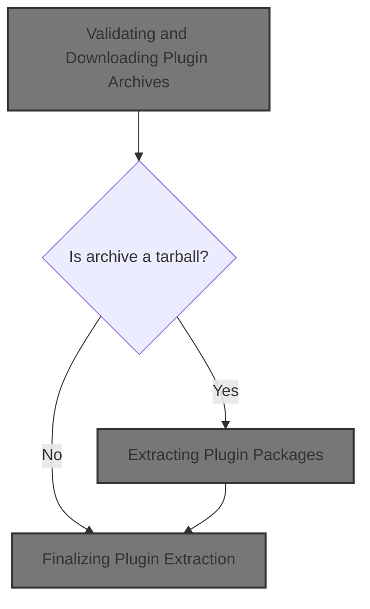

This document describes how plugin archives are downloaded and extracted to make new plugins available. The flow accepts a plugin archive URL and checksum, verifies the source and integrity, and either extracts the plugin files or saves the archive, depending on its type.



# Validating and Downloading Plugin Archives

<SwmSnippet path="/app/electron/plugin-management.ts" line="689">

---

In <SwmToken path="app/electron/plugin-management.ts" pos="689:4:4" line-data="async function downloadAndExtractSingleArchive(">`downloadAndExtractSingleArchive`</SwmToken>, we kick off by validating the archive URL to make sure it's from an allowed source. If the URL doesn't pass, we bail out immediately. Next, we check for missing metadata (URL or checksum) and throw if anything's off. This upfront validation prevents us from downloading or extracting anything sketchy.

```typescript
async function downloadAndExtractSingleArchive(
  archiveURL: string,
  archiveChecksum: string,
  extractFolder: string,
  progressCallback: null | ProgressCallback,
  signal: AbortSignal | null,
  tarStrip = 1
): Promise<void> {
  if (!validateArchiveURL(archiveURL)) {
    throw new Error('Invalid plugin/archive-url:' + archiveURL);
  }

  if (!archiveURL || !archiveChecksum) {
    throw new Error('Invalid plugin metadata. Please check the plugin details.');
  }

```

---

</SwmSnippet>

<SwmSnippet path="/app/electron/plugin-management.ts" line="439">

---

<SwmToken path="app/electron/plugin-management.ts" pos="439:2:2" line-data="function validateArchiveURL(archiveURL: string): boolean {">`validateArchiveURL`</SwmToken> filters out any <SwmToken path="app/electron/plugin-management.ts" pos="443:16:16" line-data="  // For testing purposes, we allow localhost URLs.">`URLs`</SwmToken> that aren't from trusted git hosts or a specific repo, and allows localhost only in test mode.

```typescript
function validateArchiveURL(archiveURL: string): boolean {
  const githubRegex = /^https:\/\/github\.com\/[^/]+\/[^/]+\/(releases|archive)\/.*$/;
  const bitbucketRegex = /^https:\/\/bitbucket\.org\/[^/]+\/[^/]+\/(downloads|get)\/.*$/;
  const gitlabRegex = /^https:\/\/gitlab\.com\/[^/]+\/[^/]+\/(-\/archive|releases)\/.*$/;
  // For testing purposes, we allow localhost URLs.
  const localRegex = /^https?:\/\/localhost(:\d+)?\/.*$/;

  // @todo There is a test plugin at https://github.com/yolossn/headlamp-plugins/
  // need to move that somewhere else, or test differently.

  const urlGood =
    githubRegex.test(archiveURL) ||
    bitbucketRegex.test(archiveURL) ||
    gitlabRegex.test(archiveURL) ||
    archiveURL.startsWith('https://github.com/yolossn/headlamp-plugins/');

  if (process.env.NODE_ENV === 'test') {
    return urlGood || localRegex.test(archiveURL);
  }
  return urlGood;
}
```

---

</SwmSnippet>

<SwmSnippet path="/app/electron/plugin-management.ts" line="705">

---

After validating the URL, we normalize the checksum, check for cancellation, and fetch the archive. If anything fails, we throw.

```typescript
  let checksum = archiveChecksum;
  if (checksum.startsWith('sha256:') || checksum.startsWith('SHA256:')) {
    checksum = checksum.replace('sha256:', '');
    checksum = checksum.replace('SHA256:', '');
  }

  if (signal && signal.aborted) {
    throw new Error('Download cancelled');
  }

  // await sleep(4000); // comment out for testing
  let archResponse;

  try {
    archResponse = await fetch(archiveURL, { redirect: 'follow', signal });
  } catch (err) {
    throw new Error('Failed to fetch archive. Please check the URL and your network connection.');
  }

  if (!archResponse.ok) {
    throw new Error(`Failed to download file. Status code: ${archResponse.status}`);
  }

  if (signal && signal.aborted) {
    throw new Error('Download cancelled');
  }

  const archChunks: Uint8Array[] = [];
  let archBufferLength = 0;

  if (!archResponse.body) {
    throw new Error('Download empty');
  }

  // @ts-ignore this code is using Node.js stream API, and it works.
  for await (const chunk of archResponse.body) {
    archChunks.push(chunk);
    archBufferLength += chunk.length;
  }
```

---

</SwmSnippet>

<SwmSnippet path="/app/electron/plugin-management.ts" line="745">

---

Here we hash the downloaded archive and compare it to the expected checksum. If it doesn't match, we throw. This step makes sure the archive is legit before we move on to extraction and updating the plugin manager.

```typescript
  const archBuffer = Buffer.concat(archChunks, archBufferLength);

  const computedChecksum = crypto.createHash('sha256').update(archBuffer).digest('hex');
  if (computedChecksum !== checksum) {
    throw new Error('Checksum mismatch.');
  }

  if (signal && signal.aborted) {
    throw new Error('Download cancelled');
  }

```

---

</SwmSnippet>

<SwmSnippet path="/app/electron/plugin-management.ts" line="756">

---

After updating the plugin manager, <SwmToken path="app/electron/plugin-management.ts" pos="689:4:4" line-data="async function downloadAndExtractSingleArchive(">`downloadAndExtractSingleArchive`</SwmToken> checks if the archive is a tarball by looking at the file extension and URL. If it is, we prep for extraction and notify progress. This sets up the next step where we actually unpack the archive.

```typescript
  // Determine if this is a tar.gz archive or a plain file
  const isTarGz =
    archiveURL.endsWith('.tar.gz') ||
    archiveURL.endsWith('.tgz') ||
    archiveURL.endsWith('.tar') ||
    archiveURL.includes('.tar.gz?') ||
    archiveURL.includes('.tgz?') ||
    archiveURL.includes('.tar?');

  if (isTarGz) {
    if (progressCallback) {
      progressCallback({
        type: 'info',
        message: 'Extracting plugin',
      });
    }
```

---

</SwmSnippet>

<SwmSnippet path="/app/electron/plugin-management.ts" line="772">

---

After prepping for extraction in <SwmToken path="app/electron/plugin-management.ts" pos="689:4:4" line-data="async function downloadAndExtractSingleArchive(">`downloadAndExtractSingleArchive`</SwmToken>, we pipe the archive buffer through gunzip and tar extraction streams. This unpacks the plugin files directly into the target folder, stripping directory levels as needed. If anything goes wrong, errors are handled by the stream events.

```typescript
    // Extract the archive
    const archStream = new stream.PassThrough();
    archStream.end(archBuffer);

    const extractStream: stream.Writable = archStream.pipe(zlib.createGunzip()).pipe(
      tar.extract({
        cwd: extractFolder,
        strip: tarStrip,
        sync: true,
      }) as unknown as stream.Writable
    );

```

---

</SwmSnippet>

## Extracting Plugin Packages

```mermaid
%%{init: {"flowchart": {"defaultRenderer": "elk"}} }%%
flowchart TD
  node1["Check if source plugin packages path exists"]
  click node1 openCode "plugins/pluginctl/bin/pluginctl.js:43:46"
  node1 -->|"No"| node2["Abort: Source path does not exist, return failure"]
  click node2 openCode "plugins/pluginctl/bin/pluginctl.js:44:45"
  node1 -->|"Yes"| node3{"Does output plugins folder exist?"}
  click node3 openCode "plugins/pluginctl/bin/pluginctl.js:47:52"
  node3 -->|"No"| node4["Create output plugins folder"]
  click node4 openCode "plugins/pluginctl/bin/pluginctl.js:48:51"
  node3 -->|"Yes"| node5["Try extracting single package"]
  click node5 openCode "plugins/pluginctl/bin/pluginctl.js:57:85"
  node4 --> node5
  node5 --> node6["Try extracting folder of packages"]
  click node6 openCode "plugins/pluginctl/bin/pluginctl.js:87:123"
  subgraph loop1["For each package in folder"]
    node6 --> node11["Copy package files and metadata"]
    click node11 openCode "plugins/pluginctl/bin/pluginctl.js:99:121"
    node11 --> node6
  end
  node5 --> node7{"Was extraction successful?"}
  node6 --> node7
  click node7 openCode "plugins/pluginctl/bin/pluginctl.js:125:130"
  node7 -->|"No"| node8["Abort: No packages found, return failure"]
  click node8 openCode "plugins/pluginctl/bin/pluginctl.js:126:129"
  node7 -->|"Yes"| node9["Extraction complete, return success"]
  click node9 openCode "plugins/pluginctl/bin/pluginctl.js:132:133"
classDef HeadingStyle fill:#777777,stroke:#333,stroke-width:2px;

%% Swimm:
%% %%{init: {"flowchart": {"defaultRenderer": "elk"}} }%%
%% flowchart TD
%%   node1["Check if source plugin packages path exists"]
%%   click node1 openCode "<SwmPath>[plugins/…/bin/pluginctl.js](plugins/pluginctl/bin/pluginctl.js)</SwmPath>:43:46"
%%   node1 -->|"No"| node2["Abort: Source path does not exist, return failure"]
%%   click node2 openCode "<SwmPath>[plugins/…/bin/pluginctl.js](plugins/pluginctl/bin/pluginctl.js)</SwmPath>:44:45"
%%   node1 -->|"Yes"| node3{"Does output plugins folder exist?"}
%%   click node3 openCode "<SwmPath>[plugins/…/bin/pluginctl.js](plugins/pluginctl/bin/pluginctl.js)</SwmPath>:47:52"
%%   node3 -->|"No"| node4["Create output plugins folder"]
%%   click node4 openCode "<SwmPath>[plugins/…/bin/pluginctl.js](plugins/pluginctl/bin/pluginctl.js)</SwmPath>:48:51"
%%   node3 -->|"Yes"| node5["Try extracting single package"]
%%   click node5 openCode "<SwmPath>[plugins/…/bin/pluginctl.js](plugins/pluginctl/bin/pluginctl.js)</SwmPath>:57:85"
%%   node4 --> node5
%%   node5 --> node6["Try extracting folder of packages"]
%%   click node6 openCode "<SwmPath>[plugins/…/bin/pluginctl.js](plugins/pluginctl/bin/pluginctl.js)</SwmPath>:87:123"
%%   subgraph loop1["For each package in folder"]
%%     node6 --> node11["Copy package files and metadata"]
%%     click node11 openCode "<SwmPath>[plugins/…/bin/pluginctl.js](plugins/pluginctl/bin/pluginctl.js)</SwmPath>:99:121"
%%     node11 --> node6
%%   end
%%   node5 --> node7{"Was extraction successful?"}
%%   node6 --> node7
%%   click node7 openCode "<SwmPath>[plugins/…/bin/pluginctl.js](plugins/pluginctl/bin/pluginctl.js)</SwmPath>:125:130"
%%   node7 -->|"No"| node8["Abort: No packages found, return failure"]
%%   click node8 openCode "<SwmPath>[plugins/…/bin/pluginctl.js](plugins/pluginctl/bin/pluginctl.js)</SwmPath>:126:129"
%%   node7 -->|"Yes"| node9["Extraction complete, return success"]
%%   click node9 openCode "<SwmPath>[plugins/…/bin/pluginctl.js](plugins/pluginctl/bin/pluginctl.js)</SwmPath>:132:133"
%% classDef HeadingStyle fill:#777777,stroke:#333,stroke-width:2px;
```



<SwmSnippet path="/plugins/pluginctl/bin/pluginctl.js" line="42">

---

In <SwmToken path="plugins/pluginctl/bin/pluginctl.js" pos="42:2:2" line-data="function extract(pluginPackagesPath, outputPlugins, logSteps = true) {">`extract`</SwmToken>, we first check if the input path is a single plugin package by looking for <SwmPath>[plugins/…/.storybook/main.js](plugins/headlamp-plugin/config/.storybook/main.js)</SwmPath>. If not, we treat it as a folder of packages and look for valid plugin folders inside. Only packages with the expected structure get extracted and copied to the output directory.

```javascript
function extract(pluginPackagesPath, outputPlugins, logSteps = true) {
  if (!fs.existsSync(pluginPackagesPath)) {
    console.error(`"${pluginPackagesPath}" does not exist. Not extracting.`);
    return 1;
  }
  if (!fs.existsSync(outputPlugins)) {
    if (logSteps) {
      console.log(`"${outputPlugins}" did not exist, making folder.`);
    }
    fs.mkdirSync(outputPlugins);
  }

  /**
   * pluginPackagesPath is a package folder, not a folder of packages.
   */
  function extractPackage() {
    if (fs.existsSync(path.join(pluginPackagesPath, "dist", "main.js"))) {
      const distPath = path.join(pluginPackagesPath, "dist");
      const trimmedPath =
        pluginPackagesPath.slice(-1) === path.sep
          ? pluginPackagesPath.slice(0, -1)
          : pluginPackagesPath;
      const folderName = trimmedPath.split(path.sep).splice(-1)[0];
      const plugName = path.join(outputPlugins, folderName);

      fs.ensureDirSync(plugName);

      const files = fs.readdirSync(distPath);
      files.forEach((file) => {
        const srcFile = path.join(distPath, file);
        const destFile = path.join(plugName, file);
        console.log(`Copying "${srcFile}" to "${destFile}".`);
        fs.copyFileSync(srcFile, destFile);
      });

      const inputPackageJson = path.join(pluginPackagesPath, "package.json");
      const outputPackageJson = path.join(plugName, "package.json");
      console.log(`Copying "${inputPackageJson}" to "${outputPackageJson}".`);
      fs.copyFileSync(inputPackageJson, outputPackageJson);

      return true;
    }
    return false;
  }

  function extractFolderOfPackages() {
    const folders = fs
      .readdirSync(pluginPackagesPath, { withFileTypes: true })
      .filter((fileName) => {
        return (
          fileName.isDirectory() &&
          fs.existsSync(
            path.join(pluginPackagesPath, fileName.name, "dist", "main.js")
          )
        );
      });

    folders.forEach((folder) => {
      const distPath = path.join(pluginPackagesPath, folder.name, "dist");
      const plugName = path.join(outputPlugins, folder.name);

      fs.ensureDirSync(plugName);

      const files = fs.readdirSync(distPath);
      files.forEach((file) => {
        const srcFile = path.join(distPath, file);
        const destFile = path.join(plugName, file);
        console.log(`Copying "${srcFile}" to "${destFile}".`);
        fs.copyFileSync(srcFile, destFile);
      });

      const inputPackageJson = path.join(
        pluginPackagesPath,
        folder.name,
        "package.json"
      );
      const outputPackageJson = path.join(plugName, "package.json");
      console.log(`Copying "${inputPackageJson}" to "${outputPackageJson}".`);
      fs.copyFileSync(inputPackageJson, outputPackageJson);
    });
    return folders.length !== 0;
  }

  if (!(extractPackage() || extractFolderOfPackages())) {
```

---

</SwmSnippet>

<SwmSnippet path="/plugins/pluginctl/bin/pluginctl.js" line="57">

---

<SwmToken path="plugins/pluginctl/bin/pluginctl.js" pos="57:3:3" line-data="  function extractPackage() {">`extractPackage`</SwmToken> checks for <SwmPath>[plugins/…/.storybook/main.js](plugins/headlamp-plugin/config/.storybook/main.js)</SwmPath> in the source folder, then copies all files from 'dist' and the <SwmPath>[package.json](package.json)</SwmPath> to a new output directory named after the source folder. It uses external variables for source and destination paths, so you need to know their values before calling this.

```javascript
  function extractPackage() {
    if (fs.existsSync(path.join(pluginPackagesPath, "dist", "main.js"))) {
      const distPath = path.join(pluginPackagesPath, "dist");
      const trimmedPath =
        pluginPackagesPath.slice(-1) === path.sep
          ? pluginPackagesPath.slice(0, -1)
          : pluginPackagesPath;
      const folderName = trimmedPath.split(path.sep).splice(-1)[0];
      const plugName = path.join(outputPlugins, folderName);

      fs.ensureDirSync(plugName);

      const files = fs.readdirSync(distPath);
      files.forEach((file) => {
        const srcFile = path.join(distPath, file);
        const destFile = path.join(plugName, file);
        console.log(`Copying "${srcFile}" to "${destFile}".`);
        fs.copyFileSync(srcFile, destFile);
      });

      const inputPackageJson = path.join(pluginPackagesPath, "package.json");
      const outputPackageJson = path.join(plugName, "package.json");
      console.log(`Copying "${inputPackageJson}" to "${outputPackageJson}".`);
      fs.copyFileSync(inputPackageJson, outputPackageJson);

      return true;
    }
    return false;
  }
```

---

</SwmSnippet>

<SwmSnippet path="/plugins/pluginctl/bin/pluginctl.js" line="125">

---

After trying both extraction methods in <SwmToken path="app/electron/plugin-management.ts" pos="777:3:3" line-data="      tar.extract({">`extract`</SwmToken>, if nothing gets copied, we log an error and return a failure code. This makes sure only valid plugins are processed and loaded.

```javascript
  if (!(extractPackage() || extractFolderOfPackages())) {
    console.error(
      `"${pluginPackagesPath}" does not contain packages. Not extracting.`
    );
    return 1;
  }

  return 0;
}
```

---

</SwmSnippet>

<SwmSnippet path="/plugins/pluginctl/bin/pluginctl.js" line="87">

---

<SwmToken path="plugins/pluginctl/bin/pluginctl.js" pos="87:3:3" line-data="  function extractFolderOfPackages() {">`extractFolderOfPackages`</SwmToken> scans subdirectories for valid plugin packages by looking for <SwmPath>[plugins/…/.storybook/main.js](plugins/headlamp-plugin/config/.storybook/main.js)</SwmPath>. For each valid folder, it copies all files from 'dist' and the <SwmPath>[package.json](package.json)</SwmPath> to a new output directory. It relies on external variables for source and destination paths, so the environment needs to be set up correctly.

```javascript
  function extractFolderOfPackages() {
    const folders = fs
      .readdirSync(pluginPackagesPath, { withFileTypes: true })
      .filter((fileName) => {
        return (
          fileName.isDirectory() &&
          fs.existsSync(
            path.join(pluginPackagesPath, fileName.name, "dist", "main.js")
          )
        );
      });

    folders.forEach((folder) => {
      const distPath = path.join(pluginPackagesPath, folder.name, "dist");
      const plugName = path.join(outputPlugins, folder.name);

      fs.ensureDirSync(plugName);

      const files = fs.readdirSync(distPath);
      files.forEach((file) => {
        const srcFile = path.join(distPath, file);
        const destFile = path.join(plugName, file);
        console.log(`Copying "${srcFile}" to "${destFile}".`);
        fs.copyFileSync(srcFile, destFile);
      });

      const inputPackageJson = path.join(
        pluginPackagesPath,
        folder.name,
        "package.json"
      );
      const outputPackageJson = path.join(plugName, "package.json");
      console.log(`Copying "${inputPackageJson}" to "${outputPackageJson}".`);
      fs.copyFileSync(inputPackageJson, outputPackageJson);
    });
    return folders.length !== 0;
  }
```

---

</SwmSnippet>

## Finalizing Plugin Extraction

```mermaid
%%{init: {"flowchart": {"defaultRenderer": "elk"}} }%%
flowchart TD
  node1["Start download and extraction"] --> node2{"Was extraction stream used?"}
  click node1 openCode "app/electron/plugin-management.ts:784:785"
  node2 -->|"Yes"| node3["Extract plugin archive"]
  click node2 openCode "app/electron/plugin-management.ts:784:791"
  node3 --> node4{"Was download cancelled?"}
  click node3 openCode "app/electron/plugin-management.ts:785:791"
  node4 -->|"Yes"| node5["Abort: Download cancelled"]
  click node4 openCode "app/electron/plugin-management.ts:793:795"
  node4 -->|"No"| node6{"Progress reporting enabled?"}
  click node6 openCode "app/electron/plugin-management.ts:797:799"
  node6 -->|"Yes"| node7["Notify user: Plugin extracted"]
  click node7 openCode "app/electron/plugin-management.ts:797:799"
  node6 -->|"No"| node8["Finish: Plugin ready for use"]
  node7 --> node8
  node2 -->|"No"| node9["Check file name safety"]
  click node9 openCode "app/electron/plugin-management.ts:803:813"
  node9 --> node10{"Is file name safe?"}
  click node10 openCode "app/electron/plugin-management.ts:803:813"
  node10 -->|"No (unsafe)"| node11["Abort: Invalid file name"]
  click node11 openCode "app/electron/plugin-management.ts:812:813"
  node10 -->|"Yes (safe)"| node12["Check output path safety"]
  click node12 openCode "app/electron/plugin-management.ts:814:821"
  node12 --> node13{"Is output path safe?"}
  click node13 openCode "app/electron/plugin-management.ts:817:821"
  node13 -->|"No (unsafe)"| node14["Abort: Path traversal detected"]
  click node14 openCode "app/electron/plugin-management.ts:820:821"
  node13 -->|"Yes (safe)"| node15{"Progress reporting enabled?"}
  click node15 openCode "app/electron/plugin-management.ts:823:828"
  node15 -->|"Yes"| node16["Notify user: Saving file"]
  click node16 openCode "app/electron/plugin-management.ts:823:828"
  node15 -->|"No"| node17["Save file"]
  click node17 openCode "app/electron/plugin-management.ts:830:830"
  node16 --> node17
  node17 --> node18{"Progress reporting enabled?"}
  click node18 openCode "app/electron/plugin-management.ts:832:834"
  node18 -->|"Yes"| node19["Notify user: File downloaded"]
  click node19 openCode "app/electron/plugin-management.ts:832:834"
  node18 -->|"No"| node8
  node19 --> node8
  click node8 openCode "app/electron/plugin-management.ts:835:836"

classDef HeadingStyle fill:#777777,stroke:#333,stroke-width:2px;

%% Swimm:
%% %%{init: {"flowchart": {"defaultRenderer": "elk"}} }%%
%% flowchart TD
%%   node1["Start download and extraction"] --> node2{"Was extraction stream used?"}
%%   click node1 openCode "<SwmPath>[app/electron/plugin-management.ts](app/electron/plugin-management.ts)</SwmPath>:784:785"
%%   node2 -->|"Yes"| node3["Extract plugin archive"]
%%   click node2 openCode "<SwmPath>[app/electron/plugin-management.ts](app/electron/plugin-management.ts)</SwmPath>:784:791"
%%   node3 --> node4{"Was download cancelled?"}
%%   click node3 openCode "<SwmPath>[app/electron/plugin-management.ts](app/electron/plugin-management.ts)</SwmPath>:785:791"
%%   node4 -->|"Yes"| node5["Abort: Download cancelled"]
%%   click node4 openCode "<SwmPath>[app/electron/plugin-management.ts](app/electron/plugin-management.ts)</SwmPath>:793:795"
%%   node4 -->|"No"| node6{"Progress reporting enabled?"}
%%   click node6 openCode "<SwmPath>[app/electron/plugin-management.ts](app/electron/plugin-management.ts)</SwmPath>:797:799"
%%   node6 -->|"Yes"| node7["Notify user: Plugin extracted"]
%%   click node7 openCode "<SwmPath>[app/electron/plugin-management.ts](app/electron/plugin-management.ts)</SwmPath>:797:799"
%%   node6 -->|"No"| node8["Finish: Plugin ready for use"]
%%   node7 --> node8
%%   node2 -->|"No"| node9["Check file name safety"]
%%   click node9 openCode "<SwmPath>[app/electron/plugin-management.ts](app/electron/plugin-management.ts)</SwmPath>:803:813"
%%   node9 --> node10{"Is file name safe?"}
%%   click node10 openCode "<SwmPath>[app/electron/plugin-management.ts](app/electron/plugin-management.ts)</SwmPath>:803:813"
%%   node10 -->|"No (unsafe)"| node11["Abort: Invalid file name"]
%%   click node11 openCode "<SwmPath>[app/electron/plugin-management.ts](app/electron/plugin-management.ts)</SwmPath>:812:813"
%%   node10 -->|"Yes (safe)"| node12["Check output path safety"]
%%   click node12 openCode "<SwmPath>[app/electron/plugin-management.ts](app/electron/plugin-management.ts)</SwmPath>:814:821"
%%   node12 --> node13{"Is output path safe?"}
%%   click node13 openCode "<SwmPath>[app/electron/plugin-management.ts](app/electron/plugin-management.ts)</SwmPath>:817:821"
%%   node13 -->|"No (unsafe)"| node14["Abort: Path traversal detected"]
%%   click node14 openCode "<SwmPath>[app/electron/plugin-management.ts](app/electron/plugin-management.ts)</SwmPath>:820:821"
%%   node13 -->|"Yes (safe)"| node15{"Progress reporting enabled?"}
%%   click node15 openCode "<SwmPath>[app/electron/plugin-management.ts](app/electron/plugin-management.ts)</SwmPath>:823:828"
%%   node15 -->|"Yes"| node16["Notify user: Saving file"]
%%   click node16 openCode "<SwmPath>[app/electron/plugin-management.ts](app/electron/plugin-management.ts)</SwmPath>:823:828"
%%   node15 -->|"No"| node17["Save file"]
%%   click node17 openCode "<SwmPath>[app/electron/plugin-management.ts](app/electron/plugin-management.ts)</SwmPath>:830:830"
%%   node16 --> node17
%%   node17 --> node18{"Progress reporting enabled?"}
%%   click node18 openCode "<SwmPath>[app/electron/plugin-management.ts](app/electron/plugin-management.ts)</SwmPath>:832:834"
%%   node18 -->|"Yes"| node19["Notify user: File downloaded"]
%%   click node19 openCode "<SwmPath>[app/electron/plugin-management.ts](app/electron/plugin-management.ts)</SwmPath>:832:834"
%%   node18 -->|"No"| node8
%%   node19 --> node8
%%   click node8 openCode "<SwmPath>[app/electron/plugin-management.ts](app/electron/plugin-management.ts)</SwmPath>:835:836"
%% 
%% classDef HeadingStyle fill:#777777,stroke:#333,stroke-width:2px;
```



<SwmSnippet path="/app/electron/plugin-management.ts" line="784">

---

After extraction in <SwmToken path="app/electron/plugin-management.ts" pos="689:4:4" line-data="async function downloadAndExtractSingleArchive(">`downloadAndExtractSingleArchive`</SwmToken>, we wait for the extraction stream to finish or error out. If it's not a tarball, we do extra checks to make sure the filename is safe and doesn't allow path traversal, then save the file and update progress. This wraps up the archive handling.

```typescript
    await new Promise<void>((resolve, reject) => {
      extractStream.on('finish', () => {
        resolve();
      });
      extractStream.on('error', err => {
        reject(err);
      });
    });

    if (signal && signal.aborted) {
      throw new Error('Download cancelled');
    }

    if (progressCallback) {
      progressCallback({ type: 'info', message: 'Plugin extracted' });
    }
  } else {
    // Only allow safe filenames (no path traversal, no absolute paths)
    // Note: we also have an allow list of trusted domains, so this is just an extra check.
    const fileName = path.basename(archiveURL.split('?')[0]);
    if (
      fileName.includes('..') ||
      fileName.startsWith('/') ||
      fileName.startsWith('\\') ||
      fileName === '' ||
      fileName === '.' ||
      fileName === '..'
    ) {
      throw new Error('Invalid file name in archive URL');
    }
    const outPath = path.join(extractFolder, fileName);

    // Ensure the output path is within the extractFolder
    const resolvedOutPath = path.resolve(outPath);
    const resolvedExtractFolder = path.resolve(extractFolder);
    if (!resolvedOutPath.startsWith(resolvedExtractFolder + path.sep)) {
      throw new Error('Attempted path traversal in file name');
    }

    if (progressCallback) {
      progressCallback({
        type: 'info',
        message: `Saving file to ${outPath}`,
      });
    }

    fs.writeFileSync(outPath, archBuffer, { mode: 0o755 });

    if (progressCallback) {
      progressCallback({ type: 'info', message: 'File downloaded' });
    }
  }
}
```

---

</SwmSnippet>

&nbsp;

*This is an auto-generated document by Swimm 🌊 and has not yet been verified by a human*

<SwmMeta version="3.0.0" repo-id="Z2l0aHViJTNBJTNBdHlwZXNjcmlwdC1oZWFkbGFtcCUzQSUzQXJpY2FyZG9sb3Blemc=" repo-name="typescript-headlamp"><sup>Powered by [Swimm](https://app.swimm.io/)</sup></SwmMeta>
