This document describes the flow for draining a node as part of cluster management. When a user initiates a drain operation, the system sends a request to the backend, monitors progress, updates the interface, and notifies the user of the outcome.


# Where is this flow used?

This flow is used multiple times in the codebase as represented in the following diagram:

```mermaid
graph TD;
      e9d0def7acde2cc2cf60cf448bac8dd94d2962224b0d3295dea4c262e97c1a0a(frontend/…/node/Details.tsx::DrainDialog) --> 4401ef703daeb09f94671784ab5a24b313f5a7ea81f537f40b3a14a49ed37f53(frontend/…/node/Details.tsx::handleNodeDrain):::mainFlowStyle

899eb91cc955de10d38d9ac530fd2a8a17deef959249cddd50f0defebe6bea7b(frontend/…/node/Details.tsx::NodeDetails) --> 4401ef703daeb09f94671784ab5a24b313f5a7ea81f537f40b3a14a49ed37f53(frontend/…/node/Details.tsx::handleNodeDrain):::mainFlowStyle


classDef mainFlowStyle color:#000000,fill:#7CB9F4
classDef rootsStyle color:#000000,fill:#00FFF4
classDef Style1 color:#000000,fill:#00FFAA
classDef Style2 color:#000000,fill:#FFFF00
classDef Style3 color:#000000,fill:#AA7CB9

%% Swimm:
%% graph TD;
%%       e9d0def7acde2cc2cf60cf448bac8dd94d2962224b0d3295dea4c262e97c1a0a(<SwmPath>[frontend/…/node/Details.tsx](frontend/src/components/node/Details.tsx)</SwmPath>::<SwmToken path="frontend/src/components/node/Details.tsx" pos="184:3:3" line-data="  function DrainDialog() {">`DrainDialog`</SwmToken>) --> 4401ef703daeb09f94671784ab5a24b313f5a7ea81f537f40b3a14a49ed37f53(<SwmPath>[frontend/…/node/Details.tsx](frontend/src/components/node/Details.tsx)</SwmPath>::<SwmToken path="frontend/src/components/node/Details.tsx" pos="153:3:3" line-data="  function handleNodeDrain(node: Node) {">`handleNodeDrain`</SwmToken>):::mainFlowStyle
%% 
%% 899eb91cc955de10d38d9ac530fd2a8a17deef959249cddd50f0defebe6bea7b(<SwmPath>[frontend/…/node/Details.tsx](frontend/src/components/node/Details.tsx)</SwmPath>::<SwmToken path="frontend/src/components/node/Details.tsx" pos="58:6:6" line-data="export default function NodeDetails(props: { name?: string; cluster?: string }) {">`NodeDetails`</SwmToken>) --> 4401ef703daeb09f94671784ab5a24b313f5a7ea81f537f40b3a14a49ed37f53(<SwmPath>[frontend/…/node/Details.tsx](frontend/src/components/node/Details.tsx)</SwmPath>::<SwmToken path="frontend/src/components/node/Details.tsx" pos="153:3:3" line-data="  function handleNodeDrain(node: Node) {">`handleNodeDrain`</SwmToken>):::mainFlowStyle
%% 
%% 
%% classDef mainFlowStyle color:#000000,fill:#7CB9F4
%% classDef rootsStyle color:#000000,fill:#00FFF4
%% classDef Style1 color:#000000,fill:#00FFAA
%% classDef Style2 color:#000000,fill:#FFFF00
%% classDef Style3 color:#000000,fill:#AA7CB9
```



# Triggering the Node Drain Operation


<SwmSnippet path="/frontend/src/components/node/Details.tsx" line="153">

---

In <SwmToken path="frontend/src/components/node/Details.tsx" pos="153:3:3" line-data="  function handleNodeDrain(node: Node) {">`handleNodeDrain`</SwmToken>, we kick off the node drain process by grabbing the current cluster and marking the drain as in progress for the UI. The function expects the node object to have a [metadata.name](http://metadata.name) property, which is used to identify the node. We then dispatch a <SwmToken path="frontend/src/components/node/Details.tsx" pos="159:1:1" line-data="      clusterAction(">`clusterAction`</SwmToken> that calls <SwmToken path="frontend/src/components/node/Details.tsx" pos="161:1:1" line-data="          drainNode(cluster, node.metadata.name)">`drainNode`</SwmToken>, which actually starts the drain operation on the backend. This sets up the rest of the flow, including status polling and UI updates.

```tsx
  function handleNodeDrain(node: Node) {
    const cluster = getCluster();
    if (!cluster) return;

    setisNodeDrainInProgress(true);
    dispatch(
      clusterAction(
        () =>
          drainNode(cluster, node.metadata.name)
```

---

</SwmSnippet>

## Sending the Drain Request to the Backend

<SwmSnippet path="/frontend/src/lib/k8s/api/v1/drainNode.ts" line="36">

---

<SwmToken path="frontend/src/lib/k8s/api/v1/drainNode.ts" pos="36:4:4" line-data="export function drainNode(cluster: string, nodeName: string) {">`drainNode`</SwmToken> sends the drain request to the backend using <SwmToken path="frontend/src/lib/k8s/api/v1/drainNode.ts" pos="39:3:3" line-data="  return backendFetch(&#39;/drain-node&#39;, {">`backendFetch`</SwmToken>, which takes care of auth and error handling.

```typescript
export function drainNode(cluster: string, nodeName: string) {
  const headers = addBackstageAuthHeaders(JSON_HEADERS);

  return backendFetch('/drain-node', {
    method: 'POST',
    headers: headers,
    body: JSON.stringify({
      cluster,
      nodeName,
    }),
  }).then(response => {
    return response.json().then(data => {
      if (!response.ok) {
        throw new Error('Something went wrong');
      }
      return data;
    });
  });
}
```

---

</SwmSnippet>

<SwmSnippet path="/frontend/src/lib/k8s/api/v2/fetch.ts" line="38">

---

<SwmToken path="frontend/src/lib/k8s/api/v2/fetch.ts" pos="38:6:6" line-data="export async function backendFetch(url: string | URL, init: RequestInit = {}) {">`backendFetch`</SwmToken> sends the request with auth, handles backend reload signals, and throws detailed errors if the response isn't ok.

```typescript
export async function backendFetch(url: string | URL, init: RequestInit = {}) {
  // Always include credentials
  init.credentials = 'include';
  init.headers = addBackstageAuthHeaders(init.headers);
  const response = await fetch(makeUrl([getAppUrl(), url]), init);

  // The backend signals through this header that it wants a reload.
  // See plugins.go
  const headerVal = response.headers.get('X-Reload');
  if (headerVal && headerVal.indexOf('reload') !== -1) {
    window.location.reload();
  }

  if (!response.ok) {
    // Try to parse error message from response
    let maybeErrorMessage: string | undefined;
    try {
      const body = await response.json();
      maybeErrorMessage = typeof body === 'string' ? body : body.message;
    } catch (e) {}

    throw new ApiError(maybeErrorMessage ?? 'Unreachable', { status: response.status });
  }

  return response;
}
```

---

</SwmSnippet>

## Polling for Drain Status

<SwmSnippet path="/frontend/src/components/node/Details.tsx" line="161">

---

Back in <SwmToken path="frontend/src/components/node/Details.tsx" pos="153:3:3" line-data="  function handleNodeDrain(node: Node) {">`handleNodeDrain`</SwmToken>, once <SwmToken path="frontend/src/components/node/Details.tsx" pos="161:1:1" line-data="          drainNode(cluster, node.metadata.name)">`drainNode`</SwmToken> resolves, we immediately call <SwmToken path="frontend/src/components/node/Details.tsx" pos="163:1:1" line-data="              getDrainNodeStatus(cluster, node.metadata.name);">`getDrainNodeStatus`</SwmToken> to start polling for the drain operation's progress. If <SwmToken path="frontend/src/components/node/Details.tsx" pos="161:1:1" line-data="          drainNode(cluster, node.metadata.name)">`drainNode`</SwmToken> throws, we show an error to the user. This keeps the UI in sync with the backend state.

```tsx
          drainNode(cluster, node.metadata.name)
            .then(() => {
              getDrainNodeStatus(cluster, node.metadata.name);
            })
            .catch(error => {
              enqueueSnackbar(error.message, { variant: 'error' });
            })
            .finally(() => {
```

---

</SwmSnippet>

## Checking and Updating Node Drain Progress


<SwmSnippet path="/frontend/src/components/node/Details.tsx" line="126">

---

In <SwmToken path="frontend/src/components/node/Details.tsx" pos="126:3:3" line-data="  function getDrainNodeStatus(cluster: string, nodeName: string) {">`getDrainNodeStatus`</SwmToken>, we start polling the backend for the drain status using <SwmToken path="frontend/src/components/node/Details.tsx" pos="127:1:1" line-data="    setTimeout(() =&gt; {">`setTimeout`</SwmToken> and <SwmToken path="frontend/src/components/node/Details.tsx" pos="128:1:1" line-data="      drainNodeStatus(cluster, nodeName)">`drainNodeStatus`</SwmToken>. The function checks the returned [data.id](http://data.id) to decide if we should keep polling, show an error, or update the node state. Polling is hardcoded to 1 second intervals, and node state is updated when the drain is done.

```tsx
  function getDrainNodeStatus(cluster: string, nodeName: string) {
    setTimeout(() => {
      drainNodeStatus(cluster, nodeName)
        .then(data => {
          if (data && data.id.startsWith('error')) {
            enqueueSnackbar(data.id, { variant: 'error' });
            return;
          }
```

---

</SwmSnippet>

<SwmSnippet path="/frontend/src/lib/k8s/api/v1/drainNode.ts" line="77">

---

<SwmToken path="frontend/src/lib/k8s/api/v1/drainNode.ts" pos="77:21:21" line-data="export function drainNodeStatus(cluster: string, nodeName: string): Promise&lt;DrainNodeStatus&gt; {">`DrainNodeStatus`</SwmToken> sends a GET request to /drain-node-status with cluster and <SwmToken path="frontend/src/lib/k8s/api/v1/drainNode.ts" pos="77:12:12" line-data="export function drainNodeStatus(cluster: string, nodeName: string): Promise&lt;DrainNodeStatus&gt; {">`nodeName`</SwmToken>, using <SwmToken path="frontend/src/lib/k8s/api/v1/drainNode.ts" pos="79:3:3" line-data="  return backendFetch(`/drain-node-status?cluster=${cluster}&amp;nodeName=${nodeName}`, {">`backendFetch`</SwmToken> for auth and error handling. The response is parsed as <SwmToken path="frontend/src/lib/k8s/api/v1/drainNode.ts" pos="77:21:21" line-data="export function drainNodeStatus(cluster: string, nodeName: string): Promise&lt;DrainNodeStatus&gt; {">`DrainNodeStatus`</SwmToken> so we can check the drain progress in <SwmToken path="frontend/src/components/node/Details.tsx" pos="126:3:3" line-data="  function getDrainNodeStatus(cluster: string, nodeName: string) {">`getDrainNodeStatus`</SwmToken>.

```typescript
export function drainNodeStatus(cluster: string, nodeName: string): Promise<DrainNodeStatus> {
  const headers = addBackstageAuthHeaders(JSON_HEADERS);
  return backendFetch(`/drain-node-status?cluster=${cluster}&nodeName=${nodeName}`, {
    method: 'GET',
    headers: headers,
  }).then(response => {
    return response.json().then((data: DrainNodeStatus) => {
      if (!response.ok) {
        throw new Error('Something went wrong');
      }
      return data;
    });
  });
}
```

---

</SwmSnippet>

<SwmSnippet path="/frontend/src/components/node/Details.tsx" line="134">

---

After returning from <SwmToken path="frontend/src/components/node/Details.tsx" pos="128:1:1" line-data="      drainNodeStatus(cluster, nodeName)">`drainNodeStatus`</SwmToken> in <SwmToken path="frontend/src/components/node/Details.tsx" pos="135:1:1" line-data="            getDrainNodeStatus(cluster, nodeName);">`getDrainNodeStatus`</SwmToken>, if the drain is still running, we keep polling. If it's done, we clone the node and toggle its unschedulable status, then update the UI state. Errors are shown to the user. The function relies on node and <SwmToken path="frontend/src/components/node/Details.tsx" pos="141:1:1" line-data="          setNode(cloneNode);">`setNode`</SwmToken> from outer scope, and the polling interval is fixed at 1 second.

```tsx
          if (data && data.id !== 'success') {
            getDrainNodeStatus(cluster, nodeName);
            return;
          }
          const cloneNode = _.cloneDeep(node);

          cloneNode!.spec.unschedulable = !node!.spec.unschedulable;
          setNode(cloneNode);
        })
        .catch(error => {
          enqueueSnackbar(error.message, { variant: 'error' });
        });
    }, 1000);
  }
```

---

</SwmSnippet>

## Finalizing the Drain Operation


<SwmSnippet path="/frontend/src/components/node/Details.tsx" line="169">

---

After <SwmToken path="frontend/src/components/node/Details.tsx" pos="126:3:3" line-data="  function getDrainNodeStatus(cluster: string, nodeName: string) {">`getDrainNodeStatus`</SwmToken> finishes in <SwmToken path="frontend/src/components/node/Details.tsx" pos="153:3:3" line-data="  function handleNodeDrain(node: Node) {">`handleNodeDrain`</SwmToken>, we reset the drain in progress state and show a message based on the outcome. The function uses the node's [metadata.name](http://metadata.name) for all messages and relies on repository-specific hooks for UI updates and cancellation handling.

```tsx
              setisNodeDrainInProgress(false);
            }),
        {
          startMessage: t('Draining node {{name}}…', { name: node.metadata.name }),
          successMessage: t('Drained node {{name}}.', { name: node.metadata.name }),
          errorMessage: t('Failed to drain node {{name}}.', { name: node.metadata.name }),
          cancelledMessage: t('Draining node {{name}} cancelled.', { name: node.metadata.name }),
          cancelCallback: () => {
            setisNodeDrainInProgress(false);
          },
        }
      )
    );
  }
```

---

</SwmSnippet>

&nbsp;

*This is an auto-generated document by Swimm 🌊 and has not yet been verified by a human*

<SwmMeta version="3.0.0" repo-id="Z2l0aHViJTNBJTNBdHlwZXNjcmlwdC1oZWFkbGFtcCUzQSUzQXJpY2FyZG9sb3Blemc=" repo-name="typescript-headlamp"><sup>Powered by [Swimm](https://app.swimm.io/)</sup></SwmMeta>
