This document describes how users can edit and update the name of a cluster within the settings. The flow covers displaying the current name, validating user input for format and uniqueness, and applying the change so that the new name is reflected throughout the application.

# Editing and Validating Cluster Names

```mermaid
%%{init: {"flowchart": {"defaultRenderer": "elk"}} }%%
flowchart TD
  node1["User views current cluster name (original or custom)"]
  click node1 openCode "frontend/src/components/App/Settings/ClusterNameEditor.tsx:55:59"
  node1 --> node2["User enters new cluster name"]
  click node2 openCode "frontend/src/components/App/Settings/ClusterNameEditor.tsx:199:204"
  node2 --> node3{"Is new name valid?"}
  click node3 openCode "frontend/src/components/App/Settings/ClusterNameEditor.tsx:191:211"
  node3 -->|"Yes"| node4{"Is new name already in use?"}
  click node4 openCode "frontend/src/components/App/Settings/ClusterNameEditor.tsx:204:215"
  node3 -->|"No"| node5["Show invalid name format message"]
  click node5 openCode "frontend/src/components/App/Settings/ClusterNameEditor.tsx:210:211"
  node4 -->|"No"| node6["User confirms name change"]
  click node6 openCode "frontend/src/components/App/Settings/ClusterNameEditor.tsx:225:238"
  node4 -->|"Yes"| node7["Show name already in use message"]
  click node7 openCode "frontend/src/components/App/Settings/ClusterNameEditor.tsx:214:215"
  node6 --> node8["Apply name change and update cluster settings"]
  click node8 openCode "frontend/src/components/App/Settings/ClusterNameEditor.tsx:227:244"
  node8 --> node9{"Did backend update succeed?"}
  click node9 openCode "frontend/src/components/App/Settings/ClusterNameEditor.tsx:182:185"
  node9 -->|"Yes"| node10["Show success and refresh UI"]
  click node10 openCode "frontend/src/components/App/Settings/ClusterNameEditor.tsx:179:180"
  node9 -->|"No"| node11["Show error dialog"]
  click node11 openCode "frontend/src/components/App/Settings/ClusterNameEditor.tsx:184:185"
classDef HeadingStyle fill:#777777,stroke:#333,stroke-width:2px;

%% Swimm:
%% %%{init: {"flowchart": {"defaultRenderer": "elk"}} }%%
%% flowchart TD
%%   node1["User views current cluster name (original or custom)"]
%%   click node1 openCode "<SwmPath>[frontend/…/Settings/ClusterNameEditor.tsx](frontend/src/components/App/Settings/ClusterNameEditor.tsx)</SwmPath>:55:59"
%%   node1 --> node2["User enters new cluster name"]
%%   click node2 openCode "<SwmPath>[frontend/…/Settings/ClusterNameEditor.tsx](frontend/src/components/App/Settings/ClusterNameEditor.tsx)</SwmPath>:199:204"
%%   node2 --> node3{"Is new name valid?"}
%%   click node3 openCode "<SwmPath>[frontend/…/Settings/ClusterNameEditor.tsx](frontend/src/components/App/Settings/ClusterNameEditor.tsx)</SwmPath>:191:211"
%%   node3 -->|"Yes"| node4{"Is new name already in use?"}
%%   click node4 openCode "<SwmPath>[frontend/…/Settings/ClusterNameEditor.tsx](frontend/src/components/App/Settings/ClusterNameEditor.tsx)</SwmPath>:204:215"
%%   node3 -->|"No"| node5["Show invalid name format message"]
%%   click node5 openCode "<SwmPath>[frontend/…/Settings/ClusterNameEditor.tsx](frontend/src/components/App/Settings/ClusterNameEditor.tsx)</SwmPath>:210:211"
%%   node4 -->|"No"| node6["User confirms name change"]
%%   click node6 openCode "<SwmPath>[frontend/…/Settings/ClusterNameEditor.tsx](frontend/src/components/App/Settings/ClusterNameEditor.tsx)</SwmPath>:225:238"
%%   node4 -->|"Yes"| node7["Show name already in use message"]
%%   click node7 openCode "<SwmPath>[frontend/…/Settings/ClusterNameEditor.tsx](frontend/src/components/App/Settings/ClusterNameEditor.tsx)</SwmPath>:214:215"
%%   node6 --> node8["Apply name change and update cluster settings"]
%%   click node8 openCode "<SwmPath>[frontend/…/Settings/ClusterNameEditor.tsx](frontend/src/components/App/Settings/ClusterNameEditor.tsx)</SwmPath>:227:244"
%%   node8 --> node9{"Did backend update succeed?"}
%%   click node9 openCode "<SwmPath>[frontend/…/Settings/ClusterNameEditor.tsx](frontend/src/components/App/Settings/ClusterNameEditor.tsx)</SwmPath>:182:185"
%%   node9 -->|"Yes"| node10["Show success and refresh UI"]
%%   click node10 openCode "<SwmPath>[frontend/…/Settings/ClusterNameEditor.tsx](frontend/src/components/App/Settings/ClusterNameEditor.tsx)</SwmPath>:179:180"
%%   node9 -->|"No"| node11["Show error dialog"]
%%   click node11 openCode "<SwmPath>[frontend/…/Settings/ClusterNameEditor.tsx](frontend/src/components/App/Settings/ClusterNameEditor.tsx)</SwmPath>:184:185"
%% classDef HeadingStyle fill:#777777,stroke:#333,stroke-width:2px;
```



<SwmSnippet path="/frontend/src/components/App/Settings/ClusterNameEditor.tsx" line="40">

---

In <SwmToken path="frontend/src/components/App/Settings/ClusterNameEditor.tsx" pos="40:4:4" line-data="export function ClusterNameEditor({">`ClusterNameEditor`</SwmToken>, we start by pulling cluster metadata and settings to figure out what name to show and how to handle renaming. We check both the display name and the original name for uniqueness, using <SwmToken path="frontend/src/components/App/Settings/ClusterNameEditor.tsx" pos="42:1:1" line-data="  clusterConf,">`clusterConf`</SwmToken> to avoid collisions. The UI shows the original name only for clusters loaded from kubeconfig sources. If the user tries to rename, we need to call the <SwmToken path="frontend/src/components/App/Settings/ClusterNameEditor.tsx" pos="23:23:23" line-data="import { parseKubeConfig, renameCluster } from &#39;../../../lib/k8s/api/v1/clusterApi&#39;;">`clusterApi`</SwmToken> next to actually perform the rename on the backend and update the config, since frontend checks alone aren't enough.

```tsx
export function ClusterNameEditor({
  cluster,
  clusterConf,
  clusterSettings,
  setClusterSettings,
}: ClusterNameEditorProps) {
  const { t } = useTranslation(['translation']);
  const [customNameInUse, setCustomNameInUse] = React.useState(false);
  const [clusterErrorDialogOpen, setClusterErrorDialogOpen] = React.useState(false);
  const [clusterErrorDialogMessage, setClusterErrorDialogMessage] = React.useState('');
  const [newClusterName, setNewClusterName] = React.useState(cluster || '');

  const dispatch = useDispatch();
  const history = useHistory();

  React.useEffect(() => {
    if (clusterSettings?.currentName !== cluster) {
      setNewClusterName(clusterSettings?.currentName || '');
    }
  }, [cluster, clusterSettings]);

  const clusterInfo = (clusterConf && clusterConf[cluster || '']) || null;
  const source = clusterInfo?.meta_data?.source;
  const originalName = clusterInfo?.meta_data?.originalName;
  const displayName = originalName || (clusterInfo ? clusterInfo.name : '');

  /** Note: display original name is currently only supported for non dynamic clusters from kubeconfig sources. */
  const clusterID = clusterInfo?.meta_data?.clusterID || '';

  const invalidClusterNameMessage = t(
    "translation|Cluster name must contain only lowercase alphanumeric characters or '-', and must start and end with an alphanumeric character."
  );

  /**
   * This function is part of a double check, this is meant to check all the cluster names currently in use as display names
   * Note: if the metadata is not available or does not load, another check is done in the backend to ensure the name is unique in its own config
   *
   * @param name The name to check.
   * @returns bool of if the name is in use.
   */
  function checkNameInUse(name: string) {
    if (!clusterConf) {
      return false;
    }
    /** These are the display names of the clusters, renamed clusters have their display name as the custom name */
    const clusterNames = Object.values(clusterConf).map(cluster => cluster.name);

    /** The original name of the cluster is the name used in the kubeconfig file. */
    const originalNames = Object.values(clusterConf)
      .map(cluster => cluster.meta_data?.originalName)
      .filter(originalName => originalName !== undefined);

    const allNames = [...clusterNames, ...originalNames];

    const nameInUse = allNames.includes(name);

    setCustomNameInUse(nameInUse);
  }

  function ClusterErrorDialog() {
    return (
      <ConfirmDialog
        onConfirm={() => {
          setClusterErrorDialogOpen(false);
        }}
        handleClose={() => {
          setClusterErrorDialogOpen(false);
        }}
        hideCancelButton
        open={clusterErrorDialogOpen}
        title={t('translation|Error')}
        description={clusterErrorDialogMessage}
        confirmLabel={t('translation|Okay')}
      ></ConfirmDialog>
    );
  }
  // Display the original name of the cluster if it was loaded from a kubeconfig file.
  function ClusterName() {
    const currentName = clusterInfo?.name;
    const originalName = clusterInfo?.meta_data?.originalName;
    const source = clusterInfo?.meta_data?.source;
    // Note: display original name is currently only supported for non dynamic clusters from kubeconfig sources.
    const displayOriginalName = source === 'kubeconfig' && originalName;

    return (
      <>
        {clusterErrorDialogOpen && <ClusterErrorDialog />}
        <Typography>{t('translation|Name')}</Typography>
        {displayOriginalName && currentName !== displayOriginalName && (
          <Typography variant="body2" color="textSecondary">
            {t('translation|Original name: {{ displayName }}', {
              displayName: displayName,
            })}
          </Typography>
        )}
      </>
    );
  }

  function storeNewClusterName(name: string) {
    let actualName = name;
    if (name === cluster) {
      actualName = '';
      setNewClusterName(actualName);
    }

    setClusterSettings((settings: ClusterSettings | null) => {
      const newSettings = { ...(settings || {}) };
      if (isValidClusterNameFormat(name)) {
        newSettings.currentName = actualName;
      }
      return newSettings;
    });
  }

  const handleUpdateClusterName = (source: string) => {
    try {
      renameCluster(cluster || '', newClusterName, source, clusterID)
        .then(async config => {
```

---

</SwmSnippet>

<SwmSnippet path="/frontend/src/lib/k8s/api/v1/clusterApi.ts" line="193">

---

<SwmToken path="frontend/src/lib/k8s/api/v1/clusterApi.ts" pos="193:6:6" line-data="export async function renameCluster(">`renameCluster`</SwmToken> builds the rename URL using the cluster name, checks if there's a kubeconfig to set the stateless flag, and sends a PUT request with the new name, source, and stateless info. This lets the backend know how to process the rename, depending on whether the cluster is managed via kubeconfig or not.

```typescript
export async function renameCluster(
  /** The name of the cluster to rename */
  cluster: string,
  /** The new name for the cluster */
  newClusterName: string,
  /** The source of the cluster, either 'kubeconfig' or 'dynamic_cluster' */
  source: string,
  /** The ID for a cluster, composed of the kubeconfig path and cluster name */
  clusterID?: string
) {
  let stateless = false;
  let kubeconfig;
  let renameURL = `/cluster/${cluster}`;

  if (cluster) {
    kubeconfig = await findKubeconfigByClusterName(cluster, clusterID);

    renameURL = `/cluster/${cluster}`;

    if (kubeconfig !== null) {
      stateless = true;
    }
  }

  const headers = addBackstageAuthHeaders(JSON_HEADERS);

  return request(
    renameURL,
    {
      method: 'PUT',
      headers: { ...headers, ...getHeadlampAPIHeaders() },
      body: JSON.stringify({ newClusterName, source, stateless }),
    },
    false,
    false
  );
}
```

---

</SwmSnippet>

<SwmSnippet path="/frontend/src/components/App/Settings/ClusterNameEditor.tsx" line="159">

---

Back in <SwmToken path="frontend/src/components/App/Settings/ClusterNameEditor.tsx" pos="40:4:4" line-data="export function ClusterNameEditor({">`ClusterNameEditor`</SwmToken>, after returning from the <SwmToken path="frontend/src/components/App/Settings/ClusterNameEditor.tsx" pos="23:23:23" line-data="import { parseKubeConfig, renameCluster } from &#39;../../../lib/k8s/api/v1/clusterApi&#39;;">`clusterApi`</SwmToken> rename call, we handle the rest of the update: fetch and update kubeconfig if needed, parse it, update Redux state, and finally reload the window to make sure everything is synced. If anything fails, we show an error dialog.

```tsx
          if (cluster) {
            const kubeconfig = await findKubeconfigByClusterName(cluster, clusterID);
            if (kubeconfig !== null) {
              await updateStatelessClusterKubeconfig(kubeconfig, newClusterName, cluster);
              // Make another request for updated kubeconfig
              const updatedKubeconfig = await findKubeconfigByClusterName(cluster, clusterID);
              if (updatedKubeconfig !== null) {
                parseKubeConfig({ kubeconfig: updatedKubeconfig })
                  .then((config: any) => {
                    storeNewClusterName(newClusterName);
                    dispatch(setStatelessConfig(config));
                  })
                  .catch((err: Error) => {
                    console.error('Error updating cluster name:', err.message);
                  });
              }
            } else {
              dispatch(setConfig(config));
            }
          }
          history.push('/');
          window.location.reload();
        })
        .catch((err: Error) => {
          console.error('Error updating cluster name:', err.message);
          setClusterErrorDialogMessage(err.message);
          setClusterErrorDialogOpen(true);
        });
    } catch (error) {
      console.error('Error updating cluster name:', error);
    }
  };
  const isValidCurrentName = isValidClusterNameFormat(newClusterName);

  return (
    <NameValueTable
      rows={[
        {
          name: <ClusterName />,
          value: (
            <TextField
              onChange={event => {
                let value = event.target.value;
                value = value.replace(' ', '');
                setNewClusterName(value);
                checkNameInUse(value);
              }}
              value={newClusterName}
              placeholder={cluster}
              error={!isValidCurrentName || customNameInUse}
              helperText={
                <Typography>
                  {!isValidCurrentName && invalidClusterNameMessage}
                  {customNameInUse &&
                    t(
                      'translation|This custom name is already in use, please choose a different name.'
                    )}
                  {isValidCurrentName &&
                    !customNameInUse &&
                    t('translation|The current name of the cluster. You can define a custom name')}
                </Typography>
              }
              InputProps={{
                endAdornment: (
                  <Box pt={2} textAlign="right">
                    <ConfirmButton
                      onConfirm={() => {
                        if (isValidCurrentName) {
                          handleUpdateClusterName(source);
                        }
                      }}
                      confirmTitle={t('translation|Change name')}
                      confirmDescription={t(
                        'translation|Are you sure you want to change the name for "{{ clusterName }}"?',
                        { clusterName: displayName }
                      )}
                      disabled={!newClusterName || !isValidCurrentName || customNameInUse}
                    >
                      {t('translation|Apply')}
                    </ConfirmButton>
                  </Box>
                ),
                onKeyPress: event => {
                  if (event.key === 'Enter' && isValidCurrentName) {
                    handleUpdateClusterName(source);
                  }
                },
                autoComplete: 'off',
                sx: { maxWidth: 250 },
              }}
            />
          ),
        },
      ]}
    />
  );
}
```

---

</SwmSnippet>

# Applying the Cluster Name Change

```mermaid
%%{init: {"flowchart": {"defaultRenderer": "elk"}} }%%
flowchart TD
  node1["Initiate cluster name update (from source)"] --> node2{"Is there a cluster to update?"}
  click node1 openCode "frontend/src/components/App/Settings/ClusterNameEditor.tsx:155:156"
  node2 -->|"Yes"| node3["Find kubeconfig for cluster"]
  click node2 openCode "frontend/src/components/App/Settings/ClusterNameEditor.tsx:159:160"
  node2 -->|"No"| node8["Update application config with new cluster name"]
  click node8 openCode "frontend/src/components/App/Settings/ClusterNameEditor.tsx:176:177"
  node3 --> node4{"Is kubeconfig found?"}
  click node3 openCode "frontend/src/components/App/Settings/ClusterNameEditor.tsx:160:161"
  node4 -->|"Yes"| node5["Update kubeconfig with new cluster name"]
  click node5 openCode "frontend/src/components/App/Settings/ClusterNameEditor.tsx:162:163"
  node4 -->|"No"| node8
  node5 --> node6{"Is updated kubeconfig found?"}
  click node6 openCode "frontend/src/components/App/Settings/ClusterNameEditor.tsx:164:165"
  node6 -->|"Yes"| node7["Parse updated kubeconfig and store new cluster name"]
  click node7 openCode "frontend/src/components/App/Settings/ClusterNameEditor.tsx:166:170"
  node6 -->|"No"| node8
  node7 --> node9["Navigate to home and reload UI"]
  click node9 openCode "frontend/src/components/App/Settings/ClusterNameEditor.tsx:179:180"
  node8 --> node9
  node9 --> node13["End"]
  node1 --> node10{"Did update fail?"}
  click node10 openCode "frontend/src/components/App/Settings/ClusterNameEditor.tsx:182:186"
  node10 -->|"Yes"| node12["Show error dialog"]
  click node12 openCode "frontend/src/components/App/Settings/ClusterNameEditor.tsx:184:185"
  node10 -->|"No"| node13
  node13["End"]
classDef HeadingStyle fill:#777777,stroke:#333,stroke-width:2px;

%% Swimm:
%% %%{init: {"flowchart": {"defaultRenderer": "elk"}} }%%
%% flowchart TD
%%   node1["Initiate cluster name update (from source)"] --> node2{"Is there a cluster to update?"}
%%   click node1 openCode "<SwmPath>[frontend/…/Settings/ClusterNameEditor.tsx](frontend/src/components/App/Settings/ClusterNameEditor.tsx)</SwmPath>:155:156"
%%   node2 -->|"Yes"| node3["Find kubeconfig for cluster"]
%%   click node2 openCode "<SwmPath>[frontend/…/Settings/ClusterNameEditor.tsx](frontend/src/components/App/Settings/ClusterNameEditor.tsx)</SwmPath>:159:160"
%%   node2 -->|"No"| node8["Update application config with new cluster name"]
%%   click node8 openCode "<SwmPath>[frontend/…/Settings/ClusterNameEditor.tsx](frontend/src/components/App/Settings/ClusterNameEditor.tsx)</SwmPath>:176:177"
%%   node3 --> node4{"Is kubeconfig found?"}
%%   click node3 openCode "<SwmPath>[frontend/…/Settings/ClusterNameEditor.tsx](frontend/src/components/App/Settings/ClusterNameEditor.tsx)</SwmPath>:160:161"
%%   node4 -->|"Yes"| node5["Update kubeconfig with new cluster name"]
%%   click node5 openCode "<SwmPath>[frontend/…/Settings/ClusterNameEditor.tsx](frontend/src/components/App/Settings/ClusterNameEditor.tsx)</SwmPath>:162:163"
%%   node4 -->|"No"| node8
%%   node5 --> node6{"Is updated kubeconfig found?"}
%%   click node6 openCode "<SwmPath>[frontend/…/Settings/ClusterNameEditor.tsx](frontend/src/components/App/Settings/ClusterNameEditor.tsx)</SwmPath>:164:165"
%%   node6 -->|"Yes"| node7["Parse updated kubeconfig and store new cluster name"]
%%   click node7 openCode "<SwmPath>[frontend/…/Settings/ClusterNameEditor.tsx](frontend/src/components/App/Settings/ClusterNameEditor.tsx)</SwmPath>:166:170"
%%   node6 -->|"No"| node8
%%   node7 --> node9["Navigate to home and reload UI"]
%%   click node9 openCode "<SwmPath>[frontend/…/Settings/ClusterNameEditor.tsx](frontend/src/components/App/Settings/ClusterNameEditor.tsx)</SwmPath>:179:180"
%%   node8 --> node9
%%   node9 --> node13["End"]
%%   node1 --> node10{"Did update fail?"}
%%   click node10 openCode "<SwmPath>[frontend/…/Settings/ClusterNameEditor.tsx](frontend/src/components/App/Settings/ClusterNameEditor.tsx)</SwmPath>:182:186"
%%   node10 -->|"Yes"| node12["Show error dialog"]
%%   click node12 openCode "<SwmPath>[frontend/…/Settings/ClusterNameEditor.tsx](frontend/src/components/App/Settings/ClusterNameEditor.tsx)</SwmPath>:184:185"
%%   node10 -->|"No"| node13
%%   node13["End"]
%% classDef HeadingStyle fill:#777777,stroke:#333,stroke-width:2px;
```



<SwmSnippet path="/frontend/src/components/App/Settings/ClusterNameEditor.tsx" line="155">

---

In <SwmToken path="frontend/src/components/App/Settings/ClusterNameEditor.tsx" pos="155:3:3" line-data="  const handleUpdateClusterName = (source: string) =&gt; {">`handleUpdateClusterName`</SwmToken>, we kick off the rename by calling the <SwmToken path="frontend/src/components/App/Settings/ClusterNameEditor.tsx" pos="23:23:23" line-data="import { parseKubeConfig, renameCluster } from &#39;../../../lib/k8s/api/v1/clusterApi&#39;;">`clusterApi`</SwmToken>. This starts a chain of async updates: backend rename, kubeconfig update, config parsing, Redux state update, and finally a page reload. Each step keeps the app and config in sync.

```tsx
  const handleUpdateClusterName = (source: string) => {
    try {
      renameCluster(cluster || '', newClusterName, source, clusterID)
        .then(async config => {
```

---

</SwmSnippet>

<SwmSnippet path="/frontend/src/components/App/Settings/ClusterNameEditor.tsx" line="159">

---

After returning from the <SwmToken path="frontend/src/components/App/Settings/ClusterNameEditor.tsx" pos="23:23:23" line-data="import { parseKubeConfig, renameCluster } from &#39;../../../lib/k8s/api/v1/clusterApi&#39;;">`clusterApi`</SwmToken> rename in <SwmToken path="frontend/src/components/App/Settings/ClusterNameEditor.tsx" pos="155:3:3" line-data="  const handleUpdateClusterName = (source: string) =&gt; {">`handleUpdateClusterName`</SwmToken>, we fetch and update the kubeconfig, parse the new config, and update the Redux store. If there's no kubeconfig, we just update the config directly. The window reload and error dialog make sure the UI stays in sync and the user sees any issues.

```tsx
          if (cluster) {
            const kubeconfig = await findKubeconfigByClusterName(cluster, clusterID);
            if (kubeconfig !== null) {
              await updateStatelessClusterKubeconfig(kubeconfig, newClusterName, cluster);
              // Make another request for updated kubeconfig
              const updatedKubeconfig = await findKubeconfigByClusterName(cluster, clusterID);
              if (updatedKubeconfig !== null) {
                parseKubeConfig({ kubeconfig: updatedKubeconfig })
                  .then((config: any) => {
                    storeNewClusterName(newClusterName);
                    dispatch(setStatelessConfig(config));
                  })
                  .catch((err: Error) => {
                    console.error('Error updating cluster name:', err.message);
                  });
              }
            } else {
              dispatch(setConfig(config));
            }
          }
          history.push('/');
          window.location.reload();
        })
        .catch((err: Error) => {
          console.error('Error updating cluster name:', err.message);
          setClusterErrorDialogMessage(err.message);
          setClusterErrorDialogOpen(true);
        });
    } catch (error) {
      console.error('Error updating cluster name:', error);
    }
  };
```

---

</SwmSnippet>

&nbsp;

*This is an auto-generated document by Swimm 🌊 and has not yet been verified by a human*

<SwmMeta version="3.0.0" repo-id="Z2l0aHViJTNBJTNBdHlwZXNjcmlwdC1oZWFkbGFtcCUzQSUzQXJpY2FyZG9sb3Blemc=" repo-name="typescript-headlamp"><sup>Powered by [Swimm](https://app.swimm.io/)</sup></SwmMeta>
