This document describes how plugins are enabled to display localized content based on the user's language preference. The flow resolves the plugin's identity and supported locales, loads translations, and provides a translation function for UI components.

# Setting up plugin translation state

```mermaid
%%{init: {"flowchart": {"defaultRenderer": "elk"}} }%%
flowchart TD
  node1{"Is plugin name available?"}
  click node1 openCode "frontend/src/plugin/pluginI18n.ts:186:196"
  node1 -->|"Yes"| node2{"Can plugin path be resolved?"}
  click node2 openCode "frontend/src/plugin/pluginI18n.ts:211:226"
  node1 -->|"No"| node3["Show untranslated key in UI"]
  click node3 openCode "frontend/src/plugin/pluginI18n.ts:273:274"
  node2 -->|"Yes"| node4["Loading and caching plugin translations"]
  
  node2 -->|"No"| node3
  node4 --> node5["Syncing language and providing translation function"]
  

classDef HeadingStyle fill:#777777,stroke:#333,stroke-width:2px;
click node4 goToHeading "Loading and caching plugin translations"
node4:::HeadingStyle
click node5 goToHeading "Syncing language and providing translation function"
node5:::HeadingStyle

%% Swimm:
%% %%{init: {"flowchart": {"defaultRenderer": "elk"}} }%%
%% flowchart TD
%%   node1{"Is plugin name available?"}
%%   click node1 openCode "<SwmPath>[frontend/…/plugin/pluginI18n.ts](frontend/src/plugin/pluginI18n.ts)</SwmPath>:186:196"
%%   node1 -->|"Yes"| node2{"Can plugin path be resolved?"}
%%   click node2 openCode "<SwmPath>[frontend/…/plugin/pluginI18n.ts](frontend/src/plugin/pluginI18n.ts)</SwmPath>:211:226"
%%   node1 -->|"No"| node3["Show untranslated key in UI"]
%%   click node3 openCode "<SwmPath>[frontend/…/plugin/pluginI18n.ts](frontend/src/plugin/pluginI18n.ts)</SwmPath>:273:274"
%%   node2 -->|"Yes"| node4["Loading and caching plugin translations"]
%%   
%%   node2 -->|"No"| node3
%%   node4 --> node5["Syncing language and providing translation function"]
%%   
%% 
%% classDef HeadingStyle fill:#777777,stroke:#333,stroke-width:2px;
%% click node4 goToHeading "Loading and caching plugin translations"
%% node4:::HeadingStyle
%% click node5 goToHeading "Syncing language and providing translation function"
%% node5:::HeadingStyle
```



<SwmSnippet path="/frontend/src/plugin/pluginI18n.ts" line="183">

---

In <SwmToken path="frontend/src/plugin/pluginI18n.ts" pos="183:4:4" line-data="export function useTranslation(pluginNameParam?: string): UseTranslationResult {">`useTranslation`</SwmToken>, we kick off by figuring out which plugin we're dealing with and prepping state for readiness and the <SwmToken path="frontend/src/plugin/pluginI18n.ts" pos="185:14:14" line-data="  const [instance, setInstance] = useState&lt;i18n | null&gt;(null);">`i18n`</SwmToken> instance. The function checks for a plugin name, tries to resolve its path from a mapping, and if that fails, builds a path using a naming convention. This setup is needed so we can call <SwmToken path="frontend/src/plugin/pluginI18n.ts" pos="238:9:9" line-data="        const pluginInstance = await getPluginI18nInstance(">`getPluginI18nInstance`</SwmToken> next, which actually loads the translations for the plugin and gives us an <SwmToken path="frontend/src/plugin/pluginI18n.ts" pos="185:14:14" line-data="  const [instance, setInstance] = useState&lt;i18n | null&gt;(null);">`i18n`</SwmToken> instance to use.

```typescript
export function useTranslation(pluginNameParam?: string): UseTranslationResult {
  const [ready, setReady] = useState(false);
  const [instance, setInstance] = useState<i18n | null>(null);
  const [pluginName] = useState(() => {
    if (pluginNameParam) {
      return pluginNameParam;
    }

    // If no plugin name is provided, it means the build system transformation didn't work
    console.error(
      'useTranslation: No plugin name provided. This usually means the build system transformation failed.'
    );
    return null;
  });
  const { i18n: mainI18n } = useReactI18nTranslation();

  // Initialize plugin translations when plugin name is available
  useEffect(() => {
    async function initializeTranslations() {
      if (!pluginName) {
        console.error('useTranslation: No plugin name available. Plugin i18n will not work.');
        setReady(true);
        return;
      }

      try {
        const currentPluginName = pluginName;

        // Try to resolve the plugin path. Use the module-level pluginPaths mapping.
        let pluginPath = pluginPaths[currentPluginName];

        // As a last resort, try deriving a path from the package name by
        // stripping the scope (if any) to match common directory setups.
        if (!pluginPath && currentPluginName) {
          const unscoped = currentPluginName.includes('/')
            ? currentPluginName.split('/').slice(-1)[0]
            : currentPluginName;
          // Common plugin path shape is "/plugins/<name>"
          const derived = `/plugins/${unscoped}`;
          // We don't have a server filesystem check here; try to use the
          // derived path optimistically. It will fail later when fetching
          // translations, but gives us a chance to proceed.
          pluginPath = derived;
        }

        if (!pluginPath) {
          console.warn(
            `No plugin path found for ${currentPluginName}. i18n initialization skipped.`
          );
          setReady(true);
          return;
        }

        // Initialize plugin i18n instance
        const supportedLocales = pluginSupportedLocales[currentPluginName];
        const pluginInstance = await getPluginI18nInstance(
          currentPluginName,
          pluginPath,
          supportedLocales
        );
```

---

</SwmSnippet>

## Loading and caching plugin translations

```mermaid
%%{init: {"flowchart": {"defaultRenderer": "elk"}} }%%
flowchart TD
  node1{"Is there an i18n instance for this plugin?"}
  click node1 openCode "frontend/src/plugin/pluginI18n.ts:84:86"
  node1 -->|"Yes"| node2["Return existing instance"]
  click node2 openCode "frontend/src/plugin/pluginI18n.ts:85:86"
  node1 -->|"No"| node3["Create new i18n instance"]
  click node3 openCode "frontend/src/plugin/pluginI18n.ts:88:88"
  node3 --> node4["Get supported locales"]
  click node4 openCode "frontend/src/plugin/pluginI18n.ts:91:91"
  node4 --> node5["Prepare resources"]
  click node5 openCode "frontend/src/plugin/pluginI18n.ts:92:93"

  subgraph loop1["For each supported locale"]
    node5 --> node6["Load translations"]
    click node6 openCode "frontend/src/plugin/pluginI18n.ts:96:96"
    node6 --> node7{"Are translations available?"}
    click node7 openCode "frontend/src/plugin/pluginI18n.ts:97:101"
    node7 -->|"Yes"| node8["Add translations to resources"]
    click node8 openCode "frontend/src/plugin/pluginI18n.ts:98:101"
    node7 -->|"No"| node6
  end

  loop1 -->|"After all locales processed"| node9{"Is English available or supported?"}
  click node9 openCode "frontend/src/plugin/pluginI18n.ts:108:110"
  node9 -->|"Yes"| node10["Initialize and store i18n instance"]
  click node10 openCode "frontend/src/plugin/pluginI18n.ts:119:140"
  node9 -->|"No"| node11["Add empty English resource"]
  click node11 openCode "frontend/src/plugin/pluginI18n.ts:114:116"
  node11 --> node10

classDef HeadingStyle fill:#777777,stroke:#333,stroke-width:2px;

%% Swimm:
%% %%{init: {"flowchart": {"defaultRenderer": "elk"}} }%%
%% flowchart TD
%%   node1{"Is there an <SwmToken path="frontend/src/plugin/pluginI18n.ts" pos="83:5:5" line-data="): Promise&lt;i18n&gt; {">`i18n`</SwmToken> instance for this plugin?"}
%%   click node1 openCode "<SwmPath>[frontend/…/plugin/pluginI18n.ts](frontend/src/plugin/pluginI18n.ts)</SwmPath>:84:86"
%%   node1 -->|"Yes"| node2["Return existing instance"]
%%   click node2 openCode "<SwmPath>[frontend/…/plugin/pluginI18n.ts](frontend/src/plugin/pluginI18n.ts)</SwmPath>:85:86"
%%   node1 -->|"No"| node3["Create new <SwmToken path="frontend/src/plugin/pluginI18n.ts" pos="83:5:5" line-data="): Promise&lt;i18n&gt; {">`i18n`</SwmToken> instance"]
%%   click node3 openCode "<SwmPath>[frontend/…/plugin/pluginI18n.ts](frontend/src/plugin/pluginI18n.ts)</SwmPath>:88:88"
%%   node3 --> node4["Get supported locales"]
%%   click node4 openCode "<SwmPath>[frontend/…/plugin/pluginI18n.ts](frontend/src/plugin/pluginI18n.ts)</SwmPath>:91:91"
%%   node4 --> node5["Prepare resources"]
%%   click node5 openCode "<SwmPath>[frontend/…/plugin/pluginI18n.ts](frontend/src/plugin/pluginI18n.ts)</SwmPath>:92:93"
%% 
%%   subgraph loop1["For each supported locale"]
%%     node5 --> node6["Load translations"]
%%     click node6 openCode "<SwmPath>[frontend/…/plugin/pluginI18n.ts](frontend/src/plugin/pluginI18n.ts)</SwmPath>:96:96"
%%     node6 --> node7{"Are translations available?"}
%%     click node7 openCode "<SwmPath>[frontend/…/plugin/pluginI18n.ts](frontend/src/plugin/pluginI18n.ts)</SwmPath>:97:101"
%%     node7 -->|"Yes"| node8["Add translations to resources"]
%%     click node8 openCode "<SwmPath>[frontend/…/plugin/pluginI18n.ts](frontend/src/plugin/pluginI18n.ts)</SwmPath>:98:101"
%%     node7 -->|"No"| node6
%%   end
%% 
%%   loop1 -->|"After all locales processed"| node9{"Is English available or supported?"}
%%   click node9 openCode "<SwmPath>[frontend/…/plugin/pluginI18n.ts](frontend/src/plugin/pluginI18n.ts)</SwmPath>:108:110"
%%   node9 -->|"Yes"| node10["Initialize and store <SwmToken path="frontend/src/plugin/pluginI18n.ts" pos="83:5:5" line-data="): Promise&lt;i18n&gt; {">`i18n`</SwmToken> instance"]
%%   click node10 openCode "<SwmPath>[frontend/…/plugin/pluginI18n.ts](frontend/src/plugin/pluginI18n.ts)</SwmPath>:119:140"
%%   node9 -->|"No"| node11["Add empty English resource"]
%%   click node11 openCode "<SwmPath>[frontend/…/plugin/pluginI18n.ts](frontend/src/plugin/pluginI18n.ts)</SwmPath>:114:116"
%%   node11 --> node10
%% 
%% classDef HeadingStyle fill:#777777,stroke:#333,stroke-width:2px;
```



<SwmSnippet path="/frontend/src/plugin/pluginI18n.ts" line="79">

---

In <SwmToken path="frontend/src/plugin/pluginI18n.ts" pos="79:4:4" line-data="async function getPluginI18nInstance(">`getPluginI18nInstance`</SwmToken>, we first check if we've already loaded an <SwmToken path="frontend/src/plugin/pluginI18n.ts" pos="83:5:5" line-data="): Promise&lt;i18n&gt; {">`i18n`</SwmToken> instance for this plugin and return it if so. Otherwise, we create a new instance, figure out which locales to load (either from <SwmToken path="frontend/src/plugin/pluginI18n.ts" pos="82:1:1" line-data="  supportedLocales?: string[]">`supportedLocales`</SwmToken> or a default list), and then fetch translations for each locale. This sets up the resources we'll use for plugin translations.

```typescript
async function getPluginI18nInstance(
  pluginName: string,
  pluginPath: string,
  supportedLocales?: string[]
): Promise<i18n> {
  if (pluginI18nInstances[pluginName]) {
    return pluginI18nInstances[pluginName];
  }

  const instance = createInstance();

  // Use supported locales from package.json or fall back to common locales
  const locales = supportedLocales || ['en', 'es', 'fr', 'de', 'pt', 'it', 'zh', 'ko', 'ja'];
  const resources: Record<string, Record<string, Record<string, string>>> = {};

  // Load translations for each locale that exists
  for (const locale of locales) {
    const translations = await loadPluginTranslations(pluginPath, locale);
    if (Object.keys(translations).length > 0) {
      resources[locale] = {
        [pluginName]: translations,
      };
    }
  }
```

---

</SwmSnippet>

<SwmSnippet path="/frontend/src/plugin/pluginI18n.ts" line="104">

---

After loading translations, we check if English is missing and not supported, and add an empty English resource to avoid <SwmToken path="frontend/src/plugin/pluginI18n.ts" pos="83:5:5" line-data="): Promise&lt;i18n&gt; {">`i18n`</SwmToken> warnings. Then we initialize the <SwmToken path="frontend/src/plugin/pluginI18n.ts" pos="83:5:5" line-data="): Promise&lt;i18n&gt; {">`i18n`</SwmToken> instance with all the loaded resources and config, cache it, and return it for use.

```typescript
  // If English is not in the supported locales but is the fallback language,
  // provide an empty English resource to prevent warnings when no English
  // translation file exists. This allows plugins to use their default strings
  // (which may already be in English) without requiring explicit English translations.
  const hasEnglishTranslations = resources['en'] !== undefined;
  const supportsEnglish = supportedLocales?.includes('en') ?? true;

  if (!hasEnglishTranslations && !supportsEnglish) {
    // Provide empty English translations to prevent i18next warnings
    // This allows the plugin to fall back to its original string keys
    resources['en'] = {
      [pluginName]: {},
    };
  }

  await instance.init({
    lng: i18next.language || 'en',
    fallbackLng: 'en',
    defaultNS: pluginName,
    ns: [pluginName],
    resources,
    interpolation: {
      escapeValue: false,
    },
    // Disable debug warnings for plugins that don't explicitly support English
    // This prevents warnings about missing English translations when plugins
    // may already have English strings as their default content
    debug: false,
    // Always return the key if no translation is found, which works well
    // for plugins that already have English strings as their keys/content
    returnEmptyString: false,
    // Don't save missing keys to avoid console noise
    saveMissing: false,
  });

  pluginI18nInstances[pluginName] = instance;
  return instance;
}
```

---

</SwmSnippet>

## Storing translation instance and readiness

<SwmSnippet path="/frontend/src/plugin/pluginI18n.ts" line="243">

---

Back in <SwmToken path="frontend/src/plugin/pluginI18n.ts" pos="183:4:4" line-data="export function useTranslation(pluginNameParam?: string): UseTranslationResult {">`useTranslation`</SwmToken>, after getting the plugin <SwmToken path="frontend/src/plugin/pluginI18n.ts" pos="83:5:5" line-data="): Promise&lt;i18n&gt; {">`i18n`</SwmToken> instance from <SwmToken path="frontend/src/plugin/pluginI18n.ts" pos="79:4:4" line-data="async function getPluginI18nInstance(">`getPluginI18nInstance`</SwmToken>, we store it in state and mark readiness. If anything fails, we still set ready to true so the UI doesn't hang. The call to <SwmToken path="frontend/src/plugin/pluginI18n.ts" pos="251:1:1" line-data="    initializeTranslations();">`initializeTranslations`</SwmToken> is what triggers this whole async setup.

```typescript
        setInstance(pluginInstance);
        setReady(true);
      } catch (error) {
        console.error(`Failed to initialize translations for plugin ${pluginName}:`, error);
        setReady(true); // Set ready to true even on error to prevent hanging
      }
    }

    initializeTranslations();
  }, [pluginName]);

```

---

</SwmSnippet>

## Resolving plugin path and loading translations

```mermaid
%%{init: {"flowchart": {"defaultRenderer": "elk"}} }%%
flowchart TD
  node1["Start translation initialization"]
  click node1 openCode "frontend/src/plugin/pluginI18n.ts:201:202"
  node1 --> node2{"Is plugin name available?"}
  click node2 openCode "frontend/src/plugin/pluginI18n.ts:202:206"
  node2 -->|"No"| node3["Translations not initialized. System ready."]
  click node3 openCode "frontend/src/plugin/pluginI18n.ts:203:205"
  node2 -->|"Yes"| node4{"Is plugin path found?"}
  click node4 openCode "frontend/src/plugin/pluginI18n.ts:212:213"
  node4 -->|"No"| node5["Try to derive plugin path"]
  click node5 openCode "frontend/src/plugin/pluginI18n.ts:216:226"
  node5 --> node6{"Is derived path available?"}
  click node6 openCode "frontend/src/plugin/pluginI18n.ts:228:234"
  node6 -->|"No"| node7["Translations not initialized. System ready."]
  click node7 openCode "frontend/src/plugin/pluginI18n.ts:229:233"
  node6 -->|"Yes"| node8["Load translations for plugin and supported languages"]
  click node8 openCode "frontend/src/plugin/pluginI18n.ts:237:242"
  node8 --> node9{"Did loading succeed?"}
  click node9 openCode "frontend/src/plugin/pluginI18n.ts:245:247"
  node9 -->|"Yes"| node10["Translations initialized. System ready."]
  click node10 openCode "frontend/src/plugin/pluginI18n.ts:243:244"
  node9 -->|"No"| node11["Translations not initialized. System ready."]
  click node11 openCode "frontend/src/plugin/pluginI18n.ts:246:247"
  node4 -->|"Yes"| node8
classDef HeadingStyle fill:#777777,stroke:#333,stroke-width:2px;

%% Swimm:
%% %%{init: {"flowchart": {"defaultRenderer": "elk"}} }%%
%% flowchart TD
%%   node1["Start translation initialization"]
%%   click node1 openCode "<SwmPath>[frontend/…/plugin/pluginI18n.ts](frontend/src/plugin/pluginI18n.ts)</SwmPath>:201:202"
%%   node1 --> node2{"Is plugin name available?"}
%%   click node2 openCode "<SwmPath>[frontend/…/plugin/pluginI18n.ts](frontend/src/plugin/pluginI18n.ts)</SwmPath>:202:206"
%%   node2 -->|"No"| node3["Translations not initialized. System ready."]
%%   click node3 openCode "<SwmPath>[frontend/…/plugin/pluginI18n.ts](frontend/src/plugin/pluginI18n.ts)</SwmPath>:203:205"
%%   node2 -->|"Yes"| node4{"Is plugin path found?"}
%%   click node4 openCode "<SwmPath>[frontend/…/plugin/pluginI18n.ts](frontend/src/plugin/pluginI18n.ts)</SwmPath>:212:213"
%%   node4 -->|"No"| node5["Try to derive plugin path"]
%%   click node5 openCode "<SwmPath>[frontend/…/plugin/pluginI18n.ts](frontend/src/plugin/pluginI18n.ts)</SwmPath>:216:226"
%%   node5 --> node6{"Is derived path available?"}
%%   click node6 openCode "<SwmPath>[frontend/…/plugin/pluginI18n.ts](frontend/src/plugin/pluginI18n.ts)</SwmPath>:228:234"
%%   node6 -->|"No"| node7["Translations not initialized. System ready."]
%%   click node7 openCode "<SwmPath>[frontend/…/plugin/pluginI18n.ts](frontend/src/plugin/pluginI18n.ts)</SwmPath>:229:233"
%%   node6 -->|"Yes"| node8["Load translations for plugin and supported languages"]
%%   click node8 openCode "<SwmPath>[frontend/…/plugin/pluginI18n.ts](frontend/src/plugin/pluginI18n.ts)</SwmPath>:237:242"
%%   node8 --> node9{"Did loading succeed?"}
%%   click node9 openCode "<SwmPath>[frontend/…/plugin/pluginI18n.ts](frontend/src/plugin/pluginI18n.ts)</SwmPath>:245:247"
%%   node9 -->|"Yes"| node10["Translations initialized. System ready."]
%%   click node10 openCode "<SwmPath>[frontend/…/plugin/pluginI18n.ts](frontend/src/plugin/pluginI18n.ts)</SwmPath>:243:244"
%%   node9 -->|"No"| node11["Translations not initialized. System ready."]
%%   click node11 openCode "<SwmPath>[frontend/…/plugin/pluginI18n.ts](frontend/src/plugin/pluginI18n.ts)</SwmPath>:246:247"
%%   node4 -->|"Yes"| node8
%% classDef HeadingStyle fill:#777777,stroke:#333,stroke-width:2px;
```



<SwmSnippet path="/frontend/src/plugin/pluginI18n.ts" line="201">

---

In <SwmToken path="frontend/src/plugin/pluginI18n.ts" pos="201:5:5" line-data="    async function initializeTranslations() {">`initializeTranslations`</SwmToken>, we figure out the plugin path using either a mapping or a naming convention. Once we have a path, we call <SwmToken path="frontend/src/plugin/pluginI18n.ts" pos="238:9:9" line-data="        const pluginInstance = await getPluginI18nInstance(">`getPluginI18nInstance`</SwmToken> to actually load the translations for that plugin.

```typescript
    async function initializeTranslations() {
      if (!pluginName) {
        console.error('useTranslation: No plugin name available. Plugin i18n will not work.');
        setReady(true);
        return;
      }

      try {
        const currentPluginName = pluginName;

        // Try to resolve the plugin path. Use the module-level pluginPaths mapping.
        let pluginPath = pluginPaths[currentPluginName];

        // As a last resort, try deriving a path from the package name by
        // stripping the scope (if any) to match common directory setups.
        if (!pluginPath && currentPluginName) {
          const unscoped = currentPluginName.includes('/')
            ? currentPluginName.split('/').slice(-1)[0]
            : currentPluginName;
          // Common plugin path shape is "/plugins/<name>"
          const derived = `/plugins/${unscoped}`;
          // We don't have a server filesystem check here; try to use the
          // derived path optimistically. It will fail later when fetching
          // translations, but gives us a chance to proceed.
          pluginPath = derived;
        }

        if (!pluginPath) {
          console.warn(
            `No plugin path found for ${currentPluginName}. i18n initialization skipped.`
          );
          setReady(true);
          return;
        }

        // Initialize plugin i18n instance
        const supportedLocales = pluginSupportedLocales[currentPluginName];
        const pluginInstance = await getPluginI18nInstance(
          currentPluginName,
          pluginPath,
          supportedLocales
        );
```

---

</SwmSnippet>

<SwmSnippet path="/frontend/src/plugin/pluginI18n.ts" line="243">

---

After <SwmToken path="frontend/src/plugin/pluginI18n.ts" pos="79:4:4" line-data="async function getPluginI18nInstance(">`getPluginI18nInstance`</SwmToken> returns in <SwmToken path="frontend/src/plugin/pluginI18n.ts" pos="201:5:5" line-data="    async function initializeTranslations() {">`initializeTranslations`</SwmToken>, we store the instance and mark readiness. If anything fails, we still set ready to true so the UI can move on.

```typescript
        setInstance(pluginInstance);
        setReady(true);
      } catch (error) {
        console.error(`Failed to initialize translations for plugin ${pluginName}:`, error);
        setReady(true); // Set ready to true even on error to prevent hanging
      }
    }
```

---

</SwmSnippet>

## Syncing language and providing translation function

```mermaid
%%{init: {"flowchart": {"defaultRenderer": "elk"}} }%%
flowchart TD
  node1["Translate key"]
  click node1 openCode "frontend/src/plugin/pluginI18n.ts:262:278"
  node1 --> node2{"Are translations initialized? (ready = true)"}
  click node2 openCode "frontend/src/plugin/pluginI18n.ts:266:268"
  node2 -->|"No"| node3["Return empty string"]
  click node3 openCode "frontend/src/plugin/pluginI18n.ts:267:268"
  node2 -->|"Yes"| node4{"Is translation instance and plugin name available?"}
  click node4 openCode "frontend/src/plugin/pluginI18n.ts:273:274"
  node4 -->|"No"| node5["Return original key"]
  click node5 openCode "frontend/src/plugin/pluginI18n.ts:274:275"
  node4 -->|"Yes"| node6["Return translated string using translation instance"]
  click node6 openCode "frontend/src/plugin/pluginI18n.ts:277:278"

classDef HeadingStyle fill:#777777,stroke:#333,stroke-width:2px;

%% Swimm:
%% %%{init: {"flowchart": {"defaultRenderer": "elk"}} }%%
%% flowchart TD
%%   node1["Translate key"]
%%   click node1 openCode "<SwmPath>[frontend/…/plugin/pluginI18n.ts](frontend/src/plugin/pluginI18n.ts)</SwmPath>:262:278"
%%   node1 --> node2{"Are translations initialized? (ready = true)"}
%%   click node2 openCode "<SwmPath>[frontend/…/plugin/pluginI18n.ts](frontend/src/plugin/pluginI18n.ts)</SwmPath>:266:268"
%%   node2 -->|"No"| node3["Return empty string"]
%%   click node3 openCode "<SwmPath>[frontend/…/plugin/pluginI18n.ts](frontend/src/plugin/pluginI18n.ts)</SwmPath>:267:268"
%%   node2 -->|"Yes"| node4{"Is translation instance and plugin name available?"}
%%   click node4 openCode "<SwmPath>[frontend/…/plugin/pluginI18n.ts](frontend/src/plugin/pluginI18n.ts)</SwmPath>:273:274"
%%   node4 -->|"No"| node5["Return original key"]
%%   click node5 openCode "<SwmPath>[frontend/…/plugin/pluginI18n.ts](frontend/src/plugin/pluginI18n.ts)</SwmPath>:274:275"
%%   node4 -->|"Yes"| node6["Return translated string using translation instance"]
%%   click node6 openCode "<SwmPath>[frontend/…/plugin/pluginI18n.ts](frontend/src/plugin/pluginI18n.ts)</SwmPath>:277:278"
%% 
%% classDef HeadingStyle fill:#777777,stroke:#333,stroke-width:2px;
```



<SwmSnippet path="/frontend/src/plugin/pluginI18n.ts" line="254">

---

After <SwmToken path="frontend/src/plugin/pluginI18n.ts" pos="201:5:5" line-data="    async function initializeTranslations() {">`initializeTranslations`</SwmToken> finishes in <SwmToken path="frontend/src/plugin/pluginI18n.ts" pos="183:4:4" line-data="export function useTranslation(pluginNameParam?: string): UseTranslationResult {">`useTranslation`</SwmToken>, we sync the plugin <SwmToken path="frontend/src/plugin/pluginI18n.ts" pos="254:13:13" line-data="  // Sync language changes from main i18n">`i18n`</SwmToken> language with the main app language. The translation function checks readiness and instance state, returning either an empty string, the key itself, or the translated value as appropriate.

```typescript
  // Sync language changes from main i18n
  useEffect(() => {
    if (instance && mainI18n?.language !== instance.language) {
      instance.changeLanguage(mainI18n.language);
    }
  }, [mainI18n?.language, instance]);

  // Translation function
  const t = (key: string, options?: TOptions) => {
    // Avoid flashing the raw key in the UI before plugin translations are ready.
    // While the plugin i18n instance is initializing (ready === false)
    // return an empty string to avoid briefly showing the key.
    if (!ready) {
      return '';
    }

    // If initialization completed but we don't have an instance (for
    // example the plugin has no translations or initialization failed),
    // return the original key so the UI still shows a reasonable value.
    if (!instance || !pluginName) {
      return key;
    }

    return instance.t(key, options);
  };

  return {
    t: t as TFunction,
    i18n: instance,
    ready,
  };
}
```

---

</SwmSnippet>

&nbsp;

*This is an auto-generated document by Swimm 🌊 and has not yet been verified by a human*

<SwmMeta version="3.0.0" repo-id="Z2l0aHViJTNBJTNBdHlwZXNjcmlwdC1oZWFkbGFtcCUzQSUzQXJpY2FyZG9sb3Blemc=" repo-name="typescript-headlamp"><sup>Powered by [Swimm](https://app.swimm.io/)</sup></SwmMeta>
