This document describes how node metrics are fetched and kept up-to-date for the currently selected cluster. When a user views node details, the system ensures metrics requests are always scoped to the correct cluster. The flow tracks cluster changes and updates metrics automatically when the user navigates between clusters. Input to the flow is the current cluster context, and output is the node metrics data and any error information.

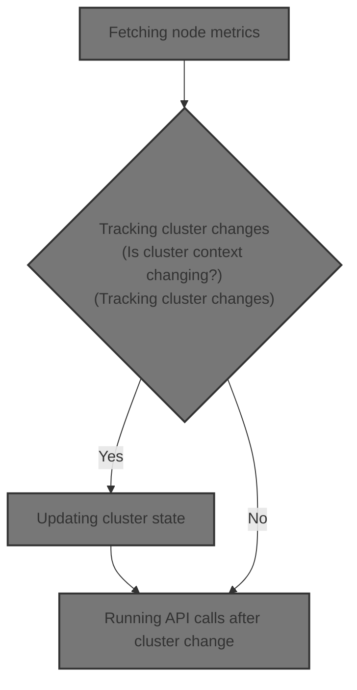

# Where is this flow used?

This flow is used multiple times in the codebase as represented in the following diagram:

```mermaid
graph TD;
      fd6b6c3a75debebd77c671406adcb3784e3fe62dabcc88ee9879878504f20089(frontend/…/cluster/Overview.tsx::Overview) --> be928244f9d4732692a029d74b94c9e7a7305b6fa2e0c48210d9a64f86b57747(frontend/…/k8s/node.ts::Node.useMetrics)

899eb91cc955de10d38d9ac530fd2a8a17deef959249cddd50f0defebe6bea7b(frontend/…/configmap/Details.tsx::NodeDetails) --> be928244f9d4732692a029d74b94c9e7a7305b6fa2e0c48210d9a64f86b57747(frontend/…/k8s/node.ts::Node.useMetrics)

e5921bac85f0bae695412bf0b246666351ad39704ec835b2356d528b3917c190(frontend/…/List/List.tsx::NodeList) --> be928244f9d4732692a029d74b94c9e7a7305b6fa2e0c48210d9a64f86b57747(frontend/…/k8s/node.ts::Node.useMetrics)


classDef mainFlowStyle color:#000000,fill:#7CB9F4
classDef rootsStyle color:#000000,fill:#00FFF4
classDef Style1 color:#000000,fill:#00FFAA
classDef Style2 color:#000000,fill:#FFFF00
classDef Style3 color:#000000,fill:#AA7CB9

%% Swimm:
%% graph TD;
%%       fd6b6c3a75debebd77c671406adcb3784e3fe62dabcc88ee9879878504f20089(<SwmPath>[frontend/…/cluster/Overview.tsx](frontend/src/components/cluster/Overview.tsx)</SwmPath>::Overview) --> be928244f9d4732692a029d74b94c9e7a7305b6fa2e0c48210d9a64f86b57747(<SwmPath>[frontend/…/k8s/node.ts](frontend/src/lib/k8s/node.ts)</SwmPath>::Node.useMetrics)
%% 
%% 899eb91cc955de10d38d9ac530fd2a8a17deef959249cddd50f0defebe6bea7b(<SwmPath>[frontend/…/configmap/Details.tsx](frontend/src/components/configmap/Details.tsx)</SwmPath>::NodeDetails) --> be928244f9d4732692a029d74b94c9e7a7305b6fa2e0c48210d9a64f86b57747(<SwmPath>[frontend/…/k8s/node.ts](frontend/src/lib/k8s/node.ts)</SwmPath>::Node.useMetrics)
%% 
%% e5921bac85f0bae695412bf0b246666351ad39704ec835b2356d528b3917c190(<SwmPath>[frontend/…/List/List.tsx](frontend/src/components/App/Notifications/List/List.tsx)</SwmPath>::NodeList) --> be928244f9d4732692a029d74b94c9e7a7305b6fa2e0c48210d9a64f86b57747(<SwmPath>[frontend/…/k8s/node.ts](frontend/src/lib/k8s/node.ts)</SwmPath>::Node.useMetrics)
%% 
%% 
%% classDef mainFlowStyle color:#000000,fill:#7CB9F4
%% classDef rootsStyle color:#000000,fill:#00FFF4
%% classDef Style1 color:#000000,fill:#00FFAA
%% classDef Style2 color:#000000,fill:#FFFF00
%% classDef Style3 color:#000000,fill:#AA7CB9
```

# Fetching node metrics

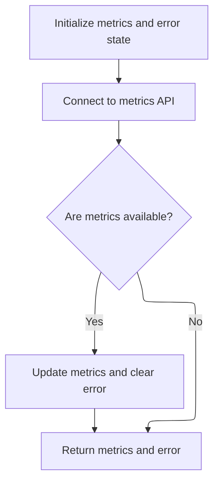

<SwmSnippet path="/frontend/src/lib/k8s/node.ts" line="89">

---

`Node.useMetrics` starts the flow by setting up state and wiring the metrics API call to the cluster context using <SwmToken path="frontend/src/lib/k8s/node.ts" pos="101:1:1" line-data="    useConnectApi(metrics.bind(null, &#39;/apis/metrics.k8s.io/v1beta1/nodes&#39;, setMetrics, setError));">`useConnectApi`</SwmToken>.

```typescript
  static useMetrics(): [KubeMetrics[] | null, ApiError | null] {
    const [nodeMetrics, setNodeMetrics] = React.useState<KubeMetrics[] | null>(null);
    const [error, setError] = useErrorState(setNodeMetrics);

    function setMetrics(metrics: KubeMetrics[]) {
      setNodeMetrics(metrics);

      if (metrics !== null) {
        setError(null);
      }
    }

    useConnectApi(metrics.bind(null, '/apis/metrics.k8s.io/v1beta1/nodes', setMetrics, setError));

    return [nodeMetrics, error];
  }
```

---

</SwmSnippet>

# Connecting API calls to cluster context

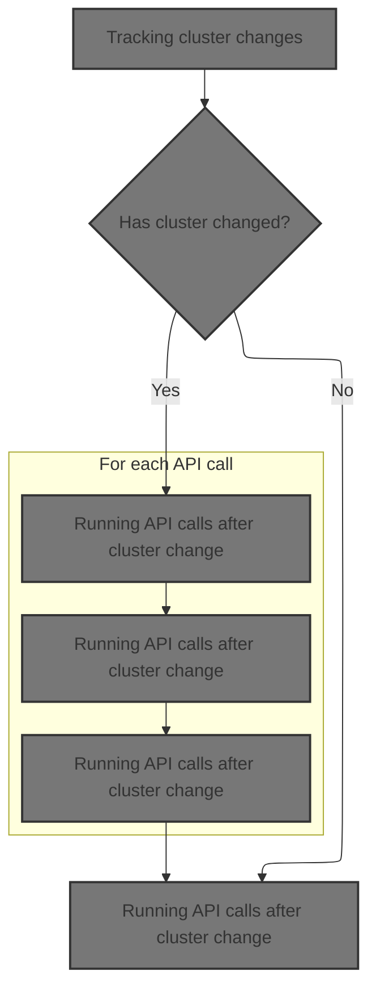

<SwmSnippet path="/frontend/src/lib/k8s/index.ts" line="195">

---

In <SwmToken path="frontend/src/lib/k8s/index.ts" pos="195:4:4" line-data="export function useConnectApi(...apiCalls: (() =&gt; CancellablePromise)[]) {">`useConnectApi`</SwmToken>, we grab the current cluster context so API calls are always scoped to the right cluster. This sets up the mechanism for re-running API calls when the cluster changes, which is why we need to call <SwmToken path="frontend/src/lib/k8s/index.ts" pos="198:7:7" line-data="  const cluster = useCluster();">`useCluster`</SwmToken> next.

```typescript
export function useConnectApi(...apiCalls: (() => CancellablePromise)[]) {
  // Use the location to make sure the API calls are changed, as they may depend on the cluster
  // (defined in the URL ATM).
  const cluster = useCluster();

```

---

</SwmSnippet>

## Tracking cluster changes

<SwmSnippet path="/frontend/src/lib/k8s/index.ts" line="142">

---

In <SwmToken path="frontend/src/lib/k8s/index.ts" pos="142:4:4" line-data="export function useCluster() {">`useCluster`</SwmToken>, we listen for route changes to detect when the cluster context changes in the URL. We call <SwmToken path="frontend/src/lib/k8s/index.ts" pos="145:16:16" line-data="  const [cluster, setCluster] = React.useState(getCluster());">`getCluster`</SwmToken> next to extract the cluster name from the path.

```typescript
export function useCluster() {
  const history = useHistory();

  const [cluster, setCluster] = React.useState(getCluster());

  React.useEffect(() => {
    // Listen to route changes
    return history.listen(() => {
      const newCluster = getCluster(history.location.pathname);
```

---

</SwmSnippet>

### Extracting cluster name from URL

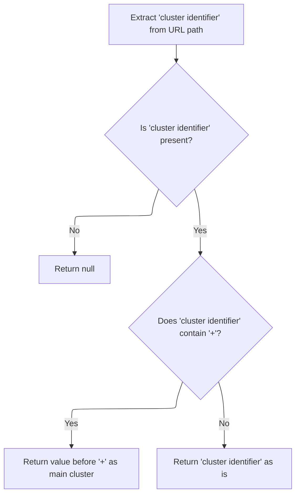

<SwmSnippet path="/frontend/src/lib/cluster.ts" line="46">

---

<SwmToken path="frontend/src/lib/cluster.ts" pos="46:4:4" line-data="export function getCluster(urlPath?: string): string | null {">`getCluster`</SwmToken> parses the URL to extract the cluster name, handling cases where extra info is appended with '+'. We call <SwmToken path="frontend/src/lib/cluster.ts" pos="47:7:7" line-data="  const clusterString = getClusterPathParam(urlPath);">`getClusterPathParam`</SwmToken> next to get the raw cluster string from the path.

```typescript
export function getCluster(urlPath?: string): string | null {
  const clusterString = getClusterPathParam(urlPath);
  if (!clusterString) return null;

  if (clusterString.includes('+')) {
    return clusterString.split('+')[0];
  }
  return clusterString;
}
```

---

</SwmSnippet>

### Parsing cluster path parameter

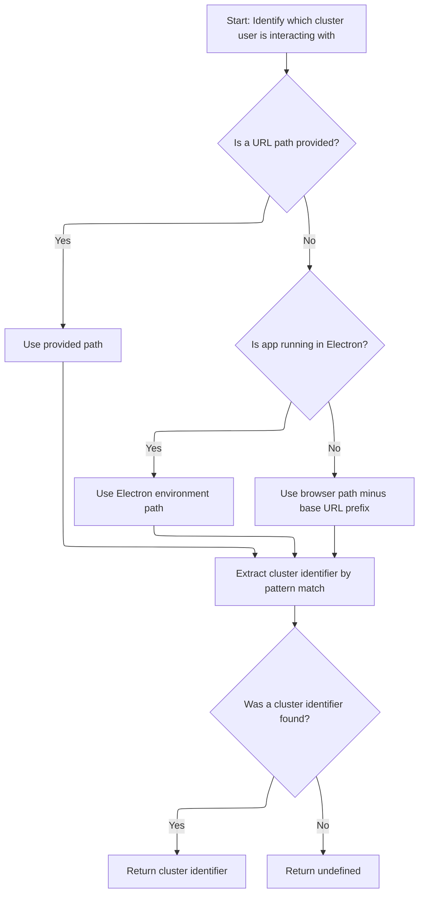

<SwmSnippet path="/frontend/src/lib/cluster.ts" line="57">

---

In <SwmToken path="frontend/src/lib/cluster.ts" pos="57:4:4" line-data="export function getClusterPathParam(maybeUrlPath?: string): string | undefined {">`getClusterPathParam`</SwmToken>, we grab the base URL so we can strip it from the path and isolate the cluster parameter. We call <SwmToken path="frontend/src/lib/cluster.ts" pos="58:7:7" line-data="  const prefix = getBaseUrl();">`getBaseUrl`</SwmToken> next to handle different deployment setups and normalize the prefix.

```typescript
export function getClusterPathParam(maybeUrlPath?: string): string | undefined {
  const prefix = getBaseUrl();
```

---

</SwmSnippet>

<SwmSnippet path="/frontend/src/helpers/getBaseUrl.ts" line="38">

---

<SwmToken path="frontend/src/helpers/getBaseUrl.ts" pos="38:4:4" line-data="export function getBaseUrl(): string {">`getBaseUrl`</SwmToken> figures out the base path for the app, prioritizing Electron, then a global override via <SwmToken path="frontend/src/helpers/getBaseUrl.ts" pos="44:5:7" line-data="    baseUrl = window.headlampBaseUrl;">`window.headlampBaseUrl`</SwmToken>, then <SwmToken path="frontend/src/helpers/getBaseUrl.ts" pos="46:11:11" line-data="    baseUrl = import.meta.env.PUBLIC_URL ? import.meta.env.PUBLIC_URL : &#39;&#39;;">`PUBLIC_URL`</SwmToken>. It normalizes './', '.', and '/' to empty so URLs don't break.

```typescript
export function getBaseUrl(): string {
  let baseUrl = '';
  if (isElectron()) {
    return '';
  }
  if (window?.headlampBaseUrl !== undefined) {
    baseUrl = window.headlampBaseUrl;
  } else {
    baseUrl = import.meta.env.PUBLIC_URL ? import.meta.env.PUBLIC_URL : '';
  }

  if (baseUrl === './' || baseUrl === '.' || baseUrl === '/') {
    baseUrl = '';
  }
  return baseUrl;
}
```

---

</SwmSnippet>

<SwmSnippet path="/frontend/src/lib/cluster.ts" line="59">

---

Back in <SwmToken path="frontend/src/lib/cluster.ts" pos="47:7:7" line-data="  const clusterString = getClusterPathParam(urlPath);">`getClusterPathParam`</SwmToken>, now that we've got the base URL, we strip it from the path and use <SwmToken path="frontend/src/lib/cluster.ts" pos="65:7:7" line-data="  const clusterURLMatch = matchPath&lt;{ cluster?: string }&gt;(urlPath, {">`matchPath`</SwmToken> to extract the cluster parameter. This keeps cluster parsing consistent across environments.

```typescript
  const urlPath =
    maybeUrlPath ??
    (isElectron()
      ? window.location.hash.substring(1)
      : window.location.pathname.slice(prefix.length));

  const clusterURLMatch = matchPath<{ cluster?: string }>(urlPath, {
    path: getClusterPrefixedPath(),
  });

  return clusterURLMatch?.params?.cluster;
}
```

---

</SwmSnippet>

### Updating cluster state

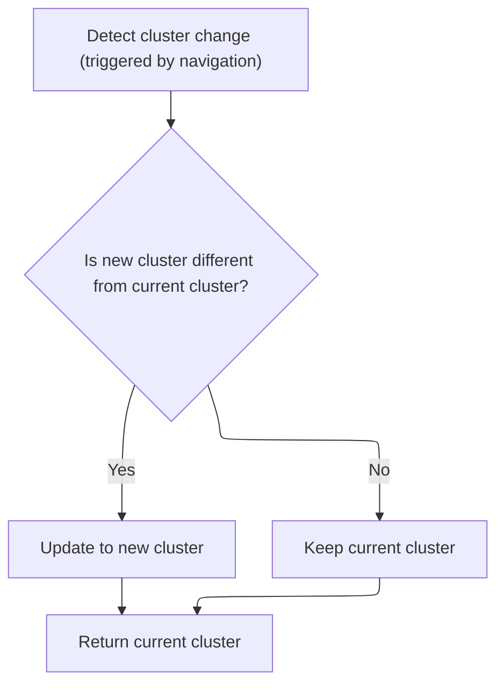

<SwmSnippet path="/frontend/src/lib/k8s/index.ts" line="151">

---

Back in <SwmToken path="frontend/src/lib/k8s/index.ts" pos="142:4:4" line-data="export function useCluster() {">`useCluster`</SwmToken>, we update the state only if the cluster actually changes. This triggers downstream API calls, so next we call <SwmToken path="frontend/src/lib/k8s/index.ts" pos="152:1:1" line-data="      setCluster(currentCluster =&gt; (newCluster !== currentCluster ? newCluster : currentCluster));">`setCluster`</SwmToken> to handle cluster-specific setup.

```typescript
      // Update the state only when the cluster changes
      setCluster(currentCluster => (newCluster !== currentCluster ? newCluster : currentCluster));
    });
  }, [history]);

  return cluster;
}
```

---

</SwmSnippet>

## Setting cluster configuration

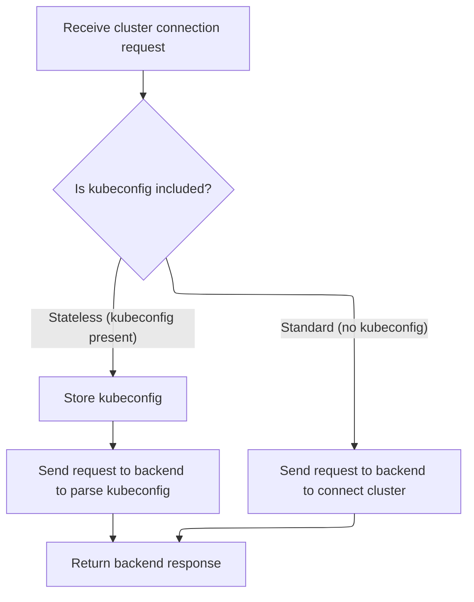

<SwmSnippet path="/frontend/src/lib/k8s/api/v1/clusterApi.ts" line="60">

---

<SwmToken path="frontend/src/lib/k8s/api/v1/clusterApi.ts" pos="60:6:6" line-data="export async function setCluster(clusterReq: ClusterRequest) {">`setCluster`</SwmToken> handles storing the kubeconfig if present, then sends a request to either <SwmToken path="frontend/src/lib/k8s/api/v1/clusterApi.ts" pos="68:2:3" line-data="      &#39;/parseKubeConfig&#39;,">`/parseKubeConfig`</SwmToken> or <SwmPath>[frontend/…/components/cluster/](frontend/src/components/cluster/)</SwmPath> depending on the payload. We call request next to actually send the API call.

```typescript
export async function setCluster(clusterReq: ClusterRequest) {
  const kubeconfig = clusterReq.kubeconfig;
  const headers = addBackstageAuthHeaders(JSON_HEADERS);

  if (kubeconfig) {
    await storeStatelessClusterKubeconfig(kubeconfig);
    // We just send parsed kubeconfig from the backend to the frontend.
    return request(
      '/parseKubeConfig',
      {
        method: 'POST',
        body: JSON.stringify(clusterReq),
        headers: {
          ...headers,
        },
      },
      false,
      false
    );
  }

  return request(
    '/cluster',
    {
      method: 'POST',
      body: JSON.stringify(clusterReq),
      headers: {
        ...headers,
        ...getHeadlampAPIHeaders(),
      },
    },
    false,
    false
  );
}
```

---

</SwmSnippet>

## Making cluster API requests

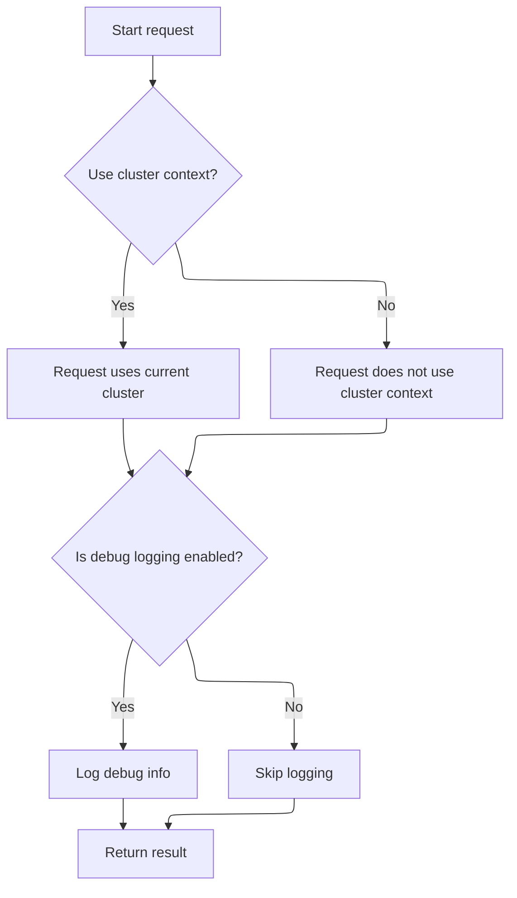

<SwmSnippet path="/frontend/src/lib/k8s/api/v1/clusterRequests.ts" line="94">

---

In <SwmToken path="frontend/src/lib/k8s/api/v1/clusterRequests.ts" pos="94:6:6" line-data="export async function request(">`request`</SwmToken>, we grab the current cluster name if <SwmToken path="frontend/src/lib/k8s/api/v1/clusterRequests.ts" pos="98:1:1" line-data="  useCluster: boolean = true,">`useCluster`</SwmToken> is true, so every API call is scoped to the right cluster. We call <SwmToken path="frontend/src/lib/k8s/api/v1/clusterRequests.ts" pos="102:12:12" line-data="  const cluster = (useCluster &amp;&amp; getCluster()) || &#39;&#39;;">`getCluster`</SwmToken> next to fetch the name.

```typescript
export async function request(
  path: string,
  params: RequestParams = {},
  autoLogoutOnAuthError: boolean = true,
  useCluster: boolean = true,
  queryParams?: QueryParameters
): Promise<any> {
  // @todo: This is a temporary way of getting the current cluster. We should improve it later.
  const cluster = (useCluster && getCluster()) || '';

```

---

</SwmSnippet>

<SwmSnippet path="/frontend/src/lib/k8s/api/v1/clusterRequests.ts" line="104">

---

Back in <SwmToken path="frontend/src/lib/k8s/api/v1/clusterRequests.ts" pos="104:11:11" line-data="  if (isDebugVerbose(&#39;k8s/apiProxy@request&#39;)) {">`request`</SwmToken>, we check <SwmToken path="frontend/src/lib/k8s/api/v1/clusterRequests.ts" pos="104:4:4" line-data="  if (isDebugVerbose(&#39;k8s/apiProxy@request&#39;)) {">`isDebugVerbose`</SwmToken> to decide if we should log debug info for the API call. This helps with troubleshooting and is controlled by module name and env vars.

```typescript
  if (isDebugVerbose('k8s/apiProxy@request')) {
    console.debug('k8s/apiProxy@request', { path, params, useCluster, queryParams });
  }

```

---

</SwmSnippet>

<SwmSnippet path="/frontend/src/helpers/debugVerbose.ts" line="76">

---

<SwmToken path="frontend/src/helpers/debugVerbose.ts" pos="76:4:4" line-data="export function isDebugVerbose(modName: string): boolean {">`isDebugVerbose`</SwmToken> decides if verbose logging is enabled by checking for substring matches in a debug list (ignoring index 0), and by checking env vars like <SwmToken path="frontend/src/helpers/debugVerbose.ts" pos="82:7:7" line-data="    import.meta.env.REACT_APP_DEBUG_VERBOSE === &#39;all&#39; ||">`REACT_APP_DEBUG_VERBOSE`</SwmToken>. Setting it to 'all' enables logging everywhere.

```typescript
export function isDebugVerbose(modName: string): boolean {
  if (verboseModDebug.filter(mod => modName.indexOf(mod) > 0).length > 0) {
    return true;
  }

  return (
    import.meta.env.REACT_APP_DEBUG_VERBOSE === 'all' ||
    !!(
      import.meta.env.REACT_APP_DEBUG_VERBOSE &&
      import.meta.env.REACT_APP_DEBUG_VERBOSE?.indexOf(modName) !== -1
    )
  );
}
```

---

</SwmSnippet>

<SwmSnippet path="/frontend/src/lib/k8s/api/v1/clusterRequests.ts" line="108">

---

Back in <SwmToken path="frontend/src/lib/k8s/api/v1/clusterApi.ts" pos="67:3:3" line-data="    return request(">`request`</SwmToken>, after handling debug logging, we call <SwmToken path="frontend/src/lib/k8s/api/v1/clusterRequests.ts" pos="108:3:3" line-data="  return clusterRequest(path, { cluster, autoLogoutOnAuthError, ...params }, queryParams);">`clusterRequest`</SwmToken> to send the API call with the cluster and params.

```typescript
  return clusterRequest(path, { cluster, autoLogoutOnAuthError, ...params }, queryParams);
}
```

---

</SwmSnippet>

## Building cluster-aware requests

```mermaid
%%{init: {"flowchart": {"defaultRenderer": "elk"}} }%%
flowchart TD
  node1["Start cluster request"] --> node2{"Is cluster specified?"}
  click node1 openCode "frontend/src/lib/k8s/api/v1/clusterRequests.ts:122:146"
  node2 -->|"Yes"| node3{"Is kubeconfig found?"}
  node2 -->|"No"| node4["Prepare request without cluster context"]
  click node2 openCode "frontend/src/lib/k8s/api/v1/clusterRequests.ts:147:155"
  node3 -->|"Yes"| node5["Set cluster headers"]
  node3 -->|"No"| node4
  
  node5 --> node6["Prepare request URL and options"]
  node4 --> node6
  click node5 openCode "frontend/src/lib/k8s/api/v1/clusterRequests.ts:151:154"
  click node4 openCode "frontend/src/lib/k8s/api/v1/clusterRequests.ts:146:146"
  click node6 openCode "frontend/src/lib/k8s/api/v1/clusterRequests.ts:157:160"
  node6 --> node7["Send request to backend"]
  click node7 openCode "frontend/src/lib/k8s/api/v1/clusterRequests.ts:172:172"
  node7 --> node8{"Does backend signal reload?"}
  click node8 openCode "frontend/src/lib/k8s/api/v1/clusterRequests.ts:185:188"
  node8 -->|"Yes"| node9["Reload application"]
  click node9 openCode "frontend/src/lib/k8s/api/v1/clusterRequests.ts:187:188"
  node8 -->|"No"| node10{"Is response ok?"}
  click node10 openCode "frontend/src/lib/k8s/api/v1/clusterRequests.ts:190:216"
  node10 -->|"Yes"| node11{"Is response JSON?"}
  node10 -->|"No"| node12{"Auth error and auto logout?"}
  click node11 openCode "frontend/src/lib/k8s/api/v1/clusterRequests.ts:218:222"
  node11 -->|"Yes"| node13["Return parsed JSON"]
  click node13 openCode "frontend/src/lib/k8s/api/v1/clusterRequests.ts:222:223"
  node11 -->|"No"| node14["Return raw response"]
  click node14 openCode "frontend/src/lib/k8s/api/v1/clusterRequests.ts:219:220"
  node12 -->|"Yes"| node15["Clearing authentication state"]
  
  node12 -->|"No"| node16["Return error"]
  click node16 openCode "frontend/src/lib/k8s/api/v1/clusterRequests.ts:213:216"
classDef HeadingStyle fill:#777777,stroke:#333,stroke-width:2px;
click node3 goToHeading "Locating kubeconfig in client storage"
node3:::HeadingStyle
click node15 goToHeading "Clearing authentication state"
node15:::HeadingStyle

%% Swimm:
%% %%{init: {"flowchart": {"defaultRenderer": "elk"}} }%%
%% flowchart TD
%%   node1["Start cluster request"] --> node2{"Is cluster specified?"}
%%   click node1 openCode "<SwmPath>[frontend/…/v1/clusterRequests.ts](frontend/src/lib/k8s/api/v1/clusterRequests.ts)</SwmPath>:122:146"
%%   node2 -->|"Yes"| node3{"Is kubeconfig found?"}
%%   node2 -->|"No"| node4["Prepare request without cluster context"]
%%   click node2 openCode "<SwmPath>[frontend/…/v1/clusterRequests.ts](frontend/src/lib/k8s/api/v1/clusterRequests.ts)</SwmPath>:147:155"
%%   node3 -->|"Yes"| node5["Set cluster headers"]
%%   node3 -->|"No"| node4
%%   
%%   node5 --> node6["Prepare request URL and options"]
%%   node4 --> node6
%%   click node5 openCode "<SwmPath>[frontend/…/v1/clusterRequests.ts](frontend/src/lib/k8s/api/v1/clusterRequests.ts)</SwmPath>:151:154"
%%   click node4 openCode "<SwmPath>[frontend/…/v1/clusterRequests.ts](frontend/src/lib/k8s/api/v1/clusterRequests.ts)</SwmPath>:146:146"
%%   click node6 openCode "<SwmPath>[frontend/…/v1/clusterRequests.ts](frontend/src/lib/k8s/api/v1/clusterRequests.ts)</SwmPath>:157:160"
%%   node6 --> node7["Send request to backend"]
%%   click node7 openCode "<SwmPath>[frontend/…/v1/clusterRequests.ts](frontend/src/lib/k8s/api/v1/clusterRequests.ts)</SwmPath>:172:172"
%%   node7 --> node8{"Does backend signal reload?"}
%%   click node8 openCode "<SwmPath>[frontend/…/v1/clusterRequests.ts](frontend/src/lib/k8s/api/v1/clusterRequests.ts)</SwmPath>:185:188"
%%   node8 -->|"Yes"| node9["Reload application"]
%%   click node9 openCode "<SwmPath>[frontend/…/v1/clusterRequests.ts](frontend/src/lib/k8s/api/v1/clusterRequests.ts)</SwmPath>:187:188"
%%   node8 -->|"No"| node10{"Is response ok?"}
%%   click node10 openCode "<SwmPath>[frontend/…/v1/clusterRequests.ts](frontend/src/lib/k8s/api/v1/clusterRequests.ts)</SwmPath>:190:216"
%%   node10 -->|"Yes"| node11{"Is response JSON?"}
%%   node10 -->|"No"| node12{"Auth error and auto logout?"}
%%   click node11 openCode "<SwmPath>[frontend/…/v1/clusterRequests.ts](frontend/src/lib/k8s/api/v1/clusterRequests.ts)</SwmPath>:218:222"
%%   node11 -->|"Yes"| node13["Return parsed JSON"]
%%   click node13 openCode "<SwmPath>[frontend/…/v1/clusterRequests.ts](frontend/src/lib/k8s/api/v1/clusterRequests.ts)</SwmPath>:222:223"
%%   node11 -->|"No"| node14["Return raw response"]
%%   click node14 openCode "<SwmPath>[frontend/…/v1/clusterRequests.ts](frontend/src/lib/k8s/api/v1/clusterRequests.ts)</SwmPath>:219:220"
%%   node12 -->|"Yes"| node15["Clearing authentication state"]
%%   
%%   node12 -->|"No"| node16["Return error"]
%%   click node16 openCode "<SwmPath>[frontend/…/v1/clusterRequests.ts](frontend/src/lib/k8s/api/v1/clusterRequests.ts)</SwmPath>:213:216"
%% classDef HeadingStyle fill:#777777,stroke:#333,stroke-width:2px;
%% click node3 goToHeading "Locating kubeconfig in client storage"
%% node3:::HeadingStyle
%% click node15 goToHeading "Clearing authentication state"
%% node15:::HeadingStyle
```

<SwmSnippet path="/frontend/src/lib/k8s/api/v1/clusterRequests.ts" line="122">

---

In <SwmToken path="frontend/src/lib/k8s/api/v1/clusterRequests.ts" pos="122:6:6" line-data="export async function clusterRequest(">`clusterRequest`</SwmToken>, if a cluster is specified, we fetch its kubeconfig and add it to the headers, along with the user ID. We also prefix the path with the cluster info. Next, we call <SwmToken path="frontend/src/lib/k8s/api/v1/clusterRequests.ts" pos="148:9:9" line-data="    const kubeconfig = await findKubeconfigByClusterName(cluster);">`findKubeconfigByClusterName`</SwmToken> to get the kubeconfig from storage.

```typescript
export async function clusterRequest(
  path: string,
  params: ClusterRequestParams = {},
  queryParams?: QueryParameters
): Promise<any> {
  interface RequestHeaders {
    Authorization?: string;
    cluster?: string;
    autoLogoutOnAuthError?: boolean;
    [otherHeader: string]: any;
  }

  const {
    timeout = DEFAULT_TIMEOUT,
    cluster: paramsCluster,
    autoLogoutOnAuthError = true,
    isJSON = true,
    ...otherParams
  } = params;

  const userID = getUserIdFromLocalStorage();
  const opts: { headers: RequestHeaders } = Object.assign({ headers: {} }, otherParams);
  const cluster = paramsCluster || '';

  let fullPath = path;
  if (cluster) {
    const kubeconfig = await findKubeconfigByClusterName(cluster);
    if (kubeconfig !== null) {
      opts.headers['KUBECONFIG'] = kubeconfig;
      opts.headers['X-HEADLAMP-USER-ID'] = userID;
    }

    fullPath = combinePath(`/${CLUSTERS_PREFIX}/${cluster}`, path);
  }

```

---

</SwmSnippet>

### Locating kubeconfig in client storage

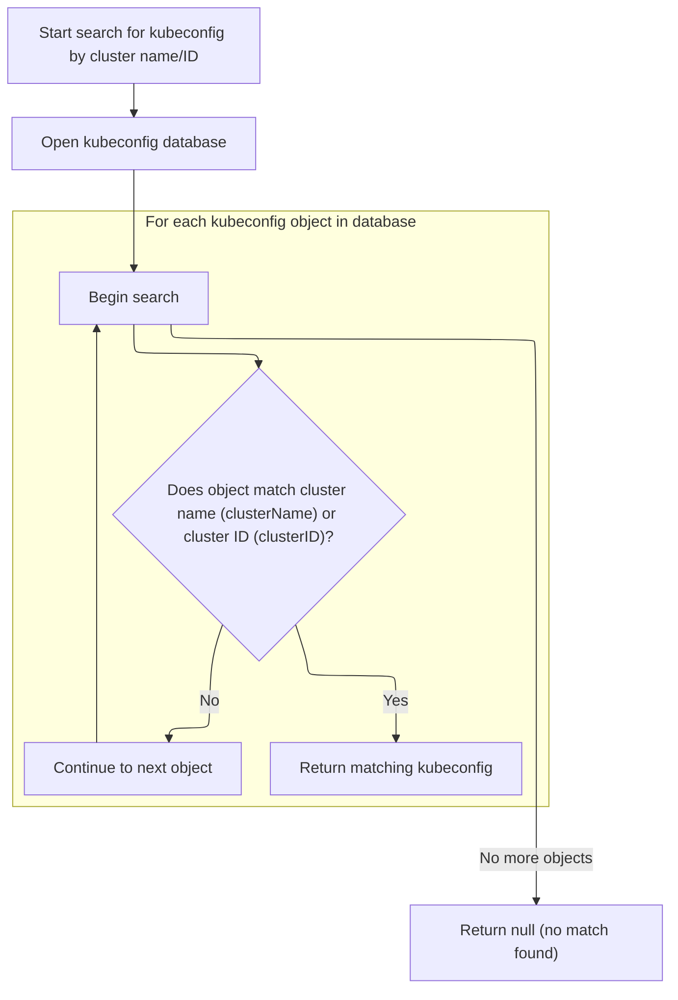

<SwmSnippet path="/frontend/src/stateless/findKubeconfigByClusterName.ts" line="36">

---

In <SwmToken path="frontend/src/stateless/findKubeconfigByClusterName.ts" pos="36:4:4" line-data="export function findKubeconfigByClusterName(">`findKubeconfigByClusterName`</SwmToken>, we open <SwmToken path="frontend/src/stateless/findKubeconfigByClusterName.ts" pos="32:10:10" line-data=" * @throws Error if IndexedDB is not supported.">`IndexedDB`</SwmToken> and iterate over stored kubeconfigs, decoding and parsing each one. We use <SwmToken path="frontend/src/stateless/findKubeconfigByClusterName.ts" pos="70:14:14" line-data="            const { matchingKubeconfig, matchingContext } = findMatchingContexts(">`findMatchingContexts`</SwmToken> next to check if the kubeconfig matches the requested cluster.

```typescript
export function findKubeconfigByClusterName(
  /** The name of the cluster to find */
  clusterName: string,
  /** The ID for a cluster, composed of the kubeconfig path and cluster name */
  clusterID?: string
): Promise<string | null> {
  return new Promise<string | null>(async (resolve, reject) => {
    try {
      const request = indexedDB.open('kubeconfigs', 1) as any;

      // The onupgradeneeded event is fired when the database is created for the first time.
      request.onupgradeneeded = handleDatabaseUpgrade;

      // The onsuccess event is fired when the database is opened.
      // This event is where you specify the actions to take when the database is opened.
      request.onsuccess = function handleDatabaseSuccess(event: DatabaseEvent) {
        const db = event.target.result;
        const transaction = db.transaction(['kubeconfigStore'], 'readonly');
        const store = transaction.objectStore('kubeconfigStore');

        // The onsuccess event is fired when the request has succeeded.
        // This is where you handle the results of the request.
        // The result is the cursor. It is used to iterate through the object store.
        // The cursor is null when there are no more objects to iterate through.
        // The cursor is used to find the kubeconfig by cluster name.
        store.openCursor().onsuccess = function storeSuccess(event: Event) {
          const successEvent = event as CursorSuccessEvent;
          const cursor = successEvent.target.result;
          if (cursor) {
            const kubeconfigObject = cursor.value;
            const kubeconfig = kubeconfigObject.kubeconfig;

            const parsedKubeconfig = jsyaml.load(atob(kubeconfig)) as KubeconfigObject;
            // Check for "headlamp_info" in extensions
            const { matchingKubeconfig, matchingContext } = findMatchingContexts(
              clusterName,
              parsedKubeconfig,
              clusterID
            );

```

---

</SwmSnippet>

<SwmSnippet path="/frontend/src/stateless/index.ts" line="236">

---

<SwmToken path="frontend/src/stateless/index.ts" pos="236:4:4" line-data="export function findMatchingContexts(">`findMatchingContexts`</SwmToken> checks for a matching context by <SwmToken path="frontend/src/stateless/index.ts" pos="239:1:1" line-data="  clusterID?: string">`clusterID`</SwmToken> (for <SwmToken path="frontend/src/lib/k8s/api/v1/clusterApi.ts" pos="99:33:35" line-data=" * Note: Currently, the use for the optional clusterID is only for the clusterID for non-dynamic clusters.">`non-dynamic`</SwmToken> clusters) or by clusterName/customName in the <SwmToken path="frontend/src/stateless/index.ts" pos="258:27:27" line-data="    // Find the context with the matching cluster name or custom name in headlamp_info">`headlamp_info`</SwmToken> extension. This helps us find the right kubeconfig for each cluster.

```typescript
export function findMatchingContexts(
  clusterName: string,
  parsedKubeconfig: KubeconfigObject,
  clusterID?: string
) {
  let matchingContext;
  let matchingKubeconfig;

  // Note: currently clusterID is being used for non dynamic clusters only
  if (clusterID) {
    // Find source for the kubeconfig
    const source = parsedKubeconfig.contexts.find(
      context => context.context.clusterID === clusterID
    )?.context.source;

    // Find the context with the matching clusterID
    if (source === 'kubeconfig') {
      matchingKubeconfig = parsedKubeconfig.contexts.find(
        context => context.context.clusterID === clusterID
      );
    }
  } else {
    // Find the context with the matching cluster name or custom name in headlamp_info
    matchingContext = parsedKubeconfig.contexts.find(
      context =>
        context.name === clusterName ||
        context.context.extensions?.find(extension => extension.name === 'headlamp_info')?.extension
          .customName === clusterName
    );

    matchingKubeconfig = parsedKubeconfig.contexts.find(context => context.name === clusterName);
  }

  return { matchingKubeconfig, matchingContext };
}
```

---

</SwmSnippet>

<SwmSnippet path="/frontend/src/stateless/findKubeconfigByClusterName.ts" line="76">

---

Back in <SwmToken path="frontend/src/lib/k8s/api/v1/clusterRequests.ts" pos="148:9:9" line-data="    const kubeconfig = await findKubeconfigByClusterName(cluster);">`findKubeconfigByClusterName`</SwmToken>, after checking each entry with <SwmToken path="frontend/src/stateless/findKubeconfigByClusterName.ts" pos="70:14:14" line-data="            const { matchingKubeconfig, matchingContext } = findMatchingContexts(">`findMatchingContexts`</SwmToken>, we resolve with the kubeconfig if a match is found, or continue searching. If nothing matches, we resolve with null.

```typescript
            if (matchingKubeconfig || matchingContext) {
              resolve(kubeconfig);
            } else {
              cursor.continue();
            }
          } else {
            resolve(null); // No matching kubeconfig found
          }
        };
      };

      // The onerror event is fired when the database is opened.
      // This is where you handle errors.
      request.onerror = handleDataBaseError;
    } catch (error) {
      reject(error);
    }
  });
}
```

---

</SwmSnippet>

### Preparing and sending the HTTP request

<SwmSnippet path="/frontend/src/lib/k8s/api/v1/clusterRequests.ts" line="157">

---

Back in <SwmToken path="frontend/src/lib/k8s/api/v1/clusterRequests.ts" pos="108:3:3" line-data="  return clusterRequest(path, { cluster, autoLogoutOnAuthError, ...params }, queryParams);">`clusterRequest`</SwmToken>, after getting the kubeconfig, we set up an <SwmToken path="frontend/src/lib/k8s/api/v1/clusterRequests.ts" pos="157:9:9" line-data="  const controller = new AbortController();">`AbortController`</SwmToken> for request timeouts and build the request URL using <SwmToken path="frontend/src/lib/k8s/api/v1/clusterRequests.ts" pos="160:9:9" line-data="  let url = combinePath(getAppUrl(), fullPath);">`getAppUrl`</SwmToken> next.

```typescript
  const controller = new AbortController();
  const id = setTimeout(() => controller.abort(), timeout);

  let url = combinePath(getAppUrl(), fullPath);
```

---

</SwmSnippet>

### Determining backend URL

```mermaid
%%{init: {"flowchart": {"defaultRenderer": "elk"}} }%%
flowchart TD
  node1["Start: Detect environment"] --> node2{"Electron?"}
  click node1 openCode "frontend/src/helpers/getAppUrl.ts:43:48"
  node2 -->|"Yes"| node3["Set backend port from Electron (if available), use localhost"]
  click node2 openCode "frontend/src/helpers/getAppUrl.ts:48:53"
  node2 -->|"No"| node4{"Dev Mode?"}
  click node3 openCode "frontend/src/helpers/getAppUrl.ts:49:53"
  node4 -->|"Yes"| node5["Use localhost"]
  click node4 openCode "frontend/src/helpers/getAppUrl.ts:55:57"
  node4 -->|"No"| node6{"Docker Desktop?"}
  node6 -->|"Yes"| node7["Set backend port to 64446, use localhost"]
  click node6 openCode "frontend/src/helpers/getAppUrl.ts:59:62"
  node6 -->|"No"| node8["Use window origin"]
  click node7 openCode "frontend/src/helpers/getAppUrl.ts:60:62"
  click node8 openCode "frontend/src/helpers/getAppUrl.ts:67:68"
  node3 --> node9["Set URL to http://localhost:backendPort"]
  node5 --> node9
  node7 --> node9
  node8 --> node10["Set URL to window origin"]
  click node9 openCode "frontend/src/helpers/getAppUrl.ts:65:66"
  click node10 openCode "frontend/src/helpers/getAppUrl.ts:67:68"
  node9 --> node11["Append baseUrl if present"]
  node10 --> node11
  click node11 openCode "frontend/src/helpers/getAppUrl.ts:70:71"
  node11 --> node12["Return final URL"]
  click node12 openCode "frontend/src/helpers/getAppUrl.ts:73:74"
classDef HeadingStyle fill:#777777,stroke:#333,stroke-width:2px;

%% Swimm:
%% %%{init: {"flowchart": {"defaultRenderer": "elk"}} }%%
%% flowchart TD
%%   node1["Start: Detect environment"] --> node2{"Electron?"}
%%   click node1 openCode "<SwmPath>[frontend/…/helpers/getAppUrl.ts](frontend/src/helpers/getAppUrl.ts)</SwmPath>:43:48"
%%   node2 -->|"Yes"| node3["Set backend port from Electron (if available), use localhost"]
%%   click node2 openCode "<SwmPath>[frontend/…/helpers/getAppUrl.ts](frontend/src/helpers/getAppUrl.ts)</SwmPath>:48:53"
%%   node2 -->|"No"| node4{"Dev Mode?"}
%%   click node3 openCode "<SwmPath>[frontend/…/helpers/getAppUrl.ts](frontend/src/helpers/getAppUrl.ts)</SwmPath>:49:53"
%%   node4 -->|"Yes"| node5["Use localhost"]
%%   click node4 openCode "<SwmPath>[frontend/…/helpers/getAppUrl.ts](frontend/src/helpers/getAppUrl.ts)</SwmPath>:55:57"
%%   node4 -->|"No"| node6{"Docker Desktop?"}
%%   node6 -->|"Yes"| node7["Set backend port to 64446, use localhost"]
%%   click node6 openCode "<SwmPath>[frontend/…/helpers/getAppUrl.ts](frontend/src/helpers/getAppUrl.ts)</SwmPath>:59:62"
%%   node6 -->|"No"| node8["Use window origin"]
%%   click node7 openCode "<SwmPath>[frontend/…/helpers/getAppUrl.ts](frontend/src/helpers/getAppUrl.ts)</SwmPath>:60:62"
%%   click node8 openCode "<SwmPath>[frontend/…/helpers/getAppUrl.ts](frontend/src/helpers/getAppUrl.ts)</SwmPath>:67:68"
%%   node3 --> node9["Set URL to http://localhost:<SwmToken path="frontend/src/helpers/getAppUrl.ts" pos="45:3:3" line-data="  let backendPort = 4466;">`backendPort`</SwmToken>"]
%%   node5 --> node9
%%   node7 --> node9
%%   node8 --> node10["Set URL to window origin"]
%%   click node9 openCode "<SwmPath>[frontend/…/helpers/getAppUrl.ts](frontend/src/helpers/getAppUrl.ts)</SwmPath>:65:66"
%%   click node10 openCode "<SwmPath>[frontend/…/helpers/getAppUrl.ts](frontend/src/helpers/getAppUrl.ts)</SwmPath>:67:68"
%%   node9 --> node11["Append <SwmToken path="frontend/src/helpers/getBaseUrl.ts" pos="39:3:3" line-data="  let baseUrl = &#39;&#39;;">`baseUrl`</SwmToken> if present"]
%%   node10 --> node11
%%   click node11 openCode "<SwmPath>[frontend/…/helpers/getAppUrl.ts](frontend/src/helpers/getAppUrl.ts)</SwmPath>:70:71"
%%   node11 --> node12["Return final URL"]
%%   click node12 openCode "<SwmPath>[frontend/…/helpers/getAppUrl.ts](frontend/src/helpers/getAppUrl.ts)</SwmPath>:73:74"
%% classDef HeadingStyle fill:#777777,stroke:#333,stroke-width:2px;
```

<SwmSnippet path="/frontend/src/helpers/getAppUrl.ts" line="43">

---

In <SwmToken path="frontend/src/helpers/getAppUrl.ts" pos="43:4:4" line-data="export function getAppUrl(): string {">`getAppUrl`</SwmToken>, we detect the environment (Electron, dev mode, Docker Desktop) to pick the right backend port and base URL. We call <SwmToken path="frontend/src/helpers/getAppUrl.ts" pos="70:7:7" line-data="  const baseUrl = getBaseUrl();">`getBaseUrl`</SwmToken> next to append the correct path.

```typescript
export function getAppUrl(): string {
  let url = '';
  let backendPort = 4466;
  let useLocalhost = false;

  if (isElectron()) {
    if (window?.headlampBackendPort) {
      backendPort = window.headlampBackendPort;
    }
    useLocalhost = true;
  }

  if (isDevMode()) {
    useLocalhost = true;
  }

  if (isDockerDesktop()) {
    backendPort = 64446;
    useLocalhost = true;
  }

  if (useLocalhost) {
    url = `http://localhost:${backendPort}`;
  } else {
    url = window.location.origin;
  }

  const baseUrl = getBaseUrl();
```

---

</SwmSnippet>

<SwmSnippet path="/frontend/src/helpers/getAppUrl.ts" line="71">

---

Back in <SwmToken path="frontend/src/lib/k8s/api/v1/clusterRequests.ts" pos="160:9:9" line-data="  let url = combinePath(getAppUrl(), fullPath);">`getAppUrl`</SwmToken>, after getting the base URL, we append it with a trailing slash if needed, so the final URL works with custom base paths.

```typescript
  url += baseUrl ? baseUrl + '/' : '/';

  return url;
}
```

---

</SwmSnippet>

### Handling request and response

```mermaid
%%{init: {"flowchart": {"defaultRenderer": "elk"}} }%%
flowchart TD
  node1["Prepare request and options"] --> node2{"Is Backstage?"}
  click node1 openCode "frontend/src/lib/k8s/api/v1/clusterRequests.ts:161:167"
  node2 -->|"Yes"| node3["Add Backstage authentication headers"]
  click node2 openCode "frontend/src/lib/k8s/api/v1/clusterRequests.ts:167:169"
  node2 -->|"No"| node4["Send request to cluster API"]
  click node3 openCode "frontend/src/lib/k8s/api/v1/clusterRequests.ts:168:169"
  node3 --> node4
  node4["Send request to cluster API"] --> node5{"Did backend signal reload?"}
  click node4 openCode "frontend/src/lib/k8s/api/v1/clusterRequests.ts:170:185"
  node5 -->|"Yes"| node6["Reload the page"]
  click node5 openCode "frontend/src/lib/k8s/api/v1/clusterRequests.ts:185:188"
  click node6 openCode "frontend/src/lib/k8s/api/v1/clusterRequests.ts:187:188"
  node5 -->|"No"| node7{"Was response successful?"}
  node7 -->|"No"| node8{"Is authentication error and auto-logout enabled?"}
  click node7 openCode "frontend/src/lib/k8s/api/v1/clusterRequests.ts:190:192"
  node8 -->|"Yes"| node9["Log out user"]
  click node8 openCode "frontend/src/lib/k8s/api/v1/clusterRequests.ts:192:195"
  click node9 openCode "frontend/src/lib/k8s/api/v1/clusterRequests.ts:194:195"
  node8 -->|"No"| node10["Finish"]
  node7 -->|"Yes"| node10["Finish"]
classDef HeadingStyle fill:#777777,stroke:#333,stroke-width:2px;

%% Swimm:
%% %%{init: {"flowchart": {"defaultRenderer": "elk"}} }%%
%% flowchart TD
%%   node1["Prepare request and options"] --> node2{"Is Backstage?"}
%%   click node1 openCode "<SwmPath>[frontend/…/v1/clusterRequests.ts](frontend/src/lib/k8s/api/v1/clusterRequests.ts)</SwmPath>:161:167"
%%   node2 -->|"Yes"| node3["Add Backstage authentication headers"]
%%   click node2 openCode "<SwmPath>[frontend/…/v1/clusterRequests.ts](frontend/src/lib/k8s/api/v1/clusterRequests.ts)</SwmPath>:167:169"
%%   node2 -->|"No"| node4["Send request to cluster API"]
%%   click node3 openCode "<SwmPath>[frontend/…/v1/clusterRequests.ts](frontend/src/lib/k8s/api/v1/clusterRequests.ts)</SwmPath>:168:169"
%%   node3 --> node4
%%   node4["Send request to cluster API"] --> node5{"Did backend signal reload?"}
%%   click node4 openCode "<SwmPath>[frontend/…/v1/clusterRequests.ts](frontend/src/lib/k8s/api/v1/clusterRequests.ts)</SwmPath>:170:185"
%%   node5 -->|"Yes"| node6["Reload the page"]
%%   click node5 openCode "<SwmPath>[frontend/…/v1/clusterRequests.ts](frontend/src/lib/k8s/api/v1/clusterRequests.ts)</SwmPath>:185:188"
%%   click node6 openCode "<SwmPath>[frontend/…/v1/clusterRequests.ts](frontend/src/lib/k8s/api/v1/clusterRequests.ts)</SwmPath>:187:188"
%%   node5 -->|"No"| node7{"Was response successful?"}
%%   node7 -->|"No"| node8{"Is authentication error and auto-logout enabled?"}
%%   click node7 openCode "<SwmPath>[frontend/…/v1/clusterRequests.ts](frontend/src/lib/k8s/api/v1/clusterRequests.ts)</SwmPath>:190:192"
%%   node8 -->|"Yes"| node9["Log out user"]
%%   click node8 openCode "<SwmPath>[frontend/…/v1/clusterRequests.ts](frontend/src/lib/k8s/api/v1/clusterRequests.ts)</SwmPath>:192:195"
%%   click node9 openCode "<SwmPath>[frontend/…/v1/clusterRequests.ts](frontend/src/lib/k8s/api/v1/clusterRequests.ts)</SwmPath>:194:195"
%%   node8 -->|"No"| node10["Finish"]
%%   node7 -->|"Yes"| node10["Finish"]
%% classDef HeadingStyle fill:#777777,stroke:#333,stroke-width:2px;
```

<SwmSnippet path="/frontend/src/lib/k8s/api/v1/clusterRequests.ts" line="161">

---

Back in <SwmToken path="frontend/src/lib/k8s/api/v1/clusterRequests.ts" pos="108:3:3" line-data="  return clusterRequest(path, { cluster, autoLogoutOnAuthError, ...params }, queryParams);">`clusterRequest`</SwmToken>, after sending the request, we handle timeouts, reload the page if the backend signals it, and trigger logout on 401 errors. Next, we call logout to clear auth state.

```typescript
  url += asQuery(queryParams);
  const requestData = {
    signal: controller.signal,
    credentials: 'include' as RequestCredentials,
    ...opts,
  };
  if (isBackstage()) {
    requestData.headers = addBackstageAuthHeaders(requestData.headers);
  }
  let response: Response = new Response(undefined, { status: 502, statusText: 'Unreachable' });
  try {
    response = await fetch(url, requestData);
  } catch (err) {
    if (err instanceof Error) {
      if (err.name === 'AbortError') {
        response = new Response(undefined, { status: 408, statusText: 'Request timed-out' });
      }
    }
  } finally {
    clearTimeout(id);
  }

  // The backend signals through this header that it wants a reload.
  // See plugins.go
  const headerVal = response.headers.get('X-Reload');
  if (headerVal && headerVal.indexOf('reload') !== -1) {
    window.location.reload();
  }

  if (!response.ok) {
    const { status, statusText } = response;
    if (autoLogoutOnAuthError && status === 401 && opts.headers.Authorization) {
      console.error('Logging out due to auth error', { status, statusText, path });
      logout(cluster);
    }

```

---

</SwmSnippet>

### Clearing authentication state

<SwmSnippet path="/frontend/src/lib/auth.ts" line="131">

---

<SwmToken path="frontend/src/lib/auth.ts" pos="131:6:6" line-data="export async function logout(cluster: string) {">`logout`</SwmToken> calls <SwmToken path="frontend/src/lib/auth.ts" pos="132:3:3" line-data="  return setToken(cluster, null).then(() =&gt; {">`setToken`</SwmToken> to clear the token, then removes cached queries for auth and <SwmToken path="frontend/src/lib/auth.ts" pos="134:12:12" line-data="    queryClient.removeQueries({ queryKey: [&#39;clusterMe&#39;, cluster], exact: true });">`clusterMe`</SwmToken>. We call <SwmToken path="frontend/src/lib/auth.ts" pos="132:3:3" line-data="  return setToken(cluster, null).then(() =&gt; {">`setToken`</SwmToken> next to actually clear the token.

```typescript
export async function logout(cluster: string) {
  return setToken(cluster, null).then(() => {
    queryClient.removeQueries({ queryKey: ['auth'], exact: false });
    queryClient.removeQueries({ queryKey: ['clusterMe', cluster], exact: true });
  });
}
```

---

</SwmSnippet>

### Updating token and cache

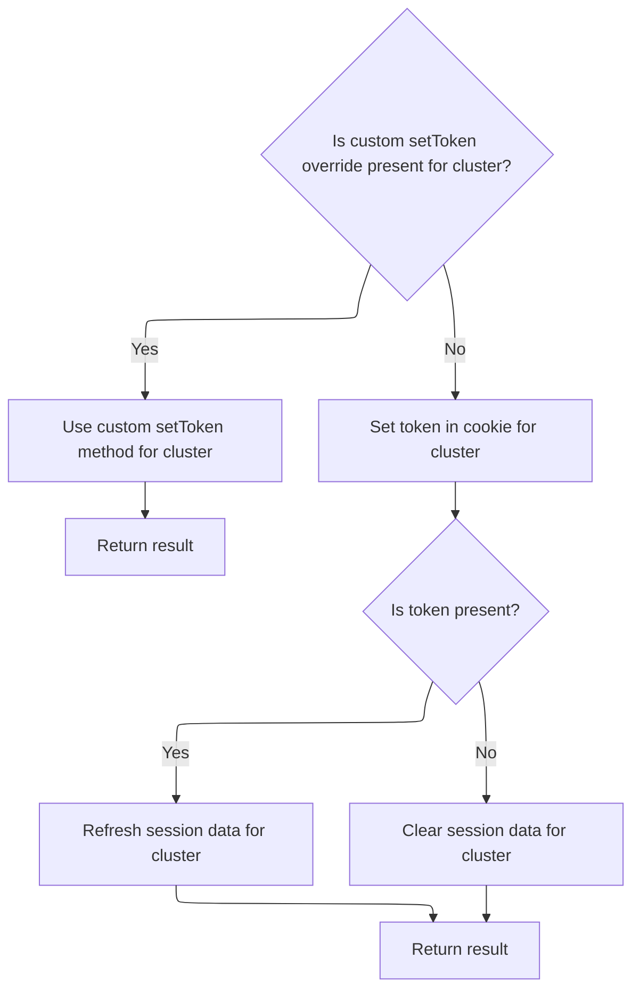

<SwmSnippet path="/frontend/src/lib/auth.ts" line="108">

---

<SwmToken path="frontend/src/lib/auth.ts" pos="108:4:4" line-data="export function setToken(cluster: string, token: string | null) {">`setToken`</SwmToken> checks for an override method, and if none is set, uses <SwmToken path="frontend/src/lib/auth.ts" pos="114:3:3" line-data="  return setCookieToken(cluster, token).then(result =&gt; {">`setCookieToken`</SwmToken> to update the token. It also invalidates or removes <SwmToken path="frontend/src/lib/auth.ts" pos="116:12:12" line-data="      queryClient.invalidateQueries({ queryKey: [&#39;clusterMe&#39;, cluster], exact: true });">`clusterMe`</SwmToken> queries to keep cache in sync.

```typescript
export function setToken(cluster: string, token: string | null) {
  const setTokenMethodToUse = store.getState().ui.functionsToOverride.setToken;
  if (setTokenMethodToUse) {
    return Promise.resolve(setTokenMethodToUse(cluster, token));
  }

  return setCookieToken(cluster, token).then(result => {
    if (token) {
      queryClient.invalidateQueries({ queryKey: ['clusterMe', cluster], exact: true });
    } else {
      queryClient.removeQueries({ queryKey: ['clusterMe', cluster], exact: true });
    }

    return result;
  });
}
```

---

</SwmSnippet>

### Persisting token to backend

<SwmSnippet path="/frontend/src/lib/auth.ts" line="79">

---

<SwmToken path="frontend/src/lib/auth.ts" pos="79:4:4" line-data="async function setCookieToken(cluster: string, token: string | null) {">`setCookieToken`</SwmToken> sends the token to the backend using <SwmToken path="frontend/src/lib/auth.ts" pos="81:9:9" line-data="    const response = await backendFetch(`/clusters/${cluster}/set-token`, {">`backendFetch`</SwmToken>. If the response isn't OK, it throws an error. We call <SwmToken path="frontend/src/lib/auth.ts" pos="81:9:9" line-data="    const response = await backendFetch(`/clusters/${cluster}/set-token`, {">`backendFetch`</SwmToken> next to actually send the request.

```typescript
async function setCookieToken(cluster: string, token: string | null) {
  try {
    const response = await backendFetch(`/clusters/${cluster}/set-token`, {
      method: 'POST',
      headers: {
        'Content-Type': 'application/json',
        ...getHeadlampAPIHeaders(),
      },
      body: JSON.stringify({ token }),
    });

    if (!response.ok) {
      throw new Error(`Failed to set cookie token`);
    }
    return true;
  } catch (error) {
    console.error('Error setting cookie token:', error);
    throw error;
  }
}
```

---

</SwmSnippet>

### Sending authenticated backend requests

```mermaid
%%{init: {"flowchart": {"defaultRenderer": "elk"}} }%%
flowchart TD
    node1["Send backend request with authentication headers"] --> node2{"Does backend response include X-Reload: reload?"}
    click node1 openCode "frontend/src/lib/k8s/api/v2/fetch.ts:38:42"
    node2 -->|"Yes"| node3["Reload the page"]
    click node2 openCode "frontend/src/lib/k8s/api/v2/fetch.ts:46:49"
    click node3 openCode "frontend/src/lib/k8s/api/v2/fetch.ts:48:49"
    node2 -->|"No"| node4{"Is response successful?"}
    click node4 openCode "frontend/src/lib/k8s/api/v2/fetch.ts:51:60"
    node4 -->|"No"| node5["Report backend error to user"]
    click node5 openCode "frontend/src/lib/k8s/api/v2/fetch.ts:53:59"
    node4 -->|"Yes"| node6["Return backend response"]
    click node6 openCode "frontend/src/lib/k8s/api/v2/fetch.ts:62:63"

classDef HeadingStyle fill:#777777,stroke:#333,stroke-width:2px;

%% Swimm:
%% %%{init: {"flowchart": {"defaultRenderer": "elk"}} }%%
%% flowchart TD
%%     node1["Send backend request with authentication headers"] --> node2{"Does backend response include <SwmToken path="frontend/src/lib/k8s/api/v1/clusterRequests.ts" pos="185:14:16" line-data="  const headerVal = response.headers.get(&#39;X-Reload&#39;);">`X-Reload`</SwmToken>: reload?"}
%%     click node1 openCode "<SwmPath>[frontend/…/v2/fetch.ts](frontend/src/lib/k8s/api/v2/fetch.ts)</SwmPath>:38:42"
%%     node2 -->|"Yes"| node3["Reload the page"]
%%     click node2 openCode "<SwmPath>[frontend/…/v2/fetch.ts](frontend/src/lib/k8s/api/v2/fetch.ts)</SwmPath>:46:49"
%%     click node3 openCode "<SwmPath>[frontend/…/v2/fetch.ts](frontend/src/lib/k8s/api/v2/fetch.ts)</SwmPath>:48:49"
%%     node2 -->|"No"| node4{"Is response successful?"}
%%     click node4 openCode "<SwmPath>[frontend/…/v2/fetch.ts](frontend/src/lib/k8s/api/v2/fetch.ts)</SwmPath>:51:60"
%%     node4 -->|"No"| node5["Report backend error to user"]
%%     click node5 openCode "<SwmPath>[frontend/…/v2/fetch.ts](frontend/src/lib/k8s/api/v2/fetch.ts)</SwmPath>:53:59"
%%     node4 -->|"Yes"| node6["Return backend response"]
%%     click node6 openCode "<SwmPath>[frontend/…/v2/fetch.ts](frontend/src/lib/k8s/api/v2/fetch.ts)</SwmPath>:62:63"
%% 
%% classDef HeadingStyle fill:#777777,stroke:#333,stroke-width:2px;
```

<SwmSnippet path="/frontend/src/lib/k8s/api/v2/fetch.ts" line="38">

---

In <SwmToken path="frontend/src/lib/k8s/api/v2/fetch.ts" pos="38:6:6" line-data="export async function backendFetch(url: string | URL, init: RequestInit = {}) {">`backendFetch`</SwmToken>, we set up the fetch request to always include credentials for <SwmToken path="frontend/src/lib/auth.ts" pos="101:23:25" line-data=" * Sets or updates the token for a given cluster using cookie-based storage.">`cookie-based`</SwmToken> auth, add custom authentication headers, and build the full backend URL using <SwmToken path="frontend/src/lib/k8s/api/v2/fetch.ts" pos="42:14:14" line-data="  const response = await fetch(makeUrl([getAppUrl(), url]), init);">`getAppUrl`</SwmToken>. This makes sure requests are authenticated and routed to the right backend, no matter where the app is running.

```typescript
export async function backendFetch(url: string | URL, init: RequestInit = {}) {
  // Always include credentials
  init.credentials = 'include';
  init.headers = addBackstageAuthHeaders(init.headers);
  const response = await fetch(makeUrl([getAppUrl(), url]), init);

```

---

</SwmSnippet>

<SwmSnippet path="/frontend/src/lib/k8s/api/v2/fetch.ts" line="44">

---

Back in <SwmToken path="frontend/src/lib/auth.ts" pos="81:9:9" line-data="    const response = await backendFetch(`/clusters/${cluster}/set-token`, {">`backendFetch`</SwmToken>, after building the URL with <SwmToken path="frontend/src/lib/k8s/api/v1/clusterRequests.ts" pos="160:9:9" line-data="  let url = combinePath(getAppUrl(), fullPath);">`getAppUrl`</SwmToken>, we check for the <SwmToken path="frontend/src/lib/k8s/api/v2/fetch.ts" pos="46:14:16" line-data="  const headerVal = response.headers.get(&#39;X-Reload&#39;);">`X-Reload`</SwmToken> header to trigger a page reload if needed, and parse error messages from the response body to throw a custom <SwmToken path="frontend/src/lib/k8s/api/v2/fetch.ts" pos="59:5:5" line-data="    throw new ApiError(maybeErrorMessage ?? &#39;Unreachable&#39;, { status: response.status });">`ApiError`</SwmToken>. This gives more useful errors and lets the backend force a reload when necessary.

```typescript
  // The backend signals through this header that it wants a reload.
  // See plugins.go
  const headerVal = response.headers.get('X-Reload');
  if (headerVal && headerVal.indexOf('reload') !== -1) {
    window.location.reload();
  }

  if (!response.ok) {
    // Try to parse error message from response
    let maybeErrorMessage: string | undefined;
    try {
      const body = await response.json();
      maybeErrorMessage = typeof body === 'string' ? body : body.message;
    } catch (e) {}

    throw new ApiError(maybeErrorMessage ?? 'Unreachable', { status: response.status });
  }

  return response;
}
```

---

</SwmSnippet>

### Handling cluster API errors

```mermaid
%%{init: {"flowchart": {"defaultRenderer": "elk"}} }%%
flowchart TD
  node1["Receive API response"] --> node2{"Is response JSON?"}
  click node1 openCode "frontend/src/lib/k8s/api/v1/clusterRequests.ts:197:223"
  node2 -->|"Yes"| node3{"Can extract error details from JSON?"}
  click node2 openCode "frontend/src/lib/k8s/api/v1/clusterRequests.ts:198:203"
  node3 -->|"Yes"| node4["Reject with error: statusText + json.message"]
  click node4 openCode "frontend/src/lib/k8s/api/v1/clusterRequests.ts:213:215"
  node3 -->|"No"| node5["Reject with error: statusText only"]
  click node5 openCode "frontend/src/lib/k8s/api/v1/clusterRequests.ts:213:215"
  node2 -->|"No"| node6["Return successful response"]
  click node6 openCode "frontend/src/lib/k8s/api/v1/clusterRequests.ts:218:220"
classDef HeadingStyle fill:#777777,stroke:#333,stroke-width:2px;

%% Swimm:
%% %%{init: {"flowchart": {"defaultRenderer": "elk"}} }%%
%% flowchart TD
%%   node1["Receive API response"] --> node2{"Is response JSON?"}
%%   click node1 openCode "<SwmPath>[frontend/…/v1/clusterRequests.ts](frontend/src/lib/k8s/api/v1/clusterRequests.ts)</SwmPath>:197:223"
%%   node2 -->|"Yes"| node3{"Can extract error details from JSON?"}
%%   click node2 openCode "<SwmPath>[frontend/…/v1/clusterRequests.ts](frontend/src/lib/k8s/api/v1/clusterRequests.ts)</SwmPath>:198:203"
%%   node3 -->|"Yes"| node4["Reject with error: <SwmToken path="frontend/src/lib/k8s/api/v1/clusterRequests.ts" pos="170:25:25" line-data="  let response: Response = new Response(undefined, { status: 502, statusText: &#39;Unreachable&#39; });">`statusText`</SwmToken> + <SwmToken path="frontend/src/lib/k8s/api/v1/clusterRequests.ts" pos="201:11:13" line-data="        message += ` - ${json.message}`;">`json.message`</SwmToken>"]
%%   click node4 openCode "<SwmPath>[frontend/…/v1/clusterRequests.ts](frontend/src/lib/k8s/api/v1/clusterRequests.ts)</SwmPath>:213:215"
%%   node3 -->|"No"| node5["Reject with error: <SwmToken path="frontend/src/lib/k8s/api/v1/clusterRequests.ts" pos="170:25:25" line-data="  let response: Response = new Response(undefined, { status: 502, statusText: &#39;Unreachable&#39; });">`statusText`</SwmToken> only"]
%%   click node5 openCode "<SwmPath>[frontend/…/v1/clusterRequests.ts](frontend/src/lib/k8s/api/v1/clusterRequests.ts)</SwmPath>:213:215"
%%   node2 -->|"No"| node6["Return successful response"]
%%   click node6 openCode "<SwmPath>[frontend/…/v1/clusterRequests.ts](frontend/src/lib/k8s/api/v1/clusterRequests.ts)</SwmPath>:218:220"
%% classDef HeadingStyle fill:#777777,stroke:#333,stroke-width:2px;
```

<SwmSnippet path="/frontend/src/lib/k8s/api/v1/clusterRequests.ts" line="197">

---

Back in <SwmToken path="frontend/src/lib/k8s/api/v1/clusterRequests.ts" pos="108:3:3" line-data="  return clusterRequest(path, { cluster, autoLogoutOnAuthError, ...params }, queryParams);">`clusterRequest`</SwmToken>, after handling logout, we parse the error message from the response JSON (if available) and reject with a custom <SwmToken path="frontend/src/lib/k8s/api/v1/clusterRequests.ts" pos="213:16:16" line-data="    const error = new Error(message) as ApiError;">`ApiError`</SwmToken>. This makes error handling more informative for downstream consumers.

```typescript
    let message = statusText;
    try {
      if (isJSON) {
        const json = await response.json();
        message += ` - ${json.message}`;
      }
    } catch (err) {
      console.error(
        'Unable to parse error json at url:',
        url,
        { err },
        'with request data:',
        requestData
      );
    }

    const error = new Error(message) as ApiError;
    error.status = status;
    return Promise.reject(error);
  }

  if (!isJSON) {
    return Promise.resolve(response);
  }

  return response.json();
}
```

---

</SwmSnippet>

## Running API calls after cluster change

<SwmSnippet path="/frontend/src/lib/k8s/index.ts" line="200">

---

Back in <SwmToken path="frontend/src/lib/k8s/node.ts" pos="101:1:1" line-data="    useConnectApi(metrics.bind(null, &#39;/apis/metrics.k8s.io/v1beta1/nodes&#39;, setMetrics, setError));">`useConnectApi`</SwmToken>, after the cluster changes, we run all <SwmToken path="frontend/src/lib/k8s/index.ts" pos="202:7:7" line-data="      const cancellables = apiCalls.map(func =&gt; func());">`apiCalls`</SwmToken> and set up cleanup to cancel them when the component unmounts or the cluster changes again. This keeps requests in sync with the current cluster.

```typescript
  React.useEffect(
    () => {
      const cancellables = apiCalls.map(func => func());

      return function cleanup() {
        for (const cancellablePromise of cancellables) {
          cancellablePromise.then(cancellable => cancellable());
        }
```

---

</SwmSnippet>

<SwmSnippet path="/frontend/src/lib/k8s/index.ts" line="210">

---

We only depend on cluster for the effect, not <SwmToken path="frontend/src/lib/k8s/index.ts" pos="210:11:11" line-data="    // If we add the apiCalls to the dependency list, then it actually">`apiCalls`</SwmToken>, to avoid unwanted reloads. The effect returns a cleanup function to cancel requests when the cluster changes or the component unmounts.

```typescript
    // If we add the apiCalls to the dependency list, then it actually
    // results in undesired reloads.
    // eslint-disable-next-line react-hooks/exhaustive-deps
    [cluster]
  );
}
```

---

</SwmSnippet>

&nbsp;

*This is an auto-generated document by Swimm 🌊 and has not yet been verified by a human*

<SwmMeta version="3.0.0" repo-id="Z2l0aHViJTNBJTNBdHlwZXNjcmlwdC1oZWFkbGFtcCUzQSUzQXJpY2FyZG9sb3Blemc=" repo-name="typescript-headlamp"><sup>Powered by [Swimm](https://app.swimm.io/)</sup></SwmMeta>
