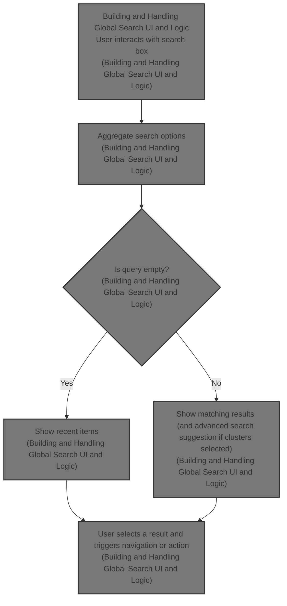

This document describes the flow for building and handling the global search UI and logic. The global search enables users to quickly find and navigate to resources, pages, clusters, themes, or perform advanced searches from a single interface. The search supports recent searches, advanced search suggestions, free-form input, and keyboard navigation.



# Building and Handling Global Search UI and Logic

```mermaid
%%{init: {"flowchart": {"defaultRenderer": "elk"}} }%%
flowchart TD
  node1["User focuses or types in search box"]
  click node1 openCode "frontend/src/components/globalSearch/GlobalSearchContent.tsx:439:504"
  subgraph loop1["Aggregate options from all sources"]
    node2a["Resources"]
    click node2a openCode "frontend/src/components/globalSearch/GlobalSearchContent.tsx:180:181"
    node2b["Namespaces"]
    click node2b openCode "frontend/src/components/globalSearch/GlobalSearchContent.tsx:182:226"
    node2c["Clusters"]
    click node2c openCode "frontend/src/components/globalSearch/GlobalSearchContent.tsx:259:274"
    node2d["Routes"]
    click node2d openCode "frontend/src/components/globalSearch/GlobalSearchContent.tsx:277:310"
    node2e["Themes"]
    click node2e openCode "frontend/src/components/globalSearch/GlobalSearchContent.tsx:313:322"
    node2f{"Query not empty AND clusters selected?"}
    click node2f openCode "frontend/src/components/globalSearch/GlobalSearchContent.tsx:325:340"
    node2f -->|"Yes"| node2g["Add advanced search suggestion"]
    click node2g openCode "frontend/src/components/globalSearch/GlobalSearchContent.tsx:325:340"
    node2f -->|"No"| node2h["Skip advanced search suggestion"]
  end
  node1 --> loop1
  loop1 --> node3{"Is search query empty?"}
  click node3 openCode "frontend/src/components/globalSearch/GlobalSearchContent.tsx:371:401"
  node3 -->|"Yes"| node4["Show recent items"]
  click node4 openCode "frontend/src/components/globalSearch/GlobalSearchContent.tsx:403:407"
  node3 -->|"No"| node5["Show matching results"]
  click node5 openCode "frontend/src/components/globalSearch/GlobalSearchContent.tsx:371:401"
  node4 --> node6["User selects a result"]
  node5 --> node6["User selects a result"]
  click node6 openCode "frontend/src/components/globalSearch/GlobalSearchContent.tsx:427:431"
  node6 --> node7["Trigger navigation or action based on result type"]
  click node7 openCode "frontend/src/components/globalSearch/GlobalSearchContent.tsx:210:253"
classDef HeadingStyle fill:#777777,stroke:#333,stroke-width:2px;

%% Swimm:
%% %%{init: {"flowchart": {"defaultRenderer": "elk"}} }%%
%% flowchart TD
%%   node1["User focuses or types in search box"]
%%   click node1 openCode "<SwmPath>[frontend/…/globalSearch/GlobalSearchContent.tsx](frontend/src/components/globalSearch/GlobalSearchContent.tsx)</SwmPath>:439:504"
%%   subgraph loop1["Aggregate options from all sources"]
%%     node2a["Resources"]
%%     click node2a openCode "<SwmPath>[frontend/…/globalSearch/GlobalSearchContent.tsx](frontend/src/components/globalSearch/GlobalSearchContent.tsx)</SwmPath>:180:181"
%%     node2b["Namespaces"]
%%     click node2b openCode "<SwmPath>[frontend/…/globalSearch/GlobalSearchContent.tsx](frontend/src/components/globalSearch/GlobalSearchContent.tsx)</SwmPath>:182:226"
%%     node2c["Clusters"]
%%     click node2c openCode "<SwmPath>[frontend/…/globalSearch/GlobalSearchContent.tsx](frontend/src/components/globalSearch/GlobalSearchContent.tsx)</SwmPath>:259:274"
%%     node2d["Routes"]
%%     click node2d openCode "<SwmPath>[frontend/…/globalSearch/GlobalSearchContent.tsx](frontend/src/components/globalSearch/GlobalSearchContent.tsx)</SwmPath>:277:310"
%%     node2e["Themes"]
%%     click node2e openCode "<SwmPath>[frontend/…/globalSearch/GlobalSearchContent.tsx](frontend/src/components/globalSearch/GlobalSearchContent.tsx)</SwmPath>:313:322"
%%     node2f{"Query not empty AND clusters selected?"}
%%     click node2f openCode "<SwmPath>[frontend/…/globalSearch/GlobalSearchContent.tsx](frontend/src/components/globalSearch/GlobalSearchContent.tsx)</SwmPath>:325:340"
%%     node2f -->|"Yes"| node2g["Add advanced search suggestion"]
%%     click node2g openCode "<SwmPath>[frontend/…/globalSearch/GlobalSearchContent.tsx](frontend/src/components/globalSearch/GlobalSearchContent.tsx)</SwmPath>:325:340"
%%     node2f -->|"No"| node2h["Skip advanced search suggestion"]
%%   end
%%   node1 --> loop1
%%   loop1 --> node3{"Is search query empty?"}
%%   click node3 openCode "<SwmPath>[frontend/…/globalSearch/GlobalSearchContent.tsx](frontend/src/components/globalSearch/GlobalSearchContent.tsx)</SwmPath>:371:401"
%%   node3 -->|"Yes"| node4["Show recent items"]
%%   click node4 openCode "<SwmPath>[frontend/…/globalSearch/GlobalSearchContent.tsx](frontend/src/components/globalSearch/GlobalSearchContent.tsx)</SwmPath>:403:407"
%%   node3 -->|"No"| node5["Show matching results"]
%%   click node5 openCode "<SwmPath>[frontend/…/globalSearch/GlobalSearchContent.tsx](frontend/src/components/globalSearch/GlobalSearchContent.tsx)</SwmPath>:371:401"
%%   node4 --> node6["User selects a result"]
%%   node5 --> node6["User selects a result"]
%%   click node6 openCode "<SwmPath>[frontend/…/globalSearch/GlobalSearchContent.tsx](frontend/src/components/globalSearch/GlobalSearchContent.tsx)</SwmPath>:427:431"
%%   node6 --> node7["Trigger navigation or action based on result type"]
%%   click node7 openCode "<SwmPath>[frontend/…/globalSearch/GlobalSearchContent.tsx](frontend/src/components/globalSearch/GlobalSearchContent.tsx)</SwmPath>:210:253"
%% classDef HeadingStyle fill:#777777,stroke:#333,stroke-width:2px;
```



<SwmSnippet path="/frontend/src/components/globalSearch/GlobalSearchContent.tsx" line="160">

---

<SwmToken path="frontend/src/components/globalSearch/GlobalSearchContent.tsx" pos="160:4:4" line-data="export function GlobalSearchContent({">`GlobalSearchContent`</SwmToken> kicks off the global search UI and logic. It wires up repository-specific hooks and selectors to pull clusters, namespaces, resources, routes, and themes, then builds search options from all these sources. It uses Fuse.js for fuzzy matching, splitting queries into logical terms and searching across labels, subLabels, and <SwmToken path="frontend/src/components/globalSearch/GlobalSearchContent.tsx" pos="359:2:2" line-data="          &#39;k8sLabels&#39;,">`k8sLabels`</SwmToken>. When a user picks a result, it either opens a detail drawer or navigates, depending on the drawer mode. The autocomplete is set up for free solo input, custom filtering, keyboard navigation, and virtualized rendering for performance. Recent searches and advanced search suggestions are also handled here.

```tsx
export function GlobalSearchContent({
  maxWidth,
  defaultValue,
  onBlur,
}: {
  maxWidth: number;
  defaultValue: string;
  onBlur: () => void;
}) {
  const { t } = useTranslation();
  const history = useHistory();
  const dispatch = useDispatch();
  const [query, setQuery] = useState(defaultValue ?? '');
  const clusters = useClustersConf() ?? {};
  const selectedClusters = useSelectedClusters();
  const drawerEnabled = useTypedSelector(state => state?.drawerMode?.isDetailDrawerEnabled);

  const [recent, bump] = useRecent('search-recent-items');

  // Resource search items
  const resources = useSearchResources();
  const loading = resources.filter(it => it.isLoading).map(it => it.kind);
  const namespaceItems = useMemo(() => {
    const namespaceResource = resources.find(resource => resource.kind === Namespace.kind);
    return (namespaceResource?.items as Namespace[]) ?? [];
  }, [resources]);
  const namespaceOptions = useMemo(() => {
    const knownNamespaces = new Set<string>(
      [
        ...namespaceItems.map(n => n.metadata.name),
        ...selectedClusters.flatMap(c => loadClusterSettings(c)?.allowedNamespaces ?? []),
      ].filter(Boolean)
    );

    const options: SearchResult[] = [];

    const addOption = (namespaceValue: string) => {
      if (!namespaceValue) {
        return;
      }

      options.push({
        id: `set-namespace-${namespaceValue}`,
        subLabel: t('translation|Current Namespace'),
        label: t('translation|Set namespace: {{namespace}}', { namespace: namespaceValue }),
        icon: (
          <Suspense fallback={null}>
            <LazyKubeIcon kind="Namespace" width="24px" height="24px" />
          </Suspense>
        ),
        onClick: () => {
          dispatch(setNamespaceFilter([namespaceValue]));
        },
      });
    };

    const trimmedQuery = query.trim();
    if (trimmedQuery.length > 0) {
      addOption(trimmedQuery);
    }

    Array.from(knownNamespaces)
      .sort((a, b) => a.localeCompare(b))
      .forEach(addOption);

    return options;
  }, [query, selectedClusters, namespaceItems, dispatch, t]);
  const isMap = useRouteMatch(getClusterPrefixedPath(getDefaultRoutes().map?.path));
  const location = useLocation();
  const items = useMemo(
    () =>
      makeKubeObjectResults(resources, item => {
        const search = new URLSearchParams(location.search);
        search.set('node', item.metadata.uid);
        const url = isMap
          ? createRouteURL('map') + `?` + search
          : createRouteURL(item.kind, {
              name: item.metadata.name,
              namespace: item.metadata.namespace,
            });

        if (drawerEnabled) {
          Activity.launch({
            id: item.metadata.uid,
            content: <KubeObjectDetails resource={item} />,
            hideTitleInHeader: true,
            cluster: item.cluster,
            location: 'split-right',
            title: item.kind + ': ' + item.metadata.name,
            icon: <KubeIcon kind={item.kind} width="100%" height="100%" />,
          });
        } else {
          history.push(url);
        }
      }),
    [resources, isMap, location.search]
  );

  // Cluster items
  const clusterItems: SearchResult[] = useMemo(
    () =>
      Object.keys(clusters).map(cluster => ({
        id: cluster,
        label: cluster,
        subLabel: 'Cluster',
        icon: <Icon icon="mdi:hexagon-multiple-outline" />,
        onClick: () =>
          history.push({
            pathname: generatePath(getClusterPrefixedPath(), {
              cluster: cluster,
            }),
          }),
      })),
    []
  );

  // Routes items
  const storeRoutes = useTypedSelector(state => state.routes.routes);
  const routeFilters = useTypedSelector(state => state.routes.routeFilters);
  const defaultRoutes = Object.entries(getDefaultRoutes());
  const filteredRoutes = Object.entries(storeRoutes)
    .concat(defaultRoutes)
    .filter(
      ([, route]) =>
        !(
          routeFilters.length > 0 &&
          routeFilters.filter(f => f(route)).length !== routeFilters.length
        ) && !route.disabled
    );
  const routes: SearchResult[] = useMemo(
    () =>
      filteredRoutes
        .filter(([, route]) => route.name && !route.path.includes(':'))
        .filter(([key, route]) => {
          const clusterRoute = route.useClusterURL ?? true;
          // settingsCluster is an old route that is just a redirect and shouldn't be included in the search results
          if (key === 'settingsCluster') {
            return false;
          }
          return clusterRoute ? selectedClusters.length > 0 : true;
        })
        .map(([name, route]) => ({
          id: route.path,
          label: route.name!,
          subLabel: t('Page'),
          onClick: () => {
            history.push(createRouteURL(name));
          },
        })),
    [location.pathname, history, selectedClusters]
  );

  // Themes
  const appThemes = useAppThemes();
  const themeActions = useMemo(() => {
    return appThemes.map(theme => ({
      id: 'switch-theme-' + theme.name,
      subLabel: 'Theme',
      icon: <ThemePreview theme={theme} size={32} />,
      label: capitalize(theme.name),
      onClick: () => dispatch(setTheme(theme.name)),
    }));
  }, [appThemes]);

  // Advanced Search
  const advancedSearchSuggestion = useMemo(() => {
    if (!query.trim() || selectedClusters.length === 0) return;
    return {
      id: 'advanced-search-suggestion',
      subLabel: t('Advanced Search (Beta)'),
      icon: <Icon icon="mdi:search" />,
      label: `Search "${query}" with Advanced Search`,
      onClick: () => {
        // Set the search query in localStorage for the Advanced Search
        useLocalStorageState.update(ADVANCED_SEARCH_QUERY_KEY, `metadata.name === "${query}"`);

        const params = new URLSearchParams(history.location.search);
        history.push(createRouteURL('advancedSearch') + '?' + params.toString());
      },
    };
  }, [query, selectedClusters]);
  const allOptions = useMemo(
    () =>
      [
        ...themeActions,
        ...clusterItems,
        ...routes,
        ...namespaceOptions,
        ...items,
        advancedSearchSuggestion,
      ].filter(Boolean) as SearchResult[],
    [themeActions, clusterItems, routes, namespaceOptions, items, advancedSearchSuggestion]
  );

  const fuse = useMemo(
    () =>
      new Fuse(allOptions, {
        keys: [
          'label',
          'k8sLabels',
          // We also want to search by subLabel sometimes
          // For example 'default namespace' (there are a lot of objects with 'default' name)
          // But it shouldn't be main field so it has half the weight (1/2)
          { name: 'subLabel', weight: 0.5 },
        ],
        includeMatches: true,
        threshold: 0.3, // lower threshold to reduce false positives
      }),
    [allOptions]
  );

  const results: SearchResult[] = useMemo(() => {
    if (!query) return [];
    return fuse
      .search(
        {
          // Construct logical query https://www.fusejs.io/api/query.html
          // Improves search for space separated terms
          $and: query
            .split(' ')
            .filter(Boolean)
            .map(it => ({
              $or: [
                { label: it },
                // Only search labels if there's an "=" character in the query
                it.includes('=') ? { k8sLabels: it } : undefined,
                { subLabel: it },
              ].filter(Boolean) as Expression[],
            })),
        },
        { limit: 100 }
      )
      .map(
        ({ item, matches }) =>
          ({
            ...item,
            labelMatch: matches?.find(it => it.key === 'label'),
            subLabelMatch: matches?.find(it => it.key === 'subLabel'),
            k8sLabelsMatch: matches?.find(it => it.key === 'k8sLabels'),
          } satisfies SearchResult)
      );
  }, [query, fuse]);

  const recentItems = useMemo(() => {
    if (query) return [];

    return allOptions.filter(it => recent[it.id]).sort((a, b) => recent[b.id] - recent[a.id]);
  }, [recent, results, query]);

  const autocomplete = useAutocomplete<SearchResult, false, false, true>({
    options: !query ? recentItems : results,
    freeSolo: true, // free user input, not just autocomplete options
    autoHighlight: true, // highlight first option on open
    openOnFocus: true,
    disableListWrap: true, // wrapping doesn't work with virtualized list
    filterOptions: options => options, // we handle filtering ourself
    onHighlightChange(_, option, reason) {
      if (reason === 'keyboard' && option) {
        const index = results.indexOf(option);
        const list = listRef.current;
        list?.scrollToItem(index);
      }
    },
    inputValue: query,
    onInputChange: (_, value) => {
      setQuery(value);
    },
    onChange: (_, value) => {
      if (value && typeof value !== 'string') {
        bump(value.id);
        value.onClick();
      }
    },
    onClose: onBlur,
  });

  const listRef = useRef<FixedSizeList>(null);

  return (
    <Box {...autocomplete.getRootProps()}>
      <TextField
        fullWidth
        size="small"
        variant="outlined"
        placeholder={t('Search resources, pages, clusters by name')}
        InputProps={
          {
            ...autocomplete.getInputProps(),
            ref: (el: HTMLDivElement) => {
              const ac = autocomplete as any; // some types are wrong
              ac.setAnchorEl(el);
            },
            inputRef: (el: HTMLInputElement) => {
              const ac = autocomplete as any; // some types are wrong
              ac.getInputProps().ref.current = el;
            },
            // autocomplete by default closes when clicking on input
            // https://github.com/mui/material-ui/blob/master/packages/mui-base/src/useAutocomplete/useAutocomplete.js#L1004
            // this is suboptimal and doesn't fit for the search UX
            // so we're overriding onMouseDown for our own that doesn't do anything
            onMouseDown: () => {},
            defaultValue,
            autoFocus: true,
            endAdornment: (
              <>
                {loading.length > 0 && (
                  <Delayed display="flex" mr={1}>
                    <CircularProgress size="16px" />
                  </Delayed>
                )}
              </>
            ),
            sx: (theme: any) => ({
              background: theme.palette.background.default,
            }),
          } as any
        }
      />
      <Popper
        anchorEl={autocomplete.anchorEl}
        open={autocomplete.popupOpen}
        sx={theme => ({ zIndex: theme.zIndex.modal, width: '100%', maxWidth: maxWidth + 'px' })}
      >
        <Paper
          component="ul"
          variant="outlined"
          sx={{ position: 'relative', padding: 0, margin: 0 }}
          {...autocomplete.getListboxProps()}
        >
          {autocomplete.groupedOptions.length > 0 && (
            <FixedSizeList
              ref={listRef}
              height={Math.min(10, autocomplete.groupedOptions.length) * 50}
              itemCount={autocomplete.groupedOptions.length}
              itemData={autocomplete}
              itemSize={50}
              width={'100%'}
            >
              {SearchRow}
            </FixedSizeList>
          )}
        </Paper>
      </Popper>
    </Box>
  );
}
```

---

</SwmSnippet>

&nbsp;

*This is an auto-generated document by Swimm 🌊 and has not yet been verified by a human*

<SwmMeta version="3.0.0" repo-id="Z2l0aHViJTNBJTNBdHlwZXNjcmlwdC1oZWFkbGFtcCUzQSUzQXJpY2FyZG9sb3Blemc=" repo-name="typescript-headlamp"><sup>Powered by [Swimm](https://app.swimm.io/)</sup></SwmMeta>
