This document describes the flow for displaying the home dashboard, the main entry point for users to view and manage clusters and projects. The dashboard presents up-to-date cluster versions, warning labels, and custom cluster names, enabling users to quickly assess cluster health and switch between clusters and projects.

# Setting up Home View State

<SwmSnippet path="/frontend/src/components/App/Home/index.tsx" line="94">

---

In <SwmToken path="frontend/src/components/App/Home/index.tsx" pos="94:2:2" line-data="function HomeComponent(props: HomeComponentProps) {">`HomeComponent`</SwmToken>, we set up state for the home view and immediately trigger fetching cluster version info, since that's needed for the cluster table display.

```tsx
function HomeComponent(props: HomeComponentProps) {
  const [view, setView] = useLocalStorageState<'clusters' | 'projects'>(
    'home-tab-view',
    'clusters'
  );
  const { clusters } = props;
  const [customNameClusters, setCustomNameClusters] = React.useState(
    getCustomClusterNames(clusters)
  );
  const { t } = useTranslation(['translation', 'glossary']);
  const [versions, errors] = useClustersVersion(Object.values(clusters || {}));
```

---

</SwmSnippet>

## Fetching and Tracking Cluster Versions

```mermaid
%%{init: {"flowchart": {"defaultRenderer": "elk"}} }%%
flowchart TD
  node1["Monitor clusters and version info"]
  click node1 openCode "frontend/src/lib/k8s/index.ts:348:357"
  node1 --> node2{"Has cluster list changed?"}
  click node2 openCode "frontend/src/lib/k8s/index.ts:362:375"
  node2 -->|"Yes"| node3["Update cluster list"]
  click node3 openCode "frontend/src/lib/k8s/index.ts:373:374"
  node2 -->|"No"| node4["Continue monitoring"]
  click node4 openCode "frontend/src/lib/k8s/index.ts:375:376"
  node3 --> node5
  node4 --> node5
  node5{"Is it time to refresh version info?"}
  click node5 openCode "frontend/src/lib/k8s/index.ts:417:428"
  node5 -->|"Yes"| node6
  node5 -->|"Wait"| node1
  subgraph loop1["For each cluster"]
    node6["Fetch version info"]
    click node6 openCode "frontend/src/lib/k8s/index.ts:400:411"
    node6 --> node7{"Did fetch succeed?"}
    click node7 openCode "frontend/src/lib/k8s/index.ts:402:407"
    node7 -->|"Success"| node8["Update version info"]
    click node8 openCode "frontend/src/lib/k8s/index.ts:403:404"
    node7 -->|"Error"| node9["Update error info"]
    click node9 openCode "frontend/src/lib/k8s/index.ts:406:407"
  end
  node6 --> node10["Return version and error info"]
  click node10 openCode "frontend/src/lib/k8s/index.ts:436:450"

classDef HeadingStyle fill:#777777,stroke:#333,stroke-width:2px;

%% Swimm:
%% %%{init: {"flowchart": {"defaultRenderer": "elk"}} }%%
%% flowchart TD
%%   node1["Monitor clusters and version info"]
%%   click node1 openCode "<SwmPath>[frontend/…/k8s/index.ts](frontend/src/lib/k8s/index.ts)</SwmPath>:348:357"
%%   node1 --> node2{"Has cluster list changed?"}
%%   click node2 openCode "<SwmPath>[frontend/…/k8s/index.ts](frontend/src/lib/k8s/index.ts)</SwmPath>:362:375"
%%   node2 -->|"Yes"| node3["Update cluster list"]
%%   click node3 openCode "<SwmPath>[frontend/…/k8s/index.ts](frontend/src/lib/k8s/index.ts)</SwmPath>:373:374"
%%   node2 -->|"No"| node4["Continue monitoring"]
%%   click node4 openCode "<SwmPath>[frontend/…/k8s/index.ts](frontend/src/lib/k8s/index.ts)</SwmPath>:375:376"
%%   node3 --> node5
%%   node4 --> node5
%%   node5{"Is it time to refresh version info?"}
%%   click node5 openCode "<SwmPath>[frontend/…/k8s/index.ts](frontend/src/lib/k8s/index.ts)</SwmPath>:417:428"
%%   node5 -->|"Yes"| node6
%%   node5 -->|"Wait"| node1
%%   subgraph loop1["For each cluster"]
%%     node6["Fetch version info"]
%%     click node6 openCode "<SwmPath>[frontend/…/k8s/index.ts](frontend/src/lib/k8s/index.ts)</SwmPath>:400:411"
%%     node6 --> node7{"Did fetch succeed?"}
%%     click node7 openCode "<SwmPath>[frontend/…/k8s/index.ts](frontend/src/lib/k8s/index.ts)</SwmPath>:402:407"
%%     node7 -->|"Success"| node8["Update version info"]
%%     click node8 openCode "<SwmPath>[frontend/…/k8s/index.ts](frontend/src/lib/k8s/index.ts)</SwmPath>:403:404"
%%     node7 -->|"Error"| node9["Update error info"]
%%     click node9 openCode "<SwmPath>[frontend/…/k8s/index.ts](frontend/src/lib/k8s/index.ts)</SwmPath>:406:407"
%%   end
%%   node6 --> node10["Return version and error info"]
%%   click node10 openCode "<SwmPath>[frontend/…/k8s/index.ts](frontend/src/lib/k8s/index.ts)</SwmPath>:436:450"
%% 
%% classDef HeadingStyle fill:#777777,stroke:#333,stroke-width:2px;
```



<SwmSnippet path="/frontend/src/lib/k8s/index.ts" line="348">

---

In <SwmToken path="frontend/src/lib/k8s/index.ts" pos="348:4:4" line-data="export function useClustersVersion(clusters: Cluster[]) {">`useClustersVersion`</SwmToken> we're setting up state to track cluster names and their version info, and wiring up effects to update this state when clusters change. We fetch version info for each cluster asynchronously, handle errors, and only update state if the data actually changed, to avoid unnecessary re-renders. Cluster names are used as keys for tracking, and the polling interval is set to 10 seconds to keep data fresh.

```typescript
export function useClustersVersion(clusters: Cluster[]) {
  type VersionInfo = {
    version: StringDict | null;
    error: ApiError | null;
  };

  const [clusterNames, setClusterNames] = React.useState<string[]>(
    Object.values(clusters).map(c => c.name)
  );
  const [versions, setVersions] = React.useState<{ [cluster: string]: VersionInfo }>({});
  const versionFetchInterval = 10000; // ms
  const cancelledRef = React.useRef(false);
  const lastUpdateRef = React.useRef(0);

  React.useEffect(() => {
    // We sort the lists so the order of clusters doesn't influence our comparison. We only
    // care for presence, not for order.
    const newClusterNames = Object.values(clusters)
      .map(c => c.name)
      .sort();
    const sortedClusterNames = [...clusterNames].sort();
    if (_.isEqual(sortedClusterNames, clusterNames)) {
      return;
    }

    setClusterNames(newClusterNames);
    lastUpdateRef.current = Date.now();
  }, [clusters, clusterNames]);

  React.useEffect(() => {
    const newVersions: typeof versions = {};

    function updateValues() {
      if (cancelledRef.current) {
        return;
      }

      let needsUpdate = false;

      setVersions(currentVersions => {
        const newVersionsToSet = { ...currentVersions };
        for (const clusterName in newVersions) {
          if (!_.isEqual(newVersionsToSet[clusterName], newVersions[clusterName])) {
            needsUpdate = true;
            newVersionsToSet[clusterName] = newVersions[clusterName];
          }
        }
```

---

</SwmSnippet>

<SwmSnippet path="/frontend/src/lib/k8s/index.ts" line="400">

---

Here we're fetching version info for each cluster, updating state only if the data changes, and returning two objects: one with version info per cluster, and one with errors per cluster. The polling keeps this info up to date for the UI.

```typescript
    clusterNames.forEach(clusterName => {
      getVersion(clusterName)
        .then(version => {
          newVersions[clusterName] = { version, error: null };
        })
        .catch(err => {
          newVersions[clusterName] = { version: null, error: err };
        })
        .finally(() => {
          updateValues();
        });
    });
  }, [clusterNames]);

  React.useEffect(() => {
    cancelledRef.current = false;
    // Trigger periodically
    const timeout = setInterval(() => {
      if (cancelledRef.current) {
        return;
      }

      if (Date.now() - lastUpdateRef.current > versionFetchInterval - 1) {
        // Refreshes the list of clusters
        // Creating a new array will trigger the useEffect above
        // effectively refreshing the versions/errors/statuses
        setClusterNames([...clusterNames]);
      }
    }, versionFetchInterval);

    return function cleanup() {
      cancelledRef.current = true;
      clearInterval(timeout);
    };
  }, []);

  return React.useMemo<
    [{ [clusterName: string]: StringDict }, { [clusterName: string]: VersionInfo['error'] }]
  >(() => {
    const versionsInfo: { [clusterName: string]: StringDict } = {};
    const errorsInfo: { [clusterName: string]: VersionInfo['error'] } = {};

    Object.entries(versions).forEach(([clusterName, versionInfo]) => {
      if (!!versionInfo.version) {
        versionsInfo[clusterName] = versionInfo.version;
      }
      errorsInfo[clusterName] = versionInfo.error;
    });

    return [versionsInfo, errorsInfo];
  }, [versions]);
}
```

---

</SwmSnippet>

## Fetching Cluster Warning Labels

```mermaid
%%{init: {"flowchart": {"defaultRenderer": "elk"}} }%%
flowchart TD
    subgraph loop1["For each cluster"]
      node1["Generate warning label for cluster → warningLabels"]
      click node1 openCode "frontend/src/components/App/Home/index.tsx:60:83"
    end
    loop1 --> node2{"Is app running in Backstage?"}
    click node2 openCode "frontend/src/components/App/Home/index.tsx:110:113"
    node2 -->|"Yes"| node3["Notify parent window: HEADLAMP_READY"]
    click node3 openCode "frontend/src/components/App/Home/index.tsx:111:112"
    node2 -->|"No"| node4["Skip notification"]
    node3 --> node5["Update custom cluster names if clusters change → customNameClusters"]
    node4 --> node5
    click node5 openCode "frontend/src/components/App/Home/index.tsx:117:122"
    node5 --> node6{"Which view is selected?"}
    click node6 openCode "frontend/src/components/App/Home/index.tsx:147:180"
    node6 -->|"Clusters"| node7["Show clusters dashboard (uses warningLabels, customNameClusters)"]
    click node7 openCode "frontend/src/components/App/Home/index.tsx:125:139"
    node6 -->|"Projects"| node8["Show projects list"]
    click node8 openCode "frontend/src/components/App/Home/index.tsx:180:180"
classDef HeadingStyle fill:#777777,stroke:#333,stroke-width:2px;

%% Swimm:
%% %%{init: {"flowchart": {"defaultRenderer": "elk"}} }%%
%% flowchart TD
%%     subgraph loop1["For each cluster"]
%%       node1["Generate warning label for cluster → <SwmToken path="frontend/src/components/App/Home/index.tsx" pos="62:4:4" line-data="  const [warningLabels, setWarningLabels] = React.useState&lt;{ [cluster: string]: string }&gt;({});">`warningLabels`</SwmToken>"]
%%       click node1 openCode "<SwmPath>[frontend/…/Home/index.tsx](frontend/src/components/App/Home/index.tsx)</SwmPath>:60:83"
%%     end
%%     loop1 --> node2{"Is app running in Backstage?"}
%%     click node2 openCode "<SwmPath>[frontend/…/Home/index.tsx](frontend/src/components/App/Home/index.tsx)</SwmPath>:110:113"
%%     node2 -->|"Yes"| node3["Notify parent window: <SwmToken path="frontend/src/components/App/Home/index.tsx" pos="111:13:13" line-data="      window.parent.postMessage({ type: &#39;HEADLAMP_READY&#39; }, &#39;*&#39;);">`HEADLAMP_READY`</SwmToken>"]
%%     click node3 openCode "<SwmPath>[frontend/…/Home/index.tsx](frontend/src/components/App/Home/index.tsx)</SwmPath>:111:112"
%%     node2 -->|"No"| node4["Skip notification"]
%%     node3 --> node5["Update custom cluster names if clusters change → <SwmToken path="frontend/src/components/App/Home/index.tsx" pos="100:4:4" line-data="  const [customNameClusters, setCustomNameClusters] = React.useState(">`customNameClusters`</SwmToken>"]
%%     node4 --> node5
%%     click node5 openCode "<SwmPath>[frontend/…/Home/index.tsx](frontend/src/components/App/Home/index.tsx)</SwmPath>:117:122"
%%     node5 --> node6{"Which view is selected?"}
%%     click node6 openCode "<SwmPath>[frontend/…/Home/index.tsx](frontend/src/components/App/Home/index.tsx)</SwmPath>:147:180"
%%     node6 -->|"Clusters"| node7["Show clusters dashboard (uses <SwmToken path="frontend/src/components/App/Home/index.tsx" pos="62:4:4" line-data="  const [warningLabels, setWarningLabels] = React.useState&lt;{ [cluster: string]: string }&gt;({});">`warningLabels`</SwmToken>, <SwmToken path="frontend/src/components/App/Home/index.tsx" pos="100:4:4" line-data="  const [customNameClusters, setCustomNameClusters] = React.useState(">`customNameClusters`</SwmToken>)"]
%%     click node7 openCode "<SwmPath>[frontend/…/Home/index.tsx](frontend/src/components/App/Home/index.tsx)</SwmPath>:125:139"
%%     node6 -->|"Projects"| node8["Show projects list"]
%%     click node8 openCode "<SwmPath>[frontend/…/Home/index.tsx](frontend/src/components/App/Home/index.tsx)</SwmPath>:180:180"
%% classDef HeadingStyle fill:#777777,stroke:#333,stroke-width:2px;
```



<SwmSnippet path="/frontend/src/components/App/Home/index.tsx" line="105">

---

Back in <SwmToken path="frontend/src/components/App/Home/index.tsx" pos="94:2:2" line-data="function HomeComponent(props: HomeComponentProps) {">`HomeComponent`</SwmToken>, after getting version info, we call <SwmToken path="frontend/src/components/App/Home/index.tsx" pos="105:7:7" line-data="  const warningLabels = useWarningSettingsPerCluster(">`useWarningSettingsPerCluster`</SwmToken> to get a summary label for warnings per cluster. This is needed to show a quick warning status for each cluster in the UI, using the current custom cluster names.

```tsx
  const warningLabels = useWarningSettingsPerCluster(
    Object.values(customNameClusters).map(c => c.name)
  );

```

---

</SwmSnippet>

<SwmSnippet path="/frontend/src/components/App/Home/index.tsx" line="60">

---

<SwmToken path="frontend/src/components/App/Home/index.tsx" pos="60:2:2" line-data="function useWarningSettingsPerCluster(clusterNames: string[]) {">`useWarningSettingsPerCluster`</SwmToken> gets a map of warnings per cluster, then generates a label for each: '⋯' if there's an error, '50+' if there are a lot, or the count otherwise. It updates these labels when the warnings map changes, so the UI always shows the right warning status.

```tsx
function useWarningSettingsPerCluster(clusterNames: string[]) {
  const warningsMap = Event.useWarningList(clusterNames);
  const [warningLabels, setWarningLabels] = React.useState<{ [cluster: string]: string }>({});
  const maxWarnings = 50;

  function renderWarningsText(warnings: typeof warningsMap, clusterName: string) {
    const numWarnings =
      (!!warnings[clusterName]?.error && -1) || (warnings[clusterName]?.warnings?.length ?? -1);

    if (numWarnings === -1) {
      return '⋯';
    }
    if (numWarnings >= maxWarnings) {
      return `${maxWarnings}+`;
    }
    return numWarnings.toString();
  }

  React.useEffect(() => {
    setWarningLabels(currentWarningLabels => {
      const newWarningLabels: { [cluster: string]: string } = {};
      for (const cluster of clusterNames) {
        newWarningLabels[cluster] = renderWarningsText(warningsMap, cluster);
      }
```

---

</SwmSnippet>

<SwmSnippet path="/frontend/src/components/App/Home/index.tsx" line="109">

---

After getting warning labels, <SwmToken path="frontend/src/components/App/Home/index.tsx" pos="94:2:2" line-data="function HomeComponent(props: HomeComponentProps) {">`HomeComponent`</SwmToken> sets up effects for Backstage integration and custom cluster names, then memoizes the cluster table UI. All the fetched data—versions, errors, warning labels—are passed to <SwmToken path="frontend/src/components/App/Home/index.tsx" pos="131:2:2" line-data="        &lt;ClusterTable">`ClusterTable`</SwmToken> so the UI stays in sync with the latest cluster state.

```tsx
  React.useEffect(() => {
    if (isBackstage()) {
      window.parent.postMessage({ type: 'HEADLAMP_READY' }, '*');
      setupBackstageMessageReceiver();
    }
  }, []);

  React.useEffect(() => {
    setCustomNameClusters(currentNames => {
      if (isEqual(currentNames, getCustomClusterNames(clusters))) {
        return currentNames;
      }
      return getCustomClusterNames(clusters);
    });
  }, [customNameClusters]);

  const memoizedComponent = React.useMemo(
    () => (
      <>
        {ENABLE_RECENT_CLUSTERS && (
          <RecentClusters clusters={Object.values(customNameClusters)} onButtonClick={() => {}} />
        )}
        <ClusterTable
          customNameClusters={customNameClusters}
          versions={versions}
          errors={errors}
          warningLabels={warningLabels}
          clusters={clusters}
        />
      </>
    ),
    [customNameClusters, errors, versions, warningLabels]
  );

  return (
    <PageGrid>
      <SectionBox title="Home" headerProps={{ headerStyle: 'main' }}>
        <Box sx={{ borderBottom: 1, borderColor: 'divider', mb: 2 }}>
          <Tabs value={view} onChange={(_, newView) => setView(() => newView)}>
            <Tab
              value="clusters"
              label={
                <>
                  <Icon icon="mdi:hexagon-multiple-outline" />
                  <Typography>{t('All Clusters')}</Typography>
                </>
              }
              sx={{
                flexDirection: 'row',
                gap: 1,
                fontSize: '1.25rem',
              }}
            />
            <Tab
              value="projects"
              label={
                <>
                  <Icon icon="mdi:folder-multiple" />
                  <Typography>{t('Projects')}</Typography>
                </>
              }
              sx={{
                flexDirection: 'row',
                gap: 1,
                fontSize: '1.25rem',
              }}
            />
          </Tabs>
        </Box>

        {view === 'clusters' && memoizedComponent}
        {view === 'projects' && <ProjectList />}
      </SectionBox>
    </PageGrid>
  );
}
```

---

</SwmSnippet>

&nbsp;

*This is an auto-generated document by Swimm 🌊 and has not yet been verified by a human*

<SwmMeta version="3.0.0" repo-id="Z2l0aHViJTNBJTNBdHlwZXNjcmlwdC1oZWFkbGFtcCUzQSUzQXJpY2FyZG9sb3Blemc=" repo-name="typescript-headlamp"><sup>Powered by [Swimm](https://app.swimm.io/)</sup></SwmMeta>
