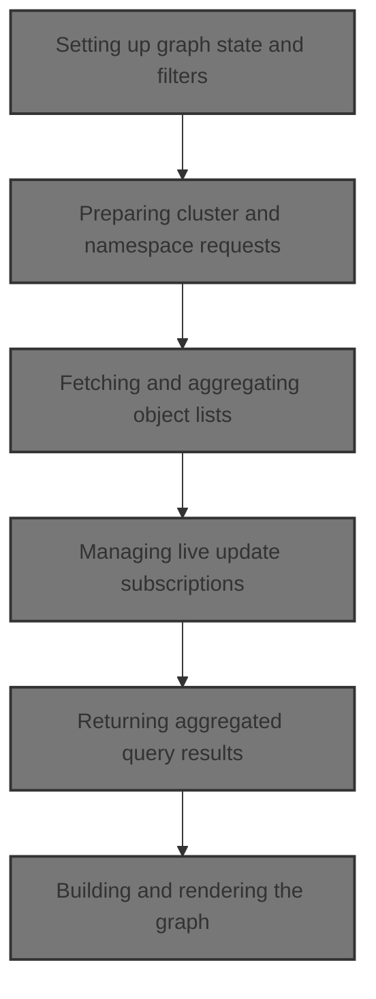
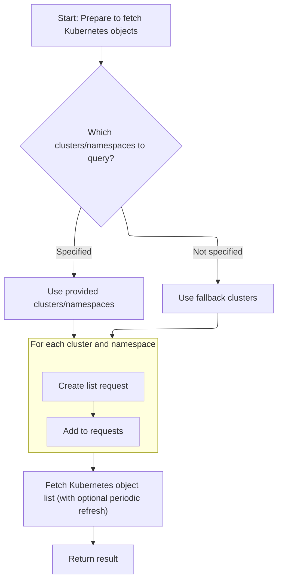
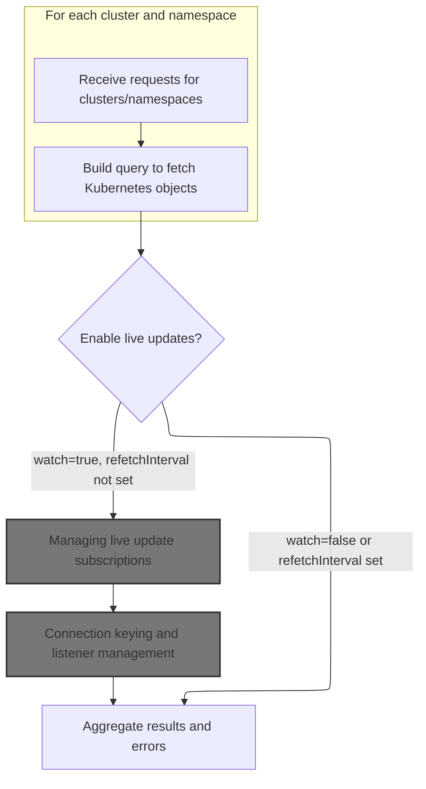
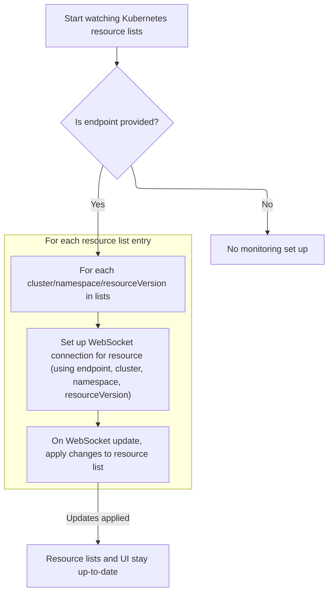
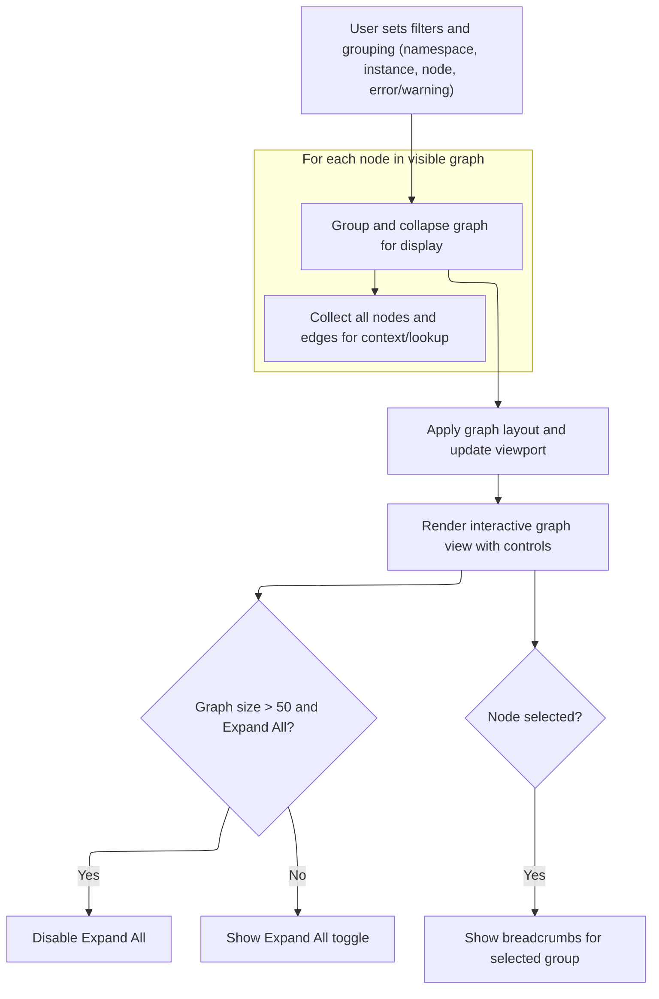

This document describes the flow for displaying an interactive graph of Kubernetes resources. Users interact with filters, grouping, and source selection controls, which drive requests for live cluster data. The system aggregates this data, subscribes to updates, and renders a dynamic graph view that updates in real time as the cluster state or user selections change.



# Setting up graph state and filters

<SwmSnippet path="/frontend/src/components/resourceMap/GraphView.tsx" line="124">

---

In <SwmToken path="frontend/src/components/resourceMap/GraphView.tsx" pos="124:2:2" line-data="function GraphViewContent({">`GraphViewContent`</SwmToken> we set up all the state for the graph, including filters, grouping, and selection. We fetch namespaces and nodes using KubeObject.useList so we can build the graph from live cluster data. Calling <SwmPath>[frontend/…/k8s/KubeObject.ts](frontend/src/lib/k8s/KubeObject.ts)</SwmPath> next lets us actually retrieve those objects from the backend.

```tsx
function GraphViewContent({
  height,
  defaultNodeSelection,
  defaultSources = useGetAllSources(),
  defaultFilters = defaultFiltersValue,
}: GraphViewContentProps) {
  const { t } = useTranslation();
  const dispatch = useDispatch();

  // List of selected namespaces
  const namespaces = useTypedSelector(state => state.filter).namespaces;

  // Sync namespace and URL
  const [namespacesParam] = useQueryParamsState<string>('namespace', '');
  useEffect(() => {
    const list = namespacesParam?.split(' ') ?? [];
    dispatch(setNamespaceFilter(list));
  }, [namespacesParam, dispatch]);

  // Filters
  const [hasErrorsFilter, setHasErrorsFilter] = useState(false);

  // Grouping state
  const [groupBy, setGroupBy] = useQueryParamsState<GroupBy | undefined>('group', 'namespace');

  // Keep track if user moved the viewport
  const viewportMovedRef = useRef(false);

  // ID of the selected Node, undefined means nothing is selected
  const [selectedNodeId, _setSelectedNodeId] = useQueryParamsState<string | undefined>(
    'node',
    defaultNodeSelection
  );
  const setSelectedNodeId = useCallback(
    (id: string | undefined) => {
      if (id === 'root') {
        _setSelectedNodeId(undefined);
        return;
      }
      _setSelectedNodeId(id);
    },
    [_setSelectedNodeId]
  );

  // Expand all groups state
  const [expandAll, setExpandAll] = useState(false);

  // Load source data
  const { nodes, edges, selectedSources, sourceData, isLoading, toggleSelection } = useSources();

  // Graph with applied layout, has sizes and positions for all elements
  const [layoutedGraph, setLayoutedGraph] = useState<{ nodes: Node[]; edges: Edge[] }>({
    nodes: [],
    edges: [],
  });

  // Apply filters
  const filteredGraph = useMemo(() => {
    const filters = [...defaultFilters];
    if (hasErrorsFilter) {
      filters.push({ type: 'hasErrors' });
    }
    if (namespaces?.size > 0) {
      filters.push({ type: 'namespace', namespaces });
    }
    return filterGraph(nodes, edges, filters);
  }, [nodes, edges, hasErrorsFilter, namespaces, defaultFilters]);

  // Group the graph
  const [allNamespaces] = Namespace.useList();
  const [allNodes] = K8sNode.useList();
```

---

</SwmSnippet>

## Preparing cluster and namespace requests



<SwmSnippet path="/frontend/src/lib/k8s/KubeObject.ts" line="330">

---

<SwmToken path="frontend/src/lib/k8s/KubeObject.ts" pos="330:3:3" line-data="  static useList&lt;K extends KubeObject&gt;(">`useList`</SwmToken> builds up the requests for each cluster and namespace combo, so we can fetch objects from all the places we care about. Next, we call <SwmToken path="frontend/src/lib/k8s/KubeObject.ts" pos="369:7:7" line-data="    const result = useKubeObjectList&lt;K&gt;({">`useKubeObjectList`</SwmToken> to actually run those queries and get the data.

```typescript
  static useList<K extends KubeObject>(
    this: (new (...args: any) => K) & typeof KubeObject<any>,
    {
      cluster,
      clusters,
      namespace,
      refetchInterval,
      ...queryParams
    }: {
      cluster?: string;
      clusters?: string[];
      namespace?: string | string[];
      /** How often to refetch the list. Won't refetch by default. Disables watching if set. */
      refetchInterval?: number;
    } & QueryParameters = {}
  ) {
    const fallbackClusters = useSelectedClusters();

    // Create requests for each cluster and namespace
    const requests = useMemo(() => {
      const clusterList = cluster
        ? [cluster]
        : clusters || (fallbackClusters.length === 0 ? [''] : fallbackClusters);

      const namespacesFromParams =
        typeof namespace === 'string'
          ? [namespace]
          : Array.isArray(namespace)
          ? namespace
          : undefined;

      return makeListRequests(
        clusterList,
        getAllowedNamespaces,
        this.isNamespaced,
        namespacesFromParams
      );
    }, [cluster, clusters, fallbackClusters, namespace, this.isNamespaced]);

    const result = useKubeObjectList<K>({
      queryParams: queryParams,
      kubeObjectClass: this,
      requests,
      refetchInterval,
    });

    return result;
  }
```

---

</SwmSnippet>

## Fetching and aggregating object lists



<SwmSnippet path="/frontend/src/lib/k8s/api/v2/useKubeObjectList.ts" line="399">

---

In <SwmToken path="frontend/src/lib/k8s/api/v2/useKubeObjectList.ts" pos="399:4:4" line-data="export function useKubeObjectList&lt;K extends KubeObject&gt;({">`useKubeObjectList`</SwmToken> we resolve the API endpoint (using the first cluster), clean up query params, and build queries for every <SwmPath>[frontend/…/components/namespace/](frontend/src/components/namespace/)</SwmPath> combo. We aggregate results, manage which lists to watch for updates, and set up live update hooks. Next, we call <SwmToken path="frontend/src/lib/k8s/api/v2/useKubeObjectList.ts" pos="529:1:1" line-data="  useWatchKubeObjectLists({">`useWatchKubeObjectLists`</SwmToken> to start watching for changes.

```typescript
export function useKubeObjectList<K extends KubeObject>({
  requests,
  kubeObjectClass,
  queryParams,
  watch = true,
  refetchInterval,
}: {
  requests: Array<{ cluster: string; namespaces?: string[] }>;
  /** Class to instantiate the object with */
  kubeObjectClass: (new (...args: any) => K) & typeof KubeObject<any>;
  queryParams?: QueryParameters;
  /** Watch for updates @default true */
  watch?: boolean;
  /** How often to refetch the list. Won't refetch by default. Disables watching if set. */
  refetchInterval?: number;
}): [Array<K> | null, ApiError | null] &
  QueryListResponse<Array<ListResponse<K> | undefined | null>, K, ApiError> {
  const maybeNamespace = requests.find(it => it.namespaces)?.namespaces?.[0];

  // Get working endpoint from the first cluster
  // Now if clusters have different apiVersions for the same resource for example, this will not work
  const { endpoint, error: endpointError } = useEndpoints(
    kubeObjectClass.apiEndpoint.apiInfo,
    requests[0]?.cluster,
    maybeNamespace
  );

  const cleanedUpQueryParams = Object.fromEntries(
    Object.entries(queryParams ?? {}).filter(([, value]) => value !== undefined && value !== '')
  );

  const queries = useMemo(
    () =>
      endpoint
        ? requests.flatMap(({ cluster, namespaces }) =>
            namespaces && namespaces.length > 0
              ? namespaces.map(namespace =>
                  kubeObjectListQuery<K>(
                    kubeObjectClass,
                    endpoint,
                    namespace,
                    cluster,
                    cleanedUpQueryParams,
                    refetchInterval
                  )
                )
              : kubeObjectListQuery<K>(
                  kubeObjectClass,
                  endpoint,
                  undefined,
                  cluster,
                  cleanedUpQueryParams,
                  refetchInterval
                )
          )
        : [],
    [requests, kubeObjectClass, endpoint, cleanedUpQueryParams]
  );

  const query = useQueries({
    queries,
    combine(results) {
      return {
        data: results.map(result => result.data),
        clusterResults: results.reduce((acc, result) => {
          if (result.data && result.data.cluster) {
            acc[result.data.cluster] = {
              data: result.data,
              error: result.error,
              errors: result.error ? [result.error] : null,
              isError: result.isError,
              isFetching: result.isFetching,
              isLoading: result.isLoading,
              isSuccess: result.isSuccess,
              items: result?.data?.list?.items ?? null,
              status: result.status,
            };
          }
          return acc;
        }, {} as Record<string, QueryListResponse<any, K, ApiError>>),
        items: results.every(result => result.data === null)
          ? null
          : results.flatMap(result => result?.data?.list?.items ?? []),
        errors: results.map(result => result.error).filter(Boolean),
        isError: results.some(result => result.isError),
        isLoading: results.some(result => result.isLoading),
        isFetching: results.some(result => result.isFetching),
        isSuccess: results.every(result => result.isSuccess),
      };
    },
  });

  const shouldWatch = watch && !refetchInterval && !query.isLoading;

  const [listsToWatch, setListsToWatch] = useState<
    { cluster: string; namespace?: string; resourceVersion: string }[]
  >([]);

  const listsNotYetWatched = query.data
    .filter(Boolean)
    .filter(
      data =>
        listsToWatch.find(
          // resourceVersion is intentionally omitted to avoid recreating WS connection when list is updated
          watching => watching.cluster === data?.cluster && watching.namespace === data.namespace
        ) === undefined
    )
    .map(data => ({
      cluster: data!.cluster,
      namespace: data!.namespace,
      resourceVersion: data!.list.metadata.resourceVersion,
    }));

  if (listsNotYetWatched.length > 0) {
    setListsToWatch([...listsToWatch, ...listsNotYetWatched]);
  }

  const listsToStopWatching = listsToWatch.filter(
    watching =>
      requests.find(request =>
        watching.cluster === request?.cluster && request.namespaces && watching.namespace
          ? request.namespaces?.includes(watching.namespace)
          : true
      ) === undefined
  );

  if (listsToStopWatching.length > 0) {
    setListsToWatch(listsToWatch.filter(it => !listsToStopWatching.includes(it)));
  }

  useWatchKubeObjectLists({
    lists: shouldWatch ? listsToWatch : [],
    endpoint,
    kubeObjectClass,
    queryParams: cleanedUpQueryParams,
  });

```

---

</SwmSnippet>

### Managing live update subscriptions

<SwmSnippet path="/frontend/src/lib/k8s/api/v2/useKubeObjectList.ts" line="127">

---

In <SwmToken path="frontend/src/lib/k8s/api/v2/useKubeObjectList.ts" pos="127:4:4" line-data="export function useWatchKubeObjectLists&lt;K extends KubeObject&gt;({">`useWatchKubeObjectLists`</SwmToken> we decide whether to use multiplexed or legacy <SwmToken path="frontend/src/lib/k8s/api/v2/useKubeObjectList.ts" pos="135:11:11" line-data="  /** Query parameters for the WebSocket connection URL */">`WebSocket`</SwmToken> watching. Multiplexed mode sets up subscriptions for each <SwmPath>[frontend/…/components/namespace/](frontend/src/components/namespace/)</SwmPath>, tracks resource versions, and updates the cache on incoming messages. If multiplexing isn't enabled, we fall back to legacy logic next.

```typescript
export function useWatchKubeObjectLists<K extends KubeObject>({
  kubeObjectClass,
  endpoint,
  lists,
  queryParams,
}: {
  /** KubeObject class of the watched resource list */
  kubeObjectClass: (new (...args: any) => K) & typeof KubeObject<any>;
  /** Query parameters for the WebSocket connection URL */
  queryParams?: QueryParameters;
  /** Kube resource API endpoint information */
  endpoint?: KubeObjectEndpoint | null;
  /** Which clusters and namespaces to watch */
  lists: Array<{ cluster: string; namespace?: string; resourceVersion: string }>;
}) {
  if (getWebsocketMultiplexerEnabled()) {
    return useWatchKubeObjectListsMultiplexed({
      kubeObjectClass,
      endpoint,
      lists,
      queryParams,
    });
  } else {
```

---

</SwmSnippet>

<SwmSnippet path="/frontend/src/lib/k8s/api/v2/useKubeObjectList.ts" line="170">

---

<SwmToken path="frontend/src/lib/k8s/api/v2/useKubeObjectList.ts" pos="170:2:2" line-data="function useWatchKubeObjectListsMultiplexed&lt;K extends KubeObject&gt;({">`useWatchKubeObjectListsMultiplexed`</SwmToken> sets up <SwmToken path="frontend/src/lib/k8s/api/v2/useKubeObjectList.ts" pos="203:5:5" line-data="      // Construct WebSocket URL with current parameters">`WebSocket`</SwmToken> subscriptions for each <SwmPath>[frontend/…/components/namespace/](frontend/src/components/namespace/)</SwmPath>, tracks resource versions to avoid duplicate updates, memoizes connection <SwmToken path="frontend/src/lib/k8s/api/v2/useKubeObjectList.ts" pos="190:9:9" line-data="  // Create stable connection URLs for each list">`URLs`</SwmToken>, and updates the React Query cache only when the list actually changes. It also handles retries and cleans up subscriptions when the component unmounts.

```typescript
function useWatchKubeObjectListsMultiplexed<K extends KubeObject>({
  kubeObjectClass,
  endpoint,
  lists,
  queryParams,
}: {
  kubeObjectClass: (new (...args: any) => K) & typeof KubeObject<any>;
  endpoint?: KubeObjectEndpoint | null;
  lists: Array<{ cluster: string; namespace?: string; resourceVersion: string }>;
  queryParams?: QueryParameters;
}): void {
  const client = useQueryClient();

  // Track the latest resource versions to prevent duplicate updates
  const latestResourceVersions = useRef<Record<string, string>>({});

  // Stabilize queryParams to prevent unnecessary effect triggers
  // Only update when the stringified params change
  const stableQueryParams = useMemo(() => queryParams, [JSON.stringify(queryParams)]);

  // Create stable connection URLs for each list
  // Updates only when endpoint, lists, or stableQueryParams change
  const connections = useMemo(() => {
    if (!endpoint) {
      return [];
    }

    return lists.map(list => {
      const key = `${list.cluster}:${list.namespace || ''}`;

      // Always use the latest resource version from the server
      latestResourceVersions.current[key] = list.resourceVersion;

      // Construct WebSocket URL with current parameters
      return {
        url: makeUrl([KubeObjectEndpoint.toUrl(endpoint, list.namespace)], {
          ...stableQueryParams,
          watch: 1,
          resourceVersion: latestResourceVersions.current[key],
        }),
        cluster: list.cluster,
        namespace: list.namespace,
      };
    });
  }, [endpoint, lists, stableQueryParams]);

  // Create stable update handler to process WebSocket messages
  // Re-create only when dependencies change
  const handleUpdate = useCallback(
    (update: any, cluster: string, namespace: string | undefined) => {
      if (!update || typeof update !== 'object' || !endpoint) {
        return;
      }

      const key = `${cluster}:${namespace || ''}`;

      // Update resource version from incoming message
      if (update.object?.metadata?.resourceVersion) {
        latestResourceVersions.current[key] = update.object.metadata.resourceVersion;
      }

      // Create query key for React Query cache
      const queryKey = kubeObjectListQuery<K>(
        kubeObjectClass,
        endpoint,
        namespace,
        cluster,
        stableQueryParams ?? {}
      ).queryKey;

      // Update React Query cache with new data
      client.setQueryData(queryKey, (oldResponse: ListResponse<any> | undefined | null) => {
        if (!oldResponse) {
          return oldResponse;
        }

        const newList = KubeList.applyUpdate(oldResponse.list, update, kubeObjectClass, cluster);

        // Only update if the list actually changed
        if (newList === oldResponse.list) {
          return oldResponse;
        }

        return { ...oldResponse, list: newList };
      });
    },
    [client, kubeObjectClass, endpoint, stableQueryParams]
  );

  // Set up WebSocket subscriptions
  useEffect(() => {
    if (!endpoint || connections.length === 0) {
      return;
    }

    const cleanups: (() => void)[] = [];

    // Create subscriptions for each connection
    connections.forEach(({ url, cluster, namespace }) => {
      const parsedUrl = new URL(url, BASE_WS_URL);

      // Subscribe to WebSocket updates
      WebSocketManager.subscribe(cluster, parsedUrl.pathname, parsedUrl.search.slice(1), update =>
        handleUpdate(update, cluster, namespace)
      ).then(
        cleanup => cleanups.push(cleanup),
        error => {
          // Track retry count in the URL's searchParams
          const retryCount = parseInt(parsedUrl.searchParams.get('retryCount') || '0');
          if (retryCount < 3) {
            // Only log and allow retry if under threshold
            console.error('WebSocket subscription failed:', error);
            parsedUrl.searchParams.set('retryCount', (retryCount + 1).toString());
          }
        }
      );
    });

    // Cleanup subscriptions when effect re-runs or unmounts
    return () => {
      cleanups.forEach(cleanup => cleanup());
    };
  }, [connections, endpoint, handleUpdate]);
}
```

---

</SwmSnippet>

<SwmSnippet path="/frontend/src/lib/k8s/api/v2/useKubeObjectList.ts" line="150">

---

We just returned from the multiplexed watcher in <SwmToken path="frontend/src/lib/k8s/KubeObject.ts" pos="369:7:7" line-data="    const result = useKubeObjectList&lt;K&gt;({">`useKubeObjectList`</SwmToken>. If multiplexing isn't enabled, we call <SwmToken path="frontend/src/lib/k8s/api/v2/useKubeObjectList.ts" pos="150:3:3" line-data="    return useWatchKubeObjectListsLegacy({">`useWatchKubeObjectListsLegacy`</SwmToken> to set up the old-style <SwmToken path="frontend/src/lib/k8s/api/v2/useKubeObjectList.ts" pos="135:11:11" line-data="  /** Query parameters for the WebSocket connection URL */">`WebSocket`</SwmToken> subscriptions for updates.

```typescript
    return useWatchKubeObjectListsLegacy({
      kubeObjectClass,
      endpoint,
      lists,
      queryParams,
    });
  }
}
```

---

</SwmSnippet>

### Legacy <SwmToken path="frontend/src/lib/k8s/api/v2/useKubeObjectList.ts" pos="135:11:11" line-data="  /** Query parameters for the WebSocket connection URL */">`WebSocket`</SwmToken> subscription handling



<SwmSnippet path="/frontend/src/lib/k8s/api/v2/useKubeObjectList.ts" line="303">

---

<SwmToken path="frontend/src/lib/k8s/api/v2/useKubeObjectList.ts" pos="303:2:2" line-data="function useWatchKubeObjectListsLegacy&lt;K extends KubeObject&gt;({">`useWatchKubeObjectListsLegacy`</SwmToken> sets up a connection for each <SwmPath>[frontend/…/components/namespace/](frontend/src/components/namespace/)</SwmPath>, and hooks up message handlers to update the cache. Next, we call <SwmToken path="frontend/src/lib/k8s/api/v2/useKubeObjectList.ts" pos="357:1:1" line-data="  useWebSockets&lt;KubeListUpdateEvent&lt;K&gt;&gt;({">`useWebSockets`</SwmToken> to actually open and manage those connections.

```typescript
function useWatchKubeObjectListsLegacy<K extends KubeObject>({
  kubeObjectClass,
  endpoint,
  lists,
  queryParams,
}: {
  /** KubeObject class of the watched resource list */
  kubeObjectClass: (new (...args: any) => K) & typeof KubeObject<any>;
  /** Query parameters for the WebSocket connection URL */
  queryParams?: QueryParameters;
  /** Kube resource API endpoint information */
  endpoint?: KubeObjectEndpoint | null;
  /** Which clusters and namespaces to watch */
  lists: Array<{ cluster: string; namespace?: string; resourceVersion: string }>;
}) {
  const client = useQueryClient();

  const connections = useMemo(() => {
    if (!endpoint) return [];

    return lists.map(({ cluster, namespace, resourceVersion }) => {
      const url = makeUrl([KubeObjectEndpoint.toUrl(endpoint!, namespace)], {
        ...queryParams,
        watch: 1,
        resourceVersion,
      });

      return {
        cluster,
        url,
        onMessage(update: KubeListUpdateEvent<K>) {
          const key = kubeObjectListQuery<K>(
            kubeObjectClass,
            endpoint,
            namespace,
            cluster,
            queryParams ?? {}
          ).queryKey;
          client.setQueryData(key, (oldResponse: ListResponse<any> | undefined | null) => {
            if (!oldResponse) return oldResponse;

            const newList = KubeList.applyUpdate(
              oldResponse.list,
              update,
              kubeObjectClass,
              cluster
            );
            return { ...oldResponse, list: newList };
          });
        },
      };
    });
  }, [lists, kubeObjectClass, endpoint]);

  useWebSockets<KubeListUpdateEvent<K>>({
    enabled: !!endpoint,
    connections,
  });
}
```

---

</SwmSnippet>

### Opening and managing <SwmToken path="frontend/src/lib/k8s/api/v2/useKubeObjectList.ts" pos="135:11:11" line-data="  /** Query parameters for the WebSocket connection URL */">`WebSocket`</SwmToken> connections

See <SwmLink doc-title="Managing Real-Time Updates with WebSocket Connections">[Managing Real-Time Updates with WebSocket Connections](/.swm/managing-real-time-updates-with-websocket-connections.5xm43umj.sw.md)</SwmLink>

### Connection keying and listener management

```mermaid
%%{init: {"flowchart": {"defaultRenderer": "elk"}} }%%
flowchart TD
  node1["Request to connect to WebSocket"] --> node2{"Is there a connection for this cluster + URL?"}
  click node1 openCode "frontend/src/lib/k8s/api/v2/webSocket.ts:591:640"
  node2 -->|"No"| node3["Add message listener and mark connection as pending"]
  click node2 openCode "frontend/src/lib/k8s/api/v2/webSocket.ts:594:599"
  node3 --> node4["Open WebSocket connection"]
  click node3 openCode "frontend/src/lib/k8s/api/v2/webSocket.ts:602:615"
  node4 --> node5{"Is connection still needed when open?"}
  click node4 openCode "frontend/src/lib/k8s/api/v2/webSocket.ts:608:612"
  node5 -->|"Yes"| node6["Store WebSocket instance"]
  click node5 openCode "frontend/src/lib/k8s/api/v2/webSocket.ts:614:615"
  node5 -->|"No"| node7["Close WebSocket and remove connection"]
  click node7 openCode "frontend/src/lib/k8s/api/v2/webSocket.ts:609:611"
  node2 -->|"Yes"| node8["Add message listener"]
  click node8 openCode "frontend/src/lib/k8s/api/v2/webSocket.ts:596:596"
  node6 --> node9["Return cleanup function"]
  node7 --> node9
  node8 --> node9
  node9["Return cleanup function"]
  click node9 openCode "frontend/src/lib/k8s/api/v2/webSocket.ts:621:639"

  subgraph cleanup["Cleanup on disconnect"]
    node10["Remove message listener"]
    click node10 openCode "frontend/src/lib/k8s/api/v2/webSocket.ts:625:626"
    node10 --> node11{"Are any listeners left?"}
    click node11 openCode "frontend/src/lib/k8s/api/v2/webSocket.ts:630:638"
    node11 -->|"No"| node12["Close and remove WebSocket connection"]
    click node12 openCode "frontend/src/lib/k8s/api/v2/webSocket.ts:634:637"
    node11 -->|"Yes"| node13["Keep connection open"]
    click node13 openCode "frontend/src/lib/k8s/api/v2/webSocket.ts:638:638"
  end
  node9 -. On disconnect .-> node10
classDef HeadingStyle fill:#777777,stroke:#333,stroke-width:2px;

%% Swimm:
%% %%{init: {"flowchart": {"defaultRenderer": "elk"}} }%%
%% flowchart TD
%%   node1["Request to connect to <SwmToken path="frontend/src/lib/k8s/api/v2/useKubeObjectList.ts" pos="135:11:11" line-data="  /** Query parameters for the WebSocket connection URL */">`WebSocket`</SwmToken>"] --> node2{"Is there a connection for this cluster + URL?"}
%%   click node1 openCode "<SwmPath>[frontend/…/v2/webSocket.ts](frontend/src/lib/k8s/api/v2/webSocket.ts)</SwmPath>:591:640"
%%   node2 -->|"No"| node3["Add message listener and mark connection as pending"]
%%   click node2 openCode "<SwmPath>[frontend/…/v2/webSocket.ts](frontend/src/lib/k8s/api/v2/webSocket.ts)</SwmPath>:594:599"
%%   node3 --> node4["Open <SwmToken path="frontend/src/lib/k8s/api/v2/useKubeObjectList.ts" pos="135:11:11" line-data="  /** Query parameters for the WebSocket connection URL */">`WebSocket`</SwmToken> connection"]
%%   click node3 openCode "<SwmPath>[frontend/…/v2/webSocket.ts](frontend/src/lib/k8s/api/v2/webSocket.ts)</SwmPath>:602:615"
%%   node4 --> node5{"Is connection still needed when open?"}
%%   click node4 openCode "<SwmPath>[frontend/…/v2/webSocket.ts](frontend/src/lib/k8s/api/v2/webSocket.ts)</SwmPath>:608:612"
%%   node5 -->|"Yes"| node6["Store <SwmToken path="frontend/src/lib/k8s/api/v2/useKubeObjectList.ts" pos="135:11:11" line-data="  /** Query parameters for the WebSocket connection URL */">`WebSocket`</SwmToken> instance"]
%%   click node5 openCode "<SwmPath>[frontend/…/v2/webSocket.ts](frontend/src/lib/k8s/api/v2/webSocket.ts)</SwmPath>:614:615"
%%   node5 -->|"No"| node7["Close <SwmToken path="frontend/src/lib/k8s/api/v2/useKubeObjectList.ts" pos="135:11:11" line-data="  /** Query parameters for the WebSocket connection URL */">`WebSocket`</SwmToken> and remove connection"]
%%   click node7 openCode "<SwmPath>[frontend/…/v2/webSocket.ts](frontend/src/lib/k8s/api/v2/webSocket.ts)</SwmPath>:609:611"
%%   node2 -->|"Yes"| node8["Add message listener"]
%%   click node8 openCode "<SwmPath>[frontend/…/v2/webSocket.ts](frontend/src/lib/k8s/api/v2/webSocket.ts)</SwmPath>:596:596"
%%   node6 --> node9["Return cleanup function"]
%%   node7 --> node9
%%   node8 --> node9
%%   node9["Return cleanup function"]
%%   click node9 openCode "<SwmPath>[frontend/…/v2/webSocket.ts](frontend/src/lib/k8s/api/v2/webSocket.ts)</SwmPath>:621:639"
%% 
%%   subgraph cleanup["Cleanup on disconnect"]
%%     node10["Remove message listener"]
%%     click node10 openCode "<SwmPath>[frontend/…/v2/webSocket.ts](frontend/src/lib/k8s/api/v2/webSocket.ts)</SwmPath>:625:626"
%%     node10 --> node11{"Are any listeners left?"}
%%     click node11 openCode "<SwmPath>[frontend/…/v2/webSocket.ts](frontend/src/lib/k8s/api/v2/webSocket.ts)</SwmPath>:630:638"
%%     node11 -->|"No"| node12["Close and remove <SwmToken path="frontend/src/lib/k8s/api/v2/useKubeObjectList.ts" pos="135:11:11" line-data="  /** Query parameters for the WebSocket connection URL */">`WebSocket`</SwmToken> connection"]
%%     click node12 openCode "<SwmPath>[frontend/…/v2/webSocket.ts](frontend/src/lib/k8s/api/v2/webSocket.ts)</SwmPath>:634:637"
%%     node11 -->|"Yes"| node13["Keep connection open"]
%%     click node13 openCode "<SwmPath>[frontend/…/v2/webSocket.ts](frontend/src/lib/k8s/api/v2/webSocket.ts)</SwmPath>:638:638"
%%   end
%%   node9 -. On disconnect .-> node10
%% classDef HeadingStyle fill:#777777,stroke:#333,stroke-width:2px;
```



<SwmSnippet path="/frontend/src/lib/k8s/api/v2/webSocket.ts" line="591">

---

In <SwmToken path="frontend/src/lib/k8s/api/v2/webSocket.ts" pos="591:3:3" line-data="    function connect({ cluster, url, onMessage }: WebSocketConnectionRequest&lt;T&gt;) {">`connect`</SwmToken> we use cluster+url as a key to manage <SwmToken path="frontend/src/lib/k8s/api/v2/webSocket.ts" pos="601:6:6" line-data="        let ws: WebSocket | undefined;">`WebSocket`</SwmToken> connections and listeners. We open the socket asynchronously, and if the hook unmounts before it's ready, we clean up to avoid leaks. Next, we return a cleanup function to handle listener removal and socket closing.

```typescript
    function connect({ cluster, url, onMessage }: WebSocketConnectionRequest<T>) {
      const connectionKey = cluster + url;

      if (!sockets.has(connectionKey)) {
        // Add new listener for this URL
        listeners.set(connectionKey, [...(listeners.get(connectionKey) ?? []), onMessage]);

        // Mark socket as pending, so we don't open more than one
        sockets.set(connectionKey, 'pending');

        let ws: WebSocket | undefined;
        openWebSocket(url, { protocols, type, cluster, onMessage })
          .then(socket => {
```

---

</SwmSnippet>

<SwmSnippet path="/frontend/src/lib/k8s/api/v2/webSocket.ts" line="604">

---

We just returned from the connect logic in <SwmPath>[frontend/…/v2/webSocket.ts](frontend/src/lib/k8s/api/v2/webSocket.ts)</SwmPath>. The cleanup function removes listeners, closes sockets if no listeners remain, and deletes the socket from the map. This keeps connections alive only when needed and avoids leaks.

```typescript
            ws = socket;

            // Hook was unmounted while it was connecting to WebSocket
            // so we close the socket and clean up
            if (!isCurrent) {
              ws.close();
              sockets.delete(connectionKey);
              return;
            }

            sockets.set(connectionKey, ws);
          })
          .catch(err => {
            console.error(err);
          });
      }

      return () => {
        const connectionKey = cluster + url;

        // Clean up the listener
        const newListeners = listeners.get(connectionKey)?.filter(it => it !== onMessage) ?? [];
        listeners.set(connectionKey, newListeners);

        // No one is listening to the connection
        // so we can close it
        if (newListeners.length === 0) {
          const maybeExisting = sockets.get(connectionKey);
          if (maybeExisting) {
            if (maybeExisting !== 'pending') {
              maybeExisting.close();
            }
            sockets.delete(connectionKey);
          }
        }
      };
    }
```

---

</SwmSnippet>

### Returning aggregated query results

```mermaid
%%{init: {"flowchart": {"defaultRenderer": "elk"}} }%%
flowchart TD
  node1["Check for endpoint error"]
  click node1 openCode "frontend/src/lib/k8s/api/v2/useKubeObjectList.ts:536:537"
  node1 --> node2{"Is endpointError present?"}
  click node2 openCode "frontend/src/lib/k8s/api/v2/useKubeObjectList.ts:540:542"
  node2 -->|"Yes"| node3[Return: items=[], errors=[endpointError], error=endpointError, status, clusterResults]
  click node3 openCode "frontend/src/lib/k8s/api/v2/useKubeObjectList.ts:540:547"
  node2 -->|"No"| node4{"Are there non-null errors?"}
  click node4 openCode "frontend/src/lib/k8s/api/v2/useKubeObjectList.ts:541:542"
  node4 -->|"Yes"| node5["Return: items=query.items, errors=non-null errors, error=first non-null error, status, clusterResults"]
  click node5 openCode "frontend/src/lib/k8s/api/v2/useKubeObjectList.ts:540:547"
  node4 -->|"No"| node6["Return: items=query.items, errors=null, error=null, status, clusterResults"]
  click node6 openCode "frontend/src/lib/k8s/api/v2/useKubeObjectList.ts:540:547"

  node3 --> loop1
  node5 --> loop1
  node6 --> loop1

  subgraph loop1["For consumers: Iterate over results"]
    node7["Yield items"]
    click node7 openCode "frontend/src/lib/k8s/api/v2/useKubeObjectList.ts:549:549"
    node8["Yield error"]
    click node8 openCode "frontend/src/lib/k8s/api/v2/useKubeObjectList.ts:550:550"
  end

classDef HeadingStyle fill:#777777,stroke:#333,stroke-width:2px;

%% Swimm:
%% %%{init: {"flowchart": {"defaultRenderer": "elk"}} }%%
%% flowchart TD
%%   node1["Check for endpoint error"]
%%   click node1 openCode "<SwmPath>[frontend/…/v2/useKubeObjectList.ts](frontend/src/lib/k8s/api/v2/useKubeObjectList.ts)</SwmPath>:536:537"
%%   node1 --> node2{"Is <SwmToken path="frontend/src/lib/k8s/api/v2/useKubeObjectList.ts" pos="420:11:11" line-data="  const { endpoint, error: endpointError } = useEndpoints(">`endpointError`</SwmToken> present?"}
%%   click node2 openCode "<SwmPath>[frontend/…/v2/useKubeObjectList.ts](frontend/src/lib/k8s/api/v2/useKubeObjectList.ts)</SwmPath>:540:542"
%%   node2 -->|"Yes"| node3[Return: items=[], errors=[<SwmToken path="frontend/src/lib/k8s/api/v2/useKubeObjectList.ts" pos="420:11:11" line-data="  const { endpoint, error: endpointError } = useEndpoints(">`endpointError`</SwmToken>], error=<SwmToken path="frontend/src/lib/k8s/api/v2/useKubeObjectList.ts" pos="420:11:11" line-data="  const { endpoint, error: endpointError } = useEndpoints(">`endpointError`</SwmToken>, status, <SwmToken path="frontend/src/lib/k8s/api/v2/useKubeObjectList.ts" pos="463:1:1" line-data="        clusterResults: results.reduce((acc, result) =&gt; {">`clusterResults`</SwmToken>]
%%   click node3 openCode "<SwmPath>[frontend/…/v2/useKubeObjectList.ts](frontend/src/lib/k8s/api/v2/useKubeObjectList.ts)</SwmPath>:540:547"
%%   node2 -->|"No"| node4{"Are there non-null errors?"}
%%   click node4 openCode "<SwmPath>[frontend/…/v2/useKubeObjectList.ts](frontend/src/lib/k8s/api/v2/useKubeObjectList.ts)</SwmPath>:541:542"
%%   node4 -->|"Yes"| node5["Return: items=<SwmToken path="frontend/src/lib/k8s/api/v2/useKubeObjectList.ts" pos="540:13:15" line-data="    items: endpointError ? [] : query.items,">`query.items`</SwmToken>, errors=non-null errors, error=first non-null error, status, <SwmToken path="frontend/src/lib/k8s/api/v2/useKubeObjectList.ts" pos="463:1:1" line-data="        clusterResults: results.reduce((acc, result) =&gt; {">`clusterResults`</SwmToken>"]
%%   click node5 openCode "<SwmPath>[frontend/…/v2/useKubeObjectList.ts](frontend/src/lib/k8s/api/v2/useKubeObjectList.ts)</SwmPath>:540:547"
%%   node4 -->|"No"| node6["Return: items=<SwmToken path="frontend/src/lib/k8s/api/v2/useKubeObjectList.ts" pos="540:13:15" line-data="    items: endpointError ? [] : query.items,">`query.items`</SwmToken>, errors=null, error=null, status, <SwmToken path="frontend/src/lib/k8s/api/v2/useKubeObjectList.ts" pos="463:1:1" line-data="        clusterResults: results.reduce((acc, result) =&gt; {">`clusterResults`</SwmToken>"]
%%   click node6 openCode "<SwmPath>[frontend/…/v2/useKubeObjectList.ts](frontend/src/lib/k8s/api/v2/useKubeObjectList.ts)</SwmPath>:540:547"
%% 
%%   node3 --> loop1
%%   node5 --> loop1
%%   node6 --> loop1
%% 
%%   subgraph loop1["For consumers: Iterate over results"]
%%     node7["Yield items"]
%%     click node7 openCode "<SwmPath>[frontend/…/v2/useKubeObjectList.ts](frontend/src/lib/k8s/api/v2/useKubeObjectList.ts)</SwmPath>:549:549"
%%     node8["Yield error"]
%%     click node8 openCode "<SwmPath>[frontend/…/v2/useKubeObjectList.ts](frontend/src/lib/k8s/api/v2/useKubeObjectList.ts)</SwmPath>:550:550"
%%   end
%% 
%% classDef HeadingStyle fill:#777777,stroke:#333,stroke-width:2px;
```

<SwmSnippet path="/frontend/src/lib/k8s/api/v2/useKubeObjectList.ts" line="536">

---

We just returned from <SwmToken path="frontend/src/lib/k8s/KubeObject.ts" pos="369:7:7" line-data="    const result = useKubeObjectList&lt;K&gt;({">`useKubeObjectList`</SwmToken>. Here, we filter errors, package up items, errors, cluster results, and status flags, and return everything so the UI can use it directly.

```typescript
  const errors = query.errors.filter(it => it !== null);

  // @ts-ignore - TS compiler gets confused with iterators
  return {
    items: endpointError ? [] : query.items,
    errors: endpointError ? [endpointError] : errors.length > 0 ? errors : null,
    error: endpointError ?? query.errors.find(it => it !== null) ?? null,
    clusterResults: query.clusterResults,
    isError: query.isError,
    isLoading: query.isLoading,
    isFetching: query.isFetching,
    isSuccess: query.isSuccess,
    *[Symbol.iterator](): ArrayIterator<ApiError | K[] | null> {
      yield query.items;
      yield endpointError ?? query.errors.find(it => it !== null) ?? null;
    },
  };
}
```

---

</SwmSnippet>

## Building and rendering the graph



<SwmSnippet path="/frontend/src/components/resourceMap/GraphView.tsx" line="195">

---

We just returned from KubeObject.useList in <SwmToken path="frontend/src/components/resourceMap/GraphView.tsx" pos="124:2:2" line-data="function GraphViewContent({">`GraphViewContent`</SwmToken>. Now we group, collapse, and lay out the graph, set up context for selection, and render everything with controls and providers. This is where the UI comes together.

```tsx
  const { visibleGraph, fullGraph } = useMemo(() => {
    const graph = groupGraph(filteredGraph.nodes, filteredGraph.edges, {
      groupBy,
      namespaces: allNamespaces ?? [],
      k8sNodes: allNodes ?? [],
    });

    const visibleGraph = collapseGraph(graph, { selectedNodeId, expandAll });

    return { visibleGraph, fullGraph: graph };
  }, [filteredGraph, groupBy, selectedNodeId, expandAll, allNamespaces]);

  const viewport = useGraphViewport();

  useEffect(() => {
    let isCurrent = true;
    applyGraphLayout(visibleGraph, viewport.aspectRatio).then(layout => {
      if (!isCurrent) return;

      setLayoutedGraph(layout);

      // Only fit bounds when user hasn't moved viewport manually
      if (!viewportMovedRef.current) {
        viewport.updateViewport({ nodes: layout.nodes });
      }
    });

    return () => {
      isCurrent = false;
    };
  }, [visibleGraph, viewport]);

  // Reset after view change
  useLayoutEffect(() => {
    viewportMovedRef.current = false;
  }, [selectedNodeId, groupBy, expandAll]);

  const selectedGroup = useMemo(() => {
    if (selectedNodeId) {
      return findGroupContaining(visibleGraph, selectedNodeId, true);
    }
  }, [selectedNodeId, visibleGraph, findGroupContaining]);

  const graphSize = getGraphSize(visibleGraph);
  useEffect(() => {
    if (expandAll && graphSize > 50) {
      setExpandAll(false);
    }
  }, [graphSize]);

  const contextValue = useMemo(
    () => ({ nodeSelection: selectedNodeId, setNodeSelection: setSelectedNodeId }),
    [selectedNodeId, setSelectedNodeId]
  );

  const fullGraphContext = useMemo(() => {
    let nodes: GraphNode[] = [];
    let edges: GraphEdge[] = [];

    forEachNode(visibleGraph, node => {
      if (node.nodes) {
        nodes = nodes.concat(node.nodes);
      }
      if (node.edges) {
        edges = edges.concat(node.edges);
      }
    });

    return {
      visibleGraph,
      lookup: makeGraphLookup(nodes, edges),
    };
  }, [visibleGraph]);

  return (
    <GraphViewContext.Provider value={contextValue}>
      <FullGraphContext.Provider value={fullGraphContext}>
        <Box
          sx={{
            position: 'relative',
            height: height ?? '800px',
            display: 'flex',
            flexDirection: 'row',
            flex: 1,
          }}
        >
          <CustomThemeProvider>
            <Box
              sx={{
                overflow: 'hidden',
                display: 'flex',
                flexDirection: 'column',
                position: 'relative',
                flexGrow: 1,
                background: '#00000002',
              }}
            >
              <Box
                padding={2}
                pb={0}
                display="flex"
                gap={1}
                alignItems="center"
                mb={1}
                flexWrap="wrap"
              >
                <NamespacesAutocomplete />

                <GraphSourcesView
                  sources={defaultSources}
                  selectedSources={selectedSources}
                  toggleSource={toggleSelection}
                  sourceData={sourceData ?? new Map()}
                />
                <Box sx={{ fontSize: '14px', marginLeft: 1 }}>{t('Group By')}</Box>
                <ChipGroup>
                  {namespaces.size !== 1 && (
                    <ChipToggleButton
                      label={t('Namespace')}
                      isActive={groupBy === 'namespace'}
                      onClick={() => setGroupBy(groupBy === 'namespace' ? undefined : 'namespace')}
                    />
                  )}
                  <ChipToggleButton
                    label={t('Instance')}
                    isActive={groupBy === 'instance'}
                    onClick={() => setGroupBy(groupBy === 'instance' ? undefined : 'instance')}
                  />
                  <ChipToggleButton
                    label={t('Node')}
                    isActive={groupBy === 'node'}
                    onClick={() => setGroupBy(groupBy === 'node' ? undefined : 'node')}
                  />
                </ChipGroup>
                <ChipToggleButton
                  label={t('Status: Error or Warning')}
                  isActive={hasErrorsFilter}
                  onClick={() => setHasErrorsFilter(!hasErrorsFilter)}
                />

                {graphSize < 50 && (
                  <ChipToggleButton
                    label={t('Expand All')}
                    isActive={expandAll}
                    onClick={() => setExpandAll(it => !it)}
                  />
                )}
              </Box>

              <div style={{ flexGrow: 1 }}>
                <GraphRenderer
                  nodes={layoutedGraph.nodes}
                  edges={layoutedGraph.edges}
                  isLoading={isLoading}
                  onMoveStart={e => {
                    if (e === null) return;
                    viewportMovedRef.current = true;
                  }}
                  controlActions={
                    <>
                      <GraphControlButton
                        title={t('Fit to screen')}
                        onClick={() => viewport.updateViewport({ mode: 'fit' })}
                      >
                        <Icon icon="mdi:fit-to-screen" />
                      </GraphControlButton>
                      <GraphControlButton
                        title={t('Zoom to 100%')}
                        onClick={() => viewport.updateViewport({ mode: '100%' })}
                      >
                        100%
                      </GraphControlButton>
                    </>
                  }
                >
                  <Panel position="top-left">
                    {selectedGroup && (
                      <SelectionBreadcrumbs
                        graph={fullGraph}
                        selectedNodeId={selectedNodeId}
                        onNodeClick={id => setSelectedNodeId(id)}
                      />
                    )}
                  </Panel>
                </GraphRenderer>
              </div>
            </Box>
          </CustomThemeProvider>
        </Box>
      </FullGraphContext.Provider>
    </GraphViewContext.Provider>
  );
}
```

---

</SwmSnippet>

&nbsp;

*This is an auto-generated document by Swimm 🌊 and has not yet been verified by a human*

<SwmMeta version="3.0.0" repo-id="Z2l0aHViJTNBJTNBdHlwZXNjcmlwdC1oZWFkbGFtcCUzQSUzQXJpY2FyZG9sb3Blemc=" repo-name="typescript-headlamp"><sup>Powered by [Swimm](https://app.swimm.io/)</sup></SwmMeta>
