This document explains how interactive links for Kubernetes objects are provided. When a user clicks a link, the system determines the correct endpoint and ensures the displayed information is current. The link either triggers a custom action or navigates to the object's details page.

# Handling Kubernetes Object Links and Endpoint Resolution

```mermaid
%%{init: {"flowchart": {"defaultRenderer": "elk"}} }%%
flowchart TD
  node1["Render link for Kubernetes object, showing name or custom content"]
  click node1 openCode "frontend/src/components/common/Link.tsx:69:94"
  node1 --> node2["Prepopulate and invalidate query cache for object"]
  click node2 openCode "frontend/src/components/common/Link.tsx:71:82"
  node2 --> node3{"Was custom action provided?"}
  click node3 openCode "frontend/src/components/common/Link.tsx:84:87"
  node3 -->|"Yes"| node4["Trigger custom action and disable navigation"]
  click node4 openCode "frontend/src/components/common/Link.tsx:85:87"
  node3 -->|"No"| node5["Navigate to object details page"]
  click node5 openCode "frontend/src/components/common/Link.tsx:90:91"

classDef HeadingStyle fill:#777777,stroke:#333,stroke-width:2px;

%% Swimm:
%% %%{init: {"flowchart": {"defaultRenderer": "elk"}} }%%
%% flowchart TD
%%   node1["Render link for Kubernetes object, showing name or custom content"]
%%   click node1 openCode "<SwmPath>[frontend/…/common/Link.tsx](frontend/src/components/common/Link.tsx)</SwmPath>:69:94"
%%   node1 --> node2["Prepopulate and invalidate query cache for object"]
%%   click node2 openCode "<SwmPath>[frontend/…/common/Link.tsx](frontend/src/components/common/Link.tsx)</SwmPath>:71:82"
%%   node2 --> node3{"Was custom action provided?"}
%%   click node3 openCode "<SwmPath>[frontend/…/common/Link.tsx](frontend/src/components/common/Link.tsx)</SwmPath>:84:87"
%%   node3 -->|"Yes"| node4["Trigger custom action and disable navigation"]
%%   click node4 openCode "<SwmPath>[frontend/…/common/Link.tsx](frontend/src/components/common/Link.tsx)</SwmPath>:85:87"
%%   node3 -->|"No"| node5["Navigate to object details page"]
%%   click node5 openCode "<SwmPath>[frontend/…/common/Link.tsx](frontend/src/components/common/Link.tsx)</SwmPath>:90:91"
%% 
%% classDef HeadingStyle fill:#777777,stroke:#333,stroke-width:2px;
```



<SwmSnippet path="/frontend/src/components/common/Link.tsx" line="57">

---

In <SwmToken path="frontend/src/components/common/Link.tsx" pos="57:2:2" line-data="function KubeObjectLink(props: {">`KubeObjectLink`</SwmToken>, we start by unpacking the <SwmToken path="frontend/src/components/common/Link.tsx" pos="58:1:1" line-data="  kubeObject: KubeObject;">`kubeObject`</SwmToken> and grabbing its namespace and name from metadata. Then, we use repository-specific utilities to get the API endpoint for this object and cluster. This sets up the context for interacting with the right Kubernetes resource, and we need to call <SwmToken path="frontend/src/components/common/Link.tsx" pos="67:11:11" line-data="  const { endpoint } = useEndpoints(kubeObject._class().apiEndpoint.apiInfo, kubeObject.cluster);">`useEndpoints`</SwmToken> next to figure out which endpoint to use for further actions.

```tsx
function KubeObjectLink(props: {
  kubeObject: KubeObject;
  /** if onClick callback is provided navigation is disabled */
  onClick?: () => void;
  [prop: string]: any;
}) {
  const { kubeObject, onClick, ...otherProps } = props;

  const client = useQueryClient();
  const { namespace, name } = kubeObject.metadata;
  const { endpoint } = useEndpoints(kubeObject._class().apiEndpoint.apiInfo, kubeObject.cluster);

```

---

</SwmSnippet>

<SwmSnippet path="/frontend/src/lib/k8s/api/v2/hooks.ts" line="215">

---

<SwmToken path="frontend/src/lib/k8s/api/v2/hooks.ts" pos="215:4:4" line-data="export const useEndpoints = (">`useEndpoints`</SwmToken> checks if there's only one endpoint and returns it right away. If there are multiple, it kicks off an async query to figure out which endpoint is actually working, using React Query for caching and background fetching. The cluster parameter is assumed to always be present, even though that's not enforced by the function signature.

```typescript
export const useEndpoints = (
  endpoints: KubeObjectEndpoint[],
  cluster: string,
  namespace?: string
) => {
  const { data: endpoint, error } = useQuery<KubeObjectEndpoint, ApiError>({
    enabled: endpoints.length > 1,
    queryKey: ['endpoints', endpoints],
    queryFn: () => getWorkingEndpoint(endpoints, cluster!, namespace),
  });
  if (endpoints.length === 1) return { endpoint: endpoints[0], error: null };

  return { endpoint, error };
};
```

---

</SwmSnippet>

<SwmSnippet path="/frontend/src/components/common/Link.tsx" line="69">

---

Back in <SwmToken path="frontend/src/components/common/Link.tsx" pos="57:2:2" line-data="function KubeObjectLink(props: {">`KubeObjectLink`</SwmToken>, after getting the endpoint, we set up the link click handler to prepopulate the query cache with the current <SwmToken path="frontend/src/components/common/Link.tsx" pos="73:4:4" line-data="          cluster: kubeObject.cluster,">`kubeObject`</SwmToken>, then immediately invalidate it to trigger a background refresh. This keeps the UI snappy and up-to-date. If an <SwmToken path="frontend/src/components/common/Link.tsx" pos="71:1:1" line-data="      onClick={e =&gt; {">`onClick`</SwmToken> callback is provided, navigation is suppressed and the callback runs instead; otherwise, it navigates to the details page.

```tsx
  return (
    <MuiLink
      onClick={e => {
        const key = kubeObjectQueryKey({
          cluster: kubeObject.cluster,
          endpoint,
          namespace,
          name,
        });
        // prepopulate the query cache with existing object
        client.setQueryData(key, kubeObject);
        // and invalidate it (mark as stale)
        // so that the latest version will be downloaded in the background
        client.invalidateQueries({ queryKey: key });

        if (onClick) {
          e.preventDefault();
          onClick();
        }
      }}
      component={RouterLink}
      to={kubeObject.getDetailsLink()}
      {...otherProps}
    >
      {props.children || kubeObject!.getName()}
    </MuiLink>
  );
}
```

---

</SwmSnippet>

&nbsp;

*This is an auto-generated document by Swimm 🌊 and has not yet been verified by a human*

<SwmMeta version="3.0.0" repo-id="Z2l0aHViJTNBJTNBdHlwZXNjcmlwdC1oZWFkbGFtcCUzQSUzQXJpY2FyZG9sb3Blemc=" repo-name="typescript-headlamp"><sup>Powered by [Swimm](https://app.swimm.io/)</sup></SwmMeta>
