This document explains how users can access an interactive shell terminal to connect to a node, send commands, and receive output. The flow covers terminal setup, user interaction handling, and session cleanup, resulting in a seamless terminal experience within the application.

# Terminal Initialization and Data Handling

<SwmSnippet path="/frontend/src/components/node/NodeShellTerminal.tsx" line="151">

---

In <SwmToken path="frontend/src/components/node/NodeShellTerminal.tsx" pos="151:4:4" line-data="export function NodeShellTerminal(props: NodeShellTerminalProps) {">`NodeShellTerminal`</SwmToken>, we kick off the terminal setup, create the shell connection, and wire up the event handlers. We need <SwmToken path="frontend/src/components/node/NodeShellTerminal.tsx" pos="177:3:3" line-data="    xterm.onData(data =&gt; {">`onData`</SwmToken> next to handle incoming data, connection state, and error cases from the socket.

```tsx
export function NodeShellTerminal(props: NodeShellTerminalProps) {
  const { item, onClose } = props;
  const [terminalContainerRef, setTerminalContainerRef] = useState<HTMLElement | null>(null);
  const xtermRef = useRef<XTerminalConnected | null>(null);
  const fitAddonRef = useRef<FitAddon | null>(null);
  const streamRef = useRef<any | null>(null);

  const wrappedOnClose = () => {
    if (!!onClose) {
      onClose();
    }

    if (!!xtermRef.current?.onClose) {
      xtermRef.current?.onClose();
    }
  };

  // @todo: Give the real exec type when we have it.
  function setupTerminal(containerRef: HTMLElement, xterm: XTerminal, fitAddon: FitAddon) {
    if (!containerRef) {
      return;
    }

    xterm.open(containerRef);

    let lastKeyPressEvent: KeyboardEvent | null = null;
    xterm.onData(data => {
      let dataToSend = data;

      // On MacOS with a German layout, the Alt+7 should yield a | character, but
      // the onData event doesn't get it. So we need to add a custom key handler.
      // No need to check for the actual platform because the key patterns should
      // be good enough.
      if (
        data === '\u001b7' &&
        lastKeyPressEvent?.key === '|' &&
        lastKeyPressEvent.code === 'Digit7'
      ) {
        dataToSend = '|';
      }

      send(0, dataToSend);
    });

    xterm.onResize(size => {
      send(4, `{"Width":${size.cols},"Height":${size.rows}}`);
    });

    // Allow copy/paste in terminal
    xterm.attachCustomKeyEventHandler(arg => {
      if (arg.type === 'keydown') {
        lastKeyPressEvent = arg;
      } else {
        lastKeyPressEvent = null;
      }

      if (arg.ctrlKey && arg.type === 'keydown') {
        if (arg.code === 'KeyC') {
          const selection = xterm.getSelection();
          if (selection) {
            return false;
          }
        }
        if (arg.code === 'KeyV') {
          return false;
        }
      }

      return true;
    });

    fitAddon.fit();
  }

  function send(channel: number, data: string) {
    const socket = streamRef.current!.getSocket();

    // We should only send data if the socket is ready.
    if (!socket || socket.readyState !== 1) {
      console.debug('Could not send data to exec: Socket not ready...', socket);
      return;
    }

    const encoded = encoder.encode(data);
    const buffer = new Uint8Array([channel, ...encoded]);

    socket.send(buffer);
  }

  function onData(xtermc: XTerminalConnected, bytes: ArrayBuffer) {
    const xterm = xtermc.xterm;
    // Only show data from stdout, stderr and server error channel.
    const channel: Channel = new Int8Array(bytes.slice(0, 1))[0];
    if (channel < Channel.StdOut || channel > Channel.ServerError) {
      return;
    }

    // The first byte is discarded because it just identifies whether
    // this data is from stderr, stdout, or stdin.
    const data = bytes.slice(1);
    const text = decoder.decode(data);

    // Send resize command to server once connection is establised.
    if (!xtermc.connected) {
      xterm.clear();
      (async function () {
        send(4, `{"Width":${xterm.cols},"Height":${xterm.rows}}`);
      })();
      // On server error, don't set it as connected
      if (channel !== Channel.ServerError) {
        xtermc.connected = true;
        console.debug('Terminal is now connected');
      }
    }

    if (isSuccessfulExitError(channel, text)) {
      wrappedOnClose();

      if (streamRef.current) {
        streamRef.current?.cancel();
      }

      return;
    }

    if (isShellNotFoundError(channel, text)) {
      shellConnectFailed(xtermc);
      return;
    }
    xterm.write(text);
  }

  function isSuccessfulExitError(channel: number, text: string): boolean {
    // Linux container Error
    if (channel === 3) {
      try {
        const error = JSON.parse(text);
        if (_.isEmpty(error.metadata) && error.status === 'Success') {
          return true;
        }
      } catch {}
    }
    return false;
  }

  function isShellNotFoundError(channel: number, text: string): boolean {
    // Linux container Error
    if (channel === 3) {
      try {
        const error = JSON.parse(text);
        if (error.code === 500 && error.status === 'Failure' && error.reason === 'InternalError') {
          return true;
        }
      } catch {}
    }
    // Windows container Error
    if (channel === 1) {
      if (text.includes('The system cannot find the file specified')) {
        return true;
      }
    }
    return false;
  }

  function shellConnectFailed(xtermc: XTerminalConnected) {
    const xterm = xtermc.xterm;
    xterm.clear();
    xterm.write('Failed to connect…\r\n');
  }

  useEffect(
    () => {
      // We need a valid container ref for the terminal to add itself to it.
      if (terminalContainerRef === null) {
        return;
      }

      if (xtermRef.current) {
        xtermRef.current.xterm.dispose();
        streamRef.current?.cancel();
      }

      xtermRef.current = {
        xterm: new XTerminal({
          cursorBlink: true,
          cursorStyle: 'underline',
          scrollback: 10000,
          rows: 30, // initial rows before fit
          windowsMode: false,
          allowProposedApi: true,
        }),
        connected: false,
        reconnectOnEnter: false,
      };

      fitAddonRef.current = new FitAddon();
      xtermRef.current.xterm.loadAddon(fitAddonRef.current);

      (async function () {
        xtermRef?.current?.xterm.writeln('Trying to open a shell');
        const { stream, onClose } = await shell(item, (items: ArrayBuffer) =>
          onData(xtermRef.current!, items)
        );
```

---

</SwmSnippet>

<SwmSnippet path="/frontend/src/components/node/NodeShellTerminal.tsx" line="240">

---

<SwmToken path="frontend/src/components/node/NodeShellTerminal.tsx" pos="240:3:3" line-data="  function onData(xtermc: XTerminalConnected, bytes: ArrayBuffer) {">`onData`</SwmToken> handles incoming socket data by checking the channel byte, filtering out anything that's not stdout, stderr, or server error. It decodes the rest, manages connection state, sends a resize command if needed, and handles error cases like shell not found or successful exit. If there's no error, it writes the output to the terminal.

```tsx
  function onData(xtermc: XTerminalConnected, bytes: ArrayBuffer) {
    const xterm = xtermc.xterm;
    // Only show data from stdout, stderr and server error channel.
    const channel: Channel = new Int8Array(bytes.slice(0, 1))[0];
    if (channel < Channel.StdOut || channel > Channel.ServerError) {
      return;
    }

    // The first byte is discarded because it just identifies whether
    // this data is from stderr, stdout, or stdin.
    const data = bytes.slice(1);
    const text = decoder.decode(data);

    // Send resize command to server once connection is establised.
    if (!xtermc.connected) {
      xterm.clear();
      (async function () {
        send(4, `{"Width":${xterm.cols},"Height":${xterm.rows}}`);
      })();
      // On server error, don't set it as connected
      if (channel !== Channel.ServerError) {
        xtermc.connected = true;
        console.debug('Terminal is now connected');
      }
    }

    if (isSuccessfulExitError(channel, text)) {
      wrappedOnClose();

      if (streamRef.current) {
        streamRef.current?.cancel();
      }

      return;
    }

    if (isShellNotFoundError(channel, text)) {
      shellConnectFailed(xtermc);
      return;
    }
    xterm.write(text);
  }
```

---

</SwmSnippet>

<SwmSnippet path="/frontend/src/components/node/NodeShellTerminal.tsx" line="354">

---

Back in <SwmToken path="frontend/src/components/node/NodeShellTerminal.tsx" pos="151:4:4" line-data="export function NodeShellTerminal(props: NodeShellTerminalProps) {">`NodeShellTerminal`</SwmToken>, after <SwmToken path="frontend/src/components/node/NodeShellTerminal.tsx" pos="177:3:3" line-data="    xterm.onData(data =&gt; {">`onData`</SwmToken> processes the initial shell connection data, we call <SwmToken path="frontend/src/components/node/NodeShellTerminal.tsx" pos="357:1:1" line-data="        setupTerminal(terminalContainerRef, xtermRef.current!.xterm, fitAddonRef.current!);">`setupTerminal`</SwmToken> to hook up the terminal instance with input, resize, and custom key handlers. This makes sure the terminal is interactive and ready for user input/output.

```tsx
        streamRef.current = stream;
        xtermRef.current!.onClose = onClose;

        setupTerminal(terminalContainerRef, xtermRef.current!.xterm, fitAddonRef.current!);
      })();

```

---

</SwmSnippet>

## Terminal Event Wiring and Input Handling

```mermaid
%%{init: {"flowchart": {"defaultRenderer": "elk"}} }%%
flowchart TD
  node1{"Is terminal container present?"}
  click node1 openCode "frontend/src/components/node/NodeShellTerminal.tsx:170:172"
  node1 -->|"Yes"| node2["Open terminal in container"]
  click node2 openCode "frontend/src/components/node/NodeShellTerminal.tsx:174:174"
  node1 -->|"No"| node7["Exit setup"]
  click node7 openCode "frontend/src/components/node/NodeShellTerminal.tsx:171:172"
  node2 --> node3["Handle user input"]
  click node3 openCode "frontend/src/components/node/NodeShellTerminal.tsx:177:193"
  node3 --> node4{"Special key combination for international layout?"}
  click node4 openCode "frontend/src/components/node/NodeShellTerminal.tsx:184:190"
  node4 -->|"Yes"| node5["Send corrected character"]
  click node5 openCode "frontend/src/components/node/NodeShellTerminal.tsx:189:190"
  node4 -->|"No"| node6["Send user input"]
  click node6 openCode "frontend/src/components/node/NodeShellTerminal.tsx:192:193"
  node2 --> node8["Handle terminal resizing"]
  click node8 openCode "frontend/src/components/node/NodeShellTerminal.tsx:195:197"
  node8 --> node9["Enable copy/paste logic"]
  click node9 openCode "frontend/src/components/node/NodeShellTerminal.tsx:200:220"
  node9 --> node11{"Is user trying to copy or paste?"}
  click node11 openCode "frontend/src/components/node/NodeShellTerminal.tsx:207:217"
  node11 -->|"Copy or Paste"| node12["Block action"]
  click node12 openCode "frontend/src/components/node/NodeShellTerminal.tsx:211:216"
  node11 -->|"Other"| node13["Allow action"]
  click node13 openCode "frontend/src/components/node/NodeShellTerminal.tsx:219:220"
  node9 --> node10["Fit terminal to container"]
  click node10 openCode "frontend/src/components/node/NodeShellTerminal.tsx:222:223"
classDef HeadingStyle fill:#777777,stroke:#333,stroke-width:2px;

%% Swimm:
%% %%{init: {"flowchart": {"defaultRenderer": "elk"}} }%%
%% flowchart TD
%%   node1{"Is terminal container present?"}
%%   click node1 openCode "<SwmPath>[frontend/…/node/NodeShellTerminal.tsx](frontend/src/components/node/NodeShellTerminal.tsx)</SwmPath>:170:172"
%%   node1 -->|"Yes"| node2["Open terminal in container"]
%%   click node2 openCode "<SwmPath>[frontend/…/node/NodeShellTerminal.tsx](frontend/src/components/node/NodeShellTerminal.tsx)</SwmPath>:174:174"
%%   node1 -->|"No"| node7["Exit setup"]
%%   click node7 openCode "<SwmPath>[frontend/…/node/NodeShellTerminal.tsx](frontend/src/components/node/NodeShellTerminal.tsx)</SwmPath>:171:172"
%%   node2 --> node3["Handle user input"]
%%   click node3 openCode "<SwmPath>[frontend/…/node/NodeShellTerminal.tsx](frontend/src/components/node/NodeShellTerminal.tsx)</SwmPath>:177:193"
%%   node3 --> node4{"Special key combination for international layout?"}
%%   click node4 openCode "<SwmPath>[frontend/…/node/NodeShellTerminal.tsx](frontend/src/components/node/NodeShellTerminal.tsx)</SwmPath>:184:190"
%%   node4 -->|"Yes"| node5["Send corrected character"]
%%   click node5 openCode "<SwmPath>[frontend/…/node/NodeShellTerminal.tsx](frontend/src/components/node/NodeShellTerminal.tsx)</SwmPath>:189:190"
%%   node4 -->|"No"| node6["Send user input"]
%%   click node6 openCode "<SwmPath>[frontend/…/node/NodeShellTerminal.tsx](frontend/src/components/node/NodeShellTerminal.tsx)</SwmPath>:192:193"
%%   node2 --> node8["Handle terminal resizing"]
%%   click node8 openCode "<SwmPath>[frontend/…/node/NodeShellTerminal.tsx](frontend/src/components/node/NodeShellTerminal.tsx)</SwmPath>:195:197"
%%   node8 --> node9["Enable <SwmToken path="frontend/src/components/node/NodeShellTerminal.tsx" pos="199:5:7" line-data="    // Allow copy/paste in terminal">`copy/paste`</SwmToken> logic"]
%%   click node9 openCode "<SwmPath>[frontend/…/node/NodeShellTerminal.tsx](frontend/src/components/node/NodeShellTerminal.tsx)</SwmPath>:200:220"
%%   node9 --> node11{"Is user trying to copy or paste?"}
%%   click node11 openCode "<SwmPath>[frontend/…/node/NodeShellTerminal.tsx](frontend/src/components/node/NodeShellTerminal.tsx)</SwmPath>:207:217"
%%   node11 -->|"Copy or Paste"| node12["Block action"]
%%   click node12 openCode "<SwmPath>[frontend/…/node/NodeShellTerminal.tsx](frontend/src/components/node/NodeShellTerminal.tsx)</SwmPath>:211:216"
%%   node11 -->|"Other"| node13["Allow action"]
%%   click node13 openCode "<SwmPath>[frontend/…/node/NodeShellTerminal.tsx](frontend/src/components/node/NodeShellTerminal.tsx)</SwmPath>:219:220"
%%   node9 --> node10["Fit terminal to container"]
%%   click node10 openCode "<SwmPath>[frontend/…/node/NodeShellTerminal.tsx](frontend/src/components/node/NodeShellTerminal.tsx)</SwmPath>:222:223"
%% classDef HeadingStyle fill:#777777,stroke:#333,stroke-width:2px;
```



<SwmSnippet path="/frontend/src/components/node/NodeShellTerminal.tsx" line="169">

---

In <SwmToken path="frontend/src/components/node/NodeShellTerminal.tsx" pos="169:3:3" line-data="  function setupTerminal(containerRef: HTMLElement, xterm: XTerminal, fitAddon: FitAddon) {">`setupTerminal`</SwmToken>, we open the terminal in the container and hook up the input event. There's a custom handler for Alt+7 on <SwmToken path="frontend/src/components/node/NodeShellTerminal.tsx" pos="180:5:5" line-data="      // On MacOS with a German layout, the Alt+7 should yield a | character, but">`MacOS`</SwmToken> German layout to make sure '|' gets sent. Input data is sent to the backend using channel 0, and resize events use channel 4. We need <SwmToken path="frontend/src/components/node/NodeShellTerminal.tsx" pos="177:3:3" line-data="    xterm.onData(data =&gt; {">`onData`</SwmToken> next to process the backend's responses and display them.

```tsx
  function setupTerminal(containerRef: HTMLElement, xterm: XTerminal, fitAddon: FitAddon) {
    if (!containerRef) {
      return;
    }

    xterm.open(containerRef);

    let lastKeyPressEvent: KeyboardEvent | null = null;
    xterm.onData(data => {
      let dataToSend = data;

      // On MacOS with a German layout, the Alt+7 should yield a | character, but
      // the onData event doesn't get it. So we need to add a custom key handler.
      // No need to check for the actual platform because the key patterns should
      // be good enough.
      if (
        data === '\u001b7' &&
        lastKeyPressEvent?.key === '|' &&
        lastKeyPressEvent.code === 'Digit7'
      ) {
        dataToSend = '|';
      }

      send(0, dataToSend);
    });

```

---

</SwmSnippet>

<SwmSnippet path="/frontend/src/components/node/NodeShellTerminal.tsx" line="195">

---

At the end of <SwmToken path="frontend/src/components/node/NodeShellTerminal.tsx" pos="169:3:3" line-data="  function setupTerminal(containerRef: HTMLElement, xterm: XTerminal, fitAddon: FitAddon) {">`setupTerminal`</SwmToken>, we attach a custom key handler to support <SwmToken path="frontend/src/components/node/NodeShellTerminal.tsx" pos="199:5:7" line-data="    // Allow copy/paste in terminal">`copy/paste`</SwmToken> (Ctrl+C, Ctrl+V) and track key events for proper handling. The terminal also fits itself to the container. This comes right after <SwmToken path="frontend/src/components/node/NodeShellTerminal.tsx" pos="177:3:3" line-data="    xterm.onData(data =&gt; {">`onData`</SwmToken>, so the terminal is ready for user interaction and clipboard actions.

```tsx
    xterm.onResize(size => {
      send(4, `{"Width":${size.cols},"Height":${size.rows}}`);
    });

    // Allow copy/paste in terminal
    xterm.attachCustomKeyEventHandler(arg => {
      if (arg.type === 'keydown') {
        lastKeyPressEvent = arg;
      } else {
        lastKeyPressEvent = null;
      }

      if (arg.ctrlKey && arg.type === 'keydown') {
        if (arg.code === 'KeyC') {
          const selection = xterm.getSelection();
          if (selection) {
            return false;
          }
        }
        if (arg.code === 'KeyV') {
          return false;
        }
      }

      return true;
    });

    fitAddon.fit();
  }
```

---

</SwmSnippet>

## Terminal Lifecycle and Cleanup

```mermaid
%%{init: {"flowchart": {"defaultRenderer": "elk"}} }%%
flowchart TD
  node1["Display interactive shell terminal with responsive layout"]
  click node1 openCode "frontend/src/components/node/NodeShellTerminal.tsx:376:414"
  node1 --> node2["Set up window resize handler"]
  click node2 openCode "frontend/src/components/node/NodeShellTerminal.tsx:360:364"
  node2 --> node3["Terminal resizes to fit container on window resize"]
  click node3 openCode "frontend/src/components/node/NodeShellTerminal.tsx:361:361"
  node1 --> node4{"User closes terminal?"}
  click node4 openCode "frontend/src/components/node/NodeShellTerminal.tsx:366:370"
  node4 -->|"Yes"| node5["Cleanup: dispose terminal, cancel stream, remove resize handler"]
  click node5 openCode "frontend/src/components/node/NodeShellTerminal.tsx:366:370"

classDef HeadingStyle fill:#777777,stroke:#333,stroke-width:2px;

%% Swimm:
%% %%{init: {"flowchart": {"defaultRenderer": "elk"}} }%%
%% flowchart TD
%%   node1["Display interactive shell terminal with responsive layout"]
%%   click node1 openCode "<SwmPath>[frontend/…/node/NodeShellTerminal.tsx](frontend/src/components/node/NodeShellTerminal.tsx)</SwmPath>:376:414"
%%   node1 --> node2["Set up window resize handler"]
%%   click node2 openCode "<SwmPath>[frontend/…/node/NodeShellTerminal.tsx](frontend/src/components/node/NodeShellTerminal.tsx)</SwmPath>:360:364"
%%   node2 --> node3["Terminal resizes to fit container on window resize"]
%%   click node3 openCode "<SwmPath>[frontend/…/node/NodeShellTerminal.tsx](frontend/src/components/node/NodeShellTerminal.tsx)</SwmPath>:361:361"
%%   node1 --> node4{"User closes terminal?"}
%%   click node4 openCode "<SwmPath>[frontend/…/node/NodeShellTerminal.tsx](frontend/src/components/node/NodeShellTerminal.tsx)</SwmPath>:366:370"
%%   node4 -->|"Yes"| node5["Cleanup: dispose terminal, cancel stream, remove resize handler"]
%%   click node5 openCode "<SwmPath>[frontend/…/node/NodeShellTerminal.tsx](frontend/src/components/node/NodeShellTerminal.tsx)</SwmPath>:366:370"
%% 
%% classDef HeadingStyle fill:#777777,stroke:#333,stroke-width:2px;
```



<SwmSnippet path="/frontend/src/components/node/NodeShellTerminal.tsx" line="360">

---

After <SwmToken path="frontend/src/components/node/NodeShellTerminal.tsx" pos="169:3:3" line-data="  function setupTerminal(containerRef: HTMLElement, xterm: XTerminal, fitAddon: FitAddon) {">`setupTerminal`</SwmToken>, <SwmToken path="frontend/src/components/node/NodeShellTerminal.tsx" pos="151:4:4" line-data="export function NodeShellTerminal(props: NodeShellTerminalProps) {">`NodeShellTerminal`</SwmToken> adds a resize handler and cleanup logic so the terminal stays in sync and doesn't leak resources.

```tsx
      const handler = () => {
        fitAddonRef.current!.fit();
      };

      window.addEventListener('resize', handler);

      return function cleanup() {
        xtermRef.current?.xterm.dispose();
        streamRef.current?.cancel();
        window.removeEventListener('resize', handler);
      };
    },
    // eslint-disable-next-line react-hooks/exhaustive-deps
    [terminalContainerRef]
  );

  return (
    <DialogContent
      sx={theme => ({
        height: '100%',
        display: 'flex',
        flexDirection: 'column',
        '& .xterm ': {
          height: '100vh', // So the terminal doesn't stay shrunk when shrinking vertically and maximizing again.
          '& .xterm-viewport': {
            width: 'initial !important', // BugFix: https://github.com/xtermjs/xterm.js/issues/3564#issuecomment-1004417440
          },
        },
        '& #xterm-container': {
          overflow: 'hidden',
          width: '100%',
          '& .terminal.xterm': {
            padding: theme.spacing(1),
          },
        },
      })}
    >
      <Box
        sx={theme => ({
          paddingTop: theme.spacing(1),
          flex: 1,
          width: '100%',
          overflow: 'hidden',
          display: 'flex',
          flexDirection: 'column-reverse',
        })}
      >
        <div
          id="xterm-container"
          ref={x => setTerminalContainerRef(x)}
          style={{ flex: 1, display: 'flex', flexDirection: 'column-reverse' }}
        />
      </Box>
    </DialogContent>
  );
}
```

---

</SwmSnippet>

&nbsp;

*This is an auto-generated document by Swimm 🌊 and has not yet been verified by a human*

<SwmMeta version="3.0.0" repo-id="Z2l0aHViJTNBJTNBdHlwZXNjcmlwdC1oZWFkbGFtcCUzQSUzQXJpY2FyZG9sb3Blemc=" repo-name="typescript-headlamp"><sup>Powered by [Swimm](https://app.swimm.io/)</sup></SwmMeta>
