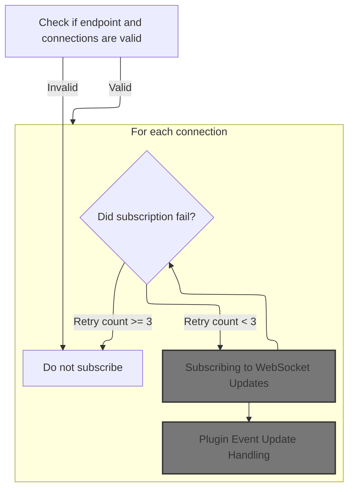
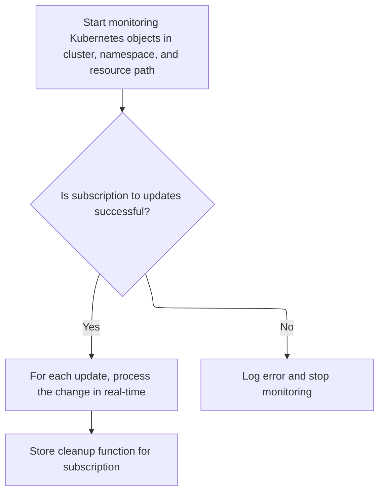
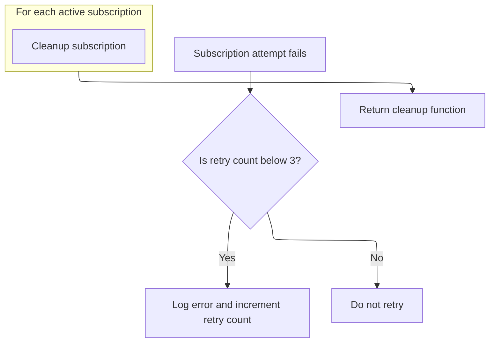
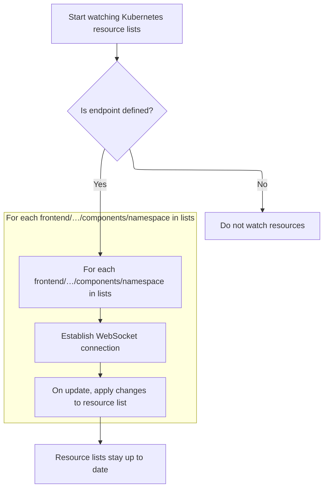
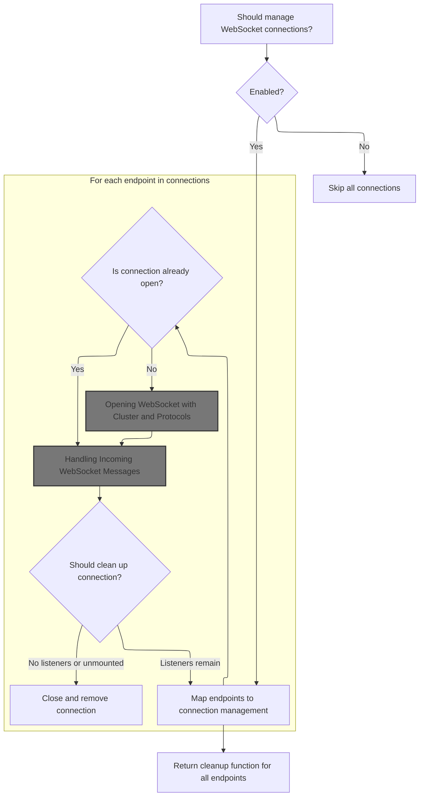
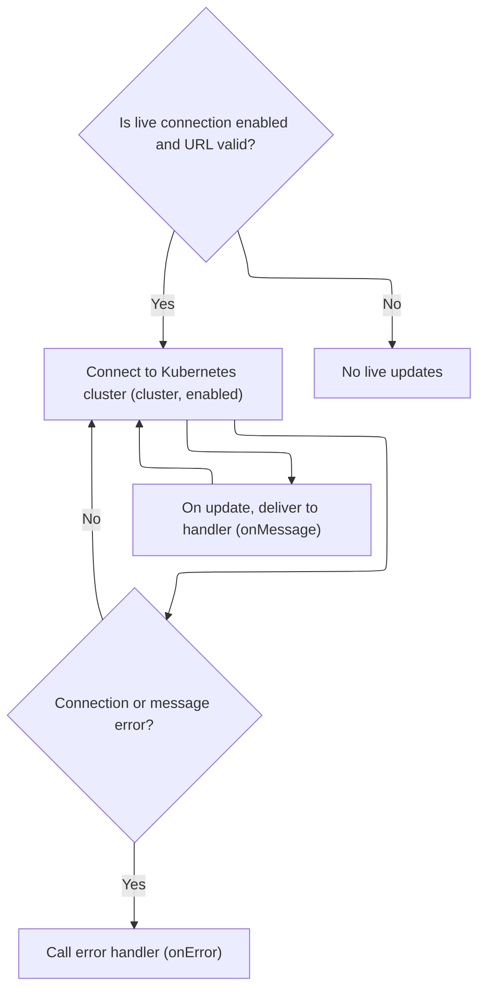
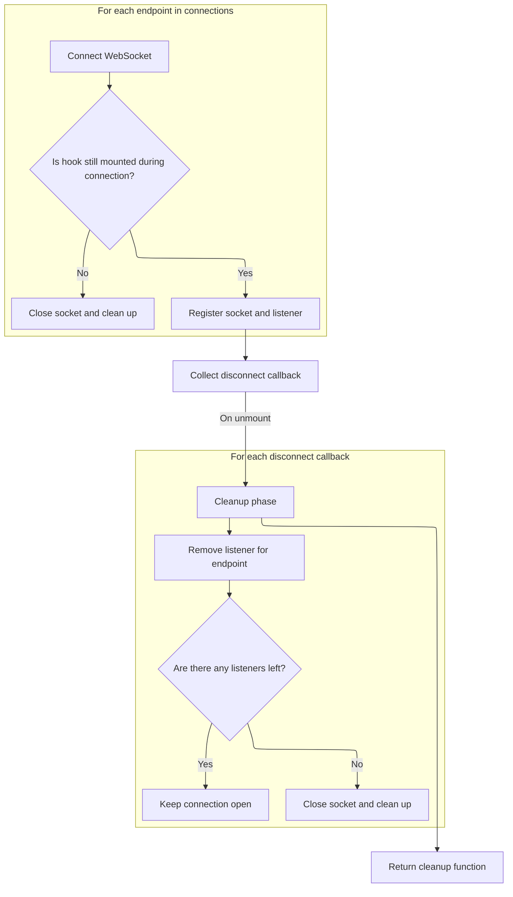
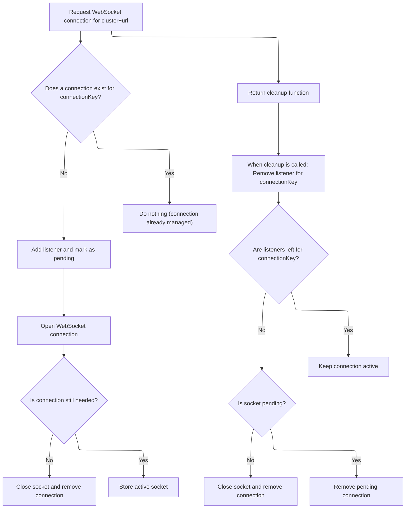

```mermaid
%%{init: {"flowchart": {"defaultRenderer": "elk"}} }%%
flowchart TD
  node1["Prepare WebSocket connection details"]
  click node1 openCode "frontend/src/lib/k8s/api/v2/webSocket.ts:529:531"
  node1 --> node2{"Is a cluster specified?"}
  click node2 openCode "frontend/src/lib/k8s/api/v2/webSocket.ts:532:545"
  node2 -->|"Yes"| node3["Add cluster info to connection path"]
  click node3 openCode "frontend/src/lib/k8s/api/v2/webSocket.ts:533:534"
  node3 --> node4{"Is user authorization available?"}
  click node4 openCode "frontend/src/lib/k8s/api/v2/webSocket.ts:535:541"
  node4 -->|"Yes"| node5["Add user authorization to connection"]
  click node5 openCode "frontend/src/lib/k8s/api/v2/webSocket.ts:539:541"
  node4 -->|"No"| node7["Open WebSocket connection"]
  node5 --> node7["Open WebSocket connection"]
  click node7 openCode "frontend/src/lib/k8s/api/v2/webSocket.ts:547:547"
  node2 -->|"No"| node7
  node7 --> node8{"Message type: JSON or binary?"}
  click node8 openCode "frontend/src/lib/k8s/api/v2/webSocket.ts:550:551"
  node8 -->|"JSON"| node9["Parse incoming messages as JSON and deliver to handler"]
  click node9 openCode "frontend/src/lib/k8s/api/v2/webSocket.ts:550:551"
  node8 -->|"Binary"| node10["Deliver incoming messages as binary to handler"]
  click node10 openCode "frontend/src/lib/k8s/api/v2/webSocket.ts:550:551"
  node9 --> node11["Return WebSocket connection"]
  node10 --> node11
  click node11 openCode "frontend/src/lib/k8s/api/v2/webSocket.ts:557:558"
classDef HeadingStyle fill:#777777,stroke:#333,stroke-width:2px;

%% Swimm:
%% %%{init: {"flowchart": {"defaultRenderer": "elk"}} }%%
%% flowchart TD
%%   node1["Prepare <SwmToken path="frontend/src/lib/k8s/api/v2/useKubeObjectList.ts" pos="135:11:11" line-data="  /** Query parameters for the WebSocket connection URL */">`WebSocket`</SwmToken> connection details"]
%%   click node1 openCode "<SwmPath>[frontend/…/v2/webSocket.ts](frontend/src/lib/k8s/api/v2/webSocket.ts)</SwmPath>:529:531"
%%   node1 --> node2{"Is a cluster specified?"}
%%   click node2 openCode "<SwmPath>[frontend/…/v2/webSocket.ts](frontend/src/lib/k8s/api/v2/webSocket.ts)</SwmPath>:532:545"
%%   node2 -->|"Yes"| node3["Add cluster info to connection path"]
%%   click node3 openCode "<SwmPath>[frontend/…/v2/webSocket.ts](frontend/src/lib/k8s/api/v2/webSocket.ts)</SwmPath>:533:534"
%%   node3 --> node4{"Is user authorization available?"}
%%   click node4 openCode "<SwmPath>[frontend/…/v2/webSocket.ts](frontend/src/lib/k8s/api/v2/webSocket.ts)</SwmPath>:535:541"
%%   node4 -->|"Yes"| node5["Add user authorization to connection"]
%%   click node5 openCode "<SwmPath>[frontend/…/v2/webSocket.ts](frontend/src/lib/k8s/api/v2/webSocket.ts)</SwmPath>:539:541"
%%   node4 -->|"No"| node7["Open <SwmToken path="frontend/src/lib/k8s/api/v2/useKubeObjectList.ts" pos="135:11:11" line-data="  /** Query parameters for the WebSocket connection URL */">`WebSocket`</SwmToken> connection"]
%%   node5 --> node7["Open <SwmToken path="frontend/src/lib/k8s/api/v2/useKubeObjectList.ts" pos="135:11:11" line-data="  /** Query parameters for the WebSocket connection URL */">`WebSocket`</SwmToken> connection"]
%%   click node7 openCode "<SwmPath>[frontend/…/v2/webSocket.ts](frontend/src/lib/k8s/api/v2/webSocket.ts)</SwmPath>:547:547"
%%   node2 -->|"No"| node7
%%   node7 --> node8{"Message type: JSON or binary?"}
%%   click node8 openCode "<SwmPath>[frontend/…/v2/webSocket.ts](frontend/src/lib/k8s/api/v2/webSocket.ts)</SwmPath>:550:551"
%%   node8 -->|"JSON"| node9["Parse incoming messages as JSON and deliver to handler"]
%%   click node9 openCode "<SwmPath>[frontend/…/v2/webSocket.ts](frontend/src/lib/k8s/api/v2/webSocket.ts)</SwmPath>:550:551"
%%   node8 -->|"Binary"| node10["Deliver incoming messages as binary to handler"]
%%   click node10 openCode "<SwmPath>[frontend/…/v2/webSocket.ts](frontend/src/lib/k8s/api/v2/webSocket.ts)</SwmPath>:550:551"
%%   node9 --> node11["Return <SwmToken path="frontend/src/lib/k8s/api/v2/useKubeObjectList.ts" pos="135:11:11" line-data="  /** Query parameters for the WebSocket connection URL */">`WebSocket`</SwmToken> connection"]
%%   node10 --> node11
%%   click node11 openCode "<SwmPath>[frontend/…/v2/webSocket.ts](frontend/src/lib/k8s/api/v2/webSocket.ts)</SwmPath>:557:558"
%% classDef HeadingStyle fill:#777777,stroke:#333,stroke-width:2px;
```

This document describes how resource lists are kept up to date by subscribing to real-time updates from Kubernetes clusters. The flow chooses between an efficient multiplexed strategy or a legacy approach, depending on system support. It receives a set of resource lists (with cluster, namespace, and resource version info) and ensures the UI reflects the latest state by processing updates as they arrive.

# Entry Point: Deciding Watch Strategy

<SwmSnippet path="/frontend/src/lib/k8s/api/v2/useKubeObjectList.ts" line="127">

---

In <SwmToken path="frontend/src/lib/k8s/api/v2/useKubeObjectList.ts" pos="127:4:4" line-data="export function useWatchKubeObjectLists&lt;K extends KubeObject&gt;({">`useWatchKubeObjectLists`</SwmToken>, we check if multiplexing is enabled and, if so, hand off to the multiplexed handler to consolidate resource watching.

```typescript
export function useWatchKubeObjectLists<K extends KubeObject>({
  kubeObjectClass,
  endpoint,
  lists,
  queryParams,
}: {
  /** KubeObject class of the watched resource list */
  kubeObjectClass: (new (...args: any) => K) & typeof KubeObject<any>;
  /** Query parameters for the WebSocket connection URL */
  queryParams?: QueryParameters;
  /** Kube resource API endpoint information */
  endpoint?: KubeObjectEndpoint | null;
  /** Which clusters and namespaces to watch */
  lists: Array<{ cluster: string; namespace?: string; resourceVersion: string }>;
}) {
  if (getWebsocketMultiplexerEnabled()) {
    return useWatchKubeObjectListsMultiplexed({
      kubeObjectClass,
      endpoint,
      lists,
      queryParams,
    });
  } else {
```

---

</SwmSnippet>

## Multiplexed Watch: Preparing Connections and Handlers



<SwmSnippet path="/frontend/src/lib/k8s/api/v2/useKubeObjectList.ts" line="170">

---

In <SwmToken path="frontend/src/lib/k8s/api/v2/useKubeObjectList.ts" pos="170:2:2" line-data="function useWatchKubeObjectListsMultiplexed&lt;K extends KubeObject&gt;({">`useWatchKubeObjectListsMultiplexed`</SwmToken>, we set up tracking for the latest resource versions per <SwmPath>[frontend/…/components/namespace/](frontend/src/components/namespace/)</SwmPath>, memoize query parameters and connection <SwmToken path="frontend/src/lib/k8s/api/v2/useKubeObjectList.ts" pos="190:9:9" line-data="  // Create stable connection URLs for each list">`URLs`</SwmToken> to avoid unnecessary re-subscribes, and define the update handler. We call <SwmToken path="frontend/src/lib/k8s/api/v2/useKubeObjectList.ts" pos="232:7:7" line-data="      const queryKey = kubeObjectListQuery&lt;K&gt;(">`kubeObjectListQuery`</SwmToken> to get the cache key for each resource list, which is needed to update the React Query cache when a <SwmToken path="frontend/src/lib/k8s/api/v2/useKubeObjectList.ts" pos="203:5:5" line-data="      // Construct WebSocket URL with current parameters">`WebSocket`</SwmToken> message comes in.

```typescript
function useWatchKubeObjectListsMultiplexed<K extends KubeObject>({
  kubeObjectClass,
  endpoint,
  lists,
  queryParams,
}: {
  kubeObjectClass: (new (...args: any) => K) & typeof KubeObject<any>;
  endpoint?: KubeObjectEndpoint | null;
  lists: Array<{ cluster: string; namespace?: string; resourceVersion: string }>;
  queryParams?: QueryParameters;
}): void {
  const client = useQueryClient();

  // Track the latest resource versions to prevent duplicate updates
  const latestResourceVersions = useRef<Record<string, string>>({});

  // Stabilize queryParams to prevent unnecessary effect triggers
  // Only update when the stringified params change
  const stableQueryParams = useMemo(() => queryParams, [JSON.stringify(queryParams)]);

  // Create stable connection URLs for each list
  // Updates only when endpoint, lists, or stableQueryParams change
  const connections = useMemo(() => {
    if (!endpoint) {
      return [];
    }

    return lists.map(list => {
      const key = `${list.cluster}:${list.namespace || ''}`;

      // Always use the latest resource version from the server
      latestResourceVersions.current[key] = list.resourceVersion;

      // Construct WebSocket URL with current parameters
      return {
        url: makeUrl([KubeObjectEndpoint.toUrl(endpoint, list.namespace)], {
          ...stableQueryParams,
          watch: 1,
          resourceVersion: latestResourceVersions.current[key],
        }),
        cluster: list.cluster,
        namespace: list.namespace,
      };
    });
  }, [endpoint, lists, stableQueryParams]);

  // Create stable update handler to process WebSocket messages
  // Re-create only when dependencies change
  const handleUpdate = useCallback(
    (update: any, cluster: string, namespace: string | undefined) => {
      if (!update || typeof update !== 'object' || !endpoint) {
        return;
      }

      const key = `${cluster}:${namespace || ''}`;

      // Update resource version from incoming message
      if (update.object?.metadata?.resourceVersion) {
        latestResourceVersions.current[key] = update.object.metadata.resourceVersion;
      }

      // Create query key for React Query cache
      const queryKey = kubeObjectListQuery<K>(
        kubeObjectClass,
        endpoint,
        namespace,
        cluster,
        stableQueryParams ?? {}
      ).queryKey;

```

---

</SwmSnippet>

<SwmSnippet path="/frontend/src/lib/k8s/api/v2/useKubeObjectList.ts" line="240">

---

Back in <SwmToken path="frontend/src/lib/k8s/api/v2/useKubeObjectList.ts" pos="143:3:3" line-data="    return useWatchKubeObjectListsMultiplexed({">`useWatchKubeObjectListsMultiplexed`</SwmToken>, after getting the cache key from <SwmToken path="frontend/src/lib/k8s/api/v2/useKubeObjectList.ts" pos="232:7:7" line-data="      const queryKey = kubeObjectListQuery&lt;K&gt;(">`kubeObjectListQuery`</SwmToken>, we update the React Query cache with new data from <SwmToken path="frontend/src/lib/k8s/api/v2/useKubeObjectList.ts" pos="259:7:7" line-data="  // Set up WebSocket subscriptions">`WebSocket`</SwmToken> updates. Then, we set up <SwmToken path="frontend/src/lib/k8s/api/v2/useKubeObjectList.ts" pos="259:7:7" line-data="  // Set up WebSocket subscriptions">`WebSocket`</SwmToken> subscriptions for each connection, using retry logic to handle failures. If a subscription fails, it retries up to 3 times by bumping a counter in the URL.

```typescript
      // Update React Query cache with new data
      client.setQueryData(queryKey, (oldResponse: ListResponse<any> | undefined | null) => {
        if (!oldResponse) {
          return oldResponse;
        }

        const newList = KubeList.applyUpdate(oldResponse.list, update, kubeObjectClass, cluster);

        // Only update if the list actually changed
        if (newList === oldResponse.list) {
          return oldResponse;
        }

        return { ...oldResponse, list: newList };
      });
    },
    [client, kubeObjectClass, endpoint, stableQueryParams]
  );

  // Set up WebSocket subscriptions
  useEffect(() => {
    if (!endpoint || connections.length === 0) {
      return;
    }

    const cleanups: (() => void)[] = [];

    // Create subscriptions for each connection
    connections.forEach(({ url, cluster, namespace }) => {
      const parsedUrl = new URL(url, BASE_WS_URL);

      // Subscribe to WebSocket updates
      WebSocketManager.subscribe(cluster, parsedUrl.pathname, parsedUrl.search.slice(1), update =>
        handleUpdate(update, cluster, namespace)
```

---

</SwmSnippet>

### Plugin Event Update Handling

See <SwmLink doc-title="Updating a plugin flow">[Updating a plugin flow](/.swm/updating-a-plugin-flow.z4bjoc8l.sw.md)</SwmLink>

### Subscribing to WebSockets and Handling Failures



<SwmSnippet path="/frontend/src/lib/k8s/api/v2/useKubeObjectList.ts" line="272">

---

After handling updates, <SwmToken path="frontend/src/lib/k8s/api/v2/useKubeObjectList.ts" pos="143:3:3" line-data="    return useWatchKubeObjectListsMultiplexed({">`useWatchKubeObjectListsMultiplexed`</SwmToken> stores the cleanup function for each <SwmToken path="frontend/src/lib/k8s/api/v2/useKubeObjectList.ts" pos="135:11:11" line-data="  /** Query parameters for the WebSocket connection URL */">`WebSocket`</SwmToken> subscription. This lets us clean up all connections later. Next, we call into the <SwmToken path="frontend/src/lib/k8s/api/v2/useKubeObjectList.ts" pos="135:11:11" line-data="  /** Query parameters for the WebSocket connection URL */">`WebSocket`</SwmToken> manager to actually handle the connection logic.

```typescript
      WebSocketManager.subscribe(cluster, parsedUrl.pathname, parsedUrl.search.slice(1), update =>
        handleUpdate(update, cluster, namespace)
      ).then(
        cleanup => cleanups.push(cleanup),
        error => {
```

---

</SwmSnippet>

### Subscribing to <SwmToken path="frontend/src/lib/k8s/api/v2/useKubeObjectList.ts" pos="135:11:11" line-data="  /** Query parameters for the WebSocket connection URL */">`WebSocket`</SwmToken> Updates

See <SwmLink doc-title="Subscribing to resource updates">[Subscribing to resource updates](/.swm/subscribing-to-resource-updates.6e5sygmi.sw.md)</SwmLink>

### Cleanup and Retry for <SwmToken path="frontend/src/lib/k8s/api/v2/useKubeObjectList.ts" pos="135:11:11" line-data="  /** Query parameters for the WebSocket connection URL */">`WebSocket`</SwmToken> Subscriptions



<SwmSnippet path="/frontend/src/lib/k8s/api/v2/useKubeObjectList.ts" line="277">

---

After the <SwmToken path="frontend/src/lib/k8s/api/v2/useKubeObjectList.ts" pos="281:6:6" line-data="            console.error(&#39;WebSocket subscription failed:&#39;, error);">`WebSocket`</SwmToken> manager, <SwmToken path="frontend/src/lib/k8s/api/v2/useKubeObjectList.ts" pos="143:3:3" line-data="    return useWatchKubeObjectListsMultiplexed({">`useWatchKubeObjectListsMultiplexed`</SwmToken> wraps up by returning a cleanup function to close all subscriptions and handle retries.

```typescript
          // Track retry count in the URL's searchParams
          const retryCount = parseInt(parsedUrl.searchParams.get('retryCount') || '0');
          if (retryCount < 3) {
            // Only log and allow retry if under threshold
            console.error('WebSocket subscription failed:', error);
            parsedUrl.searchParams.set('retryCount', (retryCount + 1).toString());
          }
        }
      );
    });

    // Cleanup subscriptions when effect re-runs or unmounts
    return () => {
      cleanups.forEach(cleanup => cleanup());
    };
  }, [connections, endpoint, handleUpdate]);
}
```

---

</SwmSnippet>

## Fallback to Legacy Watch Implementation

<SwmSnippet path="/frontend/src/lib/k8s/api/v2/useKubeObjectList.ts" line="150">

---

After returning from <SwmToken path="frontend/src/lib/k8s/api/v2/useKubeObjectList.ts" pos="143:3:3" line-data="    return useWatchKubeObjectListsMultiplexed({">`useWatchKubeObjectListsMultiplexed`</SwmToken>, if the multiplexer isn't enabled, <SwmToken path="frontend/src/lib/k8s/api/v2/useKubeObjectList.ts" pos="127:4:4" line-data="export function useWatchKubeObjectLists&lt;K extends KubeObject&gt;({">`useWatchKubeObjectLists`</SwmToken> calls <SwmToken path="frontend/src/lib/k8s/api/v2/useKubeObjectList.ts" pos="150:3:3" line-data="    return useWatchKubeObjectListsLegacy({">`useWatchKubeObjectListsLegacy`</SwmToken> to handle resource watching the old way. This keeps things working for setups that don't support multiplexing.

```typescript
    return useWatchKubeObjectListsLegacy({
      kubeObjectClass,
      endpoint,
      lists,
      queryParams,
    });
  }
}
```

---

</SwmSnippet>

# Legacy Watch: Setting Up Individual Connections



<SwmSnippet path="/frontend/src/lib/k8s/api/v2/useKubeObjectList.ts" line="303">

---

In <SwmToken path="frontend/src/lib/k8s/api/v2/useKubeObjectList.ts" pos="303:2:2" line-data="function useWatchKubeObjectListsLegacy&lt;K extends KubeObject&gt;({">`useWatchKubeObjectListsLegacy`</SwmToken>, we map over the lists to set up connection info for each cluster/namespace/resourceVersion combo. We call <SwmToken path="frontend/src/lib/k8s/api/v2/useKubeObjectList.ts" pos="334:7:7" line-data="          const key = kubeObjectListQuery&lt;K&gt;(">`kubeObjectListQuery`</SwmToken> for each to get the cache key, which is needed for updating the React Query cache when updates come in.

```typescript
function useWatchKubeObjectListsLegacy<K extends KubeObject>({
  kubeObjectClass,
  endpoint,
  lists,
  queryParams,
}: {
  /** KubeObject class of the watched resource list */
  kubeObjectClass: (new (...args: any) => K) & typeof KubeObject<any>;
  /** Query parameters for the WebSocket connection URL */
  queryParams?: QueryParameters;
  /** Kube resource API endpoint information */
  endpoint?: KubeObjectEndpoint | null;
  /** Which clusters and namespaces to watch */
  lists: Array<{ cluster: string; namespace?: string; resourceVersion: string }>;
}) {
  const client = useQueryClient();

  const connections = useMemo(() => {
    if (!endpoint) return [];

    return lists.map(({ cluster, namespace, resourceVersion }) => {
      const url = makeUrl([KubeObjectEndpoint.toUrl(endpoint!, namespace)], {
        ...queryParams,
        watch: 1,
        resourceVersion,
      });

      return {
        cluster,
        url,
        onMessage(update: KubeListUpdateEvent<K>) {
          const key = kubeObjectListQuery<K>(
            kubeObjectClass,
            endpoint,
            namespace,
            cluster,
            queryParams ?? {}
          ).queryKey;
```

---

</SwmSnippet>

<SwmSnippet path="/frontend/src/lib/k8s/api/v2/useKubeObjectList.ts" line="341">

---

After getting the cache keys, <SwmToken path="frontend/src/lib/k8s/api/v2/useKubeObjectList.ts" pos="150:3:3" line-data="    return useWatchKubeObjectListsLegacy({">`useWatchKubeObjectListsLegacy`</SwmToken> calls <SwmToken path="frontend/src/lib/k8s/api/v2/useKubeObjectList.ts" pos="357:1:1" line-data="  useWebSockets&lt;KubeListUpdateEvent&lt;K&gt;&gt;({">`useWebSockets`</SwmToken> with the connection info. This is where the actual <SwmToken path="frontend/src/lib/k8s/api/v2/useKubeObjectList.ts" pos="135:11:11" line-data="  /** Query parameters for the WebSocket connection URL */">`WebSocket`</SwmToken> connections are opened and updates are handled.

```typescript
          client.setQueryData(key, (oldResponse: ListResponse<any> | undefined | null) => {
            if (!oldResponse) return oldResponse;

            const newList = KubeList.applyUpdate(
              oldResponse.list,
              update,
              kubeObjectClass,
              cluster
            );
            return { ...oldResponse, list: newList };
          });
        },
      };
    });
  }, [lists, kubeObjectClass, endpoint]);

  useWebSockets<KubeListUpdateEvent<K>>({
    enabled: !!endpoint,
    connections,
  });
}
```

---

</SwmSnippet>

# Managing <SwmToken path="frontend/src/lib/k8s/api/v2/useKubeObjectList.ts" pos="135:11:11" line-data="  /** Query parameters for the WebSocket connection URL */">`WebSocket`</SwmToken> Connections and Listeners



<SwmSnippet path="/frontend/src/lib/k8s/api/v2/webSocket.ts" line="566">

---

In <SwmToken path="frontend/src/lib/k8s/api/v2/webSocket.ts" pos="566:4:4" line-data="export function useWebSockets&lt;T&gt;({">`useWebSockets`</SwmToken>, we use global maps to track sockets and listeners, making sure only one <SwmToken path="frontend/src/lib/k8s/api/v2/webSocket.ts" pos="576:15:15" line-data="   * Any additional protocols to include in WebSocket connection">`WebSocket`</SwmToken> connection per cluster+url is opened. We use React's <SwmToken path="frontend/src/lib/k8s/api/v2/webSocket.ts" pos="585:1:1" line-data="  useEffect(() =&gt; {">`useEffect`</SwmToken> to manage connection lifecycles and cleanup when components unmount or dependencies change. Next, we call <SwmToken path="frontend/src/lib/k8s/api/v2/webSocket.ts" pos="602:1:1" line-data="        openWebSocket(url, { protocols, type, cluster, onMessage })">`openWebSocket`</SwmToken> to actually open the connection if needed.

```typescript
export function useWebSockets<T>({
  connections,
  enabled = true,
  protocols,
  type = 'json',
}: {
  enabled?: boolean;
  /** Make sure that connections value is stable between renders */
  connections: Array<WebSocketConnectionRequest<T>>;
  /**
   * Any additional protocols to include in WebSocket connection
   * make sure that the value is stable between renders
   */
  protocols?: string | string[];
  /**
   * Type of websocket data
   */
  type?: 'json' | 'binary';
}) {
  useEffect(() => {
    if (!enabled) return;

    let isCurrent = true;

    /** Open a connection to websocket */
    function connect({ cluster, url, onMessage }: WebSocketConnectionRequest<T>) {
      const connectionKey = cluster + url;

      if (!sockets.has(connectionKey)) {
        // Add new listener for this URL
        listeners.set(connectionKey, [...(listeners.get(connectionKey) ?? []), onMessage]);

        // Mark socket as pending, so we don't open more than one
        sockets.set(connectionKey, 'pending');

        let ws: WebSocket | undefined;
        openWebSocket(url, { protocols, type, cluster, onMessage })
          .then(socket => {
```

---

</SwmSnippet>

## Opening <SwmToken path="frontend/src/lib/k8s/api/v2/useKubeObjectList.ts" pos="135:11:11" line-data="  /** Query parameters for the WebSocket connection URL */">`WebSocket`</SwmToken> with Cluster and Protocols



<SwmSnippet path="/frontend/src/lib/k8s/api/v2/webSocket.ts" line="503">

---

In <SwmToken path="frontend/src/lib/k8s/api/v2/webSocket.ts" pos="503:6:6" line-data="export async function openWebSocket&lt;T&gt;(">`openWebSocket`</SwmToken>, we build the <SwmToken path="frontend/src/lib/k8s/api/v2/useKubeObjectList.ts" pos="135:11:11" line-data="  /** Query parameters for the WebSocket connection URL */">`WebSocket`</SwmToken> URL and protocols array, including custom protocols for binary data and user authorization. We call into cluster logic next to check if we need to add cluster-specific info or authorization.

```typescript
export async function openWebSocket<T>(
  url: string,
  {
    protocols: moreProtocols = [],
    type = 'binary',
    cluster = getCluster() ?? '',
    onMessage,
  }: {
```

---

</SwmSnippet>

<SwmSnippet path="/frontend/src/lib/k8s/api/v2/webSocket.ts" line="511">

---

After checking the cluster, <SwmToken path="frontend/src/lib/k8s/api/v2/webSocket.ts" pos="503:6:6" line-data="export async function openWebSocket&lt;T&gt;(">`openWebSocket`</SwmToken> tries to find a kubeconfig for the cluster. If it finds one, it adds an authorization protocol with the user ID. This is how we handle cluster-specific auth for the <SwmToken path="frontend/src/lib/k8s/api/v2/webSocket.ts" pos="512:15:15" line-data="     * Any additional protocols to include in WebSocket connection">`WebSocket`</SwmToken> connection.

```typescript
    /**
     * Any additional protocols to include in WebSocket connection
     */
    protocols?: string | string[];
    /**
     *
     */
    type: 'json' | 'binary';
    /**
     * Cluster name
     */
    cluster?: string;
    /**
     * Message callback
     */
    onMessage: (data: T) => void;
  }
) {
  const path = [url];
  const protocols = ['base64.binary.k8s.io', ...(moreProtocols ?? [])];

  if (cluster) {
    path.unshift('clusters', cluster);

    try {
      const kubeconfig = await findKubeconfigByClusterName(cluster);

      if (kubeconfig !== null) {
        const userID = getUserIdFromLocalStorage();
        protocols.push(`base64url.headlamp.authorization.k8s.io.${userID}`);
      }
    } catch (error) {
      console.error('Error while finding kubeconfig:', error);
    }
  }

```

---

</SwmSnippet>

<SwmSnippet path="/frontend/src/lib/k8s/api/v2/webSocket.ts" line="547">

---

After setting up the protocols and path, <SwmToken path="frontend/src/lib/k8s/api/v2/webSocket.ts" pos="503:6:6" line-data="export async function openWebSocket&lt;T&gt;(">`openWebSocket`</SwmToken> creates the <SwmToken path="frontend/src/lib/k8s/api/v2/webSocket.ts" pos="547:9:9" line-data="  const socket = new WebSocket(makeUrl([getBaseWsUrl(), ...path], {}), protocols);">`WebSocket`</SwmToken> instance with the constructed URL and protocols. This is where the actual connection is made.

```typescript
  const socket = new WebSocket(makeUrl([getBaseWsUrl(), ...path], {}), protocols);
```

---

</SwmSnippet>

<SwmSnippet path="/frontend/src/lib/k8s/api/v2/webSocket.ts" line="548">

---

After opening the <SwmToken path="frontend/src/lib/k8s/api/v2/webSocket.ts" pos="554:6:6" line-data="    console.error(&#39;WebSocket error:&#39;, error);">`WebSocket`</SwmToken>, the function listens for messages and parses them as JSON or binary depending on the type. It then calls the <SwmToken path="frontend/src/lib/k8s/api/v2/webSocket.ts" pos="551:1:1" line-data="    onMessage(data);">`onMessage`</SwmToken> handler with the parsed data, handing off to the next part of the flow.

```typescript
  socket.binaryType = 'arraybuffer';
  socket.addEventListener('message', (body: MessageEvent) => {
    const data = type === 'json' ? JSON.parse(body.data) : body.data;
    onMessage(data);
  });
  socket.addEventListener('error', error => {
    console.error('WebSocket error:', error);
  });

  return socket;
}
```

---

</SwmSnippet>

## Handling Incoming <SwmToken path="frontend/src/lib/k8s/api/v2/useKubeObjectList.ts" pos="135:11:11" line-data="  /** Query parameters for the WebSocket connection URL */">`WebSocket`</SwmToken> Messages

<SwmSnippet path="/frontend/src/lib/k8s/api/v2/hooks.ts" line="152">

---

<SwmToken path="frontend/src/lib/k8s/api/v2/useKubeObjectList.ts" pos="333:1:1" line-data="        onMessage(update: KubeListUpdateEvent&lt;K&gt;) {">`onMessage`</SwmToken> updates the cache for non-ADDED events, then hands off to the <SwmToken path="frontend/src/lib/k8s/api/v2/useKubeObjectList.ts" pos="135:11:11" line-data="  /** Query parameters for the WebSocket connection URL */">`WebSocket`</SwmToken> logic.

```typescript
    onMessage(update: KubeListUpdateEvent<K>) {
      if (update.type !== 'ADDED' && update.object) {
        client.setQueryData(queryKey, new kubeObjectClass(update.object));
      }
    },
```

---

</SwmSnippet>

## Single <SwmToken path="frontend/src/lib/k8s/api/v2/useKubeObjectList.ts" pos="135:11:11" line-data="  /** Query parameters for the WebSocket connection URL */">`WebSocket`</SwmToken> Connection Lifecycle



<SwmSnippet path="/frontend/src/lib/k8s/api/v2/webSocket.ts" line="416">

---

In <SwmToken path="frontend/src/lib/k8s/api/v2/webSocket.ts" pos="416:4:4" line-data="export function useWebSocket&lt;T&gt;({">`useWebSocket`</SwmToken>, we memoize the URL and set up a stable <SwmToken path="frontend/src/lib/k8s/api/v2/webSocket.ts" pos="420:1:1" line-data="  onMessage,">`onMessage`</SwmToken> callback to handle incoming messages. This callback parses the data and passes it to the provided handler, which is defined in the hooks file.

```typescript
export function useWebSocket<T>({
  url: createUrl,
  enabled = true,
  cluster = '',
  onMessage,
  onError,
}: {
  /** Function that returns the WebSocket URL to connect to */
  url: () => string;
  /** Whether the WebSocket connection should be active */
  enabled?: boolean;
  /** The Kubernetes cluster ID to watch */
  cluster?: string;
  /** Callback function to handle incoming messages */
  onMessage: (data: T) => void;
  /** Callback function to handle connection errors */
  onError?: (error: Error) => void;
}) {
  const url = useMemo(() => (enabled ? createUrl() : ''), [enabled, createUrl]);

  const stableOnMessage = useCallback(
    (rawData: any) => {
      try {
        let parsedData: T;
        try {
          parsedData = typeof rawData === 'string' ? JSON.parse(rawData) : rawData;
        } catch (parseError) {
          console.error('Failed to parse WebSocket message:', parseError);
          onError?.(parseError as Error);
          return;
        }

        onMessage(parsedData);
      } catch (err) {
        console.error('Failed to process WebSocket message:', err);
        onError?.(err as Error);
      }
    },
    [onMessage, onError]
  );

```

---

</SwmSnippet>

<SwmSnippet path="/frontend/src/lib/k8s/api/v2/webSocket.ts" line="457">

---

After setting up the message handler, <SwmToken path="frontend/src/lib/k8s/api/v2/webSocket.ts" pos="416:4:4" line-data="export function useWebSocket&lt;T&gt;({">`useWebSocket`</SwmToken> uses <SwmToken path="frontend/src/lib/k8s/api/v2/webSocket.ts" pos="457:1:1" line-data="  useEffect(() =&gt; {">`useEffect`</SwmToken> to trigger the actual <SwmToken path="frontend/src/lib/k8s/api/v2/useKubeObjectList.ts" pos="135:11:11" line-data="  /** Query parameters for the WebSocket connection URL */">`WebSocket`</SwmToken> connection when enabled. It also sets up cleanup logic for when the component unmounts or dependencies change.

```typescript
  useEffect(() => {
    if (!enabled || !url) {
      return;
    }

    let cleanup: (() => void) | undefined;

    const connectWebSocket = async () => {
      try {
        const parsedUrl = new URL(url, getBaseWsUrl());
```

---

</SwmSnippet>

<SwmSnippet path="/frontend/src/lib/k8s/api/v2/webSocket.ts" line="467">

---

After triggering the connection, <SwmToken path="frontend/src/lib/k8s/api/v2/webSocket.ts" pos="416:4:4" line-data="export function useWebSocket&lt;T&gt;({">`useWebSocket`</SwmToken> calls <SwmToken path="frontend/src/lib/k8s/api/v2/webSocket.ts" pos="467:7:9" line-data="        cleanup = await WebSocketManager.subscribe(">`WebSocketManager.subscribe`</SwmToken> with all the connection details and the stable message handler. This sets up the subscription and gives us a cleanup function for later.

```typescript
        cleanup = await WebSocketManager.subscribe(
          cluster,
          parsedUrl.pathname,
          parsedUrl.search.slice(1),
          stableOnMessage
        );
      } catch (err) {
        console.error('WebSocket connection failed:', err);
        onError?.(err as Error);
      }
    };

```

---

</SwmSnippet>

<SwmSnippet path="/frontend/src/lib/k8s/api/v2/webSocket.ts" line="479">

---

After subscribing, <SwmToken path="frontend/src/lib/k8s/api/v2/webSocket.ts" pos="416:4:4" line-data="export function useWebSocket&lt;T&gt;({">`useWebSocket`</SwmToken> returns a cleanup function from <SwmToken path="frontend/src/lib/k8s/api/v2/useKubeObjectList.ts" pos="260:1:1" line-data="  useEffect(() =&gt; {">`useEffect`</SwmToken> that closes the connection and cleans up listeners when needed.

```typescript
    connectWebSocket();

    return () => {
      if (cleanup) {
        cleanup();
      }
    };
  }, [url, enabled, cluster, stableOnMessage, onError]);
}
```

---

</SwmSnippet>

## Connecting and Handling <SwmToken path="frontend/src/lib/k8s/api/v2/useKubeObjectList.ts" pos="135:11:11" line-data="  /** Query parameters for the WebSocket connection URL */">`WebSocket`</SwmToken> Errors

<SwmSnippet path="/frontend/src/lib/k8s/api/v2/webSocket.ts" line="464">

---

In <SwmToken path="frontend/src/lib/k8s/api/v2/webSocket.ts" pos="464:3:3" line-data="    const connectWebSocket = async () =&gt; {">`connectWebSocket`</SwmToken>, we parse the URL and try to subscribe to the <SwmToken path="frontend/src/lib/k8s/api/v2/useKubeObjectList.ts" pos="135:11:11" line-data="  /** Query parameters for the WebSocket connection URL */">`WebSocket`</SwmToken>. If anything fails, we catch the error and call the <SwmToken path="frontend/src/lib/k8s/api/v2/webSocket.ts" pos="421:1:1" line-data="  onError,">`onError`</SwmToken> handler.

```typescript
    const connectWebSocket = async () => {
      try {
        const parsedUrl = new URL(url, getBaseWsUrl());
```

---

</SwmSnippet>

<SwmSnippet path="/frontend/src/lib/k8s/api/v2/webSocket.ts" line="467">

---

After subscribing, <SwmToken path="frontend/src/lib/k8s/api/v2/webSocket.ts" pos="464:3:3" line-data="    const connectWebSocket = async () =&gt; {">`connectWebSocket`</SwmToken> stores the cleanup function so it can be called later to close the connection and clean up listeners.

```typescript
        cleanup = await WebSocketManager.subscribe(
          cluster,
          parsedUrl.pathname,
          parsedUrl.search.slice(1),
          stableOnMessage
        );
```

---

</SwmSnippet>

<SwmSnippet path="/frontend/src/lib/k8s/api/v2/webSocket.ts" line="473">

---

After catching errors, the function calls <SwmToken path="frontend/src/lib/k8s/api/v2/webSocket.ts" pos="475:1:1" line-data="        onError?.(err as Error);">`onError`</SwmToken>, which logs the error along with the path. This helps with debugging which connection had issues, but relies on 'path' being available in the outer scope.

```typescript
      } catch (err) {
        console.error('WebSocket connection failed:', err);
        onError?.(err as Error);
      }
    };
```

---

</SwmSnippet>

<SwmSnippet path="/frontend/src/lib/k8s/api/v1/streamingApi.ts" line="495">

---

<SwmToken path="frontend/src/lib/k8s/api/v1/streamingApi.ts" pos="495:3:3" line-data="  function onError(err: any) {">`onError`</SwmToken> in streamingApi logs errors with a 'path' variable that's not passed in—it's assumed to exist in the outer scope. This is a hidden dependency and could break if 'path' isn't set.

```typescript
  function onError(err: any) {
    console.error('Error in api stream', { err, path });
  }
```

---

</SwmSnippet>

## <SwmToken path="frontend/src/lib/k8s/api/v2/useKubeObjectList.ts" pos="135:11:11" line-data="  /** Query parameters for the WebSocket connection URL */">`WebSocket`</SwmToken> Connection State and Cleanup



<SwmSnippet path="/frontend/src/lib/k8s/api/v2/webSocket.ts" line="604">

---

After managing sockets/listeners, it returns a cleanup function to clean up everything on unmount.

```typescript
            ws = socket;

            // Hook was unmounted while it was connecting to WebSocket
            // so we close the socket and clean up
            if (!isCurrent) {
              ws.close();
              sockets.delete(connectionKey);
              return;
            }

            sockets.set(connectionKey, ws);
          })
          .catch(err => {
            console.error(err);
          });
      }

      return () => {
        const connectionKey = cluster + url;

        // Clean up the listener
        const newListeners = listeners.get(connectionKey)?.filter(it => it !== onMessage) ?? [];
        listeners.set(connectionKey, newListeners);

        // No one is listening to the connection
        // so we can close it
        if (newListeners.length === 0) {
          const maybeExisting = sockets.get(connectionKey);
          if (maybeExisting) {
            if (maybeExisting !== 'pending') {
              maybeExisting.close();
            }
            sockets.delete(connectionKey);
          }
        }
      };
    }

```

---

</SwmSnippet>

<SwmSnippet path="/frontend/src/lib/k8s/api/v2/webSocket.ts" line="642">

---

After managing sockets/listeners, it returns a cleanup function to clean up everything on unmount.

```typescript
    const disconnectCallbacks = connections.map(endpoint => connect(endpoint));

    return () => {
      isCurrent = false;
      disconnectCallbacks.forEach(fn => fn());
    };
  }, [enabled, type, connections, protocols]);
}
```

---

</SwmSnippet>

# Establishing and Cleaning Up Individual Connections



<SwmSnippet path="/frontend/src/lib/k8s/api/v2/webSocket.ts" line="591">

---

In <SwmToken path="frontend/src/lib/k8s/api/v2/webSocket.ts" pos="591:3:3" line-data="    function connect({ cluster, url, onMessage }: WebSocketConnectionRequest&lt;T&gt;) {">`connect`</SwmToken>, we use cluster+url as a unique key to track each <SwmToken path="frontend/src/lib/k8s/api/v2/webSocket.ts" pos="601:6:6" line-data="        let ws: WebSocket | undefined;">`WebSocket`</SwmToken> connection. We mark sockets as 'pending' while connecting, add listeners, and open the socket. The cleanup function removes listeners and closes the socket if no one is listening anymore.

```typescript
    function connect({ cluster, url, onMessage }: WebSocketConnectionRequest<T>) {
      const connectionKey = cluster + url;

      if (!sockets.has(connectionKey)) {
        // Add new listener for this URL
        listeners.set(connectionKey, [...(listeners.get(connectionKey) ?? []), onMessage]);

        // Mark socket as pending, so we don't open more than one
        sockets.set(connectionKey, 'pending');

        let ws: WebSocket | undefined;
        openWebSocket(url, { protocols, type, cluster, onMessage })
          .then(socket => {
```

---

</SwmSnippet>

<SwmSnippet path="/frontend/src/lib/k8s/api/v2/webSocket.ts" line="604">

---

After managing the <SwmToken path="frontend/src/lib/k8s/api/v2/webSocket.ts" pos="606:19:19" line-data="            // Hook was unmounted while it was connecting to WebSocket">`WebSocket`</SwmToken> connection and listeners in <SwmPath>[frontend/…/v2/webSocket.ts](frontend/src/lib/k8s/api/v2/webSocket.ts)</SwmPath>, we move to <SwmPath>[frontend/…/k8s/KubeObject.ts](frontend/src/lib/k8s/KubeObject.ts)</SwmPath> to actually handle and update the resource data received from the socket. This is what keeps the UI in sync with the cluster.

```typescript
            ws = socket;

            // Hook was unmounted while it was connecting to WebSocket
            // so we close the socket and clean up
            if (!isCurrent) {
              ws.close();
              sockets.delete(connectionKey);
              return;
            }

            sockets.set(connectionKey, ws);
          })
          .catch(err => {
            console.error(err);
          });
      }

      return () => {
        const connectionKey = cluster + url;

        // Clean up the listener
        const newListeners = listeners.get(connectionKey)?.filter(it => it !== onMessage) ?? [];
        listeners.set(connectionKey, newListeners);

        // No one is listening to the connection
        // so we can close it
        if (newListeners.length === 0) {
          const maybeExisting = sockets.get(connectionKey);
          if (maybeExisting) {
            if (maybeExisting !== 'pending') {
              maybeExisting.close();
            }
            sockets.delete(connectionKey);
          }
        }
      };
    }
```

---

</SwmSnippet>

&nbsp;

*This is an auto-generated document by Swimm 🌊 and has not yet been verified by a human*

<SwmMeta version="3.0.0" repo-id="Z2l0aHViJTNBJTNBdHlwZXNjcmlwdC1oZWFkbGFtcCUzQSUzQXJpY2FyZG9sb3Blemc=" repo-name="typescript-headlamp"><sup>Powered by [Swimm](https://app.swimm.io/)</sup></SwmMeta>
