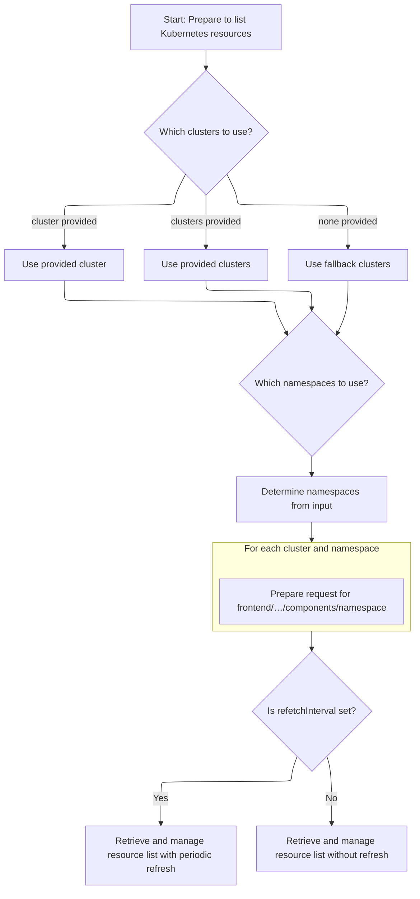
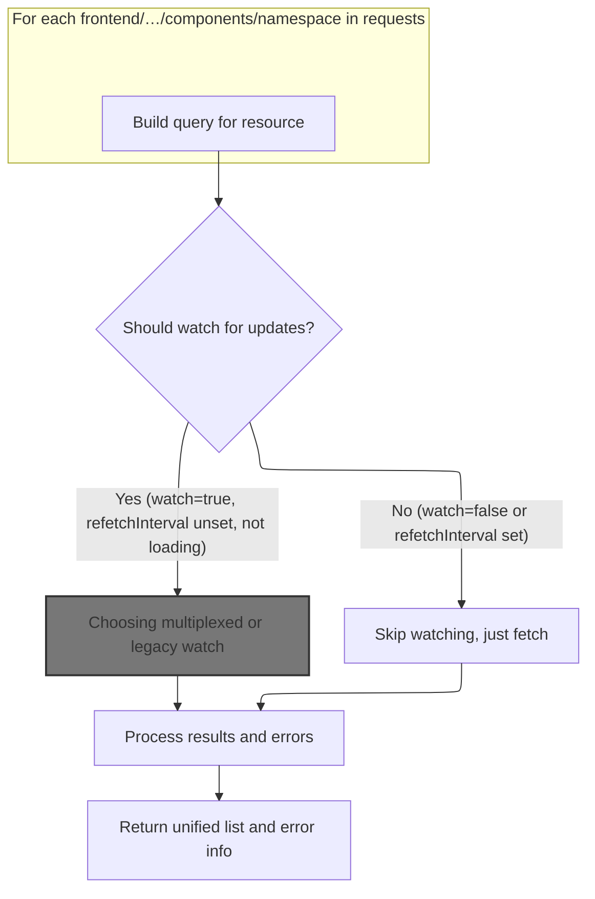
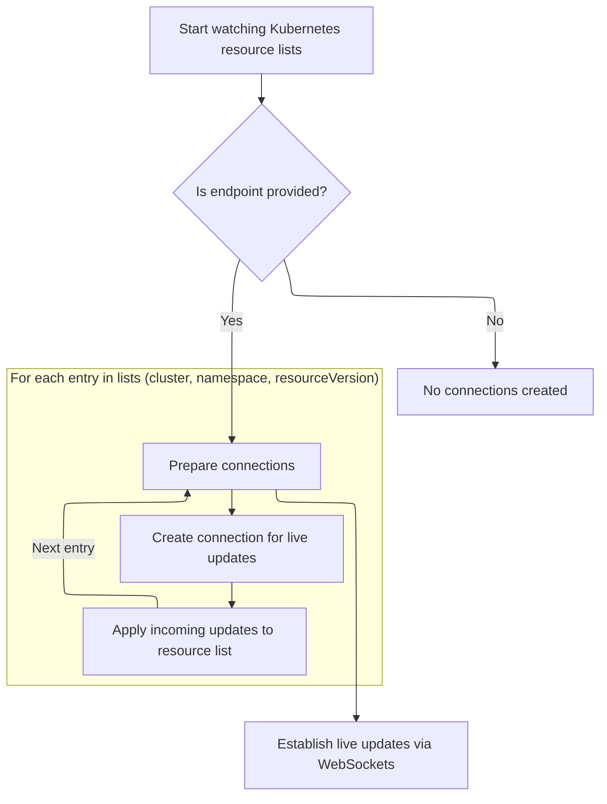
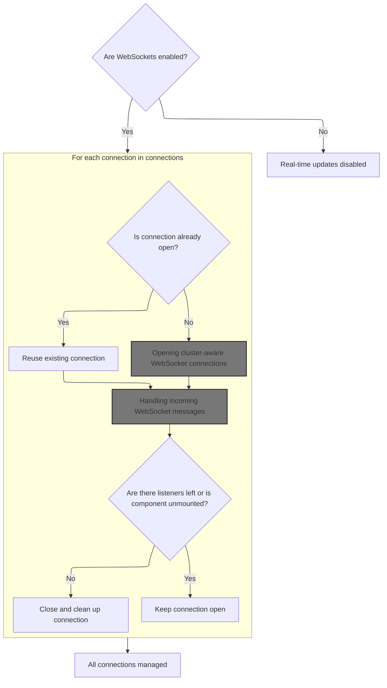
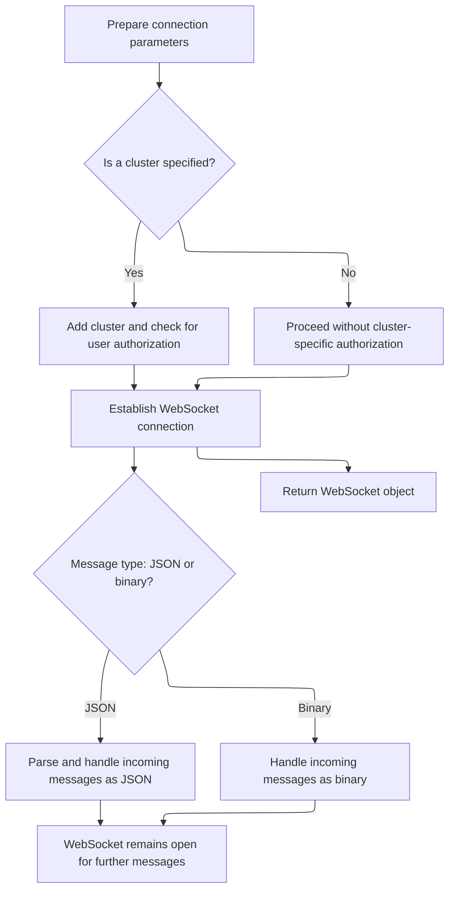
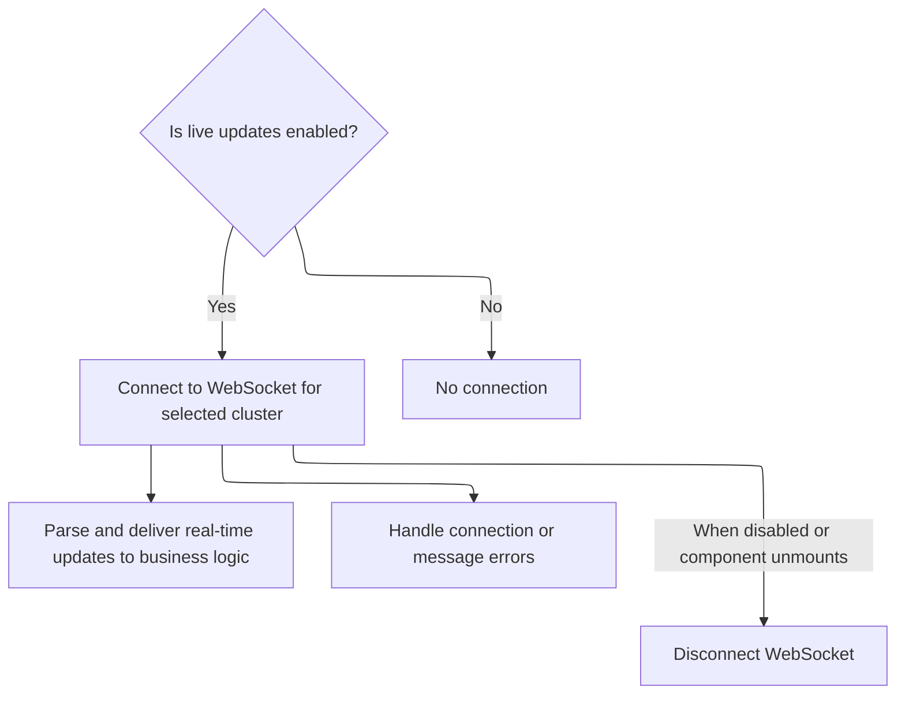
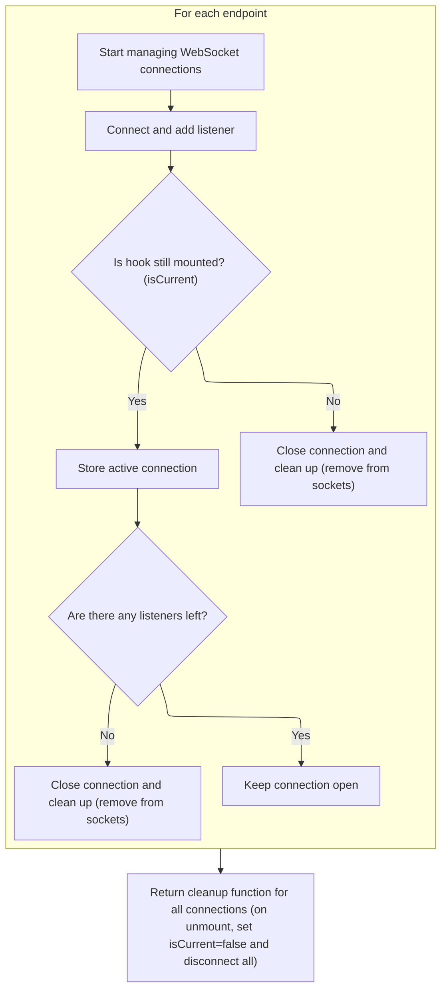
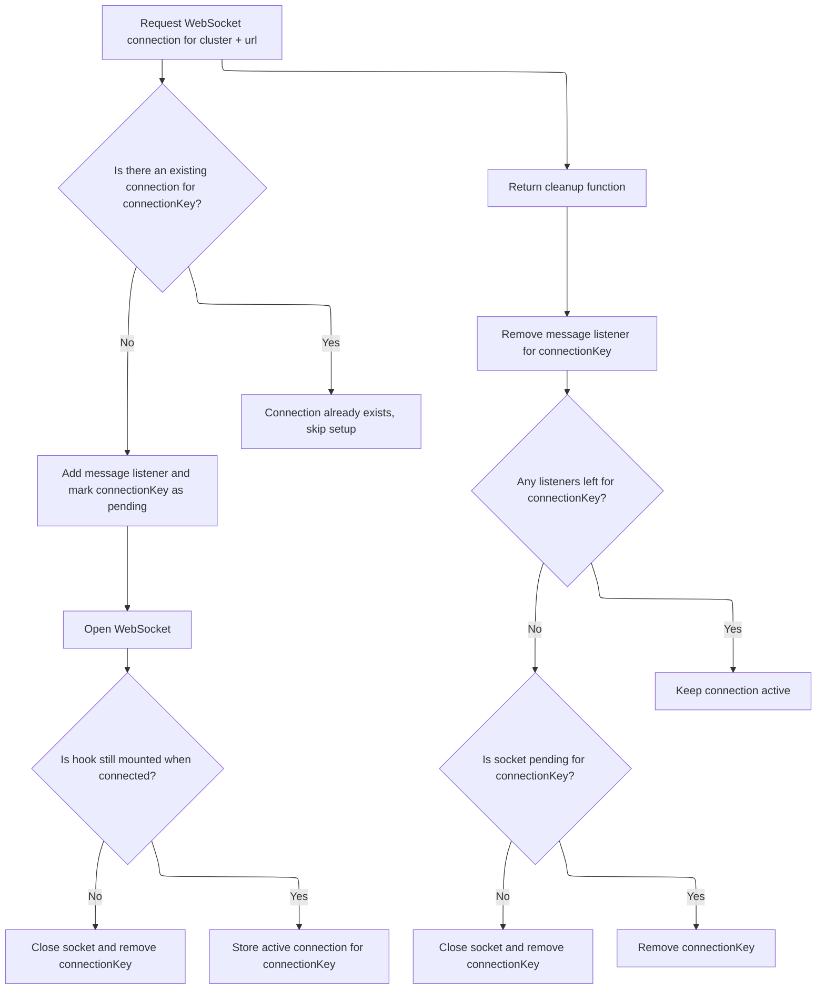

This document describes how the system prepares and manages requests to list Kubernetes resources across clusters and namespaces. The flow determines which clusters and namespaces to query, aggregates the results, and provides real-time updates to the user interface. By efficiently managing connections and watches, the system delivers a unified, up-to-date list of resources and status indicators.

# Where is this flow used?

This flow is used multiple times in the codebase as represented in the following diagram:

(Note - these are only some of the entry points of this flow)

```mermaid
graph TD;
      3e0eb8139d9a01980d464d1f7b56282926e9707ec06f0c55bdacf68730d17bc6(frontend/…/resourceMap/GraphView.tsx::GraphViewContent) --> 1a700f8dedf0d69d3be141ca7ce44d688aad107a774deb8655e974d7d1d949af(frontend/…/k8s/KubeObject.ts::KubeObject.useList)

3e0eb8139d9a01980d464d1f7b56282926e9707ec06f0c55bdacf68730d17bc6(frontend/…/resourceMap/GraphView.tsx::GraphViewContent) --> 59c1f49aac3d793dbcab833698719c95b6a6e82d69ed2536bccf9dedb573a66b(frontend/…/definitions/sources.tsx::useGetAllSources)

59c1f49aac3d793dbcab833698719c95b6a6e82d69ed2536bccf9dedb573a66b(frontend/…/definitions/sources.tsx::useGetAllSources) --> 1a700f8dedf0d69d3be141ca7ce44d688aad107a774deb8655e974d7d1d949af(frontend/…/k8s/KubeObject.ts::KubeObject.useList)

3877936ed66287b8b37cfbe1b3357abe8f8e727ae0d0e28b1a1f7f954954568d(frontend/…/project/ProjectList.tsx::ProjectList) --> 685cb6efe89cbdecb96f92f48aed7ecf570b0623d5f4bb907d740929129900d7(frontend/…/project/useProjectResources.ts::useProjectItems)

3877936ed66287b8b37cfbe1b3357abe8f8e727ae0d0e28b1a1f7f954954568d(frontend/…/project/ProjectList.tsx::ProjectList) --> b1988d135c4a044e9af319d1d21e8cf78bbbb4c3d2c126c5f6030cef04508c9c(frontend/…/project/ProjectList.tsx::useProjects)

685cb6efe89cbdecb96f92f48aed7ecf570b0623d5f4bb907d740929129900d7(frontend/…/project/useProjectResources.ts::useProjectItems) --> 1443d34739bdacddccf826688f3618fd80fc1246cf434f58911c38e875bb06fc(frontend/…/utils/useKubeLists.tsx::useKubeLists)

1443d34739bdacddccf826688f3618fd80fc1246cf434f58911c38e875bb06fc(frontend/…/utils/useKubeLists.tsx::useKubeLists) --> 1a700f8dedf0d69d3be141ca7ce44d688aad107a774deb8655e974d7d1d949af(frontend/…/k8s/KubeObject.ts::KubeObject.useList)

b1988d135c4a044e9af319d1d21e8cf78bbbb4c3d2c126c5f6030cef04508c9c(frontend/…/project/ProjectList.tsx::useProjects) --> 1a700f8dedf0d69d3be141ca7ce44d688aad107a774deb8655e974d7d1d949af(frontend/…/k8s/KubeObject.ts::KubeObject.useList)

e3565f27ed50d7a4ca09e8ff5e67d66312ab9df76d0d24c305edec09ea955389(frontend/…/resourceMap/GraphView.tsx::GraphView) --> eb0529837b1caee2ddb903a1495d1f3e276faa63d8e1fb2a10a0450d6f39aa83(frontend/…/definitions/relations.tsx::useGetAllRelations)

e3565f27ed50d7a4ca09e8ff5e67d66312ab9df76d0d24c305edec09ea955389(frontend/…/resourceMap/GraphView.tsx::GraphView) --> 59c1f49aac3d793dbcab833698719c95b6a6e82d69ed2536bccf9dedb573a66b(frontend/…/definitions/sources.tsx::useGetAllSources)

eb0529837b1caee2ddb903a1495d1f3e276faa63d8e1fb2a10a0450d6f39aa83(frontend/…/definitions/relations.tsx::useGetAllRelations) --> a0d2ded8f46a8c82100b965740528d259f7adbe5c514ef9ecc22d96b6c34255a(frontend/…/definitions/relations.tsx::useGetCRToOwnerRelations)

a0d2ded8f46a8c82100b965740528d259f7adbe5c514ef9ecc22d96b6c34255a(frontend/…/definitions/relations.tsx::useGetCRToOwnerRelations) --> 1a700f8dedf0d69d3be141ca7ce44d688aad107a774deb8655e974d7d1d949af(frontend/…/k8s/KubeObject.ts::KubeObject.useList)

e2c50bfb86c2151ea4882e17040349ffebb9340e732797959a79591c0320a428(frontend/…/configmap/Details.tsx::CronJobDetails) --> 1a700f8dedf0d69d3be141ca7ce44d688aad107a774deb8655e974d7d1d949af(frontend/…/k8s/KubeObject.ts::KubeObject.useList)

e724060e9a0f7dfc56d2b47f86d8f826f19aed6ef6fe36c6e22eecb687600118(frontend/…/globalSearch/GlobalSearchContent.tsx::GlobalSearchContent) --> 8a8436df8295316f4e8290e78dd219207a354087b39abc025f760097f68cb549(frontend/…/globalSearch/GlobalSearchContent.tsx::useSearchResources)

8a8436df8295316f4e8290e78dd219207a354087b39abc025f760097f68cb549(frontend/…/globalSearch/GlobalSearchContent.tsx::useSearchResources) --> 1a700f8dedf0d69d3be141ca7ce44d688aad107a774deb8655e974d7d1d949af(frontend/…/k8s/KubeObject.ts::KubeObject.useList)


classDef mainFlowStyle color:#000000,fill:#7CB9F4
classDef rootsStyle color:#000000,fill:#00FFF4
classDef Style1 color:#000000,fill:#00FFAA
classDef Style2 color:#000000,fill:#FFFF00
classDef Style3 color:#000000,fill:#AA7CB9

%% Swimm:
%% graph TD;
%%       3e0eb8139d9a01980d464d1f7b56282926e9707ec06f0c55bdacf68730d17bc6(<SwmPath>[frontend/…/resourceMap/GraphView.tsx](frontend/src/components/resourceMap/GraphView.tsx)</SwmPath>::GraphViewContent) --> 1a700f8dedf0d69d3be141ca7ce44d688aad107a774deb8655e974d7d1d949af(<SwmPath>[frontend/…/k8s/KubeObject.ts](frontend/src/lib/k8s/KubeObject.ts)</SwmPath>::KubeObject.useList)
%% 
%% 3e0eb8139d9a01980d464d1f7b56282926e9707ec06f0c55bdacf68730d17bc6(<SwmPath>[frontend/…/resourceMap/GraphView.tsx](frontend/src/components/resourceMap/GraphView.tsx)</SwmPath>::GraphViewContent) --> 59c1f49aac3d793dbcab833698719c95b6a6e82d69ed2536bccf9dedb573a66b(<SwmPath>[frontend/…/definitions/sources.tsx](frontend/src/components/resourceMap/sources/definitions/sources.tsx)</SwmPath>::useGetAllSources)
%% 
%% 59c1f49aac3d793dbcab833698719c95b6a6e82d69ed2536bccf9dedb573a66b(<SwmPath>[frontend/…/definitions/sources.tsx](frontend/src/components/resourceMap/sources/definitions/sources.tsx)</SwmPath>::useGetAllSources) --> 1a700f8dedf0d69d3be141ca7ce44d688aad107a774deb8655e974d7d1d949af(<SwmPath>[frontend/…/k8s/KubeObject.ts](frontend/src/lib/k8s/KubeObject.ts)</SwmPath>::KubeObject.useList)
%% 
%% 3877936ed66287b8b37cfbe1b3357abe8f8e727ae0d0e28b1a1f7f954954568d(<SwmPath>[frontend/…/project/ProjectList.tsx](frontend/src/components/project/ProjectList.tsx)</SwmPath>::ProjectList) --> 685cb6efe89cbdecb96f92f48aed7ecf570b0623d5f4bb907d740929129900d7(<SwmPath>[frontend/…/project/useProjectResources.ts](frontend/src/components/project/useProjectResources.ts)</SwmPath>::useProjectItems)
%% 
%% 3877936ed66287b8b37cfbe1b3357abe8f8e727ae0d0e28b1a1f7f954954568d(<SwmPath>[frontend/…/project/ProjectList.tsx](frontend/src/components/project/ProjectList.tsx)</SwmPath>::ProjectList) --> b1988d135c4a044e9af319d1d21e8cf78bbbb4c3d2c126c5f6030cef04508c9c(<SwmPath>[frontend/…/project/ProjectList.tsx](frontend/src/components/project/ProjectList.tsx)</SwmPath>::useProjects)
%% 
%% 685cb6efe89cbdecb96f92f48aed7ecf570b0623d5f4bb907d740929129900d7(<SwmPath>[frontend/…/project/useProjectResources.ts](frontend/src/components/project/useProjectResources.ts)</SwmPath>::useProjectItems) --> 1443d34739bdacddccf826688f3618fd80fc1246cf434f58911c38e875bb06fc(<SwmPath>[frontend/…/utils/useKubeLists.tsx](frontend/src/components/advancedSearch/utils/useKubeLists.tsx)</SwmPath>::useKubeLists)
%% 
%% 1443d34739bdacddccf826688f3618fd80fc1246cf434f58911c38e875bb06fc(<SwmPath>[frontend/…/utils/useKubeLists.tsx](frontend/src/components/advancedSearch/utils/useKubeLists.tsx)</SwmPath>::useKubeLists) --> 1a700f8dedf0d69d3be141ca7ce44d688aad107a774deb8655e974d7d1d949af(<SwmPath>[frontend/…/k8s/KubeObject.ts](frontend/src/lib/k8s/KubeObject.ts)</SwmPath>::KubeObject.useList)
%% 
%% b1988d135c4a044e9af319d1d21e8cf78bbbb4c3d2c126c5f6030cef04508c9c(<SwmPath>[frontend/…/project/ProjectList.tsx](frontend/src/components/project/ProjectList.tsx)</SwmPath>::useProjects) --> 1a700f8dedf0d69d3be141ca7ce44d688aad107a774deb8655e974d7d1d949af(<SwmPath>[frontend/…/k8s/KubeObject.ts](frontend/src/lib/k8s/KubeObject.ts)</SwmPath>::KubeObject.useList)
%% 
%% e3565f27ed50d7a4ca09e8ff5e67d66312ab9df76d0d24c305edec09ea955389(<SwmPath>[frontend/…/resourceMap/GraphView.tsx](frontend/src/components/resourceMap/GraphView.tsx)</SwmPath>::GraphView) --> eb0529837b1caee2ddb903a1495d1f3e276faa63d8e1fb2a10a0450d6f39aa83(<SwmPath>[frontend/…/definitions/relations.tsx](frontend/src/components/resourceMap/sources/definitions/relations.tsx)</SwmPath>::useGetAllRelations)
%% 
%% e3565f27ed50d7a4ca09e8ff5e67d66312ab9df76d0d24c305edec09ea955389(<SwmPath>[frontend/…/resourceMap/GraphView.tsx](frontend/src/components/resourceMap/GraphView.tsx)</SwmPath>::GraphView) --> 59c1f49aac3d793dbcab833698719c95b6a6e82d69ed2536bccf9dedb573a66b(<SwmPath>[frontend/…/definitions/sources.tsx](frontend/src/components/resourceMap/sources/definitions/sources.tsx)</SwmPath>::useGetAllSources)
%% 
%% eb0529837b1caee2ddb903a1495d1f3e276faa63d8e1fb2a10a0450d6f39aa83(<SwmPath>[frontend/…/definitions/relations.tsx](frontend/src/components/resourceMap/sources/definitions/relations.tsx)</SwmPath>::useGetAllRelations) --> a0d2ded8f46a8c82100b965740528d259f7adbe5c514ef9ecc22d96b6c34255a(<SwmPath>[frontend/…/definitions/relations.tsx](frontend/src/components/resourceMap/sources/definitions/relations.tsx)</SwmPath>::useGetCRToOwnerRelations)
%% 
%% a0d2ded8f46a8c82100b965740528d259f7adbe5c514ef9ecc22d96b6c34255a(<SwmPath>[frontend/…/definitions/relations.tsx](frontend/src/components/resourceMap/sources/definitions/relations.tsx)</SwmPath>::useGetCRToOwnerRelations) --> 1a700f8dedf0d69d3be141ca7ce44d688aad107a774deb8655e974d7d1d949af(<SwmPath>[frontend/…/k8s/KubeObject.ts](frontend/src/lib/k8s/KubeObject.ts)</SwmPath>::KubeObject.useList)
%% 
%% e2c50bfb86c2151ea4882e17040349ffebb9340e732797959a79591c0320a428(<SwmPath>[frontend/…/configmap/Details.tsx](frontend/src/components/configmap/Details.tsx)</SwmPath>::CronJobDetails) --> 1a700f8dedf0d69d3be141ca7ce44d688aad107a774deb8655e974d7d1d949af(<SwmPath>[frontend/…/k8s/KubeObject.ts](frontend/src/lib/k8s/KubeObject.ts)</SwmPath>::KubeObject.useList)
%% 
%% e724060e9a0f7dfc56d2b47f86d8f826f19aed6ef6fe36c6e22eecb687600118(<SwmPath>[frontend/…/globalSearch/GlobalSearchContent.tsx](frontend/src/components/globalSearch/GlobalSearchContent.tsx)</SwmPath>::GlobalSearchContent) --> 8a8436df8295316f4e8290e78dd219207a354087b39abc025f760097f68cb549(<SwmPath>[frontend/…/globalSearch/GlobalSearchContent.tsx](frontend/src/components/globalSearch/GlobalSearchContent.tsx)</SwmPath>::useSearchResources)
%% 
%% 8a8436df8295316f4e8290e78dd219207a354087b39abc025f760097f68cb549(<SwmPath>[frontend/…/globalSearch/GlobalSearchContent.tsx](frontend/src/components/globalSearch/GlobalSearchContent.tsx)</SwmPath>::useSearchResources) --> 1a700f8dedf0d69d3be141ca7ce44d688aad107a774deb8655e974d7d1d949af(<SwmPath>[frontend/…/k8s/KubeObject.ts](frontend/src/lib/k8s/KubeObject.ts)</SwmPath>::KubeObject.useList)
%% 
%% 
%% classDef mainFlowStyle color:#000000,fill:#7CB9F4
%% classDef rootsStyle color:#000000,fill:#00FFF4
%% classDef Style1 color:#000000,fill:#00FFAA
%% classDef Style2 color:#000000,fill:#FFFF00
%% classDef Style3 color:#000000,fill:#AA7CB9
```



# Preparing cluster and namespace requests



<SwmSnippet path="/frontend/src/lib/k8s/KubeObject.ts" line="330">

---

<SwmToken path="frontend/src/lib/k8s/KubeObject.ts" pos="330:3:3" line-data="  static useList&lt;K extends KubeObject&gt;(">`useList`</SwmToken> sets up which clusters and namespaces to query for objects, using either explicit parameters or fallbacks. It builds the request list and then hands off the actual fetching and aggregation to <SwmToken path="frontend/src/lib/k8s/KubeObject.ts" pos="369:7:7" line-data="    const result = useKubeObjectList&lt;K&gt;({">`useKubeObjectList`</SwmToken>, which is where the data retrieval and watching logic happens.

```typescript
  static useList<K extends KubeObject>(
    this: (new (...args: any) => K) & typeof KubeObject<any>,
    {
      cluster,
      clusters,
      namespace,
      refetchInterval,
      ...queryParams
    }: {
      cluster?: string;
      clusters?: string[];
      namespace?: string | string[];
      /** How often to refetch the list. Won't refetch by default. Disables watching if set. */
      refetchInterval?: number;
    } & QueryParameters = {}
  ) {
    const fallbackClusters = useSelectedClusters();

    // Create requests for each cluster and namespace
    const requests = useMemo(() => {
      const clusterList = cluster
        ? [cluster]
        : clusters || (fallbackClusters.length === 0 ? [''] : fallbackClusters);

      const namespacesFromParams =
        typeof namespace === 'string'
          ? [namespace]
          : Array.isArray(namespace)
          ? namespace
          : undefined;

      return makeListRequests(
        clusterList,
        getAllowedNamespaces,
        this.isNamespaced,
        namespacesFromParams
      );
    }, [cluster, clusters, fallbackClusters, namespace, this.isNamespaced]);

    const result = useKubeObjectList<K>({
      queryParams: queryParams,
      kubeObjectClass: this,
      requests,
      refetchInterval,
    });

    return result;
  }
```

---

</SwmSnippet>

# Aggregating queries and managing watches



<SwmSnippet path="/frontend/src/lib/k8s/api/v2/useKubeObjectList.ts" line="399">

---

In <SwmToken path="frontend/src/lib/k8s/api/v2/useKubeObjectList.ts" pos="399:4:4" line-data="export function useKubeObjectList&lt;K extends KubeObject&gt;({">`useKubeObjectList`</SwmToken> we grab the endpoint from the first cluster, clean up query params, and build queries for each <SwmPath>[frontend/…/components/namespace/](frontend/src/components/namespace/)</SwmPath> combo. We aggregate results, errors, and status flags, and keep track of which lists to watch for updates. The function then calls <SwmToken path="frontend/src/lib/k8s/api/v2/useKubeObjectList.ts" pos="529:1:1" line-data="  useWatchKubeObjectLists({">`useWatchKubeObjectLists`</SwmToken> to handle live updates.

```typescript
export function useKubeObjectList<K extends KubeObject>({
  requests,
  kubeObjectClass,
  queryParams,
  watch = true,
  refetchInterval,
}: {
  requests: Array<{ cluster: string; namespaces?: string[] }>;
  /** Class to instantiate the object with */
  kubeObjectClass: (new (...args: any) => K) & typeof KubeObject<any>;
  queryParams?: QueryParameters;
  /** Watch for updates @default true */
  watch?: boolean;
  /** How often to refetch the list. Won't refetch by default. Disables watching if set. */
  refetchInterval?: number;
}): [Array<K> | null, ApiError | null] &
  QueryListResponse<Array<ListResponse<K> | undefined | null>, K, ApiError> {
  const maybeNamespace = requests.find(it => it.namespaces)?.namespaces?.[0];

  // Get working endpoint from the first cluster
  // Now if clusters have different apiVersions for the same resource for example, this will not work
  const { endpoint, error: endpointError } = useEndpoints(
    kubeObjectClass.apiEndpoint.apiInfo,
    requests[0]?.cluster,
    maybeNamespace
  );

  const cleanedUpQueryParams = Object.fromEntries(
    Object.entries(queryParams ?? {}).filter(([, value]) => value !== undefined && value !== '')
  );

  const queries = useMemo(
    () =>
      endpoint
        ? requests.flatMap(({ cluster, namespaces }) =>
            namespaces && namespaces.length > 0
              ? namespaces.map(namespace =>
                  kubeObjectListQuery<K>(
                    kubeObjectClass,
                    endpoint,
                    namespace,
                    cluster,
                    cleanedUpQueryParams,
                    refetchInterval
                  )
                )
              : kubeObjectListQuery<K>(
                  kubeObjectClass,
                  endpoint,
                  undefined,
                  cluster,
                  cleanedUpQueryParams,
                  refetchInterval
                )
          )
        : [],
    [requests, kubeObjectClass, endpoint, cleanedUpQueryParams]
  );

  const query = useQueries({
    queries,
    combine(results) {
      return {
        data: results.map(result => result.data),
        clusterResults: results.reduce((acc, result) => {
          if (result.data && result.data.cluster) {
            acc[result.data.cluster] = {
              data: result.data,
              error: result.error,
              errors: result.error ? [result.error] : null,
              isError: result.isError,
              isFetching: result.isFetching,
              isLoading: result.isLoading,
              isSuccess: result.isSuccess,
              items: result?.data?.list?.items ?? null,
              status: result.status,
            };
          }
          return acc;
        }, {} as Record<string, QueryListResponse<any, K, ApiError>>),
        items: results.every(result => result.data === null)
          ? null
          : results.flatMap(result => result?.data?.list?.items ?? []),
        errors: results.map(result => result.error).filter(Boolean),
        isError: results.some(result => result.isError),
        isLoading: results.some(result => result.isLoading),
        isFetching: results.some(result => result.isFetching),
        isSuccess: results.every(result => result.isSuccess),
      };
    },
  });

  const shouldWatch = watch && !refetchInterval && !query.isLoading;

  const [listsToWatch, setListsToWatch] = useState<
    { cluster: string; namespace?: string; resourceVersion: string }[]
  >([]);

  const listsNotYetWatched = query.data
    .filter(Boolean)
    .filter(
      data =>
        listsToWatch.find(
          // resourceVersion is intentionally omitted to avoid recreating WS connection when list is updated
          watching => watching.cluster === data?.cluster && watching.namespace === data.namespace
        ) === undefined
    )
    .map(data => ({
      cluster: data!.cluster,
      namespace: data!.namespace,
      resourceVersion: data!.list.metadata.resourceVersion,
    }));

  if (listsNotYetWatched.length > 0) {
    setListsToWatch([...listsToWatch, ...listsNotYetWatched]);
  }

  const listsToStopWatching = listsToWatch.filter(
    watching =>
      requests.find(request =>
        watching.cluster === request?.cluster && request.namespaces && watching.namespace
          ? request.namespaces?.includes(watching.namespace)
          : true
      ) === undefined
  );

  if (listsToStopWatching.length > 0) {
    setListsToWatch(listsToWatch.filter(it => !listsToStopWatching.includes(it)));
  }

  useWatchKubeObjectLists({
    lists: shouldWatch ? listsToWatch : [],
    endpoint,
    kubeObjectClass,
    queryParams: cleanedUpQueryParams,
  });

```

---

</SwmSnippet>

## Choosing multiplexed or legacy watch

<SwmSnippet path="/frontend/src/lib/k8s/api/v2/useKubeObjectList.ts" line="127">

---

In <SwmToken path="frontend/src/lib/k8s/api/v2/useKubeObjectList.ts" pos="127:4:4" line-data="export function useWatchKubeObjectLists&lt;K extends KubeObject&gt;({">`useWatchKubeObjectLists`</SwmToken> we check if multiplexing is enabled. If so, we use the multiplexed watcher; otherwise, we fall back to the legacy watcher. This lets us support both new and old <SwmToken path="frontend/src/lib/k8s/api/v2/useKubeObjectList.ts" pos="135:11:11" line-data="  /** Query parameters for the WebSocket connection URL */">`WebSocket`</SwmToken> strategies.

```typescript
export function useWatchKubeObjectLists<K extends KubeObject>({
  kubeObjectClass,
  endpoint,
  lists,
  queryParams,
}: {
  /** KubeObject class of the watched resource list */
  kubeObjectClass: (new (...args: any) => K) & typeof KubeObject<any>;
  /** Query parameters for the WebSocket connection URL */
  queryParams?: QueryParameters;
  /** Kube resource API endpoint information */
  endpoint?: KubeObjectEndpoint | null;
  /** Which clusters and namespaces to watch */
  lists: Array<{ cluster: string; namespace?: string; resourceVersion: string }>;
}) {
  if (getWebsocketMultiplexerEnabled()) {
    return useWatchKubeObjectListsMultiplexed({
      kubeObjectClass,
      endpoint,
      lists,
      queryParams,
    });
  } else {
```

---

</SwmSnippet>

### Multiplexed <SwmToken path="frontend/src/lib/k8s/api/v2/useKubeObjectList.ts" pos="135:11:11" line-data="  /** Query parameters for the WebSocket connection URL */">`WebSocket`</SwmToken> watcher

See <SwmLink doc-title="Synchronizing Kubernetes Resource Lists">[Synchronizing Kubernetes Resource Lists](/.swm/synchronizing-kubernetes-resource-lists.rin1wd9v.sw.md)</SwmLink>

### Legacy <SwmToken path="frontend/src/lib/k8s/api/v2/useKubeObjectList.ts" pos="135:11:11" line-data="  /** Query parameters for the WebSocket connection URL */">`WebSocket`</SwmToken> watcher fallback

<SwmSnippet path="/frontend/src/lib/k8s/api/v2/useKubeObjectList.ts" line="150">

---

After deciding not to use multiplexing, we call <SwmToken path="frontend/src/lib/k8s/api/v2/useKubeObjectList.ts" pos="150:3:3" line-data="    return useWatchKubeObjectListsLegacy({">`useWatchKubeObjectListsLegacy`</SwmToken> to set up individual <SwmToken path="frontend/src/lib/k8s/api/v2/useKubeObjectList.ts" pos="135:11:11" line-data="  /** Query parameters for the WebSocket connection URL */">`WebSocket`</SwmToken> connections for each watched list. This keeps the flow working even if multiplexing isn't available.

```typescript
    return useWatchKubeObjectListsLegacy({
      kubeObjectClass,
      endpoint,
      lists,
      queryParams,
    });
  }
}
```

---

</SwmSnippet>

## Setting up legacy <SwmToken path="frontend/src/lib/k8s/api/v2/useKubeObjectList.ts" pos="135:11:11" line-data="  /** Query parameters for the WebSocket connection URL */">`WebSocket`</SwmToken> connections



<SwmSnippet path="/frontend/src/lib/k8s/api/v2/useKubeObjectList.ts" line="303">

---

<SwmToken path="frontend/src/lib/k8s/api/v2/useKubeObjectList.ts" pos="303:2:2" line-data="function useWatchKubeObjectListsLegacy&lt;K extends KubeObject&gt;({">`useWatchKubeObjectListsLegacy`</SwmToken> builds a list of <SwmToken path="frontend/src/lib/k8s/api/v2/useKubeObjectList.ts" pos="311:11:11" line-data="  /** Query parameters for the WebSocket connection URL */">`WebSocket`</SwmToken> connections for each cluster/namespace/resourceVersion combo, sets up message handlers to update the query cache, and then calls <SwmToken path="frontend/src/lib/k8s/api/v2/useKubeObjectList.ts" pos="357:1:1" line-data="  useWebSockets&lt;KubeListUpdateEvent&lt;K&gt;&gt;({">`useWebSockets`</SwmToken> to actually open and manage those connections.

```typescript
function useWatchKubeObjectListsLegacy<K extends KubeObject>({
  kubeObjectClass,
  endpoint,
  lists,
  queryParams,
}: {
  /** KubeObject class of the watched resource list */
  kubeObjectClass: (new (...args: any) => K) & typeof KubeObject<any>;
  /** Query parameters for the WebSocket connection URL */
  queryParams?: QueryParameters;
  /** Kube resource API endpoint information */
  endpoint?: KubeObjectEndpoint | null;
  /** Which clusters and namespaces to watch */
  lists: Array<{ cluster: string; namespace?: string; resourceVersion: string }>;
}) {
  const client = useQueryClient();

  const connections = useMemo(() => {
    if (!endpoint) return [];

    return lists.map(({ cluster, namespace, resourceVersion }) => {
      const url = makeUrl([KubeObjectEndpoint.toUrl(endpoint!, namespace)], {
        ...queryParams,
        watch: 1,
        resourceVersion,
      });

      return {
        cluster,
        url,
        onMessage(update: KubeListUpdateEvent<K>) {
          const key = kubeObjectListQuery<K>(
            kubeObjectClass,
            endpoint,
            namespace,
            cluster,
            queryParams ?? {}
          ).queryKey;
          client.setQueryData(key, (oldResponse: ListResponse<any> | undefined | null) => {
            if (!oldResponse) return oldResponse;

            const newList = KubeList.applyUpdate(
              oldResponse.list,
              update,
              kubeObjectClass,
              cluster
            );
            return { ...oldResponse, list: newList };
          });
        },
      };
    });
  }, [lists, kubeObjectClass, endpoint]);

  useWebSockets<KubeListUpdateEvent<K>>({
    enabled: !!endpoint,
    connections,
  });
}
```

---

</SwmSnippet>

## Managing <SwmToken path="frontend/src/lib/k8s/api/v2/useKubeObjectList.ts" pos="135:11:11" line-data="  /** Query parameters for the WebSocket connection URL */">`WebSocket`</SwmToken> connections and listeners



<SwmSnippet path="/frontend/src/lib/k8s/api/v2/webSocket.ts" line="566">

---

In <SwmToken path="frontend/src/lib/k8s/api/v2/webSocket.ts" pos="566:4:4" line-data="export function useWebSockets&lt;T&gt;({">`useWebSockets`</SwmToken> we use global maps to track open sockets and listeners, making sure we only open one connection per cluster+url and share it across components. We manage connection lifecycles with React's <SwmToken path="frontend/src/lib/k8s/api/v2/webSocket.ts" pos="585:1:1" line-data="  useEffect(() =&gt; {">`useEffect`</SwmToken>, cleaning up when listeners go away.

```typescript
export function useWebSockets<T>({
  connections,
  enabled = true,
  protocols,
  type = 'json',
}: {
  enabled?: boolean;
  /** Make sure that connections value is stable between renders */
  connections: Array<WebSocketConnectionRequest<T>>;
  /**
   * Any additional protocols to include in WebSocket connection
   * make sure that the value is stable between renders
   */
  protocols?: string | string[];
  /**
   * Type of websocket data
   */
  type?: 'json' | 'binary';
}) {
  useEffect(() => {
    if (!enabled) return;

    let isCurrent = true;

    /** Open a connection to websocket */
    function connect({ cluster, url, onMessage }: WebSocketConnectionRequest<T>) {
      const connectionKey = cluster + url;

      if (!sockets.has(connectionKey)) {
        // Add new listener for this URL
        listeners.set(connectionKey, [...(listeners.get(connectionKey) ?? []), onMessage]);

        // Mark socket as pending, so we don't open more than one
        sockets.set(connectionKey, 'pending');

        let ws: WebSocket | undefined;
        openWebSocket(url, { protocols, type, cluster, onMessage })
          .then(socket => {
```

---

</SwmSnippet>

### Opening cluster-aware <SwmToken path="frontend/src/lib/k8s/api/v2/useKubeObjectList.ts" pos="135:11:11" line-data="  /** Query parameters for the WebSocket connection URL */">`WebSocket`</SwmToken> connections



<SwmSnippet path="/frontend/src/lib/k8s/api/v2/webSocket.ts" line="503">

---

<SwmToken path="frontend/src/lib/k8s/api/v2/webSocket.ts" pos="503:6:6" line-data="export async function openWebSocket&lt;T&gt;(">`openWebSocket`</SwmToken> builds the <SwmToken path="frontend/src/lib/k8s/api/v2/webSocket.ts" pos="512:15:15" line-data="     * Any additional protocols to include in WebSocket connection">`WebSocket`</SwmToken> URL and protocol list, adding cluster and user-specific authorization if needed. It opens the socket and sets up the message handler, then hands off incoming messages to the callback.

```typescript
export async function openWebSocket<T>(
  url: string,
  {
    protocols: moreProtocols = [],
    type = 'binary',
    cluster = getCluster() ?? '',
    onMessage,
  }: {
    /**
     * Any additional protocols to include in WebSocket connection
     */
    protocols?: string | string[];
    /**
     *
     */
    type: 'json' | 'binary';
    /**
     * Cluster name
     */
    cluster?: string;
    /**
     * Message callback
     */
    onMessage: (data: T) => void;
  }
) {
  const path = [url];
  const protocols = ['base64.binary.k8s.io', ...(moreProtocols ?? [])];

  if (cluster) {
    path.unshift('clusters', cluster);

    try {
      const kubeconfig = await findKubeconfigByClusterName(cluster);

      if (kubeconfig !== null) {
        const userID = getUserIdFromLocalStorage();
        protocols.push(`base64url.headlamp.authorization.k8s.io.${userID}`);
      }
    } catch (error) {
      console.error('Error while finding kubeconfig:', error);
    }
  }

  const socket = new WebSocket(makeUrl([getBaseWsUrl(), ...path], {}), protocols);
  socket.binaryType = 'arraybuffer';
  socket.addEventListener('message', (body: MessageEvent) => {
    const data = type === 'json' ? JSON.parse(body.data) : body.data;
    onMessage(data);
  });
  socket.addEventListener('error', error => {
    console.error('WebSocket error:', error);
  });

  return socket;
}
```

---

</SwmSnippet>

### Handling incoming <SwmToken path="frontend/src/lib/k8s/api/v2/useKubeObjectList.ts" pos="135:11:11" line-data="  /** Query parameters for the WebSocket connection URL */">`WebSocket`</SwmToken> messages

<SwmSnippet path="/frontend/src/lib/k8s/api/v2/hooks.ts" line="152">

---

<SwmToken path="frontend/src/lib/k8s/api/v2/useKubeObjectList.ts" pos="333:1:1" line-data="        onMessage(update: KubeListUpdateEvent&lt;K&gt;) {">`onMessage`</SwmToken> updates the query cache for non-ADDED events by instantiating a new object and storing it. This keeps the UI in sync with backend changes.

```typescript
    onMessage(update: KubeListUpdateEvent<K>) {
      if (update.type !== 'ADDED' && update.object) {
        client.setQueryData(queryKey, new kubeObjectClass(update.object));
      }
    },
```

---

</SwmSnippet>

### Subscribing to <SwmToken path="frontend/src/lib/k8s/api/v2/useKubeObjectList.ts" pos="135:11:11" line-data="  /** Query parameters for the WebSocket connection URL */">`WebSocket`</SwmToken> updates



<SwmSnippet path="/frontend/src/lib/k8s/api/v2/webSocket.ts" line="416">

---

We parse incoming messages and pass them to the callback, handling errors as needed.

```typescript
export function useWebSocket<T>({
  url: createUrl,
  enabled = true,
  cluster = '',
  onMessage,
  onError,
}: {
  /** Function that returns the WebSocket URL to connect to */
  url: () => string;
  /** Whether the WebSocket connection should be active */
  enabled?: boolean;
  /** The Kubernetes cluster ID to watch */
  cluster?: string;
  /** Callback function to handle incoming messages */
  onMessage: (data: T) => void;
  /** Callback function to handle connection errors */
  onError?: (error: Error) => void;
}) {
  const url = useMemo(() => (enabled ? createUrl() : ''), [enabled, createUrl]);

  const stableOnMessage = useCallback(
    (rawData: any) => {
      try {
        let parsedData: T;
        try {
          parsedData = typeof rawData === 'string' ? JSON.parse(rawData) : rawData;
        } catch (parseError) {
          console.error('Failed to parse WebSocket message:', parseError);
          onError?.(parseError as Error);
          return;
        }

        onMessage(parsedData);
      } catch (err) {
        console.error('Failed to process WebSocket message:', err);
        onError?.(err as Error);
      }
    },
    [onMessage, onError]
  );

```

---

</SwmSnippet>

<SwmSnippet path="/frontend/src/lib/k8s/api/v2/webSocket.ts" line="457">

---

After handling messages in <SwmToken path="frontend/src/lib/k8s/api/v2/useKubeObjectList.ts" pos="333:1:1" line-data="        onMessage(update: KubeListUpdateEvent&lt;K&gt;) {">`onMessage`</SwmToken>, we use a cleanup function in <SwmToken path="frontend/src/lib/k8s/api/v2/webSocket.ts" pos="416:4:4" line-data="export function useWebSocket&lt;T&gt;({">`useWebSocket`</SwmToken> to unsubscribe and close the socket if the component unmounts or dependencies change. This keeps resource usage in check.

```typescript
  useEffect(() => {
    if (!enabled || !url) {
      return;
    }

    let cleanup: (() => void) | undefined;

    const connectWebSocket = async () => {
      try {
        const parsedUrl = new URL(url, getBaseWsUrl());
        cleanup = await WebSocketManager.subscribe(
          cluster,
          parsedUrl.pathname,
          parsedUrl.search.slice(1),
          stableOnMessage
        );
      } catch (err) {
        console.error('WebSocket connection failed:', err);
        onError?.(err as Error);
      }
    };

    connectWebSocket();

    return () => {
      if (cleanup) {
        cleanup();
      }
    };
  }, [url, enabled, cluster, stableOnMessage, onError]);
}
```

---

</SwmSnippet>

### Cleaning up unused <SwmToken path="frontend/src/lib/k8s/api/v2/useKubeObjectList.ts" pos="135:11:11" line-data="  /** Query parameters for the WebSocket connection URL */">`WebSocket`</SwmToken> connections



<SwmSnippet path="/frontend/src/lib/k8s/api/v2/webSocket.ts" line="604">

---

After opening sockets in <SwmToken path="frontend/src/lib/k8s/api/v2/useKubeObjectList.ts" pos="357:1:1" line-data="  useWebSockets&lt;KubeListUpdateEvent&lt;K&gt;&gt;({">`useWebSockets`</SwmToken>, we clean up listeners and close connections when no one is listening. This keeps the number of open sockets under control and avoids leaks.

```typescript
            ws = socket;

            // Hook was unmounted while it was connecting to WebSocket
            // so we close the socket and clean up
            if (!isCurrent) {
              ws.close();
              sockets.delete(connectionKey);
              return;
            }

            sockets.set(connectionKey, ws);
          })
          .catch(err => {
            console.error(err);
          });
      }

      return () => {
        const connectionKey = cluster + url;

        // Clean up the listener
        const newListeners = listeners.get(connectionKey)?.filter(it => it !== onMessage) ?? [];
        listeners.set(connectionKey, newListeners);

        // No one is listening to the connection
        // so we can close it
        if (newListeners.length === 0) {
          const maybeExisting = sockets.get(connectionKey);
          if (maybeExisting) {
            if (maybeExisting !== 'pending') {
              maybeExisting.close();
            }
            sockets.delete(connectionKey);
          }
        }
      };
    }

    const disconnectCallbacks = connections.map(endpoint => connect(endpoint));

    return () => {
      isCurrent = false;
      disconnectCallbacks.forEach(fn => fn());
    };
  }, [enabled, type, connections, protocols]);
}
```

---

</SwmSnippet>

## Connecting and tracking <SwmToken path="frontend/src/lib/k8s/api/v2/useKubeObjectList.ts" pos="135:11:11" line-data="  /** Query parameters for the WebSocket connection URL */">`WebSocket`</SwmToken> listeners



<SwmSnippet path="/frontend/src/lib/k8s/api/v2/webSocket.ts" line="591">

---

In <SwmToken path="frontend/src/lib/k8s/api/v2/webSocket.ts" pos="591:3:3" line-data="    function connect({ cluster, url, onMessage }: WebSocketConnectionRequest&lt;T&gt;) {">`connect`</SwmToken> we add listeners and mark sockets as 'pending' while opening. Once connected, we swap in the actual socket. Cleanup removes listeners and closes sockets if no one is left.

```typescript
    function connect({ cluster, url, onMessage }: WebSocketConnectionRequest<T>) {
      const connectionKey = cluster + url;

      if (!sockets.has(connectionKey)) {
        // Add new listener for this URL
        listeners.set(connectionKey, [...(listeners.get(connectionKey) ?? []), onMessage]);

        // Mark socket as pending, so we don't open more than one
        sockets.set(connectionKey, 'pending');

        let ws: WebSocket | undefined;
        openWebSocket(url, { protocols, type, cluster, onMessage })
          .then(socket => {
```

---

</SwmSnippet>

<SwmSnippet path="/frontend/src/lib/k8s/api/v2/webSocket.ts" line="604">

---

After connecting in <SwmToken path="frontend/src/lib/k8s/api/v2/webSocket.ts" pos="423:17:17" line-data="  /** Function that returns the WebSocket URL to connect to */">`connect`</SwmToken>, we clean up listeners and close sockets if no one is left. If a socket is still 'pending', we just remove it from the map. This keeps resource usage tight.

```typescript
            ws = socket;

            // Hook was unmounted while it was connecting to WebSocket
            // so we close the socket and clean up
            if (!isCurrent) {
              ws.close();
              sockets.delete(connectionKey);
              return;
            }

            sockets.set(connectionKey, ws);
          })
          .catch(err => {
            console.error(err);
          });
      }

      return () => {
        const connectionKey = cluster + url;

        // Clean up the listener
        const newListeners = listeners.get(connectionKey)?.filter(it => it !== onMessage) ?? [];
        listeners.set(connectionKey, newListeners);

        // No one is listening to the connection
        // so we can close it
        if (newListeners.length === 0) {
          const maybeExisting = sockets.get(connectionKey);
          if (maybeExisting) {
            if (maybeExisting !== 'pending') {
              maybeExisting.close();
            }
            sockets.delete(connectionKey);
          }
        }
      };
    }
```

---

</SwmSnippet>

## Returning aggregated list and status

```mermaid
%%{init: {"flowchart": {"defaultRenderer": "elk"}} }%%
flowchart TD
    node1["Summarize Kubernetes query results"] --> node2{"Is endpointError present?"}
    click node1 openCode "frontend/src/lib/k8s/api/v2/useKubeObjectList.ts:536:553"
    node2 -->|"Yes"| node3[Return: items=[], errors=[endpointError], error=endpointError]
    click node2 openCode "frontend/src/lib/k8s/api/v2/useKubeObjectList.ts:540:542"
    node2 -->|"No"| node4{"Are there any non-null errors?"}
    click node3 openCode "frontend/src/lib/k8s/api/v2/useKubeObjectList.ts:540:542"
    node4 -->|"Yes"| node5["Return: items=query.items, errors=errors, error=first error"]
    click node4 openCode "frontend/src/lib/k8s/api/v2/useKubeObjectList.ts:541:542"
    node4 -->|"No"| node6["Return: items=query.items, errors=null, error=null"]
    click node5 openCode "frontend/src/lib/k8s/api/v2/useKubeObjectList.ts:541:542"
    click node6 openCode "frontend/src/lib/k8s/api/v2/useKubeObjectList.ts:541:542"
    node3 --> node7["Include status indicators"]
    node5 --> node7
    node6 --> node7
    click node7 openCode "frontend/src/lib/k8s/api/v2/useKubeObjectList.ts:543:547"
    subgraph loop1["Iterator yields"]
      node7 -->|"Yield items"| node8["Yield query.items"]
      click node8 openCode "frontend/src/lib/k8s/api/v2/useKubeObjectList.ts:549:549"
      node8 -->|"Yield error"| node9["Yield endpointError or first error"]
      click node9 openCode "frontend/src/lib/k8s/api/v2/useKubeObjectList.ts:550:550"
    end
classDef HeadingStyle fill:#777777,stroke:#333,stroke-width:2px;

%% Swimm:
%% %%{init: {"flowchart": {"defaultRenderer": "elk"}} }%%
%% flowchart TD
%%     node1["Summarize Kubernetes query results"] --> node2{"Is <SwmToken path="frontend/src/lib/k8s/api/v2/useKubeObjectList.ts" pos="420:11:11" line-data="  const { endpoint, error: endpointError } = useEndpoints(">`endpointError`</SwmToken> present?"}
%%     click node1 openCode "<SwmPath>[frontend/…/v2/useKubeObjectList.ts](frontend/src/lib/k8s/api/v2/useKubeObjectList.ts)</SwmPath>:536:553"
%%     node2 -->|"Yes"| node3[Return: items=[], errors=[<SwmToken path="frontend/src/lib/k8s/api/v2/useKubeObjectList.ts" pos="420:11:11" line-data="  const { endpoint, error: endpointError } = useEndpoints(">`endpointError`</SwmToken>], error=<SwmToken path="frontend/src/lib/k8s/api/v2/useKubeObjectList.ts" pos="420:11:11" line-data="  const { endpoint, error: endpointError } = useEndpoints(">`endpointError`</SwmToken>]
%%     click node2 openCode "<SwmPath>[frontend/…/v2/useKubeObjectList.ts](frontend/src/lib/k8s/api/v2/useKubeObjectList.ts)</SwmPath>:540:542"
%%     node2 -->|"No"| node4{"Are there any non-null errors?"}
%%     click node3 openCode "<SwmPath>[frontend/…/v2/useKubeObjectList.ts](frontend/src/lib/k8s/api/v2/useKubeObjectList.ts)</SwmPath>:540:542"
%%     node4 -->|"Yes"| node5["Return: items=<SwmToken path="frontend/src/lib/k8s/api/v2/useKubeObjectList.ts" pos="540:13:15" line-data="    items: endpointError ? [] : query.items,">`query.items`</SwmToken>, errors=errors, error=first error"]
%%     click node4 openCode "<SwmPath>[frontend/…/v2/useKubeObjectList.ts](frontend/src/lib/k8s/api/v2/useKubeObjectList.ts)</SwmPath>:541:542"
%%     node4 -->|"No"| node6["Return: items=<SwmToken path="frontend/src/lib/k8s/api/v2/useKubeObjectList.ts" pos="540:13:15" line-data="    items: endpointError ? [] : query.items,">`query.items`</SwmToken>, errors=null, error=null"]
%%     click node5 openCode "<SwmPath>[frontend/…/v2/useKubeObjectList.ts](frontend/src/lib/k8s/api/v2/useKubeObjectList.ts)</SwmPath>:541:542"
%%     click node6 openCode "<SwmPath>[frontend/…/v2/useKubeObjectList.ts](frontend/src/lib/k8s/api/v2/useKubeObjectList.ts)</SwmPath>:541:542"
%%     node3 --> node7["Include status indicators"]
%%     node5 --> node7
%%     node6 --> node7
%%     click node7 openCode "<SwmPath>[frontend/…/v2/useKubeObjectList.ts](frontend/src/lib/k8s/api/v2/useKubeObjectList.ts)</SwmPath>:543:547"
%%     subgraph loop1["Iterator yields"]
%%       node7 -->|"Yield items"| node8["Yield <SwmToken path="frontend/src/lib/k8s/api/v2/useKubeObjectList.ts" pos="540:13:15" line-data="    items: endpointError ? [] : query.items,">`query.items`</SwmToken>"]
%%       click node8 openCode "<SwmPath>[frontend/…/v2/useKubeObjectList.ts](frontend/src/lib/k8s/api/v2/useKubeObjectList.ts)</SwmPath>:549:549"
%%       node8 -->|"Yield error"| node9["Yield <SwmToken path="frontend/src/lib/k8s/api/v2/useKubeObjectList.ts" pos="420:11:11" line-data="  const { endpoint, error: endpointError } = useEndpoints(">`endpointError`</SwmToken> or first error"]
%%       click node9 openCode "<SwmPath>[frontend/…/v2/useKubeObjectList.ts](frontend/src/lib/k8s/api/v2/useKubeObjectList.ts)</SwmPath>:550:550"
%%     end
%% classDef HeadingStyle fill:#777777,stroke:#333,stroke-width:2px;
```

<SwmSnippet path="/frontend/src/lib/k8s/api/v2/useKubeObjectList.ts" line="536">

---

After watching lists in <SwmToken path="frontend/src/lib/k8s/KubeObject.ts" pos="369:7:7" line-data="    const result = useKubeObjectList&lt;K&gt;({">`useKubeObjectList`</SwmToken>, we combine items and errors from all queries, handle endpoint errors, and return everything in a single object for the UI to consume.

```typescript
  const errors = query.errors.filter(it => it !== null);

  // @ts-ignore - TS compiler gets confused with iterators
  return {
    items: endpointError ? [] : query.items,
    errors: endpointError ? [endpointError] : errors.length > 0 ? errors : null,
    error: endpointError ?? query.errors.find(it => it !== null) ?? null,
    clusterResults: query.clusterResults,
    isError: query.isError,
    isLoading: query.isLoading,
    isFetching: query.isFetching,
    isSuccess: query.isSuccess,
    *[Symbol.iterator](): ArrayIterator<ApiError | K[] | null> {
      yield query.items;
      yield endpointError ?? query.errors.find(it => it !== null) ?? null;
    },
  };
}
```

---

</SwmSnippet>

&nbsp;

*This is an auto-generated document by Swimm 🌊 and has not yet been verified by a human*

<SwmMeta version="3.0.0" repo-id="Z2l0aHViJTNBJTNBdHlwZXNjcmlwdC1oZWFkbGFtcCUzQSUzQXJpY2FyZG9sb3Blemc=" repo-name="typescript-headlamp"><sup>Powered by [Swimm](https://app.swimm.io/)</sup></SwmMeta>
