This document describes how the system enables live monitoring and updating of Kubernetes object lists and plugins across clusters and namespaces. The flow receives a set of lists to watch and provides real-time updates to the UI as resources or plugins change. It manages connections, processes plugin updates, handles resource deletions, and ensures subscriptions are cleaned up when no longer needed.

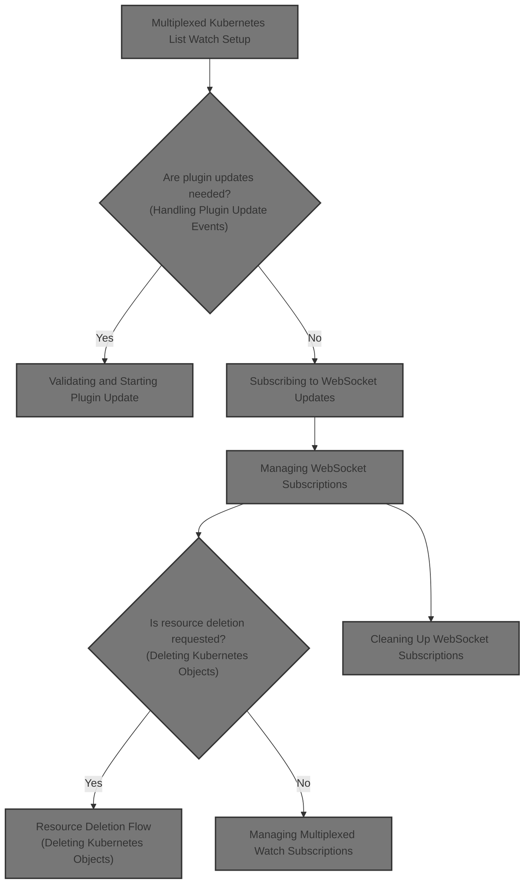

# Multiplexed Kubernetes List Watch Setup

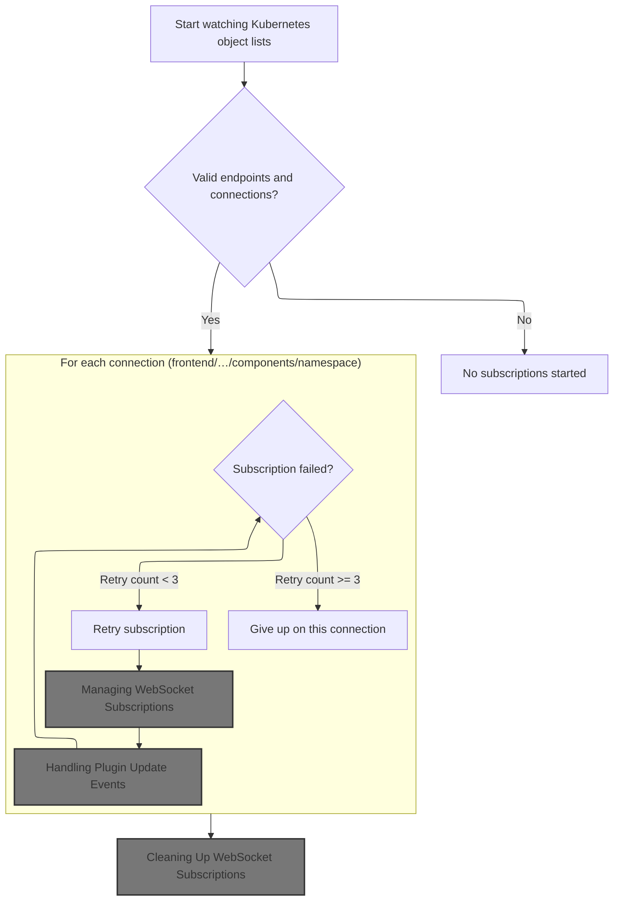

<SwmSnippet path="/frontend/src/lib/k8s/api/v2/useKubeObjectList.ts" line="170">

---

We start by stabilizing query params and tracking resourceVersions so we can build <SwmToken path="frontend/src/lib/k8s/api/v2/useKubeObjectList.ts" pos="203:5:5" line-data="      // Construct WebSocket URL with current parameters">`WebSocket`</SwmToken> <SwmToken path="frontend/src/lib/k8s/api/v2/useKubeObjectList.ts" pos="190:9:9" line-data="  // Create stable connection URLs for each list">`URLs`</SwmToken> that only fetch new updates. Then we use <SwmToken path="frontend/src/lib/k8s/api/v2/useKubeObjectList.ts" pos="232:7:7" line-data="      const queryKey = kubeObjectListQuery&lt;K&gt;(">`kubeObjectListQuery`</SwmToken> to get the cache key for each list, which is needed for efficient cache updates when new data comes in.

```typescript
function useWatchKubeObjectListsMultiplexed<K extends KubeObject>({
  kubeObjectClass,
  endpoint,
  lists,
  queryParams,
}: {
  kubeObjectClass: (new (...args: any) => K) & typeof KubeObject<any>;
  endpoint?: KubeObjectEndpoint | null;
  lists: Array<{ cluster: string; namespace?: string; resourceVersion: string }>;
  queryParams?: QueryParameters;
}): void {
  const client = useQueryClient();

  // Track the latest resource versions to prevent duplicate updates
  const latestResourceVersions = useRef<Record<string, string>>({});

  // Stabilize queryParams to prevent unnecessary effect triggers
  // Only update when the stringified params change
  const stableQueryParams = useMemo(() => queryParams, [JSON.stringify(queryParams)]);

  // Create stable connection URLs for each list
  // Updates only when endpoint, lists, or stableQueryParams change
  const connections = useMemo(() => {
    if (!endpoint) {
      return [];
    }

    return lists.map(list => {
      const key = `${list.cluster}:${list.namespace || ''}`;

      // Always use the latest resource version from the server
      latestResourceVersions.current[key] = list.resourceVersion;

      // Construct WebSocket URL with current parameters
      return {
        url: makeUrl([KubeObjectEndpoint.toUrl(endpoint, list.namespace)], {
          ...stableQueryParams,
          watch: 1,
          resourceVersion: latestResourceVersions.current[key],
        }),
        cluster: list.cluster,
        namespace: list.namespace,
      };
    });
  }, [endpoint, lists, stableQueryParams]);

  // Create stable update handler to process WebSocket messages
  // Re-create only when dependencies change
  const handleUpdate = useCallback(
    (update: any, cluster: string, namespace: string | undefined) => {
      if (!update || typeof update !== 'object' || !endpoint) {
        return;
      }

      const key = `${cluster}:${namespace || ''}`;

      // Update resource version from incoming message
      if (update.object?.metadata?.resourceVersion) {
        latestResourceVersions.current[key] = update.object.metadata.resourceVersion;
      }

      // Create query key for React Query cache
      const queryKey = kubeObjectListQuery<K>(
        kubeObjectClass,
        endpoint,
        namespace,
        cluster,
        stableQueryParams ?? {}
      ).queryKey;

```

---

</SwmSnippet>

<SwmSnippet path="/frontend/src/lib/k8s/api/v2/useKubeObjectList.ts" line="240">

---

After <SwmToken path="frontend/src/lib/k8s/api/v2/useKubeObjectList.ts" pos="232:7:7" line-data="      const queryKey = kubeObjectListQuery&lt;K&gt;(">`kubeObjectListQuery`</SwmToken> gives us the cache key, we use <SwmToken path="frontend/src/lib/k8s/api/v2/useKubeObjectList.ts" pos="273:1:1" line-data="        handleUpdate(update, cluster, namespace)">`handleUpdate`</SwmToken> to process incoming <SwmToken path="frontend/src/lib/k8s/api/v2/useKubeObjectList.ts" pos="259:7:7" line-data="  // Set up WebSocket subscriptions">`WebSocket`</SwmToken> messages and update the cache only if the list changes. Then, <SwmToken path="frontend/src/lib/k8s/api/v2/useKubeObjectList.ts" pos="260:1:1" line-data="  useEffect(() =&gt; {">`useEffect`</SwmToken> sets up <SwmToken path="frontend/src/lib/k8s/api/v2/useKubeObjectList.ts" pos="259:7:7" line-data="  // Set up WebSocket subscriptions">`WebSocket`</SwmToken> subscriptions for each connection, with retry logic to handle failures. We need to call <SwmPath>[app/electron/main.ts](app/electron/main.ts)</SwmPath> next because that's where plugin update events are handled, which can trigger further cache updates or UI changes.

```typescript
      // Update React Query cache with new data
      client.setQueryData(queryKey, (oldResponse: ListResponse<any> | undefined | null) => {
        if (!oldResponse) {
          return oldResponse;
        }

        const newList = KubeList.applyUpdate(oldResponse.list, update, kubeObjectClass, cluster);

        // Only update if the list actually changed
        if (newList === oldResponse.list) {
          return oldResponse;
        }

        return { ...oldResponse, list: newList };
      });
    },
    [client, kubeObjectClass, endpoint, stableQueryParams]
  );

  // Set up WebSocket subscriptions
  useEffect(() => {
    if (!endpoint || connections.length === 0) {
      return;
    }

    const cleanups: (() => void)[] = [];

    // Create subscriptions for each connection
    connections.forEach(({ url, cluster, namespace }) => {
      const parsedUrl = new URL(url, BASE_WS_URL);

      // Subscribe to WebSocket updates
      WebSocketManager.subscribe(cluster, parsedUrl.pathname, parsedUrl.search.slice(1), update =>
        handleUpdate(update, cluster, namespace)
```

---

</SwmSnippet>

## Handling Plugin Update Events

<SwmSnippet path="/app/electron/main.ts" line="365">

---

In <SwmToken path="app/electron/main.ts" pos="365:3:3" line-data="  private handleUpdate(eventData: Action, updateCache: (progress: ProgressResp) =&gt; void) {">`handleUpdate`</SwmToken>, we start by validating the <SwmToken path="app/electron/main.ts" pos="366:8:8" line-data="    const { identifier, pluginName, destinationFolder, headlampVersion } = eventData;">`pluginName`</SwmToken> and caching the initial update state by identifier. We set up an <SwmToken path="app/electron/main.ts" pos="375:9:9" line-data="    const controller = new AbortController();">`AbortController`</SwmToken> for cancellation and kick off the plugin update process, passing a progress callback to track update progress. This sets up the context for plugin update handling and progress reporting.

```typescript
  private handleUpdate(eventData: Action, updateCache: (progress: ProgressResp) => void) {
    const { identifier, pluginName, destinationFolder, headlampVersion } = eventData;
    if (!pluginName) {
      this.cache[identifier] = {
        action: 'UPDATE',
        progress: { type: 'error', message: 'Plugin Name is required' },
      };
      return;
    }

    const controller = new AbortController();
    this.cache[identifier] = {
      action: 'UPDATE',
      percentage: 10,
      progress: { type: 'info', message: 'updating plugin' },
      controller,
    };

    PluginManager.update(
      pluginName,
      destinationFolder,
      headlampVersion,
      progress => {
        updateCache(progress);
```

---

</SwmSnippet>

### Updating Progress Cache and Percentage

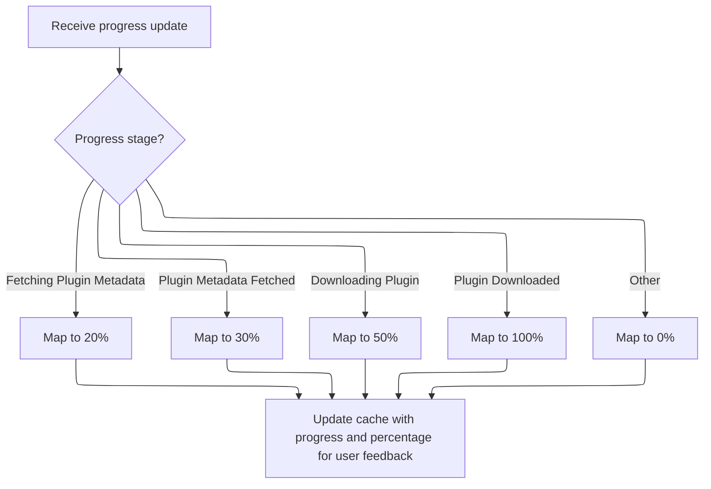

<SwmSnippet path="/app/electron/main.ts" line="228">

---

In <SwmToken path="app/electron/main.ts" pos="228:3:3" line-data="      const updateCache = (progress: ProgressResp) =&gt; {">`updateCache`</SwmToken>, we take the progress object and use <SwmToken path="app/electron/main.ts" pos="229:9:9" line-data="        const percentage = this.convertProgressToPercentage(progress);">`convertProgressToPercentage`</SwmToken> to get a numeric percentage. We then update the cache for the identifier with both the raw progress and the calculated percentage. This lets us track and display progress for plugin updates in a consistent way.

```typescript
      const updateCache = (progress: ProgressResp) => {
        const percentage = this.convertProgressToPercentage(progress);
```

---

</SwmSnippet>

<SwmSnippet path="/app/electron/main.ts" line="203">

---

<SwmToken path="app/electron/main.ts" pos="203:3:3" line-data="  private convertProgressToPercentage(progress: ProgressResp): number {">`convertProgressToPercentage`</SwmToken> just maps specific progress messages to fixed percentage values. If the message isn't recognized, it returns 0. This is a simple way to turn discrete update states into numbers for progress bars.

```typescript
  private convertProgressToPercentage(progress: ProgressResp): number {
    switch (progress.message) {
      case 'Fetching Plugin Metadata':
        return 20;
      case 'Plugin Metadata Fetched':
        return 30;
      case 'Downloading Plugin':
        return 50;
      case 'Plugin Downloaded':
        return 100;
      default:
        return 0;
    }
  }
```

---

</SwmSnippet>

<SwmSnippet path="/app/electron/main.ts" line="230">

---

After <SwmToken path="app/electron/main.ts" pos="203:3:3" line-data="  private convertProgressToPercentage(progress: ProgressResp): number {">`convertProgressToPercentage`</SwmToken>, we update the cache for the identifier with both the raw progress and the percentage. This keeps the cache in sync for UI or other consumers.

```typescript
        this.cache[identifier].progress = progress;
        this.cache[identifier].percentage = percentage;
      };
```

---

</SwmSnippet>

### Triggering Plugin Update Logic

<SwmSnippet path="/app/electron/main.ts" line="383">

---

After updating the cache, we call <SwmToken path="app/electron/main.ts" pos="383:1:3" line-data="    PluginManager.update(">`PluginManager.update`</SwmToken> to start the actual plugin update process. The progress callback keeps the cache in sync as the update progresses, and <SwmToken path="app/electron/main.ts" pos="390:1:3" line-data="      controller.signal">`controller.signal`</SwmToken> lets us abort if needed. Next, we move to <SwmPath>[app/electron/plugin-management.ts](app/electron/plugin-management.ts)</SwmPath> where the update logic is implemented.

```typescript
    PluginManager.update(
      pluginName,
      destinationFolder,
      headlampVersion,
      progress => {
        updateCache(progress);
      },
      controller.signal
    );
  }
```

---

</SwmSnippet>

## Validating and Starting Plugin Update

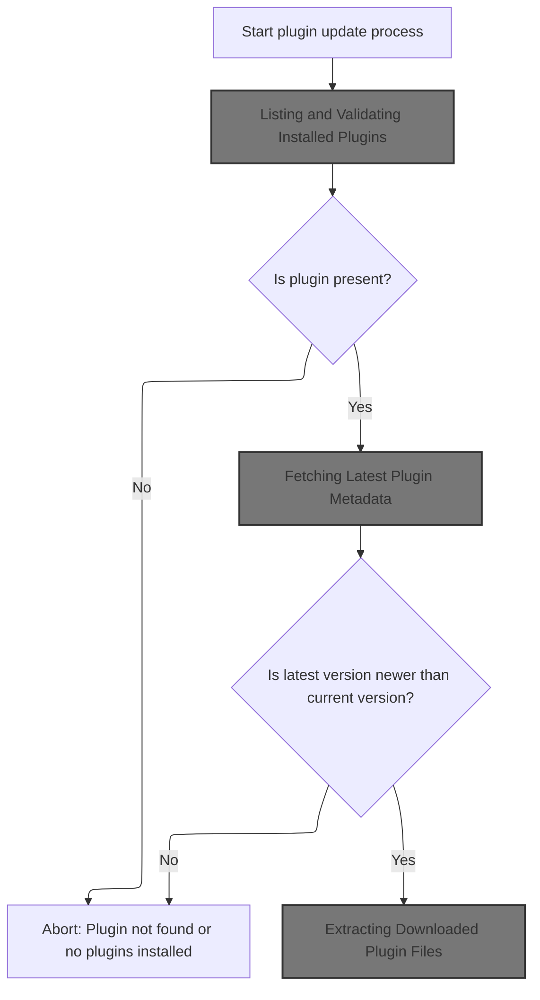

<SwmSnippet path="/app/electron/plugin-management.ts" line="239">

---

In <SwmToken path="app/electron/main.ts" pos="383:1:3" line-data="    PluginManager.update(">`PluginManager.update`</SwmToken>, we start by listing installed plugins in the destination folder. If none are found, we throw an error. This step is needed to locate and validate the plugin before any update happens.

```typescript
  static async update(
    pluginName: string,
    destinationFolder: string = defaultUserPluginsDir(),
    headlampVersion: string = '',
    progressCallback: null | ProgressCallback = null,
    signal: AbortSignal | null = null
  ): Promise<void> {
    try {
      // @todo: should list call take progressCallback?
      const installedPlugins = PluginManager.list(destinationFolder);
      if (!installedPlugins) {
        throw new Error('InstalledPlugins not found');
      }
```

---

</SwmSnippet>

### Listing and Validating Installed Plugins

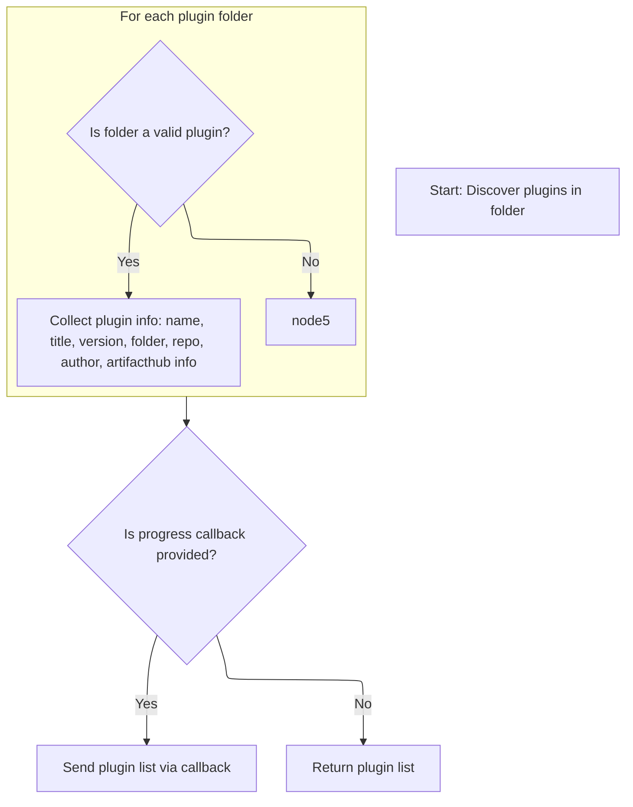

<SwmSnippet path="/app/electron/plugin-management.ts" line="357">

---

We filter and validate plugin folders, then extract metadata from <SwmPath>[package.json](package.json)</SwmPath> for each valid plugin.

```typescript
  static list(folder = defaultPluginsDir(), progressCallback: null | ProgressCallback = null) {
    try {
      const pluginsData: PluginData[] = [];

      // Read all entries in the specified folder
      const entries = fs.readdirSync(folder, { withFileTypes: true });

      // Filter out directories (plugins)
      const pluginFolders = entries.filter(entry => entry.isDirectory());

      // Iterate through each plugin folder
      for (const pluginFolder of pluginFolders) {
        const pluginDir = path.join(folder, pluginFolder.name);

        if (checkValidPluginFolder(pluginDir)) {
```

---

</SwmSnippet>

<SwmSnippet path="/app/electron/plugin-management.ts" line="993">

---

<SwmToken path="app/electron/plugin-management.ts" pos="993:2:2" line-data="function checkValidPluginFolder(folder: string): boolean {">`checkValidPluginFolder`</SwmToken> checks for <SwmPath>[plugins/…/.storybook/main.js](plugins/headlamp-plugin/config/.storybook/main.js)</SwmPath> and <SwmPath>[package.json](package.json)</SwmPath>, then looks for <SwmToken path="app/electron/plugin-management.ts" pos="1003:6:6" line-data="  if (packageJSON.isManagedByHeadlampPlugin) {">`isManagedByHeadlampPlugin`</SwmToken> in <SwmPath>[package.json](package.json)</SwmPath>. Only folders with this marker are considered valid Headlamp plugins.

```typescript
function checkValidPluginFolder(folder: string): boolean {
  if (!fs.existsSync(folder)) {
    return false;
  }
  const mainJsPath = path.join(folder, 'main.js');
  const packageJsonPath = path.join(folder, 'package.json');
  if (!fs.existsSync(mainJsPath) || !fs.existsSync(packageJsonPath)) {
    return false;
  }
  const packageJSON = JSON.parse(fs.readFileSync(packageJsonPath, 'utf8'));
  if (packageJSON.isManagedByHeadlampPlugin) {
    return true;
  }
  return false;
}
```

---

</SwmSnippet>

<SwmSnippet path="/app/electron/plugin-management.ts" line="372">

---

After validating plugin folders, we extract metadata fields from <SwmPath>[package.json](package.json)</SwmPath> and build up the <SwmToken path="app/electron/plugin-management.ts" pos="385:1:1" line-data="          pluginsData.push({">`pluginsData`</SwmToken> array. If a progress callback is provided, we call it with the result. This prepares the plugin info for the next step in <SwmPath>[plugins/…/bin/pluginctl.js](plugins/pluginctl/bin/pluginctl.js)</SwmPath>, where it's formatted and displayed.

```typescript
          // Read package.json to get the plugin name and version
          const packageJsonPath = path.join(pluginDir, 'package.json');
          const packageJson = JSON.parse(fs.readFileSync(packageJsonPath, 'utf8'));
          const pluginName = packageJson.name || pluginFolder.name;
          const pluginTitle = packageJson.artifacthub.title;
          const pluginVersion = packageJson.version || null;
          const artifacthubURL = packageJson.artifacthub ? packageJson.artifacthub.url : null;
          const repoName = packageJson.artifacthub ? packageJson.artifacthub.repoName : null;
          const author = packageJson.artifacthub ? packageJson.artifacthub.author : null;
          const artifacthubVersion = packageJson.artifacthub
            ? packageJson.artifacthub.version
            : null;
          // Store plugin data (folder name and plugin name)
          pluginsData.push({
            pluginName,
            pluginTitle,
            pluginVersion,
            folderName: pluginFolder.name,
            artifacthubURL: artifacthubURL,
            repoName: repoName,
            author: author,
            artifacthubVersion: artifacthubVersion,
          });
        }
      }

      if (progressCallback) {
        progressCallback({ type: 'success', message: 'Plugins Listed', data: pluginsData });
      } else {
        return pluginsData;
      }
    } catch (e) {
      if (progressCallback) {
        progressCallback({ type: 'error', message: e instanceof Error ? e.message : String(e) });
      } else {
        throw e;
      }
    }
  }
```

---

</SwmSnippet>

<SwmSnippet path="/plugins/pluginctl/bin/pluginctl.js" line="606">

---

<SwmToken path="plugins/pluginctl/bin/pluginctl.js" pos="606:3:3" line-data="      const progressCallback = (data) =&gt; {">`progressCallback`</SwmToken> in <SwmPath>[plugins/…/bin/pluginctl.js](plugins/pluginctl/bin/pluginctl.js)</SwmPath> formats plugin metadata either as JSON or as a table, depending on the json flag. It assumes each plugin object has the expected fields and builds the output accordingly.

```javascript
      const progressCallback = (data) => {
        if (json) {
          console.log(JSON.stringify(data.data));
        } else {
          // display table
          const rows = [["Name", "Version", "Folder Name", "Repo", "Author"]];
          data.data.forEach((plugin) => {
            rows.push([
              plugin.pluginName,
              plugin.pluginVersion,
              plugin.folderName,
              plugin.repoName,
              plugin.author,
            ]);
          });
          console.log(table(rows));
        }
      };
```

---

</SwmSnippet>

### Checking for Plugin Updates

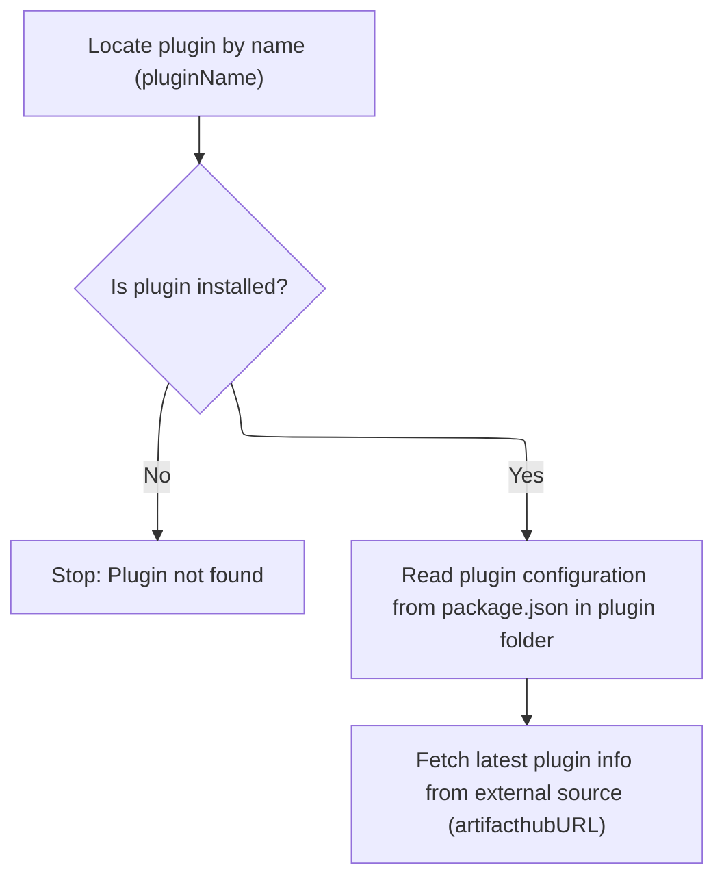

<SwmSnippet path="/app/electron/plugin-management.ts" line="252">

---

After listing plugins, we find the one to update by name, read its <SwmPath>[package.json](package.json)</SwmPath> for current metadata, and call <SwmToken path="app/electron/plugin-management.ts" pos="262:9:9" line-data="      const pluginData = await fetchPluginInfo(plugin.artifacthubURL, progressCallback, signal);">`fetchPluginInfo`</SwmToken> to get the latest info. This sets up the next step in the update process.

```typescript
      const plugin = installedPlugins.find(p => p.pluginName === pluginName);
      if (!plugin) {
        throw new Error('Plugin not found');
      }

      const pluginDir = path.join(destinationFolder, plugin.folderName);
      // read the package.json of the plugin
      const packageJsonPath = path.join(pluginDir, 'package.json');
      const packageJson = JSON.parse(fs.readFileSync(packageJsonPath, 'utf8'));

      const pluginData = await fetchPluginInfo(plugin.artifacthubURL, progressCallback, signal);

```

---

</SwmSnippet>

### Fetching Latest Plugin Metadata

See <SwmLink doc-title="Retrieving and Preparing Plugin Metadata">[Retrieving and Preparing Plugin Metadata](/.swm/retrieving-and-preparing-plugin-metadata.j68yntu2.sw.md)</SwmLink>

### Downloading and Extracting Plugin Update

<SwmSnippet path="/app/electron/plugin-management.ts" line="264">

---

After fetching plugin info, we compare versions and only proceed if an update is available. Then we call <SwmToken path="app/electron/plugin-management.ts" pos="272:14:14" line-data="      const [_, tempFolder] = await downloadExtractArchive(">`downloadExtractArchive`</SwmToken> to get the new plugin files. This moves the update process forward.

```typescript
      const latestVersion = pluginData.version;
      const currentVersion = packageJson.artifacthub.version;

      if (semver.lte(latestVersion, currentVersion)) {
        throw new Error('No updates available');
      }

      // eslint-disable-next-line no-unused-vars
      const [_, tempFolder] = await downloadExtractArchive(
        pluginData,
        headlampVersion,
        progressCallback,
        signal
      );

```

---

</SwmSnippet>

### Extracting Downloaded Plugin Files

See <SwmLink doc-title="Plugin Download and Preparation Flow">[Plugin Download and Preparation Flow](/.swm/plugin-download-and-preparation-flow.yoliirsm.sw.md)</SwmLink>

### Finalizing Plugin Update and Reporting Status

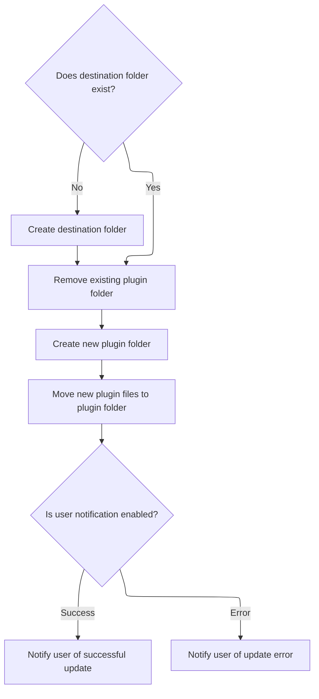

<SwmSnippet path="/app/electron/plugin-management.ts" line="279">

---

After updating the plugin files, we extract all relevant metadata from <SwmPath>[package.json](package.json)</SwmPath> and report the update status via the progress callback. This prepares the data for <SwmPath>[plugins/…/bin/pluginctl.js](plugins/pluginctl/bin/pluginctl.js)</SwmPath>, which will handle display or further integration.

```typescript
      // sleep(2000);  // comment out for testing

      // create the destination folder if it doesn't exist
      if (!fs.existsSync(destinationFolder)) {
        fs.mkdirSync(destinationFolder, { recursive: true });
      }

      // remove the existing plugin folder
      fs.rmdirSync(pluginDir, { recursive: true });

      // create the plugin folder
      fs.mkdirSync(pluginDir, { recursive: true });

      // move the plugin to the destination folder
      moveDirs(tempFolder, pluginDir);
      if (progressCallback) {
        progressCallback({ type: 'success', message: 'Plugin Updated' });
      }
    } catch (e) {
      if (progressCallback) {
        progressCallback({ type: 'error', message: e instanceof Error ? e.message : String(e) });
      } else {
        throw e;
      }
    }
  }
```

---

</SwmSnippet>

## Subscribing to <SwmToken path="frontend/src/lib/k8s/api/v2/useKubeObjectList.ts" pos="203:5:5" line-data="      // Construct WebSocket URL with current parameters">`WebSocket`</SwmToken> Updates

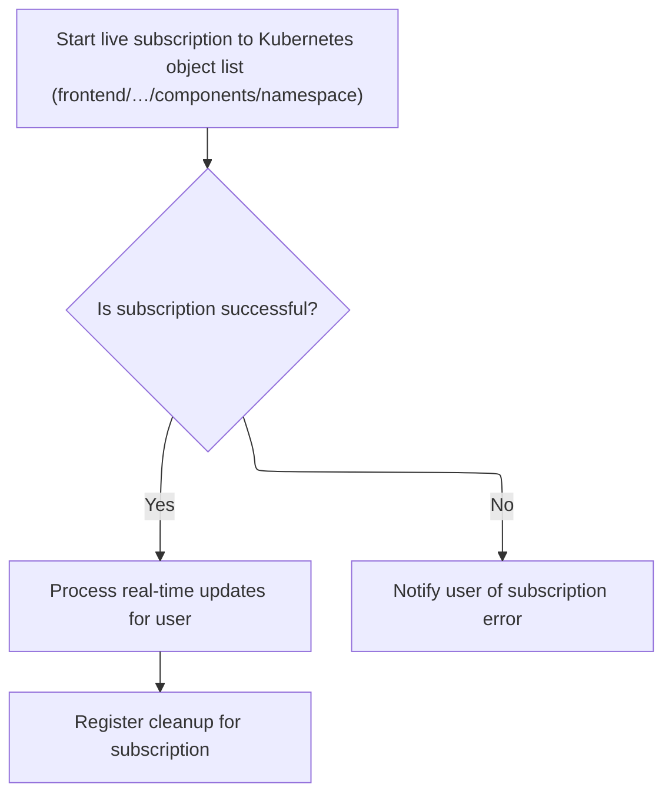

<SwmSnippet path="/frontend/src/lib/k8s/api/v2/useKubeObjectList.ts" line="272">

---

After handling plugin update events, we subscribe to <SwmToken path="frontend/src/lib/k8s/api/v2/useKubeObjectList.ts" pos="203:5:5" line-data="      // Construct WebSocket URL with current parameters">`WebSocket`</SwmToken> updates for each connection in <SwmToken path="frontend/src/lib/k8s/api/v2/useKubeObjectList.ts" pos="170:2:2" line-data="function useWatchKubeObjectListsMultiplexed&lt;K extends KubeObject&gt;({">`useWatchKubeObjectListsMultiplexed`</SwmToken>. We push cleanup functions for each subscription and handle errors or retries as needed. Next, we call <SwmPath>[frontend/…/v2/webSocket.ts](frontend/src/lib/k8s/api/v2/webSocket.ts)</SwmPath> to actually set up the <SwmToken path="frontend/src/lib/k8s/api/v2/useKubeObjectList.ts" pos="203:5:5" line-data="      // Construct WebSocket URL with current parameters">`WebSocket`</SwmToken> connections.

```typescript
      WebSocketManager.subscribe(cluster, parsedUrl.pathname, parsedUrl.search.slice(1), update =>
        handleUpdate(update, cluster, namespace)
      ).then(
        cleanup => cleanups.push(cleanup),
        error => {
```

---

</SwmSnippet>

## Managing <SwmToken path="frontend/src/lib/k8s/api/v2/useKubeObjectList.ts" pos="203:5:5" line-data="      // Construct WebSocket URL with current parameters">`WebSocket`</SwmToken> Subscriptions

<SwmSnippet path="/frontend/src/lib/k8s/api/v2/webSocket.ts" line="215">

---

In <SwmToken path="frontend/src/lib/k8s/api/v2/webSocket.ts" pos="215:3:3" line-data="  async subscribe(">`subscribe`</SwmToken>, we set up a unique key for each subscription, store it in <SwmToken path="frontend/src/lib/k8s/api/v2/webSocket.ts" pos="224:3:3" line-data="    this.activeSubscriptions.set(key, { clusterId, path, query });">`activeSubscriptions`</SwmToken> and listeners, and then call connect to establish the <SwmToken path="frontend/src/lib/k8s/api/v2/useKubeObjectList.ts" pos="203:5:5" line-data="      // Construct WebSocket URL with current parameters">`WebSocket`</SwmToken>. This lets us multiplex updates for different lists.

```typescript
  async subscribe(
    clusterId: string,
    path: string,
    query: string,
    onMessage: (data: any) => void
  ): Promise<() => void> {
    const key = this.createKey(clusterId, path, query);

    // Add to active subscriptions
    this.activeSubscriptions.set(key, { clusterId, path, query });

    // Add message listener
    const listeners = this.listeners.get(key) || new Set();
    listeners.add(onMessage);
    this.listeners.set(key, listeners);

    // Establish connection and send REQUEST
    const socket = await this.connect();
```

---

</SwmSnippet>

### Establishing <SwmToken path="frontend/src/lib/k8s/api/v2/useKubeObjectList.ts" pos="203:5:5" line-data="      // Construct WebSocket URL with current parameters">`WebSocket`</SwmToken> Connection

See <SwmLink doc-title="Establishing and Managing WebSocket Connections">[Establishing and Managing WebSocket Connections](/.swm/establishing-and-managing-websocket-connections.8w0nieh9.sw.md)</SwmLink>

### Preparing <SwmToken path="frontend/src/lib/k8s/api/v2/useKubeObjectList.ts" pos="203:5:5" line-data="      // Construct WebSocket URL with current parameters">`WebSocket`</SwmToken> Request Message

<SwmSnippet path="/frontend/src/lib/k8s/api/v2/webSocket.ts" line="233">

---

After connecting the <SwmToken path="frontend/src/lib/k8s/api/v2/useKubeObjectList.ts" pos="203:5:5" line-data="      // Construct WebSocket URL with current parameters">`WebSocket`</SwmToken> in <SwmPath>[frontend/…/v2/webSocket.ts](frontend/src/lib/k8s/api/v2/webSocket.ts)</SwmPath>, we fetch the <SwmToken path="frontend/src/lib/k8s/api/v2/webSocket.ts" pos="233:3:3" line-data="    const userId = getUserIdFromLocalStorage();">`userId`</SwmToken> from local storage to include in the request message. This is needed for user-specific tracking or authentication.

```typescript
    const userId = getUserIdFromLocalStorage();
```

---

</SwmSnippet>

<SwmSnippet path="/frontend/src/lib/k8s/api/v2/webSocket.ts" line="234">

---

After getting the <SwmToken path="frontend/src/lib/k8s/api/v2/webSocket.ts" pos="238:1:1" line-data="      userId: userId || &#39;&#39;,">`userId`</SwmToken>, we build and send a REQUEST message over the <SwmToken path="frontend/src/lib/k8s/api/v2/useKubeObjectList.ts" pos="203:5:5" line-data="      // Construct WebSocket URL with current parameters">`WebSocket`</SwmToken> with all the needed fields. This kicks off the server-side streaming of updates. Next, <SwmPath>[frontend/…/node/NodeShellTerminal.tsx](frontend/src/components/node/NodeShellTerminal.tsx)</SwmPath> might use this for interactive shell features.

```typescript
    const requestMsg: WebSocketMessage = {
      clusterId,
      path,
      query,
      userId: userId || '',
      type: 'REQUEST',
    };
    socket.send(JSON.stringify(requestMsg));

```

---

</SwmSnippet>

<SwmSnippet path="/frontend/src/lib/k8s/api/v2/webSocket.ts" line="243">

---

After sending the request, we return a cleanup function that unsubscribes from the <SwmToken path="frontend/src/lib/k8s/api/v2/useKubeObjectList.ts" pos="203:5:5" line-data="      // Construct WebSocket URL with current parameters">`WebSocket`</SwmToken> updates. This keeps resource usage in check and avoids leaks.

```typescript
    // Return cleanup function
    return () => this.unsubscribe(key, clusterId, path, query, onMessage);
  },
```

---

</SwmSnippet>

## Cleaning Up <SwmToken path="frontend/src/lib/k8s/api/v2/useKubeObjectList.ts" pos="203:5:5" line-data="      // Construct WebSocket URL with current parameters">`WebSocket`</SwmToken> Subscriptions

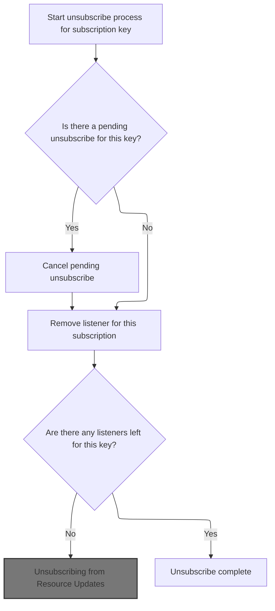

<SwmSnippet path="/frontend/src/lib/k8s/api/v2/webSocket.ts" line="268">

---

In <SwmToken path="frontend/src/lib/k8s/api/v2/webSocket.ts" pos="268:1:1" line-data="  unsubscribe(">`unsubscribe`</SwmToken>, we debounce the cleanup by <SwmToken path="frontend/src/lib/k8s/api/v2/webSocket.ts" pos="311:10:10" line-data="        }, 100); // 100ms debounce">`100ms`</SwmToken> after the last listener is removed. This avoids unnecessary <SwmToken path="frontend/src/lib/k8s/api/v2/webSocket.ts" pos="290:9:9" line-data="        // This prevents unnecessary WebSocket churn when a component quickly unmounts and remounts">`WebSocket`</SwmToken> churn during rapid component changes. We use multiple maps to track state and fully clean up when no listeners remain. Next, we call <SwmPath>[frontend/…/k8s/KubeObject.ts](frontend/src/lib/k8s/KubeObject.ts)</SwmPath> for object-level operations.

```typescript
  unsubscribe(
    key: string,
    clusterId: string,
    path: string,
    query: string,
    onMessage: (data: any) => void
  ): void {
    // Clear any pending unsubscribe for this key
    const pendingTimeout = this.pendingUnsubscribes.get(key);
    if (pendingTimeout) {
      clearTimeout(pendingTimeout);
      this.pendingUnsubscribes.delete(key);
    }

    // Remove the listener
    const listeners = this.listeners.get(key);
    if (listeners) {
      listeners.delete(onMessage);
      if (listeners.size === 0) {
        this.listeners.delete(key);

        // Delay unsubscription to handle rapid re-subscriptions
        // This prevents unnecessary WebSocket churn when a component quickly unmounts and remounts
        // For example: during route changes or component updates in React's strict mode
        const timeout = setTimeout(() => {
          // Only unsubscribe if there are still no listeners
          if (!this.listeners.has(key)) {
            this.activeSubscriptions.delete(key);
            this.completedPaths.delete(key);

```

---

</SwmSnippet>

### Deleting Kubernetes Objects

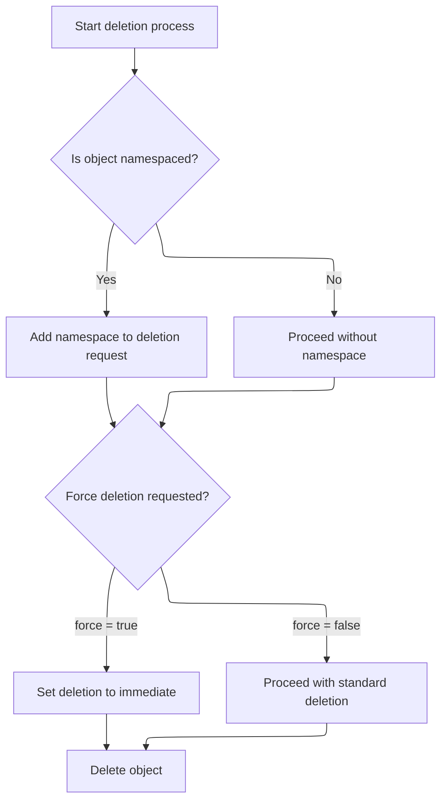

<SwmSnippet path="/frontend/src/lib/k8s/KubeObject.ts" line="450">

---

<SwmToken path="frontend/src/lib/k8s/KubeObject.ts" pos="450:1:1" line-data="  delete(force?: boolean) {">`delete`</SwmToken> builds the argument list for the API call, adds the namespace if needed, and sets <SwmToken path="frontend/src/lib/k8s/KubeObject.ts" pos="459:3:3" line-data="      params.gracePeriodSeconds = 0;">`gracePeriodSeconds`</SwmToken> to 0 if force is true. Then it calls the API endpoint's delete method to remove the object. Next, we go to <SwmPath>[frontend/…/v1/factories.ts](frontend/src/lib/k8s/api/v1/factories.ts)</SwmPath> for the actual API implementation.

```typescript
  delete(force?: boolean) {
    const args: string[] = [this.getName()];
    if (this.isNamespaced) {
      args.unshift(this.getNamespace()!);
    }
    const params: DeleteParameters = {};

    console.log(force);
    if (force) {
      params.gracePeriodSeconds = 0;
      console.log(params);
    }

    // @ts-ignore
    return this._class().apiEndpoint.delete(...args, params, this._clusterName);
  }
```

---

</SwmSnippet>

### Building and Issuing the Delete Request

<SwmSnippet path="/frontend/src/lib/k8s/api/v1/factories.ts" line="379">

---

In <SwmToken path="frontend/src/lib/k8s/api/v1/factories.ts" pos="379:1:1" line-data="    delete: (name, deleteParams, cluster) =&gt;">`delete`</SwmToken>, we build the full delete URL by appending the resource name and any query parameters (using <SwmToken path="frontend/src/lib/k8s/api/v1/factories.ts" pos="380:15:15" line-data="      remove(`${url}/${name}` + asQuery(deleteParams), { cluster }),">`asQuery`</SwmToken>) before making the remove call. This lets us pass options like force deletion or custom grace periods. We need to call formatUrl/asQuery next to turn the <SwmToken path="frontend/src/lib/k8s/api/v1/factories.ts" pos="379:8:8" line-data="    delete: (name, deleteParams, cluster) =&gt;">`deleteParams`</SwmToken> object into a proper query string for the URL.

```typescript
    delete: (name, deleteParams, cluster) =>
      remove(`${url}/${name}` + asQuery(deleteParams), { cluster }),
```

---

</SwmSnippet>

<SwmSnippet path="/frontend/src/lib/k8s/api/v1/formatUrl.ts" line="51">

---

<SwmToken path="frontend/src/lib/k8s/api/v1/formatUrl.ts" pos="51:4:4" line-data="export function asQuery(queryParams?: QueryParameters): string {">`asQuery`</SwmToken> takes care of converting <SwmToken path="frontend/src/lib/k8s/api/v1/formatUrl.ts" pos="51:6:6" line-data="export function asQuery(queryParams?: QueryParameters): string {">`queryParams`</SwmToken> into a query string for the URL. It makes sure 'limit' is always a string if present, skips it if it's not a string or number, and returns an empty string if there are no params. This avoids issues with the API expecting certain types and keeps the URL clean.

```typescript
export function asQuery(queryParams?: QueryParameters): string {
  if (queryParams === undefined) {
    return '';
  }

  let newQueryParams;
  if (typeof queryParams.limit === 'number' || typeof queryParams.limit === 'string') {
    newQueryParams = {
      ...queryParams,
      limit:
        typeof queryParams.limit === 'number' ? queryParams.limit.toString() : queryParams.limit,
    };
  } else {
    newQueryParams = { ...omit(queryParams, 'limit') };
  }

  return !!newQueryParams && !!Object.keys(newQueryParams).length
    ? '?' + new URLSearchParams(newQueryParams).toString()
    : '';
}
```

---

</SwmSnippet>

<SwmSnippet path="/frontend/src/lib/k8s/api/v1/factories.ts" line="380">

---

We just got the query string from <SwmToken path="frontend/src/lib/k8s/api/v1/factories.ts" pos="380:15:15" line-data="      remove(`${url}/${name}` + asQuery(deleteParams), { cluster }),">`asQuery`</SwmToken>, so now the <SwmPath>[frontend/…/v1/factories.ts](frontend/src/lib/k8s/api/v1/factories.ts)</SwmPath> delete function calls remove with the full URL and cluster info. Next, we need <SwmPath>[frontend/…/v1/clusterRequests.ts](frontend/src/lib/k8s/api/v1/clusterRequests.ts)</SwmPath> because remove handles the actual HTTP DELETE and cluster-specific logic.

```typescript
      remove(`${url}/${name}` + asQuery(deleteParams), { cluster }),
```

---

</SwmSnippet>

### Dispatching the Cluster Delete Request

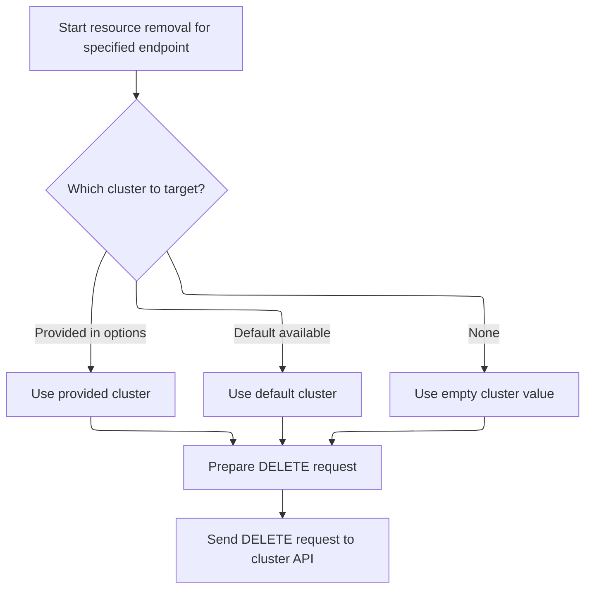

<SwmSnippet path="/frontend/src/lib/k8s/api/v1/clusterRequests.ts" line="283">

---

In <SwmToken path="frontend/src/lib/k8s/api/v1/clusterRequests.ts" pos="283:4:4" line-data="export function remove(url: string, requestOptions: ClusterRequestParams = {}) {">`remove`</SwmToken>, we pull out the cluster name from the options or fall back to <SwmToken path="frontend/src/lib/k8s/api/v1/clusterRequests.ts" pos="286:11:11" line-data="  const cluster = clusterName || getCluster() || &#39;&#39;;">`getCluster`</SwmToken> if it's missing. This makes sure the request is always scoped to a cluster. We need <SwmPath>[frontend/…/lib/cluster.ts](frontend/src/lib/cluster.ts)</SwmPath> next because <SwmToken path="frontend/src/lib/k8s/api/v1/clusterRequests.ts" pos="286:11:11" line-data="  const cluster = clusterName || getCluster() || &#39;&#39;;">`getCluster`</SwmToken> handles picking the right cluster context.

```typescript
export function remove(url: string, requestOptions: ClusterRequestParams = {}) {
  console.log(url, requestOptions);
  const { cluster: clusterName, ...restOptions } = requestOptions;
  const cluster = clusterName || getCluster() || '';
```

---

</SwmSnippet>

<SwmSnippet path="/frontend/src/lib/k8s/api/v1/clusterRequests.ts" line="287">

---

After getting the cluster, <SwmPath>[frontend/…/v1/clusterRequests.ts](frontend/src/lib/k8s/api/v1/clusterRequests.ts)</SwmPath> sets up the DELETE method and headers, then calls <SwmToken path="frontend/src/lib/k8s/api/v1/clusterRequests.ts" pos="288:3:3" line-data="  return clusterRequest(url, opts);">`clusterRequest`</SwmToken> to actually send the HTTP request. This is where the request is dispatched to the cluster API.

```typescript
  const opts = { method: 'DELETE', headers: JSON_HEADERS, cluster, ...restOptions };
  return clusterRequest(url, opts);
}
```

---

</SwmSnippet>

### Unsubscribing from Resource Updates

<SwmSnippet path="/frontend/src/lib/k8s/api/v2/webSocket.ts" line="298">

---

Back in the unsubscribe logic in <SwmPath>[frontend/…/v2/webSocket.ts](frontend/src/lib/k8s/api/v2/webSocket.ts)</SwmPath>, after deleting a resource, we check if the <SwmToken path="frontend/src/lib/k8s/api/v2/webSocket.ts" pos="298:12:12" line-data="            if (this.socketMultiplexer?.readyState === WebSocket.OPEN) {">`WebSocket`</SwmToken> is open and grab the <SwmToken path="frontend/src/lib/k8s/api/v2/webSocket.ts" pos="299:3:3" line-data="              const userId = getUserIdFromLocalStorage();">`userId`</SwmToken> from local storage. We need <SwmToken path="frontend/src/lib/k8s/api/v2/webSocket.ts" pos="299:7:7" line-data="              const userId = getUserIdFromLocalStorage();">`getUserIdFromLocalStorage`</SwmToken> next to fetch that value so we can include it in the close message to the server.

```typescript
            if (this.socketMultiplexer?.readyState === WebSocket.OPEN) {
              const userId = getUserIdFromLocalStorage();
```

---

</SwmSnippet>

<SwmSnippet path="/frontend/src/lib/k8s/api/v2/webSocket.ts" line="300">

---

After getting <SwmToken path="frontend/src/lib/k8s/api/v2/webSocket.ts" pos="304:1:1" line-data="                userId: userId || &#39;&#39;,">`userId`</SwmToken>, <SwmPath>[frontend/…/v2/webSocket.ts](frontend/src/lib/k8s/api/v2/webSocket.ts)</SwmPath> builds the close message with <SwmToken path="frontend/src/lib/k8s/api/v2/webSocket.ts" pos="301:1:1" line-data="                clusterId,">`clusterId`</SwmToken>, path, query, <SwmToken path="frontend/src/lib/k8s/api/v2/webSocket.ts" pos="304:1:1" line-data="                userId: userId || &#39;&#39;,">`userId`</SwmToken>, and type 'CLOSE', then sends it over the socket. Next, <SwmPath>[frontend/…/node/NodeShellTerminal.tsx](frontend/src/components/node/NodeShellTerminal.tsx)</SwmPath> might use this to react to the closed subscription (like cleaning up a shell session).

```typescript
              const closeMsg: WebSocketMessage = {
                clusterId,
                path,
                query,
                userId: userId || '',
                type: 'CLOSE',
              };
              this.socketMultiplexer.send(JSON.stringify(closeMsg));
            }
          }
```

---

</SwmSnippet>

<SwmSnippet path="/frontend/src/lib/k8s/api/v2/webSocket.ts" line="310">

---

After sending the close message, <SwmPath>[frontend/…/v2/webSocket.ts](frontend/src/lib/k8s/api/v2/webSocket.ts)</SwmPath> deletes the <SwmToken path="frontend/src/lib/k8s/api/v2/webSocket.ts" pos="310:3:3" line-data="          this.pendingUnsubscribes.delete(key);">`pendingUnsubscribes`</SwmToken> entry for that key. This keeps the unsubscribe state clean and avoids duplicate unsubscribes. Next, <SwmPath>[frontend/…/k8s/KubeObject.ts](frontend/src/lib/k8s/KubeObject.ts)</SwmPath> might need to know the subscription is gone to update its own state.

```typescript
          this.pendingUnsubscribes.delete(key);
```

---

</SwmSnippet>

<SwmSnippet path="/frontend/src/lib/k8s/api/v2/webSocket.ts" line="311">

---

After <SwmPath>[frontend/…/k8s/KubeObject.ts](frontend/src/lib/k8s/KubeObject.ts)</SwmPath>, the unsubscribe logic in <SwmPath>[frontend/…/v2/webSocket.ts](frontend/src/lib/k8s/api/v2/webSocket.ts)</SwmPath> waits <SwmToken path="frontend/src/lib/k8s/api/v2/webSocket.ts" pos="311:10:10" line-data="        }, 100); // 100ms debounce">`100ms`</SwmToken> before sending the close message and cleaning up all the maps for that key. This debounce helps avoid flapping connections when components mount/unmount quickly. All state is tracked by key across listeners, <SwmToken path="frontend/src/lib/k8s/api/v2/webSocket.ts" pos="224:3:3" line-data="    this.activeSubscriptions.set(key, { clusterId, path, query });">`activeSubscriptions`</SwmToken>, <SwmToken path="frontend/src/lib/k8s/api/v2/webSocket.ts" pos="296:3:3" line-data="            this.completedPaths.delete(key);">`completedPaths`</SwmToken>, and <SwmToken path="frontend/src/lib/k8s/api/v2/webSocket.ts" pos="313:3:3" line-data="        this.pendingUnsubscribes.set(key, timeout);">`pendingUnsubscribes`</SwmToken>.

```typescript
        }, 100); // 100ms debounce

        this.pendingUnsubscribes.set(key, timeout);
      }
    }
  },
```

---

</SwmSnippet>

## Managing Multiplexed Watch Subscriptions

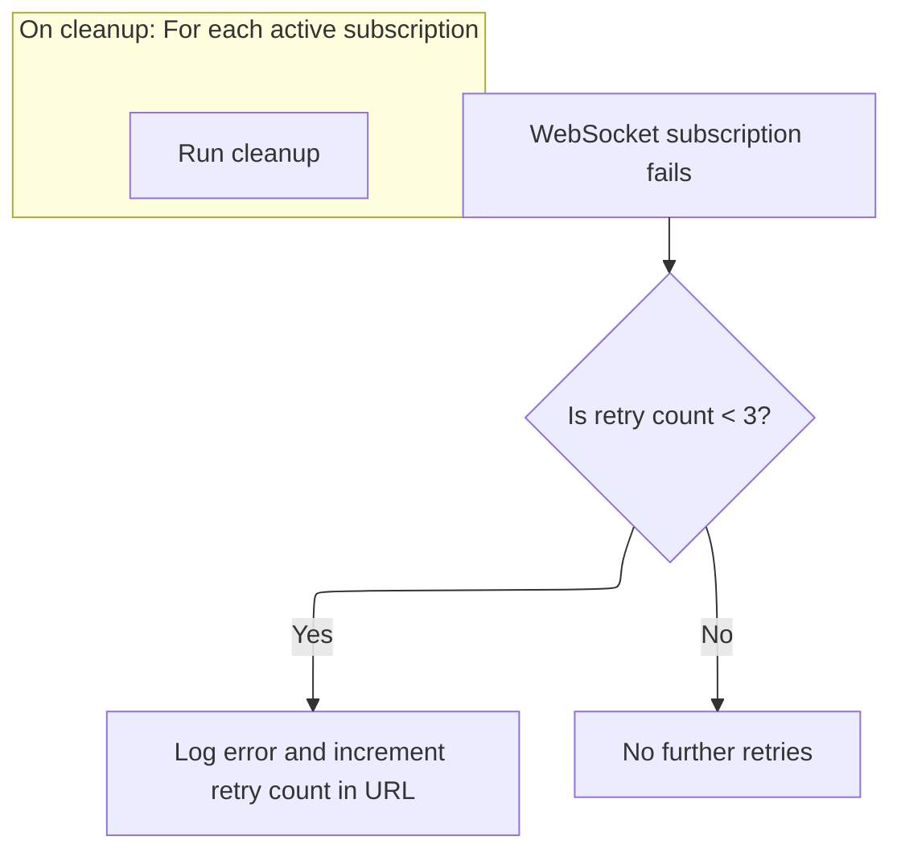

<SwmSnippet path="/frontend/src/lib/k8s/api/v2/useKubeObjectList.ts" line="277">

---

After <SwmPath>[frontend/…/v2/webSocket.ts](frontend/src/lib/k8s/api/v2/webSocket.ts)</SwmPath>, <SwmToken path="frontend/src/lib/k8s/api/v2/useKubeObjectList.ts" pos="170:2:2" line-data="function useWatchKubeObjectListsMultiplexed&lt;K extends KubeObject&gt;({">`useWatchKubeObjectListsMultiplexed`</SwmToken> sets up <SwmToken path="frontend/src/lib/k8s/api/v2/useKubeObjectList.ts" pos="281:6:6" line-data="            console.error(&#39;WebSocket subscription failed:&#39;, error);">`WebSocket`</SwmToken> subscriptions for each connection with <SwmToken path="frontend/src/lib/k8s/api/v2/useKubeObjectList.ts" pos="260:1:1" line-data="  useEffect(() =&gt; {">`useEffect`</SwmToken>. It tracks retries (up to 3) in the URL params and registers cleanup for each subscription. This keeps the watch connections stable and cleans up when the component unmounts or dependencies change. All the repo-specific types and Kubernetes watch details are handled here.

```typescript
          // Track retry count in the URL's searchParams
          const retryCount = parseInt(parsedUrl.searchParams.get('retryCount') || '0');
          if (retryCount < 3) {
            // Only log and allow retry if under threshold
            console.error('WebSocket subscription failed:', error);
            parsedUrl.searchParams.set('retryCount', (retryCount + 1).toString());
          }
        }
      );
    });

    // Cleanup subscriptions when effect re-runs or unmounts
    return () => {
      cleanups.forEach(cleanup => cleanup());
    };
  }, [connections, endpoint, handleUpdate]);
}
```

---

</SwmSnippet>

&nbsp;

*This is an auto-generated document by Swimm 🌊 and has not yet been verified by a human*

<SwmMeta version="3.0.0" repo-id="Z2l0aHViJTNBJTNBdHlwZXNjcmlwdC1oZWFkbGFtcCUzQSUzQXJpY2FyZG9sb3Blemc=" repo-name="typescript-headlamp"><sup>Powered by [Swimm](https://app.swimm.io/)</sup></SwmMeta>
