This document describes how plugins are dynamically loaded, filtered, and executed, with translation contexts set up for user-facing features. The flow receives a list of available plugins and their settings, loads only those that are compatible and enabled, and prepares them for use. Translations are initialized for loaded plugins, and language changes are synchronized across all plugins. After execution, post-run hooks allow the application to update based on the loaded plugins.

# Where is this flow used?

This flow is used multiple times in the codebase as represented in the following diagram:

```mermaid
graph TD;
      f7a6349a81ef1dce9b8a15c41f260aaf3dc633d2dedf72720df4061f57e6d298(frontend/…/plugin/Plugins.tsx::Plugins) --> 124025fb552d72f9a47f1eedd3108c2e87b56b9bf26ad31da7bee1015b1af166(frontend/…/plugin/index.ts::fetchAndExecutePlugins):::mainFlowStyle

20c123397098722f1dcb9052c588529a45cdcc78eb4dff8d7435c4e8a107be17(frontend/…/plugin/Plugins.tsx::action) --> 124025fb552d72f9a47f1eedd3108c2e87b56b9bf26ad31da7bee1015b1af166(frontend/…/plugin/index.ts::fetchAndExecutePlugins):::mainFlowStyle


classDef mainFlowStyle color:#000000,fill:#7CB9F4
classDef rootsStyle color:#000000,fill:#00FFF4
classDef Style1 color:#000000,fill:#00FFAA
classDef Style2 color:#000000,fill:#FFFF00
classDef Style3 color:#000000,fill:#AA7CB9

%% Swimm:
%% graph TD;
%%       f7a6349a81ef1dce9b8a15c41f260aaf3dc633d2dedf72720df4061f57e6d298(<SwmPath>[frontend/…/plugin/Plugins.tsx](frontend/src/plugin/Plugins.tsx)</SwmPath>::Plugins) --> 124025fb552d72f9a47f1eedd3108c2e87b56b9bf26ad31da7bee1015b1af166(<SwmPath>[frontend/…/plugin/index.ts](frontend/src/plugin/index.ts)</SwmPath>::<SwmToken path="frontend/src/plugin/index.ts" pos="430:6:6" line-data="export async function fetchAndExecutePlugins(">`fetchAndExecutePlugins`</SwmToken>):::mainFlowStyle
%% 
%% 20c123397098722f1dcb9052c588529a45cdcc78eb4dff8d7435c4e8a107be17(<SwmPath>[frontend/…/plugin/Plugins.tsx](frontend/src/plugin/Plugins.tsx)</SwmPath>::action) --> 124025fb552d72f9a47f1eedd3108c2e87b56b9bf26ad31da7bee1015b1af166(<SwmPath>[frontend/…/plugin/index.ts](frontend/src/plugin/index.ts)</SwmPath>::<SwmToken path="frontend/src/plugin/index.ts" pos="430:6:6" line-data="export async function fetchAndExecutePlugins(">`fetchAndExecutePlugins`</SwmToken>):::mainFlowStyle
%% 
%% 
%% classDef mainFlowStyle color:#000000,fill:#7CB9F4
%% classDef rootsStyle color:#000000,fill:#00FFF4
%% classDef Style1 color:#000000,fill:#00FFAA
%% classDef Style2 color:#000000,fill:#FFFF00
%% classDef Style3 color:#000000,fill:#AA7CB9
```



# Loading, Filtering, and Preparing Plugins

<SwmSnippet path="/frontend/src/plugin/index.ts" line="430">

---

In <SwmToken path="frontend/src/plugin/index.ts" pos="430:6:6" line-data="export async function fetchAndExecutePlugins(">`fetchAndExecutePlugins`</SwmToken>, we kick off by fetching plugin metadata, source code, and package info, then update plugin settings with version and compatibility info. We filter plugins based on compatibility, enabled status, and priority, then prep execution contexts with permission secrets and internal APIs. Plugins are sorted so those needing arguments run first, then executed. We call <SwmToken path="frontend/src/plugin/index.ts" pos="662:3:3" line-data="  await initializePluginsI18n(packageInfos, pluginPaths);">`initializePluginsI18n`</SwmToken> next to set up translations for only the plugins that actually got loaded, making sure <SwmToken path="frontend/src/plugin/index.ts" pos="661:7:7" line-data="  // Initialize plugin i18n after plugins are loaded">`i18n`</SwmToken> is only initialized for relevant plugins.

```typescript
export async function fetchAndExecutePlugins(
  settingsPackages: PluginInfo[],
  onSettingsChange: (plugins: PluginInfo[]) => void,
  onIncompatible: (plugins: Record<string, PluginInfo>) => void
) {
  const permissionSecretsPromise = permissionSecretsFromApp();

  const headers = addBackstageAuthHeaders();

  // Backend now returns plugin metadata with path, type, and name
  interface PluginMetadata {
    path: string;
    type: 'development' | 'user' | 'shipped';
    name: string;
  }

  const pluginMetadataList = (await fetchWithRetry(`${getAppUrl()}plugins`, headers).then(resp =>
    resp.json()
  )) as PluginMetadata[];

  // Extract paths for fetching plugin files
  const pluginPaths = pluginMetadataList.map(metadata => metadata.path);

  const sourcesPromise = Promise.all(
    pluginPaths.map(path =>
      fetch(`${getAppUrl()}${path}/main.js`, { headers: new Headers(headers) }).then(resp =>
        resp.text()
      )
    )
  );

  const packageInfosPromise = await Promise.all<PluginInfo>(
    pluginPaths.map((path, index) =>
      fetch(`${getAppUrl()}${path}/package.json`, { headers: new Headers(headers) }).then(resp => {
        if (!resp.ok) {
          if (resp.status !== 404) {
            return Promise.reject(resp);
          }
          {
            console.warn(
              'Missing package.json. ' +
                `Please upgrade the plugin ${path}` +
                ' by running "headlamp-plugin extract" again.' +
                ' Please use headlamp-plugin >= 0.8.0'
            );
            return {
              name: path.split('/').slice(-1)[0],
              version: '0.0.0',
              author: 'unknown',
              description: '',
              type: pluginMetadataList[index].type,
              folderName: pluginMetadataList[index].name,
            };
          }
        }
        return resp.json().then(json => ({
          ...json,
          type: pluginMetadataList[index].type,
          folderName: pluginMetadataList[index].name,
        }));
      })
    )
  );

  const sources = await sourcesPromise;
  const packageInfos = await packageInfosPromise;
  const permissionSecrets = await permissionSecretsPromise;

  // Update settings to include all plugin versions (by name + type)
  let updatedSettingsPackages = updateSettingsPackages(packageInfos, settingsPackages);

  // Apply priority-based loading logic
  updatedSettingsPackages = applyPluginPriority(updatedSettingsPackages);

  // Notify settings of changes
  onSettingsChange(updatedSettingsPackages);

  // Can set this to a semver version range like '>=0.8.0-alpha.3'.
  // '' means all versions.
  const compatibleHeadlampPluginVersion = '>=0.8.0-alpha.3';

  // Mark incompatible plugins
  const incompatiblePlugins: Record<string, PluginInfo> = {};
  updatedSettingsPackages = updatedSettingsPackages.map(plugin => {
    const isCompatible = semver.satisfies(
      semver.coerce(plugin.devDependencies?.['@kinvolk/headlamp-plugin']) || '',
      compatibleHeadlampPluginVersion
    );

    if (!isCompatible) {
      incompatiblePlugins[`${plugin.name}@${plugin.type}`] = plugin;
    }

    return {
      ...plugin,
      isCompatible,
    };
  });

  if (Object.keys(incompatiblePlugins).length > 0) {
    onIncompatible(incompatiblePlugins);
  }

  // Update settings with compatibility info
  onSettingsChange(updatedSettingsPackages);

  // Filter to only execute plugins that should be loaded
  // A plugin is executed if:
  // 1. It's marked as isLoaded=true (highest priority enabled version)
  // 2. It's compatible with this version of Headlamp
  // 3. In app mode, it must be enabled
  const pluginsToExecute = updatedSettingsPackages.filter(plugin => {
    // Must be marked as the version to load
    if (!plugin.isLoaded) {
      return false;
    }

    // Must be compatible
    if (!plugin.isCompatible) {
      return false;
    }

    // In app mode, must be enabled
    if (isElectron() && plugin.isEnabled === false) {
      return false;
    }

    return true;
  });

  // Get indices of plugins to execute for matching with sources
  const indicesToExecute = pluginsToExecute.map(plugin =>
    packageInfos.findIndex(p => p.name === plugin.name && p.type === plugin.type)
  );

  const sourcesToExecute = indicesToExecute.map(index => sources[index]);
  const pluginPathsToExecute = indicesToExecute.map(index => pluginPaths[index]);
  const packageInfosToExecute = indicesToExecute.map(index => packageInfos[index]);

  // Save references to the pluginRunCommand and desktopApiSend/Receive.
  // Plugins can use without worrying about modified global window.desktopApi.
  // This is to prevent plugins from snooping on the permission secrets.
  const pluginDesktopApiSend = window?.desktopApi?.send;
  const pluginDesktopApiReceive = window?.desktopApi?.receive;
  const internalRunCommand = runCommand;
  const PrivateFunction = Function;
  const internalRunPlugin = runPlugin;
  const isDevelopmentMode = process.env.NODE_ENV === 'development';
  const consoleError = console.error;

  const pluginsLoaded = updatedSettingsPackages
    .filter(plugin => plugin.isLoaded)
    .map(plugin => ({
      name: plugin.name,
      version: plugin.version,
      isEnabled: plugin.isEnabled,
      type: plugin.type,
    }));

  const infoForRunningPlugins = sourcesToExecute
    .map((source, index) => {
      return getInfoForRunningPlugins({
        source,
        pluginPath: pluginPathsToExecute[index],
        packageName: packageInfosToExecute[index].name,
        packageVersion: packageInfosToExecute[index].version || '',
        permissionSecrets,
        handleError: handlePluginRunError,
        getAllowedPermissions: (pluginName, pluginPath, secrets): Record<string, number> => {
          const secretsToReturn: Record<string, number> = {};
          const isPackage = identifyPackages(pluginPath, pluginName, isDevelopmentMode);
          if (isPackage['@headlamp-k8s/minikube']) {
            secretsToReturn['runCmd-minikube'] = secrets['runCmd-minikube'];
            if (isDevelopmentMode) {
              secretsToReturn['runCmd-scriptjs-minikube/manage-minikube.js'] =
                secrets['runCmd-scriptjs-minikube/manage-minikube.js'];
            }
            secretsToReturn['runCmd-scriptjs-headlamp_minikube/manage-minikube.js'] =
              secrets['runCmd-scriptjs-headlamp_minikube/manage-minikube.js'];
            secretsToReturn['runCmd-scriptjs-headlamp_minikubeprerelease/manage-minikube.js'] =
              secrets['runCmd-scriptjs-headlamp_minikubeprerelease/manage-minikube.js'];
          }

          return secretsToReturn;
        },
        getArgValues: (pluginName, pluginPath, allowedPermissions) => {
          // allowedPermissions is the return value of getAllowedPermissions
          const isPackage = identifyPackages(pluginPath, pluginName, isDevelopmentMode);
          if (isPackage['@headlamp-k8s/minikube']) {
            // We construct a pluginRunCommand that has private
            //  - permission secrets
            //  - stored desktopApiSend and desktopApiReceive functions that can't be modified
            function pluginRunCommand(
              command: 'minikube' | 'az' | 'scriptjs',
              args: string[],
              options: {}
            ): ReturnType<typeof internalRunCommand> {
              return internalRunCommand(
                command,
                args,
                options,
                allowedPermissions,
                pluginDesktopApiSend,
                pluginDesktopApiReceive
              );
            }
            return [
              ['pluginRunCommand', 'pluginPath'],
              [pluginRunCommand, pluginPath],
            ];
          }
          return [[], []];
        },
        PrivateFunction,
        internalRunPlugin,
        consoleError,
      });
    })
    .filter(info => info !== undefined);

  // put the ones with args and values at the start
  infoForRunningPlugins.sort((a, b) => {
    const aHasArgs = a[5].length > 0 && a[6].length > 0;
    const bHasArgs = b[5].length > 0 && b[6].length > 0;
    if (aHasArgs && !bHasArgs) return -1;
    if (!aHasArgs && bHasArgs) return 1;
    return 0;
  });

  infoForRunningPlugins.forEach(runPluginInner);

  // Initialize plugin i18n after plugins are loaded
  await initializePluginsI18n(packageInfos, pluginPaths);

```

---

</SwmSnippet>

## Batch Initializing Plugin Translations

<SwmSnippet path="/frontend/src/plugin/index.ts" line="670">

---

In <SwmToken path="frontend/src/plugin/index.ts" pos="670:4:4" line-data="async function initializePluginsI18n(packageInfos: PluginInfo[], pluginPaths: string[]) {">`initializePluginsI18n`</SwmToken>, we loop through each plugin's package info and path (assuming both arrays are aligned), and call <SwmToken path="frontend/src/plugin/index.ts" pos="675:3:3" line-data="    await initializePluginI18n(packageInfo.name, packageInfo, pluginPath);">`initializePluginI18n`</SwmToken> for each. This hands off the actual translation setup to the next function, which expects to get the right info for each plugin.

```typescript
async function initializePluginsI18n(packageInfos: PluginInfo[], pluginPaths: string[]) {
  for (let i = 0; i < packageInfos.length; i++) {
    const packageInfo = packageInfos[i];
    const pluginPath = pluginPaths[i];

    await initializePluginI18n(packageInfo.name, packageInfo, pluginPath);
  }

```

---

</SwmSnippet>

### Setting Up Individual Plugin Translation Context


<SwmSnippet path="/frontend/src/plugin/pluginI18n.ts" line="322">

---

<SwmToken path="frontend/src/plugin/pluginI18n.ts" pos="322:6:6" line-data="export async function initializePluginI18n(">`initializePluginI18n`</SwmToken> sets up the translation context for a single plugin. It records the plugin's path, checks for path collisions, figures out which locales are supported from the package info, and if <SwmToken path="frontend/src/plugin/pluginI18n.ts" pos="344:11:11" line-data="  // Check if plugin has i18n enabled in package.json (array of supported locales)">`i18n`</SwmToken> is enabled, it stores the supported locales and kicks off async loading of translations via <SwmToken path="frontend/src/plugin/pluginI18n.ts" pos="364:3:3" line-data="      await getPluginI18nInstance(pluginName, pluginPath, supportedLocales);">`getPluginI18nInstance`</SwmToken>.

```typescript
export async function initializePluginI18n(
  pluginName: string,
  packageInfo: PluginPackageInfo,
  pluginPath: string
) {
  // Store the plugin path for later use by useTranslation hook
  pluginPaths[pluginName] = pluginPath;

  // Detect duplicate pluginPath mappings: if another plugin name already
  // points to the same path, warn because translations may be loaded from
  // the wrong folder and cause cross-plugin leaks.
  const duplicates = Object.keys(pluginPaths).filter(
    name => name !== pluginName && pluginPaths[name] === pluginPath
  );
  if (duplicates.length > 0) {
    console.warn(
      `Plugin path collision: ${pluginName} and ${duplicates.join(
        ', '
      )} map to the same path ${pluginPath}`
    );
  }

  // Check if plugin has i18n enabled in package.json (array of supported locales)
  const i18nConfig = packageInfo.headlamp?.i18n;
  let supportedLocales: string[] = [];
  let i18nEnabled = false;

  if (Array.isArray(i18nConfig)) {
    // Array of supported locales
    supportedLocales = i18nConfig;
    i18nEnabled = supportedLocales.length > 0;
  }

  if (i18nEnabled) {
    // Store supported locales for later use
    pluginSupportedLocales[pluginName] = supportedLocales;
    console.log(
      `Initializing i18n for plugin ${pluginName} (supported locales: ${supportedLocales.join(
        ', '
      )})`
    );
    try {
      await getPluginI18nInstance(pluginName, pluginPath, supportedLocales);
    } catch (error) {
      console.error(`Failed to initialize i18n for plugin ${pluginName}:`, error);
    }
  } else {
    console.log(`Plugin ${pluginName} does not have i18n enabled in package.json`);
  }
}
```

---

</SwmSnippet>

### Loading and Caching Plugin Translation Instances


<SwmSnippet path="/frontend/src/plugin/pluginI18n.ts" line="79">

---

In <SwmToken path="frontend/src/plugin/pluginI18n.ts" pos="79:4:4" line-data="async function getPluginI18nInstance(">`getPluginI18nInstance`</SwmToken>, we check if a translation instance for the plugin already exists and return it if so. Otherwise, we create a new <SwmToken path="frontend/src/plugin/pluginI18n.ts" pos="83:5:5" line-data="): Promise&lt;i18n&gt; {">`i18n`</SwmToken> instance, figure out which locales to load (using a default set if none are specified), and load translation files for each locale. All loaded translations are collected into a resources object for initializing the <SwmToken path="frontend/src/plugin/pluginI18n.ts" pos="83:5:5" line-data="): Promise&lt;i18n&gt; {">`i18n`</SwmToken> instance.

```typescript
async function getPluginI18nInstance(
  pluginName: string,
  pluginPath: string,
  supportedLocales?: string[]
): Promise<i18n> {
  if (pluginI18nInstances[pluginName]) {
    return pluginI18nInstances[pluginName];
  }

  const instance = createInstance();

  // Use supported locales from package.json or fall back to common locales
  const locales = supportedLocales || ['en', 'es', 'fr', 'de', 'pt', 'it', 'zh', 'ko', 'ja'];
  const resources: Record<string, Record<string, Record<string, string>>> = {};

  // Load translations for each locale that exists
  for (const locale of locales) {
    const translations = await loadPluginTranslations(pluginPath, locale);
    if (Object.keys(translations).length > 0) {
      resources[locale] = {
        [pluginName]: translations,
      };
    }
  }
```

---

</SwmSnippet>

<SwmSnippet path="/frontend/src/plugin/pluginI18n.ts" line="104">

---

After loading translations for all locales, if English isn't supported and no English translations exist, we add an empty English resource to avoid <SwmToken path="frontend/src/plugin/index.ts" pos="661:7:7" line-data="  // Initialize plugin i18n after plugins are loaded">`i18n`</SwmToken> warnings. Then we initialize the <SwmToken path="frontend/src/plugin/index.ts" pos="661:7:7" line-data="  // Initialize plugin i18n after plugins are loaded">`i18n`</SwmToken> instance with all resources and cache it for future use.

```typescript
  // If English is not in the supported locales but is the fallback language,
  // provide an empty English resource to prevent warnings when no English
  // translation file exists. This allows plugins to use their default strings
  // (which may already be in English) without requiring explicit English translations.
  const hasEnglishTranslations = resources['en'] !== undefined;
  const supportsEnglish = supportedLocales?.includes('en') ?? true;

  if (!hasEnglishTranslations && !supportsEnglish) {
    // Provide empty English translations to prevent i18next warnings
    // This allows the plugin to fall back to its original string keys
    resources['en'] = {
      [pluginName]: {},
    };
  }

  await instance.init({
    lng: i18next.language || 'en',
    fallbackLng: 'en',
    defaultNS: pluginName,
    ns: [pluginName],
    resources,
    interpolation: {
      escapeValue: false,
    },
    // Disable debug warnings for plugins that don't explicitly support English
    // This prevents warnings about missing English translations when plugins
    // may already have English strings as their default content
    debug: false,
    // Always return the key if no translation is found, which works well
    // for plugins that already have English strings as their keys/content
    returnEmptyString: false,
    // Don't save missing keys to avoid console noise
    saveMissing: false,
  });

  pluginI18nInstances[pluginName] = instance;
  return instance;
}
```

---

</SwmSnippet>

### Synchronizing Language Changes Across Plugins

<SwmSnippet path="/frontend/src/plugin/index.ts" line="678">

---

After returning from initializing each plugin's <SwmToken path="frontend/src/plugin/index.ts" pos="661:7:7" line-data="  // Initialize plugin i18n after plugins are loaded">`i18n`</SwmToken> in <SwmToken path="frontend/src/plugin/index.ts" pos="662:3:3" line-data="  await initializePluginsI18n(packageInfos, pluginPaths);">`initializePluginsI18n`</SwmToken>, we set up a listener on <SwmToken path="frontend/src/plugin/index.ts" pos="679:1:1" line-data="  i18next.on(&#39;languageChanged&#39;, language =&gt; {">`i18next`</SwmToken> for language changes. When the language changes, <SwmToken path="frontend/src/plugin/index.ts" pos="680:1:1" line-data="    changePluginLanguage(language);">`changePluginLanguage`</SwmToken> is called to update all plugin translations at once.

```typescript
  // Set up language change synchronization
  i18next.on('languageChanged', language => {
    changePluginLanguage(language);
  });
}
```

---

</SwmSnippet>

## Finalizing Plugin Execution and Post-Run Hooks

<SwmSnippet path="/frontend/src/plugin/index.ts" line="664">

---

After returning from <SwmToken path="frontend/src/plugin/index.ts" pos="662:3:3" line-data="  await initializePluginsI18n(packageInfos, pluginPaths);">`initializePluginsI18n`</SwmToken> in <SwmToken path="frontend/src/plugin/index.ts" pos="430:6:6" line-data="export async function fetchAndExecutePlugins(">`fetchAndExecutePlugins`</SwmToken>, we call <SwmToken path="frontend/src/plugin/index.ts" pos="664:3:3" line-data="  await afterPluginsRun(pluginsLoaded);">`afterPluginsRun`</SwmToken> with the list of loaded plugins. This lets the app do any final work or UI updates that depend on all plugins and their translations being ready.

```typescript
  await afterPluginsRun(pluginsLoaded);
}
```

---

</SwmSnippet>

&nbsp;

*This is an auto-generated document by Swimm 🌊 and has not yet been verified by a human*

<SwmMeta version="3.0.0" repo-id="Z2l0aHViJTNBJTNBdHlwZXNjcmlwdC1oZWFkbGFtcCUzQSUzQXJpY2FyZG9sb3Blemc=" repo-name="typescript-headlamp"><sup>Powered by [Swimm](https://app.swimm.io/)</sup></SwmMeta>
