This document describes how the application loads cluster configuration from the backend, applies custom names, and merges new data with existing clusters to maintain an up-to-date configuration for the user. When dynamic clusters are enabled, stateless clusters are also fetched and updated.


# Where is this flow used?

This flow is used multiple times in the codebase as represented in the following diagram:

```mermaid
graph TD;
      283cb654a251f0877dc4fed5dfed2aefd74ce47d51342f7f54cacc002dc0111d(frontend/…/App/Layout.tsx::Layout) --> 6e2dc2c8e0b0ad53cd341b32e7c251f0166f5ac7a835f3bd261acc0314a4ebf5(frontend/…/App/Layout.tsx::fetchConfig):::mainFlowStyle

d67195452d27d325e6ae5f206e1a5a2b171f3dd6de19cafa087da62154294cf8(frontend/…/App/Layout.tsx::queryFn) --> 6e2dc2c8e0b0ad53cd341b32e7c251f0166f5ac7a835f3bd261acc0314a4ebf5(frontend/…/App/Layout.tsx::fetchConfig):::mainFlowStyle


classDef mainFlowStyle color:#000000,fill:#7CB9F4
classDef rootsStyle color:#000000,fill:#00FFF4
classDef Style1 color:#000000,fill:#00FFAA
classDef Style2 color:#000000,fill:#FFFF00
classDef Style3 color:#000000,fill:#AA7CB9

%% Swimm:
%% graph TD;
%%       283cb654a251f0877dc4fed5dfed2aefd74ce47d51342f7f54cacc002dc0111d(<SwmPath>[frontend/…/App/Layout.tsx](frontend/src/components/App/Layout.tsx)</SwmPath>::Layout) --> 6e2dc2c8e0b0ad53cd341b32e7c251f0166f5ac7a835f3bd261acc0314a4ebf5(<SwmPath>[frontend/…/App/Layout.tsx](frontend/src/components/App/Layout.tsx)</SwmPath>::<SwmToken path="frontend/src/components/App/Layout.tsx" pos="133:2:2" line-data="const fetchConfig = (dispatch: Dispatch&lt;UnknownAction&gt;) =&gt; {">`fetchConfig`</SwmToken>):::mainFlowStyle
%% 
%% d67195452d27d325e6ae5f206e1a5a2b171f3dd6de19cafa087da62154294cf8(<SwmPath>[frontend/…/App/Layout.tsx](frontend/src/components/App/Layout.tsx)</SwmPath>::<SwmToken path="frontend/src/components/App/Layout.tsx" pos="203:1:1" line-data="    queryFn: () =&gt; fetchConfig(dispatch),">`queryFn`</SwmToken>) --> 6e2dc2c8e0b0ad53cd341b32e7c251f0166f5ac7a835f3bd261acc0314a4ebf5(<SwmPath>[frontend/…/App/Layout.tsx](frontend/src/components/App/Layout.tsx)</SwmPath>::<SwmToken path="frontend/src/components/App/Layout.tsx" pos="133:2:2" line-data="const fetchConfig = (dispatch: Dispatch&lt;UnknownAction&gt;) =&gt; {">`fetchConfig`</SwmToken>):::mainFlowStyle
%% 
%% 
%% classDef mainFlowStyle color:#000000,fill:#7CB9F4
%% classDef rootsStyle color:#000000,fill:#00FFF4
%% classDef Style1 color:#000000,fill:#00FFAA
%% classDef Style2 color:#000000,fill:#FFFF00
%% classDef Style3 color:#000000,fill:#AA7CB9
```



# Loading and Merging Cluster Configurations


<SwmSnippet path="/frontend/src/components/App/Layout.tsx" line="133">

---

FetchConfig kicks off the flow by grabbing the config from the backend, renaming clusters if there's a custom name in the metadata, and building a new clusters object. It then checks if the current clusters in state are null or different from what's fetched. If they're different, it merges the new and existing clusters to avoid losing any local state, then updates the store. If the backend says dynamic clusters are enabled, it calls <SwmToken path="frontend/src/components/App/Layout.tsx" pos="175:1:1" line-data="      fetchStatelessClusterKubeConfigs(dispatch);">`fetchStatelessClusterKubeConfigs`</SwmToken> next, which handles stateless clusters separately. This call is needed because stateless clusters are managed outside the main config and need their own fetch/parse/update cycle.

```tsx
const fetchConfig = (dispatch: Dispatch<UnknownAction>) => {
  const clusters = store.getState().config.clusters;
  const statelessClusters = store.getState().config.statelessClusters;

  return request('/config', {}, false, false).then(config => {
    const clustersToConfig: ConfigState['clusters'] = {};
    config?.clusters.forEach((cluster: Cluster) => {
      if (cluster.meta_data?.extensions?.headlamp_info?.customName) {
        cluster.name = cluster.meta_data?.extensions?.headlamp_info?.customName;
      }
      clustersToConfig[cluster.name] = cluster;
    });

    const configToStore = { ...config, clusters: clustersToConfig };

    if (clusters === null) {
      dispatch(setConfig(configToStore));
    } else {
      // Check if the config is different
      const configDifferent = isEqualClusterConfigs(clusters, clustersToConfig);

      if (configDifferent) {
        // Merge the new config with the current config
        const mergedClusters = mergeClusterConfigs(
          configToStore.clusters,
          clusters,
          statelessClusters
        );
        dispatch(
          setConfig({
            ...configToStore,
            clusters: mergedClusters,
          })
        );
      }
    }

    /**
     * Fetches the stateless cluster config from the indexDB and then sends the backend to parse it
     * only if the stateless cluster config is enabled in the backend.
     */
    if (config?.isDynamicClusterEnabled) {
      fetchStatelessClusterKubeConfigs(dispatch);
    }

    return configToStore;
  });
};
```

---

</SwmSnippet>

<SwmSnippet path="/frontend/src/stateless/index.ts" line="374">

---

FetchStatelessClusterKubeConfigs grabs kubeconfigs for stateless clusters, sends them to the backend for parsing, and then updates the Redux state if the set of stateless clusters has changed. This keeps the stateless clusters in sync with what's actually available, without duplicating parsing logic on the client.

```typescript
export async function fetchStatelessClusterKubeConfigs(dispatch: any) {
  const config = await getStatelessClusterKubeConfigs();
  const statelessClusters = store.getState().config.statelessClusters;
  const headers = addBackstageAuthHeaders(JSON_HEADERS);
  const clusterReq = {
    kubeconfigs: config,
  };

  // Parses statelessCluster config
  request(
    '/parseKubeConfig',
    {
      method: 'POST',
      body: JSON.stringify(clusterReq),
      headers: {
        ...headers,
      },
    },
    false,
    false
  )
    .then((config: ParsedConfig) => {
      const clustersToConfig: ConfigState['statelessClusters'] = {};
      if (config?.clusters && Array.isArray(config.clusters)) {
        config?.clusters.forEach((cluster: Cluster) => {
          clustersToConfig[cluster.name] = cluster;
        });
      }

      const configToStore = {
        statelessClusters: clustersToConfig,
      };
      if (statelessClusters === null) {
        dispatch(setStatelessConfig({ ...configToStore }));
      } else if (Object.keys(clustersToConfig).length !== Object.keys(statelessClusters).length) {
        dispatch(setStatelessConfig({ ...configToStore }));
      }
    })
    .catch((err: Error) => {
      console.error('Error getting config:', err);
    });
}
```

---

</SwmSnippet>

&nbsp;

*This is an auto-generated document by Swimm 🌊 and has not yet been verified by a human*

<SwmMeta version="3.0.0" repo-id="Z2l0aHViJTNBJTNBdHlwZXNjcmlwdC1oZWFkbGFtcCUzQSUzQXJpY2FyZG9sb3Blemc=" repo-name="typescript-headlamp"><sup>Powered by [Swimm](https://app.swimm.io/)</sup></SwmMeta>
