This document describes how API calls are managed according to the active cluster. When users navigate between clusters, the system detects the current cluster and executes all relevant API calls in that context. If the cluster changes, ongoing requests are cancelled and new requests are made for the updated cluster.

# Where is this flow used?

This flow is used multiple times in the codebase as represented in the following diagram:

```mermaid
graph TD;
      e549bbc36f9ddfb891b020f810c0a8352eff76a10fecac5398cb8cefb42a6344(frontend/…/k8s/KubeObject.ts::KubeObject.useApiList) --> a71a4318f0eba9550d72edc19a9c6169e6962aedbe04c0c25ab66db0f8f04714(frontend/…/k8s/index.ts::useConnectApi):::mainFlowStyle

8edaaa7d1414a6ad4ab9ee5588876231fe203477501a4b26127165935a0ea092(frontend/…/k8s/KubeObject.ts::KubeObject.useApiGet) --> a71a4318f0eba9550d72edc19a9c6169e6962aedbe04c0c25ab66db0f8f04714(frontend/…/k8s/index.ts::useConnectApi):::mainFlowStyle

be928244f9d4732692a029d74b94c9e7a7305b6fa2e0c48210d9a64f86b57747(frontend/…/k8s/node.ts::Node.useMetrics) --> a71a4318f0eba9550d72edc19a9c6169e6962aedbe04c0c25ab66db0f8f04714(frontend/…/k8s/index.ts::useConnectApi):::mainFlowStyle

fd6b6c3a75debebd77c671406adcb3784e3fe62dabcc88ee9879878504f20089(frontend/…/cluster/Overview.tsx::Overview) --> be928244f9d4732692a029d74b94c9e7a7305b6fa2e0c48210d9a64f86b57747(frontend/…/k8s/node.ts::Node.useMetrics)

899eb91cc955de10d38d9ac530fd2a8a17deef959249cddd50f0defebe6bea7b(frontend/…/configmap/Details.tsx::NodeDetails) --> be928244f9d4732692a029d74b94c9e7a7305b6fa2e0c48210d9a64f86b57747(frontend/…/k8s/node.ts::Node.useMetrics)

e5921bac85f0bae695412bf0b246666351ad39704ec835b2356d528b3917c190(frontend/…/List/List.tsx::NodeList) --> be928244f9d4732692a029d74b94c9e7a7305b6fa2e0c48210d9a64f86b57747(frontend/…/k8s/node.ts::Node.useMetrics)


classDef mainFlowStyle color:#000000,fill:#7CB9F4
classDef rootsStyle color:#000000,fill:#00FFF4
classDef Style1 color:#000000,fill:#00FFAA
classDef Style2 color:#000000,fill:#FFFF00
classDef Style3 color:#000000,fill:#AA7CB9

%% Swimm:
%% graph TD;
%%       e549bbc36f9ddfb891b020f810c0a8352eff76a10fecac5398cb8cefb42a6344(<SwmPath>[frontend/…/k8s/KubeObject.ts](frontend/src/lib/k8s/KubeObject.ts)</SwmPath>::KubeObject.useApiList) --> a71a4318f0eba9550d72edc19a9c6169e6962aedbe04c0c25ab66db0f8f04714(<SwmPath>[frontend/…/k8s/index.ts](frontend/src/lib/k8s/index.ts)</SwmPath>::<SwmToken path="frontend/src/lib/k8s/index.ts" pos="195:4:4" line-data="export function useConnectApi(...apiCalls: (() =&gt; CancellablePromise)[]) {">`useConnectApi`</SwmToken>):::mainFlowStyle
%% 
%% 8edaaa7d1414a6ad4ab9ee5588876231fe203477501a4b26127165935a0ea092(<SwmPath>[frontend/…/k8s/KubeObject.ts](frontend/src/lib/k8s/KubeObject.ts)</SwmPath>::KubeObject.useApiGet) --> a71a4318f0eba9550d72edc19a9c6169e6962aedbe04c0c25ab66db0f8f04714(<SwmPath>[frontend/…/k8s/index.ts](frontend/src/lib/k8s/index.ts)</SwmPath>::<SwmToken path="frontend/src/lib/k8s/index.ts" pos="195:4:4" line-data="export function useConnectApi(...apiCalls: (() =&gt; CancellablePromise)[]) {">`useConnectApi`</SwmToken>):::mainFlowStyle
%% 
%% be928244f9d4732692a029d74b94c9e7a7305b6fa2e0c48210d9a64f86b57747(<SwmPath>[frontend/…/k8s/node.ts](frontend/src/lib/k8s/node.ts)</SwmPath>::Node.useMetrics) --> a71a4318f0eba9550d72edc19a9c6169e6962aedbe04c0c25ab66db0f8f04714(<SwmPath>[frontend/…/k8s/index.ts](frontend/src/lib/k8s/index.ts)</SwmPath>::<SwmToken path="frontend/src/lib/k8s/index.ts" pos="195:4:4" line-data="export function useConnectApi(...apiCalls: (() =&gt; CancellablePromise)[]) {">`useConnectApi`</SwmToken>):::mainFlowStyle
%% 
%% fd6b6c3a75debebd77c671406adcb3784e3fe62dabcc88ee9879878504f20089(<SwmPath>[frontend/…/cluster/Overview.tsx](frontend/src/components/cluster/Overview.tsx)</SwmPath>::Overview) --> be928244f9d4732692a029d74b94c9e7a7305b6fa2e0c48210d9a64f86b57747(<SwmPath>[frontend/…/k8s/node.ts](frontend/src/lib/k8s/node.ts)</SwmPath>::Node.useMetrics)
%% 
%% 899eb91cc955de10d38d9ac530fd2a8a17deef959249cddd50f0defebe6bea7b(<SwmPath>[frontend/…/configmap/Details.tsx](frontend/src/components/configmap/Details.tsx)</SwmPath>::NodeDetails) --> be928244f9d4732692a029d74b94c9e7a7305b6fa2e0c48210d9a64f86b57747(<SwmPath>[frontend/…/k8s/node.ts](frontend/src/lib/k8s/node.ts)</SwmPath>::Node.useMetrics)
%% 
%% e5921bac85f0bae695412bf0b246666351ad39704ec835b2356d528b3917c190(<SwmPath>[frontend/…/List/List.tsx](frontend/src/components/App/Notifications/List/List.tsx)</SwmPath>::NodeList) --> be928244f9d4732692a029d74b94c9e7a7305b6fa2e0c48210d9a64f86b57747(<SwmPath>[frontend/…/k8s/node.ts](frontend/src/lib/k8s/node.ts)</SwmPath>::Node.useMetrics)
%% 
%% 
%% classDef mainFlowStyle color:#000000,fill:#7CB9F4
%% classDef rootsStyle color:#000000,fill:#00FFF4
%% classDef Style1 color:#000000,fill:#00FFAA
%% classDef Style2 color:#000000,fill:#FFFF00
%% classDef Style3 color:#000000,fill:#AA7CB9
```



# Managing API Calls Based on Cluster Context


<SwmSnippet path="/frontend/src/lib/k8s/index.ts" line="195">

---

In <SwmToken path="frontend/src/lib/k8s/index.ts" pos="195:4:4" line-data="export function useConnectApi(...apiCalls: (() =&gt; CancellablePromise)[]) {">`useConnectApi`</SwmToken>, we kick things off by grabbing the current cluster using the <SwmToken path="frontend/src/lib/k8s/index.ts" pos="198:7:7" line-data="  const cluster = useCluster();">`useCluster`</SwmToken> hook. This is necessary because the API calls we want to make depend on which cluster is currently active, and the cluster can change based on the route. By pulling in the cluster here, we make sure that any time the cluster changes, our API calls will re-run with the correct context.

```typescript
export function useConnectApi(...apiCalls: (() => CancellablePromise)[]) {
  // Use the location to make sure the API calls are changed, as they may depend on the cluster
  // (defined in the URL ATM).
  const cluster = useCluster();

```

---

</SwmSnippet>

<SwmSnippet path="/frontend/src/lib/k8s/index.ts" line="142">

---

<SwmToken path="frontend/src/lib/k8s/index.ts" pos="142:4:4" line-data="export function useCluster() {">`useCluster`</SwmToken> sets up a listener for route changes and updates the cluster state only if the cluster actually changes. It uses <SwmToken path="frontend/src/lib/k8s/index.ts" pos="145:16:16" line-data="  const [cluster, setCluster] = React.useState(getCluster());">`getCluster`</SwmToken> to figure out the cluster from the current route, and keeps the state in sync with navigation. This way, any component using this hook always gets the right cluster for the current route.

```typescript
export function useCluster() {
  const history = useHistory();

  const [cluster, setCluster] = React.useState(getCluster());

  React.useEffect(() => {
    // Listen to route changes
    return history.listen(() => {
      const newCluster = getCluster(history.location.pathname);
      // Update the state only when the cluster changes
      setCluster(currentCluster => (newCluster !== currentCluster ? newCluster : currentCluster));
    });
  }, [history]);

  return cluster;
}
```

---

</SwmSnippet>

<SwmSnippet path="/frontend/src/lib/k8s/index.ts" line="200">

---

Back in <SwmToken path="frontend/src/lib/k8s/index.ts" pos="195:4:4" line-data="export function useConnectApi(...apiCalls: (() =&gt; CancellablePromise)[]) {">`useConnectApi`</SwmToken>, after getting the cluster, we run the API calls and set up cleanup logic. Each API call is expected to return a cancellable promise, and when the cluster changes or the component unmounts, we cancel all ongoing requests to avoid mixing up data from different clusters.

```typescript
  React.useEffect(
    () => {
      const cancellables = apiCalls.map(func => func());

      return function cleanup() {
        for (const cancellablePromise of cancellables) {
          cancellablePromise.then(cancellable => cancellable());
        }
```

---

</SwmSnippet>

<SwmSnippet path="/frontend/src/lib/k8s/index.ts" line="210">

---

Finally, <SwmToken path="frontend/src/lib/k8s/index.ts" pos="195:4:4" line-data="export function useConnectApi(...apiCalls: (() =&gt; CancellablePromise)[]) {">`useConnectApi`</SwmToken> doesn't return anything. The hook just manages the lifecycle of API calls based on the cluster context, and avoids unnecessary reloads by only depending on the cluster.

```typescript
    // If we add the apiCalls to the dependency list, then it actually
    // results in undesired reloads.
    // eslint-disable-next-line react-hooks/exhaustive-deps
    [cluster]
  );
}
```

---

</SwmSnippet>

&nbsp;

*This is an auto-generated document by Swimm 🌊 and has not yet been verified by a human*

<SwmMeta version="3.0.0" repo-id="Z2l0aHViJTNBJTNBdHlwZXNjcmlwdC1oZWFkbGFtcCUzQSUzQXJpY2FyZG9sb3Blemc=" repo-name="typescript-headlamp"><sup>Powered by [Swimm](https://app.swimm.io/)</sup></SwmMeta>
