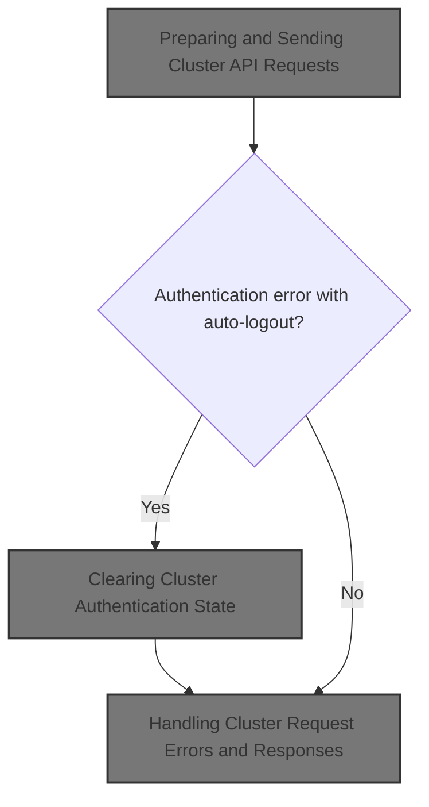
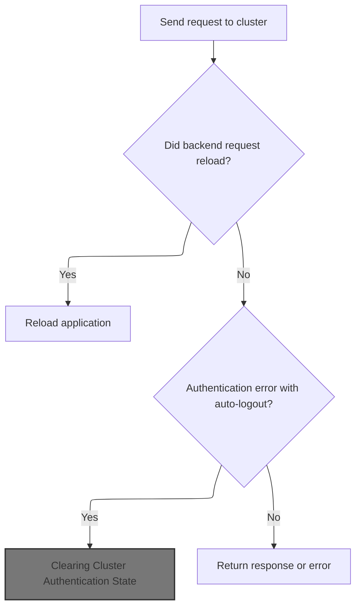
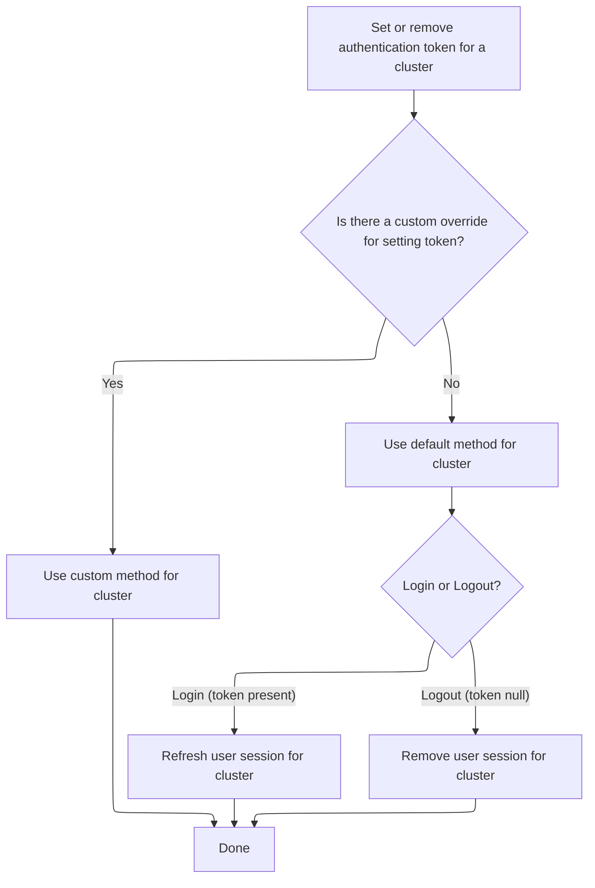
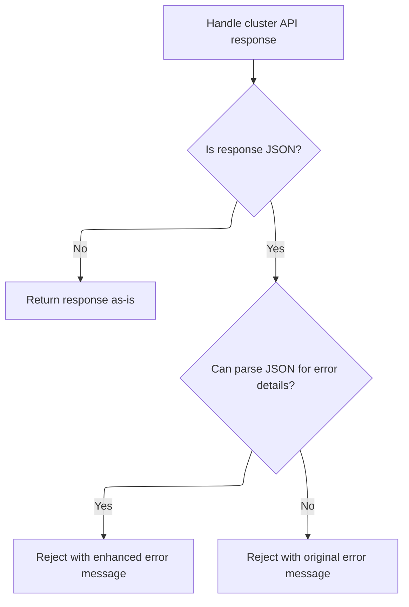

This document describes how the application manages requests to Kubernetes clusters, including authentication, session management, and response handling. The flow covers preparing and sending requests, handling backend signals, managing authentication state, updating tokens, and returning responses or errors to the user.



# Where is this flow used?

This flow is used multiple times in the codebase as represented in the following diagram:

(Note - these are only some of the entry points of this flow)

```mermaid
graph TD;
      3e0eb8139d9a01980d464d1f7b56282926e9707ec06f0c55bdacf68730d17bc6(frontend/…/resourceMap/GraphView.tsx::GraphViewContent) --> aea418ebf887730e25075a63bfc85385c2d4d2b0ce74593778d152385fca1452(frontend/…/resourceMap/useQueryParamsState.tsx::useQueryParamsState)

3e0eb8139d9a01980d464d1f7b56282926e9707ec06f0c55bdacf68730d17bc6(frontend/…/resourceMap/GraphView.tsx::GraphViewContent) --> 1a700f8dedf0d69d3be141ca7ce44d688aad107a774deb8655e974d7d1d949af(frontend/…/k8s/KubeObject.ts::KubeObject.useList)

3e0eb8139d9a01980d464d1f7b56282926e9707ec06f0c55bdacf68730d17bc6(frontend/…/resourceMap/GraphView.tsx::GraphViewContent) --> 59c1f49aac3d793dbcab833698719c95b6a6e82d69ed2536bccf9dedb573a66b(frontend/…/definitions/sources.tsx::useGetAllSources)

aea418ebf887730e25075a63bfc85385c2d4d2b0ce74593778d152385fca1452(frontend/…/resourceMap/useQueryParamsState.tsx::useQueryParamsState) --> dff2cd7b91bf65d00a972016368d9730cf0690499c44242539a9cf87fdee45f3(frontend/…/k8s/KubeObject.ts::KubeObject.delete)

dff2cd7b91bf65d00a972016368d9730cf0690499c44242539a9cf87fdee45f3(frontend/…/k8s/KubeObject.ts::KubeObject.delete) --> 9fe45744fc67b69e446ff645e0675c7a9dd3c946c1ddea5d2942b6083adc6340(frontend/…/v1/factories.ts::delete)

9fe45744fc67b69e446ff645e0675c7a9dd3c946c1ddea5d2942b6083adc6340(frontend/…/v1/factories.ts::delete) --> 2f1abf35d81c7328e5e93d0461565214761a9c42f095208266139eafe7089aea(frontend/…/v1/clusterRequests.ts::remove)

2f1abf35d81c7328e5e93d0461565214761a9c42f095208266139eafe7089aea(frontend/…/v1/clusterRequests.ts::remove) --> eba3525c115cf8f954fc3b545e92cd8e5aa98c277b91b82d9780d83f41a36ab5(frontend/…/v1/clusterRequests.ts::clusterRequest):::mainFlowStyle

1a700f8dedf0d69d3be141ca7ce44d688aad107a774deb8655e974d7d1d949af(frontend/…/k8s/KubeObject.ts::KubeObject.useList) --> e5352f2ba81d4af4a93432f58471de6119d866f79097c6f53207912dcddb2c3a(frontend/…/v2/useKubeObjectList.ts::useKubeObjectList)

1a700f8dedf0d69d3be141ca7ce44d688aad107a774deb8655e974d7d1d949af(frontend/…/k8s/KubeObject.ts::KubeObject.useList) --> 02125f4ea4c1604df8935a6f33fb8d1437d8ac1c8b12f53cc45252204ea9f8c4(frontend/…/Charts/index.ts::useSelectedClusters)

e5352f2ba81d4af4a93432f58471de6119d866f79097c6f53207912dcddb2c3a(frontend/…/v2/useKubeObjectList.ts::useKubeObjectList) --> 8ccd2eca55c37dd17a0ab2cfbc06dfb1cd6cdbc8b89ec9bd04db2ac1adf8510f(frontend/…/v2/useKubeObjectList.ts::useWatchKubeObjectLists)

8ccd2eca55c37dd17a0ab2cfbc06dfb1cd6cdbc8b89ec9bd04db2ac1adf8510f(frontend/…/v2/useKubeObjectList.ts::useWatchKubeObjectLists) --> cf109d78e65f95385144b9cdb6cd3e977cb79c6edeba8ec199c50368e75422fb(frontend/…/v2/useKubeObjectList.ts::useWatchKubeObjectListsMultiplexed)

8ccd2eca55c37dd17a0ab2cfbc06dfb1cd6cdbc8b89ec9bd04db2ac1adf8510f(frontend/…/v2/useKubeObjectList.ts::useWatchKubeObjectLists) --> 0de4bc56ca5b0998ee387c920c38c716657c470e38e3e9b41913cf975abd4df7(frontend/…/v2/useKubeObjectList.ts::useWatchKubeObjectListsLegacy)

cf109d78e65f95385144b9cdb6cd3e977cb79c6edeba8ec199c50368e75422fb(frontend/…/v2/useKubeObjectList.ts::useWatchKubeObjectListsMultiplexed) --> e2523a66a498cd5d917b26a5f04b90ddc9621dabb3dc656fddb4d735d7981741(frontend/…/v2/webSocket.ts::subscribe)

e2523a66a498cd5d917b26a5f04b90ddc9621dabb3dc656fddb4d735d7981741(frontend/…/v2/webSocket.ts::subscribe) --> 97d73f6151edfbf99a2f1b8c5c177d9d7c7a486b34ef68b91c74988f8e632621(frontend/…/v2/webSocket.ts::unsubscribe)

97d73f6151edfbf99a2f1b8c5c177d9d7c7a486b34ef68b91c74988f8e632621(frontend/…/v2/webSocket.ts::unsubscribe) --> dff2cd7b91bf65d00a972016368d9730cf0690499c44242539a9cf87fdee45f3(frontend/…/k8s/KubeObject.ts::KubeObject.delete)

0de4bc56ca5b0998ee387c920c38c716657c470e38e3e9b41913cf975abd4df7(frontend/…/v2/useKubeObjectList.ts::useWatchKubeObjectListsLegacy) --> 93345869ac2546fba259d16857628002d72ea7fa5064ac15f0b8f4803c9e88e8(frontend/…/v2/webSocket.ts::useWebSockets)

93345869ac2546fba259d16857628002d72ea7fa5064ac15f0b8f4803c9e88e8(frontend/…/v2/webSocket.ts::useWebSockets) --> 79bb169f744eca14545913c67ddbb8cf75bc112d241b0fb9678d800cace3e174(frontend/…/v2/webSocket.ts::openWebSocket)

93345869ac2546fba259d16857628002d72ea7fa5064ac15f0b8f4803c9e88e8(frontend/…/v2/webSocket.ts::useWebSockets) --> a30ad5bc8c09ff10a7aa20ada236bde4f3cc37a106d91ee70a07be9473f1503d(frontend/…/v2/webSocket.ts::connect)

93345869ac2546fba259d16857628002d72ea7fa5064ac15f0b8f4803c9e88e8(frontend/…/v2/webSocket.ts::useWebSockets) --> dff2cd7b91bf65d00a972016368d9730cf0690499c44242539a9cf87fdee45f3(frontend/…/k8s/KubeObject.ts::KubeObject.delete)

79bb169f744eca14545913c67ddbb8cf75bc112d241b0fb9678d800cace3e174(frontend/…/v2/webSocket.ts::openWebSocket) --> 4606a0d7af3bad76efed5ed463c15cc1571ae0a49b2f12a5302fcc14b66c405a(frontend/…/v2/hooks.ts::onMessage)

4606a0d7af3bad76efed5ed463c15cc1571ae0a49b2f12a5302fcc14b66c405a(frontend/…/v2/hooks.ts::onMessage) --> b6745d3bbbc290c3d8d0057162cfeb71e648ec72dccb61e788be4652addc1eed(frontend/…/v2/webSocket.ts::useWebSocket)

b6745d3bbbc290c3d8d0057162cfeb71e648ec72dccb61e788be4652addc1eed(frontend/…/v2/webSocket.ts::useWebSocket) --> e2523a66a498cd5d917b26a5f04b90ddc9621dabb3dc656fddb4d735d7981741(frontend/…/v2/webSocket.ts::subscribe)

b6745d3bbbc290c3d8d0057162cfeb71e648ec72dccb61e788be4652addc1eed(frontend/…/v2/webSocket.ts::useWebSocket) --> 4606a0d7af3bad76efed5ed463c15cc1571ae0a49b2f12a5302fcc14b66c405a(frontend/…/v2/hooks.ts::onMessage)

b6745d3bbbc290c3d8d0057162cfeb71e648ec72dccb61e788be4652addc1eed(frontend/…/v2/webSocket.ts::useWebSocket) --> 4eb905efa54e3e1a12f13ab6ff9779b4ae7a45db42dbd3d8e4df46f0d7e341f6(frontend/…/v2/webSocket.ts::connectWebSocket)

4eb905efa54e3e1a12f13ab6ff9779b4ae7a45db42dbd3d8e4df46f0d7e341f6(frontend/…/v2/webSocket.ts::connectWebSocket) --> e2523a66a498cd5d917b26a5f04b90ddc9621dabb3dc656fddb4d735d7981741(frontend/…/v2/webSocket.ts::subscribe)

a30ad5bc8c09ff10a7aa20ada236bde4f3cc37a106d91ee70a07be9473f1503d(frontend/…/v2/webSocket.ts::connect) --> 79bb169f744eca14545913c67ddbb8cf75bc112d241b0fb9678d800cace3e174(frontend/…/v2/webSocket.ts::openWebSocket)

a30ad5bc8c09ff10a7aa20ada236bde4f3cc37a106d91ee70a07be9473f1503d(frontend/…/v2/webSocket.ts::connect) --> dff2cd7b91bf65d00a972016368d9730cf0690499c44242539a9cf87fdee45f3(frontend/…/k8s/KubeObject.ts::KubeObject.delete)

02125f4ea4c1604df8935a6f33fb8d1437d8ac1c8b12f53cc45252204ea9f8c4(frontend/…/Charts/index.ts::useSelectedClusters) --> 099e97ecf5195ff301208cb7fb48125e24eb119e352d652cfda5ebba4860b231(frontend/…/Charts/index.ts::useCluster)

099e97ecf5195ff301208cb7fb48125e24eb119e352d652cfda5ebba4860b231(frontend/…/Charts/index.ts::useCluster) --> 52ca48fa3b320f4a3afcdf7e3b63e739f8145e3966bb3ab083fded7a4277a9cb(frontend/…/v1/clusterApi.ts::setCluster)

52ca48fa3b320f4a3afcdf7e3b63e739f8145e3966bb3ab083fded7a4277a9cb(frontend/…/v1/clusterApi.ts::setCluster) --> 28ea2067a14aab210239f42490708754d708d8185c3e0d5f61dbf7285327c4df(frontend/…/v1/clusterRequests.ts::request)

28ea2067a14aab210239f42490708754d708d8185c3e0d5f61dbf7285327c4df(frontend/…/v1/clusterRequests.ts::request) --> eba3525c115cf8f954fc3b545e92cd8e5aa98c277b91b82d9780d83f41a36ab5(frontend/…/v1/clusterRequests.ts::clusterRequest):::mainFlowStyle

59c1f49aac3d793dbcab833698719c95b6a6e82d69ed2536bccf9dedb573a66b(frontend/…/definitions/sources.tsx::useGetAllSources) --> 1a700f8dedf0d69d3be141ca7ce44d688aad107a774deb8655e974d7d1d949af(frontend/…/k8s/KubeObject.ts::KubeObject.useList)

3877936ed66287b8b37cfbe1b3357abe8f8e727ae0d0e28b1a1f7f954954568d(frontend/…/project/ProjectList.tsx::ProjectList) --> 685cb6efe89cbdecb96f92f48aed7ecf570b0623d5f4bb907d740929129900d7(frontend/…/project/useProjectResources.ts::useProjectItems)

3877936ed66287b8b37cfbe1b3357abe8f8e727ae0d0e28b1a1f7f954954568d(frontend/…/project/ProjectList.tsx::ProjectList) --> b1988d135c4a044e9af319d1d21e8cf78bbbb4c3d2c126c5f6030cef04508c9c(frontend/…/project/ProjectList.tsx::useProjects)

685cb6efe89cbdecb96f92f48aed7ecf570b0623d5f4bb907d740929129900d7(frontend/…/project/useProjectResources.ts::useProjectItems) --> 1443d34739bdacddccf826688f3618fd80fc1246cf434f58911c38e875bb06fc(frontend/…/utils/useKubeLists.tsx::useKubeLists)

1443d34739bdacddccf826688f3618fd80fc1246cf434f58911c38e875bb06fc(frontend/…/utils/useKubeLists.tsx::useKubeLists) --> 1a700f8dedf0d69d3be141ca7ce44d688aad107a774deb8655e974d7d1d949af(frontend/…/k8s/KubeObject.ts::KubeObject.useList)

b1988d135c4a044e9af319d1d21e8cf78bbbb4c3d2c126c5f6030cef04508c9c(frontend/…/project/ProjectList.tsx::useProjects) --> 1a700f8dedf0d69d3be141ca7ce44d688aad107a774deb8655e974d7d1d949af(frontend/…/k8s/KubeObject.ts::KubeObject.useList)

e3565f27ed50d7a4ca09e8ff5e67d66312ab9df76d0d24c305edec09ea955389(frontend/…/resourceMap/GraphView.tsx::GraphView) --> eb0529837b1caee2ddb903a1495d1f3e276faa63d8e1fb2a10a0450d6f39aa83(frontend/…/definitions/relations.tsx::useGetAllRelations)

e3565f27ed50d7a4ca09e8ff5e67d66312ab9df76d0d24c305edec09ea955389(frontend/…/resourceMap/GraphView.tsx::GraphView) --> 59c1f49aac3d793dbcab833698719c95b6a6e82d69ed2536bccf9dedb573a66b(frontend/…/definitions/sources.tsx::useGetAllSources)

eb0529837b1caee2ddb903a1495d1f3e276faa63d8e1fb2a10a0450d6f39aa83(frontend/…/definitions/relations.tsx::useGetAllRelations) --> a0d2ded8f46a8c82100b965740528d259f7adbe5c514ef9ecc22d96b6c34255a(frontend/…/definitions/relations.tsx::useGetCRToOwnerRelations)

a0d2ded8f46a8c82100b965740528d259f7adbe5c514ef9ecc22d96b6c34255a(frontend/…/definitions/relations.tsx::useGetCRToOwnerRelations) --> 1a700f8dedf0d69d3be141ca7ce44d688aad107a774deb8655e974d7d1d949af(frontend/…/k8s/KubeObject.ts::KubeObject.useList)

3e40fefa1670992d9a95ed99a1f2269c7e2d0f568cc61a9f8e8f6b397670a36c(frontend/…/v1/factories.ts::apiFactoryWithNamespace) --> 204f83a00fb70820fd25a6410ff1299f717260eae3da372ecbbbdc59e775a6b1(frontend/…/v1/factories.ts::simpleApiFactoryWithNamespace)

3e40fefa1670992d9a95ed99a1f2269c7e2d0f568cc61a9f8e8f6b397670a36c(frontend/…/v1/factories.ts::apiFactoryWithNamespace) --> baa2a3fe568435794ce15a7f1d4e6144fd642157b6c778dc554a58c6a2f77e19(frontend/…/v1/factories.ts::multipleApiFactoryWithNamespace)

204f83a00fb70820fd25a6410ff1299f717260eae3da372ecbbbdc59e775a6b1(frontend/…/v1/factories.ts::simpleApiFactoryWithNamespace) --> 994f61399fc8ccc50e6041535f47b6635097a9e6879fb4a18a734fa9e0777d71(frontend/…/v1/clusterRequests.ts::post)

204f83a00fb70820fd25a6410ff1299f717260eae3da372ecbbbdc59e775a6b1(frontend/…/v1/factories.ts::simpleApiFactoryWithNamespace) --> e6850e4b771f662474c39229d10f9872255a6a55d2e40a51dea746a89aef537c(frontend/…/v1/clusterRequests.ts::patch)

204f83a00fb70820fd25a6410ff1299f717260eae3da372ecbbbdc59e775a6b1(frontend/…/v1/factories.ts::simpleApiFactoryWithNamespace) --> 6a3bf0904f16bb2ac813453d7d9edbc6f35c8604401a2f48bb1c50b0e9c5103e(frontend/…/v1/scaleApi.ts::apiScaleFactory)

204f83a00fb70820fd25a6410ff1299f717260eae3da372ecbbbdc59e775a6b1(frontend/…/v1/factories.ts::simpleApiFactoryWithNamespace) --> 9d5c4a043b7b1279cb61e3753fa60e11cffea4c6c56d8ba87abc47d8a4bd3c75(frontend/…/v1/clusterRequests.ts::put)

204f83a00fb70820fd25a6410ff1299f717260eae3da372ecbbbdc59e775a6b1(frontend/…/v1/factories.ts::simpleApiFactoryWithNamespace) --> 2f1abf35d81c7328e5e93d0461565214761a9c42f095208266139eafe7089aea(frontend/…/v1/clusterRequests.ts::remove)

204f83a00fb70820fd25a6410ff1299f717260eae3da372ecbbbdc59e775a6b1(frontend/…/v1/factories.ts::simpleApiFactoryWithNamespace) --> db9b4ef048485a7cfe8f64ad92dc895df5082b562bfeebdc5a396dd1c4b228ac(frontend/…/v1/streamingApi.ts::streamResultsForCluster)

204f83a00fb70820fd25a6410ff1299f717260eae3da372ecbbbdc59e775a6b1(frontend/…/v1/factories.ts::simpleApiFactoryWithNamespace) --> 26492af48604a4237093afba93e92efaa7bbf6154d79dba9eb148d545e7e1df6(frontend/…/v1/streamingApi.ts::streamResult)

994f61399fc8ccc50e6041535f47b6635097a9e6879fb4a18a734fa9e0777d71(frontend/…/v1/clusterRequests.ts::post) --> eba3525c115cf8f954fc3b545e92cd8e5aa98c277b91b82d9780d83f41a36ab5(frontend/…/v1/clusterRequests.ts::clusterRequest):::mainFlowStyle

e6850e4b771f662474c39229d10f9872255a6a55d2e40a51dea746a89aef537c(frontend/…/v1/clusterRequests.ts::patch) --> eba3525c115cf8f954fc3b545e92cd8e5aa98c277b91b82d9780d83f41a36ab5(frontend/…/v1/clusterRequests.ts::clusterRequest):::mainFlowStyle

6a3bf0904f16bb2ac813453d7d9edbc6f35c8604401a2f48bb1c50b0e9c5103e(frontend/…/v1/scaleApi.ts::apiScaleFactory) --> 4cd2cc1be8ede76f8aacc18230c2b93ed94379d9dec83ea4a8c600e0c58162f8(frontend/…/v1/scaleApi.ts::patch)

6a3bf0904f16bb2ac813453d7d9edbc6f35c8604401a2f48bb1c50b0e9c5103e(frontend/…/v1/scaleApi.ts::apiScaleFactory) --> d0116705b3c6ba0a2203b5855be459ce21451a9db34076b17b050409824e1c30(frontend/…/v1/scaleApi.ts::put)

6a3bf0904f16bb2ac813453d7d9edbc6f35c8604401a2f48bb1c50b0e9c5103e(frontend/…/v1/scaleApi.ts::apiScaleFactory) --> eba3525c115cf8f954fc3b545e92cd8e5aa98c277b91b82d9780d83f41a36ab5(frontend/…/v1/clusterRequests.ts::clusterRequest):::mainFlowStyle

4cd2cc1be8ede76f8aacc18230c2b93ed94379d9dec83ea4a8c600e0c58162f8(frontend/…/v1/scaleApi.ts::patch) --> e6850e4b771f662474c39229d10f9872255a6a55d2e40a51dea746a89aef537c(frontend/…/v1/clusterRequests.ts::patch)

d0116705b3c6ba0a2203b5855be459ce21451a9db34076b17b050409824e1c30(frontend/…/v1/scaleApi.ts::put) --> 9d5c4a043b7b1279cb61e3753fa60e11cffea4c6c56d8ba87abc47d8a4bd3c75(frontend/…/v1/clusterRequests.ts::put)

9d5c4a043b7b1279cb61e3753fa60e11cffea4c6c56d8ba87abc47d8a4bd3c75(frontend/…/v1/clusterRequests.ts::put) --> eba3525c115cf8f954fc3b545e92cd8e5aa98c277b91b82d9780d83f41a36ab5(frontend/…/v1/clusterRequests.ts::clusterRequest):::mainFlowStyle

db9b4ef048485a7cfe8f64ad92dc895df5082b562bfeebdc5a396dd1c4b228ac(frontend/…/v1/streamingApi.ts::streamResultsForCluster) --> eba3525c115cf8f954fc3b545e92cd8e5aa98c277b91b82d9780d83f41a36ab5(frontend/…/v1/clusterRequests.ts::clusterRequest):::mainFlowStyle

db9b4ef048485a7cfe8f64ad92dc895df5082b562bfeebdc5a396dd1c4b228ac(frontend/…/v1/streamingApi.ts::streamResultsForCluster) --> a0f74fdf360f7c6673499dcc4add35d396fda7ae5ce63a9872fe26925554bea5(frontend/…/v1/streamingApi.ts::run)

a0f74fdf360f7c6673499dcc4add35d396fda7ae5ce63a9872fe26925554bea5(frontend/…/v1/streamingApi.ts::run) --> eba3525c115cf8f954fc3b545e92cd8e5aa98c277b91b82d9780d83f41a36ab5(frontend/…/v1/clusterRequests.ts::clusterRequest):::mainFlowStyle

26492af48604a4237093afba93e92efaa7bbf6154d79dba9eb148d545e7e1df6(frontend/…/v1/streamingApi.ts::streamResult) --> eba3525c115cf8f954fc3b545e92cd8e5aa98c277b91b82d9780d83f41a36ab5(frontend/…/v1/clusterRequests.ts::clusterRequest):::mainFlowStyle

26492af48604a4237093afba93e92efaa7bbf6154d79dba9eb148d545e7e1df6(frontend/…/v1/streamingApi.ts::streamResult) --> a0f74fdf360f7c6673499dcc4add35d396fda7ae5ce63a9872fe26925554bea5(frontend/…/v1/streamingApi.ts::run)

a0f74fdf360f7c6673499dcc4add35d396fda7ae5ce63a9872fe26925554bea5(frontend/…/v1/streamingApi.ts::run) --> eba3525c115cf8f954fc3b545e92cd8e5aa98c277b91b82d9780d83f41a36ab5(frontend/…/v1/clusterRequests.ts::clusterRequest):::mainFlowStyle

baa2a3fe568435794ce15a7f1d4e6144fd642157b6c778dc554a58c6a2f77e19(frontend/…/v1/factories.ts::multipleApiFactoryWithNamespace) --> 204f83a00fb70820fd25a6410ff1299f717260eae3da372ecbbbdc59e775a6b1(frontend/…/v1/factories.ts::simpleApiFactoryWithNamespace)

d86ed78fbf2e13c724a9eaff4beabfe1d709c6e8ecb12dd16859025fe61c1f08(frontend/…/v1/factories.ts::apiFactory) --> 0a64466108d98c1725bf990ed4361ccdb3545bd3ecabf88410964c3c9c0ea257(frontend/…/v1/factories.ts::singleApiFactory)

d86ed78fbf2e13c724a9eaff4beabfe1d709c6e8ecb12dd16859025fe61c1f08(frontend/…/v1/factories.ts::apiFactory) --> a75e891440e1ed36b6e84857f71c17a3ae6d31870f2a33d9da491b0acef21f67(frontend/…/v1/factories.ts::multipleApiFactory)

0a64466108d98c1725bf990ed4361ccdb3545bd3ecabf88410964c3c9c0ea257(frontend/…/v1/factories.ts::singleApiFactory) --> 994f61399fc8ccc50e6041535f47b6635097a9e6879fb4a18a734fa9e0777d71(frontend/…/v1/clusterRequests.ts::post)

0a64466108d98c1725bf990ed4361ccdb3545bd3ecabf88410964c3c9c0ea257(frontend/…/v1/factories.ts::singleApiFactory) --> e6850e4b771f662474c39229d10f9872255a6a55d2e40a51dea746a89aef537c(frontend/…/v1/clusterRequests.ts::patch)

0a64466108d98c1725bf990ed4361ccdb3545bd3ecabf88410964c3c9c0ea257(frontend/…/v1/factories.ts::singleApiFactory) --> 9d5c4a043b7b1279cb61e3753fa60e11cffea4c6c56d8ba87abc47d8a4bd3c75(frontend/…/v1/clusterRequests.ts::put)

0a64466108d98c1725bf990ed4361ccdb3545bd3ecabf88410964c3c9c0ea257(frontend/…/v1/factories.ts::singleApiFactory) --> 2f1abf35d81c7328e5e93d0461565214761a9c42f095208266139eafe7089aea(frontend/…/v1/clusterRequests.ts::remove)

0a64466108d98c1725bf990ed4361ccdb3545bd3ecabf88410964c3c9c0ea257(frontend/…/v1/factories.ts::singleApiFactory) --> db9b4ef048485a7cfe8f64ad92dc895df5082b562bfeebdc5a396dd1c4b228ac(frontend/…/v1/streamingApi.ts::streamResultsForCluster)

0a64466108d98c1725bf990ed4361ccdb3545bd3ecabf88410964c3c9c0ea257(frontend/…/v1/factories.ts::singleApiFactory) --> 26492af48604a4237093afba93e92efaa7bbf6154d79dba9eb148d545e7e1df6(frontend/…/v1/streamingApi.ts::streamResult)

a75e891440e1ed36b6e84857f71c17a3ae6d31870f2a33d9da491b0acef21f67(frontend/…/v1/factories.ts::multipleApiFactory) --> 0a64466108d98c1725bf990ed4361ccdb3545bd3ecabf88410964c3c9c0ea257(frontend/…/v1/factories.ts::singleApiFactory)


classDef mainFlowStyle color:#000000,fill:#7CB9F4
classDef rootsStyle color:#000000,fill:#00FFF4
classDef Style1 color:#000000,fill:#00FFAA
classDef Style2 color:#000000,fill:#FFFF00
classDef Style3 color:#000000,fill:#AA7CB9

%% Swimm:
%% graph TD;
%%       3e0eb8139d9a01980d464d1f7b56282926e9707ec06f0c55bdacf68730d17bc6(<SwmPath>[frontend/…/resourceMap/GraphView.tsx](frontend/src/components/resourceMap/GraphView.tsx)</SwmPath>::GraphViewContent) --> aea418ebf887730e25075a63bfc85385c2d4d2b0ce74593778d152385fca1452(<SwmPath>[frontend/…/resourceMap/useQueryParamsState.tsx](frontend/src/components/resourceMap/useQueryParamsState.tsx)</SwmPath>::useQueryParamsState)
%% 
%% 3e0eb8139d9a01980d464d1f7b56282926e9707ec06f0c55bdacf68730d17bc6(<SwmPath>[frontend/…/resourceMap/GraphView.tsx](frontend/src/components/resourceMap/GraphView.tsx)</SwmPath>::GraphViewContent) --> 1a700f8dedf0d69d3be141ca7ce44d688aad107a774deb8655e974d7d1d949af(<SwmPath>[frontend/…/k8s/KubeObject.ts](frontend/src/lib/k8s/KubeObject.ts)</SwmPath>::KubeObject.useList)
%% 
%% 3e0eb8139d9a01980d464d1f7b56282926e9707ec06f0c55bdacf68730d17bc6(<SwmPath>[frontend/…/resourceMap/GraphView.tsx](frontend/src/components/resourceMap/GraphView.tsx)</SwmPath>::GraphViewContent) --> 59c1f49aac3d793dbcab833698719c95b6a6e82d69ed2536bccf9dedb573a66b(<SwmPath>[frontend/…/definitions/sources.tsx](frontend/src/components/resourceMap/sources/definitions/sources.tsx)</SwmPath>::useGetAllSources)
%% 
%% aea418ebf887730e25075a63bfc85385c2d4d2b0ce74593778d152385fca1452(<SwmPath>[frontend/…/resourceMap/useQueryParamsState.tsx](frontend/src/components/resourceMap/useQueryParamsState.tsx)</SwmPath>::useQueryParamsState) --> dff2cd7b91bf65d00a972016368d9730cf0690499c44242539a9cf87fdee45f3(<SwmPath>[frontend/…/k8s/KubeObject.ts](frontend/src/lib/k8s/KubeObject.ts)</SwmPath>::KubeObject.delete)
%% 
%% dff2cd7b91bf65d00a972016368d9730cf0690499c44242539a9cf87fdee45f3(<SwmPath>[frontend/…/k8s/KubeObject.ts](frontend/src/lib/k8s/KubeObject.ts)</SwmPath>::KubeObject.delete) --> 9fe45744fc67b69e446ff645e0675c7a9dd3c946c1ddea5d2942b6083adc6340(<SwmPath>[frontend/…/v1/factories.ts](frontend/src/lib/k8s/api/v1/factories.ts)</SwmPath>::delete)
%% 
%% 9fe45744fc67b69e446ff645e0675c7a9dd3c946c1ddea5d2942b6083adc6340(<SwmPath>[frontend/…/v1/factories.ts](frontend/src/lib/k8s/api/v1/factories.ts)</SwmPath>::delete) --> 2f1abf35d81c7328e5e93d0461565214761a9c42f095208266139eafe7089aea(<SwmPath>[frontend/…/v1/clusterRequests.ts](frontend/src/lib/k8s/api/v1/clusterRequests.ts)</SwmPath>::remove)
%% 
%% 2f1abf35d81c7328e5e93d0461565214761a9c42f095208266139eafe7089aea(<SwmPath>[frontend/…/v1/clusterRequests.ts](frontend/src/lib/k8s/api/v1/clusterRequests.ts)</SwmPath>::remove) --> eba3525c115cf8f954fc3b545e92cd8e5aa98c277b91b82d9780d83f41a36ab5(<SwmPath>[frontend/…/v1/clusterRequests.ts](frontend/src/lib/k8s/api/v1/clusterRequests.ts)</SwmPath>::<SwmToken path="frontend/src/lib/k8s/api/v1/clusterRequests.ts" pos="122:6:6" line-data="export async function clusterRequest(">`clusterRequest`</SwmToken>):::mainFlowStyle
%% 
%% 1a700f8dedf0d69d3be141ca7ce44d688aad107a774deb8655e974d7d1d949af(<SwmPath>[frontend/…/k8s/KubeObject.ts](frontend/src/lib/k8s/KubeObject.ts)</SwmPath>::KubeObject.useList) --> e5352f2ba81d4af4a93432f58471de6119d866f79097c6f53207912dcddb2c3a(<SwmPath>[frontend/…/v2/useKubeObjectList.ts](frontend/src/lib/k8s/api/v2/useKubeObjectList.ts)</SwmPath>::useKubeObjectList)
%% 
%% 1a700f8dedf0d69d3be141ca7ce44d688aad107a774deb8655e974d7d1d949af(<SwmPath>[frontend/…/k8s/KubeObject.ts](frontend/src/lib/k8s/KubeObject.ts)</SwmPath>::KubeObject.useList) --> 02125f4ea4c1604df8935a6f33fb8d1437d8ac1c8b12f53cc45252204ea9f8c4(<SwmPath>[frontend/…/Charts/index.ts](frontend/src/components/cluster/Charts/index.ts)</SwmPath>::useSelectedClusters)
%% 
%% e5352f2ba81d4af4a93432f58471de6119d866f79097c6f53207912dcddb2c3a(<SwmPath>[frontend/…/v2/useKubeObjectList.ts](frontend/src/lib/k8s/api/v2/useKubeObjectList.ts)</SwmPath>::useKubeObjectList) --> 8ccd2eca55c37dd17a0ab2cfbc06dfb1cd6cdbc8b89ec9bd04db2ac1adf8510f(<SwmPath>[frontend/…/v2/useKubeObjectList.ts](frontend/src/lib/k8s/api/v2/useKubeObjectList.ts)</SwmPath>::useWatchKubeObjectLists)
%% 
%% 8ccd2eca55c37dd17a0ab2cfbc06dfb1cd6cdbc8b89ec9bd04db2ac1adf8510f(<SwmPath>[frontend/…/v2/useKubeObjectList.ts](frontend/src/lib/k8s/api/v2/useKubeObjectList.ts)</SwmPath>::useWatchKubeObjectLists) --> cf109d78e65f95385144b9cdb6cd3e977cb79c6edeba8ec199c50368e75422fb(<SwmPath>[frontend/…/v2/useKubeObjectList.ts](frontend/src/lib/k8s/api/v2/useKubeObjectList.ts)</SwmPath>::useWatchKubeObjectListsMultiplexed)
%% 
%% 8ccd2eca55c37dd17a0ab2cfbc06dfb1cd6cdbc8b89ec9bd04db2ac1adf8510f(<SwmPath>[frontend/…/v2/useKubeObjectList.ts](frontend/src/lib/k8s/api/v2/useKubeObjectList.ts)</SwmPath>::useWatchKubeObjectLists) --> 0de4bc56ca5b0998ee387c920c38c716657c470e38e3e9b41913cf975abd4df7(<SwmPath>[frontend/…/v2/useKubeObjectList.ts](frontend/src/lib/k8s/api/v2/useKubeObjectList.ts)</SwmPath>::useWatchKubeObjectListsLegacy)
%% 
%% cf109d78e65f95385144b9cdb6cd3e977cb79c6edeba8ec199c50368e75422fb(<SwmPath>[frontend/…/v2/useKubeObjectList.ts](frontend/src/lib/k8s/api/v2/useKubeObjectList.ts)</SwmPath>::useWatchKubeObjectListsMultiplexed) --> e2523a66a498cd5d917b26a5f04b90ddc9621dabb3dc656fddb4d735d7981741(<SwmPath>[frontend/…/v2/webSocket.ts](frontend/src/lib/k8s/api/v2/webSocket.ts)</SwmPath>::subscribe)
%% 
%% e2523a66a498cd5d917b26a5f04b90ddc9621dabb3dc656fddb4d735d7981741(<SwmPath>[frontend/…/v2/webSocket.ts](frontend/src/lib/k8s/api/v2/webSocket.ts)</SwmPath>::subscribe) --> 97d73f6151edfbf99a2f1b8c5c177d9d7c7a486b34ef68b91c74988f8e632621(<SwmPath>[frontend/…/v2/webSocket.ts](frontend/src/lib/k8s/api/v2/webSocket.ts)</SwmPath>::unsubscribe)
%% 
%% 97d73f6151edfbf99a2f1b8c5c177d9d7c7a486b34ef68b91c74988f8e632621(<SwmPath>[frontend/…/v2/webSocket.ts](frontend/src/lib/k8s/api/v2/webSocket.ts)</SwmPath>::unsubscribe) --> dff2cd7b91bf65d00a972016368d9730cf0690499c44242539a9cf87fdee45f3(<SwmPath>[frontend/…/k8s/KubeObject.ts](frontend/src/lib/k8s/KubeObject.ts)</SwmPath>::KubeObject.delete)
%% 
%% 0de4bc56ca5b0998ee387c920c38c716657c470e38e3e9b41913cf975abd4df7(<SwmPath>[frontend/…/v2/useKubeObjectList.ts](frontend/src/lib/k8s/api/v2/useKubeObjectList.ts)</SwmPath>::useWatchKubeObjectListsLegacy) --> 93345869ac2546fba259d16857628002d72ea7fa5064ac15f0b8f4803c9e88e8(<SwmPath>[frontend/…/v2/webSocket.ts](frontend/src/lib/k8s/api/v2/webSocket.ts)</SwmPath>::useWebSockets)
%% 
%% 93345869ac2546fba259d16857628002d72ea7fa5064ac15f0b8f4803c9e88e8(<SwmPath>[frontend/…/v2/webSocket.ts](frontend/src/lib/k8s/api/v2/webSocket.ts)</SwmPath>::useWebSockets) --> 79bb169f744eca14545913c67ddbb8cf75bc112d241b0fb9678d800cace3e174(<SwmPath>[frontend/…/v2/webSocket.ts](frontend/src/lib/k8s/api/v2/webSocket.ts)</SwmPath>::openWebSocket)
%% 
%% 93345869ac2546fba259d16857628002d72ea7fa5064ac15f0b8f4803c9e88e8(<SwmPath>[frontend/…/v2/webSocket.ts](frontend/src/lib/k8s/api/v2/webSocket.ts)</SwmPath>::useWebSockets) --> a30ad5bc8c09ff10a7aa20ada236bde4f3cc37a106d91ee70a07be9473f1503d(<SwmPath>[frontend/…/v2/webSocket.ts](frontend/src/lib/k8s/api/v2/webSocket.ts)</SwmPath>::connect)
%% 
%% 93345869ac2546fba259d16857628002d72ea7fa5064ac15f0b8f4803c9e88e8(<SwmPath>[frontend/…/v2/webSocket.ts](frontend/src/lib/k8s/api/v2/webSocket.ts)</SwmPath>::useWebSockets) --> dff2cd7b91bf65d00a972016368d9730cf0690499c44242539a9cf87fdee45f3(<SwmPath>[frontend/…/k8s/KubeObject.ts](frontend/src/lib/k8s/KubeObject.ts)</SwmPath>::KubeObject.delete)
%% 
%% 79bb169f744eca14545913c67ddbb8cf75bc112d241b0fb9678d800cace3e174(<SwmPath>[frontend/…/v2/webSocket.ts](frontend/src/lib/k8s/api/v2/webSocket.ts)</SwmPath>::openWebSocket) --> 4606a0d7af3bad76efed5ed463c15cc1571ae0a49b2f12a5302fcc14b66c405a(<SwmPath>[frontend/…/v2/hooks.ts](frontend/src/lib/k8s/api/v2/hooks.ts)</SwmPath>::onMessage)
%% 
%% 4606a0d7af3bad76efed5ed463c15cc1571ae0a49b2f12a5302fcc14b66c405a(<SwmPath>[frontend/…/v2/hooks.ts](frontend/src/lib/k8s/api/v2/hooks.ts)</SwmPath>::onMessage) --> b6745d3bbbc290c3d8d0057162cfeb71e648ec72dccb61e788be4652addc1eed(<SwmPath>[frontend/…/v2/webSocket.ts](frontend/src/lib/k8s/api/v2/webSocket.ts)</SwmPath>::useWebSocket)
%% 
%% b6745d3bbbc290c3d8d0057162cfeb71e648ec72dccb61e788be4652addc1eed(<SwmPath>[frontend/…/v2/webSocket.ts](frontend/src/lib/k8s/api/v2/webSocket.ts)</SwmPath>::useWebSocket) --> e2523a66a498cd5d917b26a5f04b90ddc9621dabb3dc656fddb4d735d7981741(<SwmPath>[frontend/…/v2/webSocket.ts](frontend/src/lib/k8s/api/v2/webSocket.ts)</SwmPath>::subscribe)
%% 
%% b6745d3bbbc290c3d8d0057162cfeb71e648ec72dccb61e788be4652addc1eed(<SwmPath>[frontend/…/v2/webSocket.ts](frontend/src/lib/k8s/api/v2/webSocket.ts)</SwmPath>::useWebSocket) --> 4606a0d7af3bad76efed5ed463c15cc1571ae0a49b2f12a5302fcc14b66c405a(<SwmPath>[frontend/…/v2/hooks.ts](frontend/src/lib/k8s/api/v2/hooks.ts)</SwmPath>::onMessage)
%% 
%% b6745d3bbbc290c3d8d0057162cfeb71e648ec72dccb61e788be4652addc1eed(<SwmPath>[frontend/…/v2/webSocket.ts](frontend/src/lib/k8s/api/v2/webSocket.ts)</SwmPath>::useWebSocket) --> 4eb905efa54e3e1a12f13ab6ff9779b4ae7a45db42dbd3d8e4df46f0d7e341f6(<SwmPath>[frontend/…/v2/webSocket.ts](frontend/src/lib/k8s/api/v2/webSocket.ts)</SwmPath>::connectWebSocket)
%% 
%% 4eb905efa54e3e1a12f13ab6ff9779b4ae7a45db42dbd3d8e4df46f0d7e341f6(<SwmPath>[frontend/…/v2/webSocket.ts](frontend/src/lib/k8s/api/v2/webSocket.ts)</SwmPath>::connectWebSocket) --> e2523a66a498cd5d917b26a5f04b90ddc9621dabb3dc656fddb4d735d7981741(<SwmPath>[frontend/…/v2/webSocket.ts](frontend/src/lib/k8s/api/v2/webSocket.ts)</SwmPath>::subscribe)
%% 
%% a30ad5bc8c09ff10a7aa20ada236bde4f3cc37a106d91ee70a07be9473f1503d(<SwmPath>[frontend/…/v2/webSocket.ts](frontend/src/lib/k8s/api/v2/webSocket.ts)</SwmPath>::connect) --> 79bb169f744eca14545913c67ddbb8cf75bc112d241b0fb9678d800cace3e174(<SwmPath>[frontend/…/v2/webSocket.ts](frontend/src/lib/k8s/api/v2/webSocket.ts)</SwmPath>::openWebSocket)
%% 
%% a30ad5bc8c09ff10a7aa20ada236bde4f3cc37a106d91ee70a07be9473f1503d(<SwmPath>[frontend/…/v2/webSocket.ts](frontend/src/lib/k8s/api/v2/webSocket.ts)</SwmPath>::connect) --> dff2cd7b91bf65d00a972016368d9730cf0690499c44242539a9cf87fdee45f3(<SwmPath>[frontend/…/k8s/KubeObject.ts](frontend/src/lib/k8s/KubeObject.ts)</SwmPath>::KubeObject.delete)
%% 
%% 02125f4ea4c1604df8935a6f33fb8d1437d8ac1c8b12f53cc45252204ea9f8c4(<SwmPath>[frontend/…/Charts/index.ts](frontend/src/components/cluster/Charts/index.ts)</SwmPath>::useSelectedClusters) --> 099e97ecf5195ff301208cb7fb48125e24eb119e352d652cfda5ebba4860b231(<SwmPath>[frontend/…/Charts/index.ts](frontend/src/components/cluster/Charts/index.ts)</SwmPath>::<SwmToken path="frontend/src/lib/k8s/api/v1/clusterRequests.ts" pos="82:20:20" line-data=" * Sends a request to the backend. If the useCluster parameter is true (which it is, by default), it will be">`useCluster`</SwmToken>)
%% 
%% 099e97ecf5195ff301208cb7fb48125e24eb119e352d652cfda5ebba4860b231(<SwmPath>[frontend/…/Charts/index.ts](frontend/src/components/cluster/Charts/index.ts)</SwmPath>::<SwmToken path="frontend/src/lib/k8s/api/v1/clusterRequests.ts" pos="82:20:20" line-data=" * Sends a request to the backend. If the useCluster parameter is true (which it is, by default), it will be">`useCluster`</SwmToken>) --> 52ca48fa3b320f4a3afcdf7e3b63e739f8145e3966bb3ab083fded7a4277a9cb(<SwmPath>[frontend/…/v1/clusterApi.ts](frontend/src/lib/k8s/api/v1/clusterApi.ts)</SwmPath>::setCluster)
%% 
%% 52ca48fa3b320f4a3afcdf7e3b63e739f8145e3966bb3ab083fded7a4277a9cb(<SwmPath>[frontend/…/v1/clusterApi.ts](frontend/src/lib/k8s/api/v1/clusterApi.ts)</SwmPath>::setCluster) --> 28ea2067a14aab210239f42490708754d708d8185c3e0d5f61dbf7285327c4df(<SwmPath>[frontend/…/v1/clusterRequests.ts](frontend/src/lib/k8s/api/v1/clusterRequests.ts)</SwmPath>::request)
%% 
%% 28ea2067a14aab210239f42490708754d708d8185c3e0d5f61dbf7285327c4df(<SwmPath>[frontend/…/v1/clusterRequests.ts](frontend/src/lib/k8s/api/v1/clusterRequests.ts)</SwmPath>::request) --> eba3525c115cf8f954fc3b545e92cd8e5aa98c277b91b82d9780d83f41a36ab5(<SwmPath>[frontend/…/v1/clusterRequests.ts](frontend/src/lib/k8s/api/v1/clusterRequests.ts)</SwmPath>::<SwmToken path="frontend/src/lib/k8s/api/v1/clusterRequests.ts" pos="122:6:6" line-data="export async function clusterRequest(">`clusterRequest`</SwmToken>):::mainFlowStyle
%% 
%% 59c1f49aac3d793dbcab833698719c95b6a6e82d69ed2536bccf9dedb573a66b(<SwmPath>[frontend/…/definitions/sources.tsx](frontend/src/components/resourceMap/sources/definitions/sources.tsx)</SwmPath>::useGetAllSources) --> 1a700f8dedf0d69d3be141ca7ce44d688aad107a774deb8655e974d7d1d949af(<SwmPath>[frontend/…/k8s/KubeObject.ts](frontend/src/lib/k8s/KubeObject.ts)</SwmPath>::KubeObject.useList)
%% 
%% 3877936ed66287b8b37cfbe1b3357abe8f8e727ae0d0e28b1a1f7f954954568d(<SwmPath>[frontend/…/project/ProjectList.tsx](frontend/src/components/project/ProjectList.tsx)</SwmPath>::ProjectList) --> 685cb6efe89cbdecb96f92f48aed7ecf570b0623d5f4bb907d740929129900d7(<SwmPath>[frontend/…/project/useProjectResources.ts](frontend/src/components/project/useProjectResources.ts)</SwmPath>::useProjectItems)
%% 
%% 3877936ed66287b8b37cfbe1b3357abe8f8e727ae0d0e28b1a1f7f954954568d(<SwmPath>[frontend/…/project/ProjectList.tsx](frontend/src/components/project/ProjectList.tsx)</SwmPath>::ProjectList) --> b1988d135c4a044e9af319d1d21e8cf78bbbb4c3d2c126c5f6030cef04508c9c(<SwmPath>[frontend/…/project/ProjectList.tsx](frontend/src/components/project/ProjectList.tsx)</SwmPath>::useProjects)
%% 
%% 685cb6efe89cbdecb96f92f48aed7ecf570b0623d5f4bb907d740929129900d7(<SwmPath>[frontend/…/project/useProjectResources.ts](frontend/src/components/project/useProjectResources.ts)</SwmPath>::useProjectItems) --> 1443d34739bdacddccf826688f3618fd80fc1246cf434f58911c38e875bb06fc(<SwmPath>[frontend/…/utils/useKubeLists.tsx](frontend/src/components/advancedSearch/utils/useKubeLists.tsx)</SwmPath>::useKubeLists)
%% 
%% 1443d34739bdacddccf826688f3618fd80fc1246cf434f58911c38e875bb06fc(<SwmPath>[frontend/…/utils/useKubeLists.tsx](frontend/src/components/advancedSearch/utils/useKubeLists.tsx)</SwmPath>::useKubeLists) --> 1a700f8dedf0d69d3be141ca7ce44d688aad107a774deb8655e974d7d1d949af(<SwmPath>[frontend/…/k8s/KubeObject.ts](frontend/src/lib/k8s/KubeObject.ts)</SwmPath>::KubeObject.useList)
%% 
%% b1988d135c4a044e9af319d1d21e8cf78bbbb4c3d2c126c5f6030cef04508c9c(<SwmPath>[frontend/…/project/ProjectList.tsx](frontend/src/components/project/ProjectList.tsx)</SwmPath>::useProjects) --> 1a700f8dedf0d69d3be141ca7ce44d688aad107a774deb8655e974d7d1d949af(<SwmPath>[frontend/…/k8s/KubeObject.ts](frontend/src/lib/k8s/KubeObject.ts)</SwmPath>::KubeObject.useList)
%% 
%% e3565f27ed50d7a4ca09e8ff5e67d66312ab9df76d0d24c305edec09ea955389(<SwmPath>[frontend/…/resourceMap/GraphView.tsx](frontend/src/components/resourceMap/GraphView.tsx)</SwmPath>::GraphView) --> eb0529837b1caee2ddb903a1495d1f3e276faa63d8e1fb2a10a0450d6f39aa83(<SwmPath>[frontend/…/definitions/relations.tsx](frontend/src/components/resourceMap/sources/definitions/relations.tsx)</SwmPath>::useGetAllRelations)
%% 
%% e3565f27ed50d7a4ca09e8ff5e67d66312ab9df76d0d24c305edec09ea955389(<SwmPath>[frontend/…/resourceMap/GraphView.tsx](frontend/src/components/resourceMap/GraphView.tsx)</SwmPath>::GraphView) --> 59c1f49aac3d793dbcab833698719c95b6a6e82d69ed2536bccf9dedb573a66b(<SwmPath>[frontend/…/definitions/sources.tsx](frontend/src/components/resourceMap/sources/definitions/sources.tsx)</SwmPath>::useGetAllSources)
%% 
%% eb0529837b1caee2ddb903a1495d1f3e276faa63d8e1fb2a10a0450d6f39aa83(<SwmPath>[frontend/…/definitions/relations.tsx](frontend/src/components/resourceMap/sources/definitions/relations.tsx)</SwmPath>::useGetAllRelations) --> a0d2ded8f46a8c82100b965740528d259f7adbe5c514ef9ecc22d96b6c34255a(<SwmPath>[frontend/…/definitions/relations.tsx](frontend/src/components/resourceMap/sources/definitions/relations.tsx)</SwmPath>::useGetCRToOwnerRelations)
%% 
%% a0d2ded8f46a8c82100b965740528d259f7adbe5c514ef9ecc22d96b6c34255a(<SwmPath>[frontend/…/definitions/relations.tsx](frontend/src/components/resourceMap/sources/definitions/relations.tsx)</SwmPath>::useGetCRToOwnerRelations) --> 1a700f8dedf0d69d3be141ca7ce44d688aad107a774deb8655e974d7d1d949af(<SwmPath>[frontend/…/k8s/KubeObject.ts](frontend/src/lib/k8s/KubeObject.ts)</SwmPath>::KubeObject.useList)
%% 
%% 3e40fefa1670992d9a95ed99a1f2269c7e2d0f568cc61a9f8e8f6b397670a36c(<SwmPath>[frontend/…/v1/factories.ts](frontend/src/lib/k8s/api/v1/factories.ts)</SwmPath>::apiFactoryWithNamespace) --> 204f83a00fb70820fd25a6410ff1299f717260eae3da372ecbbbdc59e775a6b1(<SwmPath>[frontend/…/v1/factories.ts](frontend/src/lib/k8s/api/v1/factories.ts)</SwmPath>::simpleApiFactoryWithNamespace)
%% 
%% 3e40fefa1670992d9a95ed99a1f2269c7e2d0f568cc61a9f8e8f6b397670a36c(<SwmPath>[frontend/…/v1/factories.ts](frontend/src/lib/k8s/api/v1/factories.ts)</SwmPath>::apiFactoryWithNamespace) --> baa2a3fe568435794ce15a7f1d4e6144fd642157b6c778dc554a58c6a2f77e19(<SwmPath>[frontend/…/v1/factories.ts](frontend/src/lib/k8s/api/v1/factories.ts)</SwmPath>::multipleApiFactoryWithNamespace)
%% 
%% 204f83a00fb70820fd25a6410ff1299f717260eae3da372ecbbbdc59e775a6b1(<SwmPath>[frontend/…/v1/factories.ts](frontend/src/lib/k8s/api/v1/factories.ts)</SwmPath>::simpleApiFactoryWithNamespace) --> 994f61399fc8ccc50e6041535f47b6635097a9e6879fb4a18a734fa9e0777d71(<SwmPath>[frontend/…/v1/clusterRequests.ts](frontend/src/lib/k8s/api/v1/clusterRequests.ts)</SwmPath>::post)
%% 
%% 204f83a00fb70820fd25a6410ff1299f717260eae3da372ecbbbdc59e775a6b1(<SwmPath>[frontend/…/v1/factories.ts](frontend/src/lib/k8s/api/v1/factories.ts)</SwmPath>::simpleApiFactoryWithNamespace) --> e6850e4b771f662474c39229d10f9872255a6a55d2e40a51dea746a89aef537c(<SwmPath>[frontend/…/v1/clusterRequests.ts](frontend/src/lib/k8s/api/v1/clusterRequests.ts)</SwmPath>::patch)
%% 
%% 204f83a00fb70820fd25a6410ff1299f717260eae3da372ecbbbdc59e775a6b1(<SwmPath>[frontend/…/v1/factories.ts](frontend/src/lib/k8s/api/v1/factories.ts)</SwmPath>::simpleApiFactoryWithNamespace) --> 6a3bf0904f16bb2ac813453d7d9edbc6f35c8604401a2f48bb1c50b0e9c5103e(<SwmPath>[frontend/…/v1/scaleApi.ts](frontend/src/lib/k8s/api/v1/scaleApi.ts)</SwmPath>::apiScaleFactory)
%% 
%% 204f83a00fb70820fd25a6410ff1299f717260eae3da372ecbbbdc59e775a6b1(<SwmPath>[frontend/…/v1/factories.ts](frontend/src/lib/k8s/api/v1/factories.ts)</SwmPath>::simpleApiFactoryWithNamespace) --> 9d5c4a043b7b1279cb61e3753fa60e11cffea4c6c56d8ba87abc47d8a4bd3c75(<SwmPath>[frontend/…/v1/clusterRequests.ts](frontend/src/lib/k8s/api/v1/clusterRequests.ts)</SwmPath>::put)
%% 
%% 204f83a00fb70820fd25a6410ff1299f717260eae3da372ecbbbdc59e775a6b1(<SwmPath>[frontend/…/v1/factories.ts](frontend/src/lib/k8s/api/v1/factories.ts)</SwmPath>::simpleApiFactoryWithNamespace) --> 2f1abf35d81c7328e5e93d0461565214761a9c42f095208266139eafe7089aea(<SwmPath>[frontend/…/v1/clusterRequests.ts](frontend/src/lib/k8s/api/v1/clusterRequests.ts)</SwmPath>::remove)
%% 
%% 204f83a00fb70820fd25a6410ff1299f717260eae3da372ecbbbdc59e775a6b1(<SwmPath>[frontend/…/v1/factories.ts](frontend/src/lib/k8s/api/v1/factories.ts)</SwmPath>::simpleApiFactoryWithNamespace) --> db9b4ef048485a7cfe8f64ad92dc895df5082b562bfeebdc5a396dd1c4b228ac(<SwmPath>[frontend/…/v1/streamingApi.ts](frontend/src/lib/k8s/api/v1/streamingApi.ts)</SwmPath>::streamResultsForCluster)
%% 
%% 204f83a00fb70820fd25a6410ff1299f717260eae3da372ecbbbdc59e775a6b1(<SwmPath>[frontend/…/v1/factories.ts](frontend/src/lib/k8s/api/v1/factories.ts)</SwmPath>::simpleApiFactoryWithNamespace) --> 26492af48604a4237093afba93e92efaa7bbf6154d79dba9eb148d545e7e1df6(<SwmPath>[frontend/…/v1/streamingApi.ts](frontend/src/lib/k8s/api/v1/streamingApi.ts)</SwmPath>::streamResult)
%% 
%% 994f61399fc8ccc50e6041535f47b6635097a9e6879fb4a18a734fa9e0777d71(<SwmPath>[frontend/…/v1/clusterRequests.ts](frontend/src/lib/k8s/api/v1/clusterRequests.ts)</SwmPath>::post) --> eba3525c115cf8f954fc3b545e92cd8e5aa98c277b91b82d9780d83f41a36ab5(<SwmPath>[frontend/…/v1/clusterRequests.ts](frontend/src/lib/k8s/api/v1/clusterRequests.ts)</SwmPath>::<SwmToken path="frontend/src/lib/k8s/api/v1/clusterRequests.ts" pos="122:6:6" line-data="export async function clusterRequest(">`clusterRequest`</SwmToken>):::mainFlowStyle
%% 
%% e6850e4b771f662474c39229d10f9872255a6a55d2e40a51dea746a89aef537c(<SwmPath>[frontend/…/v1/clusterRequests.ts](frontend/src/lib/k8s/api/v1/clusterRequests.ts)</SwmPath>::patch) --> eba3525c115cf8f954fc3b545e92cd8e5aa98c277b91b82d9780d83f41a36ab5(<SwmPath>[frontend/…/v1/clusterRequests.ts](frontend/src/lib/k8s/api/v1/clusterRequests.ts)</SwmPath>::<SwmToken path="frontend/src/lib/k8s/api/v1/clusterRequests.ts" pos="122:6:6" line-data="export async function clusterRequest(">`clusterRequest`</SwmToken>):::mainFlowStyle
%% 
%% 6a3bf0904f16bb2ac813453d7d9edbc6f35c8604401a2f48bb1c50b0e9c5103e(<SwmPath>[frontend/…/v1/scaleApi.ts](frontend/src/lib/k8s/api/v1/scaleApi.ts)</SwmPath>::apiScaleFactory) --> 4cd2cc1be8ede76f8aacc18230c2b93ed94379d9dec83ea4a8c600e0c58162f8(<SwmPath>[frontend/…/v1/scaleApi.ts](frontend/src/lib/k8s/api/v1/scaleApi.ts)</SwmPath>::patch)
%% 
%% 6a3bf0904f16bb2ac813453d7d9edbc6f35c8604401a2f48bb1c50b0e9c5103e(<SwmPath>[frontend/…/v1/scaleApi.ts](frontend/src/lib/k8s/api/v1/scaleApi.ts)</SwmPath>::apiScaleFactory) --> d0116705b3c6ba0a2203b5855be459ce21451a9db34076b17b050409824e1c30(<SwmPath>[frontend/…/v1/scaleApi.ts](frontend/src/lib/k8s/api/v1/scaleApi.ts)</SwmPath>::put)
%% 
%% 6a3bf0904f16bb2ac813453d7d9edbc6f35c8604401a2f48bb1c50b0e9c5103e(<SwmPath>[frontend/…/v1/scaleApi.ts](frontend/src/lib/k8s/api/v1/scaleApi.ts)</SwmPath>::apiScaleFactory) --> eba3525c115cf8f954fc3b545e92cd8e5aa98c277b91b82d9780d83f41a36ab5(<SwmPath>[frontend/…/v1/clusterRequests.ts](frontend/src/lib/k8s/api/v1/clusterRequests.ts)</SwmPath>::<SwmToken path="frontend/src/lib/k8s/api/v1/clusterRequests.ts" pos="122:6:6" line-data="export async function clusterRequest(">`clusterRequest`</SwmToken>):::mainFlowStyle
%% 
%% 4cd2cc1be8ede76f8aacc18230c2b93ed94379d9dec83ea4a8c600e0c58162f8(<SwmPath>[frontend/…/v1/scaleApi.ts](frontend/src/lib/k8s/api/v1/scaleApi.ts)</SwmPath>::patch) --> e6850e4b771f662474c39229d10f9872255a6a55d2e40a51dea746a89aef537c(<SwmPath>[frontend/…/v1/clusterRequests.ts](frontend/src/lib/k8s/api/v1/clusterRequests.ts)</SwmPath>::patch)
%% 
%% d0116705b3c6ba0a2203b5855be459ce21451a9db34076b17b050409824e1c30(<SwmPath>[frontend/…/v1/scaleApi.ts](frontend/src/lib/k8s/api/v1/scaleApi.ts)</SwmPath>::put) --> 9d5c4a043b7b1279cb61e3753fa60e11cffea4c6c56d8ba87abc47d8a4bd3c75(<SwmPath>[frontend/…/v1/clusterRequests.ts](frontend/src/lib/k8s/api/v1/clusterRequests.ts)</SwmPath>::put)
%% 
%% 9d5c4a043b7b1279cb61e3753fa60e11cffea4c6c56d8ba87abc47d8a4bd3c75(<SwmPath>[frontend/…/v1/clusterRequests.ts](frontend/src/lib/k8s/api/v1/clusterRequests.ts)</SwmPath>::put) --> eba3525c115cf8f954fc3b545e92cd8e5aa98c277b91b82d9780d83f41a36ab5(<SwmPath>[frontend/…/v1/clusterRequests.ts](frontend/src/lib/k8s/api/v1/clusterRequests.ts)</SwmPath>::<SwmToken path="frontend/src/lib/k8s/api/v1/clusterRequests.ts" pos="122:6:6" line-data="export async function clusterRequest(">`clusterRequest`</SwmToken>):::mainFlowStyle
%% 
%% db9b4ef048485a7cfe8f64ad92dc895df5082b562bfeebdc5a396dd1c4b228ac(<SwmPath>[frontend/…/v1/streamingApi.ts](frontend/src/lib/k8s/api/v1/streamingApi.ts)</SwmPath>::streamResultsForCluster) --> eba3525c115cf8f954fc3b545e92cd8e5aa98c277b91b82d9780d83f41a36ab5(<SwmPath>[frontend/…/v1/clusterRequests.ts](frontend/src/lib/k8s/api/v1/clusterRequests.ts)</SwmPath>::<SwmToken path="frontend/src/lib/k8s/api/v1/clusterRequests.ts" pos="122:6:6" line-data="export async function clusterRequest(">`clusterRequest`</SwmToken>):::mainFlowStyle
%% 
%% db9b4ef048485a7cfe8f64ad92dc895df5082b562bfeebdc5a396dd1c4b228ac(<SwmPath>[frontend/…/v1/streamingApi.ts](frontend/src/lib/k8s/api/v1/streamingApi.ts)</SwmPath>::streamResultsForCluster) --> a0f74fdf360f7c6673499dcc4add35d396fda7ae5ce63a9872fe26925554bea5(<SwmPath>[frontend/…/v1/streamingApi.ts](frontend/src/lib/k8s/api/v1/streamingApi.ts)</SwmPath>::run)
%% 
%% a0f74fdf360f7c6673499dcc4add35d396fda7ae5ce63a9872fe26925554bea5(<SwmPath>[frontend/…/v1/streamingApi.ts](frontend/src/lib/k8s/api/v1/streamingApi.ts)</SwmPath>::run) --> eba3525c115cf8f954fc3b545e92cd8e5aa98c277b91b82d9780d83f41a36ab5(<SwmPath>[frontend/…/v1/clusterRequests.ts](frontend/src/lib/k8s/api/v1/clusterRequests.ts)</SwmPath>::<SwmToken path="frontend/src/lib/k8s/api/v1/clusterRequests.ts" pos="122:6:6" line-data="export async function clusterRequest(">`clusterRequest`</SwmToken>):::mainFlowStyle
%% 
%% 26492af48604a4237093afba93e92efaa7bbf6154d79dba9eb148d545e7e1df6(<SwmPath>[frontend/…/v1/streamingApi.ts](frontend/src/lib/k8s/api/v1/streamingApi.ts)</SwmPath>::streamResult) --> eba3525c115cf8f954fc3b545e92cd8e5aa98c277b91b82d9780d83f41a36ab5(<SwmPath>[frontend/…/v1/clusterRequests.ts](frontend/src/lib/k8s/api/v1/clusterRequests.ts)</SwmPath>::<SwmToken path="frontend/src/lib/k8s/api/v1/clusterRequests.ts" pos="122:6:6" line-data="export async function clusterRequest(">`clusterRequest`</SwmToken>):::mainFlowStyle
%% 
%% 26492af48604a4237093afba93e92efaa7bbf6154d79dba9eb148d545e7e1df6(<SwmPath>[frontend/…/v1/streamingApi.ts](frontend/src/lib/k8s/api/v1/streamingApi.ts)</SwmPath>::streamResult) --> a0f74fdf360f7c6673499dcc4add35d396fda7ae5ce63a9872fe26925554bea5(<SwmPath>[frontend/…/v1/streamingApi.ts](frontend/src/lib/k8s/api/v1/streamingApi.ts)</SwmPath>::run)
%% 
%% a0f74fdf360f7c6673499dcc4add35d396fda7ae5ce63a9872fe26925554bea5(<SwmPath>[frontend/…/v1/streamingApi.ts](frontend/src/lib/k8s/api/v1/streamingApi.ts)</SwmPath>::run) --> eba3525c115cf8f954fc3b545e92cd8e5aa98c277b91b82d9780d83f41a36ab5(<SwmPath>[frontend/…/v1/clusterRequests.ts](frontend/src/lib/k8s/api/v1/clusterRequests.ts)</SwmPath>::<SwmToken path="frontend/src/lib/k8s/api/v1/clusterRequests.ts" pos="122:6:6" line-data="export async function clusterRequest(">`clusterRequest`</SwmToken>):::mainFlowStyle
%% 
%% baa2a3fe568435794ce15a7f1d4e6144fd642157b6c778dc554a58c6a2f77e19(<SwmPath>[frontend/…/v1/factories.ts](frontend/src/lib/k8s/api/v1/factories.ts)</SwmPath>::multipleApiFactoryWithNamespace) --> 204f83a00fb70820fd25a6410ff1299f717260eae3da372ecbbbdc59e775a6b1(<SwmPath>[frontend/…/v1/factories.ts](frontend/src/lib/k8s/api/v1/factories.ts)</SwmPath>::simpleApiFactoryWithNamespace)
%% 
%% d86ed78fbf2e13c724a9eaff4beabfe1d709c6e8ecb12dd16859025fe61c1f08(<SwmPath>[frontend/…/v1/factories.ts](frontend/src/lib/k8s/api/v1/factories.ts)</SwmPath>::apiFactory) --> 0a64466108d98c1725bf990ed4361ccdb3545bd3ecabf88410964c3c9c0ea257(<SwmPath>[frontend/…/v1/factories.ts](frontend/src/lib/k8s/api/v1/factories.ts)</SwmPath>::singleApiFactory)
%% 
%% d86ed78fbf2e13c724a9eaff4beabfe1d709c6e8ecb12dd16859025fe61c1f08(<SwmPath>[frontend/…/v1/factories.ts](frontend/src/lib/k8s/api/v1/factories.ts)</SwmPath>::apiFactory) --> a75e891440e1ed36b6e84857f71c17a3ae6d31870f2a33d9da491b0acef21f67(<SwmPath>[frontend/…/v1/factories.ts](frontend/src/lib/k8s/api/v1/factories.ts)</SwmPath>::multipleApiFactory)
%% 
%% 0a64466108d98c1725bf990ed4361ccdb3545bd3ecabf88410964c3c9c0ea257(<SwmPath>[frontend/…/v1/factories.ts](frontend/src/lib/k8s/api/v1/factories.ts)</SwmPath>::singleApiFactory) --> 994f61399fc8ccc50e6041535f47b6635097a9e6879fb4a18a734fa9e0777d71(<SwmPath>[frontend/…/v1/clusterRequests.ts](frontend/src/lib/k8s/api/v1/clusterRequests.ts)</SwmPath>::post)
%% 
%% 0a64466108d98c1725bf990ed4361ccdb3545bd3ecabf88410964c3c9c0ea257(<SwmPath>[frontend/…/v1/factories.ts](frontend/src/lib/k8s/api/v1/factories.ts)</SwmPath>::singleApiFactory) --> e6850e4b771f662474c39229d10f9872255a6a55d2e40a51dea746a89aef537c(<SwmPath>[frontend/…/v1/clusterRequests.ts](frontend/src/lib/k8s/api/v1/clusterRequests.ts)</SwmPath>::patch)
%% 
%% 0a64466108d98c1725bf990ed4361ccdb3545bd3ecabf88410964c3c9c0ea257(<SwmPath>[frontend/…/v1/factories.ts](frontend/src/lib/k8s/api/v1/factories.ts)</SwmPath>::singleApiFactory) --> 9d5c4a043b7b1279cb61e3753fa60e11cffea4c6c56d8ba87abc47d8a4bd3c75(<SwmPath>[frontend/…/v1/clusterRequests.ts](frontend/src/lib/k8s/api/v1/clusterRequests.ts)</SwmPath>::put)
%% 
%% 0a64466108d98c1725bf990ed4361ccdb3545bd3ecabf88410964c3c9c0ea257(<SwmPath>[frontend/…/v1/factories.ts](frontend/src/lib/k8s/api/v1/factories.ts)</SwmPath>::singleApiFactory) --> 2f1abf35d81c7328e5e93d0461565214761a9c42f095208266139eafe7089aea(<SwmPath>[frontend/…/v1/clusterRequests.ts](frontend/src/lib/k8s/api/v1/clusterRequests.ts)</SwmPath>::remove)
%% 
%% 0a64466108d98c1725bf990ed4361ccdb3545bd3ecabf88410964c3c9c0ea257(<SwmPath>[frontend/…/v1/factories.ts](frontend/src/lib/k8s/api/v1/factories.ts)</SwmPath>::singleApiFactory) --> db9b4ef048485a7cfe8f64ad92dc895df5082b562bfeebdc5a396dd1c4b228ac(<SwmPath>[frontend/…/v1/streamingApi.ts](frontend/src/lib/k8s/api/v1/streamingApi.ts)</SwmPath>::streamResultsForCluster)
%% 
%% 0a64466108d98c1725bf990ed4361ccdb3545bd3ecabf88410964c3c9c0ea257(<SwmPath>[frontend/…/v1/factories.ts](frontend/src/lib/k8s/api/v1/factories.ts)</SwmPath>::singleApiFactory) --> 26492af48604a4237093afba93e92efaa7bbf6154d79dba9eb148d545e7e1df6(<SwmPath>[frontend/…/v1/streamingApi.ts](frontend/src/lib/k8s/api/v1/streamingApi.ts)</SwmPath>::streamResult)
%% 
%% a75e891440e1ed36b6e84857f71c17a3ae6d31870f2a33d9da491b0acef21f67(<SwmPath>[frontend/…/v1/factories.ts](frontend/src/lib/k8s/api/v1/factories.ts)</SwmPath>::multipleApiFactory) --> 0a64466108d98c1725bf990ed4361ccdb3545bd3ecabf88410964c3c9c0ea257(<SwmPath>[frontend/…/v1/factories.ts](frontend/src/lib/k8s/api/v1/factories.ts)</SwmPath>::singleApiFactory)
%% 
%% 
%% classDef mainFlowStyle color:#000000,fill:#7CB9F4
%% classDef rootsStyle color:#000000,fill:#00FFF4
%% classDef Style1 color:#000000,fill:#00FFAA
%% classDef Style2 color:#000000,fill:#FFFF00
%% classDef Style3 color:#000000,fill:#AA7CB9
```

# Preparing and Sending Cluster API Requests



<SwmSnippet path="/frontend/src/lib/k8s/api/v1/clusterRequests.ts" line="122">

---

In <SwmToken path="frontend/src/lib/k8s/api/v1/clusterRequests.ts" pos="122:6:6" line-data="export async function clusterRequest(">`clusterRequest`</SwmToken>, we start by prepping headers for cluster-specific requests, grabbing kubeconfig and user ID if a cluster is set. We build the request URL with a cluster prefix, set up a timeout using <SwmToken path="frontend/src/lib/k8s/api/v1/clusterRequests.ts" pos="157:9:9" line-data="  const controller = new AbortController();">`AbortController`</SwmToken>, and send the request. After the response, we check for a reload signal via <SwmToken path="frontend/src/lib/k8s/api/v1/clusterRequests.ts" pos="185:14:16" line-data="  const headerVal = response.headers.get(&#39;X-Reload&#39;);">`X-Reload`</SwmToken>, and if we hit a 401 with an Authorization header, we call logout to clear the user's session. Next, we need to call <SwmPath>[frontend/…/lib/auth.ts](frontend/src/lib/auth.ts)</SwmPath> to handle the actual logout and token clearing.

```typescript
export async function clusterRequest(
  path: string,
  params: ClusterRequestParams = {},
  queryParams?: QueryParameters
): Promise<any> {
  interface RequestHeaders {
    Authorization?: string;
    cluster?: string;
    autoLogoutOnAuthError?: boolean;
    [otherHeader: string]: any;
  }

  const {
    timeout = DEFAULT_TIMEOUT,
    cluster: paramsCluster,
    autoLogoutOnAuthError = true,
    isJSON = true,
    ...otherParams
  } = params;

  const userID = getUserIdFromLocalStorage();
  const opts: { headers: RequestHeaders } = Object.assign({ headers: {} }, otherParams);
  const cluster = paramsCluster || '';

  let fullPath = path;
  if (cluster) {
    const kubeconfig = await findKubeconfigByClusterName(cluster);
    if (kubeconfig !== null) {
      opts.headers['KUBECONFIG'] = kubeconfig;
      opts.headers['X-HEADLAMP-USER-ID'] = userID;
    }

    fullPath = combinePath(`/${CLUSTERS_PREFIX}/${cluster}`, path);
  }

  const controller = new AbortController();
  const id = setTimeout(() => controller.abort(), timeout);

  let url = combinePath(getAppUrl(), fullPath);
  url += asQuery(queryParams);
  const requestData = {
    signal: controller.signal,
    credentials: 'include' as RequestCredentials,
    ...opts,
  };
  if (isBackstage()) {
    requestData.headers = addBackstageAuthHeaders(requestData.headers);
  }
  let response: Response = new Response(undefined, { status: 502, statusText: 'Unreachable' });
  try {
    response = await fetch(url, requestData);
  } catch (err) {
    if (err instanceof Error) {
      if (err.name === 'AbortError') {
        response = new Response(undefined, { status: 408, statusText: 'Request timed-out' });
      }
    }
  } finally {
    clearTimeout(id);
  }

  // The backend signals through this header that it wants a reload.
  // See plugins.go
  const headerVal = response.headers.get('X-Reload');
  if (headerVal && headerVal.indexOf('reload') !== -1) {
    window.location.reload();
  }

  if (!response.ok) {
    const { status, statusText } = response;
    if (autoLogoutOnAuthError && status === 401 && opts.headers.Authorization) {
      console.error('Logging out due to auth error', { status, statusText, path });
      logout(cluster);
    }

```

---

</SwmSnippet>

## Clearing Cluster Authentication State

<SwmSnippet path="/frontend/src/lib/auth.ts" line="131">

---

<SwmToken path="frontend/src/lib/auth.ts" pos="131:6:6" line-data="export async function logout(cluster: string) {">`logout`</SwmToken> sets the cluster token to null and clears related queries from the cache, making sure any stale auth or cluster user data is wiped. This keeps the UI in sync with the user's logged-out state. Next, we call <SwmToken path="frontend/src/lib/auth.ts" pos="132:3:3" line-data="  return setToken(cluster, null).then(() =&gt; {">`setToken`</SwmToken> to actually clear the token.

```typescript
export async function logout(cluster: string) {
  return setToken(cluster, null).then(() => {
    queryClient.removeQueries({ queryKey: ['auth'], exact: false });
    queryClient.removeQueries({ queryKey: ['clusterMe', cluster], exact: true });
  });
}
```

---

</SwmSnippet>

## Updating Cluster Token and Cache



<SwmSnippet path="/frontend/src/lib/auth.ts" line="108">

---

<SwmToken path="frontend/src/lib/auth.ts" pos="108:4:4" line-data="export function setToken(cluster: string, token: string | null) {">`setToken`</SwmToken> checks for a custom override for token setting, and if none is found, uses <SwmToken path="frontend/src/lib/auth.ts" pos="114:3:3" line-data="  return setCookieToken(cluster, token).then(result =&gt; {">`setCookieToken`</SwmToken>. It then updates the query cache: invalidates if a token is set, removes if it's cleared. Next, we call <SwmToken path="frontend/src/lib/auth.ts" pos="114:3:3" line-data="  return setCookieToken(cluster, token).then(result =&gt; {">`setCookieToken`</SwmToken> to actually update the token in the backend.

```typescript
export function setToken(cluster: string, token: string | null) {
  const setTokenMethodToUse = store.getState().ui.functionsToOverride.setToken;
  if (setTokenMethodToUse) {
    return Promise.resolve(setTokenMethodToUse(cluster, token));
  }

  return setCookieToken(cluster, token).then(result => {
    if (token) {
      queryClient.invalidateQueries({ queryKey: ['clusterMe', cluster], exact: true });
    } else {
      queryClient.removeQueries({ queryKey: ['clusterMe', cluster], exact: true });
    }

    return result;
  });
}
```

---

</SwmSnippet>

## Persisting Token to Backend

<SwmSnippet path="/frontend/src/lib/auth.ts" line="79">

---

<SwmToken path="frontend/src/lib/auth.ts" pos="79:4:4" line-data="async function setCookieToken(cluster: string, token: string | null) {">`setCookieToken`</SwmToken> sends the token to the backend via a POST to <SwmToken path="frontend/src/lib/auth.ts" pos="81:17:20" line-data="    const response = await backendFetch(`/clusters/${cluster}/set-token`, {">`/set-token`</SwmToken> for the cluster, using <SwmToken path="frontend/src/lib/auth.ts" pos="81:9:9" line-data="    const response = await backendFetch(`/clusters/${cluster}/set-token`, {">`backendFetch`</SwmToken> to handle repo-specific headers and credentials. Next, we call <SwmToken path="frontend/src/lib/auth.ts" pos="81:9:9" line-data="    const response = await backendFetch(`/clusters/${cluster}/set-token`, {">`backendFetch`</SwmToken> to actually send the request and handle the response.

```typescript
async function setCookieToken(cluster: string, token: string | null) {
  try {
    const response = await backendFetch(`/clusters/${cluster}/set-token`, {
      method: 'POST',
      headers: {
        'Content-Type': 'application/json',
        ...getHeadlampAPIHeaders(),
      },
      body: JSON.stringify({ token }),
    });

    if (!response.ok) {
      throw new Error(`Failed to set cookie token`);
    }
    return true;
  } catch (error) {
    console.error('Error setting cookie token:', error);
    throw error;
  }
}
```

---

</SwmSnippet>

<SwmSnippet path="/frontend/src/lib/k8s/api/v2/fetch.ts" line="38">

---

<SwmToken path="frontend/src/lib/k8s/api/v2/fetch.ts" pos="38:6:6" line-data="export async function backendFetch(url: string | URL, init: RequestInit = {}) {">`backendFetch`</SwmToken> builds the full backend URL, adds repo-specific auth headers, and always includes credentials. It checks for a reload signal from the backend and throws a custom error if the response isn't OK. This keeps requests consistent and lets the backend trigger UI reloads when needed.

```typescript
export async function backendFetch(url: string | URL, init: RequestInit = {}) {
  // Always include credentials
  init.credentials = 'include';
  init.headers = addBackstageAuthHeaders(init.headers);
  const response = await fetch(makeUrl([getAppUrl(), url]), init);

  // The backend signals through this header that it wants a reload.
  // See plugins.go
  const headerVal = response.headers.get('X-Reload');
  if (headerVal && headerVal.indexOf('reload') !== -1) {
    window.location.reload();
  }

  if (!response.ok) {
    // Try to parse error message from response
    let maybeErrorMessage: string | undefined;
    try {
      const body = await response.json();
      maybeErrorMessage = typeof body === 'string' ? body : body.message;
    } catch (e) {}

    throw new ApiError(maybeErrorMessage ?? 'Unreachable', { status: response.status });
  }

  return response;
}
```

---

</SwmSnippet>

## Handling Cluster Request Errors and Responses



<SwmSnippet path="/frontend/src/lib/k8s/api/v1/clusterRequests.ts" line="197">

---

Back in <SwmToken path="frontend/src/lib/k8s/api/v1/clusterRequests.ts" pos="122:6:6" line-data="export async function clusterRequest(">`clusterRequest`</SwmToken>, after returning from logout, we parse the error response (if JSON), build a detailed error message, and reject the promise with an error object. This makes sure the caller gets a clear error after the user's session is cleared.

```typescript
    let message = statusText;
    try {
      if (isJSON) {
        const json = await response.json();
        message += ` - ${json.message}`;
      }
    } catch (err) {
      console.error(
        'Unable to parse error json at url:',
        url,
        { err },
        'with request data:',
        requestData
      );
    }

    const error = new Error(message) as ApiError;
    error.status = status;
    return Promise.reject(error);
  }

  if (!isJSON) {
    return Promise.resolve(response);
  }

  return response.json();
}
```

---

</SwmSnippet>

&nbsp;

*This is an auto-generated document by Swimm 🌊 and has not yet been verified by a human*

<SwmMeta version="3.0.0" repo-id="Z2l0aHViJTNBJTNBdHlwZXNjcmlwdC1oZWFkbGFtcCUzQSUzQXJpY2FyZG9sb3Blemc=" repo-name="typescript-headlamp"><sup>Powered by [Swimm](https://app.swimm.io/)</sup></SwmMeta>
