This document describes how users manage cluster settings as part of the cluster management feature. Users can select clusters, edit default and allowed namespaces, and remove clusters. The flow keeps cluster selection synchronized with navigation, provides a user interface for editing settings, and supports cluster removal.

# Cluster selection and state sync

<SwmSnippet path="/frontend/src/components/App/Settings/SettingsCluster.tsx" line="48">

---

In <SwmToken path="frontend/src/components/App/Settings/SettingsCluster.tsx" pos="48:6:6" line-data="export default function SettingsCluster() {">`SettingsCluster`</SwmToken> we start by grabbing the cluster config and setting up state for cluster selection and namespaces. We call <SwmToken path="frontend/src/components/App/Settings/SettingsCluster.tsx" pos="56:16:16" line-data="  const [cluster, setCluster] = React.useState(useCluster() || &#39;&#39;);">`useCluster`</SwmToken> to keep the cluster state in sync with route changes, so the UI always reflects the current cluster. Next, we need to call <SwmPath>[frontend/…/k8s/index.ts](frontend/src/lib/k8s/index.ts)</SwmPath> to actually implement the logic for tracking cluster changes based on navigation.

```tsx
export default function SettingsCluster() {
  const clusterConf = useClustersConf();
  const clusters = Object.values(clusterConf || {}).map(cluster => cluster.name);
  const { t } = useTranslation(['translation']);
  const [defaultNamespace, setDefaultNamespace] = React.useState('default');
  const [userDefaultNamespace, setUserDefaultNamespace] = React.useState('');
  const [newAllowedNamespace, setNewAllowedNamespace] = React.useState('');
  const [clusterSettings, setClusterSettings] = React.useState<ClusterSettings | null>(null);
  const [cluster, setCluster] = React.useState(useCluster() || '');
```

---

</SwmSnippet>

<SwmSnippet path="/frontend/src/lib/k8s/index.ts" line="142">

---

<SwmToken path="frontend/src/lib/k8s/index.ts" pos="142:4:4" line-data="export function useCluster() {">`useCluster`</SwmToken> sets up a listener for route changes and updates the cluster state only if the cluster changes. It uses <SwmToken path="frontend/src/lib/k8s/index.ts" pos="145:16:16" line-data="  const [cluster, setCluster] = React.useState(getCluster());">`getCluster`</SwmToken> both with and without arguments to get the current cluster and the cluster for a new route. This keeps the cluster selection in sync with navigation.

```typescript
export function useCluster() {
  const history = useHistory();

  const [cluster, setCluster] = React.useState(getCluster());

  React.useEffect(() => {
    // Listen to route changes
    return history.listen(() => {
      const newCluster = getCluster(history.location.pathname);
      // Update the state only when the cluster changes
      setCluster(currentCluster => (newCluster !== currentCluster ? newCluster : currentCluster));
    });
  }, [history]);

  return cluster;
}
```

---

</SwmSnippet>

<SwmSnippet path="/frontend/src/components/App/Settings/SettingsCluster.tsx" line="57">

---

Back in <SwmToken path="frontend/src/components/App/Settings/SettingsCluster.tsx" pos="48:6:6" line-data="export default function SettingsCluster() {">`SettingsCluster`</SwmToken>, after syncing the cluster state, we set up the logic for removing a cluster. We call <SwmToken path="frontend/src/components/App/Settings/SettingsCluster.tsx" pos="66:1:1" line-data="    deleteCluster(cluster || &#39;&#39;)">`deleteCluster`</SwmToken> to handle the actual removal, which updates the config and navigates away from the deleted cluster. Next, we need to call <SwmPath>[frontend/…/v1/clusterApi.ts](frontend/src/lib/k8s/api/v1/clusterApi.ts)</SwmPath> to perform the backend and local deletion.

```tsx
  const clusterFromURLRef = React.useRef('');

  const theme = useTheme();

  const history = useHistory();
  const dispatch = useDispatch();
  const location = useLocation();

  const removeCluster = () => {
    deleteCluster(cluster || '')
      .then(config => {
        dispatch(setConfig(config));
        history.push('/');
      })
      .catch((err: Error) => {
        if (err.message === 'Not Found') {
          // TODO: create notification with error message
        }
      });
  };

```

---

</SwmSnippet>

## Cluster removal and kubeconfig cleanup

```mermaid
%%{init: {"flowchart": {"defaultRenderer": "elk"}} }%%
flowchart TD
  node1["Request to delete cluster"] --> node2{"Is this a kubeconfig-based cluster? (clusterID, originalName, removeKubeConfig = true)"}
  click node1 openCode "frontend/src/lib/k8s/api/v1/clusterApi.ts:105:138"
  node2 -->|"Yes"| node3["Delete using kubeconfig details"]
  click node2 openCode "frontend/src/lib/k8s/api/v1/clusterApi.ts:122:126"
  node2 -->|"No"| node4["Delete using standard method"]
  click node3 openCode "frontend/src/lib/k8s/api/v1/clusterApi.ts:122:126"
  click node4 openCode "frontend/src/lib/k8s/api/v1/clusterApi.ts:127:129"
  node3 --> node5{"Is cluster found in kubeconfig store?"}
  click node5 openCode "frontend/src/lib/k8s/api/v1/clusterApi.ts:131:138"
  node5 -->|"Yes"| node6["Remove kubeconfig entry and reload app"]
  click node6 openCode "frontend/src/lib/k8s/api/v1/clusterApi.ts:134:136"
  node5 -->|"No"| node7["Return updated cluster list"]
  click node7 openCode "frontend/src/lib/k8s/api/v1/clusterApi.ts:137:137"
  node4 --> node8["Return updated cluster list"]
  click node8 openCode "frontend/src/lib/k8s/api/v1/clusterApi.ts:147:147"

classDef HeadingStyle fill:#777777,stroke:#333,stroke-width:2px;

%% Swimm:
%% %%{init: {"flowchart": {"defaultRenderer": "elk"}} }%%
%% flowchart TD
%%   node1["Request to delete cluster"] --> node2{"Is this a kubeconfig-based cluster? (<SwmToken path="frontend/src/lib/k8s/api/v1/clusterApi.ts" pos="111:1:1" line-data="  clusterID?: string,">`clusterID`</SwmToken>, <SwmToken path="frontend/src/lib/k8s/api/v1/clusterApi.ts" pos="115:1:1" line-data="  originalName?: string">`originalName`</SwmToken>, <SwmToken path="frontend/src/lib/k8s/api/v1/clusterApi.ts" pos="109:1:1" line-data="  removeKubeConfig?: boolean,">`removeKubeConfig`</SwmToken> = true)"}
%%   click node1 openCode "<SwmPath>[frontend/…/v1/clusterApi.ts](frontend/src/lib/k8s/api/v1/clusterApi.ts)</SwmPath>:105:138"
%%   node2 -->|"Yes"| node3["Delete using kubeconfig details"]
%%   click node2 openCode "<SwmPath>[frontend/…/v1/clusterApi.ts](frontend/src/lib/k8s/api/v1/clusterApi.ts)</SwmPath>:122:126"
%%   node2 -->|"No"| node4["Delete using standard method"]
%%   click node3 openCode "<SwmPath>[frontend/…/v1/clusterApi.ts](frontend/src/lib/k8s/api/v1/clusterApi.ts)</SwmPath>:122:126"
%%   click node4 openCode "<SwmPath>[frontend/…/v1/clusterApi.ts](frontend/src/lib/k8s/api/v1/clusterApi.ts)</SwmPath>:127:129"
%%   node3 --> node5{"Is cluster found in kubeconfig store?"}
%%   click node5 openCode "<SwmPath>[frontend/…/v1/clusterApi.ts](frontend/src/lib/k8s/api/v1/clusterApi.ts)</SwmPath>:131:138"
%%   node5 -->|"Yes"| node6["Remove kubeconfig entry and reload app"]
%%   click node6 openCode "<SwmPath>[frontend/…/v1/clusterApi.ts](frontend/src/lib/k8s/api/v1/clusterApi.ts)</SwmPath>:134:136"
%%   node5 -->|"No"| node7["Return updated cluster list"]
%%   click node7 openCode "<SwmPath>[frontend/…/v1/clusterApi.ts](frontend/src/lib/k8s/api/v1/clusterApi.ts)</SwmPath>:137:137"
%%   node4 --> node8["Return updated cluster list"]
%%   click node8 openCode "<SwmPath>[frontend/…/v1/clusterApi.ts](frontend/src/lib/k8s/api/v1/clusterApi.ts)</SwmPath>:147:147"
%% 
%% classDef HeadingStyle fill:#777777,stroke:#333,stroke-width:2px;
```



<SwmSnippet path="/frontend/src/lib/k8s/api/v1/clusterApi.ts" line="105">

---

In <SwmToken path="frontend/src/lib/k8s/api/v1/clusterApi.ts" pos="105:6:6" line-data="export async function deleteCluster(">`deleteCluster`</SwmToken>, we build the delete URL based on cluster type and check for a matching kubeconfig. If found, we call <SwmToken path="frontend/src/lib/k8s/api/v1/clusterApi.ts" pos="134:3:3" line-data="      await deleteClusterKubeconfig(cluster, clusterID);">`deleteClusterKubeconfig`</SwmToken> to clean up the kubeconfig in <SwmToken path="frontend/src/stateless/deleteClusterKubeconfig.ts" pos="121:12:12" line-data="              console.log(&#39;Kubeconfig deleted from IndexedDB&#39;);">`IndexedDB`</SwmToken> and reload the window to update the UI. Next, we need to call <SwmPath>[frontend/…/stateless/deleteClusterKubeconfig.ts](frontend/src/stateless/deleteClusterKubeconfig.ts)</SwmPath> to handle the actual kubeconfig cleanup.

```typescript
export async function deleteCluster(
  /** The name of the cluster to delete */
  cluster: string,
  /** Whether to remove the kubeconfig file associated with the cluster */
  removeKubeConfig?: boolean,
  /** The ID for a cluster, composed of the kubeconfig path and cluster name */
  clusterID?: string,
  // /** The origin of the cluster, e.g., kubeconfig path */
  kubeconfigOrigin?: string,
  // /** The original name of the cluster, used for kubeconfig clusters */
  originalName?: string
): Promise<{ clusters: ConfigState['clusters'] }> {
  let deleteURL;
  const removeFromKubeConfig = `${!!removeKubeConfig}`; // Convert boolean to string for URL parameter

  // If the clusterID exists and the originalName is provided, and removeKubeConfig is true,
  // the cluster is non dynamic and we need to construct the URL differently to ensure the correct parameters are passed.
  if (clusterID && originalName && removeKubeConfig) {
    // for non dynamic clusters, we need to use the original name as a query parameter to find the actual context in the kubeconfig
    // and remove it from the kubeconfig file.
    deleteURL = `/cluster/${cluster}?removeKubeConfig=${removeFromKubeConfig}&clusterID=${clusterID}&configPath=${kubeconfigOrigin}&originalName=${originalName}`;
  } else {
    // for other clusters we can use the standard delete URL.
    deleteURL = `/cluster/${cluster}`;
  }

  if (cluster) {
    const kubeconfig = await findKubeconfigByClusterName(cluster, clusterID);
    if (kubeconfig !== null) {
      await deleteClusterKubeconfig(cluster, clusterID);
      window.location.reload();
      return { clusters: {} };
    }
  }

```

---

</SwmSnippet>

<SwmSnippet path="/frontend/src/stateless/deleteClusterKubeconfig.ts" line="33">

---

<SwmToken path="frontend/src/stateless/deleteClusterKubeconfig.ts" pos="33:6:6" line-data="export async function deleteClusterKubeconfig(">`deleteClusterKubeconfig`</SwmToken> scans <SwmToken path="frontend/src/stateless/deleteClusterKubeconfig.ts" pos="121:12:12" line-data="              console.log(&#39;Kubeconfig deleted from IndexedDB&#39;);">`IndexedDB`</SwmToken> for kubeconfigs, finds the matching context by cluster name and ID, removes it, updates <SwmToken path="frontend/src/stateless/deleteClusterKubeconfig.ts" pos="89:14:16" line-data="          // if the context was the &#39;current-context&#39; we just removed then we need to reset it">`current-context`</SwmToken> if needed, cleans up unused <SwmToken path="frontend/src/stateless/deleteClusterKubeconfig.ts" pos="99:7:9" line-data="          // determine what clusters/users are still referenced by remaining contexts">`clusters/users`</SwmToken>, and either deletes or updates the entry. This keeps the kubeconfig clean after cluster removal.

```typescript
export async function deleteClusterKubeconfig(
  clusterName: string,
  clusterID?: string
): Promise<string | null> {
  return new Promise<string | null>(async (resolve, reject) => {
    try {
      const request = indexedDB.open('kubeconfigs', 1) as any;

      // The onupgradeneeded event is fired when the database is created for the first time.
      request.onupgradeneeded = handleDatabaseUpgrade;

      // The onsuccess event is fired when the database is opened.
      // This event is where you specify the actions to take when the database is opened.
      request.onsuccess = function handleDatabaseSuccess(event: DatabaseEvent) {
        const db = event.target.result;
        const transaction = db.transaction(['kubeconfigStore'], 'readwrite');
        const store = transaction.objectStore('kubeconfigStore');

        // The onsuccess event is fired when the request has succeeded.
        // This is where you handle the results of the request.
        // The result is the cursor. It is used to iterate through the object store.
        // The cursor is null when there are no more objects to iterate through.
        // The cursor is used to find the kubeconfig by cluster name.
        store.openCursor().onsuccess = function storeSuccess(event: Event) {
          // delete the kubeconfig by cluster name
          const successEvent = event as CursorSuccessEvent;
          const cursor = successEvent.target.result;

          // when we do not find a cursor, we resolve with null
          if (!cursor) {
            resolve(null);
            return;
          }

          const row = cursor.value;
          const kubeconfig64 = row.kubeconfig;
          const parsed = jsyaml.load(atob(kubeconfig64)) as KubeconfigObject;

          const { matchingKubeconfig, matchingContext } = findMatchingContexts(
            clusterName,
            parsed,
            clusterID
          );

          // if neither a matching kubeconfig nor a matching context is found, continue to the next cursor
          if (!matchingKubeconfig && !matchingContext) {
            cursor.continue();
            return;
          }

          // for matches found we compute the names we will delete
          const contextName = matchingContext?.name ?? matchingKubeconfig?.name ?? undefined;

          // remove only the matched context from the kubeconfig store
          parsed.contexts = (parsed.contexts || []).filter(context => context.name !== contextName);

          // if the context was the 'current-context' we just removed then we need to reset it
          if ((parsed as any)['current-context'] === contextName) {
            const nextContext = parsed.contexts && parsed.contexts[0]?.name;
            if (nextContext) {
              (parsed as any)['current-context'] = nextContext;
            } else {
              delete (parsed as any)['current-context'];
            }
          }

          // determine what clusters/users are still referenced by remaining contexts
          const remainingRefs = new Set<string>(
            (parsed.contexts || []).flatMap(c => {
              const arr: string[] = [];
              if (c.context.cluster) arr.push(c.context.cluster);
              if (c.context.user) arr.push(c.context.user);
              return arr;
            })
          );

          // clean up unreferenced clusters/users
          if (parsed.clusters) {
            parsed.clusters = parsed.clusters.filter(c => remainingRefs.has(c.name));
          }
          if (parsed.users) {
            parsed.users = parsed.users.filter(u => remainingRefs.has(u.name));
          }

          // if no contexts remain, delete the whole indexDB row
          if (!parsed.contexts || parsed.contexts.length === 0) {
            const deleteRequest = store.delete(cursor.key);
            deleteRequest.onsuccess = () => {
              console.log('Kubeconfig deleted from IndexedDB');
              resolve(kubeconfig64);
            };
            deleteRequest.onerror = () => {
              console.error('Error deleting kubeconfig from IndexedDB');
              reject('Error deleting kubeconfig from IndexedDB');
            };
            return;
          }

          // save the updated kubeconfig back to indexedDB
          const updatedKubeconfig64 = btoa(jsyaml.dump(parsed));
          const updatedRow = { ...row, kubeconfig: updatedKubeconfig64 };

          const putRequest = store.put(updatedRow);
          putRequest.onsuccess = () => {
            console.log('Kubeconfig updated in IndexedDB');
            resolve(kubeconfig64);
          };
          putRequest.onerror = () => {
            console.error('Error updating kubeconfig in IndexedDB');
            reject('Error updating kubeconfig in IndexedDB');
          };
        };
      };

      // The onerror event is fired when the database is opened.
      // This is where you handle errors.
      request.onerror = handleDataBaseError;
    } catch (error) {
      reject(error);
    }
  });
}
```

---

</SwmSnippet>

<SwmSnippet path="/frontend/src/lib/k8s/api/v1/clusterApi.ts" line="140">

---

After cleaning up the kubeconfig in <SwmToken path="frontend/src/stateless/deleteClusterKubeconfig.ts" pos="121:12:12" line-data="              console.log(&#39;Kubeconfig deleted from IndexedDB&#39;);">`IndexedDB`</SwmToken>, <SwmToken path="frontend/src/components/App/Settings/SettingsCluster.tsx" pos="66:1:1" line-data="    deleteCluster(cluster || &#39;&#39;)">`deleteCluster`</SwmToken> sends a DELETE request to the backend to remove the cluster from the server. This keeps both local and backend states in sync.

```typescript
  const headers = addBackstageAuthHeaders(JSON_HEADERS);
  return request(
    deleteURL,
    { method: 'DELETE', headers: { ...headers, ...getHeadlampAPIHeaders() } },
    false,
    false
  );
}
```

---

</SwmSnippet>

## Cluster settings UI and removal trigger

```mermaid
%%{init: {"flowchart": {"defaultRenderer": "elk"}} }%%
flowchart TD
  node1{"Is cluster name loaded from URL?"}
  click node1 openCode "frontend/src/components/App/Settings/SettingsCluster.tsx:182:185"
  node1 -->|"No"| node2["Show loading"]
  click node2 openCode "frontend/src/components/App/Settings/SettingsCluster.tsx:184:185"
  node1 -->|"Yes"| node3{"Are clusters configured?"}
  click node3 openCode "frontend/src/components/App/Settings/SettingsCluster.tsx:187:196"
  node3 -->|"No"| node4["Show empty state"]
  click node4 openCode "frontend/src/components/App/Settings/SettingsCluster.tsx:189:195"
  node3 -->|"Yes"| node5{"Is selected cluster valid?"}
  click node5 openCode "frontend/src/components/App/Settings/SettingsCluster.tsx:198:218"
  node5 -->|"No"| node6["Prompt user to select valid cluster"]
  click node6 openCode "frontend/src/components/App/Settings/SettingsCluster.tsx:200:216"
  node5 -->|"Yes"| node7["Show cluster settings"]
  click node7 openCode "frontend/src/components/App/Settings/SettingsCluster.tsx:223:388"
  node7 --> node12{"Is user editing default namespace or adding allowed namespace?"}
  click node12 openCode "frontend/src/components/App/Settings/SettingsCluster.tsx:250:332"
  node12 -->|"Yes"| node13["Update cluster settings"]
  click node13 openCode "frontend/src/components/App/Settings/SettingsCluster.tsx:150:173"
  node12 -->|"No"| node14["No changes to settings"]
  click node14 openCode "frontend/src/components/App/Settings/SettingsCluster.tsx:223:388"
  subgraph loop1["For each allowed namespace"]
    node7 --> node8["Display namespace chip"]
    click node8 openCode "frontend/src/components/App/Settings/SettingsCluster.tsx:348:364"
    node8 --> node9["Allow removal"]
    click node9 openCode "frontend/src/components/App/Settings/SettingsCluster.tsx:354:361"
  end
  node7 --> node10{"Is cluster removable?"}
  click node10 openCode "frontend/src/components/App/Settings/SettingsCluster.tsx:375:385"
  node10 -->|"Yes"| node11["Show remove cluster option"]
  click node11 openCode "frontend/src/components/App/Settings/SettingsCluster.tsx:376:385"
classDef HeadingStyle fill:#777777,stroke:#333,stroke-width:2px;

%% Swimm:
%% %%{init: {"flowchart": {"defaultRenderer": "elk"}} }%%
%% flowchart TD
%%   node1{"Is cluster name loaded from URL?"}
%%   click node1 openCode "<SwmPath>[frontend/…/Settings/SettingsCluster.tsx](frontend/src/components/App/Settings/SettingsCluster.tsx)</SwmPath>:182:185"
%%   node1 -->|"No"| node2["Show loading"]
%%   click node2 openCode "<SwmPath>[frontend/…/Settings/SettingsCluster.tsx](frontend/src/components/App/Settings/SettingsCluster.tsx)</SwmPath>:184:185"
%%   node1 -->|"Yes"| node3{"Are clusters configured?"}
%%   click node3 openCode "<SwmPath>[frontend/…/Settings/SettingsCluster.tsx](frontend/src/components/App/Settings/SettingsCluster.tsx)</SwmPath>:187:196"
%%   node3 -->|"No"| node4["Show empty state"]
%%   click node4 openCode "<SwmPath>[frontend/…/Settings/SettingsCluster.tsx](frontend/src/components/App/Settings/SettingsCluster.tsx)</SwmPath>:189:195"
%%   node3 -->|"Yes"| node5{"Is selected cluster valid?"}
%%   click node5 openCode "<SwmPath>[frontend/…/Settings/SettingsCluster.tsx](frontend/src/components/App/Settings/SettingsCluster.tsx)</SwmPath>:198:218"
%%   node5 -->|"No"| node6["Prompt user to select valid cluster"]
%%   click node6 openCode "<SwmPath>[frontend/…/Settings/SettingsCluster.tsx](frontend/src/components/App/Settings/SettingsCluster.tsx)</SwmPath>:200:216"
%%   node5 -->|"Yes"| node7["Show cluster settings"]
%%   click node7 openCode "<SwmPath>[frontend/…/Settings/SettingsCluster.tsx](frontend/src/components/App/Settings/SettingsCluster.tsx)</SwmPath>:223:388"
%%   node7 --> node12{"Is user editing default namespace or adding allowed namespace?"}
%%   click node12 openCode "<SwmPath>[frontend/…/Settings/SettingsCluster.tsx](frontend/src/components/App/Settings/SettingsCluster.tsx)</SwmPath>:250:332"
%%   node12 -->|"Yes"| node13["Update cluster settings"]
%%   click node13 openCode "<SwmPath>[frontend/…/Settings/SettingsCluster.tsx](frontend/src/components/App/Settings/SettingsCluster.tsx)</SwmPath>:150:173"
%%   node12 -->|"No"| node14["No changes to settings"]
%%   click node14 openCode "<SwmPath>[frontend/…/Settings/SettingsCluster.tsx](frontend/src/components/App/Settings/SettingsCluster.tsx)</SwmPath>:223:388"
%%   subgraph loop1["For each allowed namespace"]
%%     node7 --> node8["Display namespace chip"]
%%     click node8 openCode "<SwmPath>[frontend/…/Settings/SettingsCluster.tsx](frontend/src/components/App/Settings/SettingsCluster.tsx)</SwmPath>:348:364"
%%     node8 --> node9["Allow removal"]
%%     click node9 openCode "<SwmPath>[frontend/…/Settings/SettingsCluster.tsx](frontend/src/components/App/Settings/SettingsCluster.tsx)</SwmPath>:354:361"
%%   end
%%   node7 --> node10{"Is cluster removable?"}
%%   click node10 openCode "<SwmPath>[frontend/…/Settings/SettingsCluster.tsx](frontend/src/components/App/Settings/SettingsCluster.tsx)</SwmPath>:375:385"
%%   node10 -->|"Yes"| node11["Show remove cluster option"]
%%   click node11 openCode "<SwmPath>[frontend/…/Settings/SettingsCluster.tsx](frontend/src/components/App/Settings/SettingsCluster.tsx)</SwmPath>:376:385"
%% classDef HeadingStyle fill:#777777,stroke:#333,stroke-width:2px;
```



<SwmSnippet path="/frontend/src/components/App/Settings/SettingsCluster.tsx" line="78">

---

After returning from <SwmToken path="frontend/src/components/App/Settings/SettingsCluster.tsx" pos="66:1:1" line-data="    deleteCluster(cluster || &#39;&#39;)">`deleteCluster`</SwmToken>, <SwmToken path="frontend/src/components/App/Settings/SettingsCluster.tsx" pos="48:6:6" line-data="export default function SettingsCluster() {">`SettingsCluster`</SwmToken> renders the cluster settings UI, handles namespace changes, and shows the remove button for eligible clusters. The <SwmToken path="frontend/src/components/App/Settings/SettingsCluster.tsx" pos="377:9:9" line-data="            onConfirm={() =&gt; removeCluster()}">`removeCluster`</SwmToken> function is called when the user confirms removal, kicking off the cluster deletion flow again.

```tsx
  // check if cluster was loaded by user
  const removableCluster = React.useMemo(() => {
    if (!cluster) {
      return false;
    }

    const clusterInfo = (clusterConf && clusterConf[cluster]) || null;
    return clusterInfo?.meta_data?.source === 'dynamic_cluster';
  }, [cluster, clusterConf]);

  React.useEffect(() => {
    setClusterSettings(!!cluster ? loadClusterSettings(cluster || '') : null);
  }, [cluster]);

  React.useEffect(() => {
    const clusterInfo = (clusterConf && clusterConf[cluster || '']) || null;
    const clusterConfNs = clusterInfo?.meta_data?.namespace;
    if (!!clusterConfNs && clusterConfNs !== defaultNamespace) {
      setDefaultNamespace(clusterConfNs);
    }
  }, [cluster, clusterConf]);

  React.useEffect(() => {
    if (clusterSettings?.defaultNamespace !== userDefaultNamespace) {
      setUserDefaultNamespace(clusterSettings?.defaultNamespace || '');
    }

    // Avoid re-initializing settings as {} just because the cluster is not yet set.
    if (clusterSettings !== null) {
      storeClusterSettings(cluster || '', clusterSettings);
    }
  }, [cluster, clusterSettings]);

  React.useEffect(() => {
    let timeoutHandle: NodeJS.Timeout | null = null;

    if (isEditingDefaultNamespace()) {
      // We store the namespace after a timeout.
      timeoutHandle = setTimeout(() => {
        if (isValidNamespaceFormat(userDefaultNamespace)) {
          storeNewDefaultNamespace(userDefaultNamespace);
        }
      }, 1000);
    }

    return () => {
      if (timeoutHandle) {
        clearTimeout(timeoutHandle);
        clusterFromURLRef.current = '';
      }
    };
  }, [userDefaultNamespace]);

  React.useEffect(() => {
    const clusterFromUrl = new URLSearchParams(location.search).get('c');
    clusterFromURLRef.current = clusterFromUrl || '';

    if (clusterFromUrl && clusters.includes(clusterFromUrl)) {
      setCluster(clusterFromUrl);
    } else if (clusters.length > 0 && !clusterFromUrl) {
      history.replace(`/settings/cluster?c=${clusters[0]}`);
    } else {
      setCluster('');
    }
  }, [location.search, clusters]);

  function isEditingDefaultNamespace() {
    return clusterSettings?.defaultNamespace !== userDefaultNamespace;
  }

  function storeNewAllowedNamespace(namespace: string) {
    setNewAllowedNamespace('');
    setClusterSettings((settings: ClusterSettings | null) => {
      const newSettings = { ...(settings || {}) };
      newSettings.allowedNamespaces = newSettings.allowedNamespaces || [];
      newSettings.allowedNamespaces.push(namespace);
      // Sort and avoid duplicates
      newSettings.allowedNamespaces = [...new Set(newSettings.allowedNamespaces)].sort();
      return newSettings;
    });
  }

  function storeNewDefaultNamespace(namespace: string) {
    let actualNamespace = namespace;
    if (namespace === defaultNamespace) {
      actualNamespace = '';
      setUserDefaultNamespace(actualNamespace);
    }

    setClusterSettings((settings: ClusterSettings | null) => {
      const newSettings = { ...(settings || {}) };
      if (isValidNamespaceFormat(namespace)) {
        newSettings.defaultNamespace = actualNamespace;
      }
      return newSettings;
    });
  }

  const isValidDefaultNamespace = isValidNamespaceFormat(userDefaultNamespace);
  const isValidNewAllowedNamespace = isValidNamespaceFormat(newAllowedNamespace);
  const invalidNamespaceMessage = t(
    "translation|Namespaces must contain only lowercase alphanumeric characters or '-', and must start and end with an alphanumeric character."
  );

  // If we don't have yet a cluster name from the URL, we are still loading.
  if (!clusterFromURLRef.current) {
    return <Loader title="Loading" />;
  }

  if (clusters.length === 0) {
    return (
      <>
        <SectionBox title={t('translation|Cluster Settings')} backLink />
        <Empty color={theme.palette.mode === 'dark' ? 'error.light' : 'error.main'}>
          {t('translation|There seem to be no clusters configured…')}
        </Empty>
      </>
    );
  }

  if (!cluster) {
    return (
      <>
        <SectionBox title={t('translation|Cluster Settings')} backLink>
          <Typography
            color={theme.palette.mode === 'dark' ? 'error.light' : 'error.main'}
            component="h3"
            variant="h6"
          >
            {t(
              'translation|Cluster {{ clusterName }} does not exist. Please select a valid cluster:',
              {
                clusterName: clusterFromURLRef.current,
              }
            )}
          </Typography>
          <ClusterSelector currentCluster={cluster} clusters={clusters} />
        </SectionBox>
      </>
    );
  }

  const defaultNamespaceLabelID = 'default-namespace-label';
  const allowedNamespaceLabelID = 'allowed-namespace-label';

  return (
    <>
      <SectionBox title={t('translation|Cluster Settings')} backLink>
        <Box display="flex" justifyContent="space-between" alignItems="center">
          <ClusterSelector clusters={clusters} currentCluster={cluster} />
          <Link
            routeName="cluster"
            params={{ cluster: cluster }}
            tooltip={t('translation|Go to cluster')}
          >
            {t('translation|Go to cluster')}
          </Link>
        </Box>
        {isElectron() && (
          <ClusterNameEditor
            cluster={cluster}
            clusterConf={clusterConf}
            clusterSettings={clusterSettings}
            setClusterSettings={setClusterSettings}
          />
        )}
        <NameValueTable
          rows={[
            {
              name: t('translation|Default namespace'),
              nameID: defaultNamespaceLabelID,
              value: (
                <TextField
                  onChange={event => {
                    let value = event.target.value;
                    value = value.replace(' ', '');
                    setUserDefaultNamespace(value);
                  }}
                  value={userDefaultNamespace}
                  aria-labelledby={defaultNamespaceLabelID}
                  placeholder={defaultNamespace}
                  error={!isValidDefaultNamespace}
                  helperText={
                    isValidDefaultNamespace
                      ? t(
                          'translation|The default namespace for e.g. when applying resources (when not specified directly).'
                        )
                      : invalidNamespaceMessage
                  }
                  variant="outlined"
                  size="small"
                  InputProps={{
                    endAdornment: isEditingDefaultNamespace() ? (
                      <Icon
                        width={24}
                        color={theme.palette.text.secondary}
                        icon="mdi:progress-check"
                      />
                    ) : (
                      <Icon width={24} icon="mdi:check-bold" />
                    ),
                    sx: { maxWidth: 250 },
                  }}
                />
              ),
            },
            {
              name: (
                <Typography id={allowedNamespaceLabelID}>
                  {t('translation|Allowed namespaces')}
                </Typography>
              ),
              value: (
                <>
                  <TextField
                    onChange={event => {
                      let value = event.target.value;
                      value = value.replace(' ', '');
                      setNewAllowedNamespace(value);
                    }}
                    placeholder="namespace"
                    error={!isValidNewAllowedNamespace}
                    value={newAllowedNamespace}
                    helperText={
                      isValidNewAllowedNamespace
                        ? t(
                            'translation|The list of namespaces you are allowed to access in this cluster.'
                          )
                        : invalidNamespaceMessage
                    }
                    autoComplete="off"
                    inputProps={{
                      form: {
                        autocomplete: 'off',
                      },
                    }}
                    variant="outlined"
                    size="small"
                    InputProps={{
                      endAdornment: (
                        <IconButton
                          onClick={() => {
                            storeNewAllowedNamespace(newAllowedNamespace);
                          }}
                          disabled={!newAllowedNamespace}
                          size="medium"
                          aria-label={t('translation|Add namespace')}
                        >
                          <InlineIcon icon="mdi:plus-circle" />
                        </IconButton>
                      ),
                      onKeyPress: event => {
                        if (event.key === 'Enter') {
                          storeNewAllowedNamespace(newAllowedNamespace);
                        }
                      },
                      autoComplete: 'off',
                      sx: { maxWidth: 250 },
                    }}
                  />
                  <Box
                    sx={{
                      display: 'flex',
                      flexWrap: 'wrap',
                      '& > *': {
                        margin: theme.spacing(0.5),
                      },
                      marginTop: theme.spacing(1),
                    }}
                  >
                    {((clusterSettings || {}).allowedNamespaces || []).map(namespace => (
                      <Chip
                        key={namespace}
                        label={namespace}
                        size="small"
                        clickable={false}
                        onDelete={() => {
                          setClusterSettings(settings => {
                            const newSettings = { ...settings };
                            newSettings.allowedNamespaces = newSettings.allowedNamespaces?.filter(
                              ns => ns !== namespace
                            );
                            return newSettings;
                          });
                        }}
                      />
                    ))}
                  </Box>
                </>
              ),
            },
          ]}
        />
      </SectionBox>
      <NodeShellSettings cluster={cluster} />
      {removableCluster && isElectron() && (
        <Box pt={2} textAlign="right">
          <ConfirmButton
            color="secondary"
            onConfirm={() => removeCluster()}
            confirmTitle={t('translation|Remove Cluster')}
            confirmDescription={t(
              'translation|Are you sure you want to remove the cluster "{{ clusterName }}"?',
              { clusterName: cluster }
            )}
          >
            {t('translation|Remove Cluster')}
          </ConfirmButton>
        </Box>
      )}
    </>
  );
}
```

---

</SwmSnippet>

<SwmSnippet path="/frontend/src/components/App/Settings/SettingsCluster.tsx" line="65">

---

<SwmToken path="frontend/src/components/App/Settings/SettingsCluster.tsx" pos="65:3:3" line-data="  const removeCluster = () =&gt; {">`removeCluster`</SwmToken> grabs the cluster from the component scope, calls <SwmToken path="frontend/src/components/App/Settings/SettingsCluster.tsx" pos="66:1:1" line-data="    deleteCluster(cluster || &#39;&#39;)">`deleteCluster`</SwmToken> to remove it, updates the app config, and navigates to the root. It also handles the 'Not Found' error case for missing clusters.

```tsx
  const removeCluster = () => {
    deleteCluster(cluster || '')
      .then(config => {
        dispatch(setConfig(config));
        history.push('/');
      })
      .catch((err: Error) => {
        if (err.message === 'Not Found') {
          // TODO: create notification with error message
        }
      });
  };
```

---

</SwmSnippet>

&nbsp;

*This is an auto-generated document by Swimm 🌊 and has not yet been verified by a human*

<SwmMeta version="3.0.0" repo-id="Z2l0aHViJTNBJTNBdHlwZXNjcmlwdC1oZWFkbGFtcCUzQSUzQXJpY2FyZG9sb3Blemc=" repo-name="typescript-headlamp"><sup>Powered by [Swimm](https://app.swimm.io/)</sup></SwmMeta>
