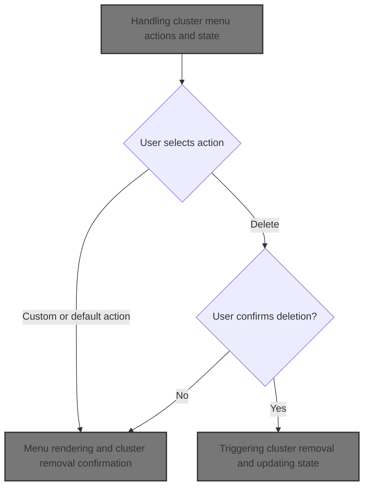

This document describes how users manage clusters using the cluster context menu. The menu allows users to view details, update settings, or delete clusters. When deleting, a confirmation dialog is shown, and upon confirmation, the cluster is removed from both backend and local configuration, with the application state updated.



# Handling cluster menu actions and state

<SwmSnippet path="/frontend/src/components/App/Home/ClusterContextMenu.tsx" line="46">

---

In <SwmToken path="frontend/src/components/App/Home/ClusterContextMenu.tsx" pos="46:6:6" line-data="export default function ClusterContextMenu({ cluster }: ClusterContextMenuProps) {">`ClusterContextMenu`</SwmToken>, we set up the menu UI and grab cluster-specific state from Redux, including dialogs and <SwmToken path="frontend/src/components/App/Home/ClusterContextMenu.tsx" pos="54:3:3" line-data="  const menuItems = useTypedSelector(state =&gt; state.clusterProvider.menuItems);">`menuItems`</SwmToken>. The function expects the cluster prop to have a <SwmToken path="frontend/src/components/App/Home/ClusterContextMenu.tsx" pos="56:9:9" line-data="  const kubeconfigOrigin = cluster.meta_data?.origin?.kubeconfig;">`meta_data`</SwmToken> object with fields like <SwmToken path="frontend/src/components/App/Home/ClusterContextMenu.tsx" pos="60:3:3" line-data="    const clusterID = cluster.meta_data?.clusterID;">`clusterID`</SwmToken>, <SwmToken path="frontend/src/components/App/Home/ClusterContextMenu.tsx" pos="61:3:3" line-data="    const originalName = cluster.meta_data?.originalName ?? &#39;&#39;;">`originalName`</SwmToken>, and source. When a user triggers a delete, we need to call <SwmToken path="frontend/src/components/App/Home/ClusterContextMenu.tsx" pos="64:1:1" line-data="    deleteCluster(clusterName, deleteFromKubeconfig, clusterID, kubeconfigOrigin, originalName)">`deleteCluster`</SwmToken> from <SwmPath>[frontend/…/v1/clusterApi.ts](frontend/src/lib/k8s/api/v1/clusterApi.ts)</SwmPath> next, because that's where the logic for actually removing the cluster (from both backend and kubeconfig) lives. This separation keeps UI concerns here and deletion logic in the API layer.

```tsx
export default function ClusterContextMenu({ cluster }: ClusterContextMenuProps) {
  const { t } = useTranslation(['translation']);
  const history = useHistory();
  const dispatch = useDispatch();
  const [anchorEl, setAnchorEl] = React.useState<null | HTMLElement>(null);
  const menuId = useId('context-menu');
  const [openConfirmDialog, setOpenConfirmDialog] = React.useState<string | null>(null);
  const dialogs = useTypedSelector(state => state.clusterProvider.dialogs);
  const menuItems = useTypedSelector(state => state.clusterProvider.menuItems);

  const kubeconfigOrigin = cluster.meta_data?.origin?.kubeconfig;
  const deleteFromKubeconfig = cluster.meta_data?.source === 'kubeconfig';

  function removeCluster(cluster: Cluster) {
    const clusterID = cluster.meta_data?.clusterID;
    const originalName = cluster.meta_data?.originalName ?? '';
    const clusterName = cluster.name;

    deleteCluster(clusterName, deleteFromKubeconfig, clusterID, kubeconfigOrigin, originalName)
      .then(config => {
```

---

</SwmSnippet>

## Cluster deletion logic and kubeconfig cleanup

```mermaid
%%{init: {"flowchart": {"defaultRenderer": "elk"}} }%%
flowchart TD
  node1["Request to delete cluster"] --> node2{"Is this a non-dynamic cluster?"}
  click node1 openCode "frontend/src/lib/k8s/api/v1/clusterApi.ts:105:122"
  node2 -->|"Yes"| node3["Delete using original name and kubeconfig info"]
  click node2 openCode "frontend/src/lib/k8s/api/v1/clusterApi.ts:122:126"
  node2 -->|"No"| node4["Delete using standard method"]
  click node3 openCode "frontend/src/lib/k8s/api/v1/clusterApi.ts:126:129"
  click node4 openCode "frontend/src/lib/k8s/api/v1/clusterApi.ts:126:129"
  node3 --> node5{"Does cluster exist in configuration?"}
  node4 --> node5
  click node5 openCode "frontend/src/lib/k8s/api/v1/clusterApi.ts:131:138"
  node5 -->|"Yes"| node6{"Is kubeconfig found?"}
  node5 -->|"No"| node8["Return empty cluster list"]
  click node6 openCode "frontend/src/lib/k8s/api/v1/clusterApi.ts:132:137"
  node6 -->|"Yes"| node7["Remove kubeconfig, reload, and return empty cluster list"]
  node6 -->|"No"| node8
  click node7 openCode "frontend/src/lib/k8s/api/v1/clusterApi.ts:134:137"
  node7 --> node8
  node8["Return empty cluster list"]
  click node8 openCode "frontend/src/lib/k8s/api/v1/clusterApi.ts:137:138"
classDef HeadingStyle fill:#777777,stroke:#333,stroke-width:2px;

%% Swimm:
%% %%{init: {"flowchart": {"defaultRenderer": "elk"}} }%%
%% flowchart TD
%%   node1["Request to delete cluster"] --> node2{"Is this a <SwmToken path="frontend/src/lib/k8s/api/v1/clusterApi.ts" pos="99:33:35" line-data=" * Note: Currently, the use for the optional clusterID is only for the clusterID for non-dynamic clusters.">`non-dynamic`</SwmToken> cluster?"}
%%   click node1 openCode "<SwmPath>[frontend/…/v1/clusterApi.ts](frontend/src/lib/k8s/api/v1/clusterApi.ts)</SwmPath>:105:122"
%%   node2 -->|"Yes"| node3["Delete using original name and kubeconfig info"]
%%   click node2 openCode "<SwmPath>[frontend/…/v1/clusterApi.ts](frontend/src/lib/k8s/api/v1/clusterApi.ts)</SwmPath>:122:126"
%%   node2 -->|"No"| node4["Delete using standard method"]
%%   click node3 openCode "<SwmPath>[frontend/…/v1/clusterApi.ts](frontend/src/lib/k8s/api/v1/clusterApi.ts)</SwmPath>:126:129"
%%   click node4 openCode "<SwmPath>[frontend/…/v1/clusterApi.ts](frontend/src/lib/k8s/api/v1/clusterApi.ts)</SwmPath>:126:129"
%%   node3 --> node5{"Does cluster exist in configuration?"}
%%   node4 --> node5
%%   click node5 openCode "<SwmPath>[frontend/…/v1/clusterApi.ts](frontend/src/lib/k8s/api/v1/clusterApi.ts)</SwmPath>:131:138"
%%   node5 -->|"Yes"| node6{"Is kubeconfig found?"}
%%   node5 -->|"No"| node8["Return empty cluster list"]
%%   click node6 openCode "<SwmPath>[frontend/…/v1/clusterApi.ts](frontend/src/lib/k8s/api/v1/clusterApi.ts)</SwmPath>:132:137"
%%   node6 -->|"Yes"| node7["Remove kubeconfig, reload, and return empty cluster list"]
%%   node6 -->|"No"| node8
%%   click node7 openCode "<SwmPath>[frontend/…/v1/clusterApi.ts](frontend/src/lib/k8s/api/v1/clusterApi.ts)</SwmPath>:134:137"
%%   node7 --> node8
%%   node8["Return empty cluster list"]
%%   click node8 openCode "<SwmPath>[frontend/…/v1/clusterApi.ts](frontend/src/lib/k8s/api/v1/clusterApi.ts)</SwmPath>:137:138"
%% classDef HeadingStyle fill:#777777,stroke:#333,stroke-width:2px;
```



<SwmSnippet path="/frontend/src/lib/k8s/api/v1/clusterApi.ts" line="105">

---

In <SwmToken path="frontend/src/lib/k8s/api/v1/clusterApi.ts" pos="105:6:6" line-data="export async function deleteCluster(">`deleteCluster`</SwmToken>, we figure out the right URL for deletion based on <SwmToken path="frontend/src/lib/k8s/api/v1/clusterApi.ts" pos="111:1:1" line-data="  clusterID?: string,">`clusterID`</SwmToken>, <SwmToken path="frontend/src/lib/k8s/api/v1/clusterApi.ts" pos="115:1:1" line-data="  originalName?: string">`originalName`</SwmToken>, and <SwmToken path="frontend/src/lib/k8s/api/v1/clusterApi.ts" pos="109:1:1" line-data="  removeKubeConfig?: boolean,">`removeKubeConfig`</SwmToken>. Before hitting the backend, we check if the cluster exists in the local kubeconfig. If it does, we call <SwmToken path="frontend/src/lib/k8s/api/v1/clusterApi.ts" pos="134:3:3" line-data="      await deleteClusterKubeconfig(cluster, clusterID);">`deleteClusterKubeconfig`</SwmToken> to remove it from <SwmToken path="frontend/src/stateless/deleteClusterKubeconfig.ts" pos="121:12:12" line-data="              console.log(&#39;Kubeconfig deleted from IndexedDB&#39;);">`IndexedDB`</SwmToken> and reload the page, skipping the backend delete. If not, we move on to the backend delete step.

```typescript
export async function deleteCluster(
  /** The name of the cluster to delete */
  cluster: string,
  /** Whether to remove the kubeconfig file associated with the cluster */
  removeKubeConfig?: boolean,
  /** The ID for a cluster, composed of the kubeconfig path and cluster name */
  clusterID?: string,
  // /** The origin of the cluster, e.g., kubeconfig path */
  kubeconfigOrigin?: string,
  // /** The original name of the cluster, used for kubeconfig clusters */
  originalName?: string
): Promise<{ clusters: ConfigState['clusters'] }> {
  let deleteURL;
  const removeFromKubeConfig = `${!!removeKubeConfig}`; // Convert boolean to string for URL parameter

  // If the clusterID exists and the originalName is provided, and removeKubeConfig is true,
  // the cluster is non dynamic and we need to construct the URL differently to ensure the correct parameters are passed.
  if (clusterID && originalName && removeKubeConfig) {
    // for non dynamic clusters, we need to use the original name as a query parameter to find the actual context in the kubeconfig
    // and remove it from the kubeconfig file.
    deleteURL = `/cluster/${cluster}?removeKubeConfig=${removeFromKubeConfig}&clusterID=${clusterID}&configPath=${kubeconfigOrigin}&originalName=${originalName}`;
  } else {
    // for other clusters we can use the standard delete URL.
    deleteURL = `/cluster/${cluster}`;
  }

  if (cluster) {
    const kubeconfig = await findKubeconfigByClusterName(cluster, clusterID);
    if (kubeconfig !== null) {
      await deleteClusterKubeconfig(cluster, clusterID);
      window.location.reload();
      return { clusters: {} };
    }
  }

```

---

</SwmSnippet>

<SwmSnippet path="/frontend/src/stateless/deleteClusterKubeconfig.ts" line="33">

---

<SwmToken path="frontend/src/stateless/deleteClusterKubeconfig.ts" pos="33:6:6" line-data="export async function deleteClusterKubeconfig(">`deleteClusterKubeconfig`</SwmToken> opens the kubeconfigs <SwmToken path="frontend/src/stateless/deleteClusterKubeconfig.ts" pos="121:12:12" line-data="              console.log(&#39;Kubeconfig deleted from IndexedDB&#39;);">`IndexedDB`</SwmToken>, decodes and parses each kubeconfig, finds the matching context by <SwmToken path="frontend/src/stateless/deleteClusterKubeconfig.ts" pos="34:1:1" line-data="  clusterName: string,">`clusterName`</SwmToken> and <SwmToken path="frontend/src/stateless/deleteClusterKubeconfig.ts" pos="35:1:1" line-data="  clusterID?: string">`clusterID`</SwmToken>, and removes it. It also updates or deletes the entry depending on whether any contexts remain, and cleans up <SwmToken path="frontend/src/stateless/deleteClusterKubeconfig.ts" pos="99:7:9" line-data="          // determine what clusters/users are still referenced by remaining contexts">`clusters/users`</SwmToken> that aren't referenced anymore. This is more involved than just deleting a key, since kubeconfigs can have multiple contexts.

```typescript
export async function deleteClusterKubeconfig(
  clusterName: string,
  clusterID?: string
): Promise<string | null> {
  return new Promise<string | null>(async (resolve, reject) => {
    try {
      const request = indexedDB.open('kubeconfigs', 1) as any;

      // The onupgradeneeded event is fired when the database is created for the first time.
      request.onupgradeneeded = handleDatabaseUpgrade;

      // The onsuccess event is fired when the database is opened.
      // This event is where you specify the actions to take when the database is opened.
      request.onsuccess = function handleDatabaseSuccess(event: DatabaseEvent) {
        const db = event.target.result;
        const transaction = db.transaction(['kubeconfigStore'], 'readwrite');
        const store = transaction.objectStore('kubeconfigStore');

        // The onsuccess event is fired when the request has succeeded.
        // This is where you handle the results of the request.
        // The result is the cursor. It is used to iterate through the object store.
        // The cursor is null when there are no more objects to iterate through.
        // The cursor is used to find the kubeconfig by cluster name.
        store.openCursor().onsuccess = function storeSuccess(event: Event) {
          // delete the kubeconfig by cluster name
          const successEvent = event as CursorSuccessEvent;
          const cursor = successEvent.target.result;

          // when we do not find a cursor, we resolve with null
          if (!cursor) {
            resolve(null);
            return;
          }

          const row = cursor.value;
          const kubeconfig64 = row.kubeconfig;
          const parsed = jsyaml.load(atob(kubeconfig64)) as KubeconfigObject;

          const { matchingKubeconfig, matchingContext } = findMatchingContexts(
            clusterName,
            parsed,
            clusterID
          );

          // if neither a matching kubeconfig nor a matching context is found, continue to the next cursor
          if (!matchingKubeconfig && !matchingContext) {
            cursor.continue();
            return;
          }

          // for matches found we compute the names we will delete
          const contextName = matchingContext?.name ?? matchingKubeconfig?.name ?? undefined;

          // remove only the matched context from the kubeconfig store
          parsed.contexts = (parsed.contexts || []).filter(context => context.name !== contextName);

          // if the context was the 'current-context' we just removed then we need to reset it
          if ((parsed as any)['current-context'] === contextName) {
            const nextContext = parsed.contexts && parsed.contexts[0]?.name;
            if (nextContext) {
              (parsed as any)['current-context'] = nextContext;
            } else {
              delete (parsed as any)['current-context'];
            }
          }

          // determine what clusters/users are still referenced by remaining contexts
          const remainingRefs = new Set<string>(
            (parsed.contexts || []).flatMap(c => {
              const arr: string[] = [];
              if (c.context.cluster) arr.push(c.context.cluster);
              if (c.context.user) arr.push(c.context.user);
              return arr;
            })
          );

          // clean up unreferenced clusters/users
          if (parsed.clusters) {
            parsed.clusters = parsed.clusters.filter(c => remainingRefs.has(c.name));
          }
          if (parsed.users) {
            parsed.users = parsed.users.filter(u => remainingRefs.has(u.name));
          }

          // if no contexts remain, delete the whole indexDB row
          if (!parsed.contexts || parsed.contexts.length === 0) {
            const deleteRequest = store.delete(cursor.key);
            deleteRequest.onsuccess = () => {
              console.log('Kubeconfig deleted from IndexedDB');
              resolve(kubeconfig64);
            };
            deleteRequest.onerror = () => {
              console.error('Error deleting kubeconfig from IndexedDB');
              reject('Error deleting kubeconfig from IndexedDB');
            };
            return;
          }

          // save the updated kubeconfig back to indexedDB
          const updatedKubeconfig64 = btoa(jsyaml.dump(parsed));
          const updatedRow = { ...row, kubeconfig: updatedKubeconfig64 };

          const putRequest = store.put(updatedRow);
          putRequest.onsuccess = () => {
            console.log('Kubeconfig updated in IndexedDB');
            resolve(kubeconfig64);
          };
          putRequest.onerror = () => {
            console.error('Error updating kubeconfig in IndexedDB');
            reject('Error updating kubeconfig in IndexedDB');
          };
        };
      };

      // The onerror event is fired when the database is opened.
      // This is where you handle errors.
      request.onerror = handleDataBaseError;
    } catch (error) {
      reject(error);
    }
  });
}
```

---

</SwmSnippet>

<SwmSnippet path="/frontend/src/lib/k8s/api/v1/clusterApi.ts" line="140">

---

After kubeconfig handling, <SwmToken path="frontend/src/components/App/Home/ClusterContextMenu.tsx" pos="64:1:1" line-data="    deleteCluster(clusterName, deleteFromKubeconfig, clusterID, kubeconfigOrigin, originalName)">`deleteCluster`</SwmToken> sends a DELETE request to the backend to finish the removal.

```typescript
  const headers = addBackstageAuthHeaders(JSON_HEADERS);
  return request(
    deleteURL,
    { method: 'DELETE', headers: { ...headers, ...getHeadlampAPIHeaders() } },
    false,
    false
  );
}
```

---

</SwmSnippet>

## Menu rendering and cluster removal confirmation

```mermaid
%%{init: {"flowchart": {"defaultRenderer": "elk"}} }%%
flowchart TD
    node1["Display cluster context menu"]
    click node1 openCode "frontend/src/components/App/Home/ClusterContextMenu.tsx:117:205"
    node1 --> node2{"Custom menu items exist?"}
    click node2 openCode "frontend/src/components/App/Home/ClusterContextMenu.tsx:156:158"
    node2 -->|"No"| node3{"Is Electron & cluster source is backend/pkg/kubeconfig?"}
    click node3 openCode "frontend/src/components/App/Home/ClusterContextMenu.tsx:157:159"
    node3 -->|"Yes"| node4["Show Delete option"]
    click node4 openCode "frontend/src/components/App/Home/ClusterContextMenu.tsx:160:167"
    node3 -->|"No"| node5["Show default actions (View, Settings)"]
    click node5 openCode "frontend/src/components/App/Home/ClusterContextMenu.tsx:140:155"
    node2 -->|"Yes"| loop1
    
    subgraph loop1["For each custom menu item"]
      node6["Render custom menu item"]
      click node6 openCode "frontend/src/components/App/Home/ClusterContextMenu.tsx:169:178"
    end
    loop1 --> node5
    node4 --> node7{"User selects Delete?"}
    click node7 openCode "frontend/src/components/App/Home/ClusterContextMenu.tsx:161:164"
    node7 -->|"Yes"| node8["Show confirmation dialog (openConfirmDialog = deleteDynamic)"]
    click node8 openCode "frontend/src/components/App/Home/ClusterContextMenu.tsx:180:190"
    node7 -->|"No"| node5
    node8 --> node9{"User confirms deletion?"}
    click node9 openCode "frontend/src/components/App/Home/ClusterContextMenu.tsx:184:187"
    node9 -->|"Yes"| node10["Remove cluster and close dialog"]
    click node10 openCode "frontend/src/components/App/Home/ClusterContextMenu.tsx:185:186"
    node9 -->|"No"| node5
    node5 --> node11{"Is openConfirmDialog not null?"}
    click node11 openCode "frontend/src/components/App/Home/ClusterContextMenu.tsx:191:203"
    node11 -->|"Yes"| loop2
    node11 -->|"No"| node12["Menu closed"]
    
    subgraph loop2["For each additional dialog"]
      node13["Render additional dialog"]
      click node13 openCode "frontend/src/components/App/Home/ClusterContextMenu.tsx:192:202"
    end
    loop2 --> node12
    click node12 openCode "frontend/src/components/App/Home/ClusterContextMenu.tsx:115:115"
classDef HeadingStyle fill:#777777,stroke:#333,stroke-width:2px;

%% Swimm:
%% %%{init: {"flowchart": {"defaultRenderer": "elk"}} }%%
%% flowchart TD
%%     node1["Display cluster context menu"]
%%     click node1 openCode "<SwmPath>[frontend/…/Home/ClusterContextMenu.tsx](frontend/src/components/App/Home/ClusterContextMenu.tsx)</SwmPath>:117:205"
%%     node1 --> node2{"Custom menu items exist?"}
%%     click node2 openCode "<SwmPath>[frontend/…/Home/ClusterContextMenu.tsx](frontend/src/components/App/Home/ClusterContextMenu.tsx)</SwmPath>:156:158"
%%     node2 -->|"No"| node3{"Is Electron & cluster source is <SwmPath>[backend/pkg/kubeconfig/](backend/pkg/kubeconfig/)</SwmPath>?"}
%%     click node3 openCode "<SwmPath>[frontend/…/Home/ClusterContextMenu.tsx](frontend/src/components/App/Home/ClusterContextMenu.tsx)</SwmPath>:157:159"
%%     node3 -->|"Yes"| node4["Show Delete option"]
%%     click node4 openCode "<SwmPath>[frontend/…/Home/ClusterContextMenu.tsx](frontend/src/components/App/Home/ClusterContextMenu.tsx)</SwmPath>:160:167"
%%     node3 -->|"No"| node5["Show default actions (View, Settings)"]
%%     click node5 openCode "<SwmPath>[frontend/…/Home/ClusterContextMenu.tsx](frontend/src/components/App/Home/ClusterContextMenu.tsx)</SwmPath>:140:155"
%%     node2 -->|"Yes"| loop1
%%     
%%     subgraph loop1["For each custom menu item"]
%%       node6["Render custom menu item"]
%%       click node6 openCode "<SwmPath>[frontend/…/Home/ClusterContextMenu.tsx](frontend/src/components/App/Home/ClusterContextMenu.tsx)</SwmPath>:169:178"
%%     end
%%     loop1 --> node5
%%     node4 --> node7{"User selects Delete?"}
%%     click node7 openCode "<SwmPath>[frontend/…/Home/ClusterContextMenu.tsx](frontend/src/components/App/Home/ClusterContextMenu.tsx)</SwmPath>:161:164"
%%     node7 -->|"Yes"| node8["Show confirmation dialog (<SwmToken path="frontend/src/components/App/Home/ClusterContextMenu.tsx" pos="52:4:4" line-data="  const [openConfirmDialog, setOpenConfirmDialog] = React.useState&lt;string | null&gt;(null);">`openConfirmDialog`</SwmToken> = <SwmToken path="frontend/src/components/App/Home/ClusterContextMenu.tsx" pos="162:4:4" line-data="                setOpenConfirmDialog(&#39;deleteDynamic&#39;);">`deleteDynamic`</SwmToken>)"]
%%     click node8 openCode "<SwmPath>[frontend/…/Home/ClusterContextMenu.tsx](frontend/src/components/App/Home/ClusterContextMenu.tsx)</SwmPath>:180:190"
%%     node7 -->|"No"| node5
%%     node8 --> node9{"User confirms deletion?"}
%%     click node9 openCode "<SwmPath>[frontend/…/Home/ClusterContextMenu.tsx](frontend/src/components/App/Home/ClusterContextMenu.tsx)</SwmPath>:184:187"
%%     node9 -->|"Yes"| node10["Remove cluster and close dialog"]
%%     click node10 openCode "<SwmPath>[frontend/…/Home/ClusterContextMenu.tsx](frontend/src/components/App/Home/ClusterContextMenu.tsx)</SwmPath>:185:186"
%%     node9 -->|"No"| node5
%%     node5 --> node11{"Is <SwmToken path="frontend/src/components/App/Home/ClusterContextMenu.tsx" pos="52:4:4" line-data="  const [openConfirmDialog, setOpenConfirmDialog] = React.useState&lt;string | null&gt;(null);">`openConfirmDialog`</SwmToken> not null?"}
%%     click node11 openCode "<SwmPath>[frontend/…/Home/ClusterContextMenu.tsx](frontend/src/components/App/Home/ClusterContextMenu.tsx)</SwmPath>:191:203"
%%     node11 -->|"Yes"| loop2
%%     node11 -->|"No"| node12["Menu closed"]
%%     
%%     subgraph loop2["For each additional dialog"]
%%       node13["Render additional dialog"]
%%       click node13 openCode "<SwmPath>[frontend/…/Home/ClusterContextMenu.tsx](frontend/src/components/App/Home/ClusterContextMenu.tsx)</SwmPath>:192:202"
%%     end
%%     loop2 --> node12
%%     click node12 openCode "<SwmPath>[frontend/…/Home/ClusterContextMenu.tsx](frontend/src/components/App/Home/ClusterContextMenu.tsx)</SwmPath>:115:115"
%% classDef HeadingStyle fill:#777777,stroke:#333,stroke-width:2px;
```



<SwmSnippet path="/frontend/src/components/App/Home/ClusterContextMenu.tsx" line="66">

---

After returning from <SwmToken path="frontend/src/components/App/Home/ClusterContextMenu.tsx" pos="64:1:1" line-data="    deleteCluster(clusterName, deleteFromKubeconfig, clusterID, kubeconfigOrigin, originalName)">`deleteCluster`</SwmToken> (<SwmPath>[frontend/…/v1/clusterApi.ts](frontend/src/lib/k8s/api/v1/clusterApi.ts)</SwmPath>), <SwmToken path="frontend/src/components/App/Home/ClusterContextMenu.tsx" pos="46:6:6" line-data="export default function ClusterContextMenu({ cluster }: ClusterContextMenuProps) {">`ClusterContextMenu`</SwmToken> renders the menu and confirmation dialogs. The 'Delete' option is only shown if there are no extra <SwmToken path="frontend/src/components/App/Home/ClusterContextMenu.tsx" pos="156:4:4" line-data="        {(!menuItems || menuItems.length === 0) &amp;&amp;">`menuItems`</SwmToken>, we're in Electron, and the cluster source is right. When confirmed, <SwmToken path="frontend/src/components/App/Home/ClusterContextMenu.tsx" pos="186:1:1" line-data="          removeCluster(cluster);">`removeCluster`</SwmToken> is called to actually start the deletion process.

```tsx
        dispatch(setConfig(config));
      })
      .catch((err: Error) => {
        if (err.message === 'Not Found') {
          // TODO: create notification with error message
        }
      })
      .finally(() => {
        history.push('/');
      });
  }

  function removeClusterDescription(cluster: Cluster) {
    const description = deleteFromKubeconfig
      ? t('translation|This action will delete cluster "{{ clusterName }}" from "{{ source }}"', {
          clusterName: cluster.name,
          source: kubeconfigOrigin,
        })
      : t('translation|This action will remove cluster "{{ clusterName }}".', {
          clusterName: cluster.name,
        });

    const removeFromKubeconfigDes = deleteFromKubeconfig
      ? t('translation|This action cannot be undone! Do you want to proceed?')
      : t('translation|Remove this cluster?');

    return (
      <>
        {description}
        {removeFromKubeconfigDes && (
          <Box
            sx={{
              display: 'flex',
              alignItems: 'center',
              marginTop: '1rem',
              marginBottom: '1rem',
            }}
          >
            <DialogContentText id="alert-dialog-description">
              {removeFromKubeconfigDes}
            </DialogContentText>
          </Box>
        )}
      </>
    );
  }

  function handleMenuClose() {
    setAnchorEl(null);
  }

  return (
    <>
      <Tooltip title={t('Actions')}>
        <IconButton
          size="small"
          onClick={event => {
            setAnchorEl(event.currentTarget);
          }}
          aria-haspopup="menu"
          aria-controls={menuId}
          aria-label={t('Actions')}
        >
          <Icon icon="mdi:more-vert" />
        </IconButton>
      </Tooltip>
      <Menu
        id={menuId}
        anchorEl={anchorEl}
        open={Boolean(anchorEl)}
        onClose={() => {
          handleMenuClose();
        }}
      >
        <MenuItem
          onClick={() => {
            history.push(createRouteURL('cluster', { cluster: cluster.name }));
            handleMenuClose();
          }}
        >
          <ListItemText>{t('translation|View')}</ListItemText>
        </MenuItem>
        <MenuItem
          onClick={() => {
            history.push(createRouteURL('settingsCluster', { cluster: cluster.name }));
            handleMenuClose();
          }}
        >
          <ListItemText>{t('translation|Settings')}</ListItemText>
        </MenuItem>
        {(!menuItems || menuItems.length === 0) &&
          helpers.isElectron() &&
          (cluster.meta_data?.source === 'dynamic_cluster' ||
            cluster.meta_data?.source === 'kubeconfig') && (
            <MenuItem
              onClick={() => {
                setOpenConfirmDialog('deleteDynamic');
                handleMenuClose();
              }}
            >
              <ListItemText>{t('translation|Delete')}</ListItemText>
            </MenuItem>
          )}
        {menuItems.map((Item, index) => {
          return (
            <Item
              cluster={cluster}
              setOpenConfirmDialog={setOpenConfirmDialog}
              handleMenuClose={handleMenuClose}
              key={index}
            />
          );
        })}
      </Menu>
      <ConfirmDialog
        open={openConfirmDialog === 'deleteDynamic'}
        handleClose={() => setOpenConfirmDialog('')}
        confirmLabel={t('translation|Delete')}
        onConfirm={() => {
          setOpenConfirmDialog('');
          removeCluster(cluster);
        }}
        title={t('translation|Delete Cluster')}
        description={removeClusterDescription(cluster)}
      />
      {openConfirmDialog !== null &&
        dialogs.map((Dialog, index) => {
          return (
            <ErrorBoundary>
              <Dialog
                cluster={cluster}
                openConfirmDialog={openConfirmDialog}
                setOpenConfirmDialog={setOpenConfirmDialog}
                key={index}
              />
            </ErrorBoundary>
          );
        })}
    </>
  );
}
```

---

</SwmSnippet>

# Triggering cluster removal and updating state

```mermaid
%%{init: {"flowchart": {"defaultRenderer": "elk"}} }%%
flowchart TD
    node1["User requests to remove a cluster (name, ID)"] --> node2["Remove cluster from application"]
    click node1 openCode "frontend/src/components/App/Home/ClusterContextMenu.tsx:59:63"
    click node2 openCode "frontend/src/components/App/Home/ClusterContextMenu.tsx:64:65"
    node2 --> node3{"Was the cluster found and removed?"}
    click node3 openCode "frontend/src/components/App/Home/ClusterContextMenu.tsx:68:69"
    node3 -->|"Yes"| node4["Update configuration"]
    click node4 openCode "frontend/src/components/App/Home/ClusterContextMenu.tsx:66:67"
    node3 -->|"No ('Not Found')"| node5["No action (notification planned)"]
    click node5 openCode "frontend/src/components/App/Home/ClusterContextMenu.tsx:70:71"
    node4 --> node6["Navigate to home"]
    node5 --> node6
    click node6 openCode "frontend/src/components/App/Home/ClusterContextMenu.tsx:74:75"

classDef HeadingStyle fill:#777777,stroke:#333,stroke-width:2px;

%% Swimm:
%% %%{init: {"flowchart": {"defaultRenderer": "elk"}} }%%
%% flowchart TD
%%     node1["User requests to remove a cluster (name, ID)"] --> node2["Remove cluster from application"]
%%     click node1 openCode "<SwmPath>[frontend/…/Home/ClusterContextMenu.tsx](frontend/src/components/App/Home/ClusterContextMenu.tsx)</SwmPath>:59:63"
%%     click node2 openCode "<SwmPath>[frontend/…/Home/ClusterContextMenu.tsx](frontend/src/components/App/Home/ClusterContextMenu.tsx)</SwmPath>:64:65"
%%     node2 --> node3{"Was the cluster found and removed?"}
%%     click node3 openCode "<SwmPath>[frontend/…/Home/ClusterContextMenu.tsx](frontend/src/components/App/Home/ClusterContextMenu.tsx)</SwmPath>:68:69"
%%     node3 -->|"Yes"| node4["Update configuration"]
%%     click node4 openCode "<SwmPath>[frontend/…/Home/ClusterContextMenu.tsx](frontend/src/components/App/Home/ClusterContextMenu.tsx)</SwmPath>:66:67"
%%     node3 -->|"No ('Not Found')"| node5["No action (notification planned)"]
%%     click node5 openCode "<SwmPath>[frontend/…/Home/ClusterContextMenu.tsx](frontend/src/components/App/Home/ClusterContextMenu.tsx)</SwmPath>:70:71"
%%     node4 --> node6["Navigate to home"]
%%     node5 --> node6
%%     click node6 openCode "<SwmPath>[frontend/…/Home/ClusterContextMenu.tsx](frontend/src/components/App/Home/ClusterContextMenu.tsx)</SwmPath>:74:75"
%% 
%% classDef HeadingStyle fill:#777777,stroke:#333,stroke-width:2px;
```



<SwmSnippet path="/frontend/src/components/App/Home/ClusterContextMenu.tsx" line="59">

---

In <SwmToken path="frontend/src/components/App/Home/ClusterContextMenu.tsx" pos="59:3:3" line-data="  function removeCluster(cluster: Cluster) {">`removeCluster`</SwmToken>, we grab <SwmToken path="frontend/src/components/App/Home/ClusterContextMenu.tsx" pos="60:3:3" line-data="    const clusterID = cluster.meta_data?.clusterID;">`clusterID`</SwmToken>, <SwmToken path="frontend/src/components/App/Home/ClusterContextMenu.tsx" pos="61:3:3" line-data="    const originalName = cluster.meta_data?.originalName ?? &#39;&#39;;">`originalName`</SwmToken>, and <SwmToken path="frontend/src/components/App/Home/ClusterContextMenu.tsx" pos="62:3:3" line-data="    const clusterName = cluster.name;">`clusterName`</SwmToken> from the cluster's <SwmToken path="frontend/src/components/App/Home/ClusterContextMenu.tsx" pos="60:9:9" line-data="    const clusterID = cluster.meta_data?.clusterID;">`meta_data`</SwmToken>, then call <SwmToken path="frontend/src/components/App/Home/ClusterContextMenu.tsx" pos="64:1:1" line-data="    deleteCluster(clusterName, deleteFromKubeconfig, clusterID, kubeconfigOrigin, originalName)">`deleteCluster`</SwmToken> with those plus some external variables. This kicks off the actual deletion logic in <SwmPath>[frontend/…/v1/clusterApi.ts](frontend/src/lib/k8s/api/v1/clusterApi.ts)</SwmPath>, which handles both backend and kubeconfig removal.

```tsx
  function removeCluster(cluster: Cluster) {
    const clusterID = cluster.meta_data?.clusterID;
    const originalName = cluster.meta_data?.originalName ?? '';
    const clusterName = cluster.name;

    deleteCluster(clusterName, deleteFromKubeconfig, clusterID, kubeconfigOrigin, originalName)
      .then(config => {
```

---

</SwmSnippet>

<SwmSnippet path="/frontend/src/components/App/Home/ClusterContextMenu.tsx" line="66">

---

After returning from <SwmToken path="frontend/src/components/App/Home/ClusterContextMenu.tsx" pos="64:1:1" line-data="    deleteCluster(clusterName, deleteFromKubeconfig, clusterID, kubeconfigOrigin, originalName)">`deleteCluster`</SwmToken> (<SwmPath>[frontend/…/v1/clusterApi.ts](frontend/src/lib/k8s/api/v1/clusterApi.ts)</SwmPath>), <SwmToken path="frontend/src/components/App/Home/ClusterContextMenu.tsx" pos="59:3:3" line-data="  function removeCluster(cluster: Cluster) {">`removeCluster`</SwmToken> updates the Redux state with the new config, handles 'Not Found' errors (though notification is still TODO), and finally navigates the user to the home page to reflect the change.

```tsx
        dispatch(setConfig(config));
      })
      .catch((err: Error) => {
        if (err.message === 'Not Found') {
          // TODO: create notification with error message
        }
      })
      .finally(() => {
        history.push('/');
      });
  }
```

---

</SwmSnippet>

&nbsp;

*This is an auto-generated document by Swimm 🌊 and has not yet been verified by a human*

<SwmMeta version="3.0.0" repo-id="Z2l0aHViJTNBJTNBdHlwZXNjcmlwdC1oZWFkbGFtcCUzQSUzQXJpY2FyZG9sb3Blemc=" repo-name="typescript-headlamp"><sup>Powered by [Swimm](https://app.swimm.io/)</sup></SwmMeta>
