This document outlines how the system manages Kubernetes contexts by processing a kubeconfig file received from an external service. The flow splits the kubeconfig into individual context-specific entries and stores each one separately, replacing or deleting outdated entries as needed.

# Where is this flow used?

This flow is used multiple times in the codebase as represented in the following diagram:

```mermaid
graph TD;
      314c3051a79bb1da9a55915038ec28572e269b6d8abf356575f68b3b22e25bff(frontend/…/helpers/backstageMessageReceiver.ts::setupBackstageMessageReceiver) --> d4373aa13327571325a53125cf22991824d3a913cd49c19c961557c372cc4b4a(frontend/…/helpers/backstageMessageReceiver.ts::storeKubeconfigFromBackstage):::mainFlowStyle

e632ac44f146477e89169e3d6190cf013adc9f0ae967eb58c42fe4ec48e3aa87(frontend/…/404/index.tsx::HomeComponent) --> 314c3051a79bb1da9a55915038ec28572e269b6d8abf356575f68b3b22e25bff(frontend/…/helpers/backstageMessageReceiver.ts::setupBackstageMessageReceiver)

8f34a2d532365e4e326ee83a229802e63af49b5d9f63434b803d9ca7c8dc1b7f(frontend/…/helpers/backstageMessageReceiver.ts::handleMessage) --> d4373aa13327571325a53125cf22991824d3a913cd49c19c961557c372cc4b4a(frontend/…/helpers/backstageMessageReceiver.ts::storeKubeconfigFromBackstage):::mainFlowStyle


classDef mainFlowStyle color:#000000,fill:#7CB9F4
classDef rootsStyle color:#000000,fill:#00FFF4
classDef Style1 color:#000000,fill:#00FFAA
classDef Style2 color:#000000,fill:#FFFF00
classDef Style3 color:#000000,fill:#AA7CB9

%% Swimm:
%% graph TD;
%%       314c3051a79bb1da9a55915038ec28572e269b6d8abf356575f68b3b22e25bff(<SwmPath>[frontend/…/helpers/backstageMessageReceiver.ts](frontend/src/helpers/backstageMessageReceiver.ts)</SwmPath>::<SwmToken path="frontend/src/helpers/backstageMessageReceiver.ts" pos="109:3:3" line-data=" * setupBackstageMessageReceiver sets up a listener for messages from the backstage app">`setupBackstageMessageReceiver`</SwmToken>) --> d4373aa13327571325a53125cf22991824d3a913cd49c19c961557c372cc4b4a(<SwmPath>[frontend/…/helpers/backstageMessageReceiver.ts](frontend/src/helpers/backstageMessageReceiver.ts)</SwmPath>::<SwmToken path="frontend/src/helpers/backstageMessageReceiver.ts" pos="48:4:4" line-data="async function storeKubeconfigFromBackstage(kubeconfig: string) {">`storeKubeconfigFromBackstage`</SwmToken>):::mainFlowStyle
%% 
%% e632ac44f146477e89169e3d6190cf013adc9f0ae967eb58c42fe4ec48e3aa87(<SwmPath>[frontend/…/404/index.tsx](frontend/src/components/404/index.tsx)</SwmPath>::HomeComponent) --> 314c3051a79bb1da9a55915038ec28572e269b6d8abf356575f68b3b22e25bff(<SwmPath>[frontend/…/helpers/backstageMessageReceiver.ts](frontend/src/helpers/backstageMessageReceiver.ts)</SwmPath>::<SwmToken path="frontend/src/helpers/backstageMessageReceiver.ts" pos="109:3:3" line-data=" * setupBackstageMessageReceiver sets up a listener for messages from the backstage app">`setupBackstageMessageReceiver`</SwmToken>)
%% 
%% 8f34a2d532365e4e326ee83a229802e63af49b5d9f63434b803d9ca7c8dc1b7f(<SwmPath>[frontend/…/helpers/backstageMessageReceiver.ts](frontend/src/helpers/backstageMessageReceiver.ts)</SwmPath>::<SwmToken path="frontend/src/helpers/backstageMessageReceiver.ts" pos="118:3:3" line-data="    const handleMessage = async (event: MessageEvent) =&gt; {">`handleMessage`</SwmToken>) --> d4373aa13327571325a53125cf22991824d3a913cd49c19c961557c372cc4b4a(<SwmPath>[frontend/…/helpers/backstageMessageReceiver.ts](frontend/src/helpers/backstageMessageReceiver.ts)</SwmPath>::<SwmToken path="frontend/src/helpers/backstageMessageReceiver.ts" pos="48:4:4" line-data="async function storeKubeconfigFromBackstage(kubeconfig: string) {">`storeKubeconfigFromBackstage`</SwmToken>):::mainFlowStyle
%% 
%% 
%% classDef mainFlowStyle color:#000000,fill:#7CB9F4
%% classDef rootsStyle color:#000000,fill:#00FFF4
%% classDef Style1 color:#000000,fill:#00FFAA
%% classDef Style2 color:#000000,fill:#FFFF00
%% classDef Style3 color:#000000,fill:#AA7CB9
```



# Splitting and Storing Kubeconfigs by Context


<SwmSnippet path="/frontend/src/helpers/backstageMessageReceiver.ts" line="48">

---

<SwmToken path="frontend/src/helpers/backstageMessageReceiver.ts" pos="48:4:4" line-data="async function storeKubeconfigFromBackstage(kubeconfig: string) {">`storeKubeconfigFromBackstage`</SwmToken> kicks off the flow by decoding a <SwmToken path="frontend/src/helpers/backstageMessageReceiver.ts" pos="50:5:5" line-data="    // Decode base64 kubeconfig">`base64`</SwmToken> kubeconfig, parsing it as YAML, and then iterating over each context. For every context, it finds the matching cluster and user, builds a new kubeconfig containing only those, and stores each one separately by calling <SwmToken path="frontend/src/helpers/backstageMessageReceiver.ts" pos="84:3:5" line-data="        await statelessFunctions.findAndReplaceKubeconfig(context.name, newKubeconfigBase64, true);">`statelessFunctions.findAndReplaceKubeconfig`</SwmToken>. We call into <SwmPath>[frontend/…/stateless/index.ts](frontend/src/stateless/index.ts)</SwmPath> next because that's where the actual storage and replacement logic for each single-context kubeconfig lives. This lets us treat each context as its own unit for later updates or deletions.

```typescript
async function storeKubeconfigFromBackstage(kubeconfig: string) {
  try {
    // Decode base64 kubeconfig
    const decodedKubeconfig = atob(kubeconfig);
    const parsedKubeconfig = jsyaml.load(decodedKubeconfig) as KubeconfigObject;

    // For each context, create a new kubeconfig
    const promises = parsedKubeconfig.contexts.map(
      async (context: { name: string; context: { cluster: string; user: string } }) => {
        // Find the corresponding cluster and auth info
        const cluster = parsedKubeconfig.clusters.find(
          (c: { name: string }) => c.name === context.context.cluster
        );
        const authInfo = parsedKubeconfig.users.find(
          (u: { name: string }) => u.name === context.context.user
        );

        if (!cluster || !authInfo) {
          console.warn(`Missing cluster or auth info for context ${context.name}`);
          return;
        }

        // Create a new kubeconfig with just this context, cluster, and auth info
        const newKubeconfig: KubeconfigObject = {
          apiVersion: parsedKubeconfig.apiVersion,
          kind: parsedKubeconfig.kind,
          preferences: parsedKubeconfig.preferences,
          'current-context': context.name,
          contexts: [context],
          clusters: [cluster],
          users: [authInfo],
        };

        // Convert back to YAML and base64 encode
        const newKubeconfigYaml = jsyaml.dump(newKubeconfig, { lineWidth: -1 });
        const newKubeconfigBase64 = btoa(newKubeconfigYaml);
        await statelessFunctions.findAndReplaceKubeconfig(context.name, newKubeconfigBase64, true);
      }
    );
    console.log('Promises', promises);
    // Wait for all kubeconfig operations to complete
    await Promise.all(promises);
  } catch (error) {
    console.error('Error storing kubeconfig from backstage:', error);
  }
}
```

---

</SwmSnippet>

# Replacing or Deleting Existing Kubeconfigs


<SwmSnippet path="/frontend/src/stateless/index.ts" line="284">

---

In <SwmToken path="frontend/src/stateless/index.ts" pos="284:6:6" line-data="export async function findAndReplaceKubeconfig(">`findAndReplaceKubeconfig`</SwmToken>, we check if there's already a kubeconfig for the given cluster. If there is, we try to delete it first by calling <SwmToken path="frontend/src/stateless/index.ts" pos="298:3:3" line-data="        await deleteClusterKubeconfig(clusterName);">`deleteClusterKubeconfig`</SwmToken> before storing the new one. This avoids duplicates and keeps only the latest config for each cluster. We call into <SwmPath>[frontend/…/stateless/deleteClusterKubeconfig.ts](frontend/src/stateless/deleteClusterKubeconfig.ts)</SwmPath> next because that's where the <SwmToken path="frontend/src/stateless/deleteClusterKubeconfig.ts" pos="121:12:12" line-data="              console.log(&#39;Kubeconfig deleted from IndexedDB&#39;);">`IndexedDB`</SwmToken> cleanup happens.

```typescript
export async function findAndReplaceKubeconfig(
  clusterName: string,
  kubeconfig: string,
  create: boolean = false
): Promise<void> {
  try {
    // First try to find the existing kubeconfig
    const existingKubeconfig = await findKubeconfigByClusterName(clusterName);

    if (existingKubeconfig) {
      // If found, delete the old one
      // Note: If deletion fails, we continue with storing the new kubeconfig
      // to ensure the new configuration is applied
      try {
        await deleteClusterKubeconfig(clusterName);
      } catch (deleteError) {
        console.warn(
          `Failed to delete existing kubeconfig for cluster ${clusterName}, but continuing with replacement:`,
          deleteError
        );
      }
```

---

</SwmSnippet>

<SwmSnippet path="/frontend/src/stateless/deleteClusterKubeconfig.ts" line="33">

---

<SwmToken path="frontend/src/stateless/deleteClusterKubeconfig.ts" pos="33:6:6" line-data="export async function deleteClusterKubeconfig(">`deleteClusterKubeconfig`</SwmToken> opens the <SwmToken path="frontend/src/stateless/deleteClusterKubeconfig.ts" pos="121:12:12" line-data="              console.log(&#39;Kubeconfig deleted from IndexedDB&#39;);">`IndexedDB`</SwmToken>, iterates over all kubeconfigs, and for each one, decodes and parses the YAML. It uses a helper to find the context or kubeconfig matching the given cluster name (and optional ID), removes just that context, updates the <SwmToken path="frontend/src/stateless/deleteClusterKubeconfig.ts" pos="89:14:16" line-data="          // if the context was the &#39;current-context&#39; we just removed then we need to reset it">`current-context`</SwmToken> if needed, and cleans up any clusters or users that are no longer referenced. If no contexts remain, it deletes the whole entry; otherwise, it updates the entry with the modified kubeconfig.

```typescript
export async function deleteClusterKubeconfig(
  clusterName: string,
  clusterID?: string
): Promise<string | null> {
  return new Promise<string | null>(async (resolve, reject) => {
    try {
      const request = indexedDB.open('kubeconfigs', 1) as any;

      // The onupgradeneeded event is fired when the database is created for the first time.
      request.onupgradeneeded = handleDatabaseUpgrade;

      // The onsuccess event is fired when the database is opened.
      // This event is where you specify the actions to take when the database is opened.
      request.onsuccess = function handleDatabaseSuccess(event: DatabaseEvent) {
        const db = event.target.result;
        const transaction = db.transaction(['kubeconfigStore'], 'readwrite');
        const store = transaction.objectStore('kubeconfigStore');

        // The onsuccess event is fired when the request has succeeded.
        // This is where you handle the results of the request.
        // The result is the cursor. It is used to iterate through the object store.
        // The cursor is null when there are no more objects to iterate through.
        // The cursor is used to find the kubeconfig by cluster name.
        store.openCursor().onsuccess = function storeSuccess(event: Event) {
          // delete the kubeconfig by cluster name
          const successEvent = event as CursorSuccessEvent;
          const cursor = successEvent.target.result;

          // when we do not find a cursor, we resolve with null
          if (!cursor) {
            resolve(null);
            return;
          }

          const row = cursor.value;
          const kubeconfig64 = row.kubeconfig;
          const parsed = jsyaml.load(atob(kubeconfig64)) as KubeconfigObject;

          const { matchingKubeconfig, matchingContext } = findMatchingContexts(
            clusterName,
            parsed,
            clusterID
          );

          // if neither a matching kubeconfig nor a matching context is found, continue to the next cursor
          if (!matchingKubeconfig && !matchingContext) {
            cursor.continue();
            return;
          }

          // for matches found we compute the names we will delete
          const contextName = matchingContext?.name ?? matchingKubeconfig?.name ?? undefined;

          // remove only the matched context from the kubeconfig store
          parsed.contexts = (parsed.contexts || []).filter(context => context.name !== contextName);

          // if the context was the 'current-context' we just removed then we need to reset it
          if ((parsed as any)['current-context'] === contextName) {
            const nextContext = parsed.contexts && parsed.contexts[0]?.name;
            if (nextContext) {
              (parsed as any)['current-context'] = nextContext;
            } else {
              delete (parsed as any)['current-context'];
            }
          }

          // determine what clusters/users are still referenced by remaining contexts
          const remainingRefs = new Set<string>(
            (parsed.contexts || []).flatMap(c => {
              const arr: string[] = [];
              if (c.context.cluster) arr.push(c.context.cluster);
              if (c.context.user) arr.push(c.context.user);
              return arr;
            })
          );

          // clean up unreferenced clusters/users
          if (parsed.clusters) {
            parsed.clusters = parsed.clusters.filter(c => remainingRefs.has(c.name));
          }
          if (parsed.users) {
            parsed.users = parsed.users.filter(u => remainingRefs.has(u.name));
          }

          // if no contexts remain, delete the whole indexDB row
          if (!parsed.contexts || parsed.contexts.length === 0) {
            const deleteRequest = store.delete(cursor.key);
            deleteRequest.onsuccess = () => {
              console.log('Kubeconfig deleted from IndexedDB');
              resolve(kubeconfig64);
            };
            deleteRequest.onerror = () => {
              console.error('Error deleting kubeconfig from IndexedDB');
              reject('Error deleting kubeconfig from IndexedDB');
            };
            return;
          }

          // save the updated kubeconfig back to indexedDB
          const updatedKubeconfig64 = btoa(jsyaml.dump(parsed));
          const updatedRow = { ...row, kubeconfig: updatedKubeconfig64 };

          const putRequest = store.put(updatedRow);
          putRequest.onsuccess = () => {
            console.log('Kubeconfig updated in IndexedDB');
            resolve(kubeconfig64);
          };
          putRequest.onerror = () => {
            console.error('Error updating kubeconfig in IndexedDB');
            reject('Error updating kubeconfig in IndexedDB');
          };
        };
      };

      // The onerror event is fired when the database is opened.
      // This is where you handle errors.
      request.onerror = handleDataBaseError;
    } catch (error) {
      reject(error);
    }
  });
}
```

---

</SwmSnippet>

<SwmSnippet path="/frontend/src/stateless/index.ts" line="305">

---

Back in <SwmToken path="frontend/src/stateless/index.ts" pos="317:10:10" line-data="    console.error(&#39;Error in findAndReplaceKubeconfig:&#39;, error);">`findAndReplaceKubeconfig`</SwmToken>, after returning from <SwmToken path="frontend/src/stateless/index.ts" pos="298:3:3" line-data="        await deleteClusterKubeconfig(clusterName);">`deleteClusterKubeconfig`</SwmToken>, we store the new kubeconfig. If there was no existing kubeconfig and 'create' is true, we store it as a new entry. If 'create' is false and nothing existed, we throw an error. This keeps the storage logic consistent after cleanup.

```typescript
      // Store the new kubeconfig
      await storeStatelessClusterKubeconfig(kubeconfig);
    } else if (create) {
      // If not found and create is true, store the new kubeconfig
      await storeStatelessClusterKubeconfig(kubeconfig);
    } else {
      // If not found and create is false, throw error
      throw new Error(
        `No existing kubeconfig found for cluster ${clusterName} and create is false`
      );
    }
  } catch (error) {
    console.error('Error in findAndReplaceKubeconfig:', error);
    throw error;
  }
}
```

---

</SwmSnippet>

&nbsp;

*This is an auto-generated document by Swimm 🌊 and has not yet been verified by a human*

<SwmMeta version="3.0.0" repo-id="Z2l0aHViJTNBJTNBdHlwZXNjcmlwdC1oZWFkbGFtcCUzQSUzQXJpY2FyZG9sb3Blemc=" repo-name="typescript-headlamp"><sup>Powered by [Swimm](https://app.swimm.io/)</sup></SwmMeta>
