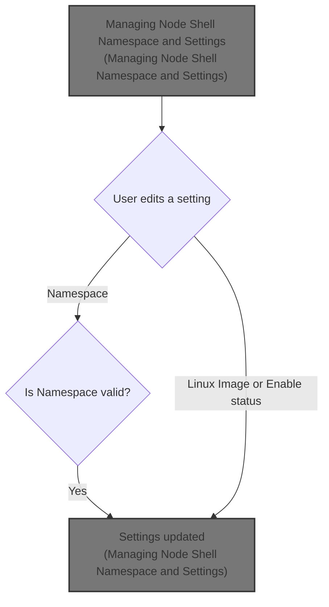

This document describes how users manage Node Shell settings for a cluster, including editing the namespace, Linux image, and enable status. Users interact with the settings panel to update these values, and changes are validated and saved to the cluster configuration.



# Managing Node Shell Namespace and Settings

```mermaid
%%{init: {"flowchart": {"defaultRenderer": "elk"}} }%%
flowchart TD
  node1["Load and display Node Shell settings for cluster"]
  click node1 openCode "frontend/src/components/App/Settings/NodeShellSettings.tsx:45:56"
  node1 --> node2{"What does the user edit?"}
  click node2 openCode "frontend/src/components/App/Settings/NodeShellSettings.tsx:180:259"
  node2 -->|"Namespace"| node3{"Is Namespace valid?"}
  click node3 openCode "frontend/src/components/App/Settings/NodeShellSettings.tsx:79:82"
  node3 -->|"Yes"| node4["Save Namespace after short delay"]
  click node4 openCode "frontend/src/components/App/Settings/NodeShellSettings.tsx:143:160"
  node3 -->|"No"| node5["Show validation error for Namespace"]
  click node5 openCode "frontend/src/components/App/Settings/NodeShellSettings.tsx:238:243"
  node2 -->|"Linux Image"| node6["Save Linux Image after short delay"]
  click node6 openCode "frontend/src/components/App/Settings/NodeShellSettings.tsx:162:177"
  node2 -->|"Enable switch"| node7["Save Enable status immediately"]
  click node7 openCode "frontend/src/components/App/Settings/NodeShellSettings.tsx:185:192"
  node4 --> node1
  node5 --> node1
  node6 --> node1
  node7 --> node1
classDef HeadingStyle fill:#777777,stroke:#333,stroke-width:2px;

%% Swimm:
%% %%{init: {"flowchart": {"defaultRenderer": "elk"}} }%%
%% flowchart TD
%%   node1["Load and display Node Shell settings for cluster"]
%%   click node1 openCode "<SwmPath>[frontend/…/Settings/NodeShellSettings.tsx](frontend/src/components/App/Settings/NodeShellSettings.tsx)</SwmPath>:45:56"
%%   node1 --> node2{"What does the user edit?"}
%%   click node2 openCode "<SwmPath>[frontend/…/Settings/NodeShellSettings.tsx](frontend/src/components/App/Settings/NodeShellSettings.tsx)</SwmPath>:180:259"
%%   node2 -->|"Namespace"| node3{"Is Namespace valid?"}
%%   click node3 openCode "<SwmPath>[frontend/…/Settings/NodeShellSettings.tsx](frontend/src/components/App/Settings/NodeShellSettings.tsx)</SwmPath>:79:82"
%%   node3 -->|"Yes"| node4["Save Namespace after short delay"]
%%   click node4 openCode "<SwmPath>[frontend/…/Settings/NodeShellSettings.tsx](frontend/src/components/App/Settings/NodeShellSettings.tsx)</SwmPath>:143:160"
%%   node3 -->|"No"| node5["Show validation error for Namespace"]
%%   click node5 openCode "<SwmPath>[frontend/…/Settings/NodeShellSettings.tsx](frontend/src/components/App/Settings/NodeShellSettings.tsx)</SwmPath>:238:243"
%%   node2 -->|"Linux Image"| node6["Save Linux Image after short delay"]
%%   click node6 openCode "<SwmPath>[frontend/…/Settings/NodeShellSettings.tsx](frontend/src/components/App/Settings/NodeShellSettings.tsx)</SwmPath>:162:177"
%%   node2 -->|"Enable switch"| node7["Save Enable status immediately"]
%%   click node7 openCode "<SwmPath>[frontend/…/Settings/NodeShellSettings.tsx](frontend/src/components/App/Settings/NodeShellSettings.tsx)</SwmPath>:185:192"
%%   node4 --> node1
%%   node5 --> node1
%%   node6 --> node1
%%   node7 --> node1
%% classDef HeadingStyle fill:#777777,stroke:#333,stroke-width:2px;
```



<SwmSnippet path="/frontend/src/components/App/Settings/NodeShellSettings.tsx" line="45">

---

In <SwmToken path="frontend/src/components/App/Settings/NodeShellSettings.tsx" pos="45:6:6" line-data="export default function NodeShellSettings(props: SettingsProps) {">`NodeShellSettings`</SwmToken>, we set up state for cluster settings, namespace, image, and enabled status, and sync them with the incoming cluster prop. We watch for changes and update the UI accordingly. The next step is to call <SwmToken path="frontend/src/components/App/Settings/NodeShellSettings.tsx" pos="92:3:3" line-data="  function storeNewNamespace(namespace: string) {">`storeNewNamespace`</SwmToken> when the user edits the namespace, which lets us persist the new value to the cluster settings after validating and handling any special cases. This is triggered by a debounced effect so we don't spam updates while the user is typing.

```tsx
export default function NodeShellSettings(props: SettingsProps) {
  const { cluster } = props;
  const { t } = useTranslation(['translation']);
  const theme = useTheme();
  const [clusterSettings, setClusterSettings] = useState<ClusterSettings | null>(null);
  const [userNamespace, setUserNamespace] = useState('');
  const [userImage, setUserImage] = useState('');
  const [userIsEnabled, setUserIsEnabled] = useState<boolean | null>(null);

  const nodeShellLabelID = 'node-shell-enabled-label';

  useEffect(() => {
    setClusterSettings(!!cluster ? loadClusterSettings(cluster || '') : null);
  }, [cluster]);

  useEffect(() => {
    if (clusterSettings?.nodeShellTerminal?.namespace !== userNamespace) {
      setUserNamespace(clusterSettings?.nodeShellTerminal?.namespace ?? '');
    }

    if (clusterSettings?.nodeShellTerminal?.linuxImage !== userImage) {
      setUserImage(clusterSettings?.nodeShellTerminal?.linuxImage ?? '');
    }

    setUserIsEnabled(clusterSettings?.nodeShellTerminal?.isEnabled ?? true);

    // Avoid re-initializing settings as {} just because the cluster is not yet set.
    if (clusterSettings !== null) {
      storeClusterSettings(cluster || '', clusterSettings);
    }
  }, [cluster, clusterSettings]);

  //const selectedClusterData = data?.[selectedCluster] || {};
  //const isEnabled = selectedClusterData.isEnabled ?? true;
  const isValidNamespace = isValidNamespaceFormat(userNamespace);
  const invalidNamespaceMessage = t(
    "translation|Namespaces must contain only lowercase alphanumeric characters or '-', and must start and end with an alphanumeric character."
  );

  function isEditingNamespace() {
    return clusterSettings?.nodeShellTerminal?.namespace !== userNamespace;
  }

  function isEditingImage() {
    return clusterSettings?.nodeShellTerminal?.linuxImage !== userImage;
  }

  function storeNewNamespace(namespace: string) {
    let actualNamespace = namespace;
    if (namespace === DEFAULT_NODE_SHELL_NAMESPACE) {
      actualNamespace = '';
      setUserNamespace(actualNamespace);
    }

    setClusterSettings((settings: ClusterSettings | null) => {
      const newSettings = { ...(settings || {}) };
      if (isValidNamespaceFormat(namespace)) {
        if (newSettings.nodeShellTerminal === null || newSettings.nodeShellTerminal === undefined) {
          newSettings.nodeShellTerminal = {};
        }
        newSettings.nodeShellTerminal.namespace = actualNamespace;
      }
      return newSettings;
    });
  }

  function storeNewImage(image: string) {
    let actualImage = image;
    if (image === DEFAULT_NODE_SHELL_LINUX_IMAGE) {
      actualImage = '';
      setUserImage(actualImage);
    }

    setClusterSettings((settings: ClusterSettings | null) => {
      const newSettings = { ...(settings || {}) };
      if (newSettings.nodeShellTerminal === null || newSettings.nodeShellTerminal === undefined) {
        newSettings.nodeShellTerminal = {};
      }
      newSettings.nodeShellTerminal.linuxImage = actualImage;

      return newSettings;
    });
  }

  function storeNewEnabled(enabled: boolean) {
    setUserIsEnabled(enabled);

    setClusterSettings((settings: ClusterSettings | null) => {
      const newSettings = { ...(settings || {}) };
      if (newSettings.nodeShellTerminal === null || newSettings.nodeShellTerminal === undefined) {
        newSettings.nodeShellTerminal = {};
      }
      newSettings.nodeShellTerminal.isEnabled = enabled;

      return newSettings;
    });
  }

  useEffect(() => {
    let timeoutHandle: NodeJS.Timeout | null = null;

    if (isEditingNamespace()) {
      // We store the namespace after a timeout.
      timeoutHandle = setTimeout(() => {
        if (isValidNamespaceFormat(userNamespace)) {
          storeNewNamespace(userNamespace);
        }
      }, 1000);
    }

```

---

</SwmSnippet>

<SwmSnippet path="/frontend/src/components/App/Settings/NodeShellSettings.tsx" line="92">

---

<SwmToken path="frontend/src/components/App/Settings/NodeShellSettings.tsx" pos="92:3:3" line-data="  function storeNewNamespace(namespace: string) {">`storeNewNamespace`</SwmToken> updates the cluster settings with the new namespace, using an empty string for the default, and makes sure the nested structure is valid before saving.

```tsx
  function storeNewNamespace(namespace: string) {
    let actualNamespace = namespace;
    if (namespace === DEFAULT_NODE_SHELL_NAMESPACE) {
      actualNamespace = '';
      setUserNamespace(actualNamespace);
    }

    setClusterSettings((settings: ClusterSettings | null) => {
      const newSettings = { ...(settings || {}) };
      if (isValidNamespaceFormat(namespace)) {
        if (newSettings.nodeShellTerminal === null || newSettings.nodeShellTerminal === undefined) {
          newSettings.nodeShellTerminal = {};
        }
        newSettings.nodeShellTerminal.namespace = actualNamespace;
      }
      return newSettings;
    });
  }
```

---

</SwmSnippet>

<SwmSnippet path="/frontend/src/components/App/Settings/NodeShellSettings.tsx" line="155">

---

Back in <SwmToken path="frontend/src/components/App/Settings/NodeShellSettings.tsx" pos="45:6:6" line-data="export default function NodeShellSettings(props: SettingsProps) {">`NodeShellSettings`</SwmToken>, after <SwmToken path="frontend/src/components/App/Settings/NodeShellSettings.tsx" pos="92:3:3" line-data="  function storeNewNamespace(namespace: string) {">`storeNewNamespace`</SwmToken> runs, the UI updates to show the new namespace and validation, keeping everything in sync.

```tsx
    return () => {
      if (timeoutHandle) {
        clearTimeout(timeoutHandle);
      }
    };
  }, [userNamespace]);

  useEffect(() => {
    let timeoutHandle: NodeJS.Timeout | null = null;

    if (isEditingImage()) {
      // We store the namespace after a timeout.
      timeoutHandle = setTimeout(() => {
        storeNewImage(userImage);
      }, 1000);
    }

    return () => {
      if (timeoutHandle) {
        clearTimeout(timeoutHandle);
      }
    };
  }, [userImage]);

  return (
    <SectionBox title={t('translation|Node Shell Settings')} headerProps={{ headerStyle: 'label' }}>
      <NameValueTable
        rows={[
          {
            name: <Typography id={nodeShellLabelID}>Enable Node Shell</Typography>,
            value: (
              <Switch
                inputProps={{ 'aria-labelledby': nodeShellLabelID }}
                checked={userIsEnabled ?? true}
                onChange={e => {
                  const newEnabled = e.target.checked;
                  storeNewEnabled(newEnabled);
                }}
              />
            ),
          },
          {
            name: 'Linux Image',
            value: (
              <TextField
                onChange={event => {
                  let value = event.target.value;
                  value = value.replace(' ', '');
                  setUserImage(value);
                }}
                value={userImage}
                placeholder={DEFAULT_NODE_SHELL_LINUX_IMAGE}
                helperText={t(
                  'translation|The default image is used for dropping a shell into a node (when not specified directly).'
                )}
                variant="outlined"
                size="small"
                InputProps={{
                  endAdornment: isEditingImage() ? (
                    <Icon
                      width={24}
                      color={theme.palette.text.secondary}
                      icon="mdi:progress-check"
                    />
                  ) : (
                    <Icon width={24} icon="mdi:check-bold" />
                  ),
                  sx: { maxWidth: 300 },
                }}
              />
            ),
          },
          {
            name: 'Namespace',
            value: (
              <TextField
                onChange={event => {
                  let value = event.target.value;
                  value = value.replace(' ', '');
                  setUserNamespace(value);
                }}
                value={userNamespace}
                placeholder={DEFAULT_NODE_SHELL_NAMESPACE}
                error={!isValidNamespace}
                helperText={
                  isValidNamespace
                    ? t('translation|The default namespace is kube-system.')
                    : invalidNamespaceMessage
                }
                variant="outlined"
                size="small"
                InputProps={{
                  endAdornment: isEditingNamespace() ? (
                    <Icon
                      width={24}
                      color={theme.palette.text.secondary}
                      icon="mdi:progress-check"
                    />
                  ) : (
                    <Icon width={24} icon="mdi:check-bold" />
                  ),
                  sx: { maxWidth: 250 },
                }}
              />
            ),
          },
        ]}
      />
    </SectionBox>
  );
}
```

---

</SwmSnippet>

&nbsp;

*This is an auto-generated document by Swimm 🌊 and has not yet been verified by a human*

<SwmMeta version="3.0.0" repo-id="Z2l0aHViJTNBJTNBdHlwZXNjcmlwdC1oZWFkbGFtcCUzQSUzQXJpY2FyZG9sb3Blemc=" repo-name="typescript-headlamp"><sup>Powered by [Swimm](https://app.swimm.io/)</sup></SwmMeta>
