This document describes how users manage port forwarding sessions by starting, stopping, or deleting them from the UI. When an action is selected, the system processes the request and updates the port forward list, ensuring the UI always displays the latest information by merging backend and local storage data.

# Where is this flow used?

This flow is used multiple times in the codebase as represented in the following diagram:

```mermaid
graph TD;
      e14c25aebd7f290e896bc9310a73d2523213cf0b7b384545c570b832bf8ed132(frontend/…/portforward/index.tsx::PortForwardContextMenu) --> e2f8aae1213210b2be5c2ba54d95edd209004d85814f1487a6b58b2a37375ec1(frontend/…/portforward/index.tsx::handleAction):::mainFlowStyle

421fec0cd727bf2b617b2ac89e8ca15ea547ad1ffbfa1c7371bb6b64cce497bf(frontend/…/portforward/index.tsx::PortForwardingList) --> e2f8aae1213210b2be5c2ba54d95edd209004d85814f1487a6b58b2a37375ec1(frontend/…/portforward/index.tsx::handleAction):::mainFlowStyle


classDef mainFlowStyle color:#000000,fill:#7CB9F4
classDef rootsStyle color:#000000,fill:#00FFF4
classDef Style1 color:#000000,fill:#00FFAA
classDef Style2 color:#000000,fill:#FFFF00
classDef Style3 color:#000000,fill:#AA7CB9

%% Swimm:
%% graph TD;
%%       e14c25aebd7f290e896bc9310a73d2523213cf0b7b384545c570b832bf8ed132(<SwmPath>[frontend/…/portforward/index.tsx](frontend/src/components/portforward/index.tsx)</SwmPath>::<SwmToken path="frontend/src/components/portforward/index.tsx" pos="167:3:3" line-data="  const PortForwardContextMenu = ({ portforward }: { portforward: any }) =&gt; {">`PortForwardContextMenu`</SwmToken>) --> e2f8aae1213210b2be5c2ba54d95edd209004d85814f1487a6b58b2a37375ec1(<SwmPath>[frontend/…/portforward/index.tsx](frontend/src/components/portforward/index.tsx)</SwmPath>::<SwmToken path="frontend/src/components/portforward/index.tsx" pos="120:3:3" line-data="  const handleAction = (option: string, portforward: any, closeMenu: () =&gt; void) =&gt; {">`handleAction`</SwmToken>):::mainFlowStyle
%% 
%% 421fec0cd727bf2b617b2ac89e8ca15ea547ad1ffbfa1c7371bb6b64cce497bf(<SwmPath>[frontend/…/portforward/index.tsx](frontend/src/components/portforward/index.tsx)</SwmPath>::<SwmToken path="frontend/src/components/portforward/index.tsx" pos="52:6:6" line-data="export default function PortForwardingList() {">`PortForwardingList`</SwmToken>) --> e2f8aae1213210b2be5c2ba54d95edd209004d85814f1487a6b58b2a37375ec1(<SwmPath>[frontend/…/portforward/index.tsx](frontend/src/components/portforward/index.tsx)</SwmPath>::<SwmToken path="frontend/src/components/portforward/index.tsx" pos="120:3:3" line-data="  const handleAction = (option: string, portforward: any, closeMenu: () =&gt; void) =&gt; {">`handleAction`</SwmToken>):::mainFlowStyle
%% 
%% 
%% classDef mainFlowStyle color:#000000,fill:#7CB9F4
%% classDef rootsStyle color:#000000,fill:#00FFF4
%% classDef Style1 color:#000000,fill:#00FFAA
%% classDef Style2 color:#000000,fill:#FFFF00
%% classDef Style3 color:#000000,fill:#AA7CB9
```



# Handling Port Forward Actions


<SwmSnippet path="/frontend/src/components/portforward/index.tsx" line="120">

---

HandleAction kicks off the flow by branching on the selected action (Start, Stop, Delete) for a port forward. It expects portforward to have id, namespace, and cluster, but doesn't enforce this in the signature. For Start, it sets up the address (using Docker Desktop detection) and opens a dialog. For Stop and Delete, it sets a loading state, calls <SwmToken path="frontend/src/components/portforward/index.tsx" pos="140:1:1" line-data="      stopOrDeletePortForward(cluster, id, true).finally(() =&gt; {">`stopOrDeletePortForward`</SwmToken>, and then fetches the updated port forward list to sync the UI. Delete also removes the entry from <SwmToken path="frontend/src/components/portforward/index.tsx" pos="153:7:7" line-data="        const portforwardInStorage = localStorage.getItem(PORT_FORWARDS_STORAGE_KEY);">`localStorage`</SwmToken>. The call to <SwmToken path="frontend/src/components/portforward/index.tsx" pos="143:1:1" line-data="        fetchPortForwardList(true);">`fetchPortForwardList`</SwmToken> is what keeps the UI in sync after these changes.

```tsx
  const handleAction = (option: string, portforward: any, closeMenu: () => void) => {
    closeMenu();
    if (!option || typeof option !== 'string') {
      return;
    }

    const { id, namespace, cluster } = portforward;

    if (option === PortForwardAction.Start) {
      let address = 'localhost';
      if (isDockerDesktop()) {
        address = '0.0.0.0';
      }
      setSelectedForStart({ ...portforward, cluster, namespace, address });
      setStartDialogOpen(true);
      return;
    }
    if (option === PortForwardAction.Stop) {
      setPortForwardInAction({ ...portforward, loading: true });
      // stop portforward
      stopOrDeletePortForward(cluster, id, true).finally(() => {
        setPortForwardInAction(null);
        // update portforward list item
        fetchPortForwardList(true);
      });
    }
    if (option === PortForwardAction.Delete) {
      setPortForwardInAction({ ...portforward, loading: true });
      // delete portforward
      stopOrDeletePortForward(cluster, id, false).finally(() => {
        setPortForwardInAction(null);

        // remove portforward from storage too
        const portforwardInStorage = localStorage.getItem(PORT_FORWARDS_STORAGE_KEY);
        const parsedPortForwards = JSON.parse(portforwardInStorage || '[]');
        const index = parsedPortForwards.findIndex((pf: any) => pf.id === id);
        if (index !== -1) {
          parsedPortForwards.splice(index, 1);
        }
        localStorage.setItem(PORT_FORWARDS_STORAGE_KEY, JSON.stringify(parsedPortForwards));

        // update portforward list item
        fetchPortForwardList(true);
      });
    }
  };
```

---

</SwmSnippet>

# Fetching and Syncing Port Forward List


<SwmSnippet path="/frontend/src/components/portforward/index.tsx" line="70">

---

In <SwmToken path="frontend/src/components/portforward/index.tsx" pos="70:3:3" line-data="  function fetchPortForwardList(showError?: boolean) {">`fetchPortForwardList`</SwmToken>, we start by checking for a cluster and then call <SwmToken path="frontend/src/components/portforward/index.tsx" pos="75:1:1" line-data="    listPortForward(cluster).then(portforwards =&gt; {">`listPortForward`</SwmToken> to get the latest port forwards from the backend. This is necessary because <SwmToken path="frontend/src/components/portforward/index.tsx" pos="90:13:13" line-data="      // sync portforwards from backend with localStorage">`localStorage`</SwmToken> only keeps track of port forwards for persistence, but the backend has the real-time status. The next step is to merge and sync these two sources.

```tsx
  function fetchPortForwardList(showError?: boolean) {
    const cluster = getCluster();
    if (!cluster) return;

    // fetch port forwarding list
    listPortForward(cluster).then(portforwards => {
```

---

</SwmSnippet>

<SwmSnippet path="/frontend/src/lib/k8s/api/v1/portForward.ts" line="175">

---

ListPortForward fetches the port forward list for a cluster by building headers (including a user ID if the cluster is dynamic) and calling <SwmToken path="frontend/src/lib/k8s/api/v1/portForward.ts" pos="184:3:3" line-data="  return clusterFetch(`/portforward/list`, {">`clusterFetch`</SwmToken> to hit the backend endpoint. The result is a promise with the port forward data.

```typescript
export async function listPortForward(cluster: string): Promise<PortForward[]> {
  const kubeconfig = await findKubeconfigByClusterName(cluster);
  const headers = new Headers(addBackstageAuthHeaders(JSON_HEADERS));

  // This means cluster is dynamically configured.
  if (kubeconfig !== null) {
    headers.set('X-HEADLAMP-USER-ID', getUserIdFromLocalStorage());
  }

  return clusterFetch(`/portforward/list`, {
    headers: headers,
    cluster,
  }).then(response => response.json());
}
```

---

</SwmSnippet>

<SwmSnippet path="/frontend/src/components/portforward/index.tsx" line="76">

---

We just got the port forward list from <SwmToken path="frontend/src/components/portforward/index.tsx" pos="75:1:1" line-data="    listPortForward(cluster).then(portforwards =&gt; {">`listPortForward`</SwmToken>. Now, <SwmToken path="frontend/src/components/portforward/index.tsx" pos="70:3:3" line-data="  function fetchPortForwardList(showError?: boolean) {">`fetchPortForwardList`</SwmToken> checks for errors, merges backend and <SwmToken path="frontend/src/components/portforward/index.tsx" pos="90:13:13" line-data="      // sync portforwards from backend with localStorage">`localStorage`</SwmToken> port forwards (adding missing ones with stop status), updates <SwmToken path="frontend/src/components/portforward/index.tsx" pos="90:13:13" line-data="      // sync portforwards from backend with localStorage">`localStorage`</SwmToken> so everything is marked as stopped, and sets the state for the UI. This keeps things persistent but always trusts the backend for live status.

```tsx
      const massagedPortForwards = portforwards === null ? [] : portforwards;
      massagedPortForwards.forEach((portforward: any) => {
        if (portForwardInAction?.id === portforward.id) {
          if (portforward.Error && showError) {
            enqueueSnackbar(portforward.Error, {
              key: 'portforward-error',
              preventDuplicate: true,
              autoHideDuration: 3000,
              variant: 'error',
            });
          }
        }
      });

      // sync portforwards from backend with localStorage
      const portforwardInStorage = localStorage.getItem(PORT_FORWARDS_STORAGE_KEY);
      const parsedPortForwards = JSON.parse(portforwardInStorage || '[]');
      parsedPortForwards.forEach((portforward: any) => {
        const index = massagedPortForwards.findIndex((pf: any) => pf.id === portforward.id);
        if (index === -1) {
          portforward.status = PORT_FORWARD_STOP_STATUS;
          massagedPortForwards.push(portforward);
        }
      });
      localStorage.setItem(
        PORT_FORWARDS_STORAGE_KEY,
        JSON.stringify(
          // in the locaStorage we store portforward status as stop
          // this is because the correct status is always present on the backend
          // the localStorage portforwards are used specifically when the user relaunches the app
          massagedPortForwards.map((portforward: any) => {
            const newPortforward = { ...portforward };
            newPortforward.status = PORT_FORWARD_STOP_STATUS;
            return newPortforward;
          })
        )
      );
      setPortForwards(massagedPortForwards);
    });
  }
```

---

</SwmSnippet>

&nbsp;

*This is an auto-generated document by Swimm 🌊 and has not yet been verified by a human*

<SwmMeta version="3.0.0" repo-id="Z2l0aHViJTNBJTNBdHlwZXNjcmlwdC1oZWFkbGFtcCUzQSUzQXJpY2FyZG9sb3Blemc=" repo-name="typescript-headlamp"><sup>Powered by [Swimm](https://app.swimm.io/)</sup></SwmMeta>
