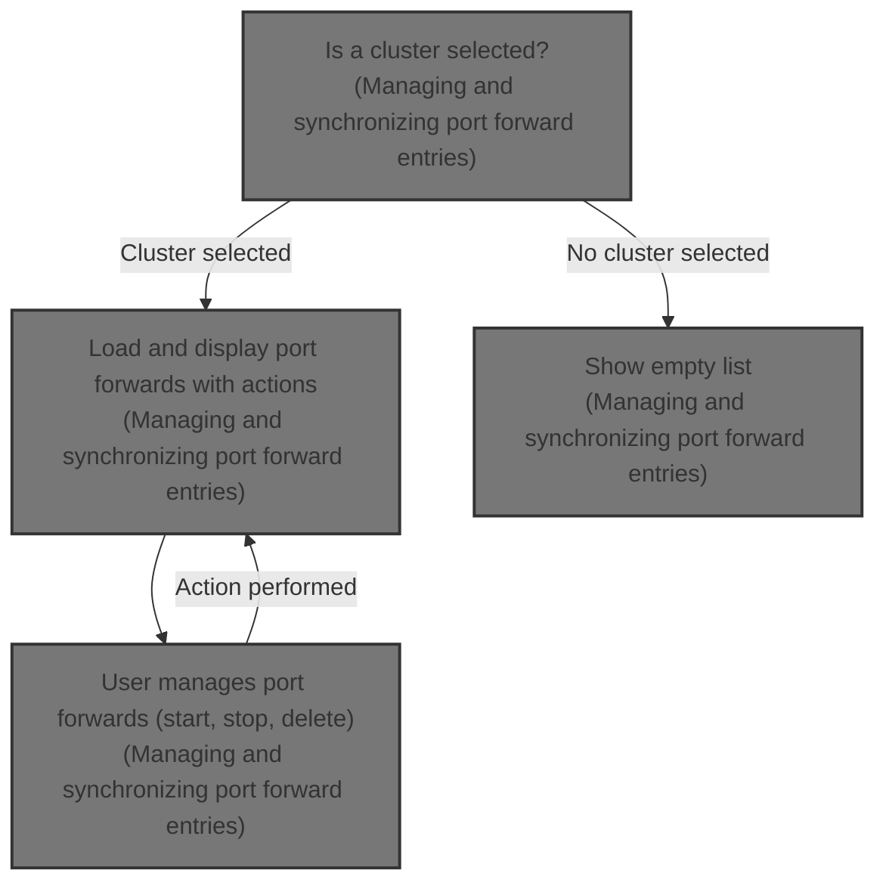

This document describes how users manage and synchronize port forwarding entries. When a cluster is selected, port forwards from backend and local storage are merged and displayed. Users can start, stop, or delete port forwards, and the list updates to reflect the latest status.



# Managing and synchronizing port forward entries

```mermaid
%%{init: {"flowchart": {"defaultRenderer": "elk"}} }%%
flowchart TD
  node1{"Is a cluster selected?"}
  click node1 openCode "frontend/src/components/portforward/index.tsx:71:72"
  node1 -->|"Yes"| node2["Load and merge port forwards from backend and local storage"]
  click node2 openCode "frontend/src/components/portforward/index.tsx:75:113"
  node1 -->|"No"| node9["Show empty list"]
  click node9 openCode "frontend/src/components/portforward/index.tsx:72:72"

  subgraph loop1["For each port forward from backend or local storage"]
    node2 --> node3{"Does port forward have error?"}
    click node3 openCode "frontend/src/components/portforward/index.tsx:78:86"
    node3 -->|"Yes"| node4["Show error notification"]
    click node4 openCode "frontend/src/components/portforward/index.tsx:80:85"
    node3 -->|"No"| node5["Display port forward in list (with status)"]
    click node5 openCode "frontend/src/components/portforward/index.tsx:224:355"
  end

  node5 --> node6{"User selects action (Start, Stop, Delete)?"}
  click node6 openCode "frontend/src/components/portforward/index.tsx:120:165"
  node6 -->|"Start"| node7["Open start dialog"]
  click node7 openCode "frontend/src/components/portforward/index.tsx:311:353"
  node6 -->|"Stop"| node8["Stop port forward"]
  click node8 openCode "frontend/src/components/portforward/index.tsx:137:145"
  node6 -->|"Delete"| node10["Delete port forward and remove from storage"]
  click node10 openCode "frontend/src/components/portforward/index.tsx:146:163"
  node7 --> node2
  node8 --> node2
  node10 --> node2

classDef HeadingStyle fill:#777777,stroke:#333,stroke-width:2px;

%% Swimm:
%% %%{init: {"flowchart": {"defaultRenderer": "elk"}} }%%
%% flowchart TD
%%   node1{"Is a cluster selected?"}
%%   click node1 openCode "<SwmPath>[frontend/…/portforward/index.tsx](frontend/src/components/portforward/index.tsx)</SwmPath>:71:72"
%%   node1 -->|"Yes"| node2["Load and merge port forwards from backend and local storage"]
%%   click node2 openCode "<SwmPath>[frontend/…/portforward/index.tsx](frontend/src/components/portforward/index.tsx)</SwmPath>:75:113"
%%   node1 -->|"No"| node9["Show empty list"]
%%   click node9 openCode "<SwmPath>[frontend/…/portforward/index.tsx](frontend/src/components/portforward/index.tsx)</SwmPath>:72:72"
%% 
%%   subgraph loop1["For each port forward from backend or local storage"]
%%     node2 --> node3{"Does port forward have error?"}
%%     click node3 openCode "<SwmPath>[frontend/…/portforward/index.tsx](frontend/src/components/portforward/index.tsx)</SwmPath>:78:86"
%%     node3 -->|"Yes"| node4["Show error notification"]
%%     click node4 openCode "<SwmPath>[frontend/…/portforward/index.tsx](frontend/src/components/portforward/index.tsx)</SwmPath>:80:85"
%%     node3 -->|"No"| node5["Display port forward in list (with status)"]
%%     click node5 openCode "<SwmPath>[frontend/…/portforward/index.tsx](frontend/src/components/portforward/index.tsx)</SwmPath>:224:355"
%%   end
%% 
%%   node5 --> node6{"User selects action (Start, Stop, Delete)?"}
%%   click node6 openCode "<SwmPath>[frontend/…/portforward/index.tsx](frontend/src/components/portforward/index.tsx)</SwmPath>:120:165"
%%   node6 -->|"Start"| node7["Open start dialog"]
%%   click node7 openCode "<SwmPath>[frontend/…/portforward/index.tsx](frontend/src/components/portforward/index.tsx)</SwmPath>:311:353"
%%   node6 -->|"Stop"| node8["Stop port forward"]
%%   click node8 openCode "<SwmPath>[frontend/…/portforward/index.tsx](frontend/src/components/portforward/index.tsx)</SwmPath>:137:145"
%%   node6 -->|"Delete"| node10["Delete port forward and remove from storage"]
%%   click node10 openCode "<SwmPath>[frontend/…/portforward/index.tsx](frontend/src/components/portforward/index.tsx)</SwmPath>:146:163"
%%   node7 --> node2
%%   node8 --> node2
%%   node10 --> node2
%% 
%% classDef HeadingStyle fill:#777777,stroke:#333,stroke-width:2px;
```



<SwmSnippet path="/frontend/src/components/portforward/index.tsx" line="52">

---

In <SwmToken path="frontend/src/components/portforward/index.tsx" pos="52:6:6" line-data="export default function PortForwardingList() {">`PortForwardingList`</SwmToken>, we set up state for port forwards and UI controls, then immediately call <SwmToken path="frontend/src/components/portforward/index.tsx" pos="70:3:3" line-data="  function fetchPortForwardList(showError?: boolean) {">`fetchPortForwardList`</SwmToken> in a <SwmToken path="frontend/src/components/portforward/index.tsx" pos="116:3:3" line-data="  React.useEffect(() =&gt; {">`useEffect`</SwmToken> to pull the latest port forward data from the backend. This keeps the UI in sync with what's actually running, and sets up the rest of the flow to react to backend changes.

```tsx
export default function PortForwardingList() {
  const [portforwards, setPortForwards] = React.useState<any[]>([]);
  const [portForwardInAction, setPortForwardInAction] = React.useState<any>(null);
  const [startDialogOpen, setStartDialogOpen] = React.useState(false);
  const [selectedForStart, setSelectedForStart] = React.useState<any | null>(null);
  const { enqueueSnackbar } = useSnackbar();
  const cluster = getCluster();
  const { t, i18n } = useTranslation(['translation', 'glossary']);
  const optionsTranslated = React.useMemo(
    () => ({
      [PortForwardAction.Start]: t('translation|Start'),
      [PortForwardAction.Stop]: t('translation|Stop'),
      [PortForwardAction.Delete]: t('translation|Delete'),
    }),
    [i18n.language]
  );
  const options = Object.keys(optionsTranslated) as (keyof typeof optionsTranslated)[];

  function fetchPortForwardList(showError?: boolean) {
    const cluster = getCluster();
    if (!cluster) return;

    // fetch port forwarding list
    listPortForward(cluster).then(portforwards => {
      const massagedPortForwards = portforwards === null ? [] : portforwards;
      massagedPortForwards.forEach((portforward: any) => {
        if (portForwardInAction?.id === portforward.id) {
          if (portforward.Error && showError) {
            enqueueSnackbar(portforward.Error, {
              key: 'portforward-error',
              preventDuplicate: true,
              autoHideDuration: 3000,
              variant: 'error',
            });
          }
        }
      });

      // sync portforwards from backend with localStorage
      const portforwardInStorage = localStorage.getItem(PORT_FORWARDS_STORAGE_KEY);
      const parsedPortForwards = JSON.parse(portforwardInStorage || '[]');
      parsedPortForwards.forEach((portforward: any) => {
        const index = massagedPortForwards.findIndex((pf: any) => pf.id === portforward.id);
        if (index === -1) {
          portforward.status = PORT_FORWARD_STOP_STATUS;
          massagedPortForwards.push(portforward);
        }
      });
      localStorage.setItem(
        PORT_FORWARDS_STORAGE_KEY,
        JSON.stringify(
          // in the locaStorage we store portforward status as stop
          // this is because the correct status is always present on the backend
          // the localStorage portforwards are used specifically when the user relaunches the app
          massagedPortForwards.map((portforward: any) => {
            const newPortforward = { ...portforward };
            newPortforward.status = PORT_FORWARD_STOP_STATUS;
            return newPortforward;
          })
        )
      );
      setPortForwards(massagedPortForwards);
    });
  }
  React.useEffect(() => {
    fetchPortForwardList();
  }, []);

  const handleAction = (option: string, portforward: any, closeMenu: () => void) => {
    closeMenu();
    if (!option || typeof option !== 'string') {
      return;
    }

    const { id, namespace, cluster } = portforward;

    if (option === PortForwardAction.Start) {
      let address = 'localhost';
      if (isDockerDesktop()) {
        address = '0.0.0.0';
      }
      setSelectedForStart({ ...portforward, cluster, namespace, address });
      setStartDialogOpen(true);
      return;
    }
    if (option === PortForwardAction.Stop) {
      setPortForwardInAction({ ...portforward, loading: true });
      // stop portforward
      stopOrDeletePortForward(cluster, id, true).finally(() => {
        setPortForwardInAction(null);
        // update portforward list item
        fetchPortForwardList(true);
      });
    }
    if (option === PortForwardAction.Delete) {
      setPortForwardInAction({ ...portforward, loading: true });
      // delete portforward
      stopOrDeletePortForward(cluster, id, false).finally(() => {
        setPortForwardInAction(null);

        // remove portforward from storage too
        const portforwardInStorage = localStorage.getItem(PORT_FORWARDS_STORAGE_KEY);
        const parsedPortForwards = JSON.parse(portforwardInStorage || '[]');
        const index = parsedPortForwards.findIndex((pf: any) => pf.id === id);
        if (index !== -1) {
          parsedPortForwards.splice(index, 1);
        }
        localStorage.setItem(PORT_FORWARDS_STORAGE_KEY, JSON.stringify(parsedPortForwards));

        // update portforward list item
        fetchPortForwardList(true);
      });
    }
  };

```

---

</SwmSnippet>

<SwmSnippet path="/frontend/src/components/portforward/index.tsx" line="70">

---

<SwmToken path="frontend/src/components/portforward/index.tsx" pos="70:3:3" line-data="  function fetchPortForwardList(showError?: boolean) {">`fetchPortForwardList`</SwmToken> grabs port forwards from the backend, checks for errors on the active one, then merges in any port forwards from <SwmToken path="frontend/src/components/portforward/index.tsx" pos="90:13:13" line-data="      // sync portforwards from backend with localStorage">`localStorage`</SwmToken> that aren't in the backend list, marking them as stopped. It updates <SwmToken path="frontend/src/components/portforward/index.tsx" pos="90:13:13" line-data="      // sync portforwards from backend with localStorage">`localStorage`</SwmToken> and the UI state with the combined list, so users see both current and previously active port forwards.

```tsx
  function fetchPortForwardList(showError?: boolean) {
    const cluster = getCluster();
    if (!cluster) return;

    // fetch port forwarding list
    listPortForward(cluster).then(portforwards => {
      const massagedPortForwards = portforwards === null ? [] : portforwards;
      massagedPortForwards.forEach((portforward: any) => {
        if (portForwardInAction?.id === portforward.id) {
          if (portforward.Error && showError) {
            enqueueSnackbar(portforward.Error, {
              key: 'portforward-error',
              preventDuplicate: true,
              autoHideDuration: 3000,
              variant: 'error',
            });
          }
        }
      });

      // sync portforwards from backend with localStorage
      const portforwardInStorage = localStorage.getItem(PORT_FORWARDS_STORAGE_KEY);
      const parsedPortForwards = JSON.parse(portforwardInStorage || '[]');
      parsedPortForwards.forEach((portforward: any) => {
        const index = massagedPortForwards.findIndex((pf: any) => pf.id === portforward.id);
        if (index === -1) {
          portforward.status = PORT_FORWARD_STOP_STATUS;
          massagedPortForwards.push(portforward);
        }
      });
      localStorage.setItem(
        PORT_FORWARDS_STORAGE_KEY,
        JSON.stringify(
          // in the locaStorage we store portforward status as stop
          // this is because the correct status is always present on the backend
          // the localStorage portforwards are used specifically when the user relaunches the app
          massagedPortForwards.map((portforward: any) => {
            const newPortforward = { ...portforward };
            newPortforward.status = PORT_FORWARD_STOP_STATUS;
            return newPortforward;
          })
        )
      );
      setPortForwards(massagedPortForwards);
    });
  }
```

---

</SwmSnippet>

<SwmSnippet path="/frontend/src/components/portforward/index.tsx" line="167">

---

After returning from <SwmToken path="frontend/src/components/portforward/index.tsx" pos="70:3:3" line-data="  function fetchPortForwardList(showError?: boolean) {">`fetchPortForwardList`</SwmToken>, <SwmToken path="frontend/src/components/portforward/index.tsx" pos="52:6:6" line-data="export default function PortForwardingList() {">`PortForwardingList`</SwmToken> sets up a context menu for each port forward, filtering available actions based on error and status. When a user picks an action, we call <SwmToken path="frontend/src/components/portforward/index.tsx" pos="200:18:18" line-data="            &lt;MenuItem key={option} onClick={() =&gt; handleAction(option, portforward, closeMenu)}&gt;">`handleAction`</SwmToken> to actually perform it and update the UI.

```tsx
  const PortForwardContextMenu = ({ portforward }: { portforward: any }) => {
    const [anchorEl, setAnchorEl] = React.useState<null | HTMLElement>(null);
    const menuId = `pf-actions-${portforward.id}`;

    const filteredOptions = options.filter(option => {
      if (portforward.error) {
        return option === PortForwardAction.Delete;
      }
      if (portforward.status === PORT_FORWARD_RUNNING_STATUS) {
        return option !== PortForwardAction.Start;
      } else if (portforward.status === PORT_FORWARD_STOP_STATUS) {
        return option !== PortForwardAction.Stop;
      }
      return true;
    });

    function closeMenu() {
      setAnchorEl(null);
    }

    return (
      <>
        <IconButton
          size="small"
          onClick={event => setAnchorEl(event.currentTarget)}
          aria-haspopup="menu"
          aria-controls={menuId}
          aria-label={t('Actions')}
        >
          <Icon icon="mdi:more-vert" />
        </IconButton>
        <Menu id={menuId} anchorEl={anchorEl} open={Boolean(anchorEl)} onClose={closeMenu}>
          {filteredOptions.map(option => (
            <MenuItem key={option} onClick={() => handleAction(option, portforward, closeMenu)}>
              <ListItemText>{optionsTranslated[option]}</ListItemText>
            </MenuItem>
          ))}
        </Menu>
      </>
    );
  };

  function prepareStatusLabel(portforward: any) {
    if (portForwardInAction?.id === portforward.id && portForwardInAction.loading) {
      return <Loader noContainer title={t('translation|Loading port forwarding')} size={30} />;
    }
    const error = portforward.error;
    if (error) {
      return <StatusLabel status="error">{t('translation|Error')}</StatusLabel>;
    }
    return (
      <StatusLabel status={portforward.status === PORT_FORWARD_RUNNING_STATUS ? 'success' : ''}>
        {portforward.status}
      </StatusLabel>
    );
  }

```

---

</SwmSnippet>

<SwmSnippet path="/frontend/src/components/portforward/index.tsx" line="120">

---

<SwmToken path="frontend/src/components/portforward/index.tsx" pos="120:3:3" line-data="  const handleAction = (option: string, portforward: any, closeMenu: () =&gt; void) =&gt; {">`handleAction`</SwmToken> closes the menu, checks which action was picked, and then either opens a dialog to start a port forward, stops it, or deletes it (including cleaning up <SwmToken path="frontend/src/components/portforward/index.tsx" pos="153:7:7" line-data="        const portforwardInStorage = localStorage.getItem(PORT_FORWARDS_STORAGE_KEY);">`localStorage`</SwmToken>). After Stop or Delete, it refreshes the port forward list so the UI stays up to date.

```tsx
  const handleAction = (option: string, portforward: any, closeMenu: () => void) => {
    closeMenu();
    if (!option || typeof option !== 'string') {
      return;
    }

    const { id, namespace, cluster } = portforward;

    if (option === PortForwardAction.Start) {
      let address = 'localhost';
      if (isDockerDesktop()) {
        address = '0.0.0.0';
      }
      setSelectedForStart({ ...portforward, cluster, namespace, address });
      setStartDialogOpen(true);
      return;
    }
    if (option === PortForwardAction.Stop) {
      setPortForwardInAction({ ...portforward, loading: true });
      // stop portforward
      stopOrDeletePortForward(cluster, id, true).finally(() => {
        setPortForwardInAction(null);
        // update portforward list item
        fetchPortForwardList(true);
      });
    }
    if (option === PortForwardAction.Delete) {
      setPortForwardInAction({ ...portforward, loading: true });
      // delete portforward
      stopOrDeletePortForward(cluster, id, false).finally(() => {
        setPortForwardInAction(null);

        // remove portforward from storage too
        const portforwardInStorage = localStorage.getItem(PORT_FORWARDS_STORAGE_KEY);
        const parsedPortForwards = JSON.parse(portforwardInStorage || '[]');
        const index = parsedPortForwards.findIndex((pf: any) => pf.id === id);
        if (index !== -1) {
          parsedPortForwards.splice(index, 1);
        }
        localStorage.setItem(PORT_FORWARDS_STORAGE_KEY, JSON.stringify(parsedPortForwards));

        // update portforward list item
        fetchPortForwardList(true);
      });
    }
  };
```

---

</SwmSnippet>

<SwmSnippet path="/frontend/src/components/portforward/index.tsx" line="224">

---

After returning from <SwmToken path="frontend/src/components/portforward/index.tsx" pos="120:3:3" line-data="  const handleAction = (option: string, portforward: any, closeMenu: () =&gt; void) =&gt; {">`handleAction`</SwmToken>, <SwmToken path="frontend/src/components/portforward/index.tsx" pos="52:6:6" line-data="export default function PortForwardingList() {">`PortForwardingList`</SwmToken> renders the table and dialog, and calls <SwmToken path="frontend/src/components/portforward/index.tsx" pos="346:1:1" line-data="              fetchPortForwardList(true);">`fetchPortForwardList`</SwmToken> again after starting a port forward to make sure the UI shows the latest status from the backend.

```tsx
  return (
    <SectionBox title={t('glossary|Port Forwarding')}>
      <Table
        columns={[
          {
            id: 'name',
            header: t('translation|Name'),
            accessorFn: portforward => portforward.service || portforward.pod,
            Cell: ({ row }) => {
              const portforward = row.original;
              const podOrService = portforward.service ? 'service' : 'pod';
              const name = portforward.service || portforward.pod;
              const namespace = portforward.serviceNamespace || portforward.namespace;
              return (
                <Link routeName={podOrService} params={{ name, namespace }}>
                  {name}
                </Link>
              );
            },
          },
          {
            id: 'namespace',
            header: t('glossary|Namespace'),
            accessorFn: portforward => portforward.serviceNamespace || portforward.namespace,
          },
          {
            id: 'kind',
            header: t('glossary|Kind'),
            accessorFn: portforward => (!!portforward.service ? 'Service' : 'Pod'),
          },
          {
            id: 'podPort',
            header: t('translation|Pod Port'),
            accessorFn: portforward => portforward.targetPort,
          },
          {
            id: 'localPort',
            header: t('translation|Local Port'),
            accessorFn: portforward => portforward.port,
            Cell: ({ row }) => {
              const portforward = row.original;
              return (
                <Box display={'flex'} alignItems="center">
                  <MuiLink
                    onClick={() => {
                      window.open(`http://localhost:${portforward.port}`, '_blank');
                    }}
                    sx={theme =>
                      portforward.status === PORT_FORWARD_RUNNING_STATUS
                        ? {
                            cursor: 'pointer',
                            marginRight: theme.spacing(1),
                          }
                        : {
                            pointerEvents: 'none',
                            color: theme.palette.text.disabled,
                          }
                    }
                  >
                    {portforward.port}
                    <InlineIcon icon={'mdi:open-in-new'} style={{ marginLeft: '4px' }} />
                  </MuiLink>
                </Box>
              );
            },
          },
          {
            id: 'status',
            header: t('translation|Status'),
            accessorFn: portforward => portforward.status,
            Cell: ({ row }) => prepareStatusLabel(row.original),
          },
          {
            id: 'actions',
            header: t('translation|Actions'),
            gridTemplate: 'min-content',
            muiTableBodyCellProps: { align: 'right' },
            accessorFn: portforward => portforward.status,
            Cell: ({ row }) => <PortForwardContextMenu portforward={row.original} />,
            enableSorting: false,
            enableColumnFilter: false,
          },
        ]}
        data={portforwards.filter((pf: any) => pf.cluster === cluster)}
        getRowId={row => row.id}
      />
      <PortForwardStartDialog
        open={startDialogOpen}
        defaultPort={selectedForStart?.port}
        podName={selectedForStart?.pod || selectedForStart?.service || ''}
        namespace={selectedForStart?.serviceNamespace || selectedForStart?.namespace || ''}
        containerPort={selectedForStart?.targetPort || ''}
        isDockerDesktop={isDockerDesktop()}
        onCancel={() => {
          setStartDialogOpen(false);
          setSelectedForStart(null);
        }}
        onConfirm={portInput => {
          if (!selectedForStart) return;

          const { cluster, namespace, pod, targetPort, service, serviceNamespace, id } =
            selectedForStart;
          const chosenPort = portInput || selectedForStart.port;
          const address = selectedForStart.address || 'localhost';

          setStartDialogOpen(false);
          setSelectedForStart(null);
          setPortForwardInAction({ ...selectedForStart, loading: true });

          startPortForward(
            cluster,
            namespace,
            pod,
            targetPort,
            service,
            serviceNamespace,
            chosenPort,
            address,
            id
          )
            .then(() => {
              setPortForwardInAction(null);
              fetchPortForwardList(true);
            })
            .catch(error => {
              setPortForwardInAction(null);
              console.log('Error starting port forward:', error);
            });
        }}
      />
    </SectionBox>
  );
}
```

---

</SwmSnippet>

&nbsp;

*This is an auto-generated document by Swimm 🌊 and has not yet been verified by a human*

<SwmMeta version="3.0.0" repo-id="Z2l0aHViJTNBJTNBdHlwZXNjcmlwdC1oZWFkbGFtcCUzQSUzQXJpY2FyZG9sb3Blemc=" repo-name="typescript-headlamp"><sup>Powered by [Swimm](https://app.swimm.io/)</sup></SwmMeta>
