This document describes how query parameters in the browser URL are managed to keep the UI state synchronized with navigation. The flow receives the current query parameter value and an initial state, and returns the updated value along with a setter function for future changes. By updating the URL and browser history, the flow allows users to share, bookmark, or revisit specific UI states, and ensures that resource actions are reflected in navigation.


# Where is this flow used?

This flow is used multiple times in the codebase as represented in the following diagram:

```mermaid
graph TD;
      cfe56ed6ea57d4da49bc07a4e2fee108921ae0742f612e29f153af538ad2e878(frontend/…/Table/Table.tsx::Table) --> aea418ebf887730e25075a63bfc85385c2d4d2b0ce74593778d152385fca1452(frontend/…/resourceMap/useQueryParamsState.tsx::useQueryParamsState):::mainFlowStyle

3e0eb8139d9a01980d464d1f7b56282926e9707ec06f0c55bdacf68730d17bc6(frontend/…/resourceMap/GraphView.tsx::GraphViewContent) --> aea418ebf887730e25075a63bfc85385c2d4d2b0ce74593778d152385fca1452(frontend/…/resourceMap/useQueryParamsState.tsx::useQueryParamsState):::mainFlowStyle


classDef mainFlowStyle color:#000000,fill:#7CB9F4
classDef rootsStyle color:#000000,fill:#00FFF4
classDef Style1 color:#000000,fill:#00FFAA
classDef Style2 color:#000000,fill:#FFFF00
classDef Style3 color:#000000,fill:#AA7CB9

%% Swimm:
%% graph TD;
%%       cfe56ed6ea57d4da49bc07a4e2fee108921ae0742f612e29f153af538ad2e878(<SwmPath>[frontend/…/Table/Table.tsx](frontend/src/components/common/Table/Table.tsx)</SwmPath>::Table) --> aea418ebf887730e25075a63bfc85385c2d4d2b0ce74593778d152385fca1452(<SwmPath>[frontend/…/resourceMap/useQueryParamsState.tsx](frontend/src/components/resourceMap/useQueryParamsState.tsx)</SwmPath>::<SwmToken path="frontend/src/components/resourceMap/useQueryParamsState.tsx" pos="36:4:4" line-data="export function useQueryParamsState&lt;T extends string | undefined&gt;(">`useQueryParamsState`</SwmToken>):::mainFlowStyle
%% 
%% 3e0eb8139d9a01980d464d1f7b56282926e9707ec06f0c55bdacf68730d17bc6(<SwmPath>[frontend/…/resourceMap/GraphView.tsx](frontend/src/components/resourceMap/GraphView.tsx)</SwmPath>::GraphViewContent) --> aea418ebf887730e25075a63bfc85385c2d4d2b0ce74593778d152385fca1452(<SwmPath>[frontend/…/resourceMap/useQueryParamsState.tsx](frontend/src/components/resourceMap/useQueryParamsState.tsx)</SwmPath>::<SwmToken path="frontend/src/components/resourceMap/useQueryParamsState.tsx" pos="36:4:4" line-data="export function useQueryParamsState&lt;T extends string | undefined&gt;(">`useQueryParamsState`</SwmToken>):::mainFlowStyle
%% 
%% 
%% classDef mainFlowStyle color:#000000,fill:#7CB9F4
%% classDef rootsStyle color:#000000,fill:#00FFF4
%% classDef Style1 color:#000000,fill:#00FFAA
%% classDef Style2 color:#000000,fill:#FFFF00
%% classDef Style3 color:#000000,fill:#AA7CB9
```



# Managing Query Params and Resource Deletion


<SwmSnippet path="/frontend/src/components/resourceMap/useQueryParamsState.tsx" line="36">

---

In <SwmToken path="frontend/src/components/resourceMap/useQueryParamsState.tsx" pos="36:4:4" line-data="export function useQueryParamsState&lt;T extends string | undefined&gt;(">`useQueryParamsState`</SwmToken>, we start by reading and updating query parameters from the URL, so that state changes are reflected in navigation. We need to call into <SwmToken path="frontend/src/lib/k8s/KubeObject.ts" pos="46:4:4" line-data="export class KubeObject&lt;T extends KubeObjectInterface | KubeEvent = any&gt; {">`KubeObject`</SwmToken> next because after updating the query params, we often need to trigger resource actions (like deletion) that depend on the current state reflected in the URL.

```tsx
export function useQueryParamsState<T extends string | undefined>(
  param: string,
  initialState: T
): UseQueryParamsStateReturnType<T> {
  const { search } = useLocation();
  const history = useHistory();

  const value = useMemo(() => {
    const params = new URLSearchParams(search);
    return (params.get(param) ?? undefined) as T | undefined;
  }, [search, param]);

  const setValue = useCallback(
    (newValue: T | undefined, params: { replace?: boolean } = {}) => {
      if (newValue !== undefined && typeof newValue !== 'string') {
        throw new Error("useQueryParamsState: Can't set a value to something that isn't a string");
      }

      // Create new search params
      const newParams = new URLSearchParams(history.location.search);
      if (newValue === undefined) {
        newParams.delete(param);
      } else {
        newParams.set(param, newValue);
      }

```

---

</SwmSnippet>

<SwmSnippet path="/frontend/src/lib/k8s/KubeObject.ts" line="450">

---

<SwmToken path="frontend/src/lib/k8s/KubeObject.ts" pos="450:1:1" line-data="  delete(force?: boolean) {">`delete`</SwmToken> in <SwmToken path="frontend/src/lib/k8s/KubeObject.ts" pos="46:4:4" line-data="export class KubeObject&lt;T extends KubeObjectInterface | KubeEvent = any&gt; {">`KubeObject`</SwmToken> builds the API call for resource deletion, handling namespaced resources by prepending the namespace to the arguments, and using <SwmToken path="frontend/src/lib/k8s/KubeObject.ts" pos="459:3:3" line-data="      params.gracePeriodSeconds = 0;">`gracePeriodSeconds`</SwmToken>=0 for force deletes. This matches backend expectations for argument order and immediate deletion.

```typescript
  delete(force?: boolean) {
    const args: string[] = [this.getName()];
    if (this.isNamespaced) {
      args.unshift(this.getNamespace()!);
    }
    const params: DeleteParameters = {};

    console.log(force);
    if (force) {
      params.gracePeriodSeconds = 0;
      console.log(params);
    }

    // @ts-ignore
    return this._class().apiEndpoint.delete(...args, params, this._clusterName);
  }
```

---

</SwmSnippet>

<SwmSnippet path="/frontend/src/components/resourceMap/useQueryParamsState.tsx" line="62">

---

After returning from KubeObject.delete, <SwmToken path="frontend/src/components/resourceMap/useQueryParamsState.tsx" pos="36:4:4" line-data="export function useQueryParamsState&lt;T extends string | undefined&gt;(">`useQueryParamsState`</SwmToken> updates the URL to reflect the new state, and applies <SwmToken path="frontend/src/components/resourceMap/useQueryParamsState.tsx" pos="73:5:5" line-data="  // Apply initialState if any">`initialState`</SwmToken> if needed. This keeps the UI and navigation consistent after resource actions.

```tsx
      // Apply new search params
      const newSearch = '?' + newParams;
      if (params.replace) {
        history.replace(newSearch);
      } else {
        history.push(newSearch);
      }
    },
    [history.location.search, param]
  );

  // Apply initialState if any
  useEffect(() => {
    if (initialState && !value) {
      setValue(initialState, { replace: true });
    }
  }, [initialState]);

  return [value, setValue];
}
```

---

</SwmSnippet>

&nbsp;

*This is an auto-generated document by Swimm 🌊 and has not yet been verified by a human*

<SwmMeta version="3.0.0" repo-id="Z2l0aHViJTNBJTNBdHlwZXNjcmlwdC1oZWFkbGFtcCUzQSUzQXJpY2FyZG9sb3Blemc=" repo-name="typescript-headlamp"><sup>Powered by [Swimm](https://app.swimm.io/)</sup></SwmMeta>
