```mermaid
%%{init: {"flowchart": {"defaultRenderer": "elk"}} }%%
flowchart TD
  node1["Should connect for real-time cluster updates?"]
  click node1 openCode "frontend/src/lib/k8s/api/v2/webSocket.ts:416:434"
  node1 --> node2{"Is connection enabled?"}
  click node2 openCode "frontend/src/lib/k8s/api/v2/webSocket.ts:457:460"
  node2 -->|"Yes"| node3["Subscribe to updates for selected cluster"]
  click node3 openCode "frontend/src/lib/k8s/api/v2/webSocket.ts:464:473"
  node2 -->|"No"| node6["Do not connect"]
  click node6 openCode "frontend/src/lib/k8s/api/v2/webSocket.ts:459:460"
  node3 -->|"On message"| node4["Handle incoming updates"]
  click node4 openCode "frontend/src/lib/k8s/api/v2/webSocket.ts:436:453"
  node3 -->|"On error"| node5["Handle connection errors"]
  click node5 openCode "frontend/src/lib/k8s/api/v2/webSocket.ts:474:476"
  node3 -->|"When connection closes"| node7["Unsubscribe from updates"]
  click node7 openCode "frontend/src/lib/k8s/api/v2/webSocket.ts:481:485"
classDef HeadingStyle fill:#777777,stroke:#333,stroke-width:2px;

%% Swimm:
%% %%{init: {"flowchart": {"defaultRenderer": "elk"}} }%%
%% flowchart TD
%%   node1["Should connect for real-time cluster updates?"]
%%   click node1 openCode "<SwmPath>[frontend/…/v2/webSocket.ts](frontend/src/lib/k8s/api/v2/webSocket.ts)</SwmPath>:416:434"
%%   node1 --> node2{"Is connection enabled?"}
%%   click node2 openCode "<SwmPath>[frontend/…/v2/webSocket.ts](frontend/src/lib/k8s/api/v2/webSocket.ts)</SwmPath>:457:460"
%%   node2 -->|"Yes"| node3["Subscribe to updates for selected cluster"]
%%   click node3 openCode "<SwmPath>[frontend/…/v2/webSocket.ts](frontend/src/lib/k8s/api/v2/webSocket.ts)</SwmPath>:464:473"
%%   node2 -->|"No"| node6["Do not connect"]
%%   click node6 openCode "<SwmPath>[frontend/…/v2/webSocket.ts](frontend/src/lib/k8s/api/v2/webSocket.ts)</SwmPath>:459:460"
%%   node3 -->|"On message"| node4["Handle incoming updates"]
%%   click node4 openCode "<SwmPath>[frontend/…/v2/webSocket.ts](frontend/src/lib/k8s/api/v2/webSocket.ts)</SwmPath>:436:453"
%%   node3 -->|"On error"| node5["Handle connection errors"]
%%   click node5 openCode "<SwmPath>[frontend/…/v2/webSocket.ts](frontend/src/lib/k8s/api/v2/webSocket.ts)</SwmPath>:474:476"
%%   node3 -->|"When connection closes"| node7["Unsubscribe from updates"]
%%   click node7 openCode "<SwmPath>[frontend/…/v2/webSocket.ts](frontend/src/lib/k8s/api/v2/webSocket.ts)</SwmPath>:481:485"
%% classDef HeadingStyle fill:#777777,stroke:#333,stroke-width:2px;
```

This document describes how real-time updates are delivered to users by managing multiple <SwmToken path="frontend/src/lib/k8s/api/v2/webSocket.ts" pos="423:11:11" line-data="  /** Function that returns the WebSocket URL to connect to */">`WebSocket`</SwmToken> connections. Connections are prepared and authorized using cluster and user details, listeners are shared to avoid duplicates, and updates are delivered in real time. Connections are cleaned up when no longer required, ensuring efficient resource management.

# Managing Multiple <SwmToken path="frontend/src/lib/k8s/api/v2/webSocket.ts" pos="423:11:11" line-data="  /** Function that returns the WebSocket URL to connect to */">`WebSocket`</SwmToken> Connections


<SwmSnippet path="/frontend/src/lib/k8s/api/v2/webSocket.ts" line="566">

---

In <SwmToken path="frontend/src/lib/k8s/api/v2/webSocket.ts" pos="566:4:4" line-data="export function useWebSockets&lt;T&gt;({">`useWebSockets`</SwmToken>, we kick off the process by iterating over connection requests. For each, we build a <SwmToken path="frontend/src/lib/k8s/api/v2/webSocket.ts" pos="592:3:3" line-data="      const connectionKey = cluster + url;">`connectionKey`</SwmToken> and check if a socket already exists. If not, we add the listener and mark the socket as 'pending' in the global map, then call <SwmToken path="frontend/src/lib/k8s/api/v2/webSocket.ts" pos="602:1:1" line-data="        openWebSocket(url, { protocols, type, cluster, onMessage })">`openWebSocket`</SwmToken> to actually establish the connection. This setup lets us share sockets and listeners across requests and avoids opening duplicate connections.

```typescript
export function useWebSockets<T>({
  connections,
  enabled = true,
  protocols,
  type = 'json',
}: {
  enabled?: boolean;
  /** Make sure that connections value is stable between renders */
  connections: Array<WebSocketConnectionRequest<T>>;
  /**
   * Any additional protocols to include in WebSocket connection
   * make sure that the value is stable between renders
   */
  protocols?: string | string[];
  /**
   * Type of websocket data
   */
  type?: 'json' | 'binary';
}) {
  useEffect(() => {
    if (!enabled) return;

    let isCurrent = true;

    /** Open a connection to websocket */
    function connect({ cluster, url, onMessage }: WebSocketConnectionRequest<T>) {
      const connectionKey = cluster + url;

      if (!sockets.has(connectionKey)) {
        // Add new listener for this URL
        listeners.set(connectionKey, [...(listeners.get(connectionKey) ?? []), onMessage]);

        // Mark socket as pending, so we don't open more than one
        sockets.set(connectionKey, 'pending');

        let ws: WebSocket | undefined;
        openWebSocket(url, { protocols, type, cluster, onMessage })
          .then(socket => {
```

---

</SwmSnippet>

## Preparing and Authorizing <SwmToken path="frontend/src/lib/k8s/api/v2/webSocket.ts" pos="423:11:11" line-data="  /** Function that returns the WebSocket URL to connect to */">`WebSocket`</SwmToken> Connections


<SwmSnippet path="/frontend/src/lib/k8s/api/v2/webSocket.ts" line="503">

---

<SwmToken path="frontend/src/lib/k8s/api/v2/webSocket.ts" pos="503:6:6" line-data="export async function openWebSocket&lt;T&gt;(">`openWebSocket`</SwmToken> sets up the <SwmToken path="frontend/src/lib/k8s/api/v2/webSocket.ts" pos="512:15:15" line-data="     * Any additional protocols to include in WebSocket connection">`WebSocket`</SwmToken> connection by building the URL and protocols array, adding cluster and authorization info if needed. It then creates the socket and attaches message/error handlers. The message handler parses incoming data as JSON or binary, then calls the provided <SwmToken path="frontend/src/lib/k8s/api/v2/webSocket.ts" pos="509:1:1" line-data="    onMessage,">`onMessage`</SwmToken> callback, which is defined in the next step in <SwmPath>[frontend/…/v2/hooks.ts](frontend/src/lib/k8s/api/v2/hooks.ts)</SwmPath>.

```typescript
export async function openWebSocket<T>(
  url: string,
  {
    protocols: moreProtocols = [],
    type = 'binary',
    cluster = getCluster() ?? '',
    onMessage,
  }: {
    /**
     * Any additional protocols to include in WebSocket connection
     */
    protocols?: string | string[];
    /**
     *
     */
    type: 'json' | 'binary';
    /**
     * Cluster name
     */
    cluster?: string;
    /**
     * Message callback
     */
    onMessage: (data: T) => void;
  }
) {
  const path = [url];
  const protocols = ['base64.binary.k8s.io', ...(moreProtocols ?? [])];

  if (cluster) {
    path.unshift('clusters', cluster);

    try {
      const kubeconfig = await findKubeconfigByClusterName(cluster);

      if (kubeconfig !== null) {
        const userID = getUserIdFromLocalStorage();
        protocols.push(`base64url.headlamp.authorization.k8s.io.${userID}`);
      }
    } catch (error) {
      console.error('Error while finding kubeconfig:', error);
    }
  }

  const socket = new WebSocket(makeUrl([getBaseWsUrl(), ...path], {}), protocols);
  socket.binaryType = 'arraybuffer';
  socket.addEventListener('message', (body: MessageEvent) => {
    const data = type === 'json' ? JSON.parse(body.data) : body.data;
    onMessage(data);
  });
  socket.addEventListener('error', error => {
    console.error('WebSocket error:', error);
  });

  return socket;
}
```

---

</SwmSnippet>

## Processing Incoming <SwmToken path="frontend/src/lib/k8s/api/v2/webSocket.ts" pos="423:11:11" line-data="  /** Function that returns the WebSocket URL to connect to */">`WebSocket`</SwmToken> Data

<SwmSnippet path="/frontend/src/lib/k8s/api/v2/hooks.ts" line="152">

---

<SwmToken path="frontend/src/lib/k8s/api/v2/webSocket.ts" pos="420:1:1" line-data="  onMessage,">`onMessage`</SwmToken> processes incoming <SwmToken path="frontend/src/lib/k8s/api/v2/webSocket.ts" pos="423:11:11" line-data="  /** Function that returns the WebSocket URL to connect to */">`WebSocket`</SwmToken> events. For updates that aren't 'ADDED', it updates the client cache with the new object, wrapped in <SwmToken path="frontend/src/lib/k8s/api/v2/hooks.ts" pos="100:1:1" line-data="  kubeObjectClass,">`kubeObjectClass`</SwmToken>. This keeps the client state in sync with backend changes. The next step is to wire this callback into <SwmToken path="frontend/src/lib/k8s/api/v2/hooks.ts" pos="152:1:1" line-data="  useWebSocket&lt;KubeListUpdateEvent&lt;K&gt;&gt;({">`useWebSocket`</SwmToken> so it gets triggered on new messages.

```typescript
    onMessage(update: KubeListUpdateEvent<K>) {
      if (update.type !== 'ADDED' && update.object) {
        client.setQueryData(queryKey, new kubeObjectClass(update.object));
      }
    },
```

---

</SwmSnippet>

## Setting Up a Single <SwmToken path="frontend/src/lib/k8s/api/v2/webSocket.ts" pos="423:11:11" line-data="  /** Function that returns the WebSocket URL to connect to */">`WebSocket`</SwmToken> Listener



<SwmSnippet path="/frontend/src/lib/k8s/api/v2/webSocket.ts" line="416">

---

In <SwmToken path="frontend/src/lib/k8s/api/v2/webSocket.ts" pos="416:4:4" line-data="export function useWebSocket&lt;T&gt;({">`useWebSocket`</SwmToken>, we set up the memoized URL and a stable message handler that parses incoming data and calls <SwmToken path="frontend/src/lib/k8s/api/v2/webSocket.ts" pos="420:1:1" line-data="  onMessage,">`onMessage`</SwmToken> or <SwmToken path="frontend/src/lib/k8s/api/v2/webSocket.ts" pos="421:1:1" line-data="  onError,">`onError`</SwmToken>. This prepares the hook to handle incoming <SwmToken path="frontend/src/lib/k8s/api/v2/webSocket.ts" pos="423:11:11" line-data="  /** Function that returns the WebSocket URL to connect to */">`WebSocket`</SwmToken> messages, which will be processed by the callback defined in <SwmPath>[frontend/…/v2/hooks.ts](frontend/src/lib/k8s/api/v2/hooks.ts)</SwmPath> next.

```typescript
export function useWebSocket<T>({
  url: createUrl,
  enabled = true,
  cluster = '',
  onMessage,
  onError,
}: {
  /** Function that returns the WebSocket URL to connect to */
  url: () => string;
  /** Whether the WebSocket connection should be active */
  enabled?: boolean;
  /** The Kubernetes cluster ID to watch */
  cluster?: string;
  /** Callback function to handle incoming messages */
  onMessage: (data: T) => void;
  /** Callback function to handle connection errors */
  onError?: (error: Error) => void;
}) {
  const url = useMemo(() => (enabled ? createUrl() : ''), [enabled, createUrl]);

  const stableOnMessage = useCallback(
    (rawData: any) => {
      try {
        let parsedData: T;
        try {
          parsedData = typeof rawData === 'string' ? JSON.parse(rawData) : rawData;
        } catch (parseError) {
          console.error('Failed to parse WebSocket message:', parseError);
          onError?.(parseError as Error);
          return;
        }

        onMessage(parsedData);
      } catch (err) {
        console.error('Failed to process WebSocket message:', err);
        onError?.(err as Error);
      }
    },
    [onMessage, onError]
  );

```

---

</SwmSnippet>

<SwmSnippet path="/frontend/src/lib/k8s/api/v2/webSocket.ts" line="457">

---

Back in <SwmToken path="frontend/src/lib/k8s/api/v2/webSocket.ts" pos="416:4:4" line-data="export function useWebSocket&lt;T&gt;({">`useWebSocket`</SwmToken>, after wiring up the message handler from <SwmPath>[frontend/…/v2/hooks.ts](frontend/src/lib/k8s/api/v2/hooks.ts)</SwmPath>, we subscribe to the <SwmToken path="frontend/src/lib/k8s/api/v2/webSocket.ts" pos="474:6:6" line-data="        console.error(&#39;WebSocket connection failed:&#39;, err);">`WebSocket`</SwmToken> and store a cleanup function. When the component unmounts or dependencies change, we call all disconnect callbacks to clean up connections and listeners.

```typescript
  useEffect(() => {
    if (!enabled || !url) {
      return;
    }

    let cleanup: (() => void) | undefined;

    const connectWebSocket = async () => {
      try {
        const parsedUrl = new URL(url, getBaseWsUrl());
        cleanup = await WebSocketManager.subscribe(
          cluster,
          parsedUrl.pathname,
          parsedUrl.search.slice(1),
          stableOnMessage
        );
      } catch (err) {
        console.error('WebSocket connection failed:', err);
        onError?.(err as Error);
      }
    };

    connectWebSocket();

    return () => {
      if (cleanup) {
        cleanup();
      }
    };
  }, [url, enabled, cluster, stableOnMessage, onError]);
}
```

---

</SwmSnippet>

## Finalizing and Cleaning Up <SwmToken path="frontend/src/lib/k8s/api/v2/webSocket.ts" pos="423:11:11" line-data="  /** Function that returns the WebSocket URL to connect to */">`WebSocket`</SwmToken> Connections


<SwmSnippet path="/frontend/src/lib/k8s/api/v2/webSocket.ts" line="604">

---

After <SwmToken path="frontend/src/lib/k8s/api/v2/webSocket.ts" pos="503:6:6" line-data="export async function openWebSocket&lt;T&gt;(">`openWebSocket`</SwmToken> returns, we either clean up a pending socket if the hook is gone, or store it and set up cleanup for listeners and sockets. Calling connect for each endpoint keeps everything managed.

```typescript
            ws = socket;

            // Hook was unmounted while it was connecting to WebSocket
            // so we close the socket and clean up
            if (!isCurrent) {
              ws.close();
              sockets.delete(connectionKey);
              return;
            }

            sockets.set(connectionKey, ws);
          })
          .catch(err => {
            console.error(err);
          });
      }

      return () => {
        const connectionKey = cluster + url;

        // Clean up the listener
        const newListeners = listeners.get(connectionKey)?.filter(it => it !== onMessage) ?? [];
        listeners.set(connectionKey, newListeners);

        // No one is listening to the connection
        // so we can close it
        if (newListeners.length === 0) {
          const maybeExisting = sockets.get(connectionKey);
          if (maybeExisting) {
            if (maybeExisting !== 'pending') {
              maybeExisting.close();
            }
            sockets.delete(connectionKey);
          }
        }
      };
    }

    const disconnectCallbacks = connections.map(endpoint => connect(endpoint));

    return () => {
      isCurrent = false;
      disconnectCallbacks.forEach(fn => fn());
    };
  }, [enabled, type, connections, protocols]);
}
```

---

</SwmSnippet>

&nbsp;

*This is an auto-generated document by Swimm 🌊 and has not yet been verified by a human*

<SwmMeta version="3.0.0" repo-id="Z2l0aHViJTNBJTNBdHlwZXNjcmlwdC1oZWFkbGFtcCUzQSUzQXJpY2FyZG9sb3Blemc=" repo-name="typescript-headlamp"><sup>Powered by [Swimm](https://app.swimm.io/)</sup></SwmMeta>
