This document describes how warning events are collected and grouped by cluster, ensuring users are presented with relevant alerts. Updates occur only when new warnings are detected, providing efficient monitoring across multiple clusters.

# Where is this flow used?

This flow is used multiple times in the codebase as represented in the following diagram:

```mermaid
graph TD;
      d02bab528c983ea6ac7798f0a8a86d5ee4eb7641d7b2916ac531489523934b89(frontend/…/404/index.tsx::useWarningSettingsPerCluster) --> e52f8e6a80cdb408d6b18b261697f69dfc974b37a7fb63ea52e4aba3825f5825(frontend/…/k8s/event.ts::Event.useWarningList)

e632ac44f146477e89169e3d6190cf013adc9f0ae967eb58c42fe4ec48e3aa87(frontend/…/404/index.tsx::HomeComponent) --> d02bab528c983ea6ac7798f0a8a86d5ee4eb7641d7b2916ac531489523934b89(frontend/…/404/index.tsx::useWarningSettingsPerCluster)

23229380bdfb5729c46ae562b521afaf1d24b9e6fa0975c5d3b80646743c813b(frontend/…/Notifications/Notifications.tsx::Notifications) --> e52f8e6a80cdb408d6b18b261697f69dfc974b37a7fb63ea52e4aba3825f5825(frontend/…/k8s/event.ts::Event.useWarningList)


classDef mainFlowStyle color:#000000,fill:#7CB9F4
classDef rootsStyle color:#000000,fill:#00FFF4
classDef Style1 color:#000000,fill:#00FFAA
classDef Style2 color:#000000,fill:#FFFF00
classDef Style3 color:#000000,fill:#AA7CB9

%% Swimm:
%% graph TD;
%%       d02bab528c983ea6ac7798f0a8a86d5ee4eb7641d7b2916ac531489523934b89(<SwmPath>[frontend/…/404/index.tsx](frontend/src/components/404/index.tsx)</SwmPath>::useWarningSettingsPerCluster) --> e52f8e6a80cdb408d6b18b261697f69dfc974b37a7fb63ea52e4aba3825f5825(<SwmPath>[frontend/…/k8s/event.ts](frontend/src/lib/k8s/event.ts)</SwmPath>::Event.useWarningList)
%% 
%% e632ac44f146477e89169e3d6190cf013adc9f0ae967eb58c42fe4ec48e3aa87(<SwmPath>[frontend/…/404/index.tsx](frontend/src/components/404/index.tsx)</SwmPath>::HomeComponent) --> d02bab528c983ea6ac7798f0a8a86d5ee4eb7641d7b2916ac531489523934b89(<SwmPath>[frontend/…/404/index.tsx](frontend/src/components/404/index.tsx)</SwmPath>::useWarningSettingsPerCluster)
%% 
%% 23229380bdfb5729c46ae562b521afaf1d24b9e6fa0975c5d3b80646743c813b(<SwmPath>[frontend/…/Notifications/Notifications.tsx](frontend/src/components/App/Notifications/Notifications.tsx)</SwmPath>::Notifications) --> e52f8e6a80cdb408d6b18b261697f69dfc974b37a7fb63ea52e4aba3825f5825(<SwmPath>[frontend/…/k8s/event.ts](frontend/src/lib/k8s/event.ts)</SwmPath>::Event.useWarningList)
%% 
%% 
%% classDef mainFlowStyle color:#000000,fill:#7CB9F4
%% classDef rootsStyle color:#000000,fill:#00FFF4
%% classDef Style1 color:#000000,fill:#00FFAA
%% classDef Style2 color:#000000,fill:#FFFF00
%% classDef Style3 color:#000000,fill:#AA7CB9
```



# Filtering and preparing warning events

<SwmSnippet path="/frontend/src/lib/k8s/event.ts" line="256">

---

In `Event.useWarningList`, we set up query parameters to only include warning events (not normal ones) and limit the number of results. We then call `Event.useListForClusters` to actually fetch these filtered events for each cluster, since that's the function that handles multi-cluster event retrieval.

```typescript
  static useWarningList(clusters: string[], options?: { queryParams?: QueryParameters }) {
    const queryParameters = Object.assign(
      {
        limit: this.maxEventsLimit,
        fieldSelector: 'type!=Normal',
      },
      options?.queryParams ?? {}
    );

    const newWarningsList = this.useListForClusters(clusters, { queryParams: queryParameters });
```

---

</SwmSnippet>

## Fetching events for multiple clusters

<SwmSnippet path="/frontend/src/lib/k8s/event.ts" line="206">

---

In `Event.useListForClusters`, we kick off the process of fetching event lists for each cluster by calling <SwmToken path="frontend/src/lib/k8s/event.ts" pos="212:7:9" line-data="    const queries = Event.useList({">`Event.useList`</SwmToken> (from <SwmToken path="frontend/src/lib/k8s/event.ts" pos="24:14:14" line-data="import type { KubeObjectClass } from &#39;./KubeObject&#39;;">`KubeObject`</SwmToken>) with the cluster names and query parameters. This sets up the data we need to process results and errors per cluster.

```typescript
  static useListForClusters(
    clusterNames: string[],
    options: { queryParams?: QueryParameters } = {}
  ) {
    // Calling hooks in a loop is usually forbidden
    // But if we make sure that clusters don't change between renders it's fine
    const queries = Event.useList({
      clusters: clusterNames,
      ...options.queryParams,
    });

    type EventsPerCluster = {
      [cluster: string]: {
        warnings: Event[];
        error?: ApiError | null;
      };
    };

```

---

</SwmSnippet>

### Retrieving raw event data from clusters

See <SwmLink doc-title="Retrieving and Updating Kubernetes Resource Lists">[Retrieving and Updating Kubernetes Resource Lists](/.swm/retrieving-and-updating-kubernetes-resource-lists.9hwx3vij.sw.md)</SwmLink>

### Aggregating and formatting cluster event results


<SwmSnippet path="/frontend/src/lib/k8s/event.ts" line="224">

---

Back in `Event.useListForClusters`, after getting the raw data from <SwmToken path="frontend/src/lib/k8s/event.ts" pos="24:14:14" line-data="import type { KubeObjectClass } from &#39;./KubeObject&#39;;">`KubeObject`</SwmToken>, we use <SwmToken path="frontend/src/lib/k8s/event.ts" pos="224:7:7" line-data="    const result = useMemo(() =&gt; {">`useMemo`</SwmToken> to build a result object that groups warnings and errors by cluster. This makes it easy to access all relevant info for each cluster in one place.

```typescript
    const result = useMemo(() => {
      const res: EventsPerCluster = {};

      queries.errors?.forEach(error => {
        if (error.cluster) {
          res[error.cluster] ??= { warnings: [] };
          res[error.cluster].error = error;
        }
      });

      Object.entries(queries.clusterResults ?? {}).forEach(([cluster, result]) => {
        if (!res[cluster]) {
          res[cluster] = { warnings: [] };
        }

        res[cluster].warnings = result.items ?? [];
      });

      return res;
    }, [queries, clusterNames]);

    return result;
  }
```

---

</SwmSnippet>

## Syncing and updating warning event state


<SwmSnippet path="/frontend/src/lib/k8s/event.ts" line="266">

---

After getting the grouped warnings from `Event.useListForClusters`, `Event.useWarningList` stores them in React state and only updates the state if the new data is actually different. This keeps the UI from doing extra work when nothing has changed.

```typescript
    const [warningList, setWarningList] = React.useState<typeof newWarningsList>(newWarningsList);

    // Only update the warnings if they actually differ
    React.useEffect(() => {
      if (_.isEqual(warningList, newWarningsList)) {
        return;
      }

      setWarningList(newWarningsList);
    }, [newWarningsList]);

    return warningList;
  }
```

---

</SwmSnippet>

&nbsp;

*This is an auto-generated document by Swimm 🌊 and has not yet been verified by a human*

<SwmMeta version="3.0.0" repo-id="Z2l0aHViJTNBJTNBdHlwZXNjcmlwdC1oZWFkbGFtcCUzQSUzQXJpY2FyZG9sb3Blemc=" repo-name="typescript-headlamp"><sup>Powered by [Swimm](https://app.swimm.io/)</sup></SwmMeta>
