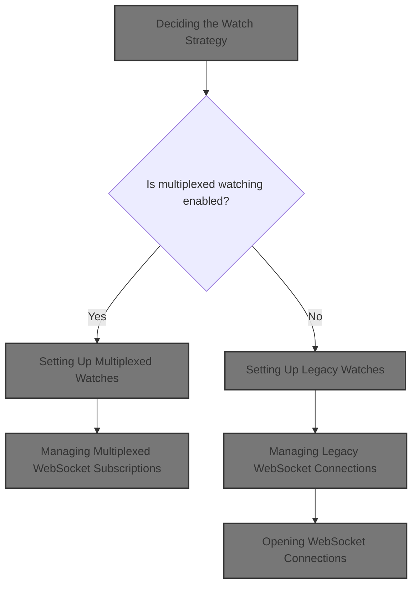
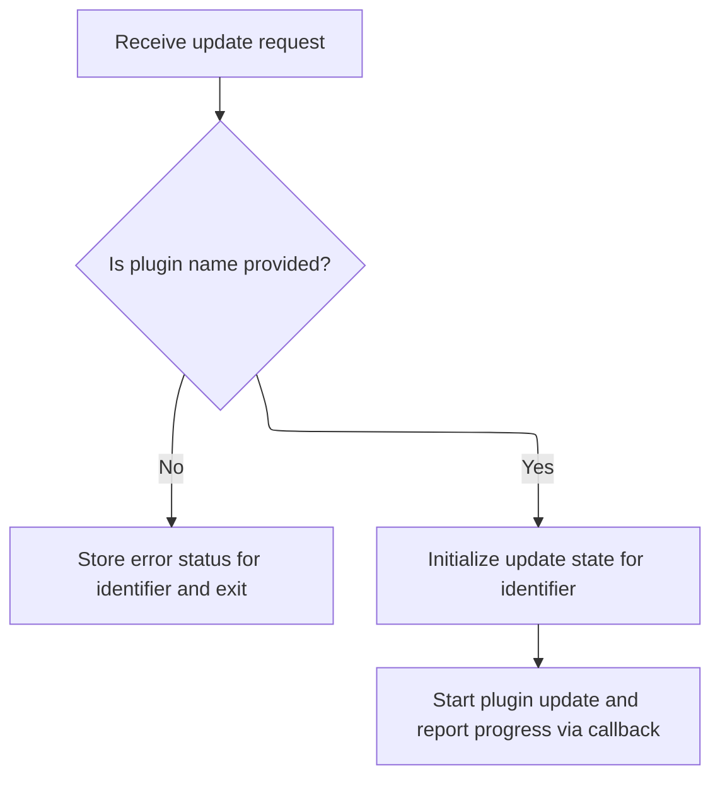
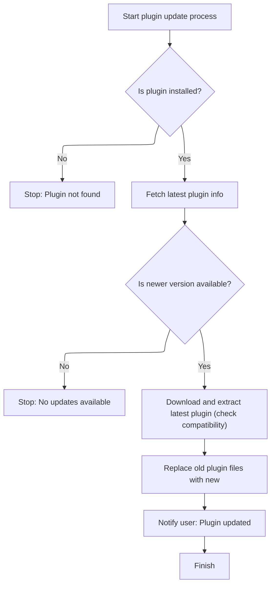
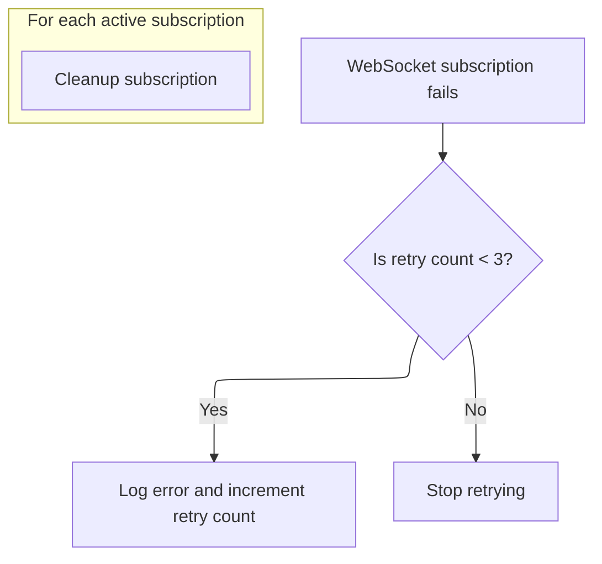
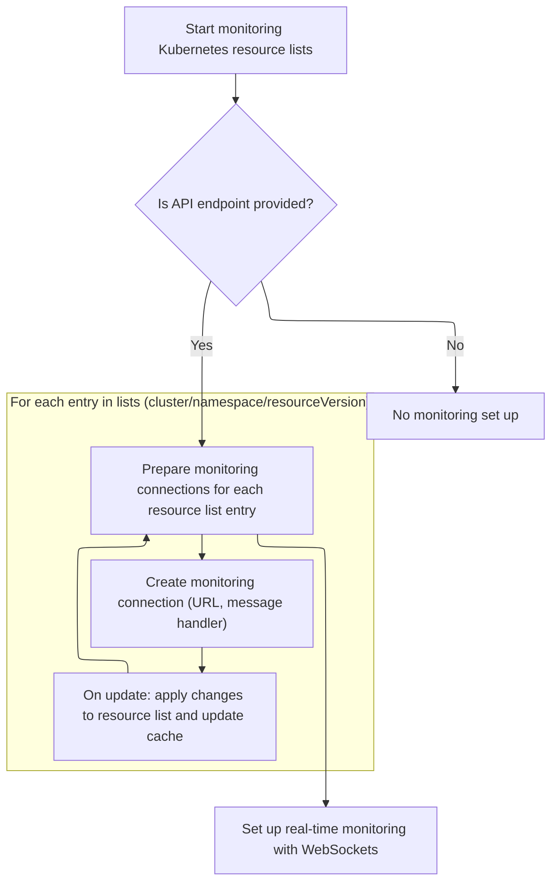
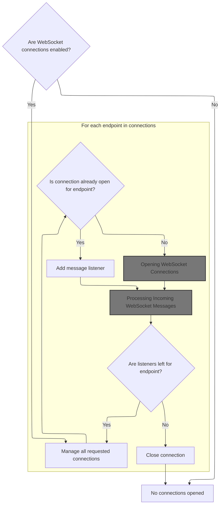
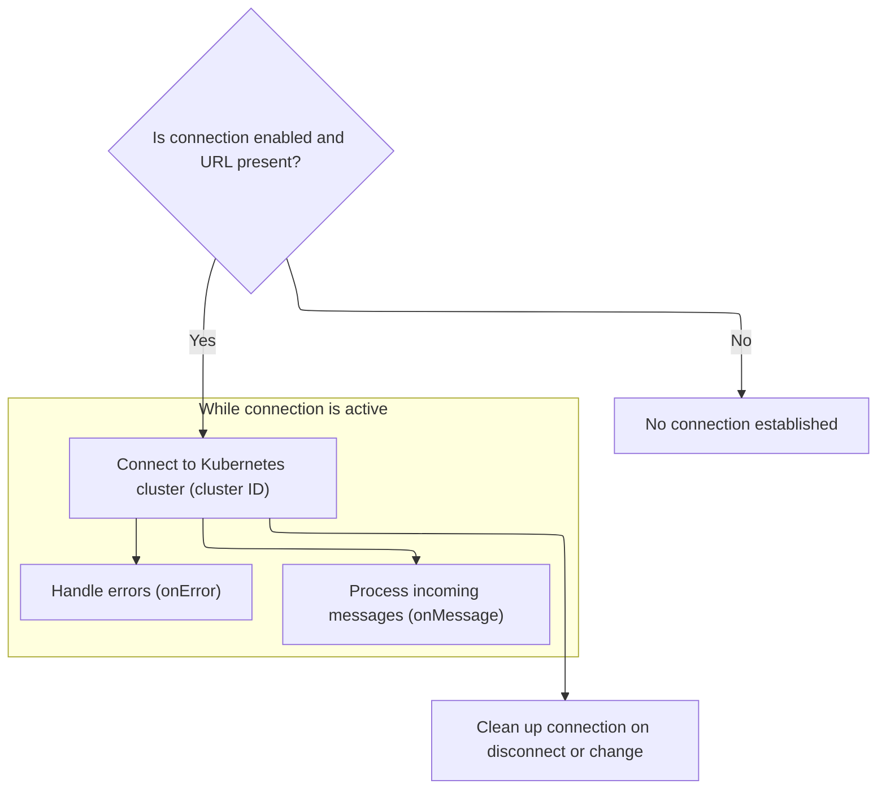
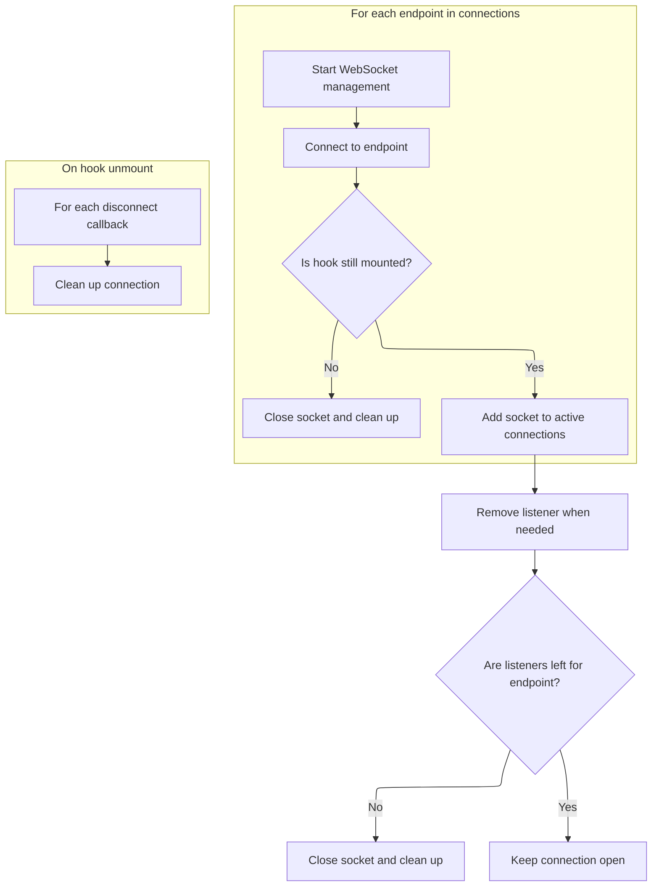

```mermaid
%%{init: {"flowchart": {"defaultRenderer": "elk"}} }%%
flowchart TD
  node1["Start WebSocket connection"] --> node2{"Is cluster specified?"}
  click node1 openCode "frontend/src/lib/k8s/api/v2/webSocket.ts:503:529"
  node2 -->|"Yes"| node3["Find kubeconfig for cluster"]
  click node2 openCode "frontend/src/lib/k8s/api/v2/webSocket.ts:532:545"
  node2 -->|"No"| node6["Create WebSocket connection"]
  click node3 openCode "frontend/src/lib/k8s/api/v2/webSocket.ts:535:542"
  node3 --> node4{"Is kubeconfig found?"}
  node4 -->|"Yes"| node5["Add user authorization to protocols"]
  click node4 openCode "frontend/src/lib/k8s/api/v2/webSocket.ts:538:541"
  node4 -->|"No"| node6
  node5 --> node6["Create WebSocket connection"]
  click node5 openCode "frontend/src/lib/k8s/api/v2/webSocket.ts:539:541"
  click node6 openCode "frontend/src/lib/k8s/api/v2/webSocket.ts:547:557"
  node6 --> node7{"When message received"}
  node7 -->|"JSON"| node8["Parse message as JSON"]
  node7 -->|"Binary"| node9["Handle message as binary"]
  click node7 openCode "frontend/src/lib/k8s/api/v2/webSocket.ts:549:551"
  click node8 openCode "frontend/src/lib/k8s/api/v2/webSocket.ts:550:551"
  click node9 openCode "frontend/src/lib/k8s/api/v2/webSocket.ts:550:551"
  node8 --> node10["Pass message to handler"]
  node9 --> node10["Pass message to handler"]
  click node10 openCode "frontend/src/lib/k8s/api/v2/webSocket.ts:551:552"
  node10 --> node11["Return WebSocket object"]
  click node11 openCode "frontend/src/lib/k8s/api/v2/webSocket.ts:557:558"
classDef HeadingStyle fill:#777777,stroke:#333,stroke-width:2px;

%% Swimm:
%% %%{init: {"flowchart": {"defaultRenderer": "elk"}} }%%
%% flowchart TD
%%   node1["Start <SwmToken path="frontend/src/lib/k8s/api/v2/useKubeObjectList.ts" pos="135:11:11" line-data="  /** Query parameters for the WebSocket connection URL */">`WebSocket`</SwmToken> connection"] --> node2{"Is cluster specified?"}
%%   click node1 openCode "<SwmPath>[frontend/…/v2/webSocket.ts](frontend/src/lib/k8s/api/v2/webSocket.ts)</SwmPath>:503:529"
%%   node2 -->|"Yes"| node3["Find kubeconfig for cluster"]
%%   click node2 openCode "<SwmPath>[frontend/…/v2/webSocket.ts](frontend/src/lib/k8s/api/v2/webSocket.ts)</SwmPath>:532:545"
%%   node2 -->|"No"| node6["Create <SwmToken path="frontend/src/lib/k8s/api/v2/useKubeObjectList.ts" pos="135:11:11" line-data="  /** Query parameters for the WebSocket connection URL */">`WebSocket`</SwmToken> connection"]
%%   click node3 openCode "<SwmPath>[frontend/…/v2/webSocket.ts](frontend/src/lib/k8s/api/v2/webSocket.ts)</SwmPath>:535:542"
%%   node3 --> node4{"Is kubeconfig found?"}
%%   node4 -->|"Yes"| node5["Add user authorization to protocols"]
%%   click node4 openCode "<SwmPath>[frontend/…/v2/webSocket.ts](frontend/src/lib/k8s/api/v2/webSocket.ts)</SwmPath>:538:541"
%%   node4 -->|"No"| node6
%%   node5 --> node6["Create <SwmToken path="frontend/src/lib/k8s/api/v2/useKubeObjectList.ts" pos="135:11:11" line-data="  /** Query parameters for the WebSocket connection URL */">`WebSocket`</SwmToken> connection"]
%%   click node5 openCode "<SwmPath>[frontend/…/v2/webSocket.ts](frontend/src/lib/k8s/api/v2/webSocket.ts)</SwmPath>:539:541"
%%   click node6 openCode "<SwmPath>[frontend/…/v2/webSocket.ts](frontend/src/lib/k8s/api/v2/webSocket.ts)</SwmPath>:547:557"
%%   node6 --> node7{"When message received"}
%%   node7 -->|"JSON"| node8["Parse message as JSON"]
%%   node7 -->|"Binary"| node9["Handle message as binary"]
%%   click node7 openCode "<SwmPath>[frontend/…/v2/webSocket.ts](frontend/src/lib/k8s/api/v2/webSocket.ts)</SwmPath>:549:551"
%%   click node8 openCode "<SwmPath>[frontend/…/v2/webSocket.ts](frontend/src/lib/k8s/api/v2/webSocket.ts)</SwmPath>:550:551"
%%   click node9 openCode "<SwmPath>[frontend/…/v2/webSocket.ts](frontend/src/lib/k8s/api/v2/webSocket.ts)</SwmPath>:550:551"
%%   node8 --> node10["Pass message to handler"]
%%   node9 --> node10["Pass message to handler"]
%%   click node10 openCode "<SwmPath>[frontend/…/v2/webSocket.ts](frontend/src/lib/k8s/api/v2/webSocket.ts)</SwmPath>:551:552"
%%   node10 --> node11["Return <SwmToken path="frontend/src/lib/k8s/api/v2/useKubeObjectList.ts" pos="135:11:11" line-data="  /** Query parameters for the WebSocket connection URL */">`WebSocket`</SwmToken> object"]
%%   click node11 openCode "<SwmPath>[frontend/…/v2/webSocket.ts](frontend/src/lib/k8s/api/v2/webSocket.ts)</SwmPath>:557:558"
%% classDef HeadingStyle fill:#777777,stroke:#333,stroke-width:2px;
```

```mermaid
%%{init: {"flowchart": {"defaultRenderer": "elk"}} }%%
flowchart TD
    node1["Request WebSocket connection for cluster+url (connectionKey)"] --> node2{"Does a connection exist for connectionKey?"}
    click node1 openCode "frontend/src/lib/k8s/api/v2/webSocket.ts:591:594"
    node2 -->|"No"| node3["Add listener for connectionKey and mark as pending"]
    click node2 openCode "frontend/src/lib/k8s/api/v2/webSocket.ts:594:599"
    node3 --> node4["Open WebSocket connection"]
    click node3 openCode "frontend/src/lib/k8s/api/v2/webSocket.ts:602:615"
    node4 --> node5{"Is connection still needed when opened?"}
    click node4 openCode "frontend/src/lib/k8s/api/v2/webSocket.ts:608:612"
    node5 -->|"No"| node6["Close WebSocket and remove from tracking"]
    click node6 openCode "frontend/src/lib/k8s/api/v2/webSocket.ts:609:611"
    node5 -->|"Yes"| node7["Store WebSocket instance for connectionKey"]
    click node7 openCode "frontend/src/lib/k8s/api/v2/webSocket.ts:614:615"
    node2 -->|"Yes"| node8["Add listener for connectionKey"]
    click node8 openCode "frontend/src/lib/k8s/api/v2/webSocket.ts:596:596"
    node3 --> node9["Return cleanup function"]
    node7 --> node9
    node8 --> node9
    node6 --> node9
    click node9 openCode "frontend/src/lib/k8s/api/v2/webSocket.ts:621:639"
    node9 --> node10["When cleanup is called: Remove listener for connectionKey"]
    click node10 openCode "frontend/src/lib/k8s/api/v2/webSocket.ts:625:626"
    node10 --> node11{"Are any listeners left for connectionKey?"}
    click node11 openCode "frontend/src/lib/k8s/api/v2/webSocket.ts:630:638"
    node11 -->|"No"| node12{"Is socket pending or open?"}
    click node12 openCode "frontend/src/lib/k8s/api/v2/webSocket.ts:631:636"
    node12 -->|"Open"| node13["Close WebSocket and remove from tracking"]
    click node13 openCode "frontend/src/lib/k8s/api/v2/webSocket.ts:634:636"
    node12 -->|"Pending"| node14["Remove from tracking"]
    click node14 openCode "frontend/src/lib/k8s/api/v2/webSocket.ts:636:637"
    node13 --> node15["Cleanup complete"]
    node14 --> node15
    node11 -->|"Yes"| node16["Keep connection open"]
    click node16 openCode "frontend/src/lib/k8s/api/v2/webSocket.ts:638:638"

classDef HeadingStyle fill:#777777,stroke:#333,stroke-width:2px;

%% Swimm:
%% %%{init: {"flowchart": {"defaultRenderer": "elk"}} }%%
%% flowchart TD
%%     node1["Request <SwmToken path="frontend/src/lib/k8s/api/v2/useKubeObjectList.ts" pos="135:11:11" line-data="  /** Query parameters for the WebSocket connection URL */">`WebSocket`</SwmToken> connection for cluster+url (<SwmToken path="frontend/src/lib/k8s/api/v2/webSocket.ts" pos="592:3:3" line-data="      const connectionKey = cluster + url;">`connectionKey`</SwmToken>)"] --> node2{"Does a connection exist for <SwmToken path="frontend/src/lib/k8s/api/v2/webSocket.ts" pos="592:3:3" line-data="      const connectionKey = cluster + url;">`connectionKey`</SwmToken>?"}
%%     click node1 openCode "<SwmPath>[frontend/…/v2/webSocket.ts](frontend/src/lib/k8s/api/v2/webSocket.ts)</SwmPath>:591:594"
%%     node2 -->|"No"| node3["Add listener for <SwmToken path="frontend/src/lib/k8s/api/v2/webSocket.ts" pos="592:3:3" line-data="      const connectionKey = cluster + url;">`connectionKey`</SwmToken> and mark as pending"]
%%     click node2 openCode "<SwmPath>[frontend/…/v2/webSocket.ts](frontend/src/lib/k8s/api/v2/webSocket.ts)</SwmPath>:594:599"
%%     node3 --> node4["Open <SwmToken path="frontend/src/lib/k8s/api/v2/useKubeObjectList.ts" pos="135:11:11" line-data="  /** Query parameters for the WebSocket connection URL */">`WebSocket`</SwmToken> connection"]
%%     click node3 openCode "<SwmPath>[frontend/…/v2/webSocket.ts](frontend/src/lib/k8s/api/v2/webSocket.ts)</SwmPath>:602:615"
%%     node4 --> node5{"Is connection still needed when opened?"}
%%     click node4 openCode "<SwmPath>[frontend/…/v2/webSocket.ts](frontend/src/lib/k8s/api/v2/webSocket.ts)</SwmPath>:608:612"
%%     node5 -->|"No"| node6["Close <SwmToken path="frontend/src/lib/k8s/api/v2/useKubeObjectList.ts" pos="135:11:11" line-data="  /** Query parameters for the WebSocket connection URL */">`WebSocket`</SwmToken> and remove from tracking"]
%%     click node6 openCode "<SwmPath>[frontend/…/v2/webSocket.ts](frontend/src/lib/k8s/api/v2/webSocket.ts)</SwmPath>:609:611"
%%     node5 -->|"Yes"| node7["Store <SwmToken path="frontend/src/lib/k8s/api/v2/useKubeObjectList.ts" pos="135:11:11" line-data="  /** Query parameters for the WebSocket connection URL */">`WebSocket`</SwmToken> instance for <SwmToken path="frontend/src/lib/k8s/api/v2/webSocket.ts" pos="592:3:3" line-data="      const connectionKey = cluster + url;">`connectionKey`</SwmToken>"]
%%     click node7 openCode "<SwmPath>[frontend/…/v2/webSocket.ts](frontend/src/lib/k8s/api/v2/webSocket.ts)</SwmPath>:614:615"
%%     node2 -->|"Yes"| node8["Add listener for <SwmToken path="frontend/src/lib/k8s/api/v2/webSocket.ts" pos="592:3:3" line-data="      const connectionKey = cluster + url;">`connectionKey`</SwmToken>"]
%%     click node8 openCode "<SwmPath>[frontend/…/v2/webSocket.ts](frontend/src/lib/k8s/api/v2/webSocket.ts)</SwmPath>:596:596"
%%     node3 --> node9["Return cleanup function"]
%%     node7 --> node9
%%     node8 --> node9
%%     node6 --> node9
%%     click node9 openCode "<SwmPath>[frontend/…/v2/webSocket.ts](frontend/src/lib/k8s/api/v2/webSocket.ts)</SwmPath>:621:639"
%%     node9 --> node10["When cleanup is called: Remove listener for <SwmToken path="frontend/src/lib/k8s/api/v2/webSocket.ts" pos="592:3:3" line-data="      const connectionKey = cluster + url;">`connectionKey`</SwmToken>"]
%%     click node10 openCode "<SwmPath>[frontend/…/v2/webSocket.ts](frontend/src/lib/k8s/api/v2/webSocket.ts)</SwmPath>:625:626"
%%     node10 --> node11{"Are any listeners left for <SwmToken path="frontend/src/lib/k8s/api/v2/webSocket.ts" pos="592:3:3" line-data="      const connectionKey = cluster + url;">`connectionKey`</SwmToken>?"}
%%     click node11 openCode "<SwmPath>[frontend/…/v2/webSocket.ts](frontend/src/lib/k8s/api/v2/webSocket.ts)</SwmPath>:630:638"
%%     node11 -->|"No"| node12{"Is socket pending or open?"}
%%     click node12 openCode "<SwmPath>[frontend/…/v2/webSocket.ts](frontend/src/lib/k8s/api/v2/webSocket.ts)</SwmPath>:631:636"
%%     node12 -->|"Open"| node13["Close <SwmToken path="frontend/src/lib/k8s/api/v2/useKubeObjectList.ts" pos="135:11:11" line-data="  /** Query parameters for the WebSocket connection URL */">`WebSocket`</SwmToken> and remove from tracking"]
%%     click node13 openCode "<SwmPath>[frontend/…/v2/webSocket.ts](frontend/src/lib/k8s/api/v2/webSocket.ts)</SwmPath>:634:636"
%%     node12 -->|"Pending"| node14["Remove from tracking"]
%%     click node14 openCode "<SwmPath>[frontend/…/v2/webSocket.ts](frontend/src/lib/k8s/api/v2/webSocket.ts)</SwmPath>:636:637"
%%     node13 --> node15["Cleanup complete"]
%%     node14 --> node15
%%     node11 -->|"Yes"| node16["Keep connection open"]
%%     click node16 openCode "<SwmPath>[frontend/…/v2/webSocket.ts](frontend/src/lib/k8s/api/v2/webSocket.ts)</SwmPath>:638:638"
%% 
%% classDef HeadingStyle fill:#777777,stroke:#333,stroke-width:2px;
```

This document describes how the system monitors multiple Kubernetes resource lists in real time, keeping the application's cache synchronized with updates from clusters and namespaces. This supports features such as live dashboards and resource management. The flow receives a list of resource lists to monitor and outputs real-time updates to the application's cache.



# Deciding the Watch Strategy

<SwmSnippet path="/frontend/src/lib/k8s/api/v2/useKubeObjectList.ts" line="127">

---

We check if multiplexed watching is enabled and, if so, hand off to the multiplexed watcher to efficiently manage multiple watches.

```typescript
export function useWatchKubeObjectLists<K extends KubeObject>({
  kubeObjectClass,
  endpoint,
  lists,
  queryParams,
}: {
  /** KubeObject class of the watched resource list */
  kubeObjectClass: (new (...args: any) => K) & typeof KubeObject<any>;
  /** Query parameters for the WebSocket connection URL */
  queryParams?: QueryParameters;
  /** Kube resource API endpoint information */
  endpoint?: KubeObjectEndpoint | null;
  /** Which clusters and namespaces to watch */
  lists: Array<{ cluster: string; namespace?: string; resourceVersion: string }>;
}) {
  if (getWebsocketMultiplexerEnabled()) {
    return useWatchKubeObjectListsMultiplexed({
      kubeObjectClass,
      endpoint,
      lists,
      queryParams,
    });
  } else {
```

---

</SwmSnippet>

## Setting Up Multiplexed Watches

<SwmSnippet path="/frontend/src/lib/k8s/api/v2/useKubeObjectList.ts" line="170">

---

In <SwmToken path="frontend/src/lib/k8s/api/v2/useKubeObjectList.ts" pos="170:2:2" line-data="function useWatchKubeObjectListsMultiplexed&lt;K extends KubeObject&gt;({">`useWatchKubeObjectListsMultiplexed`</SwmToken>, we set up multiplexed <SwmToken path="frontend/src/lib/k8s/api/v2/useKubeObjectList.ts" pos="203:5:5" line-data="      // Construct WebSocket URL with current parameters">`WebSocket`</SwmToken> subscriptions for each <SwmPath>[frontend/…/components/namespace/](frontend/src/components/namespace/)</SwmPath> combo, track the latest resource versions to avoid duplicate updates, and handle incoming updates by syncing the React Query cache. Memoization keeps connections stable, and retry logic handles failures. Next, we call into the plugin event handler to process updates.

```typescript
function useWatchKubeObjectListsMultiplexed<K extends KubeObject>({
  kubeObjectClass,
  endpoint,
  lists,
  queryParams,
}: {
  kubeObjectClass: (new (...args: any) => K) & typeof KubeObject<any>;
  endpoint?: KubeObjectEndpoint | null;
  lists: Array<{ cluster: string; namespace?: string; resourceVersion: string }>;
  queryParams?: QueryParameters;
}): void {
  const client = useQueryClient();

  // Track the latest resource versions to prevent duplicate updates
  const latestResourceVersions = useRef<Record<string, string>>({});

  // Stabilize queryParams to prevent unnecessary effect triggers
  // Only update when the stringified params change
  const stableQueryParams = useMemo(() => queryParams, [JSON.stringify(queryParams)]);

  // Create stable connection URLs for each list
  // Updates only when endpoint, lists, or stableQueryParams change
  const connections = useMemo(() => {
    if (!endpoint) {
      return [];
    }

    return lists.map(list => {
      const key = `${list.cluster}:${list.namespace || ''}`;

      // Always use the latest resource version from the server
      latestResourceVersions.current[key] = list.resourceVersion;

      // Construct WebSocket URL with current parameters
      return {
        url: makeUrl([KubeObjectEndpoint.toUrl(endpoint, list.namespace)], {
          ...stableQueryParams,
          watch: 1,
          resourceVersion: latestResourceVersions.current[key],
        }),
        cluster: list.cluster,
        namespace: list.namespace,
      };
    });
  }, [endpoint, lists, stableQueryParams]);

  // Create stable update handler to process WebSocket messages
  // Re-create only when dependencies change
  const handleUpdate = useCallback(
    (update: any, cluster: string, namespace: string | undefined) => {
      if (!update || typeof update !== 'object' || !endpoint) {
        return;
      }

      const key = `${cluster}:${namespace || ''}`;

      // Update resource version from incoming message
      if (update.object?.metadata?.resourceVersion) {
        latestResourceVersions.current[key] = update.object.metadata.resourceVersion;
      }

      // Create query key for React Query cache
      const queryKey = kubeObjectListQuery<K>(
        kubeObjectClass,
        endpoint,
        namespace,
        cluster,
        stableQueryParams ?? {}
      ).queryKey;

      // Update React Query cache with new data
      client.setQueryData(queryKey, (oldResponse: ListResponse<any> | undefined | null) => {
        if (!oldResponse) {
          return oldResponse;
        }

        const newList = KubeList.applyUpdate(oldResponse.list, update, kubeObjectClass, cluster);

        // Only update if the list actually changed
        if (newList === oldResponse.list) {
          return oldResponse;
        }

        return { ...oldResponse, list: newList };
      });
    },
    [client, kubeObjectClass, endpoint, stableQueryParams]
  );

  // Set up WebSocket subscriptions
  useEffect(() => {
    if (!endpoint || connections.length === 0) {
      return;
    }

    const cleanups: (() => void)[] = [];

    // Create subscriptions for each connection
    connections.forEach(({ url, cluster, namespace }) => {
      const parsedUrl = new URL(url, BASE_WS_URL);

      // Subscribe to WebSocket updates
      WebSocketManager.subscribe(cluster, parsedUrl.pathname, parsedUrl.search.slice(1), update =>
        handleUpdate(update, cluster, namespace)
      ).then(
        cleanup => cleanups.push(cleanup),
        error => {
```

---

</SwmSnippet>

### Handling Plugin Update Events



<SwmSnippet path="/app/electron/main.ts" line="365">

---

<SwmToken path="app/electron/main.ts" pos="365:3:3" line-data="  private handleUpdate(eventData: Action, updateCache: (progress: ProgressResp) =&gt; void) {">`handleUpdate`</SwmToken> receives an update event, validates the plugin name, sets up progress tracking, and kicks off the update by calling <SwmToken path="app/electron/main.ts" pos="383:1:3" line-data="    PluginManager.update(">`PluginManager.update`</SwmToken>. The next step is to actually perform the update logic in <SwmPath>[app/electron/plugin-management.ts](app/electron/plugin-management.ts)</SwmPath>.

```typescript
  private handleUpdate(eventData: Action, updateCache: (progress: ProgressResp) => void) {
    const { identifier, pluginName, destinationFolder, headlampVersion } = eventData;
    if (!pluginName) {
      this.cache[identifier] = {
        action: 'UPDATE',
        progress: { type: 'error', message: 'Plugin Name is required' },
      };
      return;
    }

    const controller = new AbortController();
    this.cache[identifier] = {
      action: 'UPDATE',
      percentage: 10,
      progress: { type: 'info', message: 'updating plugin' },
      controller,
    };

    PluginManager.update(
      pluginName,
      destinationFolder,
      headlampVersion,
      progress => {
        updateCache(progress);
      },
      controller.signal
    );
  }
```

---

</SwmSnippet>

### Updating the Plugin Files



<SwmSnippet path="/app/electron/plugin-management.ts" line="239">

---

In <SwmToken path="app/electron/main.ts" pos="383:1:3" line-data="    PluginManager.update(">`PluginManager.update`</SwmToken>, we check the installed plugin's version against the latest available, and if an update is needed, we download and extract the new plugin archive. The next step is to handle the extraction and metadata update.

```typescript
  static async update(
    pluginName: string,
    destinationFolder: string = defaultUserPluginsDir(),
    headlampVersion: string = '',
    progressCallback: null | ProgressCallback = null,
    signal: AbortSignal | null = null
  ): Promise<void> {
    try {
      // @todo: should list call take progressCallback?
      const installedPlugins = PluginManager.list(destinationFolder);
      if (!installedPlugins) {
        throw new Error('InstalledPlugins not found');
      }
      const plugin = installedPlugins.find(p => p.pluginName === pluginName);
      if (!plugin) {
        throw new Error('Plugin not found');
      }

      const pluginDir = path.join(destinationFolder, plugin.folderName);
      // read the package.json of the plugin
      const packageJsonPath = path.join(pluginDir, 'package.json');
      const packageJson = JSON.parse(fs.readFileSync(packageJsonPath, 'utf8'));

      const pluginData = await fetchPluginInfo(plugin.artifacthubURL, progressCallback, signal);

      const latestVersion = pluginData.version;
      const currentVersion = packageJson.artifacthub.version;

      if (semver.lte(latestVersion, currentVersion)) {
        throw new Error('No updates available');
      }

      // eslint-disable-next-line no-unused-vars
      const [_, tempFolder] = await downloadExtractArchive(
        pluginData,
        headlampVersion,
        progressCallback,
        signal
      );

```

---

</SwmSnippet>

<SwmSnippet path="/app/electron/plugin-management.ts" line="469">

---

<SwmToken path="app/electron/plugin-management.ts" pos="469:4:4" line-data="async function downloadExtractArchive(">`downloadExtractArchive`</SwmToken> checks plugin compatibility, creates a temp extraction directory, downloads and extracts the plugin archive and any extra files, and adds repository-specific metadata to <SwmPath>[package.json](package.json)</SwmPath>. This prepares the plugin for installation.

```typescript
async function downloadExtractArchive(
  pluginInfo: ArtifactHubHeadlampPkg,
  headlampVersion: string,
  progressCallback: ProgressCallback | null,
  signal: AbortSignal | null
): Promise<[string, string]> {
  // fetch plugin metadata
  if (signal && signal.aborted) {
    throw new Error('Download cancelled');
  }

  const pluginName = pluginInfo.name;
  if (!validatePluginName(pluginName)) {
    throw new Error('Invalid plugin name');
  }

  // Check if the plugin is compatible with the current Headlamp version
  if (headlampVersion) {
    if (progressCallback) {
      progressCallback({ type: 'info', message: 'Checking compatibility with Headlamp version' });
    }
    if (semver.satisfies(headlampVersion, pluginInfo.versionCompat)) {
      if (progressCallback) {
        progressCallback({ type: 'info', message: 'Headlamp version is compatible' });
      }
    } else {
      throw new Error('Headlamp version is not compatible with the plugin');
    }
  }

  if (signal && signal.aborted) {
    throw new Error('Download cancelled');
  }

  // Create temporary folder for extraction
  const tempDir = await fs.mkdtempSync(path.join(os.tmpdir(), 'headlamp-plugin-temp-'));
  // Defaulting to '' should never happen if recursive is true. So this is for the type
  // checker only.
  const tempFolder = fs.mkdirSync(path.join(tempDir, pluginName), { recursive: true }) ?? '';

  // First, download and extract the main archive
  if (progressCallback) {
    progressCallback({ type: 'info', message: 'Downloading main plugin archive' });
  }

  await downloadAndExtractSingleArchive(
    pluginInfo.archiveURL,
    pluginInfo.archiveChecksum,
    tempFolder,
    progressCallback,
    signal
  );

  await downloadExtraFiles(pluginInfo.extraFiles, tempFolder, progressCallback, signal);

  // Add artifacthub metadata to the plugin
  const packageJSON = JSON.parse(fs.readFileSync(`${tempFolder}/package.json`, 'utf8'));
  packageJSON.artifacthub = {
    name: pluginName,
    title: pluginInfo.display_name,
    url: `https://artifacthub.io/packages/headlamp/${pluginInfo.repository.name}/${pluginName}`,
    version: pluginInfo.version,
    repoName: pluginInfo.repository.name,
    author: pluginInfo.repository.user_alias,
  };
  packageJSON.isManagedByHeadlampPlugin = true;
  fs.writeFileSync(`${tempFolder}/package.json`, JSON.stringify(packageJSON, null, 2));

  return [pluginName, tempFolder];
}
```

---

</SwmSnippet>

<SwmSnippet path="/app/electron/plugin-management.ts" line="279">

---

Just returned from <SwmToken path="app/electron/plugin-management.ts" pos="272:14:14" line-data="      const [_, tempFolder] = await downloadExtractArchive(">`downloadExtractArchive`</SwmToken>. Now, we remove the old plugin folder, recreate it, and move the new plugin files in. This guarantees the plugin is fully updated and no old files remain.

```typescript
      // sleep(2000);  // comment out for testing

      // create the destination folder if it doesn't exist
      if (!fs.existsSync(destinationFolder)) {
        fs.mkdirSync(destinationFolder, { recursive: true });
      }

      // remove the existing plugin folder
      fs.rmdirSync(pluginDir, { recursive: true });

      // create the plugin folder
      fs.mkdirSync(pluginDir, { recursive: true });

      // move the plugin to the destination folder
      moveDirs(tempFolder, pluginDir);
      if (progressCallback) {
        progressCallback({ type: 'success', message: 'Plugin Updated' });
      }
    } catch (e) {
      if (progressCallback) {
        progressCallback({ type: 'error', message: e instanceof Error ? e.message : String(e) });
      } else {
        throw e;
      }
    }
  }
```

---

</SwmSnippet>

### Managing Multiplexed <SwmToken path="frontend/src/lib/k8s/api/v2/useKubeObjectList.ts" pos="135:11:11" line-data="  /** Query parameters for the WebSocket connection URL */">`WebSocket`</SwmToken> Subscriptions



<SwmSnippet path="/frontend/src/lib/k8s/api/v2/useKubeObjectList.ts" line="277">

---

Just returned from <SwmToken path="frontend/src/lib/k8s/api/v2/useKubeObjectList.ts" pos="292:11:11" line-data="  }, [connections, endpoint, handleUpdate]);">`handleUpdate`</SwmToken>. At the end of <SwmToken path="frontend/src/lib/k8s/api/v2/useKubeObjectList.ts" pos="143:3:3" line-data="    return useWatchKubeObjectListsMultiplexed({">`useWatchKubeObjectListsMultiplexed`</SwmToken>, we manage <SwmToken path="frontend/src/lib/k8s/api/v2/useKubeObjectList.ts" pos="281:6:6" line-data="            console.error(&#39;WebSocket subscription failed:&#39;, error);">`WebSocket`</SwmToken> subscriptions, retry failed connections up to 3 times, and clean up all subscriptions when dependencies change or the component unmounts.

```typescript
          // Track retry count in the URL's searchParams
          const retryCount = parseInt(parsedUrl.searchParams.get('retryCount') || '0');
          if (retryCount < 3) {
            // Only log and allow retry if under threshold
            console.error('WebSocket subscription failed:', error);
            parsedUrl.searchParams.set('retryCount', (retryCount + 1).toString());
          }
        }
      );
    });

    // Cleanup subscriptions when effect re-runs or unmounts
    return () => {
      cleanups.forEach(cleanup => cleanup());
    };
  }, [connections, endpoint, handleUpdate]);
}
```

---

</SwmSnippet>

## Fallback to Legacy Watcher

<SwmSnippet path="/frontend/src/lib/k8s/api/v2/useKubeObjectList.ts" line="150">

---

Just returned from <SwmToken path="frontend/src/lib/k8s/api/v2/useKubeObjectList.ts" pos="143:3:3" line-data="    return useWatchKubeObjectListsMultiplexed({">`useWatchKubeObjectListsMultiplexed`</SwmToken>. If multiplexed watching isn't enabled, we fall back to <SwmToken path="frontend/src/lib/k8s/api/v2/useKubeObjectList.ts" pos="150:3:3" line-data="    return useWatchKubeObjectListsLegacy({">`useWatchKubeObjectListsLegacy`</SwmToken> to maintain compatibility with older environments.

```typescript
    return useWatchKubeObjectListsLegacy({
      kubeObjectClass,
      endpoint,
      lists,
      queryParams,
    });
  }
}
```

---

</SwmSnippet>

# Setting Up Legacy Watches



<SwmSnippet path="/frontend/src/lib/k8s/api/v2/useKubeObjectList.ts" line="303">

---

<SwmToken path="frontend/src/lib/k8s/api/v2/useKubeObjectList.ts" pos="303:2:2" line-data="function useWatchKubeObjectListsLegacy&lt;K extends KubeObject&gt;({">`useWatchKubeObjectListsLegacy`</SwmToken> sets up individual <SwmToken path="frontend/src/lib/k8s/api/v2/useKubeObjectList.ts" pos="311:11:11" line-data="  /** Query parameters for the WebSocket connection URL */">`WebSocket`</SwmToken> connections for each <SwmPath>[frontend/…/components/namespace/](frontend/src/components/namespace/)</SwmPath> and handles updates by syncing the React Query cache. Next, we use <SwmToken path="frontend/src/lib/k8s/api/v2/useKubeObjectList.ts" pos="357:1:1" line-data="  useWebSockets&lt;KubeListUpdateEvent&lt;K&gt;&gt;({">`useWebSockets`</SwmToken> to actually open and manage these connections.

```typescript
function useWatchKubeObjectListsLegacy<K extends KubeObject>({
  kubeObjectClass,
  endpoint,
  lists,
  queryParams,
}: {
  /** KubeObject class of the watched resource list */
  kubeObjectClass: (new (...args: any) => K) & typeof KubeObject<any>;
  /** Query parameters for the WebSocket connection URL */
  queryParams?: QueryParameters;
  /** Kube resource API endpoint information */
  endpoint?: KubeObjectEndpoint | null;
  /** Which clusters and namespaces to watch */
  lists: Array<{ cluster: string; namespace?: string; resourceVersion: string }>;
}) {
  const client = useQueryClient();

  const connections = useMemo(() => {
    if (!endpoint) return [];

    return lists.map(({ cluster, namespace, resourceVersion }) => {
      const url = makeUrl([KubeObjectEndpoint.toUrl(endpoint!, namespace)], {
        ...queryParams,
        watch: 1,
        resourceVersion,
      });

      return {
        cluster,
        url,
        onMessage(update: KubeListUpdateEvent<K>) {
          const key = kubeObjectListQuery<K>(
            kubeObjectClass,
            endpoint,
            namespace,
            cluster,
            queryParams ?? {}
          ).queryKey;
          client.setQueryData(key, (oldResponse: ListResponse<any> | undefined | null) => {
            if (!oldResponse) return oldResponse;

            const newList = KubeList.applyUpdate(
              oldResponse.list,
              update,
              kubeObjectClass,
              cluster
            );
            return { ...oldResponse, list: newList };
          });
        },
      };
    });
  }, [lists, kubeObjectClass, endpoint]);

  useWebSockets<KubeListUpdateEvent<K>>({
    enabled: !!endpoint,
    connections,
  });
}
```

---

</SwmSnippet>

# Managing Legacy <SwmToken path="frontend/src/lib/k8s/api/v2/useKubeObjectList.ts" pos="135:11:11" line-data="  /** Query parameters for the WebSocket connection URL */">`WebSocket`</SwmToken> Connections



<SwmSnippet path="/frontend/src/lib/k8s/api/v2/webSocket.ts" line="566">

---

In <SwmToken path="frontend/src/lib/k8s/api/v2/webSocket.ts" pos="566:4:4" line-data="export function useWebSockets&lt;T&gt;({">`useWebSockets`</SwmToken>, we use global maps to track <SwmToken path="frontend/src/lib/k8s/api/v2/webSocket.ts" pos="576:15:15" line-data="   * Any additional protocols to include in WebSocket connection">`WebSocket`</SwmToken> connections and listeners, sharing sockets when possible and cleaning up when no listeners remain. Next, we open the actual <SwmToken path="frontend/src/lib/k8s/api/v2/webSocket.ts" pos="576:15:15" line-data="   * Any additional protocols to include in WebSocket connection">`WebSocket`</SwmToken> connections.

```typescript
export function useWebSockets<T>({
  connections,
  enabled = true,
  protocols,
  type = 'json',
}: {
  enabled?: boolean;
  /** Make sure that connections value is stable between renders */
  connections: Array<WebSocketConnectionRequest<T>>;
  /**
   * Any additional protocols to include in WebSocket connection
   * make sure that the value is stable between renders
   */
  protocols?: string | string[];
  /**
   * Type of websocket data
   */
  type?: 'json' | 'binary';
}) {
  useEffect(() => {
    if (!enabled) return;

    let isCurrent = true;

    /** Open a connection to websocket */
    function connect({ cluster, url, onMessage }: WebSocketConnectionRequest<T>) {
      const connectionKey = cluster + url;

      if (!sockets.has(connectionKey)) {
        // Add new listener for this URL
        listeners.set(connectionKey, [...(listeners.get(connectionKey) ?? []), onMessage]);

        // Mark socket as pending, so we don't open more than one
        sockets.set(connectionKey, 'pending');

        let ws: WebSocket | undefined;
        openWebSocket(url, { protocols, type, cluster, onMessage })
          .then(socket => {
```

---

</SwmSnippet>

## Opening <SwmToken path="frontend/src/lib/k8s/api/v2/useKubeObjectList.ts" pos="135:11:11" line-data="  /** Query parameters for the WebSocket connection URL */">`WebSocket`</SwmToken> Connections



<SwmSnippet path="/frontend/src/lib/k8s/api/v2/webSocket.ts" line="503">

---

<SwmToken path="frontend/src/lib/k8s/api/v2/webSocket.ts" pos="503:6:6" line-data="export async function openWebSocket&lt;T&gt;(">`openWebSocket`</SwmToken> builds the connection URL, adds custom protocols for cluster and user authorization, and opens the socket. Incoming messages are parsed and passed to the <SwmToken path="frontend/src/lib/k8s/api/v2/webSocket.ts" pos="509:1:1" line-data="    onMessage,">`onMessage`</SwmToken> handler. Next, we handle those messages in the hooks.

```typescript
export async function openWebSocket<T>(
  url: string,
  {
    protocols: moreProtocols = [],
    type = 'binary',
    cluster = getCluster() ?? '',
    onMessage,
  }: {
    /**
     * Any additional protocols to include in WebSocket connection
     */
    protocols?: string | string[];
    /**
     *
     */
    type: 'json' | 'binary';
    /**
     * Cluster name
     */
    cluster?: string;
    /**
     * Message callback
     */
    onMessage: (data: T) => void;
  }
) {
  const path = [url];
  const protocols = ['base64.binary.k8s.io', ...(moreProtocols ?? [])];

  if (cluster) {
    path.unshift('clusters', cluster);

    try {
      const kubeconfig = await findKubeconfigByClusterName(cluster);

      if (kubeconfig !== null) {
        const userID = getUserIdFromLocalStorage();
        protocols.push(`base64url.headlamp.authorization.k8s.io.${userID}`);
      }
    } catch (error) {
      console.error('Error while finding kubeconfig:', error);
    }
  }

  const socket = new WebSocket(makeUrl([getBaseWsUrl(), ...path], {}), protocols);
  socket.binaryType = 'arraybuffer';
  socket.addEventListener('message', (body: MessageEvent) => {
    const data = type === 'json' ? JSON.parse(body.data) : body.data;
    onMessage(data);
  });
  socket.addEventListener('error', error => {
    console.error('WebSocket error:', error);
  });

  return socket;
}
```

---

</SwmSnippet>

## Processing Incoming <SwmToken path="frontend/src/lib/k8s/api/v2/useKubeObjectList.ts" pos="135:11:11" line-data="  /** Query parameters for the WebSocket connection URL */">`WebSocket`</SwmToken> Messages

<SwmSnippet path="/frontend/src/lib/k8s/api/v2/hooks.ts" line="152">

---

<SwmToken path="frontend/src/lib/k8s/api/v2/useKubeObjectList.ts" pos="333:1:1" line-data="        onMessage(update: KubeListUpdateEvent&lt;K&gt;) {">`onMessage`</SwmToken> processes incoming <SwmToken path="frontend/src/lib/k8s/api/v2/useKubeObjectList.ts" pos="135:11:11" line-data="  /** Query parameters for the WebSocket connection URL */">`WebSocket`</SwmToken> updates, and if the event isn't 'ADDED', it updates the React Query cache with the new object. Next, we continue handling <SwmToken path="frontend/src/lib/k8s/api/v2/useKubeObjectList.ts" pos="135:11:11" line-data="  /** Query parameters for the WebSocket connection URL */">`WebSocket`</SwmToken> events.

```typescript
    onMessage(update: KubeListUpdateEvent<K>) {
      if (update.type !== 'ADDED' && update.object) {
        client.setQueryData(queryKey, new kubeObjectClass(update.object));
      }
    },
```

---

</SwmSnippet>

## Connecting and Managing Single <SwmToken path="frontend/src/lib/k8s/api/v2/useKubeObjectList.ts" pos="135:11:11" line-data="  /** Query parameters for the WebSocket connection URL */">`WebSocket`</SwmToken>



<SwmSnippet path="/frontend/src/lib/k8s/api/v2/webSocket.ts" line="416">

---

<SwmToken path="frontend/src/lib/k8s/api/v2/webSocket.ts" pos="416:4:4" line-data="export function useWebSocket&lt;T&gt;({">`useWebSocket`</SwmToken> sets up a stable message handler that parses incoming data and passes it to the callback, handling errors if parsing fails. Next, we actually connect the <SwmToken path="frontend/src/lib/k8s/api/v2/webSocket.ts" pos="423:11:11" line-data="  /** Function that returns the WebSocket URL to connect to */">`WebSocket`</SwmToken> and manage cleanup.

```typescript
export function useWebSocket<T>({
  url: createUrl,
  enabled = true,
  cluster = '',
  onMessage,
  onError,
}: {
  /** Function that returns the WebSocket URL to connect to */
  url: () => string;
  /** Whether the WebSocket connection should be active */
  enabled?: boolean;
  /** The Kubernetes cluster ID to watch */
  cluster?: string;
  /** Callback function to handle incoming messages */
  onMessage: (data: T) => void;
  /** Callback function to handle connection errors */
  onError?: (error: Error) => void;
}) {
  const url = useMemo(() => (enabled ? createUrl() : ''), [enabled, createUrl]);

  const stableOnMessage = useCallback(
    (rawData: any) => {
      try {
        let parsedData: T;
        try {
          parsedData = typeof rawData === 'string' ? JSON.parse(rawData) : rawData;
        } catch (parseError) {
          console.error('Failed to parse WebSocket message:', parseError);
          onError?.(parseError as Error);
          return;
        }

        onMessage(parsedData);
      } catch (err) {
        console.error('Failed to process WebSocket message:', err);
        onError?.(err as Error);
      }
    },
    [onMessage, onError]
  );

```

---

</SwmSnippet>

<SwmSnippet path="/frontend/src/lib/k8s/api/v2/webSocket.ts" line="457">

---

Just returned from the message handler. In <SwmToken path="frontend/src/lib/k8s/api/v2/webSocket.ts" pos="416:4:4" line-data="export function useWebSocket&lt;T&gt;({">`useWebSocket`</SwmToken>, we use <SwmToken path="frontend/src/lib/k8s/api/v2/webSocket.ts" pos="457:1:1" line-data="  useEffect(() =&gt; {">`useEffect`</SwmToken> to connect the <SwmToken path="frontend/src/lib/k8s/api/v2/webSocket.ts" pos="474:6:6" line-data="        console.error(&#39;WebSocket connection failed:&#39;, err);">`WebSocket`</SwmToken>, subscribe to updates, and clean up when done. Next, we handle the actual subscription logic.

```typescript
  useEffect(() => {
    if (!enabled || !url) {
      return;
    }

    let cleanup: (() => void) | undefined;

    const connectWebSocket = async () => {
      try {
        const parsedUrl = new URL(url, getBaseWsUrl());
        cleanup = await WebSocketManager.subscribe(
          cluster,
          parsedUrl.pathname,
          parsedUrl.search.slice(1),
          stableOnMessage
        );
      } catch (err) {
        console.error('WebSocket connection failed:', err);
        onError?.(err as Error);
      }
    };

    connectWebSocket();

    return () => {
      if (cleanup) {
        cleanup();
      }
    };
  }, [url, enabled, cluster, stableOnMessage, onError]);
}
```

---

</SwmSnippet>

<SwmSnippet path="/frontend/src/lib/k8s/api/v2/webSocket.ts" line="464">

---

<SwmToken path="frontend/src/lib/k8s/api/v2/webSocket.ts" pos="464:3:3" line-data="    const connectWebSocket = async () =&gt; {">`connectWebSocket`</SwmToken> parses the url, subscribes to updates, and handles errors if the url is invalid or the subscription fails.

```typescript
    const connectWebSocket = async () => {
      try {
        const parsedUrl = new URL(url, getBaseWsUrl());
        cleanup = await WebSocketManager.subscribe(
          cluster,
          parsedUrl.pathname,
          parsedUrl.search.slice(1),
          stableOnMessage
        );
      } catch (err) {
        console.error('WebSocket connection failed:', err);
        onError?.(err as Error);
      }
    };
```

---

</SwmSnippet>

## Cleaning Up <SwmToken path="frontend/src/lib/k8s/api/v2/useKubeObjectList.ts" pos="135:11:11" line-data="  /** Query parameters for the WebSocket connection URL */">`WebSocket`</SwmToken> Connections



<SwmSnippet path="/frontend/src/lib/k8s/api/v2/webSocket.ts" line="604">

---

Just returned from opening the <SwmToken path="frontend/src/lib/k8s/api/v2/webSocket.ts" pos="606:19:19" line-data="            // Hook was unmounted while it was connecting to WebSocket">`WebSocket`</SwmToken>. At the end of <SwmToken path="frontend/src/lib/k8s/api/v2/useKubeObjectList.ts" pos="357:1:1" line-data="  useWebSockets&lt;KubeListUpdateEvent&lt;K&gt;&gt;({">`useWebSockets`</SwmToken>, we clean up listeners and close sockets when no one is listening, freeing up resources and avoiding leaks.

```typescript
            ws = socket;

            // Hook was unmounted while it was connecting to WebSocket
            // so we close the socket and clean up
            if (!isCurrent) {
              ws.close();
              sockets.delete(connectionKey);
              return;
            }

            sockets.set(connectionKey, ws);
          })
          .catch(err => {
            console.error(err);
          });
      }

      return () => {
        const connectionKey = cluster + url;

        // Clean up the listener
        const newListeners = listeners.get(connectionKey)?.filter(it => it !== onMessage) ?? [];
        listeners.set(connectionKey, newListeners);

        // No one is listening to the connection
        // so we can close it
        if (newListeners.length === 0) {
          const maybeExisting = sockets.get(connectionKey);
          if (maybeExisting) {
            if (maybeExisting !== 'pending') {
              maybeExisting.close();
            }
            sockets.delete(connectionKey);
          }
        }
      };
    }

    const disconnectCallbacks = connections.map(endpoint => connect(endpoint));

    return () => {
      isCurrent = false;
      disconnectCallbacks.forEach(fn => fn());
    };
  }, [enabled, type, connections, protocols]);
}
```

---

</SwmSnippet>

# Establishing Individual <SwmToken path="frontend/src/lib/k8s/api/v2/useKubeObjectList.ts" pos="135:11:11" line-data="  /** Query parameters for the WebSocket connection URL */">`WebSocket`</SwmToken> Connections



<SwmSnippet path="/frontend/src/lib/k8s/api/v2/webSocket.ts" line="591">

---

In <SwmToken path="frontend/src/lib/k8s/api/v2/webSocket.ts" pos="591:3:3" line-data="    function connect({ cluster, url, onMessage }: WebSocketConnectionRequest&lt;T&gt;) {">`connect`</SwmToken>, we use <SwmToken path="frontend/src/lib/k8s/api/v2/webSocket.ts" pos="592:3:3" line-data="      const connectionKey = cluster + url;">`connectionKey`</SwmToken> to manage sockets and listeners, set the socket to 'pending' while connecting, and avoid duplicate connections. Next, we handle the socket opening and cleanup.

```typescript
    function connect({ cluster, url, onMessage }: WebSocketConnectionRequest<T>) {
      const connectionKey = cluster + url;

      if (!sockets.has(connectionKey)) {
        // Add new listener for this URL
        listeners.set(connectionKey, [...(listeners.get(connectionKey) ?? []), onMessage]);

        // Mark socket as pending, so we don't open more than one
        sockets.set(connectionKey, 'pending');

        let ws: WebSocket | undefined;
        openWebSocket(url, { protocols, type, cluster, onMessage })
          .then(socket => {
```

---

</SwmSnippet>

<SwmSnippet path="/frontend/src/lib/k8s/api/v2/webSocket.ts" line="604">

---

Just returned from opening the socket. At the end of the function, we clean up listeners and sockets when no one is listening, closing sockets unless they're still pending and deleting them from the map to avoid leaks.

```typescript
            ws = socket;

            // Hook was unmounted while it was connecting to WebSocket
            // so we close the socket and clean up
            if (!isCurrent) {
              ws.close();
              sockets.delete(connectionKey);
              return;
            }

            sockets.set(connectionKey, ws);
          })
          .catch(err => {
            console.error(err);
          });
      }

      return () => {
        const connectionKey = cluster + url;

        // Clean up the listener
        const newListeners = listeners.get(connectionKey)?.filter(it => it !== onMessage) ?? [];
        listeners.set(connectionKey, newListeners);

        // No one is listening to the connection
        // so we can close it
        if (newListeners.length === 0) {
          const maybeExisting = sockets.get(connectionKey);
          if (maybeExisting) {
            if (maybeExisting !== 'pending') {
              maybeExisting.close();
            }
            sockets.delete(connectionKey);
          }
        }
      };
    }
```

---

</SwmSnippet>

&nbsp;

*This is an auto-generated document by Swimm 🌊 and has not yet been verified by a human*

<SwmMeta version="3.0.0" repo-id="Z2l0aHViJTNBJTNBdHlwZXNjcmlwdC1oZWFkbGFtcCUzQSUzQXJpY2FyZG9sb3Blemc=" repo-name="typescript-headlamp"><sup>Powered by [Swimm](https://app.swimm.io/)</sup></SwmMeta>
