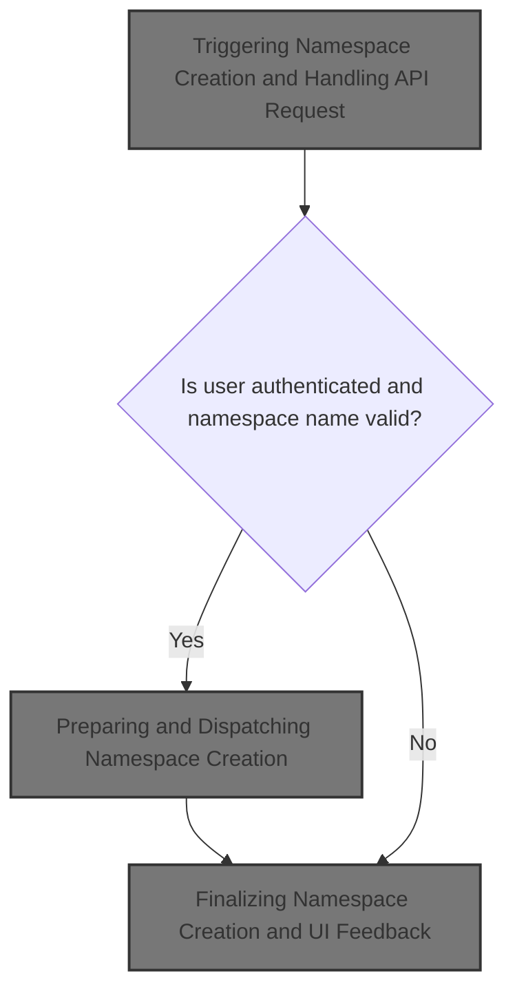

This document describes how users can create a new namespace using the application's interface. Users open the creation dialog, enter a name, and confirm the action. The system validates the name, sends a creation request, and provides feedback about the result.



# Triggering Namespace Creation and Handling API Request

<SwmSnippet path="/frontend/src/components/namespace/CreateNamespaceButton.tsx" line="35">

---

In <SwmToken path="frontend/src/components/namespace/CreateNamespaceButton.tsx" pos="35:6:6" line-data="export default function CreateNamespaceButton() {">`CreateNamespaceButton`</SwmToken>, we set up state and event handlers for the namespace creation dialog. The flow starts here by collecting the namespace name and validating it. We need to call <SwmToken path="frontend/src/components/namespace/CreateNamespaceButton.tsx" pos="56:5:5" line-data="    async function namespaceRequest() {">`namespaceRequest`</SwmToken> next to actually send the creation request to the backend, since that's where the API call happens.

```tsx
export default function CreateNamespaceButton() {
  const { t } = useTranslation(['glossary', 'translation']);
  const [namespaceName, setNamespaceName] = useState('');
  const [isValidNamespaceName, setIsValidNamespaceName] = useState(false);
  const [nameHelperMessage, setNameHelperMessage] = useState('');
  const [namespaceDialogOpen, setNamespaceDialogOpen] = useState(false);
  const dispatchCreateEvent = useEventCallback(HeadlampEventType.CREATE_RESOURCE);
  const dispatch: AppDispatch = useDispatch();

  function createNewNamespace() {
    const clusterData = getCluster();
    const newNamespaceData = {
      apiVersion: 'v1',
      kind: 'Namespace',
      metadata: {
        name: namespaceName,
      },
    };

    const newNamespaceName = newNamespaceData.metadata.name;

    async function namespaceRequest() {
      try {
        const response = await Namespace.apiEndpoint.post(newNamespaceData, {}, clusterData || '');
        setNamespaceName('');
        return response;
      } catch (error: any) {
        const statusCode = error?.status;
        console.error('Error creating namespace:', error);
        if (statusCode === 409) {
          setNamespaceDialogOpen(true);
          setIsValidNamespaceName(false);
          setNameHelperMessage(t('translation|A namespace with this name already exists.'));
        }
        throw error;
      }
    }

    setNamespaceDialogOpen(false);

    dispatch(
      clusterAction(() => namespaceRequest(), {
        startMessage: t('translation|Applying {{  newItemName  }}…', {
          newItemName: newNamespaceName,
        }),
        cancelledMessage: t('translation|Cancelled applying  {{  newItemName  }}.', {
          newItemName: newNamespaceName,
        }),
        successMessage: t('translation|Applied {{ newItemName }}.', {
          newItemName: newNamespaceName,
        }),
        errorMessage: t('translation|Failed to create {{ kind }} {{ name }}.', {
          kind: 'namespace',
          name: newNamespaceName,
        }),
        cancelCallback: () => {
```

---

</SwmSnippet>

<SwmSnippet path="/frontend/src/components/namespace/CreateNamespaceButton.tsx" line="56">

---

<SwmToken path="frontend/src/components/namespace/CreateNamespaceButton.tsx" pos="56:5:5" line-data="    async function namespaceRequest() {">`namespaceRequest`</SwmToken> sends the API request to create the namespace using the data and cluster info from the parent scope. It handles errors, especially duplicate names, by updating the UI state and helper messages. The function relies on closure variables, so you need to know the surrounding context to understand what it's actually sending.

```tsx
    async function namespaceRequest() {
      try {
        const response = await Namespace.apiEndpoint.post(newNamespaceData, {}, clusterData || '');
        setNamespaceName('');
        return response;
      } catch (error: any) {
        const statusCode = error?.status;
        console.error('Error creating namespace:', error);
        if (statusCode === 409) {
          setNamespaceDialogOpen(true);
          setIsValidNamespaceName(false);
          setNameHelperMessage(t('translation|A namespace with this name already exists.'));
        }
        throw error;
      }
    }
```

---

</SwmSnippet>

<SwmSnippet path="/frontend/src/components/namespace/CreateNamespaceButton.tsx" line="91">

---

Back in <SwmToken path="frontend/src/components/namespace/CreateNamespaceButton.tsx" pos="35:6:6" line-data="export default function CreateNamespaceButton() {">`CreateNamespaceButton`</SwmToken>, after returning from <SwmToken path="frontend/src/components/namespace/CreateNamespaceButton.tsx" pos="56:5:5" line-data="    async function namespaceRequest() {">`namespaceRequest`</SwmToken>, we handle the UI feedback and dialog state. We call <SwmToken path="frontend/src/components/namespace/CreateNamespaceButton.tsx" pos="151:1:1" line-data="                    createNewNamespace();">`createNewNamespace`</SwmToken> when the user confirms, which wraps the API call and manages feedback messages for each stage (start, success, error, cancel).

```tsx
          setNamespaceDialogOpen(true);
        },
      })
    );
  }

  useEffect(() => {
    const isValidNamespaceFormat = Namespace.isValidNamespaceFormat(namespaceName);
    setIsValidNamespaceName(isValidNamespaceFormat);

    if (!isValidNamespaceFormat) {
      if (namespaceName.length > 63) {
        setNameHelperMessage(t('translation|Namespaces must be under 64 characters.'));
      } else {
        setNameHelperMessage(
          t(
            "translation|Namespaces must contain only lowercase alphanumeric characters or '-', and must start and end with an alphanumeric character."
          )
        );
      }
    }
  }, [namespaceName]);

  return (
    <AuthVisible item={Namespace} authVerb="create">
      <ActionButton
        data-testid="create-namespace-button"
        color="primary"
        description={t('translation|Create Namespace')}
        icon={'mdi:plus-circle'}
        onClick={() => {
          setNamespaceDialogOpen(true);
        }}
      />

      <Dialog
        aria-label="Dialog"
        open={namespaceDialogOpen}
        onClose={() => setNamespaceDialogOpen(false)}
      >
        <DialogTitle>{t('translation|Create Namespace')}</DialogTitle>
        <DialogContent>
          <Box component="form" style={{ width: '20vw', maxWidth: '20vw' }}>
            <TextField
              margin="dense"
              id="name"
              aria-label="Name"
              label={t('translation|Name')}
              type="text"
              error={!isValidNamespaceName && namespaceName.length > 0}
              helperText={
                !isValidNamespaceName && namespaceName.length > 0 ? nameHelperMessage : ''
              }
              fullWidth
              value={namespaceName}
              onChange={event => setNamespaceName(event.target.value.toLowerCase())}
              onKeyDown={e => {
                if (e.key === 'Enter') {
                  e.preventDefault();
                  if (isValidNamespaceName) {
                    createNewNamespace();
                    dispatchCreateEvent({
                      status: EventStatus.CONFIRMED,
                    });
                  }
                }
              }}
            />
          </Box>
        </DialogContent>
        <DialogActions>
          <Button
            data-testid="create-namespace-dialog-cancel-button"
            onClick={() => {
              setNamespaceDialogOpen(false);
            }}
          >
            {t('translation|Cancel')}
          </Button>
          <Button
            data-testid="create-namespace-dialog-create-button"
            disabled={!isValidNamespaceName}
            onClick={() => {
              createNewNamespace();
```

---

</SwmSnippet>

## Preparing and Dispatching Namespace Creation

```mermaid
%%{init: {"flowchart": {"defaultRenderer": "elk"}} }%%
flowchart TD
    node1["Close any open namespace dialog"]
    click node1 openCode "frontend/src/components/namespace/CreateNamespaceButton.tsx:73:74"
    node1 --> node2["Prepare new namespace data"]
    click node2 openCode "frontend/src/components/namespace/CreateNamespaceButton.tsx:45:54"
    node2 --> node3["Dispatch namespace creation request with feedback messages"]
    click node3 openCode "frontend/src/components/namespace/CreateNamespaceButton.tsx:75:94"
    node3 --> node4{"Did creation fail due to conflict?"}
    click node4 openCode "frontend/src/components/namespace/CreateNamespaceButton.tsx:64:68"
    node4 -->|"Yes"| node5["Open dialog and inform user: Namespace already exists"]
    click node5 openCode "frontend/src/components/namespace/CreateNamespaceButton.tsx:65:67"
    node4 -->|"No"| node6["Show success or error feedback to user"]
    click node6 openCode "frontend/src/components/namespace/CreateNamespaceButton.tsx:77:89"
    node3 -->|"Cancelled"| node7["Reopen dialog"]
    click node7 openCode "frontend/src/components/namespace/CreateNamespaceButton.tsx:91:92"

classDef HeadingStyle fill:#777777,stroke:#333,stroke-width:2px;

%% Swimm:
%% %%{init: {"flowchart": {"defaultRenderer": "elk"}} }%%
%% flowchart TD
%%     node1["Close any open namespace dialog"]
%%     click node1 openCode "<SwmPath>[frontend/…/namespace/CreateNamespaceButton.tsx](frontend/src/components/namespace/CreateNamespaceButton.tsx)</SwmPath>:73:74"
%%     node1 --> node2["Prepare new namespace data"]
%%     click node2 openCode "<SwmPath>[frontend/…/namespace/CreateNamespaceButton.tsx](frontend/src/components/namespace/CreateNamespaceButton.tsx)</SwmPath>:45:54"
%%     node2 --> node3["Dispatch namespace creation request with feedback messages"]
%%     click node3 openCode "<SwmPath>[frontend/…/namespace/CreateNamespaceButton.tsx](frontend/src/components/namespace/CreateNamespaceButton.tsx)</SwmPath>:75:94"
%%     node3 --> node4{"Did creation fail due to conflict?"}
%%     click node4 openCode "<SwmPath>[frontend/…/namespace/CreateNamespaceButton.tsx](frontend/src/components/namespace/CreateNamespaceButton.tsx)</SwmPath>:64:68"
%%     node4 -->|"Yes"| node5["Open dialog and inform user: Namespace already exists"]
%%     click node5 openCode "<SwmPath>[frontend/…/namespace/CreateNamespaceButton.tsx](frontend/src/components/namespace/CreateNamespaceButton.tsx)</SwmPath>:65:67"
%%     node4 -->|"No"| node6["Show success or error feedback to user"]
%%     click node6 openCode "<SwmPath>[frontend/…/namespace/CreateNamespaceButton.tsx](frontend/src/components/namespace/CreateNamespaceButton.tsx)</SwmPath>:77:89"
%%     node3 -->|"Cancelled"| node7["Reopen dialog"]
%%     click node7 openCode "<SwmPath>[frontend/…/namespace/CreateNamespaceButton.tsx](frontend/src/components/namespace/CreateNamespaceButton.tsx)</SwmPath>:91:92"
%% 
%% classDef HeadingStyle fill:#777777,stroke:#333,stroke-width:2px;
```



<SwmSnippet path="/frontend/src/components/namespace/CreateNamespaceButton.tsx" line="44">

---

In <SwmToken path="frontend/src/components/namespace/CreateNamespaceButton.tsx" pos="44:3:3" line-data="  function createNewNamespace() {">`createNewNamespace`</SwmToken>, we prep the namespace data and cluster info, then define <SwmToken path="frontend/src/components/namespace/CreateNamespaceButton.tsx" pos="56:5:5" line-data="    async function namespaceRequest() {">`namespaceRequest`</SwmToken> to handle the API call. The function manages dialog state and validation, and wraps the API request in a dispatch call to handle feedback for each stage. Calling <SwmToken path="frontend/src/components/namespace/CreateNamespaceButton.tsx" pos="56:5:5" line-data="    async function namespaceRequest() {">`namespaceRequest`</SwmToken> here actually sends the request and triggers the UI updates.

```tsx
  function createNewNamespace() {
    const clusterData = getCluster();
    const newNamespaceData = {
      apiVersion: 'v1',
      kind: 'Namespace',
      metadata: {
        name: namespaceName,
      },
    };

    const newNamespaceName = newNamespaceData.metadata.name;

    async function namespaceRequest() {
      try {
        const response = await Namespace.apiEndpoint.post(newNamespaceData, {}, clusterData || '');
        setNamespaceName('');
        return response;
      } catch (error: any) {
        const statusCode = error?.status;
        console.error('Error creating namespace:', error);
        if (statusCode === 409) {
          setNamespaceDialogOpen(true);
          setIsValidNamespaceName(false);
          setNameHelperMessage(t('translation|A namespace with this name already exists.'));
        }
        throw error;
      }
    }

    setNamespaceDialogOpen(false);

    dispatch(
      clusterAction(() => namespaceRequest(), {
        startMessage: t('translation|Applying {{  newItemName  }}…', {
          newItemName: newNamespaceName,
        }),
        cancelledMessage: t('translation|Cancelled applying  {{  newItemName  }}.', {
          newItemName: newNamespaceName,
        }),
        successMessage: t('translation|Applied {{ newItemName }}.', {
          newItemName: newNamespaceName,
        }),
        errorMessage: t('translation|Failed to create {{ kind }} {{ name }}.', {
          kind: 'namespace',
          name: newNamespaceName,
        }),
        cancelCallback: () => {
```

---

</SwmSnippet>

<SwmSnippet path="/frontend/src/components/namespace/CreateNamespaceButton.tsx" line="91">

---

After returning from <SwmToken path="frontend/src/components/namespace/CreateNamespaceButton.tsx" pos="56:5:5" line-data="    async function namespaceRequest() {">`namespaceRequest`</SwmToken>, <SwmToken path="frontend/src/components/namespace/CreateNamespaceButton.tsx" pos="44:3:3" line-data="  function createNewNamespace() {">`createNewNamespace`</SwmToken> uses dispatch to wrap the request and handle feedback for all outcomes. The <SwmToken path="frontend/src/components/namespace/CreateNamespaceButton.tsx" pos="90:1:1" line-data="        cancelCallback: () =&gt; {">`cancelCallback`</SwmToken> and error handling update the dialog state so the user knows what happened.

```tsx
          setNamespaceDialogOpen(true);
        },
      })
    );
  }
```

---

</SwmSnippet>

## Finalizing Namespace Creation and UI Feedback

```mermaid
%%{init: {"flowchart": {"defaultRenderer": "elk"}} }%%
flowchart TD
    node1{"Is user authenticated?"}
    click node1 openCode "frontend/src/components/namespace/CreateNamespaceButton.tsx:184:185"
    node1 -->|"Yes"| node2["Show 'Create Namespace' button"]
    click node2 openCode "frontend/src/components/namespace/CreateNamespaceButton.tsx:180:181"
    node2 --> node3{"Does user confirm creation?"}
    click node3 openCode "frontend/src/components/namespace/CreateNamespaceButton.tsx:175:178"
    node3 -->|"Yes"| node4["Trigger namespace creation (EventStatus: CONFIRMED)"]
    click node4 openCode "frontend/src/components/namespace/CreateNamespaceButton.tsx:175:177"
    node1 -->|"No"| node5["Button not visible"]
    click node5 openCode "frontend/src/components/namespace/CreateNamespaceButton.tsx:184:185"

classDef HeadingStyle fill:#777777,stroke:#333,stroke-width:2px;

%% Swimm:
%% %%{init: {"flowchart": {"defaultRenderer": "elk"}} }%%
%% flowchart TD
%%     node1{"Is user authenticated?"}
%%     click node1 openCode "<SwmPath>[frontend/…/namespace/CreateNamespaceButton.tsx](frontend/src/components/namespace/CreateNamespaceButton.tsx)</SwmPath>:184:185"
%%     node1 -->|"Yes"| node2["Show 'Create Namespace' button"]
%%     click node2 openCode "<SwmPath>[frontend/…/namespace/CreateNamespaceButton.tsx](frontend/src/components/namespace/CreateNamespaceButton.tsx)</SwmPath>:180:181"
%%     node2 --> node3{"Does user confirm creation?"}
%%     click node3 openCode "<SwmPath>[frontend/…/namespace/CreateNamespaceButton.tsx](frontend/src/components/namespace/CreateNamespaceButton.tsx)</SwmPath>:175:178"
%%     node3 -->|"Yes"| node4["Trigger namespace creation (<SwmToken path="frontend/src/components/namespace/CreateNamespaceButton.tsx" pos="153:4:4" line-data="                      status: EventStatus.CONFIRMED,">`EventStatus`</SwmToken>: CONFIRMED)"]
%%     click node4 openCode "<SwmPath>[frontend/…/namespace/CreateNamespaceButton.tsx](frontend/src/components/namespace/CreateNamespaceButton.tsx)</SwmPath>:175:177"
%%     node1 -->|"No"| node5["Button not visible"]
%%     click node5 openCode "<SwmPath>[frontend/…/namespace/CreateNamespaceButton.tsx](frontend/src/components/namespace/CreateNamespaceButton.tsx)</SwmPath>:184:185"
%% 
%% classDef HeadingStyle fill:#777777,stroke:#333,stroke-width:2px;
```



<SwmSnippet path="/frontend/src/components/namespace/CreateNamespaceButton.tsx" line="175">

---

After returning from <SwmToken path="frontend/src/components/namespace/CreateNamespaceButton.tsx" pos="44:3:3" line-data="  function createNewNamespace() {">`createNewNamespace`</SwmToken>, <SwmToken path="frontend/src/components/namespace/CreateNamespaceButton.tsx" pos="35:6:6" line-data="export default function CreateNamespaceButton() {">`CreateNamespaceButton`</SwmToken> dispatches a confirmation event to signal that the namespace creation is done. This ties up the flow and lets other parts of the app react if needed.

```tsx
              dispatchCreateEvent({
                status: EventStatus.CONFIRMED,
              });
            }}
          >
            {t('translation|Create')}
          </Button>
        </DialogActions>
      </Dialog>
    </AuthVisible>
  );
}
```

---

</SwmSnippet>

&nbsp;

*This is an auto-generated document by Swimm 🌊 and has not yet been verified by a human*

<SwmMeta version="3.0.0" repo-id="Z2l0aHViJTNBJTNBdHlwZXNjcmlwdC1oZWFkbGFtcCUzQSUzQXJpY2FyZG9sb3Blemc=" repo-name="typescript-headlamp"><sup>Powered by [Swimm](https://app.swimm.io/)</sup></SwmMeta>
