Notifications inform users about warning events detected in their clusters. Warning events are collected, filtered, and aggregated per cluster, and new notifications are added only when new events are found. Users can manage notifications by marking them as read, clearing them, or viewing all notifications.

# Preparing cluster warnings for notification display

<SwmSnippet path="/frontend/src/components/App/Notifications/Notifications.tsx" line="156">

---

In <SwmToken path="frontend/src/components/App/Notifications/Notifications.tsx" pos="156:6:6" line-data="export default function Notifications() {">`Notifications`</SwmToken>, we kick off by grabbing the current cluster config and then use a hook to fetch warning events for each cluster. We need to call into <SwmPath>[frontend/…/k8s/event.ts](frontend/src/lib/k8s/event.ts)</SwmPath> next to actually get those warnings, since that's where the logic for querying and aggregating events per cluster lives.

```tsx
export default function Notifications() {
  const [anchorEl, setAnchorEl] = useState(null);
  const notifications = useTypedSelector(state => state.notifications.notifications);
  const dispatch = useDispatch();
  const clusters = useClustersConf();
  const warnings = Event.useWarningList(
    Object.values(clusters ?? {})?.map(c => c.name, {
      queryParams: {
        limit: defaultMaxNotificationsStored,
      },
    })
  );
```

---

</SwmSnippet>

## Filtering and aggregating warning events per cluster

```mermaid
%%{init: {"flowchart": {"defaultRenderer": "elk"}} }%%
flowchart TD
  node1["Filter events: Only warnings (type!=Normal), limit to max events, across selected clusters"]
  click node1 openCode "frontend/src/lib/k8s/event.ts:257:263"
  node1 --> node2["Retrieve warning events for clusters"]
  click node2 openCode "frontend/src/lib/k8s/event.ts:265:265"
  node2 --> node3{"Has the warning list changed?"}
  click node3 openCode "frontend/src/lib/k8s/event.ts:270:272"
  node3 -->|"Yes"| node4["Update warning list"]
  click node4 openCode "frontend/src/lib/k8s/event.ts:274:274"
  node3 -->|"No"| node5["Return current warning list"]
  click node5 openCode "frontend/src/lib/k8s/event.ts:277:278"
  node4 --> node5

classDef HeadingStyle fill:#777777,stroke:#333,stroke-width:2px;

%% Swimm:
%% %%{init: {"flowchart": {"defaultRenderer": "elk"}} }%%
%% flowchart TD
%%   node1["Filter events: Only warnings (type!=Normal), limit to max events, across selected clusters"]
%%   click node1 openCode "<SwmPath>[frontend/…/k8s/event.ts](frontend/src/lib/k8s/event.ts)</SwmPath>:257:263"
%%   node1 --> node2["Retrieve warning events for clusters"]
%%   click node2 openCode "<SwmPath>[frontend/…/k8s/event.ts](frontend/src/lib/k8s/event.ts)</SwmPath>:265:265"
%%   node2 --> node3{"Has the warning list changed?"}
%%   click node3 openCode "<SwmPath>[frontend/…/k8s/event.ts](frontend/src/lib/k8s/event.ts)</SwmPath>:270:272"
%%   node3 -->|"Yes"| node4["Update warning list"]
%%   click node4 openCode "<SwmPath>[frontend/…/k8s/event.ts](frontend/src/lib/k8s/event.ts)</SwmPath>:274:274"
%%   node3 -->|"No"| node5["Return current warning list"]
%%   click node5 openCode "<SwmPath>[frontend/…/k8s/event.ts](frontend/src/lib/k8s/event.ts)</SwmPath>:277:278"
%%   node4 --> node5
%% 
%% classDef HeadingStyle fill:#777777,stroke:#333,stroke-width:2px;
```



<SwmSnippet path="/frontend/src/lib/k8s/event.ts" line="256">

---

In <SwmToken path="frontend/src/lib/k8s/event.ts" pos="256:3:3" line-data="  static useWarningList(clusters: string[], options?: { queryParams?: QueryParameters }) {">`useWarningList`</SwmToken>, we set up query parameters to only fetch non-normal events and apply a limit. Then we call <SwmToken path="frontend/src/lib/k8s/event.ts" pos="265:9:9" line-data="    const newWarningsList = this.useListForClusters(clusters, { queryParams: queryParameters });">`useListForClusters`</SwmToken> to actually get the warnings grouped by cluster, which is what we need for notifications.

```typescript
  static useWarningList(clusters: string[], options?: { queryParams?: QueryParameters }) {
    const queryParameters = Object.assign(
      {
        limit: this.maxEventsLimit,
        fieldSelector: 'type!=Normal',
      },
      options?.queryParams ?? {}
    );

    const newWarningsList = this.useListForClusters(clusters, { queryParams: queryParameters });
```

---

</SwmSnippet>

<SwmSnippet path="/frontend/src/lib/k8s/event.ts" line="206">

---

We fetch warnings and errors per cluster, aggregate them into a single object, and memoize the result for efficient updates.

```typescript
  static useListForClusters(
    clusterNames: string[],
    options: { queryParams?: QueryParameters } = {}
  ) {
    // Calling hooks in a loop is usually forbidden
    // But if we make sure that clusters don't change between renders it's fine
    const queries = Event.useList({
      clusters: clusterNames,
      ...options.queryParams,
    });

    type EventsPerCluster = {
      [cluster: string]: {
        warnings: Event[];
        error?: ApiError | null;
      };
    };

    const result = useMemo(() => {
      const res: EventsPerCluster = {};

      queries.errors?.forEach(error => {
        if (error.cluster) {
          res[error.cluster] ??= { warnings: [] };
          res[error.cluster].error = error;
        }
      });

      Object.entries(queries.clusterResults ?? {}).forEach(([cluster, result]) => {
        if (!res[cluster]) {
          res[cluster] = { warnings: [] };
        }

        res[cluster].warnings = result.items ?? [];
      });

      return res;
    }, [queries, clusterNames]);

    return result;
  }
```

---

</SwmSnippet>

<SwmSnippet path="/frontend/src/lib/k8s/event.ts" line="266">

---

After getting the aggregated warnings from <SwmToken path="frontend/src/lib/k8s/event.ts" pos="206:3:3" line-data="  static useListForClusters(">`useListForClusters`</SwmToken>, we keep them in local state and only update if the data changes. This makes sure notifications only re-render when there's something new to show.

```typescript
    const [warningList, setWarningList] = React.useState<typeof newWarningsList>(newWarningsList);

    // Only update the warnings if they actually differ
    React.useEffect(() => {
      if (_.isEqual(warningList, newWarningsList)) {
        return;
      }

      setWarningList(newWarningsList);
    }, [newWarningsList]);

    return warningList;
  }
```

---

</SwmSnippet>

## Syncing and displaying notifications based on cluster warnings

```mermaid
%%{init: {"flowchart": {"defaultRenderer": "elk"}} }%%
flowchart TD
  node1["Load notifications and warnings"]
  click node1 openCode "frontend/src/components/App/Notifications/Notifications.tsx:172:209"

  subgraph loop1["For each cluster and warning event"]
    node1 --> node2{"Is event already a notification?"}
    click node2 openCode "frontend/src/components/App/Notifications/Notifications.tsx:188:195"
    node2 -->|"No"| node3["Add new notification"]
    click node3 openCode "frontend/src/components/App/Notifications/Notifications.tsx:197:207"
    node2 -->|"Yes"| node4["Skip"]
    click node4 openCode "frontend/src/components/App/Notifications/Notifications.tsx:193:194"
  end
  loop1 --> node5["Filter notifications (not deleted, up to 50)"]
  click node5 openCode "frontend/src/components/App/Notifications/Notifications.tsx:218:225"
  node5 --> node6{"Are there unseen notifications and not all deleted?"}
  click node6 openCode "frontend/src/components/App/Notifications/Notifications.tsx:220:223"
  node6 -->|"Yes"| node7["Show notification badge"]
  click node7 openCode "frontend/src/components/App/Notifications/Notifications.tsx:275:280"
  node6 -->|"No"| node8["No badge"]
  click node8 openCode "frontend/src/components/App/Notifications/Notifications.tsx:282:283"
  node7 --> node9["User can mark all as read or clear"]
  click node9 openCode "frontend/src/components/App/Notifications/Notifications.tsx:327:342"
  node8 --> node9
  node9 --> node10["Update notifications list"]
  click node10 openCode "frontend/src/components/App/Notifications/Notifications.tsx:242:251"
  node9 --> node11["User can view all notifications"]
  click node11 openCode "frontend/src/components/App/Notifications/Notifications.tsx:353:356"

classDef HeadingStyle fill:#777777,stroke:#333,stroke-width:2px;

%% Swimm:
%% %%{init: {"flowchart": {"defaultRenderer": "elk"}} }%%
%% flowchart TD
%%   node1["Load notifications and warnings"]
%%   click node1 openCode "<SwmPath>[frontend/…/Notifications/Notifications.tsx](frontend/src/components/App/Notifications/Notifications.tsx)</SwmPath>:172:209"
%% 
%%   subgraph loop1["For each cluster and warning event"]
%%     node1 --> node2{"Is event already a notification?"}
%%     click node2 openCode "<SwmPath>[frontend/…/Notifications/Notifications.tsx](frontend/src/components/App/Notifications/Notifications.tsx)</SwmPath>:188:195"
%%     node2 -->|"No"| node3["Add new notification"]
%%     click node3 openCode "<SwmPath>[frontend/…/Notifications/Notifications.tsx](frontend/src/components/App/Notifications/Notifications.tsx)</SwmPath>:197:207"
%%     node2 -->|"Yes"| node4["Skip"]
%%     click node4 openCode "<SwmPath>[frontend/…/Notifications/Notifications.tsx](frontend/src/components/App/Notifications/Notifications.tsx)</SwmPath>:193:194"
%%   end
%%   loop1 --> node5["Filter notifications (not deleted, up to 50)"]
%%   click node5 openCode "<SwmPath>[frontend/…/Notifications/Notifications.tsx](frontend/src/components/App/Notifications/Notifications.tsx)</SwmPath>:218:225"
%%   node5 --> node6{"Are there unseen notifications and not all deleted?"}
%%   click node6 openCode "<SwmPath>[frontend/…/Notifications/Notifications.tsx](frontend/src/components/App/Notifications/Notifications.tsx)</SwmPath>:220:223"
%%   node6 -->|"Yes"| node7["Show notification badge"]
%%   click node7 openCode "<SwmPath>[frontend/…/Notifications/Notifications.tsx](frontend/src/components/App/Notifications/Notifications.tsx)</SwmPath>:275:280"
%%   node6 -->|"No"| node8["No badge"]
%%   click node8 openCode "<SwmPath>[frontend/…/Notifications/Notifications.tsx](frontend/src/components/App/Notifications/Notifications.tsx)</SwmPath>:282:283"
%%   node7 --> node9["User can mark all as read or clear"]
%%   click node9 openCode "<SwmPath>[frontend/…/Notifications/Notifications.tsx](frontend/src/components/App/Notifications/Notifications.tsx)</SwmPath>:327:342"
%%   node8 --> node9
%%   node9 --> node10["Update notifications list"]
%%   click node10 openCode "<SwmPath>[frontend/…/Notifications/Notifications.tsx](frontend/src/components/App/Notifications/Notifications.tsx)</SwmPath>:242:251"
%%   node9 --> node11["User can view all notifications"]
%%   click node11 openCode "<SwmPath>[frontend/…/Notifications/Notifications.tsx](frontend/src/components/App/Notifications/Notifications.tsx)</SwmPath>:353:356"
%% 
%% classDef HeadingStyle fill:#777777,stroke:#333,stroke-width:2px;
```



<SwmSnippet path="/frontend/src/components/App/Notifications/Notifications.tsx" line="168">

---

We take the latest warnings, filter out duplicates, and push new notifications to the store only when needed.

```tsx
  const { t } = useTranslation();
  const history = useHistory();
  const maxNotificationsInPopup = 50;

  useEffect(() => {
    const notificationsToShow: NotificationIface[] = [];
    let currentNotifications = notifications;
    let changed = false;

    if (currentNotifications.length === 0) {
      currentNotifications = loadNotifications();
      changed = currentNotifications.length > 0;
    }

    for (const [cluster, warningsInfo] of Object.entries(warnings)) {
      const clusterWarnings = warningsInfo.warnings || [];
      if (clusterWarnings.length === 0) {
        continue;
      }

      clusterWarnings.forEach((event: Event) => {
        const alreadyInNotificationList = !!currentNotifications.find(
          notification => notification.id === event.metadata.uid
        );

        if (alreadyInNotificationList) {
          return;
        }

        const message = event.message;
        const date = new Date(event.metadata.creationTimestamp).getTime();
        const notification = new Notification({ message, date, cluster });
        notification.id = event.metadata.uid;
        notification.url =
          createRouteURL('cluster', { cluster }) + `?eventsFilter=${notification.id}`;

        changed = true;

        const notiJson = notification.toJSON();
        notificationsToShow.push(notiJson);
      });
    }
```

---

</SwmSnippet>

<SwmSnippet path="/frontend/src/components/App/Notifications/Notifications.tsx" line="211">

---

Finally, we render the notification UI with controls for marking all as read, clearing, and navigating to the full notification list. The menu only shows relevant notifications and updates based on user actions.

```tsx
    // It's important to dispatch only if something changed, otherwise we will get into an infinite loop.
    if (changed) {
      // we are here means the events list changed and we have now new set of events, so we will notify the store about it
      dispatch(setNotifications(notificationsToShow.concat(currentNotifications)));
    }
  }, [warnings, notifications]);

  const [areAllNotificationsInDeleteState, areThereUnseenNotifications, filteredNotifications] =
    useMemo(() => {
      const allindelete = notifications.filter(notification => !notification.deleted).length === 0;
      return [
        allindelete,
        notifications.filter(notification => notification.seen !== true).length > 0,
        allindelete ? [] : notifications.slice(0, maxNotificationsInPopup),
      ];
    }, [notifications]);

  const handleClick = (event: any) => {
    setAnchorEl(event.currentTarget);
  };

  const handleClose = () => {
    setAnchorEl(null);
  };

  function handleNotificationMarkAllRead() {
    const massagedNotifications = notifications.map(notification => {
      const updatedNotification = Object.assign(new Notification(), notification);
      updatedNotification.seen = true;
      return updatedNotification;
    });
    dispatch(setNotifications(massagedNotifications));
  }

  function handleNotificationClear() {
    const massagedNotifications = notifications.map(notification => {
      const updatedNotification = Object.assign(new Notification(), notification);
      updatedNotification.deleted = true;
      return updatedNotification;
    });
    dispatch(setNotifications(massagedNotifications));
  }

  function menuItemClickHandler(notification?: NotificationIface, closeMenu?: boolean) {
    if (notification) {
      dispatch(updateNotifications(notification));
    }
    if (closeMenu) {
      setAnchorEl(null);
    }
  }

  const notificationMenuId = 'notification-menu';
  const show = Boolean(anchorEl);

  return (
    <>
      <IconButton
        aria-label={t('translation|Show notifications')}
        aria-controls={show ? notificationMenuId : ''}
        aria-haspopup="true"
        onClick={handleClick}
        size="medium"
      >
        {!areAllNotificationsInDeleteState && areThereUnseenNotifications ? (
          <Badge variant="dot" color="error">
            <Tooltip title={`${t('translation|You have unread notifications')}`}>
              <Icon icon={bellIcon} />
            </Tooltip>
          </Badge>
        ) : (
          <Icon icon={bellIcon} />
        )}
      </IconButton>
      <Popover
        anchorEl={anchorEl}
        open={show}
        onClose={handleClose}
        sx={{
          '& .MuiPaper-root': {
            width: '30vw',
            minWidth: '300px',
            maxHeight: '70vh',
          },
        }}
        anchorOrigin={{
          vertical: 'bottom',
          horizontal: 'left',
        }}
        transformOrigin={{
          vertical: 'top',
          horizontal: 'left',
        }}
        id={notificationMenuId}
      >
        <Box
          sx={theme => ({
            borderBottom: `1px solid ${theme.palette.notificationBorderColor}`,
            padding: theme.spacing(1),
          })}
        >
          <Grid container direction="row" justifyContent="space-between" alignItems="center">
            <Grid item>
              <Box mx={1}>
                <Typography style={{ fontWeight: 'bold' }}>
                  {t('translation|Notifications')}
                </Typography>
              </Box>
            </Grid>
            <Grid item>
              <Button
                sx={{
                  textTransform: 'none',
                  paddingTop: 0,
                }}
                color="primary"
                onClick={handleNotificationMarkAllRead}
                disabled={areAllNotificationsInDeleteState || !areThereUnseenNotifications}
              >
                {t('translation|Mark all as read')}
              </Button>
              <Button
                sx={{
                  textTransform: 'none',
                  paddingTop: 0,
                }}
                color="primary"
                onClick={handleNotificationClear}
                disabled={areAllNotificationsInDeleteState}
              >
                {t('translation|Clear')}
              </Button>
            </Grid>
          </Grid>
        </Box>
        <NotificationsList
          notifications={filteredNotifications}
          clickEventHandler={menuItemClickHandler}
        />
        <Button
          fullWidth
          color="primary"
          onClick={() => {
            history.push('/notifications');
            setAnchorEl(null);
          }}
          style={{ textTransform: 'none' }}
        >
          {t('translation|View all notifications')}
        </Button>
      </Popover>
    </>
  );
}
```

---

</SwmSnippet>

&nbsp;

*This is an auto-generated document by Swimm 🌊 and has not yet been verified by a human*

<SwmMeta version="3.0.0" repo-id="Z2l0aHViJTNBJTNBdHlwZXNjcmlwdC1oZWFkbGFtcCUzQSUzQXJpY2FyZG9sb3Blemc=" repo-name="typescript-headlamp"><sup>Powered by [Swimm](https://app.swimm.io/)</sup></SwmMeta>
