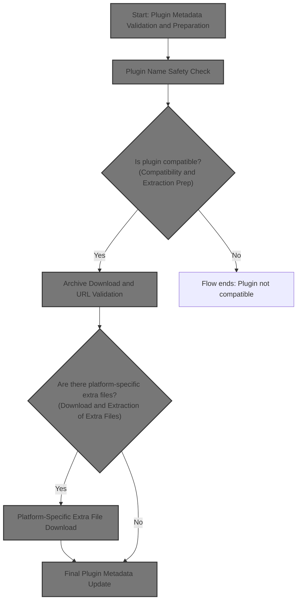
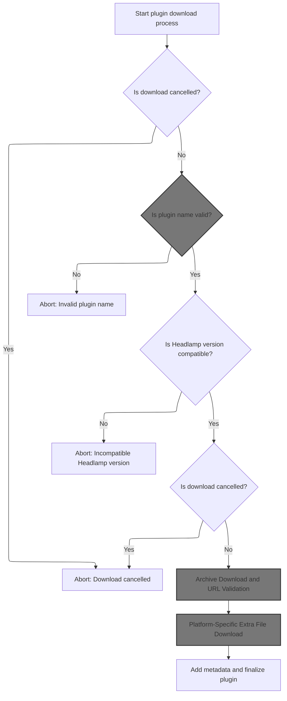
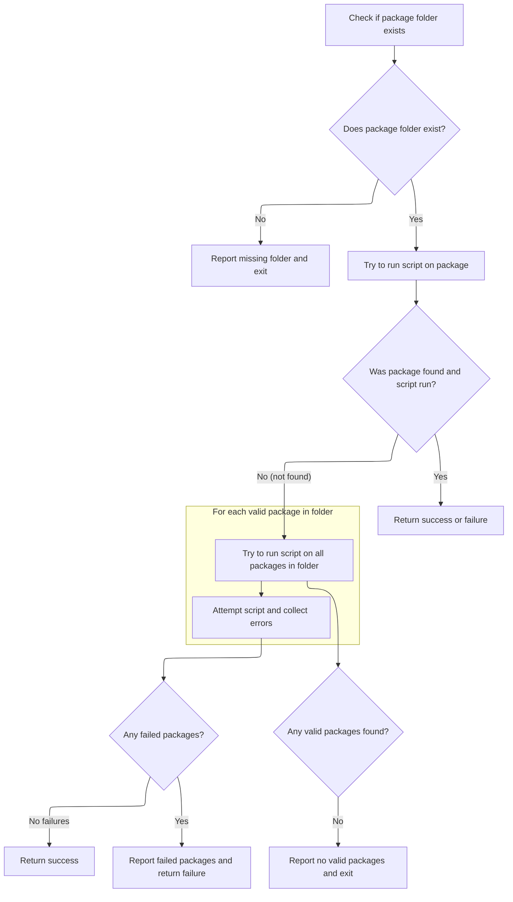
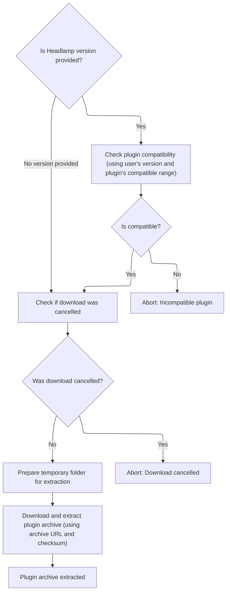
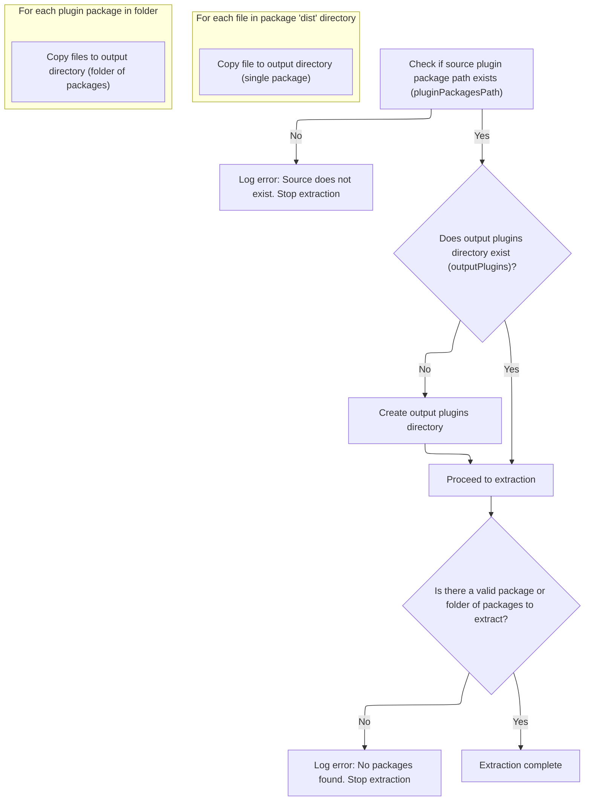

This document describes the process of securely downloading, extracting, and preparing a plugin package for use in the application. The flow ensures that only safe and compatible plugins are processed, downloads the main archive and any <SwmToken path="app/electron/plugin-management.ts" pos="607:7:9" line-data="        message: `Downloading platform-specific file for ${file.arch}: ${path.basename(file.url)}`,">`platform-specific`</SwmToken> extra files, and finalizes the plugin metadata so the plugin is ready for use and management.



# Start: Plugin Metadata Validation and Preparation



<SwmSnippet path="/app/electron/plugin-management.ts" line="469">

---

In <SwmToken path="app/electron/plugin-management.ts" pos="469:4:4" line-data="async function downloadExtractArchive(">`downloadExtractArchive`</SwmToken>, we start by validating the plugin name to make sure we don't process anything unsafe. This keeps the rest of the flow clean and secure.

```typescript
async function downloadExtractArchive(
  pluginInfo: ArtifactHubHeadlampPkg,
  headlampVersion: string,
  progressCallback: ProgressCallback | null,
  signal: AbortSignal | null
): Promise<[string, string]> {
  // fetch plugin metadata
  if (signal && signal.aborted) {
    throw new Error('Download cancelled');
  }

  const pluginName = pluginInfo.name;
  if (!validatePluginName(pluginName)) {
    throw new Error('Invalid plugin name');
  }

```

---

</SwmSnippet>

## Plugin Name Safety Check

<SwmSnippet path="/app/electron/plugin-management.ts" line="430">

---

<SwmToken path="app/electron/plugin-management.ts" pos="430:2:2" line-data="function validatePluginName(pluginName: string): boolean {">`validatePluginName`</SwmToken> just checks that the plugin name doesn't contain slashes or '..'. This prevents path traversal and keeps file operations safe for the next steps, like extracting or running scripts on the plugin.

```typescript
function validatePluginName(pluginName: string): boolean {
  const invalidPattern = /[\/\\]|(\.\.)/;
  return !invalidPattern.test(pluginName);
}
```

---

</SwmSnippet>

## Plugin Test Script Execution

<SwmSnippet path="/plugins/headlamp-plugin/bin/headlamp-plugin.js" line="1351">

---

<SwmToken path="plugins/headlamp-plugin/bin/headlamp-plugin.js" pos="1351:2:2" line-data="function test(packageFolder) {">`test`</SwmToken> runs the plugin's tests using vitest and a specific config. It calls <SwmToken path="plugins/headlamp-plugin/bin/headlamp-plugin.js" pos="1353:3:3" line-data="  return runScriptOnPackages(packageFolder, &#39;test&#39;, script, { UNDER_TEST: &#39;true&#39; });">`runScriptOnPackages`</SwmToken> to actually execute the test command in the right environment, making sure the plugin is working as expected before moving forward.

```javascript
function test(packageFolder) {
  const script = `vitest -c node_modules/@kinvolk/headlamp-plugin/config/vite.config.mjs`;
  return runScriptOnPackages(packageFolder, 'test', script, { UNDER_TEST: 'true' });
}
```

---

</SwmSnippet>

## Script Runner for Plugin Packages



<SwmSnippet path="/plugins/headlamp-plugin/bin/headlamp-plugin.js" line="633">

---

In <SwmToken path="plugins/headlamp-plugin/bin/headlamp-plugin.js" pos="633:2:2" line-data="function runScriptOnPackages(packageFolder, scriptName, cmdLine, env) {">`runScriptOnPackages`</SwmToken>, we check if the target is a package (has <SwmPath>[package.json](package.json)</SwmPath>) or a folder of packages. We make sure dependencies are installed, resolve the right binary to run, and execute the script. If it's not a package, we try running on each subfolder. Return codes signal if things worked or failed, which is used for error handling in the flow.

```javascript
function runScriptOnPackages(packageFolder, scriptName, cmdLine, env) {
  if (!fs.existsSync(packageFolder)) {
    console.error(`"${packageFolder}" does not exist. Not ${scriptName}-ing.`);
    return 1;
  }

  const oldCwd = process.cwd();

  const runOnPackageReturn = {
    success: 0,
    notThere: 1,
    issue: 2,
  };

  function runOnPackage(folder) {
    if (!fs.existsSync(path.join(folder, 'package.json'))) {
      return runOnPackageReturn.notThere;
    }

    process.chdir(folder);

    if (!fs.existsSync('node_modules')) {
      console.log(`No node_modules in "${folder}" found. Running npm install...`);

      try {
        child_process.execSync('npm install', {
          stdio: 'inherit',
          encoding: 'utf8',
        });
      } catch (e) {
        console.error(`Problem running 'npm install' inside of "${folder}"\r\n`);
        process.chdir(oldCwd);
        return runOnPackageReturn.issue;
      }
      console.log(`Finished npm install.`);
    }

    // See if the cmd is in the:
    // - package/node_modules/.bin
    // - package/../node_modules/.bin
    // - the npx node_modules/.bin
    // If not, just use the original cmdLine and hope for the best :)
    let cmdLineToUse = cmdLine;
    const scriptCmd = cmdLine.split(' ')[0];
    const scriptCmdRest = cmdLine.split(' ').slice(1).join(' ');

    const nodeModulesBinCmd = path.join('node_modules', '.bin', scriptCmd);
    const upNodeModulesBinCmd = path.join('../', nodeModulesBinCmd);

    // When run as npx, find it in the node_modules npx uses
    const headlampPluginBin = fs.realpathSync(process.argv[1]);
    const npxBinCmd = path.join(
      path.dirname(headlampPluginBin),
      '..',
      '..',
      '..',
      '..',
      nodeModulesBinCmd
    );

    if (fs.existsSync(nodeModulesBinCmd)) {
      cmdLineToUse = nodeModulesBinCmd + ' ' + scriptCmdRest;
    } else if (fs.existsSync(upNodeModulesBinCmd)) {
      cmdLineToUse = upNodeModulesBinCmd + ' ' + scriptCmdRest;
    } else if (fs.existsSync(npxBinCmd)) {
      cmdLineToUse = npxBinCmd + ' ' + scriptCmdRest;
    } else {
      console.warn(
        `"${scriptCmd}" not found in "${resolve(nodeModulesBinCmd)}" or "${resolve(
          upNodeModulesBinCmd
        )}" or "${resolve(npxBinCmd)}".`
      );
    }

    console.log(`"${folder}": ${scriptName}-ing, :${cmdLineToUse}:...`);

    const [cmd, ...args] = cmdLineToUse.split(' ');

    try {
      child_process.execFileSync(cmd, args, {
        stdio: 'inherit',
        encoding: 'utf8',
        env: { ...process.env, ...(env || {}) },
      });
    } catch (e) {
      console.error(`Problem running ${scriptName} inside of "${folder}"\r\n`);
      process.chdir(oldCwd);
      return runOnPackageReturn.issue;
    }

    console.log(`Done ${scriptName}-ing: "${folder}".\r\n`);
    process.chdir(oldCwd);
    return runOnPackageReturn.success;
  }

  function runOnFolderOfPackages(packageFolder) {
    const folders = fs.readdirSync(packageFolder, { withFileTypes: true }).filter(fileName => {
      return (
        fileName.isDirectory() &&
        fs.existsSync(path.join(packageFolder, fileName.name, 'package.json'))
      );
    });

    if (folders.length === 0) {
      return {
        error: runOnPackageReturn.notThere,
        failedFolders: [],
      };
    }

    const errorFolders = folders.map(folder => {
      const folderToProcess = path.join(packageFolder, folder.name);
      return {
        error: runOnPackage(folderToProcess),
        folder: folderToProcess,
      };
    });
    const failedErrorFolders = errorFolders.filter(
      errFolder => errFolder.error !== runOnPackageReturn.success
    );

    if (failedErrorFolders.length === 0) {
      return {
        error: runOnPackageReturn.success,
        failedFolders: [],
      };
    }
    return {
      error: runOnPackageReturn.issue,
      failedFolders: failedErrorFolders.map(errFolder => path.basename(errFolder.folder)),
    };
  }

  const exitCode = runOnPackage(packageFolder);

```

---

</SwmSnippet>

<SwmSnippet path="/plugins/headlamp-plugin/bin/headlamp-plugin.js" line="647">

---

<SwmToken path="plugins/headlamp-plugin/bin/headlamp-plugin.js" pos="647:3:3" line-data="  function runOnPackage(folder) {">`runOnPackage`</SwmToken> checks for <SwmPath>[package.json](package.json)</SwmPath>, runs 'npm install' if needed, figures out where the binary is (could be in several places), and runs the script. It uses a bunch of variables from the outer scope, so it's tightly coupled to the rest of the script.

```javascript
  function runOnPackage(folder) {
    if (!fs.existsSync(path.join(folder, 'package.json'))) {
      return runOnPackageReturn.notThere;
    }

    process.chdir(folder);

    if (!fs.existsSync('node_modules')) {
      console.log(`No node_modules in "${folder}" found. Running npm install...`);

      try {
        child_process.execSync('npm install', {
          stdio: 'inherit',
          encoding: 'utf8',
        });
      } catch (e) {
        console.error(`Problem running 'npm install' inside of "${folder}"\r\n`);
        process.chdir(oldCwd);
        return runOnPackageReturn.issue;
      }
      console.log(`Finished npm install.`);
    }

    // See if the cmd is in the:
    // - package/node_modules/.bin
    // - package/../node_modules/.bin
    // - the npx node_modules/.bin
    // If not, just use the original cmdLine and hope for the best :)
    let cmdLineToUse = cmdLine;
    const scriptCmd = cmdLine.split(' ')[0];
    const scriptCmdRest = cmdLine.split(' ').slice(1).join(' ');

    const nodeModulesBinCmd = path.join('node_modules', '.bin', scriptCmd);
    const upNodeModulesBinCmd = path.join('../', nodeModulesBinCmd);

    // When run as npx, find it in the node_modules npx uses
    const headlampPluginBin = fs.realpathSync(process.argv[1]);
    const npxBinCmd = path.join(
      path.dirname(headlampPluginBin),
      '..',
      '..',
      '..',
      '..',
      nodeModulesBinCmd
    );

    if (fs.existsSync(nodeModulesBinCmd)) {
      cmdLineToUse = nodeModulesBinCmd + ' ' + scriptCmdRest;
    } else if (fs.existsSync(upNodeModulesBinCmd)) {
      cmdLineToUse = upNodeModulesBinCmd + ' ' + scriptCmdRest;
    } else if (fs.existsSync(npxBinCmd)) {
      cmdLineToUse = npxBinCmd + ' ' + scriptCmdRest;
    } else {
      console.warn(
        `"${scriptCmd}" not found in "${resolve(nodeModulesBinCmd)}" or "${resolve(
          upNodeModulesBinCmd
        )}" or "${resolve(npxBinCmd)}".`
      );
    }

    console.log(`"${folder}": ${scriptName}-ing, :${cmdLineToUse}:...`);

    const [cmd, ...args] = cmdLineToUse.split(' ');

    try {
      child_process.execFileSync(cmd, args, {
        stdio: 'inherit',
        encoding: 'utf8',
        env: { ...process.env, ...(env || {}) },
      });
    } catch (e) {
      console.error(`Problem running ${scriptName} inside of "${folder}"\r\n`);
      process.chdir(oldCwd);
      return runOnPackageReturn.issue;
    }

    console.log(`Done ${scriptName}-ing: "${folder}".\r\n`);
    process.chdir(oldCwd);
    return runOnPackageReturn.success;
  }
```

---

</SwmSnippet>

<SwmSnippet path="/plugins/headlamp-plugin/bin/headlamp-plugin.js" line="768">

---

Back in <SwmToken path="plugins/headlamp-plugin/bin/headlamp-plugin.js" pos="633:2:2" line-data="function runScriptOnPackages(packageFolder, scriptName, cmdLine, env) {">`runScriptOnPackages`</SwmToken>, after trying to run on the main folder, if there's no <SwmPath>[package.json](package.json)</SwmPath>, we try each subfolder. If none of them work, we log an error and return failure. This dual handling lets us support both single and multi-package setups.

```javascript
  if (exitCode === runOnPackageReturn.notThere) {
    const folderErr = runOnFolderOfPackages(packageFolder);
    if (folderErr.error === runOnPackageReturn.notThere) {
      console.error(
        `"${resolve(packageFolder)}" does not contain a package or packages. Not ${scriptName}-ing.`
      );
      return 1; // failed
    } else if (folderErr.error === runOnPackageReturn.issue) {
      console.error(
        `Some in "${resolve(packageFolder)}" failed. Failed folders: ${folderErr.failedFolders.join(
          ', '
        )}`
      );
      return 1; // failed
    }
  }

  return exitCode > 0 ? 1 : 0;
}
```

---

</SwmSnippet>

<SwmSnippet path="/plugins/headlamp-plugin/bin/headlamp-plugin.js" line="728">

---

<SwmToken path="plugins/headlamp-plugin/bin/headlamp-plugin.js" pos="728:3:3" line-data="  function runOnFolderOfPackages(packageFolder) {">`runOnFolderOfPackages`</SwmToken> looks for subfolders with a <SwmPath>[package.json](package.json)</SwmPath> and runs the script on each. If any fail, it collects their names for error reporting. This way, we know exactly which packages had problems.

```javascript
  function runOnFolderOfPackages(packageFolder) {
    const folders = fs.readdirSync(packageFolder, { withFileTypes: true }).filter(fileName => {
      return (
        fileName.isDirectory() &&
        fs.existsSync(path.join(packageFolder, fileName.name, 'package.json'))
      );
    });

    if (folders.length === 0) {
      return {
        error: runOnPackageReturn.notThere,
        failedFolders: [],
      };
    }

    const errorFolders = folders.map(folder => {
      const folderToProcess = path.join(packageFolder, folder.name);
      return {
        error: runOnPackage(folderToProcess),
        folder: folderToProcess,
      };
    });
    const failedErrorFolders = errorFolders.filter(
      errFolder => errFolder.error !== runOnPackageReturn.success
    );

    if (failedErrorFolders.length === 0) {
      return {
        error: runOnPackageReturn.success,
        failedFolders: [],
      };
    }
    return {
      error: runOnPackageReturn.issue,
      failedFolders: failedErrorFolders.map(errFolder => path.basename(errFolder.folder)),
    };
  }
```

---

</SwmSnippet>

## Compatibility and Extraction Prep



<SwmSnippet path="/app/electron/plugin-management.ts" line="485">

---

After validating, we check version compatibility and set up a temp folder for extraction.

```typescript
  // Check if the plugin is compatible with the current Headlamp version
  if (headlampVersion) {
    if (progressCallback) {
      progressCallback({ type: 'info', message: 'Checking compatibility with Headlamp version' });
    }
    if (semver.satisfies(headlampVersion, pluginInfo.versionCompat)) {
      if (progressCallback) {
        progressCallback({ type: 'info', message: 'Headlamp version is compatible' });
      }
    } else {
      throw new Error('Headlamp version is not compatible with the plugin');
    }
  }

  if (signal && signal.aborted) {
    throw new Error('Download cancelled');
  }

  // Create temporary folder for extraction
  const tempDir = await fs.mkdtempSync(path.join(os.tmpdir(), 'headlamp-plugin-temp-'));
  // Defaulting to '' should never happen if recursive is true. So this is for the type
  // checker only.
  const tempFolder = fs.mkdirSync(path.join(tempDir, pluginName), { recursive: true }) ?? '';

  // First, download and extract the main archive
  if (progressCallback) {
    progressCallback({ type: 'info', message: 'Downloading main plugin archive' });
  }

```

---

</SwmSnippet>

<SwmSnippet path="/app/electron/plugin-management.ts" line="514">

---

Back in <SwmToken path="app/electron/plugin-management.ts" pos="469:4:4" line-data="async function downloadExtractArchive(">`downloadExtractArchive`</SwmToken>, after prepping the temp folder, we download and extract the main plugin archive using <SwmToken path="app/electron/plugin-management.ts" pos="514:3:3" line-data="  await downloadAndExtractSingleArchive(">`downloadAndExtractSingleArchive`</SwmToken>. This gets the core plugin files in place before we handle any extras.

```typescript
  await downloadAndExtractSingleArchive(
    pluginInfo.archiveURL,
    pluginInfo.archiveChecksum,
    tempFolder,
    progressCallback,
    signal
  );

```

---

</SwmSnippet>

## Archive Download and URL Validation

<SwmSnippet path="/app/electron/plugin-management.ts" line="689">

---

In <SwmToken path="app/electron/plugin-management.ts" pos="689:4:4" line-data="async function downloadAndExtractSingleArchive(">`downloadAndExtractSingleArchive`</SwmToken>, we start by validating the archive URL to make sure it's from a trusted source. This check blocks any attempts to fetch archives from sketchy or unexpected locations.

```typescript
async function downloadAndExtractSingleArchive(
  archiveURL: string,
  archiveChecksum: string,
  extractFolder: string,
  progressCallback: null | ProgressCallback,
  signal: AbortSignal | null,
  tarStrip = 1
): Promise<void> {
  if (!validateArchiveURL(archiveURL)) {
    throw new Error('Invalid plugin/archive-url:' + archiveURL);
  }

  if (!archiveURL || !archiveChecksum) {
    throw new Error('Invalid plugin metadata. Please check the plugin details.');
  }

```

---

</SwmSnippet>

<SwmSnippet path="/app/electron/plugin-management.ts" line="439">

---

<SwmToken path="app/electron/plugin-management.ts" pos="439:2:2" line-data="function validateArchiveURL(archiveURL: string): boolean {">`validateArchiveURL`</SwmToken> checks if the URL matches known repo patterns or a specific GitHub prefix. It also allows localhost <SwmToken path="app/electron/plugin-management.ts" pos="443:16:16" line-data="  // For testing purposes, we allow localhost URLs.">`URLs`</SwmToken>, but only when testing. This keeps downloads limited to trusted or test sources.

```typescript
function validateArchiveURL(archiveURL: string): boolean {
  const githubRegex = /^https:\/\/github\.com\/[^/]+\/[^/]+\/(releases|archive)\/.*$/;
  const bitbucketRegex = /^https:\/\/bitbucket\.org\/[^/]+\/[^/]+\/(downloads|get)\/.*$/;
  const gitlabRegex = /^https:\/\/gitlab\.com\/[^/]+\/[^/]+\/(-\/archive|releases)\/.*$/;
  // For testing purposes, we allow localhost URLs.
  const localRegex = /^https?:\/\/localhost(:\d+)?\/.*$/;

  // @todo There is a test plugin at https://github.com/yolossn/headlamp-plugins/
  // need to move that somewhere else, or test differently.

  const urlGood =
    githubRegex.test(archiveURL) ||
    bitbucketRegex.test(archiveURL) ||
    gitlabRegex.test(archiveURL) ||
    archiveURL.startsWith('https://github.com/yolossn/headlamp-plugins/');

  if (process.env.NODE_ENV === 'test') {
    return urlGood || localRegex.test(archiveURL);
  }
  return urlGood;
}
```

---

</SwmSnippet>

<SwmSnippet path="/app/electron/plugin-management.ts" line="705">

---

Back in <SwmToken path="app/electron/plugin-management.ts" pos="514:3:3" line-data="  await downloadAndExtractSingleArchive(">`downloadAndExtractSingleArchive`</SwmToken>, after passing URL validation, we fetch the archive, check the checksum, and make sure the download wasn't cancelled. If anything's off, we bail out early.

```typescript
  let checksum = archiveChecksum;
  if (checksum.startsWith('sha256:') || checksum.startsWith('SHA256:')) {
    checksum = checksum.replace('sha256:', '');
    checksum = checksum.replace('SHA256:', '');
  }

  if (signal && signal.aborted) {
    throw new Error('Download cancelled');
  }

  // await sleep(4000); // comment out for testing
  let archResponse;

  try {
    archResponse = await fetch(archiveURL, { redirect: 'follow', signal });
  } catch (err) {
    throw new Error('Failed to fetch archive. Please check the URL and your network connection.');
  }

  if (!archResponse.ok) {
    throw new Error(`Failed to download file. Status code: ${archResponse.status}`);
  }

  if (signal && signal.aborted) {
    throw new Error('Download cancelled');
  }

  const archChunks: Uint8Array[] = [];
  let archBufferLength = 0;

  if (!archResponse.body) {
    throw new Error('Download empty');
  }

  // @ts-ignore this code is using Node.js stream API, and it works.
  for await (const chunk of archResponse.body) {
    archChunks.push(chunk);
    archBufferLength += chunk.length;
  }
```

---

</SwmSnippet>

<SwmSnippet path="/app/electron/plugin-management.ts" line="745">

---

After downloading the archive, we check its checksum to make sure it's legit. If it doesn't match, we throw an error and stop. This keeps us from using corrupted or tampered files.

```typescript
  const archBuffer = Buffer.concat(archChunks, archBufferLength);

  const computedChecksum = crypto.createHash('sha256').update(archBuffer).digest('hex');
  if (computedChecksum !== checksum) {
    throw new Error('Checksum mismatch.');
  }

  if (signal && signal.aborted) {
    throw new Error('Download cancelled');
  }

```

---

</SwmSnippet>

<SwmSnippet path="/app/electron/plugin-management.ts" line="756">

---

Back in <SwmToken path="app/electron/plugin-management.ts" pos="514:3:3" line-data="  await downloadAndExtractSingleArchive(">`downloadAndExtractSingleArchive`</SwmToken>, after verifying the checksum, we check if the archive is a tarball by looking at the file extension. If it is, we prep for extraction; if not, we handle it as a plain file.

```typescript
  // Determine if this is a tar.gz archive or a plain file
  const isTarGz =
    archiveURL.endsWith('.tar.gz') ||
    archiveURL.endsWith('.tgz') ||
    archiveURL.endsWith('.tar') ||
    archiveURL.includes('.tar.gz?') ||
    archiveURL.includes('.tgz?') ||
    archiveURL.includes('.tar?');

  if (isTarGz) {
    if (progressCallback) {
      progressCallback({
        type: 'info',
        message: 'Extracting plugin',
      });
    }
```

---

</SwmSnippet>

<SwmSnippet path="/app/electron/plugin-management.ts" line="772">

---

Back in <SwmToken path="app/electron/plugin-management.ts" pos="514:3:3" line-data="  await downloadAndExtractSingleArchive(">`downloadAndExtractSingleArchive`</SwmToken>, if it's a tarball, we pipe the archive through gunzip and tar to extract it directly to the target folder. This keeps memory usage low and handles big files smoothly.

```typescript
    // Extract the archive
    const archStream = new stream.PassThrough();
    archStream.end(archBuffer);

    const extractStream: stream.Writable = archStream.pipe(zlib.createGunzip()).pipe(
      tar.extract({
        cwd: extractFolder,
        strip: tarStrip,
        sync: true,
      }) as unknown as stream.Writable
    );

```

---

</SwmSnippet>

### Plugin Package Extraction Logic



<SwmSnippet path="/plugins/pluginctl/bin/pluginctl.js" line="42">

---

In <SwmToken path="plugins/pluginctl/bin/pluginctl.js" pos="42:2:2" line-data="function extract(pluginPackagesPath, outputPlugins, logSteps = true) {">`extract`</SwmToken>, we check if the input path is a single package (has <SwmPath>[plugins/…/.storybook/main.js](plugins/headlamp-plugin/config/.storybook/main.js)</SwmPath>) or a folder of packages. We copy dist files and <SwmPath>[package.json](package.json)</SwmPath> to the output location for each package found. If nothing matches, we return an error.

```javascript
function extract(pluginPackagesPath, outputPlugins, logSteps = true) {
  if (!fs.existsSync(pluginPackagesPath)) {
    console.error(`"${pluginPackagesPath}" does not exist. Not extracting.`);
    return 1;
  }
  if (!fs.existsSync(outputPlugins)) {
    if (logSteps) {
      console.log(`"${outputPlugins}" did not exist, making folder.`);
    }
    fs.mkdirSync(outputPlugins);
  }

  /**
   * pluginPackagesPath is a package folder, not a folder of packages.
   */
  function extractPackage() {
    if (fs.existsSync(path.join(pluginPackagesPath, "dist", "main.js"))) {
      const distPath = path.join(pluginPackagesPath, "dist");
      const trimmedPath =
        pluginPackagesPath.slice(-1) === path.sep
          ? pluginPackagesPath.slice(0, -1)
          : pluginPackagesPath;
      const folderName = trimmedPath.split(path.sep).splice(-1)[0];
      const plugName = path.join(outputPlugins, folderName);

      fs.ensureDirSync(plugName);

      const files = fs.readdirSync(distPath);
      files.forEach((file) => {
        const srcFile = path.join(distPath, file);
        const destFile = path.join(plugName, file);
        console.log(`Copying "${srcFile}" to "${destFile}".`);
        fs.copyFileSync(srcFile, destFile);
      });

      const inputPackageJson = path.join(pluginPackagesPath, "package.json");
      const outputPackageJson = path.join(plugName, "package.json");
      console.log(`Copying "${inputPackageJson}" to "${outputPackageJson}".`);
      fs.copyFileSync(inputPackageJson, outputPackageJson);

      return true;
    }
    return false;
  }

  function extractFolderOfPackages() {
    const folders = fs
      .readdirSync(pluginPackagesPath, { withFileTypes: true })
      .filter((fileName) => {
        return (
          fileName.isDirectory() &&
          fs.existsSync(
            path.join(pluginPackagesPath, fileName.name, "dist", "main.js")
          )
        );
      });

    folders.forEach((folder) => {
      const distPath = path.join(pluginPackagesPath, folder.name, "dist");
      const plugName = path.join(outputPlugins, folder.name);

      fs.ensureDirSync(plugName);

      const files = fs.readdirSync(distPath);
      files.forEach((file) => {
        const srcFile = path.join(distPath, file);
        const destFile = path.join(plugName, file);
        console.log(`Copying "${srcFile}" to "${destFile}".`);
        fs.copyFileSync(srcFile, destFile);
      });

      const inputPackageJson = path.join(
        pluginPackagesPath,
        folder.name,
        "package.json"
      );
      const outputPackageJson = path.join(plugName, "package.json");
      console.log(`Copying "${inputPackageJson}" to "${outputPackageJson}".`);
      fs.copyFileSync(inputPackageJson, outputPackageJson);
    });
    return folders.length !== 0;
  }

  if (!(extractPackage() || extractFolderOfPackages())) {
```

---

</SwmSnippet>

<SwmSnippet path="/plugins/pluginctl/bin/pluginctl.js" line="57">

---

<SwmToken path="plugins/pluginctl/bin/pluginctl.js" pos="57:3:3" line-data="  function extractPackage() {">`extractPackage`</SwmToken> checks for <SwmPath>[plugins/…/.storybook/main.js](plugins/headlamp-plugin/config/.storybook/main.js)</SwmPath>, then copies everything from dist plus <SwmPath>[package.json](package.json)</SwmPath> to the output folder. It relies on external variables for paths, so it's tightly coupled to the rest of the script.

```javascript
  function extractPackage() {
    if (fs.existsSync(path.join(pluginPackagesPath, "dist", "main.js"))) {
      const distPath = path.join(pluginPackagesPath, "dist");
      const trimmedPath =
        pluginPackagesPath.slice(-1) === path.sep
          ? pluginPackagesPath.slice(0, -1)
          : pluginPackagesPath;
      const folderName = trimmedPath.split(path.sep).splice(-1)[0];
      const plugName = path.join(outputPlugins, folderName);

      fs.ensureDirSync(plugName);

      const files = fs.readdirSync(distPath);
      files.forEach((file) => {
        const srcFile = path.join(distPath, file);
        const destFile = path.join(plugName, file);
        console.log(`Copying "${srcFile}" to "${destFile}".`);
        fs.copyFileSync(srcFile, destFile);
      });

      const inputPackageJson = path.join(pluginPackagesPath, "package.json");
      const outputPackageJson = path.join(plugName, "package.json");
      console.log(`Copying "${inputPackageJson}" to "${outputPackageJson}".`);
      fs.copyFileSync(inputPackageJson, outputPackageJson);

      return true;
    }
    return false;
  }
```

---

</SwmSnippet>

<SwmSnippet path="/plugins/pluginctl/bin/pluginctl.js" line="125">

---

Back in <SwmToken path="app/electron/plugin-management.ts" pos="509:10:10" line-data="  // First, download and extract the main archive">`extract`</SwmToken>, if neither single nor multi-package extraction works, we log an error and return failure. This keeps things explicit when the structure isn't as expected.

```javascript
  if (!(extractPackage() || extractFolderOfPackages())) {
    console.error(
      `"${pluginPackagesPath}" does not contain packages. Not extracting.`
    );
    return 1;
  }

  return 0;
}
```

---

</SwmSnippet>

<SwmSnippet path="/plugins/pluginctl/bin/pluginctl.js" line="87">

---

<SwmToken path="plugins/pluginctl/bin/pluginctl.js" pos="87:3:3" line-data="  function extractFolderOfPackages() {">`extractFolderOfPackages`</SwmToken> loops through subfolders, and for each one with <SwmPath>[plugins/…/.storybook/main.js](plugins/headlamp-plugin/config/.storybook/main.js)</SwmPath>, copies all dist files and <SwmPath>[package.json](package.json)</SwmPath> to the output. Subfolders without the right structure are ignored.

```javascript
  function extractFolderOfPackages() {
    const folders = fs
      .readdirSync(pluginPackagesPath, { withFileTypes: true })
      .filter((fileName) => {
        return (
          fileName.isDirectory() &&
          fs.existsSync(
            path.join(pluginPackagesPath, fileName.name, "dist", "main.js")
          )
        );
      });

    folders.forEach((folder) => {
      const distPath = path.join(pluginPackagesPath, folder.name, "dist");
      const plugName = path.join(outputPlugins, folder.name);

      fs.ensureDirSync(plugName);

      const files = fs.readdirSync(distPath);
      files.forEach((file) => {
        const srcFile = path.join(distPath, file);
        const destFile = path.join(plugName, file);
        console.log(`Copying "${srcFile}" to "${destFile}".`);
        fs.copyFileSync(srcFile, destFile);
      });

      const inputPackageJson = path.join(
        pluginPackagesPath,
        folder.name,
        "package.json"
      );
      const outputPackageJson = path.join(plugName, "package.json");
      console.log(`Copying "${inputPackageJson}" to "${outputPackageJson}".`);
      fs.copyFileSync(inputPackageJson, outputPackageJson);
    });
    return folders.length !== 0;
  }
```

---

</SwmSnippet>

### Final Extraction and File Handling

```mermaid
%%{init: {"flowchart": {"defaultRenderer": "elk"}} }%%
flowchart TD
    node1["Start download and extraction"]
    click node1 openCode "app/electron/plugin-management.ts:784:836"
    node1 --> node2{"Is extraction stream used?"}
    click node2 openCode "app/electron/plugin-management.ts:784:800"
    node2 -->|"Yes"| node3["Wait for extraction to finish"]
    click node3 openCode "app/electron/plugin-management.ts:784:791"
    node3 --> node4{"Was operation cancelled?"}
    click node4 openCode "app/electron/plugin-management.ts:793:795"
    node4 -->|"Yes"| node5["Abort and notify user"]
    click node5 openCode "app/electron/plugin-management.ts:794:795"
    node4 -->|"No"| node6{"Show extraction complete to user?"}
    click node6 openCode "app/electron/plugin-management.ts:797:799"
    node6 -->|"Yes"| node7["Show 'Plugin extracted' message"]
    click node7 openCode "app/electron/plugin-management.ts:798:799"
    node6 -->|"No"| node15["Plugin ready for use"]
    node7 --> node15
    node2 -->|"No"| node8["Validate file name safety"]
    click node8 openCode "app/electron/plugin-management.ts:803:813"
    node8 --> node9{"Is file name safe?"}
    click node9 openCode "app/electron/plugin-management.ts:804:813"
    node9 -->|"No"| node10["Abort and notify user"]
    click node10 openCode "app/electron/plugin-management.ts:812:813"
    node9 -->|"Yes"| node11["Check output path safety"]
    click node11 openCode "app/electron/plugin-management.ts:817:821"
    node11 --> node12{"Is output path safe?"}
    click node12 openCode "app/electron/plugin-management.ts:819:821"
    node12 -->|"No"| node13["Abort and notify user"]
    click node13 openCode "app/electron/plugin-management.ts:820:821"
    node12 -->|"Yes"| node14{"Show saving progress to user?"}
    click node14 openCode "app/electron/plugin-management.ts:823:827"
    node14 -->|"Yes"| node16["Show 'Saving file' message"]
    click node16 openCode "app/electron/plugin-management.ts:824:827"
    node16 --> node17["Save file to disk"]
    click node17 openCode "app/electron/plugin-management.ts:830:830"
    node14 -->|"No"| node17
    node17 --> node18{"Show download complete to user?"}
    click node18 openCode "app/electron/plugin-management.ts:832:834"
    node18 -->|"Yes"| node19["Show 'File downloaded' message"]
    click node19 openCode "app/electron/plugin-management.ts:833:834"
    node19 --> node15["Plugin ready for use"]
    node18 -->|"No"| node15
    node15["Plugin ready for use"]
    click node15 openCode "app/electron/plugin-management.ts:836:836"

classDef HeadingStyle fill:#777777,stroke:#333,stroke-width:2px;

%% Swimm:
%% %%{init: {"flowchart": {"defaultRenderer": "elk"}} }%%
%% flowchart TD
%%     node1["Start download and extraction"]
%%     click node1 openCode "<SwmPath>[app/electron/plugin-management.ts](app/electron/plugin-management.ts)</SwmPath>:784:836"
%%     node1 --> node2{"Is extraction stream used?"}
%%     click node2 openCode "<SwmPath>[app/electron/plugin-management.ts](app/electron/plugin-management.ts)</SwmPath>:784:800"
%%     node2 -->|"Yes"| node3["Wait for extraction to finish"]
%%     click node3 openCode "<SwmPath>[app/electron/plugin-management.ts](app/electron/plugin-management.ts)</SwmPath>:784:791"
%%     node3 --> node4{"Was operation cancelled?"}
%%     click node4 openCode "<SwmPath>[app/electron/plugin-management.ts](app/electron/plugin-management.ts)</SwmPath>:793:795"
%%     node4 -->|"Yes"| node5["Abort and notify user"]
%%     click node5 openCode "<SwmPath>[app/electron/plugin-management.ts](app/electron/plugin-management.ts)</SwmPath>:794:795"
%%     node4 -->|"No"| node6{"Show extraction complete to user?"}
%%     click node6 openCode "<SwmPath>[app/electron/plugin-management.ts](app/electron/plugin-management.ts)</SwmPath>:797:799"
%%     node6 -->|"Yes"| node7["Show 'Plugin extracted' message"]
%%     click node7 openCode "<SwmPath>[app/electron/plugin-management.ts](app/electron/plugin-management.ts)</SwmPath>:798:799"
%%     node6 -->|"No"| node15["Plugin ready for use"]
%%     node7 --> node15
%%     node2 -->|"No"| node8["Validate file name safety"]
%%     click node8 openCode "<SwmPath>[app/electron/plugin-management.ts](app/electron/plugin-management.ts)</SwmPath>:803:813"
%%     node8 --> node9{"Is file name safe?"}
%%     click node9 openCode "<SwmPath>[app/electron/plugin-management.ts](app/electron/plugin-management.ts)</SwmPath>:804:813"
%%     node9 -->|"No"| node10["Abort and notify user"]
%%     click node10 openCode "<SwmPath>[app/electron/plugin-management.ts](app/electron/plugin-management.ts)</SwmPath>:812:813"
%%     node9 -->|"Yes"| node11["Check output path safety"]
%%     click node11 openCode "<SwmPath>[app/electron/plugin-management.ts](app/electron/plugin-management.ts)</SwmPath>:817:821"
%%     node11 --> node12{"Is output path safe?"}
%%     click node12 openCode "<SwmPath>[app/electron/plugin-management.ts](app/electron/plugin-management.ts)</SwmPath>:819:821"
%%     node12 -->|"No"| node13["Abort and notify user"]
%%     click node13 openCode "<SwmPath>[app/electron/plugin-management.ts](app/electron/plugin-management.ts)</SwmPath>:820:821"
%%     node12 -->|"Yes"| node14{"Show saving progress to user?"}
%%     click node14 openCode "<SwmPath>[app/electron/plugin-management.ts](app/electron/plugin-management.ts)</SwmPath>:823:827"
%%     node14 -->|"Yes"| node16["Show 'Saving file' message"]
%%     click node16 openCode "<SwmPath>[app/electron/plugin-management.ts](app/electron/plugin-management.ts)</SwmPath>:824:827"
%%     node16 --> node17["Save file to disk"]
%%     click node17 openCode "<SwmPath>[app/electron/plugin-management.ts](app/electron/plugin-management.ts)</SwmPath>:830:830"
%%     node14 -->|"No"| node17
%%     node17 --> node18{"Show download complete to user?"}
%%     click node18 openCode "<SwmPath>[app/electron/plugin-management.ts](app/electron/plugin-management.ts)</SwmPath>:832:834"
%%     node18 -->|"Yes"| node19["Show 'File downloaded' message"]
%%     click node19 openCode "<SwmPath>[app/electron/plugin-management.ts](app/electron/plugin-management.ts)</SwmPath>:833:834"
%%     node19 --> node15["Plugin ready for use"]
%%     node18 -->|"No"| node15
%%     node15["Plugin ready for use"]
%%     click node15 openCode "<SwmPath>[app/electron/plugin-management.ts](app/electron/plugin-management.ts)</SwmPath>:836:836"
%% 
%% classDef HeadingStyle fill:#777777,stroke:#333,stroke-width:2px;
```



<SwmSnippet path="/app/electron/plugin-management.ts" line="784">

---

Back in <SwmToken path="app/electron/plugin-management.ts" pos="514:3:3" line-data="  await downloadAndExtractSingleArchive(">`downloadAndExtractSingleArchive`</SwmToken>, after extraction, we wait for the stream to finish using a promise. If it's not a tarball, we do some extra checks and save the file directly. Progress is reported throughout.

```typescript
    await new Promise<void>((resolve, reject) => {
      extractStream.on('finish', () => {
        resolve();
      });
      extractStream.on('error', err => {
        reject(err);
      });
    });

    if (signal && signal.aborted) {
      throw new Error('Download cancelled');
    }

    if (progressCallback) {
      progressCallback({ type: 'info', message: 'Plugin extracted' });
    }
  } else {
    // Only allow safe filenames (no path traversal, no absolute paths)
    // Note: we also have an allow list of trusted domains, so this is just an extra check.
    const fileName = path.basename(archiveURL.split('?')[0]);
    if (
      fileName.includes('..') ||
      fileName.startsWith('/') ||
      fileName.startsWith('\\') ||
      fileName === '' ||
      fileName === '.' ||
      fileName === '..'
    ) {
      throw new Error('Invalid file name in archive URL');
    }
    const outPath = path.join(extractFolder, fileName);

    // Ensure the output path is within the extractFolder
    const resolvedOutPath = path.resolve(outPath);
    const resolvedExtractFolder = path.resolve(extractFolder);
    if (!resolvedOutPath.startsWith(resolvedExtractFolder + path.sep)) {
      throw new Error('Attempted path traversal in file name');
    }

    if (progressCallback) {
      progressCallback({
        type: 'info',
        message: `Saving file to ${outPath}`,
      });
    }

    fs.writeFileSync(outPath, archBuffer, { mode: 0o755 });

    if (progressCallback) {
      progressCallback({ type: 'info', message: 'File downloaded' });
    }
  }
}
```

---

</SwmSnippet>

## Download and Extraction of Extra Files

<SwmSnippet path="/app/electron/plugin-management.ts" line="522">

---

Back in <SwmToken path="app/electron/plugin-management.ts" pos="469:4:4" line-data="async function downloadExtractArchive(">`downloadExtractArchive`</SwmToken>, after extracting the main archive, we call <SwmToken path="app/electron/plugin-management.ts" pos="522:3:3" line-data="  await downloadExtraFiles(pluginInfo.extraFiles, tempFolder, progressCallback, signal);">`downloadExtraFiles`</SwmToken> to fetch any <SwmToken path="app/electron/plugin-management.ts" pos="607:7:9" line-data="        message: `Downloading platform-specific file for ${file.arch}: ${path.basename(file.url)}`,">`platform-specific`</SwmToken> extras. This keeps the main plugin logic clean and only adds what's needed for the current system.

```typescript
  await downloadExtraFiles(pluginInfo.extraFiles, tempFolder, progressCallback, signal);

```

---

</SwmSnippet>

## Platform-Specific Extra File Download

```mermaid
%%{init: {"flowchart": {"defaultRenderer": "elk"}} }%%
flowchart TD
  node1{"Are there extra files to process?"}
  click node1 openCode "app/electron/plugin-management.ts:577:579"
  node1 -->|"No"| node2["Finish"]
  click node2 openCode "app/electron/plugin-management.ts:578:579"
  node1 -->|"Yes"| node3["Find matching extra files for this platform"]
  click node3 openCode "app/electron/plugin-management.ts:580:581"
  node3 --> node4{"Are there matching files?"}
  click node4 openCode "app/electron/plugin-management.ts:582:590"
  node4 -->|"No"| node5["Report 'No extra files found' and finish"]
  click node5 openCode "app/electron/plugin-management.ts:583:589"
  node4 -->|"Yes"| node6["Ensure bin directory exists"]
  click node6 openCode "app/electron/plugin-management.ts:592:596"
  node6 --> node7["Process each matching extra file"]
  click node7 openCode "app/electron/plugin-management.ts:599:666"
  subgraph loop1["For each matching extra file"]
    node7 --> node8{"Is download cancelled?"}
    click node8 openCode "app/electron/plugin-management.ts:600:601"
    node8 -->|"Yes"| node9["Stop processing"]
    click node9 openCode "app/electron/plugin-management.ts:601:601"
    node8 -->|"No"| node10["Report download progress"]
    click node10 openCode "app/electron/plugin-management.ts:604:609"
    node10 --> node11{"Did download succeed?"}
    click node11 openCode "app/electron/plugin-management.ts:611:631"
    node11 -->|"No"| node12["Report download error"]
    click node12 openCode "app/electron/plugin-management.ts:621:630"
    node11 -->|"Yes"| node13["For each output mapping"]
    click node13 openCode "app/electron/plugin-management.ts:634:666"
    subgraph loop2["For each output mapping"]
      node13 --> node14{"Does file need to be moved/renamed?"}
      click node14 openCode "app/electron/plugin-management.ts:635:648"
      node14 -->|"No"| node15["Skip"]
      click node15 openCode "app/electron/plugin-management.ts:636:637"
      node14 -->|"Yes"| node16["Move/rename file and report progress"]
      click node16 openCode "app/electron/plugin-management.ts:651:665"
      node15 --> node13
      node16 --> node13
    end
    node13 --> node7
  end
  node7 --> node17["Report completion"]
  click node17 openCode "app/electron/plugin-management.ts:669:674"

classDef HeadingStyle fill:#777777,stroke:#333,stroke-width:2px;

%% Swimm:
%% %%{init: {"flowchart": {"defaultRenderer": "elk"}} }%%
%% flowchart TD
%%   node1{"Are there extra files to process?"}
%%   click node1 openCode "<SwmPath>[app/electron/plugin-management.ts](app/electron/plugin-management.ts)</SwmPath>:577:579"
%%   node1 -->|"No"| node2["Finish"]
%%   click node2 openCode "<SwmPath>[app/electron/plugin-management.ts](app/electron/plugin-management.ts)</SwmPath>:578:579"
%%   node1 -->|"Yes"| node3["Find matching extra files for this platform"]
%%   click node3 openCode "<SwmPath>[app/electron/plugin-management.ts](app/electron/plugin-management.ts)</SwmPath>:580:581"
%%   node3 --> node4{"Are there matching files?"}
%%   click node4 openCode "<SwmPath>[app/electron/plugin-management.ts](app/electron/plugin-management.ts)</SwmPath>:582:590"
%%   node4 -->|"No"| node5["Report 'No extra files found' and finish"]
%%   click node5 openCode "<SwmPath>[app/electron/plugin-management.ts](app/electron/plugin-management.ts)</SwmPath>:583:589"
%%   node4 -->|"Yes"| node6["Ensure bin directory exists"]
%%   click node6 openCode "<SwmPath>[app/electron/plugin-management.ts](app/electron/plugin-management.ts)</SwmPath>:592:596"
%%   node6 --> node7["Process each matching extra file"]
%%   click node7 openCode "<SwmPath>[app/electron/plugin-management.ts](app/electron/plugin-management.ts)</SwmPath>:599:666"
%%   subgraph loop1["For each matching extra file"]
%%     node7 --> node8{"Is download cancelled?"}
%%     click node8 openCode "<SwmPath>[app/electron/plugin-management.ts](app/electron/plugin-management.ts)</SwmPath>:600:601"
%%     node8 -->|"Yes"| node9["Stop processing"]
%%     click node9 openCode "<SwmPath>[app/electron/plugin-management.ts](app/electron/plugin-management.ts)</SwmPath>:601:601"
%%     node8 -->|"No"| node10["Report download progress"]
%%     click node10 openCode "<SwmPath>[app/electron/plugin-management.ts](app/electron/plugin-management.ts)</SwmPath>:604:609"
%%     node10 --> node11{"Did download succeed?"}
%%     click node11 openCode "<SwmPath>[app/electron/plugin-management.ts](app/electron/plugin-management.ts)</SwmPath>:611:631"
%%     node11 -->|"No"| node12["Report download error"]
%%     click node12 openCode "<SwmPath>[app/electron/plugin-management.ts](app/electron/plugin-management.ts)</SwmPath>:621:630"
%%     node11 -->|"Yes"| node13["For each output mapping"]
%%     click node13 openCode "<SwmPath>[app/electron/plugin-management.ts](app/electron/plugin-management.ts)</SwmPath>:634:666"
%%     subgraph loop2["For each output mapping"]
%%       node13 --> node14{"Does file need to be moved/renamed?"}
%%       click node14 openCode "<SwmPath>[app/electron/plugin-management.ts](app/electron/plugin-management.ts)</SwmPath>:635:648"
%%       node14 -->|"No"| node15["Skip"]
%%       click node15 openCode "<SwmPath>[app/electron/plugin-management.ts](app/electron/plugin-management.ts)</SwmPath>:636:637"
%%       node14 -->|"Yes"| node16["Move/rename file and report progress"]
%%       click node16 openCode "<SwmPath>[app/electron/plugin-management.ts](app/electron/plugin-management.ts)</SwmPath>:651:665"
%%       node15 --> node13
%%       node16 --> node13
%%     end
%%     node13 --> node7
%%   end
%%   node7 --> node17["Report completion"]
%%   click node17 openCode "<SwmPath>[app/electron/plugin-management.ts](app/electron/plugin-management.ts)</SwmPath>:669:674"
%% 
%% classDef HeadingStyle fill:#777777,stroke:#333,stroke-width:2px;
```



<SwmSnippet path="/app/electron/plugin-management.ts" line="571">

---

In <SwmToken path="app/electron/plugin-management.ts" pos="571:4:4" line-data="async function downloadExtraFiles(">`downloadExtraFiles`</SwmToken>, we check if there are any extra files, then use <SwmToken path="app/electron/plugin-management.ts" pos="580:14:14" line-data="  const { matchingExtraFiles, currentArchString } = getMatchingExtraFiles(extraFiles);">`getMatchingExtraFiles`</SwmToken> to filter for the current platform/arch. If there are matches, we prep the bin directory and start downloading.

```typescript
async function downloadExtraFiles(
  extraFiles: ArtifactHubHeadlampPkg['extraFiles'],
  extractFolder: string,
  progressCallback: null | ProgressCallback,
  signal: AbortSignal | null
): Promise<void> {
  if (!extraFiles || Object.keys(extraFiles).length === 0) {
    return;
  }
  const { matchingExtraFiles, currentArchString } = getMatchingExtraFiles(extraFiles);

```

---

</SwmSnippet>

<SwmSnippet path="/app/electron/plugin-management.ts" line="547">

---

<SwmToken path="app/electron/plugin-management.ts" pos="547:4:4" line-data="export function getMatchingExtraFiles(extraFiles: ArtifactHubHeadlampPkg[&#39;extraFiles&#39;]): {">`getMatchingExtraFiles`</SwmToken> builds a string like <SwmToken path="app/electron/plugin-management.ts" pos="82:28:30" line-data="   * &#39;win32/x64&#39; &#39;darwin/arm64&#39; &#39;darwin/x64&#39; &#39;linux/arm64&#39; &#39;linux/x64">`linux/x64`</SwmToken> and filters <SwmToken path="app/electron/plugin-management.ts" pos="547:6:6" line-data="export function getMatchingExtraFiles(extraFiles: ArtifactHubHeadlampPkg[&#39;extraFiles&#39;]): {">`extraFiles`</SwmToken> for entries with a matching arch. This way, we only grab files that fit the current system.

```typescript
export function getMatchingExtraFiles(extraFiles: ArtifactHubHeadlampPkg['extraFiles']): {
  currentArchString: string;
  matchingExtraFiles: ExtraFile[];
} {
  const currentPlatform = os.platform();
  const currentArch = os.arch();
  const currentArchString = `${currentPlatform}/${currentArch}`;

  return {
    currentArchString: currentArchString,
    matchingExtraFiles: Object.values(extraFiles || {}).filter(
      file => file.arch.toLowerCase() === currentArchString.toLowerCase()
    ),
  };
}
```

---

</SwmSnippet>

<SwmSnippet path="/app/electron/plugin-management.ts" line="582">

---

Back in <SwmToken path="app/electron/plugin-management.ts" pos="522:3:3" line-data="  await downloadExtraFiles(pluginInfo.extraFiles, tempFolder, progressCallback, signal);">`downloadExtraFiles`</SwmToken>, if there are no matching extra files, we just report it and return. If there are, we make sure the bin directory exists and start downloading each one.

```typescript
  if (matchingExtraFiles.length === 0) {
    if (progressCallback) {
      progressCallback({
        type: 'info',
        message: `No extra files found for platform ${currentArchString}`,
      });
    }
    return;
  }

  // Make sure bin directory exists
  const binDir = path.join(extractFolder, 'bin');
  if (!fs.existsSync(binDir)) {
    fs.mkdirSync(binDir, { recursive: true });
  }

  // Download and extract each matching file
  for (const file of matchingExtraFiles) {
    if (signal && signal.aborted) {
      throw new Error('Download cancelled');
    }

    if (progressCallback) {
      progressCallback({
        type: 'info',
        message: `Downloading platform-specific file for ${file.arch}: ${path.basename(file.url)}`,
      });
    }

```

---

</SwmSnippet>

<SwmSnippet path="/app/electron/plugin-management.ts" line="611">

---

Back in <SwmToken path="app/electron/plugin-management.ts" pos="522:3:3" line-data="  await downloadExtraFiles(pluginInfo.extraFiles, tempFolder, progressCallback, signal);">`downloadExtraFiles`</SwmToken>, for each matching extra file, we call <SwmToken path="app/electron/plugin-management.ts" pos="612:3:3" line-data="      await downloadAndExtractSingleArchive(">`downloadAndExtractSingleArchive`</SwmToken> with <SwmToken path="app/electron/plugin-management.ts" pos="618:5:5" line-data="        0 // tarStrip">`tarStrip`</SwmToken> set to 0. This keeps the directory structure intact for these files.

```typescript
    try {
      await downloadAndExtractSingleArchive(
        file.url,
        file.checksum,
        binDir,
        progressCallback,
        signal,
        0 // tarStrip
      );
```

---

</SwmSnippet>

<SwmSnippet path="/app/electron/plugin-management.ts" line="620">

---

We move and rename files as needed, especially for Windows, and clean up after.

```typescript
    } catch (e) {
      if (progressCallback) {
        progressCallback({
          type: 'error',
          message: `Failed to download extra file ${file.url}: ${
            e instanceof Error ? e.message : String(e)
          }`,
        });
      } else {
        throw e;
      }
    }

    // move the files to the correct output location
    for (const value of Object.values(file.output)) {
      if (!value.output || !value.input || value.input === value.output) {
        continue;
      }
      let outputFile = path.join(binDir, value.output);
      // If on Windows, ensure that the output file ends with .exe
      // For example, minikube should be minikube.exe
      // If the extra file is a .js file, we do not add .exe
      if (os.platform() === 'win32' && !value.output.endsWith('.js')) {
        outputFile = path.join(binDir, value.output) + '.exe';
      }

      const inputFile = path.join(binDir, value.input);
      if (inputFile === outputFile) {
        continue;
      }

      fs.copyFileSync(inputFile, outputFile);
      fs.rmSync(inputFile);

      // remove the input file folder... if it's empty
      const inputDir = path.dirname(inputFile);
      if (fs.readdirSync(inputDir).length === 0) {
        fs.rmdirSync(inputDir);
      }

      if (progressCallback) {
        progressCallback({
          type: 'info',
          message: `Moved platform-specific file to ${outputFile}`,
        });
      }
    }
```

---

</SwmSnippet>

<SwmSnippet path="/app/electron/plugin-management.ts" line="669">

---

At the end of <SwmToken path="app/electron/plugin-management.ts" pos="522:3:3" line-data="  await downloadExtraFiles(pluginInfo.extraFiles, tempFolder, progressCallback, signal);">`downloadExtraFiles`</SwmToken>, we report how many extra files were downloaded for the current platform. This wraps up the extra file handling and gives clear feedback.

```typescript
  if (progressCallback) {
    progressCallback({
      type: 'info',
      message: `Downloaded ${matchingExtraFiles.length} extra files for ${currentArchString}`,
    });
  }
}
```

---

</SwmSnippet>

## Final Plugin Metadata Update

<SwmSnippet path="/app/electron/plugin-management.ts" line="524">

---

Back in <SwmToken path="app/electron/plugin-management.ts" pos="469:4:4" line-data="async function downloadExtractArchive(">`downloadExtractArchive`</SwmToken>, after all files are in place, we update <SwmPath>[package.json](package.json)</SwmPath> with artifacthub metadata and a flag showing it's managed by Headlamp. This makes plugin management and discovery easier.

```typescript
  // Add artifacthub metadata to the plugin
  const packageJSON = JSON.parse(fs.readFileSync(`${tempFolder}/package.json`, 'utf8'));
  packageJSON.artifacthub = {
    name: pluginName,
    title: pluginInfo.display_name,
    url: `https://artifacthub.io/packages/headlamp/${pluginInfo.repository.name}/${pluginName}`,
    version: pluginInfo.version,
    repoName: pluginInfo.repository.name,
    author: pluginInfo.repository.user_alias,
  };
  packageJSON.isManagedByHeadlampPlugin = true;
  fs.writeFileSync(`${tempFolder}/package.json`, JSON.stringify(packageJSON, null, 2));

  return [pluginName, tempFolder];
}
```

---

</SwmSnippet>

&nbsp;

*This is an auto-generated document by Swimm 🌊 and has not yet been verified by a human*

<SwmMeta version="3.0.0" repo-id="Z2l0aHViJTNBJTNBdHlwZXNjcmlwdC1oZWFkbGFtcCUzQSUzQXJpY2FyZG9sb3Blemc=" repo-name="typescript-headlamp"><sup>Powered by [Swimm](https://app.swimm.io/)</sup></SwmMeta>
