This document describes how the pod details view is constructed for users. The flow presents pod metadata, status, and available actions, allowing users to inspect and interact with individual pods. The view adapts to the pod's state and the user's permissions, showing relevant actions such as viewing logs, opening a terminal, or attaching to the pod.

# Rendering Pod Metadata and Actions

<SwmSnippet path="/frontend/src/components/pod/Details.tsx" line="488">

---

In <SwmToken path="frontend/src/components/pod/Details.tsx" pos="488:6:6" line-data="export default function PodDetails(props: PodDetailsProps) {">`PodDetails`</SwmToken>, we set up the props and params for the pod, translation, and event dispatching. This is the entry point for rendering pod details. We need to call <SwmPath>[frontend/…/pod/List.tsx](frontend/src/components/pod/List.tsx)</SwmPath> next because that's where <SwmToken path="frontend/src/components/pod/Details.tsx" pos="504:4:4" line-data="          value: makePodStatusLabel(item, false),">`makePodStatusLabel`</SwmToken> lives, which gives us the pod status UI used in the details grid.

```tsx
export default function PodDetails(props: PodDetailsProps) {
  const params = useParams<{ namespace: string; name: string }>();
  const { name = params.name, namespace = params.namespace, cluster } = props;
  const { t } = useTranslation('glossary');
  const dispatchHeadlampEvent = useEventCallback();

  function prepareExtraInfo(item: Pod | null) {
    let extraInfo: {
      name: string;
      value: React.ReactNode;
      hideLabel?: boolean;
    }[] = [];
    if (item) {
      extraInfo = [
        {
          name: t('State'),
          value: makePodStatusLabel(item, false),
        },
        {
          name: t('Node'),
          value: item.spec.nodeName ? (
            <Link
              routeName="node"
              params={{ name: item.spec.nodeName }}
              activeCluster={item.cluster}
            >
              {item.spec.nodeName}
            </Link>
          ) : (
            ''
          ),
        },
        {
          name: t('Service Account'),
          value:
            !!item.spec.serviceAccountName || !!item.spec.serviceAccount ? (
              <Link
                routeName="serviceAccount"
                params={{
                  namespace: item.metadata.namespace,
                  name: item.spec.serviceAccountName || item.spec.serviceAccount,
                }}
                activeCluster={item.cluster}
              >
                {item.spec.serviceAccountName || item.spec.serviceAccount}
              </Link>
            ) : (
              ''
            ),
        },
        // Show Host IP only if Host IPs doesn't exist or is empty
        ...(item.status.hostIPs && item.status.hostIPs.length > 0
          ? []
          : [
              {
                name: t('Host IP'),
                value: item.status.hostIP ?? '',
              },
            ]),
        // Always include Host IPs, but hide if empty
        {
          name: t('Host IPs'),
          value: item.status.hostIPs
            ? item.status.hostIPs.map((ipObj: { ip: string }) => ipObj.ip).join(', ')
            : '',
          hideLabel: !item.status.hostIPs || item.status.hostIPs.length === 0,
        },
        // Show Pod IP only if Pod IPs doesn't exist or is empty
        ...(item.status.podIPs && item.status.podIPs.length > 0
          ? []
          : [
              {
                name: t('Pod IP'),
                value: item.status.podIP ?? '',
              },
            ]),
        // Always include Pod IPs, but hide if empty
        {
          name: t('Pod IPs'),
          value: item.status.podIPs
            ? item.status.podIPs.map((ipObj: { ip: string }) => ipObj.ip).join(', ')
            : '',
          hideLabel: !item.status.podIPs || item.status.podIPs.length === 0,
        },
        {
          name: t('QoS Class'),
          value: item.status.qosClass,
        },
        {
          name: t('Priority'),
          value: item.spec.priority,
        },
      ];
    }
    return extraInfo;
  }

```

---

</SwmSnippet>

## Formatting Pod Status for Display

<SwmSnippet path="/frontend/src/components/pod/List.tsx" line="56">

---

In <SwmToken path="frontend/src/components/pod/List.tsx" pos="56:4:4" line-data="export function makePodStatusLabel(pod: Pod, showContainerStatus: boolean = true) {">`makePodStatusLabel`</SwmToken>, we grab the pod's basic status and then call <SwmToken path="frontend/src/components/pod/List.tsx" pos="58:19:19" line-data="  const { reason, message: tooltip } = pod.getDetailedStatus();">`getDetailedStatus`</SwmToken> from <SwmPath>[frontend/…/k8s/pod.ts](frontend/src/lib/k8s/pod.ts)</SwmPath> to get more info like reason and tooltip. This is needed to show a richer status label in the UI.

```tsx
export function makePodStatusLabel(pod: Pod, showContainerStatus: boolean = true) {
  const status = getPodStatus(pod);
  const { reason, message: tooltip } = pod.getDetailedStatus();

```

---

</SwmSnippet>

### Computing Pod Lifecycle Details

```mermaid
%%{init: {"flowchart": {"defaultRenderer": "elk"}} }%%
flowchart TD
  node1{"Is cached status valid?"}
  node1 -->|"Yes"| node2["Return cached status"]
  click node1 openCode "frontend/src/lib/k8s/pod.ts:334:339"
  click node2 openCode "frontend/src/lib/k8s/pod.ts:338:339"
  node1 -->|"No"| node3["Start status aggregation"]
  click node3 openCode "frontend/src/lib/k8s/pod.ts:349:357"

  subgraph loop1["For each init container"]
    node3 --> node4["Update restart count, readiness, last restart date"]
    click node4 openCode "frontend/src/lib/k8s/pod.ts:360:426"
  end

  node4 --> node5{"Is Pod initializing?"}
  click node5 openCode "frontend/src/lib/k8s/pod.ts:428:465"
  node5 -->|"No"| node6["Use restartable init container data"]
  click node6 openCode "frontend/src/lib/k8s/pod.ts:429:431"
  node5 -->|"Yes"| node7["Continue with main container aggregation"]
  click node7 openCode "frontend/src/lib/k8s/pod.ts:432:455"

  subgraph loop2["For each main container"]
    node6 --> node8["Update restart count, readiness, last restart date"]
    node7 --> node8
    click node8 openCode "frontend/src/lib/k8s/pod.ts:432:455"
  end

  node8 --> node9{"Is Pod completed but has running containers?"}
  click node9 openCode "frontend/src/lib/k8s/pod.ts:457:464"
  node9 -->|"Yes"| node10["Set reason to 'Running' or NotReady"]
  click node10 openCode "frontend/src/lib/k8s/pod.ts:459:463"
  node9 -->|"No"| node11{"Is Pod terminating or lost?"}
  click node11 openCode "frontend/src/lib/k8s/pod.ts:470:474"
  node11 -->|"Yes"| node12["Set reason to 'Terminating' or 'Unknown'"]
  click node12 openCode "frontend/src/lib/k8s/pod.ts:471:473"
  node11 -->|"No"| node13["Construct and return detailed status (restart count, ready containers, reason, message, last restart date)"]
  click node13 openCode "frontend/src/lib/k8s/pod.ts:476:490"
classDef HeadingStyle fill:#777777,stroke:#333,stroke-width:2px;

%% Swimm:
%% %%{init: {"flowchart": {"defaultRenderer": "elk"}} }%%
%% flowchart TD
%%   node1{"Is cached status valid?"}
%%   node1 -->|"Yes"| node2["Return cached status"]
%%   click node1 openCode "<SwmPath>[frontend/…/k8s/pod.ts](frontend/src/lib/k8s/pod.ts)</SwmPath>:334:339"
%%   click node2 openCode "<SwmPath>[frontend/…/k8s/pod.ts](frontend/src/lib/k8s/pod.ts)</SwmPath>:338:339"
%%   node1 -->|"No"| node3["Start status aggregation"]
%%   click node3 openCode "<SwmPath>[frontend/…/k8s/pod.ts](frontend/src/lib/k8s/pod.ts)</SwmPath>:349:357"
%% 
%%   subgraph loop1["For each init container"]
%%     node3 --> node4["Update restart count, readiness, last restart date"]
%%     click node4 openCode "<SwmPath>[frontend/…/k8s/pod.ts](frontend/src/lib/k8s/pod.ts)</SwmPath>:360:426"
%%   end
%% 
%%   node4 --> node5{"Is Pod initializing?"}
%%   click node5 openCode "<SwmPath>[frontend/…/k8s/pod.ts](frontend/src/lib/k8s/pod.ts)</SwmPath>:428:465"
%%   node5 -->|"No"| node6["Use restartable init container data"]
%%   click node6 openCode "<SwmPath>[frontend/…/k8s/pod.ts](frontend/src/lib/k8s/pod.ts)</SwmPath>:429:431"
%%   node5 -->|"Yes"| node7["Continue with main container aggregation"]
%%   click node7 openCode "<SwmPath>[frontend/…/k8s/pod.ts](frontend/src/lib/k8s/pod.ts)</SwmPath>:432:455"
%% 
%%   subgraph loop2["For each main container"]
%%     node6 --> node8["Update restart count, readiness, last restart date"]
%%     node7 --> node8
%%     click node8 openCode "<SwmPath>[frontend/…/k8s/pod.ts](frontend/src/lib/k8s/pod.ts)</SwmPath>:432:455"
%%   end
%% 
%%   node8 --> node9{"Is Pod completed but has running containers?"}
%%   click node9 openCode "<SwmPath>[frontend/…/k8s/pod.ts](frontend/src/lib/k8s/pod.ts)</SwmPath>:457:464"
%%   node9 -->|"Yes"| node10["Set reason to 'Running' or <SwmToken path="frontend/src/lib/k8s/pod.ts" pos="462:6:6" line-data="          reason = &#39;NotReady&#39;;">`NotReady`</SwmToken>"]
%%   click node10 openCode "<SwmPath>[frontend/…/k8s/pod.ts](frontend/src/lib/k8s/pod.ts)</SwmPath>:459:463"
%%   node9 -->|"No"| node11{"Is Pod terminating or lost?"}
%%   click node11 openCode "<SwmPath>[frontend/…/k8s/pod.ts](frontend/src/lib/k8s/pod.ts)</SwmPath>:470:474"
%%   node11 -->|"Yes"| node12["Set reason to 'Terminating' or 'Unknown'"]
%%   click node12 openCode "<SwmPath>[frontend/…/k8s/pod.ts](frontend/src/lib/k8s/pod.ts)</SwmPath>:471:473"
%%   node11 -->|"No"| node13["Construct and return detailed status (restart count, ready containers, reason, message, last restart date)"]
%%   click node13 openCode "<SwmPath>[frontend/…/k8s/pod.ts](frontend/src/lib/k8s/pod.ts)</SwmPath>:476:490"
%% classDef HeadingStyle fill:#777777,stroke:#333,stroke-width:2px;
```



<SwmSnippet path="/frontend/src/lib/k8s/pod.ts" line="332">

---

In <SwmToken path="frontend/src/lib/k8s/pod.ts" pos="332:1:1" line-data="  getDetailedStatus(): PodDetailedStatus {">`getDetailedStatus`</SwmToken>, we first check if we can use cached details based on <SwmToken path="frontend/src/lib/k8s/pod.ts" pos="336:5:5" line-data="      this.detailedStatusCache.resourceVersion === this.jsonData.metadata.resourceVersion">`resourceVersion`</SwmToken>. Then we set up counters for restarts, ready containers, and last restart dates. We separate out init containers and restartable init containers, and use Kubernetes fields to figure out the pod's lifecycle state.

```typescript
  getDetailedStatus(): PodDetailedStatus {
    // We cache this data to avoid going through all this logic when nothing has changed
    if (
      !!this.detailedStatusCache.details &&
      this.detailedStatusCache.resourceVersion === this.jsonData.metadata.resourceVersion
    ) {
      return this.detailedStatusCache.details;
    }

    // We cache this data to avoid going through all this logic when nothing has changed
    if (
      !!this.detailedStatusCache.details &&
      this.detailedStatusCache.resourceVersion === this.jsonData.metadata.resourceVersion
    ) {
      return this.detailedStatusCache.details;
    }

    let restarts = 0;
    let restartableInitContainerRestarts = 0;
    let readyContainers = 0;
    let message = '';
    let lastRestartDate = new Date(0);
    let lastRestartableInitContainerRestartDate = new Date(0);

    let reason = this.status.reason || this.status.phase;

    const initContainers: Record<string, KubeContainer> = {};
    let totalContainers = (this.spec.containers ?? []).length;
    for (const ic of this.spec.initContainers ?? []) {
      initContainers[ic.name] = ic;
      if (this.isRestartableInitContainer(ic)) {
        totalContainers++;
      }
    }
```

---

</SwmSnippet>

<SwmSnippet path="/frontend/src/lib/k8s/pod.ts" line="367">

---

Here we loop through init container statuses to figure out if the pod is still initializing. We update restart counts, last restart dates, and set the reason/message based on container states. If we hit an initializing state, we break out and set up for the next phase.

```typescript
    let initializing = false;
    for (const i in this.status.initContainerStatuses ?? []) {
      const container = this.status.initContainerStatuses![i];
      restarts += container.restartCount;
      lastRestartDate = this.getLastRestartDate(container, lastRestartDate);

      if (container.lastState.terminated !== null) {
        const terminatedDate = container.lastState.terminated?.finishedAt
          ? new Date(container.lastState.terminated?.finishedAt)
          : undefined;
        if (!!terminatedDate && lastRestartDate < terminatedDate) {
          lastRestartDate = terminatedDate;
        }
      }

      if (this.isRestartableInitContainer(initContainers[container.name])) {
        restartableInitContainerRestarts += container.restartCount;
        if (container.lastState.terminated !== null) {
          const terminatedDate = container.lastState.terminated?.finishedAt
            ? new Date(container.lastState.terminated?.finishedAt)
            : undefined;
          if (!!terminatedDate && lastRestartableInitContainerRestartDate < terminatedDate) {
            lastRestartableInitContainerRestartDate = terminatedDate;
          }
        }
      }

      switch (true) {
        case container.state.terminated?.exitCode === 0:
          continue;
        case !!container.started && this.isRestartableInitContainer(initContainers[container.name]):
          if (container.ready) {
            readyContainers++;
          }
          continue;
        case !!container.state.terminated:
          if (!container.state.terminated!.reason) {
            if (container.state.terminated!.signal !== 0) {
              reason = `Init:Signal:${container.state.terminated!.signal}`;
            } else {
              reason = `Init:ExitCode:${container.state.terminated!.exitCode}`;
            }
          } else {
            reason = 'Init:' + container.state.terminated!.reason;
          }
          message = container.state.terminated!.message || '';
          initializing = true;
          break;
        case !!container.state.waiting?.reason &&
          container.state.waiting.reason !== 'PodInitializing':
          reason = 'Init:' + container.state.waiting!.reason;
          initializing = true;
          message = container.state.waiting!.message || '';
          break;
        default:
          reason = `Init:${i}/${(this.spec.initContainers || []).length}`;
          initializing = true;
      }
      break;
    }
```

---

</SwmSnippet>

<SwmSnippet path="/frontend/src/lib/k8s/pod.ts" line="428">

---

Next we handle regular containers if the pod isn't initializing. We reset restart counts, loop through <SwmToken path="frontend/src/lib/k8s/pod.ts" pos="432:15:15" line-data="      for (let i = (this.status?.containerStatuses?.length || 0) - 1; i &gt;= 0; i--) {">`containerStatuses`</SwmToken>, and update reason/message based on container states. We also track ready containers and flag if any are running.

```typescript
    if (!initializing || this.isPodInitializedConditionTrue(this.status)) {
      restarts = restartableInitContainerRestarts;
      lastRestartDate = lastRestartableInitContainerRestartDate;
      let hasRunning = false;
      for (let i = (this.status?.containerStatuses?.length || 0) - 1; i >= 0; i--) {
        const container = this.status?.containerStatuses[i];

        restarts += container.restartCount;
        lastRestartDate = this.getLastRestartDate(container, lastRestartDate);

        if (!!container.state.waiting?.reason) {
          reason = container.state.waiting.reason;
          message = container.state.waiting.message || '';
        } else if (!!container.state.terminated?.reason) {
          reason = container.state.terminated.reason;
          message = container.state.terminated.message || '';
        } else if (container.state.terminated?.reason === '') {
          if (container.state.terminated.signal !== 0) {
            reason = `Signal:${container.state.terminated.signal}`;
          } else {
            reason = `ExitCode:${container.state.terminated.exitCode}`;
          }
          message = container.state.terminated.message || '';
        } else if (container.ready && !!container.state.running) {
          hasRunning = true;
          readyContainers++;
        }
      }
```

---

</SwmSnippet>

<SwmSnippet path="/frontend/src/lib/k8s/pod.ts" line="457">

---

Finally we adjust the pod's reason for edge cases like running containers or deletion. We build the detailed status object, cache it, and return it for use in the UI.

```typescript
      // change pod status back to "Running" if there is at least one container still reporting as "Running" status
      if (reason === 'Completed' && hasRunning) {
        if (this.hasPodReadyCondition(this.status?.conditions)) {
          reason = 'Running';
        } else {
          reason = 'NotReady';
        }
      }
    }

    // Instead of `pod.deletionTimestamp`. Important!
    const deletionTimestamp = this.metadata.deletionTimestamp;

    if (!!deletionTimestamp && this.status?.reason === 'NodeLost') {
      reason = 'Unknown';
    } else if (!!deletionTimestamp) {
      reason = 'Terminating';
    }

    const newDetails = {
      restarts,
      totalContainers,
      readyContainers,
      reason,
      lastRestartDate,
      message,
    };

    this.detailedStatusCache = {
      resourceVersion: this.jsonData.metadata.resourceVersion,
      details: newDetails,
    };

    return newDetails;
  }
```

---

</SwmSnippet>

### Rendering Status and Container Indicators

```mermaid
%%{init: {"flowchart": {"defaultRenderer": "elk"}} }%%
flowchart TD
  node1["Prepare container statuses"] --> node2["Create container indicators"]
  click node1 openCode "frontend/src/components/pod/List.tsx:60:61"
  
  subgraph loop1["For each container in pod"]
    node2 --> node3["Get display status (color, tooltip)"]
    click node3 openCode "frontend/src/components/pod/List.tsx:62:62"
    node3 --> node4["Create visual indicator"]
    click node4 openCode "frontend/src/components/pod/List.tsx:63:78"
    node4 --> node2
  end
  node2 --> node5["Render pod status label with reason"]
  click node5 openCode "frontend/src/components/pod/List.tsx:81:101"
  node5 --> node6{"Is status 'warning' or 'error'?"}
  click node6 openCode "frontend/src/components/pod/List.tsx:97:99"
  node6 -->|"Yes"| node7["Display alert icon"]
  click node7 openCode "frontend/src/components/pod/List.tsx:98:99"
  node6 -->|"No"| node8["Continue"]
  node7 --> node9{"Show container status indicators?"}
  node8 --> node9
  click node9 openCode "frontend/src/components/pod/List.tsx:104:108"
  node9 -->|"Yes"| node10["Display container indicators"]
  click node10 openCode "frontend/src/components/pod/List.tsx:105:107"
  node9 -->|"No"| node11["Return pod status label"]
  node10 --> node11
  click node11 openCode "frontend/src/components/pod/List.tsx:109:110"

classDef HeadingStyle fill:#777777,stroke:#333,stroke-width:2px;

%% Swimm:
%% %%{init: {"flowchart": {"defaultRenderer": "elk"}} }%%
%% flowchart TD
%%   node1["Prepare container statuses"] --> node2["Create container indicators"]
%%   click node1 openCode "<SwmPath>[frontend/…/pod/List.tsx](frontend/src/components/pod/List.tsx)</SwmPath>:60:61"
%%   
%%   subgraph loop1["For each container in pod"]
%%     node2 --> node3["Get display status (color, tooltip)"]
%%     click node3 openCode "<SwmPath>[frontend/…/pod/List.tsx](frontend/src/components/pod/List.tsx)</SwmPath>:62:62"
%%     node3 --> node4["Create visual indicator"]
%%     click node4 openCode "<SwmPath>[frontend/…/pod/List.tsx](frontend/src/components/pod/List.tsx)</SwmPath>:63:78"
%%     node4 --> node2
%%   end
%%   node2 --> node5["Render pod status label with reason"]
%%   click node5 openCode "<SwmPath>[frontend/…/pod/List.tsx](frontend/src/components/pod/List.tsx)</SwmPath>:81:101"
%%   node5 --> node6{"Is status 'warning' or 'error'?"}
%%   click node6 openCode "<SwmPath>[frontend/…/pod/List.tsx](frontend/src/components/pod/List.tsx)</SwmPath>:97:99"
%%   node6 -->|"Yes"| node7["Display alert icon"]
%%   click node7 openCode "<SwmPath>[frontend/…/pod/List.tsx](frontend/src/components/pod/List.tsx)</SwmPath>:98:99"
%%   node6 -->|"No"| node8["Continue"]
%%   node7 --> node9{"Show container status indicators?"}
%%   node8 --> node9
%%   click node9 openCode "<SwmPath>[frontend/…/pod/List.tsx](frontend/src/components/pod/List.tsx)</SwmPath>:104:108"
%%   node9 -->|"Yes"| node10["Display container indicators"]
%%   click node10 openCode "<SwmPath>[frontend/…/pod/List.tsx](frontend/src/components/pod/List.tsx)</SwmPath>:105:107"
%%   node9 -->|"No"| node11["Return pod status label"]
%%   node10 --> node11
%%   click node11 openCode "<SwmPath>[frontend/…/pod/List.tsx](frontend/src/components/pod/List.tsx)</SwmPath>:109:110"
%% 
%% classDef HeadingStyle fill:#777777,stroke:#333,stroke-width:2px;
```



<SwmSnippet path="/frontend/src/components/pod/List.tsx" line="60">

---

Back in <SwmToken path="frontend/src/components/pod/Details.tsx" pos="504:4:4" line-data="          value: makePodStatusLabel(item, false),">`makePodStatusLabel`</SwmToken> (<SwmPath>[frontend/…/pod/List.tsx](frontend/src/components/pod/List.tsx)</SwmPath>), we use the reason and tooltip from <SwmToken path="frontend/src/components/pod/List.tsx" pos="58:19:19" line-data="  const { reason, message: tooltip } = pod.getDetailedStatus();">`getDetailedStatus`</SwmToken> to render the pod's status label and container indicators. This gives users a visual and interactive status summary.

```tsx
  const containerStatuses = pod.status?.containerStatuses || [];
  const containerIndicators = containerStatuses.map((cs, index) => {
    const { color, tooltip } = getContainerDisplayStatus(cs);
    return (
      <LightTooltip
        title={tooltip}
        key={index}
        TransitionComponent={Fade}
        TransitionProps={{ timeout: 0 }}
        slotProps={{
          popper: {
            modifiers: [{ name: 'computeStyles', options: { gpuAcceleration: false } }],
          },
          tooltip: { sx: { maxWidth: 'none', willChange: 'opacity' } },
        }}
      >
        <Icon icon="mdi:circle" style={{ color }} width="1rem" height="1rem" />
      </LightTooltip>
    );
  });

  return (
    <Box display="flex" alignItems="center" gap={1}>
      <LightTooltip
        title={tooltip}
        interactive
        TransitionComponent={Fade}
        TransitionProps={{ timeout: 0 }}
        slotProps={{
          popper: {
            modifiers: [{ name: 'computeStyles', options: { gpuAcceleration: false } }],
          },
          tooltip: { sx: { maxWidth: 'none', willChange: 'opacity' } },
        }}
      >
        <Box display="inline">
          <StatusLabel status={status}>
            {(status === 'warning' || status === 'error') && (
              <Icon aria-label="hidden" icon="mdi:alert-outline" width="1.2rem" height="1.2rem" />
            )}
            {reason}
          </StatusLabel>
        </Box>
      </LightTooltip>
      {showContainerStatus && containerIndicators.length > 0 && (
        <Box display="flex" gap={0.5}>
          {containerIndicators}
        </Box>
      )}
    </Box>
  );
}
```

---

</SwmSnippet>

## Composing Pod Details Grid

```mermaid
%%{init: {"flowchart": {"defaultRenderer": "elk"}} }%%
flowchart TD
  node1["Display Pod details view"]
  click node1 openCode "frontend/src/components/pod/Details.tsx:585:705"
  node1 --> node2{"Is user authorized for Logs?"}
  click node2 openCode "frontend/src/components/pod/Details.tsx:597:621"
  node2 -->|"Yes"| node3["Show Logs action"]
  click node3 openCode "frontend/src/components/pod/Details.tsx:597:621"
  node2 -->|"No"| node4["Hide Logs action"]
  click node4 openCode "frontend/src/components/pod/Details.tsx:597:621"
  node1 --> node5{"Is user authorized for Terminal?"}
  click node5 openCode "frontend/src/components/pod/Details.tsx:626:651"
  node5 -->|"Yes"| node6["Show Terminal action"]
  click node6 openCode "frontend/src/components/pod/Details.tsx:626:651"
  node5 -->|"No"| node7["Hide Terminal action"]
  click node7 openCode "frontend/src/components/pod/Details.tsx:626:651"
  node1 --> node8{"Is user authorized for Attach?"}
  click node8 openCode "frontend/src/components/pod/Details.tsx:656:679"
  node8 -->|"Yes"| node9["Show Attach action"]
  click node9 openCode "frontend/src/components/pod/Details.tsx:656:679"
  node8 -->|"No"| node10["Hide Attach action"]
  click node10 openCode "frontend/src/components/pod/Details.tsx:656:679"
  node1 --> node11["Show main pod info (status, node, service account, IPs, QoS, priority)"]
  click node11 openCode "frontend/src/components/pod/Details.tsx:494:583"
  subgraph loop1["For each extra section: Tolerations, Conditions, Containers, Volumes"]
    node11 --> node12["Display extra section"]
    click node12 openCode "frontend/src/components/pod/Details.tsx:686:702"
  end
classDef HeadingStyle fill:#777777,stroke:#333,stroke-width:2px;

%% Swimm:
%% %%{init: {"flowchart": {"defaultRenderer": "elk"}} }%%
%% flowchart TD
%%   node1["Display Pod details view"]
%%   click node1 openCode "<SwmPath>[frontend/…/pod/Details.tsx](frontend/src/components/pod/Details.tsx)</SwmPath>:585:705"
%%   node1 --> node2{"Is user authorized for Logs?"}
%%   click node2 openCode "<SwmPath>[frontend/…/pod/Details.tsx](frontend/src/components/pod/Details.tsx)</SwmPath>:597:621"
%%   node2 -->|"Yes"| node3["Show Logs action"]
%%   click node3 openCode "<SwmPath>[frontend/…/pod/Details.tsx](frontend/src/components/pod/Details.tsx)</SwmPath>:597:621"
%%   node2 -->|"No"| node4["Hide Logs action"]
%%   click node4 openCode "<SwmPath>[frontend/…/pod/Details.tsx](frontend/src/components/pod/Details.tsx)</SwmPath>:597:621"
%%   node1 --> node5{"Is user authorized for Terminal?"}
%%   click node5 openCode "<SwmPath>[frontend/…/pod/Details.tsx](frontend/src/components/pod/Details.tsx)</SwmPath>:626:651"
%%   node5 -->|"Yes"| node6["Show Terminal action"]
%%   click node6 openCode "<SwmPath>[frontend/…/pod/Details.tsx](frontend/src/components/pod/Details.tsx)</SwmPath>:626:651"
%%   node5 -->|"No"| node7["Hide Terminal action"]
%%   click node7 openCode "<SwmPath>[frontend/…/pod/Details.tsx](frontend/src/components/pod/Details.tsx)</SwmPath>:626:651"
%%   node1 --> node8{"Is user authorized for Attach?"}
%%   click node8 openCode "<SwmPath>[frontend/…/pod/Details.tsx](frontend/src/components/pod/Details.tsx)</SwmPath>:656:679"
%%   node8 -->|"Yes"| node9["Show Attach action"]
%%   click node9 openCode "<SwmPath>[frontend/…/pod/Details.tsx](frontend/src/components/pod/Details.tsx)</SwmPath>:656:679"
%%   node8 -->|"No"| node10["Hide Attach action"]
%%   click node10 openCode "<SwmPath>[frontend/…/pod/Details.tsx](frontend/src/components/pod/Details.tsx)</SwmPath>:656:679"
%%   node1 --> node11["Show main pod info (status, node, service account, <SwmToken path="frontend/src/components/pod/Details.tsx" pos="538:15:15" line-data="        // Show Host IP only if Host IPs doesn&#39;t exist or is empty">`IPs`</SwmToken>, <SwmToken path="frontend/src/components/pod/Details.tsx" pos="573:7:7" line-data="          name: t(&#39;QoS Class&#39;),">`QoS`</SwmToken>, priority)"]
%%   click node11 openCode "<SwmPath>[frontend/…/pod/Details.tsx](frontend/src/components/pod/Details.tsx)</SwmPath>:494:583"
%%   subgraph loop1["For each extra section: Tolerations, Conditions, Containers, Volumes"]
%%     node11 --> node12["Display extra section"]
%%     click node12 openCode "<SwmPath>[frontend/…/pod/Details.tsx](frontend/src/components/pod/Details.tsx)</SwmPath>:686:702"
%%   end
%% classDef HeadingStyle fill:#777777,stroke:#333,stroke-width:2px;
```



<SwmSnippet path="/frontend/src/components/pod/Details.tsx" line="585">

---

After returning from <SwmPath>[frontend/…/pod/List.tsx](frontend/src/components/pod/List.tsx)</SwmPath>, <SwmToken path="frontend/src/components/pod/Details.tsx" pos="488:6:6" line-data="export default function PodDetails(props: PodDetailsProps) {">`PodDetails`</SwmToken> sets up the <SwmToken path="frontend/src/components/pod/Details.tsx" pos="586:2:2" line-data="    &lt;DetailsGrid">`DetailsGrid`</SwmToken> with actions, extra sections, and calls <SwmToken path="frontend/src/components/pod/Details.tsx" pos="683:8:8" line-data="      extraInfo={item =&gt; prepareExtraInfo(item)}">`prepareExtraInfo`</SwmToken> to get extra fields for the pod. This keeps the UI modular and lets us reuse logic for extra info.

```tsx
  return (
    <DetailsGrid
      resourceType={Pod}
      name={name}
      namespace={namespace}
      cluster={cluster}
      withEvents
      actions={item =>
        item && [
          {
            id: DefaultHeaderAction.POD_LOGS,
            action: (
              <AuthVisible item={item} authVerb="get" subresource="log">
                <ActionButton
                  description={t('Show Logs')}
                  icon="mdi:file-document-box-outline"
                  onClick={() => {
                    Activity.launch({
                      id: 'logs-' + item.metadata.uid,
                      title: t('Logs') + ': ' + item.metadata.name,
                      cluster: item.cluster,
                      icon: (
                        <Icon icon="mdi:file-document-box-outline" width="100%" height="100%" />
                      ),
                      location: 'full',
                      content: <PodLogViewer noDialog open item={item} onClose={() => {}} />,
                    });
                    dispatchHeadlampEvent({
                      type: HeadlampEventType.LOGS,
                      data: {
                        status: EventStatus.OPENED,
                      },
                    });
                  }}
                />
              </AuthVisible>
            ),
          },
          {
            id: DefaultHeaderAction.POD_TERMINAL,
            action: (
              <AuthVisible item={item} authVerb="create" subresource="exec">
                <ActionButton
                  description={t('Terminal / Exec')}
                  icon="mdi:console"
                  onClick={() => {
                    Activity.launch({
                      id: 'terminal-' + item.metadata.uid,
                      title: item.metadata.name,
                      cluster: item.cluster,
                      icon: <Icon icon="mdi:console" width="100%" height="100%" />,
                      location: 'full',
                      content: (
                        <Terminal noDialog open item={item} onClose={() => {}} isAttach={false} />
                      ),
                    });
                    dispatchHeadlampEvent({
                      type: HeadlampEventType.TERMINAL,
                      data: {
                        resource: item,
                        status: EventStatus.CLOSED,
                      },
                    });
                  }}
                />
              </AuthVisible>
            ),
          },
          {
            id: DefaultHeaderAction.POD_ATTACH,
            action: (
              <AuthVisible item={item} authVerb="get" subresource="attach">
                <ActionButton
                  description={t('Attach')}
                  icon="mdi:connection"
                  onClick={() => {
                    dispatchHeadlampEvent({
                      type: HeadlampEventType.POD_ATTACH,
                      data: {
                        resource: item,
                        status: EventStatus.OPENED,
                      },
                    });
                    Activity.launch({
                      id: 'attach-' + item.metadata.uid,
                      title: item.metadata.name,
                      cluster: item.cluster,
                      icon: <Icon icon="mdi:console" width="100%" height="100%" />,
                      location: 'full',
                      content: <Terminal noDialog open item={item} onClose={() => {}} isAttach />,
                    });
                  }}
                />
              </AuthVisible>
            ),
          },
        ]
      }
      extraInfo={item => prepareExtraInfo(item)}
      extraSections={item =>
        item && [
          {
            id: 'headlamp.pod-tolerations',
            section: <TolerationsSection tolerations={item?.spec?.tolerations || []} />,
          },
          {
            id: 'headlamp.pod-conditions',
            section: <ConditionsSection resource={item?.jsonData} />,
          },
          {
            id: 'headlamp.pod-containers',
            section: <ContainersSection resource={item} />,
          },
          {
            id: 'headlamp.pod-volumes',
            section: <VolumeSection resource={item?.jsonData} />,
          },
        ]
      }
    />
  );
}
```

---

</SwmSnippet>

<SwmSnippet path="/frontend/src/components/pod/Details.tsx" line="494">

---

<SwmToken path="frontend/src/components/pod/Details.tsx" pos="494:3:3" line-data="  function prepareExtraInfo(item: Pod | null) {">`prepareExtraInfo`</SwmToken> builds the extra fields for the pod details grid. It uses conditional logic to show Host IP and Host <SwmToken path="frontend/src/components/pod/Details.tsx" pos="538:15:15" line-data="        // Show Host IP only if Host IPs doesn&#39;t exist or is empty">`IPs`</SwmToken>, Pod IP and Pod <SwmToken path="frontend/src/components/pod/Details.tsx" pos="538:15:15" line-data="        // Show Host IP only if Host IPs doesn&#39;t exist or is empty">`IPs`</SwmToken>, and links for <SwmPath>[frontend/…/components/service/](frontend/src/components/service/)</SwmPath> account. We call <SwmToken path="frontend/src/components/pod/Details.tsx" pos="504:4:4" line-data="          value: makePodStatusLabel(item, false),">`makePodStatusLabel`</SwmToken> from <SwmPath>[frontend/…/pod/List.tsx](frontend/src/components/pod/List.tsx)</SwmPath> here to get the pod status label for the UI.

```tsx
  function prepareExtraInfo(item: Pod | null) {
    let extraInfo: {
      name: string;
      value: React.ReactNode;
      hideLabel?: boolean;
    }[] = [];
    if (item) {
      extraInfo = [
        {
          name: t('State'),
          value: makePodStatusLabel(item, false),
        },
        {
          name: t('Node'),
          value: item.spec.nodeName ? (
            <Link
              routeName="node"
              params={{ name: item.spec.nodeName }}
              activeCluster={item.cluster}
            >
              {item.spec.nodeName}
            </Link>
          ) : (
            ''
          ),
        },
        {
          name: t('Service Account'),
          value:
            !!item.spec.serviceAccountName || !!item.spec.serviceAccount ? (
              <Link
                routeName="serviceAccount"
                params={{
                  namespace: item.metadata.namespace,
                  name: item.spec.serviceAccountName || item.spec.serviceAccount,
                }}
                activeCluster={item.cluster}
              >
                {item.spec.serviceAccountName || item.spec.serviceAccount}
              </Link>
            ) : (
              ''
            ),
        },
        // Show Host IP only if Host IPs doesn't exist or is empty
        ...(item.status.hostIPs && item.status.hostIPs.length > 0
          ? []
          : [
              {
                name: t('Host IP'),
                value: item.status.hostIP ?? '',
              },
            ]),
        // Always include Host IPs, but hide if empty
        {
          name: t('Host IPs'),
          value: item.status.hostIPs
            ? item.status.hostIPs.map((ipObj: { ip: string }) => ipObj.ip).join(', ')
            : '',
          hideLabel: !item.status.hostIPs || item.status.hostIPs.length === 0,
        },
        // Show Pod IP only if Pod IPs doesn't exist or is empty
        ...(item.status.podIPs && item.status.podIPs.length > 0
          ? []
          : [
              {
                name: t('Pod IP'),
                value: item.status.podIP ?? '',
              },
            ]),
        // Always include Pod IPs, but hide if empty
        {
          name: t('Pod IPs'),
          value: item.status.podIPs
            ? item.status.podIPs.map((ipObj: { ip: string }) => ipObj.ip).join(', ')
            : '',
          hideLabel: !item.status.podIPs || item.status.podIPs.length === 0,
        },
        {
          name: t('QoS Class'),
          value: item.status.qosClass,
        },
        {
          name: t('Priority'),
          value: item.spec.priority,
        },
      ];
    }
    return extraInfo;
  }
```

---

</SwmSnippet>

&nbsp;

*This is an auto-generated document by Swimm 🌊 and has not yet been verified by a human*

<SwmMeta version="3.0.0" repo-id="Z2l0aHViJTNBJTNBdHlwZXNjcmlwdC1oZWFkbGFtcCUzQSUzQXJpY2FyZG9sb3Blemc=" repo-name="typescript-headlamp"><sup>Powered by [Swimm](https://app.swimm.io/)</sup></SwmMeta>
